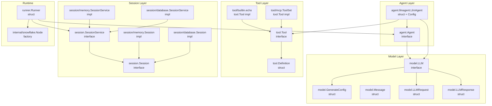
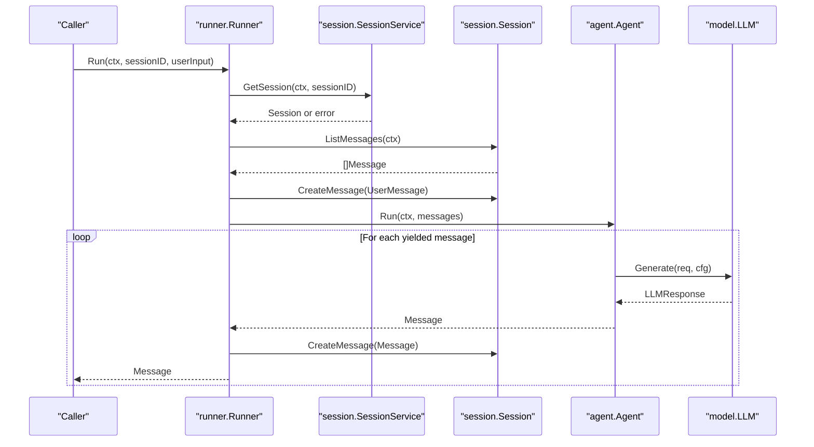
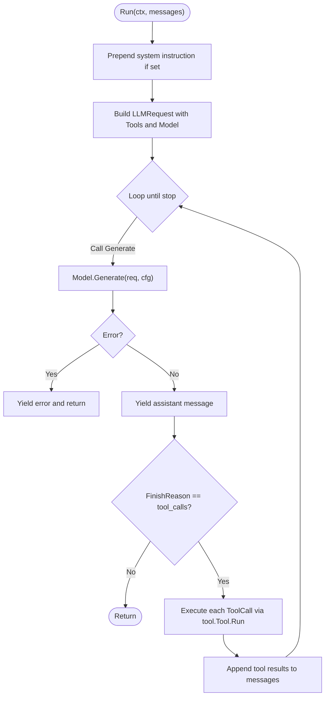
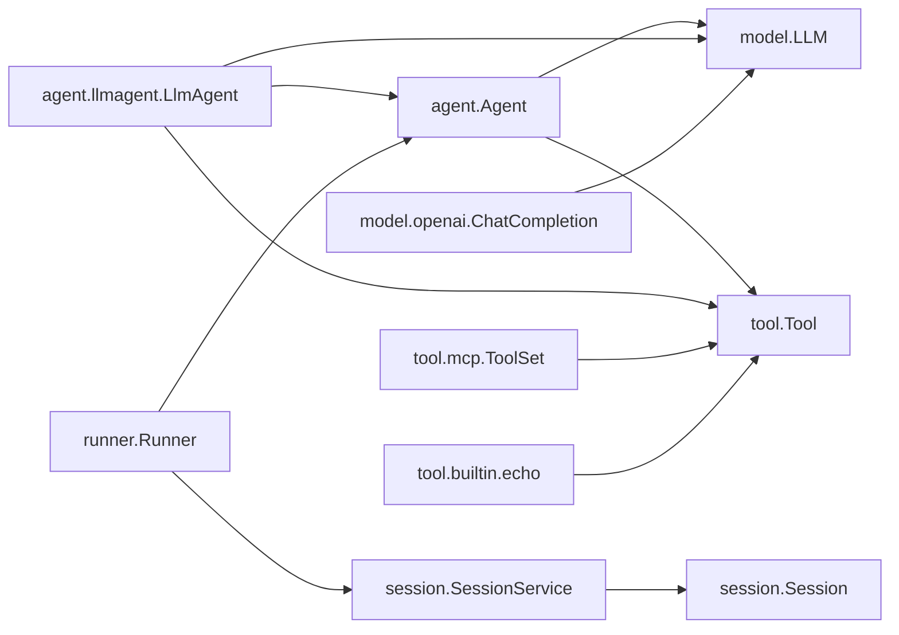

# API Reference

<cite>
**Referenced Files in This Document**
- [agent.go](file://agent/agent.go)
- [llmagent.go](file://agent/llmagent/llmagent.go)
- [model.go](file://model/model.go)
- [openai.go](file://model/openai/openai.go)
- [tool.go](file://tool/tool.go)
- [echo.go](file://tool/builtin/echo.go)
- [mcp.go](file://tool/mcp/mcp.go)
- [session_service.go](file://session/session_service.go)
- [session.go](file://session/session.go)
- [memory_session_service.go](file://session/memory/session_service.go)
- [memory_session.go](file://session/memory/session.go)
- [database_session_service.go](file://session/database/session_service.go)
- [database_session.go](file://session/database/session.go)
- [runner.go](file://runner/runner.go)
- [snowflake.go](file://internal/snowflake/snowflake.go)
- [main.go](file://examples/chat/main.go)
- [README.md](file://README.md)
</cite>

## Table of Contents
1. [Introduction](#introduction)
2. [Project Structure](#project-structure)
3. [Core Components](#core-components)
4. [Architecture Overview](#architecture-overview)
5. [Detailed Component Analysis](#detailed-component-analysis)
6. [Dependency Analysis](#dependency-analysis)
7. [Performance Considerations](#performance-considerations)
8. [Troubleshooting Guide](#troubleshooting-guide)
9. [Conclusion](#conclusion)
10. [Appendices](#appendices)

## Introduction
This document provides a comprehensive API reference for the Agent Development Kit (ADK). It covers public interfaces and methods for Agent, LLM, Tool, and SessionService, along with configuration structures, defaults, validation rules, error handling patterns, and practical usage examples. It also documents behavioral guarantees, thread-safety considerations, and versioning/deprecation information.

## Project Structure
The ADK is organized around four primary domains:
- Agent: Stateless orchestration of LLM interactions and tool execution loops.
- Model: Provider-agnostic LLM interface and shared message/request/response types.
- Tool: Provider-agnostic tool interface and built-in/MCP integrations.
- Session: Pluggable persistence for conversation histories with compaction support.

**Diagram sources**
- [agent.go:10-17](file://agent/agent.go#L10-L17)
- [llmagent.go:25-41](file://agent/llmagent/llmagent.go#L25-L41)
- [model.go:9-13](file://model/model.go#L9-L13)
- [model.go:62-79](file://model/model.go#L62-L79)
- [model.go:147-173](file://model/model.go#L147-L173)
- [model.go:183-191](file://model/model.go#L183-L191)
- [model.go:193-199](file://model/model.go#L193-L199)
- [tool.go:9-23](file://tool/tool.go#L9-L23)
- [echo.go:14-34](file://tool/builtin/echo.go#L14-L34)
- [mcp.go:15-80](file://tool/mcp/mcp.go#L15-L80)
- [session_service.go:5-9](file://session/session_service.go#L5-L9)
- [session.go:9-23](file://session/session.go#L9-L23)
- [memory_session_service.go:14-40](file://session/memory/session_service.go#L14-L40)
- [memory_session.go:18-85](file://session/memory/session.go#L18-L85)
- [database_session_service.go:23-48](file://session/database/session_service.go#L23-L48)
- [database_session.go:34-145](file://session/database/session.go#L34-L145)
- [runner.go:20-37](file://runner/runner.go#L20-L37)
- [snowflake.go:17-56](file://internal/snowflake/snowflake.go#L17-L56)

**Section sources**
- [README.md:65-82](file://README.md#L65-L82)

## Core Components
This section documents the public interfaces and their methods, parameters, return values, and error conditions.

### Agent
- Interface: agent.Agent
  - Methods:
    - Name() string
      - Returns the agent’s human-readable name.
    - Description() string
      - Returns the agent’s description.
    - Run(ctx context.Context, messages []model.Message) iter.Seq2[model.Message, error]
      - Executes the agent with the provided conversation history.
      - Yields each produced message (assistant replies, tool results, etc.) as it becomes available.
      - Iteration stops when the LLM signals completion or when the caller breaks.
      - Errors are yielded as the second element; iteration terminates upon encountering an error.
  - Behavioral guarantees:
    - Stateless: the agent does not retain memory between runs.
    - Streaming: messages are yielded incrementally via Go iterators.
  - Thread safety:
    - The interface itself is stateless; however, the underlying LLM implementation may impose concurrency constraints. Treat the Run iterator as single-use per goroutine unless documented otherwise by the LLM adapter.

**Section sources**
- [agent.go:10-17](file://agent/agent.go#L10-L17)

### LLM
- Interface: model.LLM
  - Methods:
    - Name() string
      - Returns the provider/model identifier used in requests.
    - Generate(ctx context.Context, req *model.LLMRequest, cfg *model.GenerateConfig) (*model.LLMResponse, error)
      - Sends a request to the provider and returns the first choice with usage and finish reason.
      - Parameters:
        - req: provider-agnostic request containing Model, Messages, and Tools.
        - cfg: optional provider-agnostic generation configuration.
      - Returns:
        - LLMResponse with Message, FinishReason, and Usage.
      - Errors:
        - Propagated from the underlying provider client or conversion logic.
- Request/Response Types:
  - model.LLMRequest
    - Fields:
      - Model: string
      - Messages: []model.Message
      - Tools: []tool.Tool
  - model.LLMResponse
    - Fields:
      - Message: model.Message
      - FinishReason: model.FinishReason
      - Usage: *model.TokenUsage
- Provider Implementation Example: model.openai.ChatCompletion
  - Methods:
    - New(apiKey, baseURL, modelName string) *ChatCompletion
      - Creates a client with optional base URL override for compatibility.
    - Name() string
    - Generate(ctx context.Context, req *model.LLMRequest, cfg *model.GenerateConfig) (*model.LLMResponse, error)
  - Notes:
    - Converts model.Message and tool.Tool to provider-specific structures.
    - Applies GenerateConfig mappings (temperature, reasoning effort, service tier, max tokens).
    - Supports reasoning content extraction from provider raw JSON when present.

**Section sources**
- [model.go:9-13](file://model/model.go#L9-L13)
- [model.go:183-191](file://model/model.go#L183-L191)
- [model.go:193-199](file://model/model.go#L193-L199)
- [openai.go:23-35](file://model/openai/openai.go#L23-L35)
- [openai.go:42-76](file://model/openai/openai.go#L42-L76)

### Tool
- Interface: tool.Tool
  - Methods:
    - Definition() tool.Definition
      - Returns metadata used by the LLM to understand and call the tool.
    - Run(ctx context.Context, toolCallID string, arguments string) (string, error)
      - Executes the tool with JSON-encoded arguments and returns a JSON string result.
- Definition
  - Fields:
    - Name: string
    - Description: string
    - InputSchema: *jsonschema.Schema
- Implementations:
  - tool/builtin/echo
    - NewEchoTool() tool.Tool
    - Definition(): returns a tool.Definition with a JSON schema for an echo request.
    - Run(...): parses arguments and returns the echoed string.
  - tool/mcp.ToolSet
    - NewToolSet(transport) *ToolSet
    - Connect(ctx context.Context) error
    - Tools(ctx context.Context) ([]tool.Tool, error)
    - Close() error
    - toolWrapper.Run(...): calls the MCP server and returns text content.

**Section sources**
- [tool.go:9-23](file://tool/tool.go#L9-L23)
- [echo.go:22-34](file://tool/builtin/echo.go#L22-L34)
- [echo.go:40-46](file://tool/builtin/echo.go#L40-L46)
- [mcp.go:22-33](file://tool/mcp/mcp.go#L22-L33)
- [mcp.go:35-43](file://tool/mcp/mcp.go#L35-L43)
- [mcp.go:45-72](file://tool/mcp/mcp.go#L45-L72)
- [mcp.go:74-80](file://tool/mcp/mcp.go#L74-L80)
- [mcp.go:92-109](file://tool/mcp/mcp.go#L92-L109)

### SessionService and Session
- SessionService
  - Methods:
    - CreateSession(ctx context.Context, sessionID int64) (Session, error)
    - DeleteSession(ctx context.Context, sessionID int64) error
    - GetSession(ctx context.Context, sessionID int64) (Session, error)
- Session
  - Methods:
    - GetSessionID() int64
    - CreateMessage(ctx context.Context, message *message.Message) error
    - GetMessages(ctx context.Context, limit, offset int64) ([]*message.Message, error)
    - ListMessages(ctx context.Context) ([]*message.Message, error)
    - ListCompactedMessages(ctx context.Context) ([]*message.Message, error)
    - DeleteMessage(ctx context.Context, messageID int64) error
    - CompactMessages(ctx context.Context, compactor func(ctx, []*message.Message) (*message.Message, error)) error
- Implementations:
  - session/memory
    - memorySessionService: in-memory registry of sessions.
    - memorySession: stores messages and compaction state in slices.
  - session/database
    - databaseSessionService: manages sessions via SQL queries.
    - databaseSession: persists messages and supports compaction with transactions.

**Section sources**
- [session_service.go:5-9](file://session/session_service.go#L5-L9)
- [session.go:9-23](file://session/session.go#L9-L23)
- [memory_session_service.go:14-40](file://session/memory/session_service.go#L14-L40)
- [memory_session.go:18-85](file://session/memory/session.go#L18-L85)
- [database_session_service.go:23-48](file://session/database/session_service.go#L23-L48)
- [database_session.go:34-145](file://session/database/session.go#L34-L145)

## Architecture Overview
The runtime composes an Agent with a SessionService and a Snowflake node to produce a streaming conversation loop. The Runner:
- Loads active messages from the Session.
- Appends the user’s input as a new message.
- Invokes the Agent’s Run iterator.
- Persists each yielded message and forwards it to the caller.

**Diagram sources**
- [runner.go:44-89](file://runner/runner.go#L44-L89)
- [session.go:11-17](file://session/session.go#L11-L17)
- [model.go:183-191](file://model/model.go#L183-L191)
- [model.go:193-199](file://model/model.go#L193-L199)

**Section sources**
- [runner.go:17-37](file://runner/runner.go#L17-L37)
- [README.md:35-62](file://README.md#L35-L62)

## Detailed Component Analysis

### Agent: LlmAgent
- Constructor
  - New(config Config) agent.Agent
    - Builds a lookup map from tool definitions for fast dispatch.
- Config
  - Fields:
    - Name: string
    - Description: string
    - Model: model.LLM
    - Tools: []tool.Tool
    - Instruction: string (prepended as a system message on each Run)
    - GenerateConfig: *model.GenerateConfig (optional)
- Behavior
  - Prepends system instruction if provided.
  - Calls Model.Generate in a loop until FinishReason is not tool_calls.
  - For each tool_call, resolves the tool by name and executes Run, then appends the tool result back into the message history.
  - Attaches Usage to the assistant message for persistence.

**Diagram sources**
- [llmagent.go:54-105](file://agent/llmagent/llmagent.go#L54-L105)
- [llmagent.go:107-127](file://agent/llmagent/llmagent.go#L107-L127)

**Section sources**
- [llmagent.go:13-41](file://agent/llmagent/llmagent.go#L13-L41)
- [llmagent.go:51-105](file://agent/llmagent/llmagent.go#L51-L105)

### Model: Message, LLMRequest, LLMResponse, GenerateConfig
- Roles and FinishReasons
  - Role: "system" | "user" | "assistant" | "tool"
  - FinishReason: "stop" | "tool_calls" | "length" | "content_filter"
- GenerateConfig
  - Fields:
    - Temperature: float64
    - ReasoningEffort: "none" | "minimal" | "low" | "medium" | "high" | "xhigh"
    - ServiceTier: "auto" | "default" | "flex" | "scale" | "priority"
    - MaxTokens: int64 (overrides provider default when > 0)
    - ThinkingBudget: int64 (provider-specific; ignored when EnableThinking is false or unset)
    - EnableThinking: *bool (nil leaves decision to provider; false maps to "none" when effort unset)
- Message
  - Fields:
    - Role, Name, Content, Parts, ReasoningContent, ToolCalls, ToolCallID, Usage
  - Multi-modal: when Parts is non-empty, it takes precedence over Content (currently supported for RoleUser).
- ToolCall
  - Fields:
    - ID, Name, Arguments (JSON), ThoughtSignature (opaque token for providers like Gemini)
- TokenUsage
  - PromptTokens, CompletionTokens, TotalTokens

**Section sources**
- [model.go:15-60](file://model/model.go#L15-L60)
- [model.go:62-79](file://model/model.go#L62-L79)
- [model.go:104-123](file://model/model.go#L104-L123)
- [model.go:125-138](file://model/model.go#L125-L138)
- [model.go:140-145](file://model/model.go#L140-L145)
- [model.go:147-173](file://model/model.go#L147-L173)
- [model.go:175-181](file://model/model.go#L175-L181)
- [model.go:183-191](file://model/model.go#L183-L191)
- [model.go:193-199](file://model/model.go#L193-L199)

### Tool: Echo and MCP
- Echo
  - Definition: Name="Echo", Description="A tool to echo request message."
  - InputSchema: JSON schema for an object with a "echo" field.
  - Run: Parses JSON arguments and returns the echoed string; returns error on parse failure.
- MCP
  - ToolSet:
    - Connect(ctx): establishes session with MCP server.
    - Tools(ctx): lists tools and wraps them with JSON schema conversion.
    - Close(): closes the session.
  - toolWrapper.Run:
    - Unmarshals arguments and calls the MCP server.
    - Returns text content; returns error if the tool reports an error.

**Section sources**
- [echo.go:22-34](file://tool/builtin/echo.go#L22-L34)
- [echo.go:40-46](file://tool/builtin/echo.go#L40-L46)
- [mcp.go:22-33](file://tool/mcp/mcp.go#L22-L33)
- [mcp.go:35-43](file://tool/mcp/mcp.go#L35-L43)
- [mcp.go:45-72](file://tool/mcp/mcp.go#L45-L72)
- [mcp.go:74-80](file://tool/mcp/mcp.go#L74-L80)
- [mcp.go:92-109](file://tool/mcp/mcp.go#L92-L109)

### SessionService and Session Implementations
- Memory
  - memorySessionService: stores sessions in a slice; GetSession returns nil when not found.
  - memorySession: stores active and compacted messages; supports pagination via GetMessages(limit, offset).
- Database
  - databaseSessionService: creates and deletes sessions; GetSession returns nil when not found.
  - databaseSession: persists messages with compacted_at semantics; compaction archives active messages and inserts a summary.

**Section sources**
- [memory_session_service.go:18-40](file://session/memory/session_service.go#L18-L40)
- [memory_session.go:30-85](file://session/memory/session.go#L30-L85)
- [database_session_service.go:27-48](file://session/database/session_service.go#L27-L48)
- [database_session.go:46-145](file://session/database/session.go#L46-L145)

### Runner
- Constructor
  - New(a agent.Agent, s session.SessionService) (*Runner, error)
  - Initializes a Snowflake node for unique IDs.
- Run
  - Loads active messages, appends user input, and streams agent output.
  - Persists each yielded message with a Snowflake ID and timestamps.
  - Terminates on error or when the agent stops producing messages.

**Section sources**
- [runner.go:26-37](file://runner/runner.go#L26-L37)
- [runner.go:44-89](file://runner/runner.go#L44-L89)
- [runner.go:92-101](file://runner/runner.go#L92-L101)
- [snowflake.go:17-56](file://internal/snowflake/snowflake.go#L17-L56)

## Dependency Analysis
- Cohesion and Coupling
  - Agent depends on LLM and Tool abstractions; LlmAgent composes tools by name.
  - Runner depends on Agent and SessionService; it orchestrates persistence and streaming.
  - OpenAI adapter depends on external provider SDK; MCP tool wrapper depends on MCP SDK.
- External Dependencies
  - OpenAI SDK, MCP SDK, JSON Schema, SQLx, sqlite3, Snowflake, testify.

**Diagram sources**
- [llmagent.go:25-41](file://agent/llmagent/llmagent.go#L25-L41)
- [runner.go:20-37](file://runner/runner.go#L20-L37)
- [openai.go:17-35](file://model/openai/openai.go#L17-L35)
- [mcp.go:15-33](file://tool/mcp/mcp.go#L15-L33)
- [echo.go:14-34](file://tool/builtin/echo.go#L14-L34)

**Section sources**
- [README.md:279-290](file://README.md#L279-L290)

## Performance Considerations
- Streaming: Use the iterator returned by Agent.Run to process messages incrementally and avoid buffering large histories.
- Tool Execution: Tool calls are executed sequentially within LlmAgent; consider batching or parallelization at higher layers if needed.
- Persistence: Runner persists each message immediately; ensure database sessions are tuned for write throughput.
- Reasoning and Thinking: Configure GenerateConfig thoughtfully; excessive reasoning effort or thinking toggles may increase latency and cost.

## Troubleshooting Guide
- Error Propagation Patterns
  - LlmAgent yields errors from Model.Generate and tool.Tool.Run as the second element of the iterator; stop iteration upon receiving an error.
  - Runner yields errors from SessionService.GetSession, Session.ListMessages, and Model.Generate.
- Common Errors
  - Tool not found: LlmAgent returns a RoleTool message with a “not found” error; ensure tool names match Definitions.
  - MCP tool call errors: toolWrapper.Run returns an error when the MCP server reports an error.
  - Session not found: memorySessionService.GetSession returns nil; databaseSessionService.GetSession returns nil when no rows.
- Recovery Strategies
  - Retry transient provider errors; implement backoff and circuit-breaking at the Runner level.
  - On tool errors, log the error and continue the loop; the agent will summarize tool results.
  - For compaction failures, reattempt compaction with a robust summarizer.

**Section sources**
- [llmagent.go:107-127](file://agent/llmagent/llmagent.go#L107-L127)
- [runner.go:44-89](file://runner/runner.go#L44-L89)
- [memory_session_service.go:34-40](file://session/memory/session_service.go#L34-L40)
- [database_session_service.go:37-48](file://session/database/session_service.go#L37-L48)
- [mcp.go:92-109](file://tool/mcp/mcp.go#L92-L109)

## Conclusion
This API reference documents the public interfaces and configurations of the ADK, including Agent, LLM, Tool, and SessionService. It outlines method signatures, parameters, return values, error handling, and practical usage patterns. The included diagrams and examples should help you integrate and extend the system safely and efficiently.

## Appendices

### Practical Usage Examples
- Creating an OpenAI LLM and an LlmAgent
  - See [README.md:87-112](file://README.md#L87-L112)
- Choosing a Session backend (memory vs database)
  - See [README.md:114-131](file://README.md#L114-L131)
- Running a conversation with Runner
  - See [README.md:132-153](file://README.md#L132-L153)
- Chat example with MCP tools
  - See [examples/chat/main.go:52-173](file://examples/chat/main.go#L52-L173)

### Versioning, Deprecation, and Migration
- Module path and Go version
  - Module: soasurs.dev/soasurs/adk
  - Minimum Go version: 1.26+
- Versioning
  - The project does not declare explicit semantic versioning metadata in the provided files.
- Deprecation
  - No deprecations are indicated in the provided files.
- Migration Guidance
  - Swap LLM implementations by replacing the model.LLM instance; keep Agent and Runner unchanged.
  - Replace SessionService implementations by swapping memory/database backends without changing Agent or Runner.
  - Tool definitions are provider-agnostic; migrate tools by updating tool.Definition and ensuring JSON schemas remain compatible.

**Section sources**
- [README.md:9-11](file://README.md#L9-L11)
- [README.md:279-290](file://README.md#L279-L290)