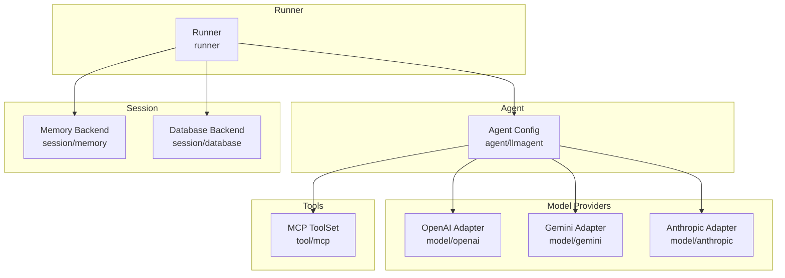
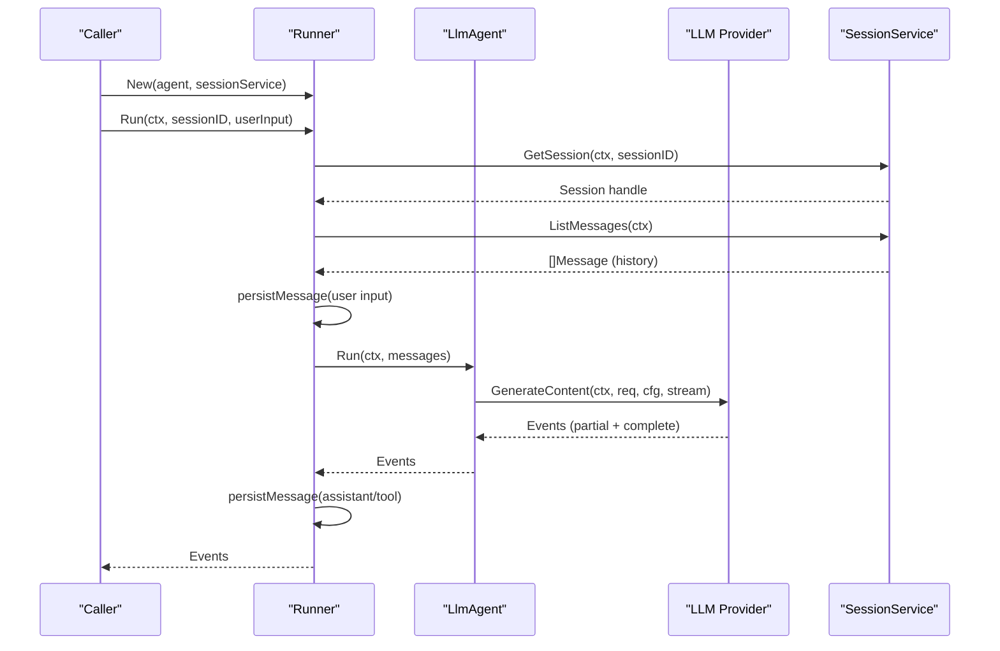
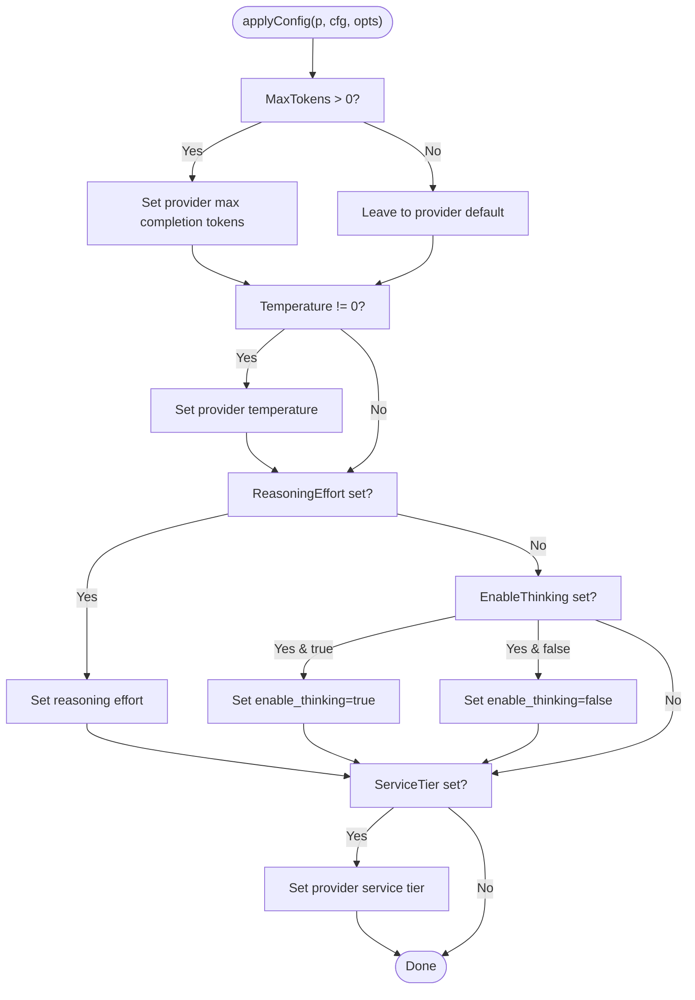
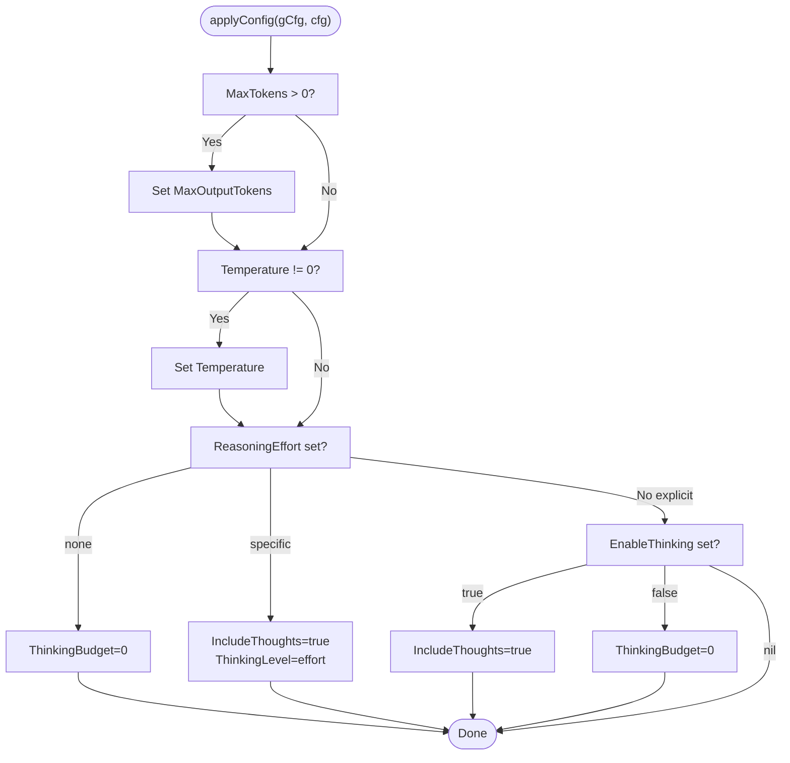
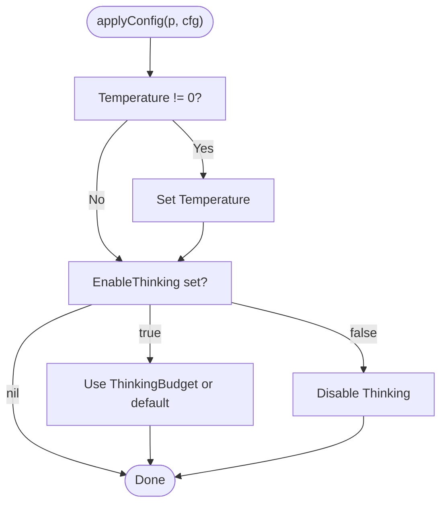
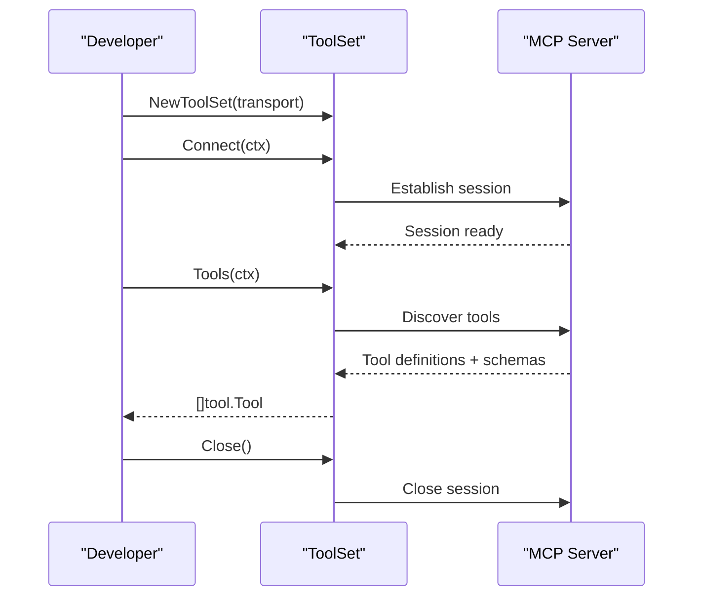
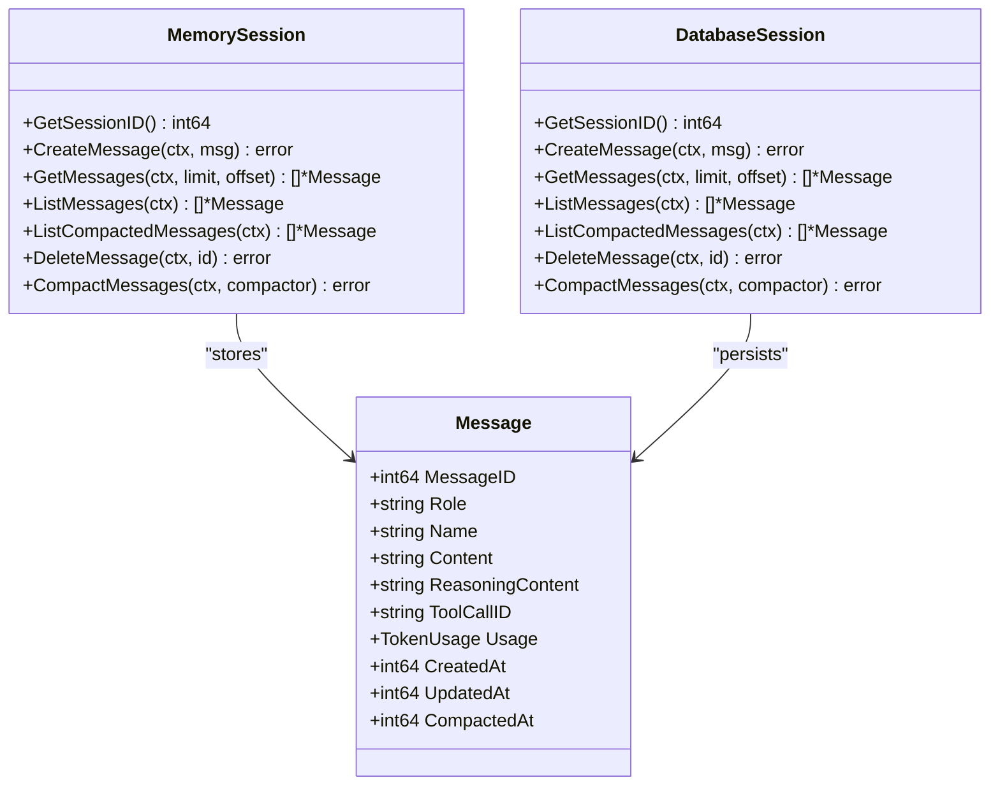
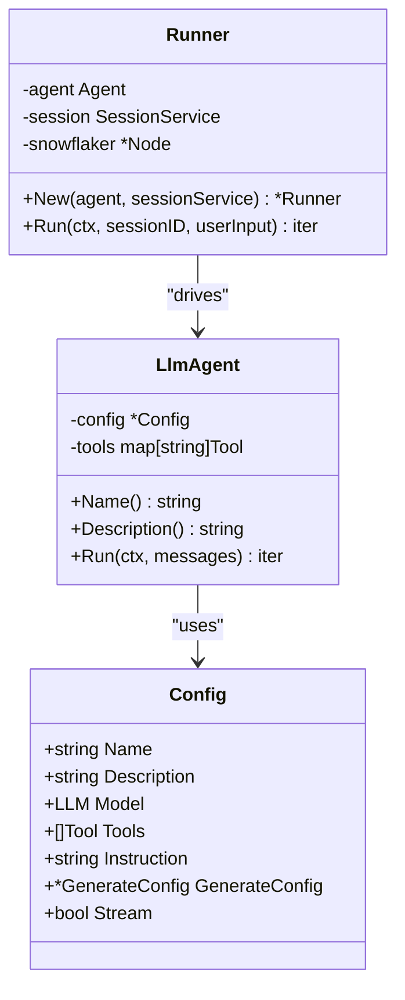
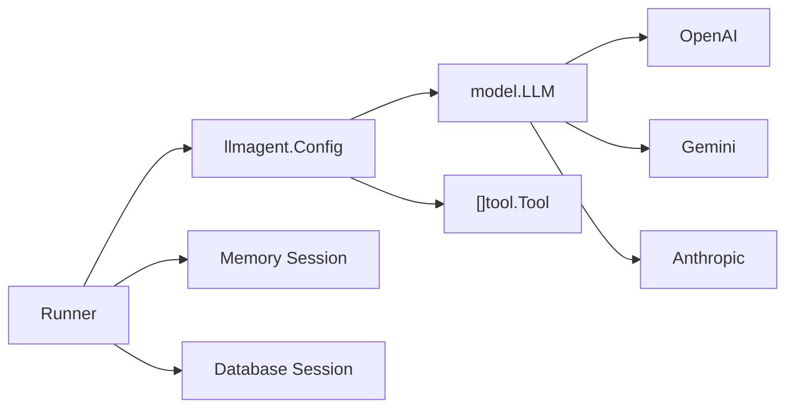

# Configuration Types

<cite>
**Referenced Files in This Document**
- [README.md](file://README.md)
- [model.go](file://model/model.go)
- [llmagent.go](file://agent/llmagent/llmagent.go)
- [openai.go](file://model/openai/openai.go)
- [gemini.go](file://model/gemini/gemini.go)
- [anthropic.go](file://model/anthropic/anthropic.go)
- [mcp.go](file://tool/mcp/mcp.go)
- [session.go](file://session/session.go)
- [memory_session.go](file://session/memory/session.go)
- [database_session.go](file://session/database/session.go)
- [runner.go](file://runner/runner.go)
</cite>

## Table of Contents
1. [Introduction](#introduction)
2. [Project Structure](#project-structure)
3. [Core Components](#core-components)
4. [Architecture Overview](#architecture-overview)
5. [Detailed Component Analysis](#detailed-component-analysis)
6. [Dependency Analysis](#dependency-analysis)
7. [Performance Considerations](#performance-considerations)
8. [Troubleshooting Guide](#troubleshooting-guide)
9. [Conclusion](#conclusion)
10. [Appendices](#appendices)

## Introduction
This document catalogs all configuration structures used throughout the ADK framework. It focuses on:
- LLM provider configurations for OpenAI, Gemini, and Anthropic, including API keys, model selection, and generation parameters
- MCP tool configuration with transport settings, authentication, and discovery mechanisms
- Session backend configurations for memory and database backends, including SQLite settings and connection parameters
- Runner configuration options and agent setup parameters
- Default values, validation rules, and environment variable mappings
- Configuration examples for different deployment scenarios and best practices for production setups

## Project Structure
The configuration surface spans several packages:
- Provider adapters under model/ (OpenAI, Gemini, Anthropic)
- Agent configuration under agent/llmagent/
- Tool integration under tool/mcp/
- Session backends under session/ (memory and database)
- Runner orchestration under runner/

**Diagram sources**
- [openai.go:25-37](file://model/openai/openai.go#L25-L37)
- [gemini.go:23-59](file://model/gemini/gemini.go#L23-L59)
- [anthropic.go:31-40](file://model/anthropic/anthropic.go#L31-L40)
- [llmagent.go:13-27](file://agent/llmagent/llmagent.go#L13-L27)
- [mcp.go:22-33](file://tool/mcp/mcp.go#L22-L33)
- [memory_session.go:18-24](file://session/memory/session.go#L18-L24)
- [database_session.go:34-41](file://session/database/session.go#L34-L41)
- [runner.go:26-37](file://runner/runner.go#L26-L37)

**Section sources**
- [README.md:65-82](file://README.md#L65-L82)
- [runner.go:17-37](file://runner/runner.go#L17-L37)

## Core Components
This section summarizes the primary configuration structures and their roles.

- Provider-agnostic generation configuration
  - Struct: model.GenerateConfig
  - Fields: Temperature, ReasoningEffort, ServiceTier, MaxTokens, ThinkingBudget, EnableThinking
  - Behavior: Provider adapters translate these fields to provider-specific knobs; zero values defer to provider defaults

- LLM provider adapters
  - OpenAI: New(apiKey, baseURL, modelName)
  - Gemini: New(ctx, apiKey, modelName) or NewVertexAI(ctx, project, location, modelName)
  - Anthropic: New(apiKey, modelName)

- Agent configuration
  - Struct: llmagent.Config
  - Fields: Name, Description, Model (provider LLM), Tools ([]tool.Tool), Instruction (system prompt), GenerateConfig (*model.GenerateConfig), Stream (bool)

- MCP tool configuration
  - Struct: tool.Definition (name, description, InputSchema)
  - ToolSet: NewToolSet(transport), Connect(ctx), Tools(ctx), Close()

- Session backends
  - Memory: NewMemorySession(sessionID)
  - Database: NewDatabaseSession(ctx, sqlx.DB, sessionID)

- Runner
  - Constructor: runner.New(agent.Agent, session.SessionService)
  - Run: orchestrates session loading, agent execution, and persistence

**Section sources**
- [model.go:67-84](file://model/model.go#L67-L84)
- [openai.go:25-37](file://model/openai/openai.go#L25-L37)
- [gemini.go:23-59](file://model/gemini/gemini.go#L23-L59)
- [anthropic.go:31-40](file://model/anthropic/anthropic.go#L31-L40)
- [llmagent.go:13-27](file://agent/llmagent/llmagent.go#L13-L27)
- [mcp.go:15-33](file://tool/mcp/mcp.go#L15-L33)
- [memory_session.go:18-24](file://session/memory/session.go#L18-L24)
- [database_session.go:34-41](file://session/database/session.go#L34-L41)
- [runner.go:26-37](file://runner/runner.go#L26-L37)

## Architecture Overview
The configuration flow ties together providers, agents, tools, and sessions through the Runner.

**Diagram sources**
- [runner.go:44-90](file://runner/runner.go#L44-L90)
- [llmagent.go:59-125](file://agent/llmagent/llmagent.go#L59-L125)
- [model.go:10-18](file://model/model.go#L10-L18)

**Section sources**
- [runner.go:17-37](file://runner/runner.go#L17-L37)
- [llmagent.go:55-125](file://agent/llmagent/llmagent.go#L55-L125)

## Detailed Component Analysis

### LLM Provider Configurations

#### OpenAI Adapter
- API key and base URL
  - API key is required; base URL is optional and overrides the default endpoint for OpenAI-compatible services
  - Environment variable mapping: OPENAI_API_KEY
- Model selection
  - The adapter stores the model name and uses it as the default Model identifier in requests
- Generation parameters
  - MaxTokens: maps to provider’s max completion tokens
  - Temperature: maps to provider’s temperature
  - ReasoningEffort: maps to provider’s reasoning effort level; when EnableThinking is false and no explicit effort is set, maps to “none”
  - EnableThinking: when set and no explicit reasoning effort is provided, injects a boolean toggle for providers that use a toggle instead of effort level
  - ServiceTier: maps to provider’s service tier when supported

**Diagram sources**
- [openai.go:279-304](file://model/openai/openai.go#L279-L304)

**Section sources**
- [openai.go:25-37](file://model/openai/openai.go#L25-L37)
- [openai.go:279-304](file://model/openai/openai.go#L279-L304)
- [README.md:87-96](file://README.md#L87-L96)

#### Gemini Adapter
- API key and backend selection
  - Gemini API: New(ctx, apiKey, modelName)
  - Vertex AI: NewVertexAI(ctx, project, location, modelName)
  - Authentication for Vertex AI uses Application Default Credentials (ADC)
- Model selection
  - The adapter stores the model name and uses it as the default Model identifier in requests
- Generation parameters
  - MaxTokens: maps to provider’s max output tokens
  - Temperature: maps to provider’s temperature
  - ReasoningEffort and EnableThinking: mapped to ThinkingConfig; explicit effort level takes priority; otherwise EnableThinking toggles thoughts or disables with a zero budget
  - ServiceTier: not directly supported by this adapter

**Diagram sources**
- [gemini.go:353-384](file://model/gemini/gemini.go#L353-L384)

**Section sources**
- [gemini.go:23-59](file://model/gemini/gemini.go#L23-L59)
- [gemini.go:353-384](file://model/gemini/gemini.go#L353-L384)

#### Anthropic Adapter
- API key
  - API key is required; base URL is not exposed by the constructor shown here
- Model selection
  - The adapter stores the model name and uses it as the default Model identifier in requests
- Generation parameters
  - MaxTokens: defaults to a provider-specific default when not set; overridden by cfg.MaxTokens
  - Temperature: maps to provider’s temperature
  - EnableThinking: maps to provider’s ThinkingConfig; when enabled, a thinking budget is applied (default or cfg.ThinkingBudget)
  - ReasoningEffort: not directly supported by this adapter; EnableThinking is used instead

**Diagram sources**
- [anthropic.go:242-260](file://model/anthropic/anthropic.go#L242-L260)

**Section sources**
- [anthropic.go:31-40](file://model/anthropic/anthropic.go#L31-L40)
- [anthropic.go:242-260](file://model/anthropic/anthropic.go#L242-L260)

### MCP Tool Configuration
- Transport
  - Construct a transport (e.g., stdio) and pass it to NewToolSet
- Authentication
  - Authentication is handled by the MCP server; the client identifies itself with a name/version
- Discovery
  - Connect establishes a session
  - Tools enumerates tools and converts their input schemas to JSON Schema for the agent
- Lifecycle
  - Connect -> Tools -> Run -> Close

**Diagram sources**
- [mcp.go:22-43](file://tool/mcp/mcp.go#L22-L43)
- [mcp.go:45-72](file://tool/mcp/mcp.go#L45-L72)
- [mcp.go:74-80](file://tool/mcp/mcp.go#L74-L80)

**Section sources**
- [mcp.go:15-33](file://tool/mcp/mcp.go#L15-L33)
- [mcp.go:45-72](file://tool/mcp/mcp.go#L45-L72)
- [mcp.go:92-109](file://tool/mcp/mcp.go#L92-L109)

### Session Backend Configurations
- Memory backend
  - Zero configuration; stores all messages in-memory and supports compaction by replacing active messages with a summary
- Database backend (SQLite)
  - Requires a pre-configured sqlx.DB connection
  - Creates a session row and persists messages with fields for role, name, content, reasoning content, tool calls, token usage, timestamps, and compaction markers
  - Supports pagination via GetMessages(limit, offset) and listing via ListMessages and ListCompactedMessages

**Diagram sources**
- [memory_session.go:12-24](file://session/memory/session.go#L12-L24)
- [database_session.go:26-32](file://session/database/session.go#L26-L32)
- [session.go:9-23](file://session/session.go#L9-L23)

**Section sources**
- [memory_session.go:18-86](file://session/memory/session.go#L18-L86)
- [database_session.go:34-146](file://session/database/session.go#L34-L146)
- [session.go:9-23](file://session/session.go#L9-L23)

### Runner Configuration Options and Agent Setup
- Runner
  - New(agent, sessionService) initializes the Runner with a snowflake node for message IDs
  - Run(ctx, sessionID, userInput) orchestrates session retrieval, message persistence, agent execution, and streaming
- Agent (LlmAgent)
  - Config fields: Name, Description, Model (LLM), Tools ([]Tool), Instruction (system prompt), GenerateConfig, Stream
  - Run prepends the system Instruction, builds an LLMRequest, and loops until the LLM stops requesting tools
  - When Stream is true, partial events are yielded during generation; tool results are yielded as complete events

**Diagram sources**
- [runner.go:20-37](file://runner/runner.go#L20-L37)
- [llmagent.go:29-45](file://agent/llmagent/llmagent.go#L29-L45)
- [llmagent.go:13-27](file://agent/llmagent/llmagent.go#L13-L27)

**Section sources**
- [runner.go:26-37](file://runner/runner.go#L26-L37)
- [runner.go:44-90](file://runner/runner.go#L44-L90)
- [llmagent.go:55-125](file://agent/llmagent/llmagent.go#L55-L125)

## Dependency Analysis
- Provider adapters depend on external SDKs and map provider-agnostic GenerateConfig to provider-specific parameters
- Agent depends on model.LLM and tool.Tool definitions
- Runner depends on agent.Agent and session.SessionService
- Session backends encapsulate persistence details behind a simple interface

**Diagram sources**
- [llmagent.go:13-27](file://agent/llmagent/llmagent.go#L13-L27)
- [openai.go:19-42](file://model/openai/openai.go#L19-L42)
- [gemini.go:17-64](file://model/gemini/gemini.go#L17-L64)
- [anthropic.go:25-45](file://model/anthropic/anthropic.go#L25-L45)
- [runner.go:20-37](file://runner/runner.go#L20-L37)
- [memory_session.go:12-24](file://session/memory/session.go#L12-L24)
- [database_session.go:26-32](file://session/database/session.go#L26-L32)

**Section sources**
- [llmagent.go:13-27](file://agent/llmagent/llmagent.go#L13-L27)
- [runner.go:20-37](file://runner/runner.go#L20-L37)

## Performance Considerations
- Streaming
  - Enabling stream in the agent yields partial events, reducing perceived latency for long generations
- Token limits and budgets
  - Set MaxTokens and ThinkingBudget thoughtfully to balance quality and cost
- Compaction
  - Use soft compaction to archive older messages without deletion, keeping active lists manageable
- Database tuning
  - Ensure appropriate indexing on timestamps and compacted_at flags for efficient queries

[No sources needed since this section provides general guidance]

## Troubleshooting Guide
- OpenAI
  - Verify API key and model name; check provider defaults when values are omitted
  - For reasoning toggles, ensure EnableThinking is set appropriately when providers require a boolean toggle
- Gemini
  - Confirm backend selection (Gemini API vs Vertex AI) and credentials for Vertex AI
  - Validate that ReasoningEffort or EnableThinking is set as required by the target model
- Anthropic
  - Ensure MaxTokens is set if the provider enforces minimums; confirm EnableThinking and budget values
- MCP
  - Confirm transport connectivity and tool discovery; inspect tool input schemas for mismatches
- Sessions
  - Memory backend grows unbounded; consider compaction or switch to database backend for persistence
  - Database backend requires a working sqlx.DB connection and proper schema initialization

**Section sources**
- [openai.go:279-304](file://model/openai/openai.go#L279-L304)
- [gemini.go:353-384](file://model/gemini/gemini.go#L353-L384)
- [anthropic.go:242-260](file://model/anthropic/anthropic.go#L242-L260)
- [mcp.go:45-72](file://tool/mcp/mcp.go#L45-L72)
- [memory_session.go:70-85](file://session/memory/session.go#L70-L85)
- [database_session.go:97-145](file://session/database/session.go#L97-L145)

## Conclusion
ADK’s configuration model centers on a small set of provider-agnostic structures:
- model.GenerateConfig for generation parameters
- llmagent.Config for agent setup
- Provider constructors for API keys and model selection
- MCP ToolSet for dynamic tool discovery
- Session backends for memory and persistent storage

Adopting these structures consistently enables portable agent logic across providers and environments.

[No sources needed since this section summarizes without analyzing specific files]

## Appendices

### Configuration Reference Tables

- model.GenerateConfig
  - Fields: Temperature (float64), ReasoningEffort (enum), ServiceTier (enum), MaxTokens (int64), ThinkingBudget (int64), EnableThinking (*bool)
  - Notes: Zero values defer to provider defaults; EnableThinking can override reasoning effort mapping when effort is not set

- llmagent.Config
  - Fields: Name (string), Description (string), Model (model.LLM), Tools ([]tool.Tool), Instruction (string), GenerateConfig (*model.GenerateConfig), Stream (bool)
  - Notes: Instruction becomes a system message prepended to every run; Stream enables incremental output

- OpenAI
  - Constructor parameters: apiKey (required), baseURL (optional), modelName (required)
  - Environment variable: OPENAI_API_KEY

- Gemini
  - Constructors: New(ctx, apiKey, modelName) or NewVertexAI(ctx, project, location, modelName)
  - Notes: Vertex AI uses ADC; Gemini API uses API key

- Anthropic
  - Constructor parameters: apiKey (required), modelName (required)
  - Notes: Uses provider defaults for MaxTokens when not set; EnableThinking controls thinking behavior

- MCP ToolSet
  - Methods: NewToolSet(transport), Connect(ctx), Tools(ctx), Close()
  - Notes: Tools discovery converts server schemas to JSON Schema for the agent

- Session Backends
  - Memory: NewMemorySession(sessionID)
  - Database: NewDatabaseSession(ctx, sqlx.DB, sessionID)

- Runner
  - Constructor: runner.New(agent.Agent, session.SessionService)
  - Method: Run(ctx, sessionID, userInput) returns an iterator of model.Message

**Section sources**
- [model.go:67-84](file://model/model.go#L67-L84)
- [llmagent.go:13-27](file://agent/llmagent/llmagent.go#L13-L27)
- [openai.go:25-37](file://model/openai/openai.go#L25-L37)
- [gemini.go:23-59](file://model/gemini/gemini.go#L23-L59)
- [anthropic.go:31-40](file://model/anthropic/anthropic.go#L31-L40)
- [mcp.go:22-33](file://tool/mcp/mcp.go#L22-L33)
- [memory_session.go:18-24](file://session/memory/session.go#L18-L24)
- [database_session.go:34-41](file://session/database/session.go#L34-L41)
- [runner.go:26-37](file://runner/runner.go#L26-L37)

### Example Scenarios and Best Practices

- Minimal OpenAI setup
  - Create provider with API key and model name
  - Build agent with a system instruction and default generation config
  - Use memory session for ephemeral runs or database session for persistence

- Gemini with Vertex AI
  - Use NewVertexAI with project, location, and model name
  - Configure ADC for authentication
  - Tune reasoning effort or enable thinking via GenerateConfig

- MCP integration
  - Create a transport (e.g., stdio), connect, discover tools, and pass them to the agent
  - Ensure tool schemas are valid JSON Schema

- Production considerations
  - Set MaxTokens and ThinkingBudget to control costs
  - Use database sessions for durability and pagination
  - Enable streaming for responsive UX
  - Monitor token usage via model.TokenUsage

**Section sources**
- [README.md:87-153](file://README.md#L87-L153)
- [gemini.go:40-59](file://model/gemini/gemini.go#L40-L59)
- [mcp.go:22-43](file://tool/mcp/mcp.go#L22-L43)
- [database_session.go:34-41](file://session/database/session.go#L34-L41)