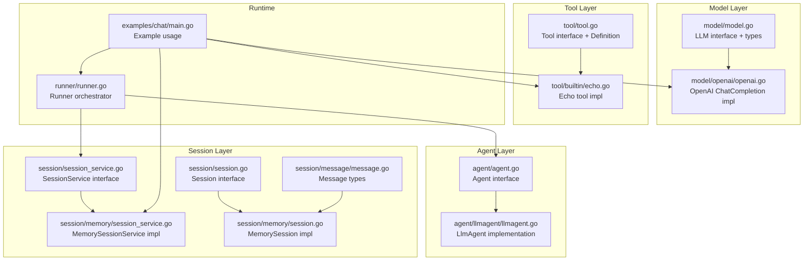
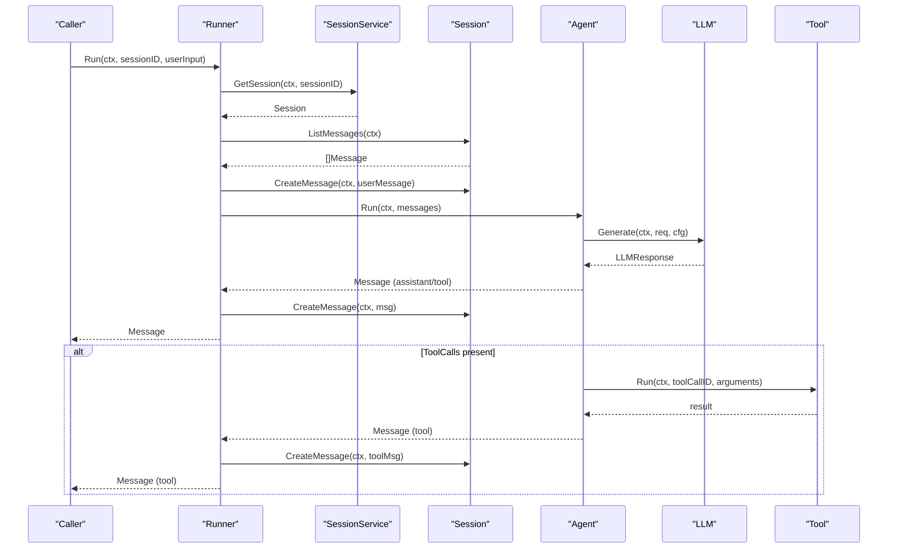
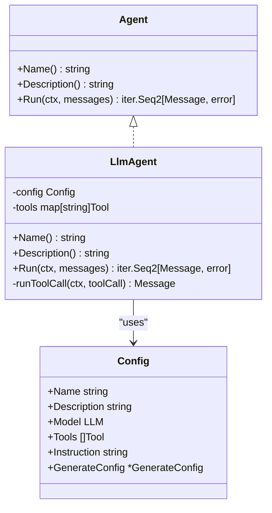
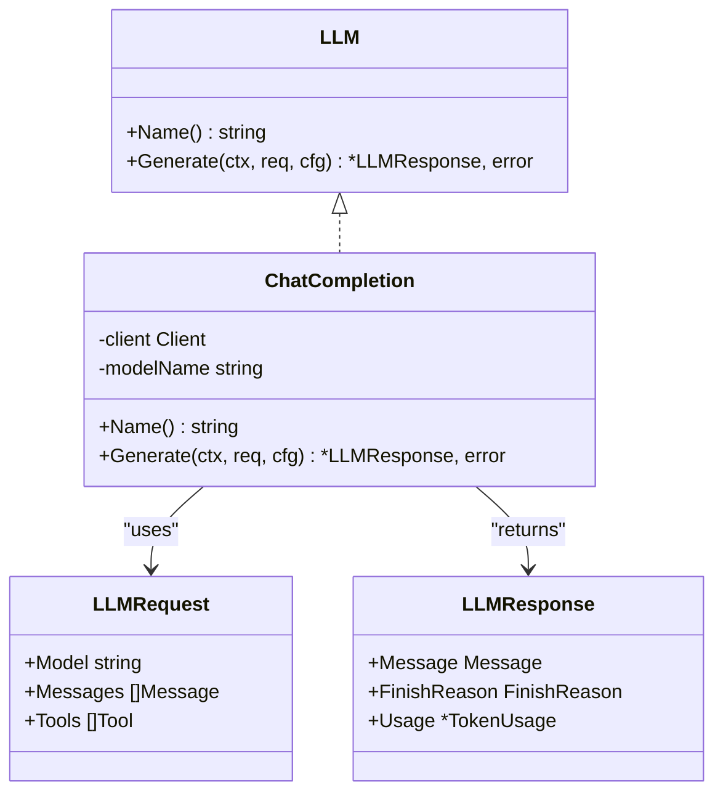
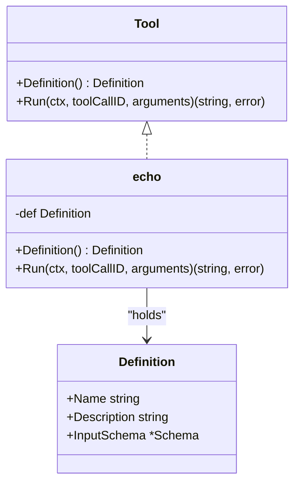
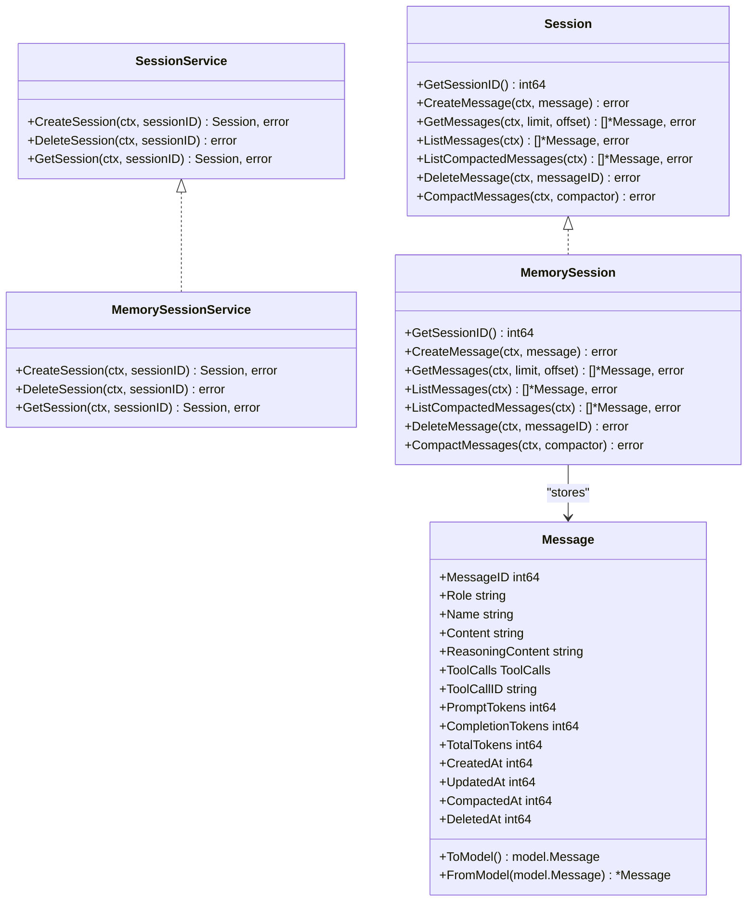
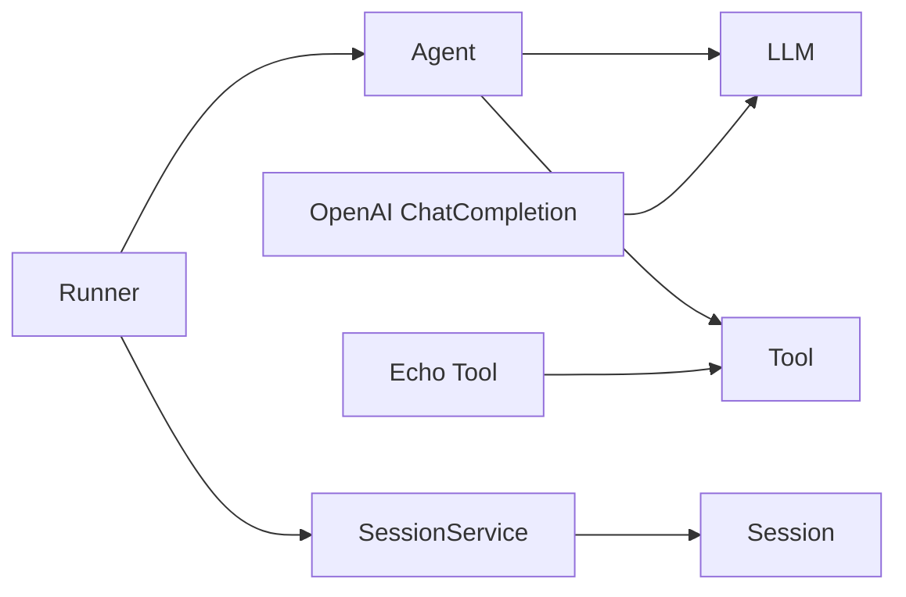
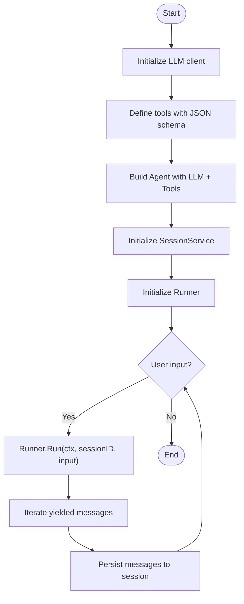

# Core Interfaces

<cite>
**Referenced Files in This Document**
- [agent.go](file://agent/agent.go)
- [llmagent.go](file://agent/llmagent/llmagent.go)
- [model.go](file://model/model.go)
- [openai.go](file://model/openai/openai.go)
- [tool.go](file://tool/tool.go)
- [echo.go](file://tool/builtin/echo.go)
- [session_service.go](file://session/session_service.go)
- [session.go](file://session/session.go)
- [memory_session_service.go](file://session/memory/session_service.go)
- [memory_session.go](file://session/memory/session.go)
- [message.go](file://session/message/message.go)
- [runner.go](file://runner/runner.go)
- [main.go](file://examples/chat/main.go)
</cite>

## Table of Contents
1. [Introduction](#introduction)
2. [Project Structure](#project-structure)
3. [Core Components](#core-components)
4. [Architecture Overview](#architecture-overview)
5. [Detailed Component Analysis](#detailed-component-analysis)
6. [Dependency Analysis](#dependency-analysis)
7. [Performance Considerations](#performance-considerations)
8. [Troubleshooting Guide](#troubleshooting-guide)
9. [Conclusion](#conclusion)
10. [Appendices](#appendices)

## Introduction
This document provides comprehensive API documentation for the core interfaces that form the foundation of the ADK framework. It covers:
- Agent interface with Name(), Description(), and Run() methods, including context handling and iterator patterns
- LLM interface for provider-agnostic message processing and response generation
- Tool interface with execution patterns, JSON schema validation, and parameter handling
- SessionService interface with CRUD operations, pagination, and message management

For each interface, we specify method signatures, parameter descriptions, return value specifications, and error conditions. We also include practical examples demonstrating implementation and usage patterns.

## Project Structure
The ADK framework organizes its core interfaces and implementations by feature domains:
- agent: Defines the Agent interface and concrete agents (e.g., LlmAgent)
- model: Defines the LLM interface and provider-agnostic message/response types
- tool: Defines the Tool interface and tool definitions
- session: Defines Session and SessionService interfaces plus in-memory implementations
- runner: Orchestrates Agent and SessionService for end-to-end conversation runs
- examples: Demonstrates usage with a concrete LLM provider and MCP tools

**Diagram sources**
- [agent.go:10-17](file://agent/agent.go#L10-L17)
- [llmagent.go:25-41](file://agent/llmagent/llmagent.go#L25-L41)
- [model.go:9-13](file://model/model.go#L9-L13)
- [openai.go:17-35](file://model/openai/openai.go#L17-L35)
- [tool.go:17-23](file://tool/tool.go#L17-L23)
- [echo.go:14-34](file://tool/builtin/echo.go#L14-L34)
- [session_service.go:5-9](file://session/session_service.go#L5-L9)
- [session.go:9-23](file://session/session.go#L9-L23)
- [memory_session_service.go:14-16](file://session/memory/session_service.go#L14-L16)
- [memory_session.go:18-24](file://session/memory/session.go#L18-L24)
- [message.go:49-73](file://session/message/message.go#L49-L73)
- [runner.go:20-37](file://runner/runner.go#L20-L37)
- [main.go:52-123](file://examples/chat/main.go#L52-L123)

**Section sources**
- [agent.go:10-17](file://agent/agent.go#L10-L17)
- [model.go:9-13](file://model/model.go#L9-L13)
- [tool.go:17-23](file://tool/tool.go#L17-L23)
- [session_service.go:5-9](file://session/session_service.go#L5-L9)
- [session.go:9-23](file://session/session.go#L9-L23)
- [runner.go:20-37](file://runner/runner.go#L20-L37)
- [main.go:52-123](file://examples/chat/main.go#L52-L123)

## Core Components
This section documents the four core interfaces and their responsibilities.

- Agent interface
  - Purpose: Encapsulates a stateless conversational agent that yields messages as they are produced.
  - Methods:
    - Name() string
    - Description() string
    - Run(ctx context.Context, messages []model.Message) iter.Seq2[model.Message, error]
  - Notes:
    - Run returns an iterator that yields model.Message and error pairs.
    - Iteration continues until the sequence ends or the caller breaks early.
    - Context is used for cancellation and timeouts.

- LLM interface
  - Purpose: Provider-agnostic interface for interacting with a large language model.
  - Methods:
    - Name() string
    - Generate(ctx context.Context, req *model.LLMRequest, cfg *model.GenerateConfig) (*model.LLMResponse, error)
  - Notes:
    - LLMRequest carries Model, Messages, and Tools.
    - LLMResponse carries Message, FinishReason, and Usage.

- Tool interface
  - Purpose: Provider-agnostic interface for tools callable by the LLM.
  - Methods:
    - Definition() tool.Definition
    - Run(ctx context.Context, toolCallID string, arguments string) (string, error)
  - Notes:
    - Definition includes Name, Description, and InputSchema.
    - Arguments is a JSON-encoded string of tool parameters.

- SessionService interface
  - Purpose: Manages sessions and provides CRUD operations for messages.
  - Methods:
    - CreateSession(ctx context.Context, sessionID int64) (Session, error)
    - DeleteSession(ctx context.Context, sessionID int64) error
    - GetSession(ctx context.Context, sessionID int64) (Session, error)

- Session interface
  - Purpose: Manages message lifecycle within a session.
  - Methods:
    - GetSessionID() int64
    - CreateMessage(ctx context.Context, message *message.Message) error
    - GetMessages(ctx context.Context, limit, offset int64) ([]*message.Message, error)
    - ListMessages(ctx context.Context) ([]*message.Message, error)
    - ListCompactedMessages(ctx context.Context) ([]*message.Message, error)
    - DeleteMessage(ctx context.Context, messageID int64) error
    - CompactMessages(ctx context.Context, compactor func(context.Context, []*message.Message) (*message.Message, error)) error

**Section sources**
- [agent.go:10-17](file://agent/agent.go#L10-L17)
- [model.go:9-13](file://model/model.go#L9-L13)
- [tool.go:17-23](file://tool/tool.go#L17-L23)
- [session_service.go:5-9](file://session/session_service.go#L5-L9)
- [session.go:9-23](file://session/session.go#L9-L23)

## Architecture Overview
The ADK runtime composes the core interfaces to deliver a provider-agnostic conversational pipeline:
- Runner loads session history, appends user input, invokes Agent.Run, persists yielded messages, and yields them to the caller.
- Agent (e.g., LlmAgent) delegates to an LLM implementation (e.g., OpenAI ChatCompletion) and orchestrates tool calls.
- Tools are described via JSON schema and executed with validated parameters.

**Diagram sources**
- [runner.go:44-90](file://runner/runner.go#L44-L90)
- [session_service.go:5-9](file://session/session_service.go#L5-L9)
- [session.go:9-23](file://session/session.go#L9-L23)
- [agent.go:10-17](file://agent/agent.go#L10-L17)
- [llmagent.go:51-105](file://agent/llmagent/llmagent.go#L51-L105)
- [model.go:9-13](file://model/model.go#L9-L13)
- [openai.go:42-76](file://model/openai/openai.go#L42-L76)
- [tool.go:17-23](file://tool/tool.go#L17-L23)

## Detailed Component Analysis

### Agent Interface
- Purpose: Define a stateless agent that yields conversation messages as they are produced.
- Methods:
  - Name() string
    - Returns the agent’s display name.
  - Description() string
    - Returns a human-readable description of the agent’s purpose.
  - Run(ctx context.Context, messages []model.Message) iter.Seq2[model.Message, error]
    - Executes the agent with the provided conversation history.
    - Yields each produced message (assistant replies, tool results, etc.) along with potential errors.
    - Iteration ends when the sequence completes or the caller stops iterating.
    - Context supports cancellation and timeout propagation.

Implementation example:
- LlmAgent implements Agent by delegating to an LLM, managing tool calls, and yielding messages.

**Diagram sources**
- [agent.go:10-17](file://agent/agent.go#L10-L17)
- [llmagent.go:13-41](file://agent/llmagent/llmagent.go#L13-L41)
- [llmagent.go:51-127](file://agent/llmagent/llmagent.go#L51-L127)

Practical usage:
- See the example chat application that constructs an Agent and uses Runner to drive conversations.

**Section sources**
- [agent.go:10-17](file://agent/agent.go#L10-L17)
- [llmagent.go:51-105](file://agent/llmagent/llmagent.go#L51-L105)
- [main.go:101-123](file://examples/chat/main.go#L101-L123)

### LLM Interface
- Purpose: Provider-agnostic interface for interacting with a large language model.
- Methods:
  - Name() string
    - Returns the model identifier used for requests.
  - Generate(ctx context.Context, req *model.LLMRequest, cfg *model.GenerateConfig) (*model.LLMResponse, error)
    - Sends a request to the underlying provider and returns a standardized response.
    - Context supports cancellation and timeout propagation.

Key types:
- model.LLMRequest
  - Model: string
  - Messages: []model.Message
  - Tools: []tool.Tool
- model.LLMResponse
  - Message: model.Message
  - FinishReason: model.FinishReason
  - Usage: *model.TokenUsage

Provider implementation example:
- OpenAI ChatCompletion implements model.LLM by converting ADK types to provider-specific parameters, invoking the provider API, and converting the response back to ADK types.

**Diagram sources**
- [model.go:9-13](file://model/model.go#L9-L13)
- [openai.go:17-35](file://model/openai/openai.go#L17-L35)
- [openai.go:42-76](file://model/openai/openai.go#L42-L76)
- [model.go:183-199](file://model/model.go#L183-L199)

Practical usage:
- The example chat application constructs an OpenAI LLM client and passes it to LlmAgent.

**Section sources**
- [model.go:9-13](file://model/model.go#L9-L13)
- [model.go:183-199](file://model/model.go#L183-L199)
- [openai.go:42-76](file://model/openai/openai.go#L42-L76)
- [main.go:55-66](file://examples/chat/main.go#L55-L66)

### Tool Interface
- Purpose: Provider-agnostic interface for tools callable by the LLM.
- Methods:
  - Definition() tool.Definition
    - Returns the tool’s metadata used by the LLM to understand and call the tool.
  - Run(ctx context.Context, toolCallID string, arguments string) (string, error)
    - Executes the tool with the given arguments JSON string and returns the result as a string.
    - Context supports cancellation and timeout propagation.

Key types:
- tool.Definition
  - Name: string
  - Description: string
  - InputSchema: *jsonschema.Schema
- tool.Tool
  - Definition(): Definition
  - Run(ctx, toolCallID, arguments): (string, error)

Implementation example:
- Echo tool demonstrates building a JSON schema from a Go struct and validating/processing arguments.

**Diagram sources**
- [tool.go:17-23](file://tool/tool.go#L17-L23)
- [echo.go:14-34](file://tool/builtin/echo.go#L14-L34)
- [echo.go:36-46](file://tool/builtin/echo.go#L36-L46)

Practical usage:
- The example chat application loads MCP tools and passes them to LlmAgent.

**Section sources**
- [tool.go:17-23](file://tool/tool.go#L17-L23)
- [echo.go:14-46](file://tool/builtin/echo.go#L14-L46)
- [main.go:82-98](file://examples/chat/main.go#L82-L98)

### SessionService and Session Interfaces
- SessionService
  - Methods:
    - CreateSession(ctx context.Context, sessionID int64) (Session, error)
    - DeleteSession(ctx context.Context, sessionID int64) error
    - GetSession(ctx context.Context, sessionID int64) (Session, error)
- Session
  - Methods:
    - GetSessionID() int64
    - CreateMessage(ctx context.Context, message *message.Message) error
    - GetMessages(ctx context.Context, limit, offset int64) ([]*message.Message, error)
    - ListMessages(ctx context.Context) ([]*message.Message, error)
    - ListCompactedMessages(ctx context.Context) ([]*message.Message, error)
    - DeleteMessage(ctx context.Context, messageID int64) error
    - CompactMessages(ctx context.Context, compactor func(context.Context, []*message.Message) (*message.Message, error)) error

Message types:
- session/message.Message
  - Fields include identifiers, roles, content, reasoning content, tool calls, token usage, timestamps, and compaction markers.
  - Conversion helpers: ToModel() and FromModel() bridge between persisted and model.Message.

In-memory implementations:
- MemorySessionService and MemorySession provide a simple, in-memory store with basic CRUD and pagination.

**Diagram sources**
- [session_service.go:5-9](file://session/session_service.go#L5-L9)
- [session.go:9-23](file://session/session.go#L9-L23)
- [memory_session_service.go:14-16](file://session/memory/session_service.go#L14-L16)
- [memory_session.go:18-24](file://session/memory/session.go#L18-L24)
- [message.go:49-73](file://session/message/message.go#L49-L73)
- [message.go:75-128](file://session/message/message.go#L75-L128)

Practical usage:
- The example chat application creates a MemorySessionService and uses Runner to manage conversation history.

**Section sources**
- [session_service.go:5-9](file://session/session_service.go#L5-L9)
- [session.go:9-23](file://session/session.go#L9-L23)
- [memory_session_service.go:18-40](file://session/memory/session_service.go#L18-L40)
- [memory_session.go:30-85](file://session/memory/session.go#L30-L85)
- [message.go:49-128](file://session/message/message.go#L49-L128)
- [main.go:113-123](file://examples/chat/main.go#L113-L123)

## Dependency Analysis
The core interfaces are intentionally decoupled:
- Agent depends on LLM and Tool abstractions.
- Runner depends on Agent and SessionService.
- LLM implementations depend on provider SDKs (e.g., OpenAI).
- Tools depend on JSON schema validation libraries.

**Diagram sources**
- [agent.go:10-17](file://agent/agent.go#L10-L17)
- [llmagent.go:13-23](file://agent/llmagent/llmagent.go#L13-L23)
- [runner.go:20-37](file://runner/runner.go#L20-L37)
- [session_service.go:5-9](file://session/session_service.go#L5-L9)
- [session.go:9-23](file://session/session.go#L9-L23)
- [openai.go:17-35](file://model/openai/openai.go#L17-L35)
- [tool.go:17-23](file://tool/tool.go#L17-L23)
- [echo.go:14-34](file://tool/builtin/echo.go#L14-L34)

**Section sources**
- [agent.go:10-17](file://agent/agent.go#L10-L17)
- [llmagent.go:13-23](file://agent/llmagent/llmagent.go#L13-L23)
- [runner.go:20-37](file://runner/runner.go#L20-L37)
- [session_service.go:5-9](file://session/session_service.go#L5-L9)
- [session.go:9-23](file://session/session.go#L9-L23)
- [openai.go:17-35](file://model/openai/openai.go#L17-L35)
- [tool.go:17-23](file://tool/tool.go#L17-L23)
- [echo.go:14-34](file://tool/builtin/echo.go#L14-L34)

## Performance Considerations
- Iterator-based message streaming: Agent.Run returns an iterator, enabling incremental processing and reduced memory overhead.
- Pagination: Session.GetMessages supports limit/offset for efficient retrieval of large histories.
- Token usage: LLMResponse includes token usage metrics; persisted messages carry usage for downstream analytics.
- Provider configuration: GenerateConfig allows tuning temperature, reasoning effort, service tiers, and max tokens to balance quality and cost.

[No sources needed since this section provides general guidance]

## Troubleshooting Guide
Common issues and error conditions:
- LLM.Generate returns errors for invalid messages, missing tools, or provider API failures.
- Tool.Run returns errors when arguments are malformed JSON or execution fails.
- Session operations may return errors for missing sessions or invalid message IDs.
- Runner persists messages with unique IDs and timestamps; ensure proper initialization of snowflake node.

**Section sources**
- [openai.go:42-76](file://model/openai/openai.go#L42-L76)
- [echo.go:40-46](file://tool/builtin/echo.go#L40-L46)
- [memory_session_service.go:24-31](file://session/memory/session_service.go#L24-L31)
- [runner.go:92-101](file://runner/runner.go#L92-L101)

## Conclusion
The ADK framework’s core interfaces provide a clean separation of concerns:
- Agent encapsulates conversational logic and iteration.
- LLM abstracts provider differences and standardizes message/response types.
- Tool defines a schema-driven contract for extensibility.
- SessionService and Session manage conversation state with pagination and compaction.

This design enables flexible composition, easy provider switching, and robust tool integrations.

[No sources needed since this section summarizes without analyzing specific files]

## Appendices

### Practical Implementation and Usage Patterns
- Construct an LLM client (e.g., OpenAI) and define tools with JSON schemas.
- Build an Agent (e.g., LlmAgent) with the LLM and tools.
- Initialize a SessionService (e.g., MemorySessionService) and a Runner.
- Drive conversations by calling Runner.Run and iterating over yielded messages.

**Diagram sources**
- [main.go:52-173](file://examples/chat/main.go#L52-L173)
- [runner.go:44-90](file://runner/runner.go#L44-L90)
- [session_service.go:5-9](file://session/session_service.go#L5-L9)
- [session.go:9-23](file://session/session.go#L9-L23)