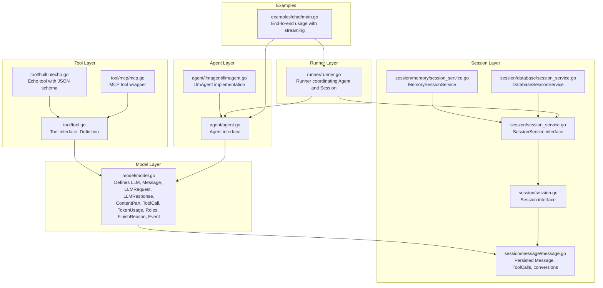
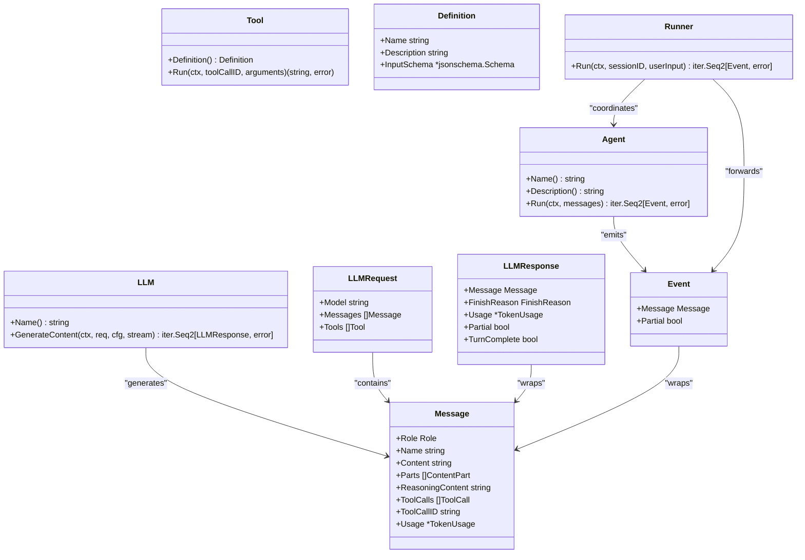
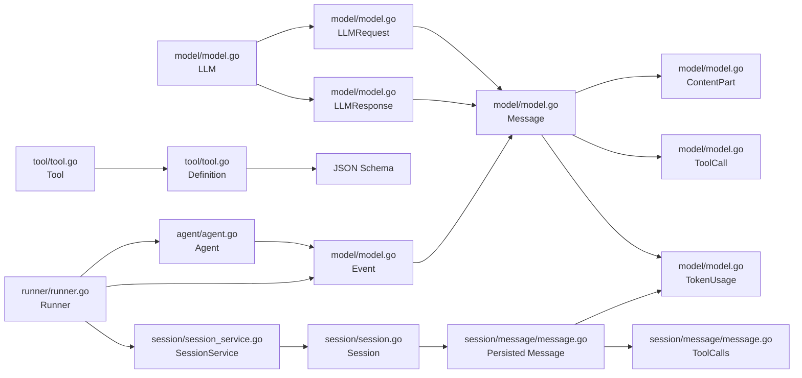

# Data Structures

<cite>
**Referenced Files in This Document**
- [model.go](file://model/model.go)
- [message.go](file://session/message/message.go)
- [session.go](file://session/session.go)
- [session_service.go](file://session/session_service.go)
- [memory_session_service.go](file://session/memory/session_service.go)
- [database_session_service.go](file://session/database/session_service.go)
- [tool.go](file://tool/tool.go)
- [echo.go](file://tool/builtin/echo.go)
- [mcp.go](file://tool/mcp/mcp.go)
- [agent.go](file://agent/agent.go)
- [llmagent.go](file://agent/llmagent/llmagent.go)
- [main.go](file://examples/chat/main.go)
- [runner.go](file://runner/runner.go)
- [README.md](file://README.md)
</cite>

## Update Summary
**Changes Made**
- Added comprehensive documentation for the new Event type that serves as the fundamental unit emitted by Agent.Run
- Updated LLMResponse documentation to include streaming-specific fields (Partial and TurnComplete)
- Enhanced Agent interface documentation to reflect the unified event system replacing the previous message-based communication model
- Updated Runner documentation to show how it coordinates the new event-based system
- Added detailed examples of event handling in streaming scenarios

## Table of Contents
1. [Introduction](#introduction)
2. [Project Structure](#project-structure)
3. [Core Components](#core-components)
4. [Architecture Overview](#architecture-overview)
5. [Detailed Component Analysis](#detailed-component-analysis)
6. [Dependency Analysis](#dependency-analysis)
7. [Performance Considerations](#performance-considerations)
8. [Troubleshooting Guide](#troubleshooting-guide)
9. [Conclusion](#conclusion)

## Introduction
This document provides comprehensive documentation for the public data structures and types used in the ADK API. It focuses on:
- Message structure with roles, content formats, and multi-modal support
- LLMRequest and LLMResponse structures including generation parameters and provider-specific extensions
- ToolDefinition and ToolResult types with JSON schema validation and execution results
- Session and Message entities for persistence including timestamps, metadata, and archival status
- **NEW**: Event type as the fundamental unit emitted by Agent.Run, replacing the previous message-based communication model
- **NEW**: Streaming-specific fields in LLMResponse (Partial and TurnComplete) for real-time content delivery
- Field descriptions, data types, validation rules, and serialization formats
- Examples of data structure usage in different contexts and explain relationships between related types

## Project Structure
The ADK API organizes its core data structures primarily under the model package, with session persistence under session/message, tool definitions under tool, and agent interfaces under agent. The examples demonstrate practical usage patterns with the new unified event system.

**Diagram sources**
- [model.go:1-227](file://model/model.go#L1-L227)
- [message.go:1-129](file://session/message/message.go#L1-L129)
- [session.go:1-24](file://session/session.go#L1-L24)
- [session_service.go:1-10](file://session/session_service.go#L1-L10)
- [memory_session_service.go:1-41](file://session/memory/session_service.go#L1-L41)
- [database_session_service.go:1-49](file://session/database/session_service.go#L1-L49)
- [tool.go:1-24](file://tool/tool.go#L1-L24)
- [echo.go:1-47](file://tool/builtin/echo.go#L1-L47)
- [mcp.go:88-120](file://tool/mcp/mcp.go#L88-L120)
- [agent.go:1-20](file://agent/agent.go#L1-L20)
- [llmagent.go:1-114](file://agent/llmagent/llmagent.go#L1-L114)
- [runner.go:1-108](file://runner/runner.go#L1-L108)
- [main.go:1-181](file://examples/chat/main.go#L1-L181)

**Section sources**
- [README.md:65-82](file://README.md#L65-L82)

## Core Components
This section documents the primary public data structures and their roles in the ADK API.

- LLM: Provider-agnostic interface for interacting with a large language model.
- Role: Enumerated role types for message participants.
- FinishReason: Indicates why the LLM stopped generating tokens.
- ReasoningEffort: Controls how much reasoning the model performs.
- ServiceTier: Specifies the service tier for processing the request.
- GenerateConfig: Optional configuration for a generation request.
- ContentPartType: Identifies the modality of a ContentPart.
- ImageDetail: Controls the resolution at which the model processes an image.
- ContentPart: Represents a single piece of content within a message.
- ToolCall: Represents a single tool invocation requested by the LLM.
- TokenUsage: Holds the token consumption statistics for a single LLM call.
- Message: Represents a single message in the conversation.
- Choice: Represents one completion candidate returned by the LLM.
- LLMRequest: Provider-agnostic request payload sent to an LLM.
- LLMResponse: **UPDATED**: Provider-agnostic response returned by an LLM with streaming support.
- Event: **NEW**: Fundamental unit emitted by Agent.Run that wraps a Message and indicates streaming status.
- ToolDefinition: Describes a tool to an LLM.
- Tool: Encapsulates tool execution with JSON schema validation.

**Section sources**
- [model.go:10-227](file://model/model.go#L10-L227)

## Architecture Overview
The ADK API separates concerns across layers with a unified event system:
- Model layer defines provider-agnostic types and interfaces including the new Event type.
- Session layer manages conversation persistence and compaction.
- Tool layer encapsulates tool definitions and execution.
- Agent layer orchestrates LLM interactions and tool loops, emitting Events.
- Runner coordinates the Agent with SessionService, handling the event-based communication.
- Example layer demonstrates end-to-end usage with streaming capabilities.

**Diagram sources**
- [model.go:10-227](file://model/model.go#L10-L227)
- [tool.go:9-24](file://tool/tool.go#L9-L24)
- [agent.go:10-19](file://agent/agent.go#L10-L19)
- [runner.go:17-96](file://runner/runner.go#L17-L96)

## Detailed Component Analysis

### Event Structure
**NEW**: The Event type serves as the fundamental unit emitted by Agent.Run, replacing the previous message-based communication model with a unified event system.

Fields:
- Message: Contains the content of this event, which can be either a streaming fragment or a complete message.
- Partial: Boolean flag indicating whether this is a streaming fragment (true) or a complete message (false).

Behavior:
- When Partial=true: Only Message.Content and Message.ReasoningContent carry incremental (delta) text; all other fields may be zero-valued.
- When Partial=false: Message is fully assembled with complete content and metadata.
- Callers (e.g., Runner) should forward partial events to the client for real-time display but only persist complete events (Partial=false).

Streaming behavior:
- Partial=true events carry streaming text fragments for real-time display.
- Partial=false events represent complete messages that should be persisted to the session.

**Section sources**
- [model.go:214-227](file://model/model.go#L214-L227)

### LLMRequest and LLMResponse
LLMRequest and LLMResponse are provider-agnostic structures for communication with LLM adapters, with enhanced streaming support.

LLMRequest fields:
- Model: Identifier of the model to use.
- Messages: Conversation history.
- Tools: List of tools the model may call during generation.

**Updated** LLMResponse fields:
- Message: Assistant message for this response.
- FinishReason: Indicates why generation stopped.
- Usage: Token consumption reported by the provider (only on final complete response).
- Partial: **NEW** - Indicates this response is a streaming fragment.
- TurnComplete: **NEW** - Indicates the LLM has finished generating its full response.

Streaming behavior:
- When stream is false: Exactly one complete LLMResponse is yielded.
- When stream is true: Zero or more partial LLMResponse (Partial=true) are yielded followed by one complete LLMResponse (Partial=false, TurnComplete=true).

Generation parameters:
- Temperature, reasoning effort, service tier, max tokens, thinking budget, and enable thinking are configured via GenerateConfig.

Provider-specific extensions:
- Providers may interpret reasoning effort and enable thinking differently; the model layer maps these consistently.

**Section sources**
- [model.go:188-212](file://model/model.go#L188-L212)
- [model.go:67-84](file://model/model.go#L67-L84)

### Message Structure
The Message type represents a single message in the conversation. It supports both plain text and multi-modal content.

Fields:
- Role: Enumerated role (system, user, assistant, tool).
- Name: Optional producer identifier (e.g., agent name).
- Content: Plain-text content; when Parts is non-empty, Parts takes precedence.
- Parts: Multi-modal content parts (text, images, etc.). Currently supported for RoleUser messages.
- ReasoningContent: Informational chain-of-thought output from reasoning models.
- ToolCalls: Populated when Role is assistant and the model requests tool invocations.
- ToolCallID: Links a RoleTool message back to the ToolCall.ID it responds to.
- Usage: Token consumption for assistant messages produced by a Generate call.

Serialization:
- The persisted Message type in session/message embeds JSON tags for database storage and implements driver.Valuer and sql.Scanner for JSON serialization.

Validation rules:
- When Parts is non-empty, Content is ignored.
- ReasoningContent is informational and not forwarded to the LLM.
- ToolCalls and ToolCallID are used for tool invocation and result linking.

Usage examples:
- Multi-modal user message with text and image parts.
- Assistant message with tool calls and token usage.
- Tool message linking back to a specific tool call.

**Section sources**
- [model.go:152-178](file://model/model.go#L152-L178)
- [message.go:49-129](file://session/message/message.go#L49-L129)

### ContentPart and Multi-modal Support
ContentPart enables multi-modal messages with mixed modalities.

ContentPartType values:
- text: Plain-text content part.
- image_url: Image provided via HTTPS URL.
- image_base64: Image provided as raw base64-encoded data with MIME type.

ImageDetail values:
- auto: Default resolution.
- low: Lower resolution.
- high: Higher resolution.

ContentPart fields:
- Type: Identifies the kind of content.
- Text: Plain-text content when Type is text.
- ImageURL: HTTPS URL of the image when Type is image_url.
- ImageBase64: Raw base64-encoded image data when Type is image_base64.
- MIMEType: MIME type of the base64 image (required when Type is image_base64).
- ImageDetail: Controls the fidelity at which the image is processed.

Validation rules:
- MIMEType is required when Type is image_base64.
- ImageDetail defaults to "auto" when empty.

Usage examples:
- User message combining text and an image URL.
- User message with high-detail image processing.

**Section sources**
- [model.go:86-128](file://model/model.go#L86-L128)

### ToolDefinition and Tool Execution
ToolDefinition describes a tool to an LLM, while Tool encapsulates execution.

ToolDefinition fields:
- Name: Tool name.
- Description: Human-readable description.
- InputSchema: JSON Schema describing the tool's input parameters.

Tool interface:
- Definition(): Returns the tool's metadata.
- Run(ctx, toolCallID, arguments): Executes the tool with JSON-encoded arguments and returns a string result.

Built-in tool example:
- Echo tool demonstrates JSON schema generation for tool inputs and argument parsing.

MCP tool integration:
- MCP tools are wrapped to conform to the Tool interface, including argument unmarshalling and result extraction.

Validation rules:
- InputSchema is validated against the tool's expected parameters.
- Arguments must be valid JSON matching the schema.

Execution results:
- Results are returned as a string; errors are propagated with context.

**Section sources**
- [tool.go:9-24](file://tool/tool.go#L9-L24)
- [echo.go:14-47](file://tool/builtin/echo.go#L14-L47)
- [mcp.go:88-120](file://tool/mcp/mcp.go#L88-L120)

### Session and Message Persistence
Session and Message entities manage conversation persistence, including timestamps, metadata, and archival status.

Session interface:
- GetSessionID(): Unique session identifier.
- CreateMessage(ctx, message): Persist a message.
- GetMessages(ctx, limit, offset): Paginated retrieval of active messages.
- ListMessages(ctx): Retrieve all active messages.
- ListCompactedMessages(ctx): Retrieve archived messages.
- DeleteMessage(ctx, messageID): Soft-delete a message.
- CompactMessages(ctx, compactor): Archive old messages via compaction.

Message fields (persisted):
- message_id: Unique identifier.
- role: Message role.
- name: Producer identifier.
- content: Plain-text content.
- reasoning_content: Chain-of-thought output.
- tool_calls: JSON-serialized tool calls.
- tool_call_id: Links tool results to calls.
- prompt_tokens, completion_tokens, total_tokens: Token usage.
- created_at, updated_at, compacted_at, deleted_at: Timestamps.

Serialization:
- ToolCalls implements driver.Valuer and sql.Scanner for JSON storage.
- Conversions between persisted and model.Message types handle ToolCalls and token usage.

Archival status:
- CompactedAt indicates messages archived by compaction.
- DeletedAt indicates soft-deleted messages.

**Section sources**
- [session.go:9-23](file://session/session.go#L9-L23)
- [message.go:49-129](file://session/message/message.go#L49-L129)

### Agent and Unified Event System
**UPDATED**: Agent orchestrates LLM interactions and emits Events through a unified event system that replaces the previous message-based communication model.

Agent interface:
- Name(): Agent name.
- Description(): Agent description.
- Run(ctx, messages): Yields Events as they are produced.

Event emission behavior:
- **NEW**: Agent.Run now emits Event objects instead of direct Message objects.
- Partial events (Event.Partial=true) carry streaming text fragments for real-time display.
- Complete events (Event.Partial=false) carry fully assembled messages (assistant replies, tool results, etc.).

Streaming behavior:
- Partial=true events are forwarded for real-time display but not persisted.
- Partial=false events represent complete messages that should be persisted to the session.

**Section sources**
- [agent.go:10-19](file://agent/agent.go#L10-L19)
- [model.go:214-227](file://model/model.go#L214-L227)

### Runner Coordination with Event System
**NEW**: Runner coordinates a stateless Agent with a SessionService using the unified event system.

Runner behavior:
- Loads conversation history from the session.
- Appends user input as a Message to the conversation.
- Invokes the Agent with the combined messages.
- Forwards each produced Event to the caller.
- Persists only complete events (Event.Partial=false) to the session.
- Streams partial events (Event.Partial=true) to the caller for real-time display.

Key responsibilities:
- **NEW**: Only persist complete events to avoid fragmented states in the session.
- **NEW**: Forward partial events for real-time display without storing intermediate states.
- **NEW**: Coordinate between Agent and SessionService using the unified Event type.

**Section sources**
- [runner.go:17-96](file://runner/runner.go#L17-L96)

### Usage Examples and Contexts
The examples demonstrate practical usage of the data structures across different contexts with the new unified event system.

Chat example:
- Creates an OpenAI LLM adapter and an MCP toolset.
- Builds an LlmAgent with tools and instructions.
- Uses a Runner with an in-memory session service to drive conversations.
- Iterates over events to stream assistant responses and handle tool calls.
- **NEW**: Handles both partial and complete events appropriately.

Multi-modal example:
- Demonstrates constructing a user message with text and image parts.

Tool schema example:
- Shows how a built-in tool generates a JSON schema for its input parameters.

Streaming integration example:
- **NEW**: Tests demonstrate the unified event system with streaming capabilities.
- Shows how partial events are forwarded for real-time display.
- Demonstrates that only complete events are persisted to the session.

**Section sources**
- [main.go:52-176](file://examples/chat/main.go#L52-L176)
- [README.md:259-275](file://README.md#L259-L275)
- [echo.go:22-33](file://tool/builtin/echo.go#L22-L33)

## Dependency Analysis
The following diagram shows key dependencies among the core data structures and interfaces, including the new Event type and unified event system.

**Diagram sources**
- [model.go:10-227](file://model/model.go#L10-L227)
- [tool.go:9-24](file://tool/tool.go#L9-L24)
- [session.go:9-23](file://session/session.go#L9-L23)
- [session_service.go:5-9](file://session/session_service.go#L5-L9)
- [message.go:49-129](file://session/message/message.go#L49-L129)
- [agent.go:10-19](file://agent/agent.go#L10-L19)
- [runner.go:17-96](file://runner/runner.go#L17-L96)

**Section sources**
- [model.go:10-227](file://model/model.go#L10-L227)
- [tool.go:9-24](file://tool/tool.go#L9-L24)
- [session.go:9-23](file://session/session.go#L9-L23)
- [session_service.go:5-9](file://session/session_service.go#L5-L9)
- [message.go:49-129](file://session/message/message.go#L49-L129)
- [agent.go:10-19](file://agent/agent.go#L10-L19)
- [runner.go:17-96](file://runner/runner.go#L17-L96)

## Performance Considerations
- **NEW**: Streaming: Use partial events for real-time display without persisting intermediate states.
- Token usage: Track prompt_tokens, completion_tokens, and total_tokens to monitor costs and limits.
- Multi-modal: Prefer lower image detail for cost-sensitive scenarios; adjust ImageDetail accordingly.
- Tool calls: Minimize unnecessary tool invocations to reduce latency and token consumption.
- **NEW**: Event filtering: Only persist complete events (Partial=false) to avoid fragmented states in the session.
- **NEW**: Memory efficiency: The unified event system reduces memory overhead by separating streaming fragments from complete messages.

## Troubleshooting Guide
Common issues and resolutions:
- **NEW**: Event handling errors: Ensure proper distinction between partial and complete events in the unified event system.
- JSON schema validation errors: Ensure tool arguments match the Definition.InputSchema.
- Tool execution failures: Verify arguments are valid JSON and handle errors returned by Tool.Run.
- Multi-modal content issues: Confirm MIMEType is set for base64 images and URLs are accessible.
- **NEW**: Streaming inconsistencies: Only persist complete events (Partial=false) to avoid fragmented states.
- **NEW**: Event ordering: Verify that partial events are properly ordered before the final complete event.
- Session compaction: Use compacted messages to archive old content; ensure summarization logic preserves context.

**Section sources**
- [tool.go:9-24](file://tool/tool.go#L9-L24)
- [echo.go:40-46](file://tool/builtin/echo.go#L40-L46)
- [mcp.go:92-109](file://tool/mcp/mcp.go#L92-L109)
- [message.go:22-47](file://session/message/message.go#L22-L47)

## Conclusion
The ADK API provides a robust, provider-agnostic foundation for building AI agents with strong support for multi-modal input, tool invocation, and persistent session management. **The new unified event system with the Event type and streaming-specific fields in LLMResponse represents a significant architectural improvement**, enabling efficient real-time streaming while maintaining clean separation between streaming fragments and complete messages. The documented data structures and interfaces enable flexible composition and extensibility across different LLM providers, tool integrations, and storage backends, with the unified event system providing a consistent pattern for handling both streaming and non-streaming scenarios.