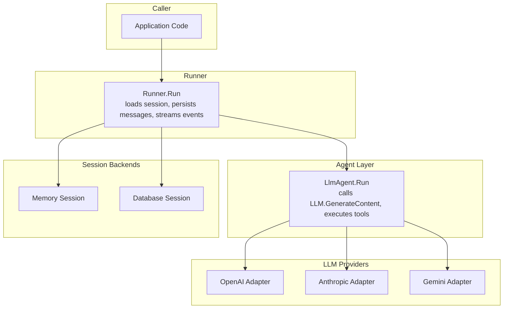
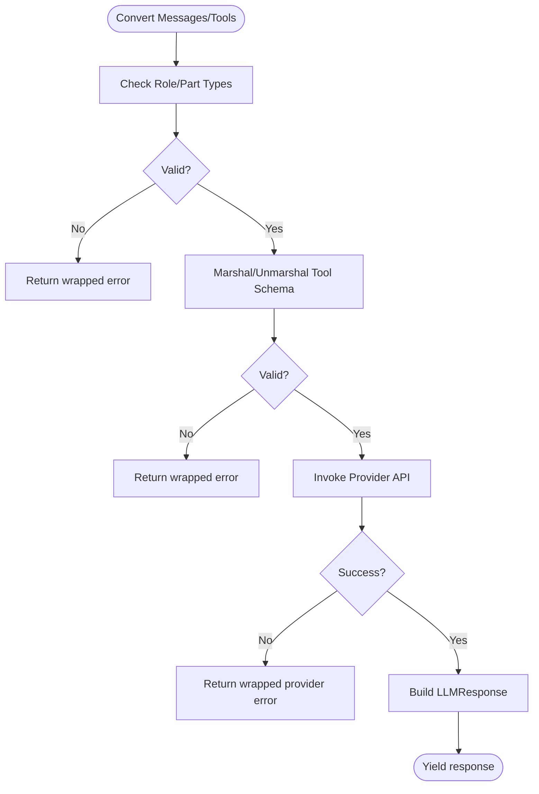
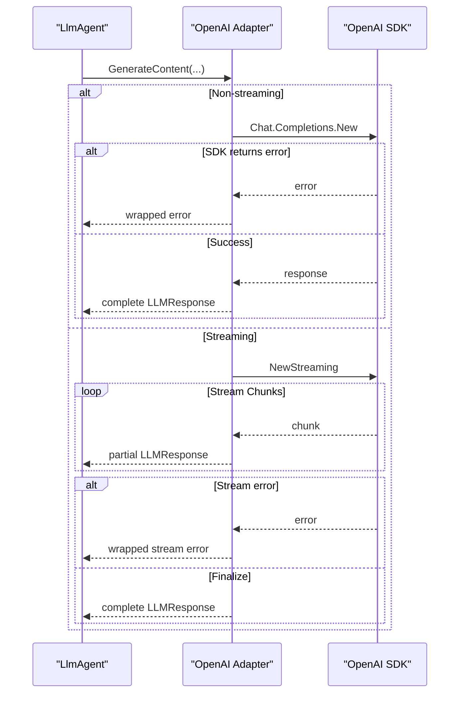
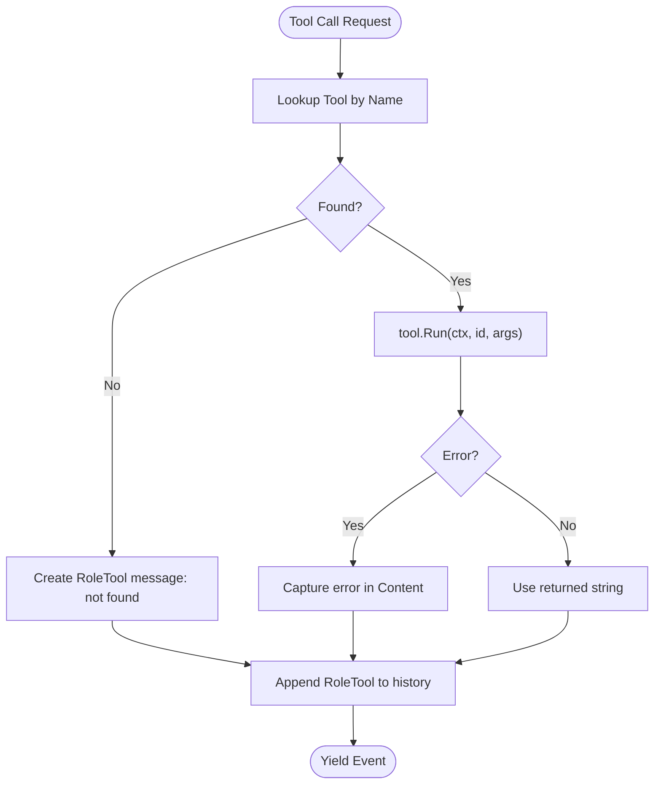
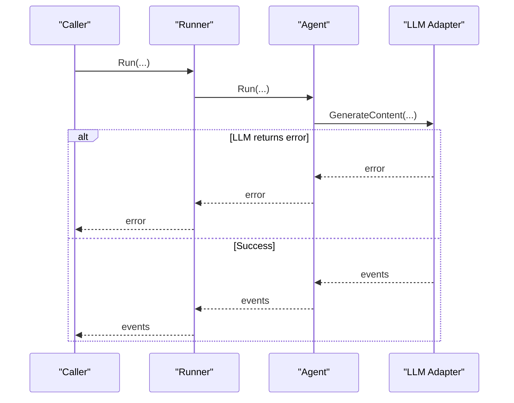
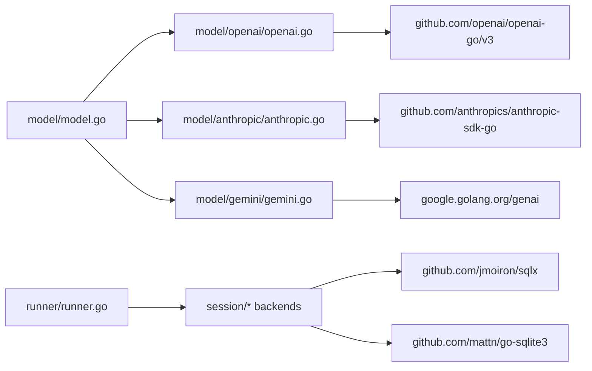

# Error Handling

<cite>
**Referenced Files in This Document**
- [README.md](file://README.md)
- [go.mod](file://go.mod)
- [model/model.go](file://model/model.go)
- [agent/agent.go](file://agent/agent.go)
- [agent/llmagent/llmagent.go](file://agent/llmagent/llmagent.go)
- [runner/runner.go](file://runner/runner.go)
- [session/session.go](file://session/session.go)
- [session/session_service.go](file://session/session_service.go)
- [session/memory/session.go](file://session/memory/session.go)
- [session/database/session.go](file://session/database/session.go)
- [model/openai/openai.go](file://model/openai/openai.go)
- [model/anthropic/anthropic.go](file://model/anthropic/anthropic.go)
- [model/gemini/gemini.go](file://model/gemini/gemini.go)
- [runner/runner_test.go](file://runner/runner_test.go)
- [agent/sequential/sequential_test.go](file://agent/sequential/sequential_test.go)
- [agent/parallel/parallel_test.go](file://agent/parallel/parallel_test.go)
</cite>

## Table of Contents
1. [Introduction](#introduction)
2. [Project Structure](#project-structure)
3. [Core Components](#core-components)
4. [Architecture Overview](#architecture-overview)
5. [Detailed Component Analysis](#detailed-component-analysis)
6. [Dependency Analysis](#dependency-analysis)
7. [Performance Considerations](#performance-considerations)
8. [Troubleshooting Guide](#troubleshooting-guide)
9. [Conclusion](#conclusion)

## Introduction
This document provides comprehensive guidance on error types, error handling patterns, and recovery strategies across the ADK API. It covers:
- Validation errors (provider-agnostic message/tool conversion)
- Provider API errors (OpenAI, Anthropic, Gemini)
- Tool execution failures (tool invocation and argument parsing)
- Session persistence errors (memory and database backends)
- Error propagation from LLM providers through agents to callers
- Retry strategies, timeouts, and graceful degradation
- Error wrapping, context preservation, and logging integration
- Best practices for streaming and concurrent operations

## Project Structure
The ADK API is organized around a provider-agnostic model interface, pluggable LLM adapters, an agent layer that orchestrates tool calls, a runner that coordinates sessions, and pluggable session backends (memory and database). Error handling is implemented consistently across these layers using Go’s idiomatic error wrapping and propagation patterns.



**Diagram sources**
- [runner/runner.go:45-96](file://runner/runner.go#L45-L96)
- [agent/llmagent/llmagent.go:59-125](file://agent/llmagent/llmagent.go#L59-L125)
- [model/openai/openai.go:48-164](file://model/openai/openai.go#L48-L164)
- [model/anthropic/anthropic.go:50-93](file://model/anthropic/anthropic.go#L50-L93)
- [model/gemini/gemini.go:70-201](file://model/gemini/gemini.go#L70-L201)
- [session/memory/session.go:18-86](file://session/memory/session.go#L18-L86)
- [session/database/session.go:34-146](file://session/database/session.go#L34-L146)

**Section sources**
- [README.md:65-82](file://README.md#L65-L82)
- [runner/runner.go:17-37](file://runner/runner.go#L17-L37)
- [agent/llmagent/llmagent.go:29-45](file://agent/llmagent/llmagent.go#L29-L45)

## Core Components
- Provider-agnostic LLM interface: Defines streaming and non-streaming generation with error propagation.
- Agent orchestration: Drives LLM calls, handles tool-call loops, and yields events.
- Runner coordination: Manages session lifecycle, persists messages, and streams events to callers.
- Session backends: Provide CreateMessage/ListMessages/CompactMessages with explicit error returns.
- LLM adapters: Wrap provider SDK errors and convert messages/tools with structured error wrapping.

Key error surfaces:
- Message/tool conversion failures (validation)
- Provider API errors (network, auth, rate limits, malformed responses)
- Tool execution errors (argument parsing, runtime)
- Session persistence errors (SQL, concurrency, transaction rollbacks)
- Streaming and context cancellation

**Section sources**
- [model/model.go:10-18](file://model/model.go#L10-L18)
- [agent/llmagent/llmagent.go:59-125](file://agent/llmagent/llmagent.go#L59-L125)
- [runner/runner.go:45-96](file://runner/runner.go#L45-L96)
- [session/session.go:9-23](file://session/session.go#L9-L23)
- [session/session_service.go:5-9](file://session/session_service.go#L5-L9)

## Architecture Overview
The error handling architecture follows a layered pattern:
- Lower layers (LLM adapters, session backends) wrap external errors with context.
- Middle layer (Agent) translates provider responses and propagates errors.
- Upper layer (Runner) persists only complete messages, forwards partials for streaming, and propagates errors.
- Caller receives iter.Seq2 events and handles errors per iteration.

```mermaid
sequenceDiagram
participant Caller as "Caller"
participant Runner as "Runner"
participant Agent as "LlmAgent"
participant LLM as "LLM Adapter"
participant Provider as "Provider API"
Caller->>Runner : Run(ctx, sessionID, userInput)
Runner->>Runner : GetSession / ListMessages
alt Session error
Runner-->>Caller : error
exit
end
Runner->>Runner : persistMessage(user)
Runner->>Agent : Run(ctx, messages)
Agent->>LLM : GenerateContent(stream=true)
LLM->>Provider : API call
alt Provider error
Provider-->>LLM : error
LLM-->>Agent : error (wrapped)
Agent-->>Runner : error (wrapped)
Runner-->>Caller : error (wrapped)
exit
end
Provider-->>LLM : streamed chunks
LLM-->>Agent : partial responses
Agent-->>Runner : partial events
Runner-->>Caller : partial events
Provider-->>LLM : final response
LLM-->>Agent : complete response
Agent-->>Runner : complete event
Runner->>Runner : persistMessage(complete)
Runner-->>Caller : complete event
```

**Diagram sources**
- [runner/runner.go:45-96](file://runner/runner.go#L45-L96)
- [agent/llmagent/llmagent.go:77-93](file://agent/llmagent/llmagent.go#L77-L93)
- [model/openai/openai.go:88-164](file://model/openai/openai.go#L88-L164)
- [model/anthropic/anthropic.go:47-93](file://model/anthropic/anthropic.go#L47-L93)
- [model/gemini/gemini.go:66-201](file://model/gemini/gemini.go#L66-L201)

## Detailed Component Analysis

### Validation Errors (Message/Tool Conversion)
Validation encompasses:
- Unsupported message roles
- Unsupported content part types
- Malformed tool schemas
- Empty or missing choices/responses

Patterns:
- Converters return wrapped errors with contextual prefixes.
- LLM.GenerateContent validates inputs before invoking provider APIs.

Common categories:
- Unknown role or content part type
- Tool schema marshaling/unmarshaling failures
- Empty choices or unexpected response shapes



**Diagram sources**
- [model/openai/openai.go:167-243](file://model/openai/openai.go#L167-L243)
- [model/anthropic/anthropic.go:98-147](file://model/anthropic/anthropic.go#L98-L147)
- [model/gemini/gemini.go:207-268](file://model/gemini/gemini.go#L207-L268)

**Section sources**
- [model/openai/openai.go:50-60](file://model/openai/openai.go#L50-L60)
- [model/openai/openai.go:167-243](file://model/openai/openai.go#L167-L243)
- [model/anthropic/anthropic.go:52-62](file://model/anthropic/anthropic.go#L52-L62)
- [model/anthropic/anthropic.go:98-147](file://model/anthropic/anthropic.go#L98-L147)
- [model/gemini/gemini.go:72-82](file://model/gemini/gemini.go#L72-L82)
- [model/gemini/gemini.go:207-268](file://model/gemini/gemini.go#L207-L268)

### Provider API Errors (OpenAI, Anthropic, Gemini)
Provider errors are captured and wrapped with context:
- Non-streaming: API call errors are wrapped and returned.
- Streaming: Stream iteration errors are wrapped and returned.
- Final assembly: Errors terminate the generator early.

Recovery strategies:
- Retry on transient network errors (use context deadlines and backoff).
- Fallback to alternate providers or reduced config (temperature, reasoning effort).
- Graceful degradation: Disable thinking or reduce token budgets.



**Diagram sources**
- [model/openai/openai.go:74-87](file://model/openai/openai.go#L74-L87)
- [model/openai/openai.go:90-164](file://model/openai/openai.go#L90-L164)

**Section sources**
- [model/openai/openai.go:74-87](file://model/openai/openai.go#L74-L87)
- [model/openai/openai.go:139-142](file://model/openai/openai.go#L139-L142)
- [model/anthropic/anthropic.go:83-87](file://model/anthropic/anthropic.go#L83-L87)
- [model/gemini/gemini.go:93-105](file://model/gemini/gemini.go#L93-L105)
- [model/gemini/gemini.go:115-180](file://model/gemini/gemini.go#L115-L180)

### Tool Execution Failures
Tool execution occurs inside the agent’s tool-call loop:
- Lookup tool by name; if missing, produce a tool message indicating not found.
- Invoke tool.Run; if error, capture result string and continue.
- Append tool result messages to conversation history.

Recovery strategies:
- Validate tool definitions before agent creation.
- Use bounded context deadlines for tool execution.
- Implement circuit-breaker-like behavior (skip failing tools temporarily).



**Diagram sources**
- [agent/llmagent/llmagent.go:127-147](file://agent/llmagent/llmagent.go#L127-L147)

**Section sources**
- [agent/llmagent/llmagent.go:127-147](file://agent/llmagent/llmagent.go#L127-L147)

### Session Persistence Errors (Memory and Database)
Session backends expose explicit error returns:
- Memory backend: in-memory slices; errors are generally nil unless overridden by tests.
- Database backend: SQL operations with explicit error returns; compaction uses transactions.

Patterns:
- CreateMessage returns underlying SQL errors.
- ListMessages and compaction return errors from queries/transactions.
- Runner persists only complete events; partials are forwarded without persistence.

Recovery strategies:
- Retry failed CreateMessage with exponential backoff.
- On transaction rollback, reattempt compaction after a delay.
- Use context cancellations to abort long-running compaction.

```mermaid
sequenceDiagram
participant Runner as "Runner"
participant Svc as "SessionService"
participant Sess as "Session"
Runner->>Svc : GetSession(ctx, id)
alt GetSession error
Svc-->>Runner : error
Runner-->>Caller : error
exit
end
Runner->>Sess : ListMessages(ctx)
alt ListMessages error
Sess-->>Runner : error
Runner-->>Caller : error
exit
end
Runner->>Runner : persistMessage(user)
Runner->>Sess : CreateMessage(ctx, user)
alt CreateMessage error
Sess-->>Runner : error
Runner-->>Caller : error
exit
end
loop Agent events
Runner->>Sess : CreateMessage(ctx, complete)
alt CreateMessage error
Sess-->>Runner : error
Runner-->>Caller : error
exit
end
end
```

**Diagram sources**
- [runner/runner.go:47-94](file://runner/runner.go#L47-L94)
- [session/memory/session.go:30-33](file://session/memory/session.go#L30-L33)
- [session/database/session.go:46-62](file://session/database/session.go#L46-L62)

**Section sources**
- [runner/runner.go:47-94](file://runner/runner.go#L47-L94)
- [session/memory/session.go:30-33](file://session/memory/session.go#L30-L33)
- [session/database/session.go:46-62](file://session/database/session.go#L46-L62)
- [session/database/session.go:97-145](file://session/database/session.go#L97-L145)

### Error Propagation Patterns
- Provider adapters wrap SDK errors with context and return them to the agent.
- Agent forwards provider errors to the runner via the iterator.
- Runner forwards errors to the caller and stops further processing.
- Tests demonstrate error propagation across sequential and parallel agent pipelines.



**Diagram sources**
- [runner/runner.go:78-82](file://runner/runner.go#L78-L82)
- [agent/llmagent/llmagent.go:80-84](file://agent/llmagent/llmagent.go#L80-L84)

**Section sources**
- [runner/runner_test.go:213-241](file://runner/runner_test.go#L213-L241)
- [agent/sequential/sequential_test.go:296-323](file://agent/sequential/sequential_test.go#L296-L323)
- [agent/parallel/parallel_test.go:313-345](file://agent/parallel/parallel_test.go#L313-L345)

### Retry Strategies, Timeouts, and Graceful Degradation
- Retries: Apply context.WithTimeout/WithCancel to LLM calls; retry only idempotent operations (e.g., non-tool-call turns) with exponential backoff.
- Timeouts: Set reasonable deadlines for provider calls and streaming reads.
- Degradation: Reduce temperature, reasoning effort, or disable thinking; switch to smaller models or providers.

Guidance:
- Use context deadlines to bound latency and resource usage.
- For streaming, break on context cancellation and return partials if needed.
- On persistent failures, switch providers or backends gracefully.

[No sources needed since this section provides general guidance]

### Error Wrapping, Context Preservation, and Logging Integration
- Wrapping: All adapters wrap external errors with provider-specific prefixes (e.g., “openai:”, “anthropic:”, “gemini:”).
- Context: Use context for cancellation and deadlines; propagate context to all downstream calls.
- Logging: Integrate with application loggers; include wrapped error messages and request IDs where applicable.

Best practices:
- Always wrap errors with a short, stable prefix identifying the origin.
- Preserve original errors using Go’s error wrapping semantics.
- Log at appropriate levels (debug for partials, warn for recoverable errors, error for fatal).

**Section sources**
- [model/openai/openai.go:51-53](file://model/openai/openai.go#L51-L53)
- [model/openai/openai.go:76](file://model/openai/openai.go#L76)
- [model/anthropic/anthropic.go:54](file://model/anthropic/anthropic.go#L54)
- [model/anthropic/anthropic.go:85](file://model/anthropic/anthropic.go#L85)
- [model/gemini/gemini.go:95](file://model/gemini/gemini.go#L95)
- [model/gemini/gemini.go:117](file://model/gemini/gemini.go#L117)

### Streaming Scenarios and Concurrent Operations
- Streaming: Partial events are yielded for real-time display; only complete events are persisted.
- Concurrency: Parallel agents cancel other agents on error via shared context; sequential agents halt on first error.

Recommendations:
- For streaming, handle partials promptly and ensure persistence happens only for complete messages.
- For concurrency, propagate context cancellation to all agents and tools; implement circuit-breaking for failing branches.

**Section sources**
- [runner/runner.go:83-94](file://runner/runner.go#L83-L94)
- [agent/parallel/parallel_test.go:313-345](file://agent/parallel/parallel_test.go#L313-L345)
- [agent/sequential/sequential_test.go:296-323](file://agent/sequential/sequential_test.go#L296-L323)

## Dependency Analysis
External dependencies relevant to error handling:
- OpenAI SDK: Used by the OpenAI adapter; errors are wrapped and surfaced.
- Anthropic SDK: Used by the Anthropic adapter; errors are wrapped and surfaced.
- Google GenAI: Used by the Gemini adapter; streaming and non-streaming modes both wrap errors.
- SQLX and sqlite3: Used by the database session backend; SQL errors are returned directly.



**Diagram sources**
- [go.mod:5-15](file://go.mod#L5-L15)
- [model/openai/openai.go:10](file://model/openai/openai.go#L10)
- [model/anthropic/anthropic.go:10](file://model/anthropic/anthropic.go#L10)
- [model/gemini/gemini.go:11](file://model/gemini/gemini.go#L11)
- [session/database/session.go:8](file://session/database/session.go#L8)

**Section sources**
- [go.mod:5-15](file://go.mod#L5-L15)

## Performance Considerations
- Minimize retries on non-transient errors to avoid wasted resources.
- Prefer streaming for responsiveness; ensure partials are handled efficiently.
- Use bounded concurrency and context cancellation to prevent resource leaks.

[No sources needed since this section provides general guidance]

## Troubleshooting Guide
Common symptoms and actions:
- Session retrieval fails: Verify session exists and backend connectivity; check wrapped error for SQL or initialization issues.
- Provider API errors: Inspect wrapped provider errors; confirm credentials, model availability, and quotas.
- Tool execution errors: Validate tool definitions and argument schemas; ensure tools handle context cancellation.
- Streaming interruptions: Confirm context deadlines and network stability; handle stream errors and resume safely.

Evidence from tests:
- Session retrieval errors propagate to Runner.Run and are yielded to the caller.
- Sequential and parallel agents propagate errors and stop further processing.

**Section sources**
- [runner/runner_test.go:213-241](file://runner/runner_test.go#L213-L241)
- [agent/sequential/sequential_test.go:296-323](file://agent/sequential/sequential_test.go#L296-L323)
- [agent/parallel/parallel_test.go:313-345](file://agent/parallel/parallel_test.go#L313-L345)

## Conclusion
ADK’s error handling is designed for clarity and resilience:
- Clear error wrapping identifies origins (providers, adapters, sessions).
- Consistent propagation ensures errors reach callers promptly.
- Streaming and persistence are separated to support real-time UX and reliability.
Adopt the recommended patterns for retries, timeouts, and graceful degradation to build robust applications.