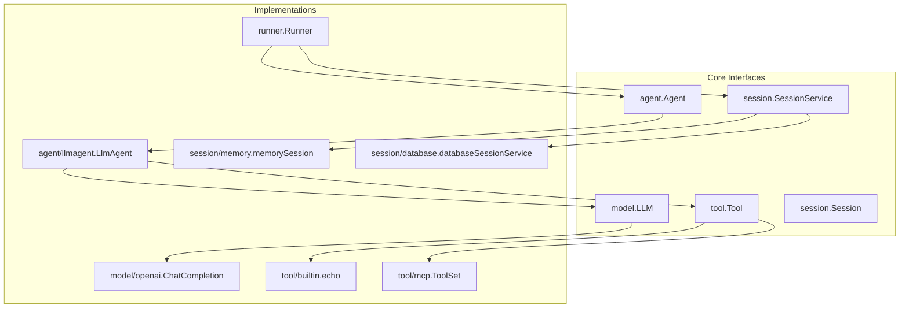
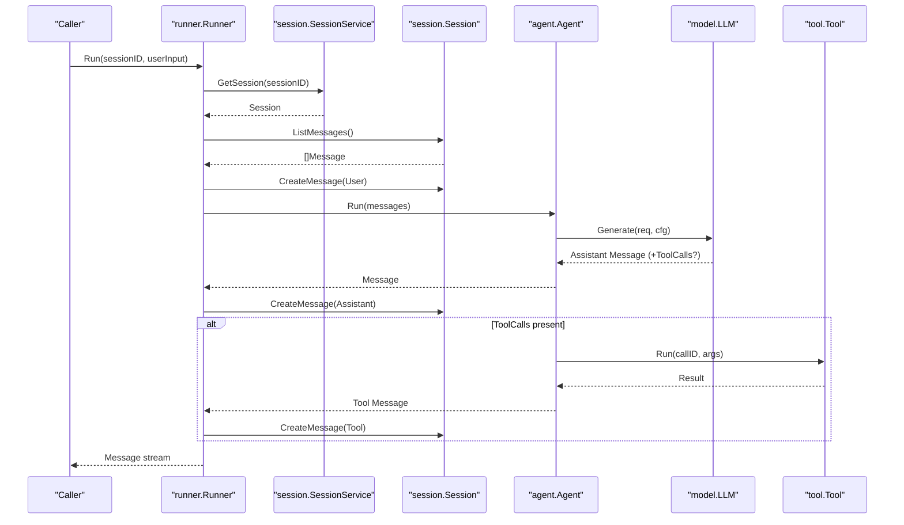
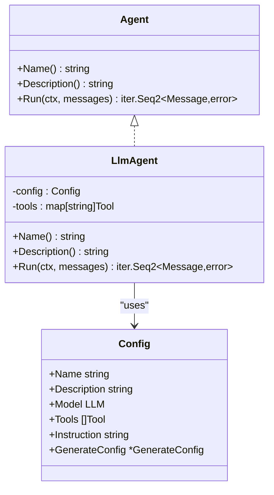
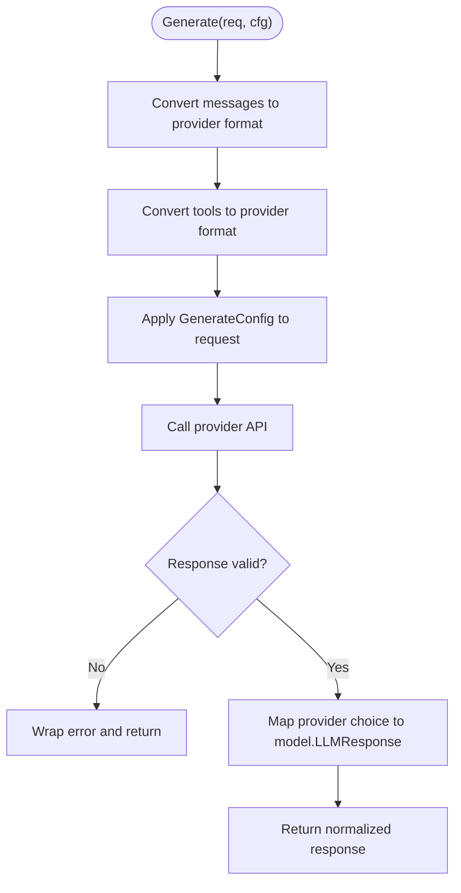
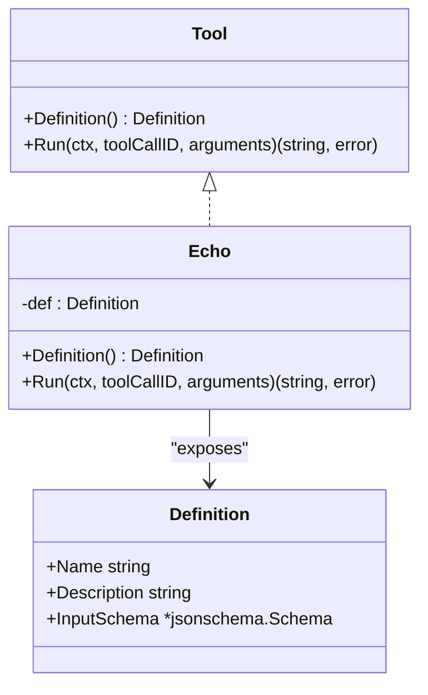
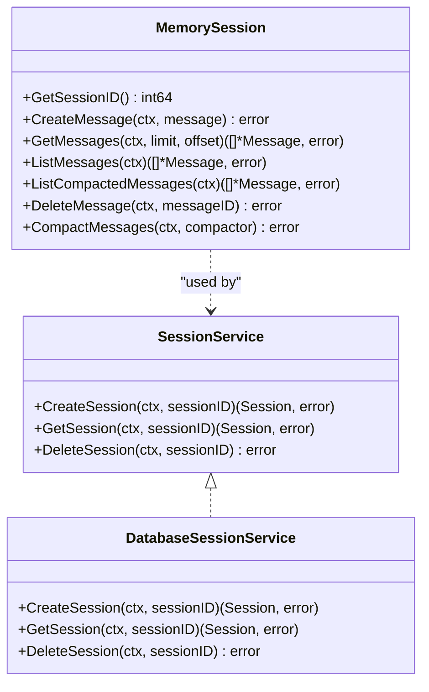
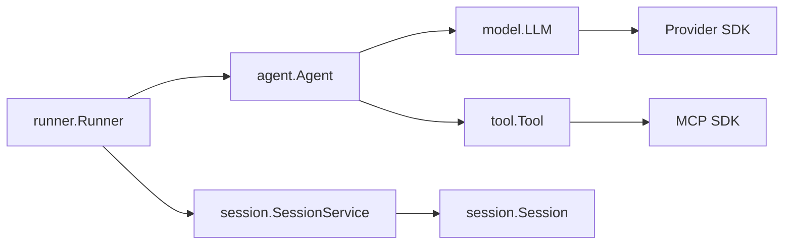
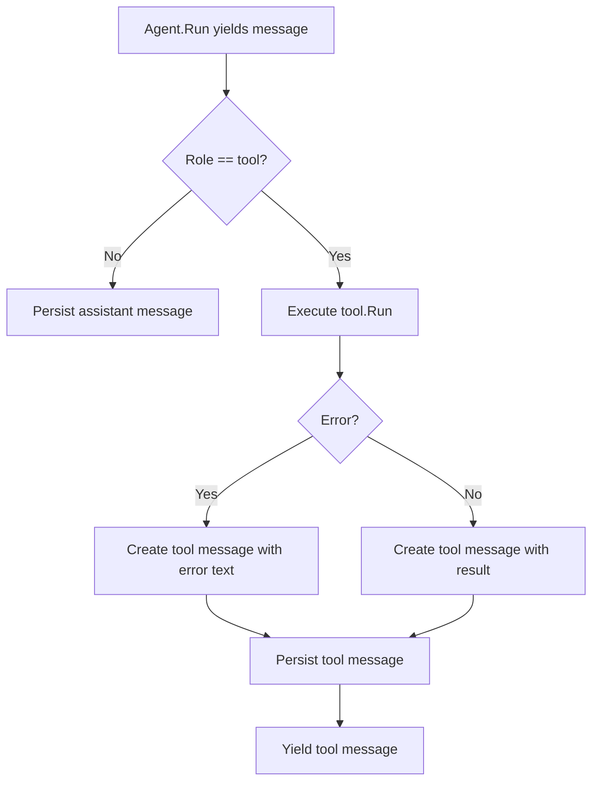
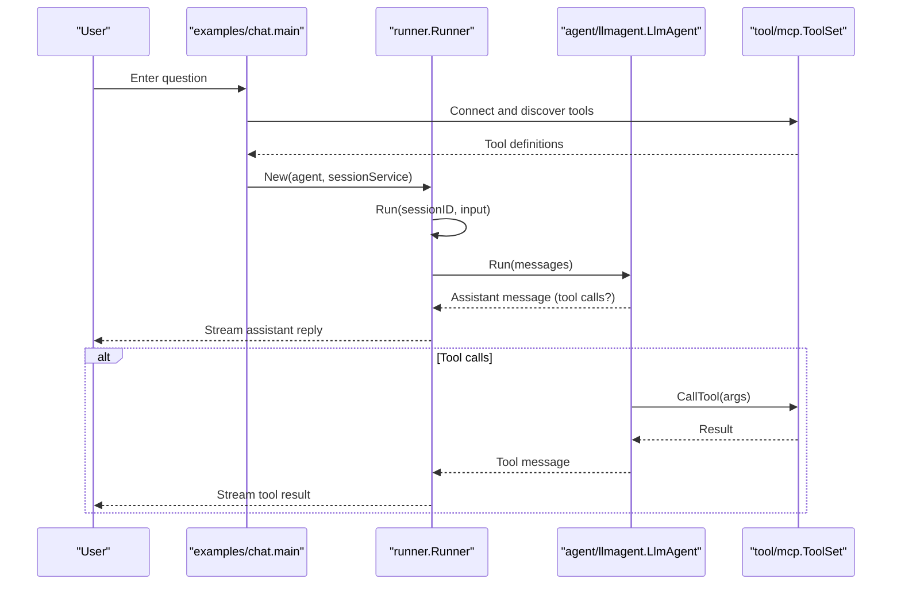

# Advanced Topics

<cite>
**Referenced Files in This Document**
- [README.md](file://README.md)
- [agent.go](file://agent/agent.go)
- [llmagent.go](file://agent/llmagent/llmagent.go)
- [model.go](file://model/model.go)
- [openai.go](file://model/openai/openai.go)
- [session.go](file://session/session.go)
- [session_service.go](file://session/session_service.go)
- [memory_session.go](file://session/memory/session.go)
- [database_session_service.go](file://session/database/session_service.go)
- [message.go](file://session/message/message.go)
- [tool.go](file://tool/tool.go)
- [echo.go](file://tool/builtin/echo.go)
- [mcp.go](file://tool/mcp/mcp.go)
- [runner.go](file://runner/runner.go)
- [snowflake.go](file://internal/snowflake/snowflake.go)
- [main.go](file://examples/chat/main.go)
</cite>

## Table of Contents
1. [Introduction](#introduction)
2. [Project Structure](#project-structure)
3. [Core Components](#core-components)
4. [Architecture Overview](#architecture-overview)
5. [Detailed Component Analysis](#detailed-component-analysis)
6. [Dependency Analysis](#dependency-analysis)
7. [Performance Considerations](#performance-considerations)
8. [Troubleshooting Guide](#troubleshooting-guide)
9. [Conclusion](#conclusion)
10. [Appendices](#appendices)

## Introduction
This document focuses on advanced customization and extension patterns enabled by the ADK architecture. It covers:
- Custom agent development using the Agent interface
- Custom LLM provider development via the adapter pattern and response normalization
- Custom tool development with schema design and validation
- Extending session backends for custom storage
- Advanced configuration, monitoring, observability, and production deployment considerations
- Troubleshooting complex integrations and performance optimization

## Project Structure
ADK is organized around well-defined interfaces and pluggable adapters:
- agent: Defines the Agent interface and the LlmAgent implementation
- model: Defines provider-agnostic LLM interfaces, message types, and configuration
- model/{openai,anthropic,gemini}: Provider adapters implementing model.LLM
- session: Interfaces and backends for message persistence
- tool: Tool interface, definitions, built-in tools, and MCP integration
- runner: Orchestrator connecting Agent and SessionService
- internal/snowflake: Distributed ID generation for messages

**Diagram sources**
- [agent.go:10-17](file://agent/agent.go#L10-L17)
- [llmagent.go:25-41](file://agent/llmagent/llmagent.go#L25-L41)
- [model.go:9-13](file://model/model.go#L9-L13)
- [openai.go:17-40](file://model/openai/openai.go#L17-L40)
- [session.go:9-23](file://session/session.go#L9-L23)
- [session_service.go:5-9](file://session/session_service.go#L5-L9)
- [memory_session.go:12-24](file://session/memory/session.go#L12-L24)
- [database_session_service.go:19-25](file://session/database/session_service.go#L19-L25)
- [tool.go:17-23](file://tool/tool.go#L17-L23)
- [echo.go:14-34](file://tool/builtin/echo.go#L14-L34)
- [mcp.go:15-33](file://tool/mcp/mcp.go#L15-L33)
- [runner.go:17-37](file://runner/runner.go#L17-L37)

**Section sources**
- [README.md:65-82](file://README.md#L65-L82)
- [agent.go:10-17](file://agent/agent.go#L10-L17)
- [model.go:9-13](file://model/model.go#L9-L13)
- [session.go:9-23](file://session/session.go#L9-L23)
- [tool.go:17-23](file://tool/tool.go#L17-L23)
- [runner.go:17-37](file://runner/runner.go#L17-L37)

## Core Components
- Agent interface: Stateless execution returning an iterator of messages
- LlmAgent: Drives an LLM with tool-call loop and integrates tools
- model.LLM: Provider-agnostic interface for LLMs with normalized message and usage types
- Tool interface: Provider-agnostic tool definition and execution
- Session and SessionService: Abstractions for message persistence and session lifecycle
- Runner: Wires Agent and SessionService, persists messages with Snowflake IDs

Key capabilities:
- Streaming via Go iterators
- Multi-modal input via ContentPart
- Soft message compaction
- MCP tool integration

**Section sources**
- [README.md:157-231](file://README.md#L157-L231)
- [agent.go:10-17](file://agent/agent.go#L10-L17)
- [llmagent.go:13-41](file://agent/llmagent/llmagent.go#L13-L41)
- [model.go:9-200](file://model/model.go#L9-L200)
- [tool.go:9-23](file://tool/tool.go#L9-L23)
- [session.go:9-23](file://session/session.go#L9-L23)
- [session_service.go:5-9](file://session/session_service.go#L5-L9)
- [runner.go:17-37](file://runner/runner.go#L17-L37)

## Architecture Overview
The system separates stateful orchestration (Runner) from stateless agent logic (Agent), enabling flexible composition of LLM providers, tools, and session backends.

**Diagram sources**
- [runner.go:39-90](file://runner/runner.go#L39-L90)
- [llmagent.go:51-105](file://agent/llmagent/llmagent.go#L51-L105)
- [model.go:183-200](file://model/model.go#L183-L200)
- [tool.go:17-23](file://tool/tool.go#L17-L23)
- [session.go:9-23](file://session/session.go#L9-L23)
- [session_service.go:5-9](file://session/session_service.go#L5-L9)

## Detailed Component Analysis

### Custom Agent Development
Patterns:
- Implement agent.Agent to define Name, Description, and Run
- Use streaming iterator to yield messages as they are produced
- Integrate tools by accepting a tool.Tool slice and mapping by name
- Respect GenerateConfig for provider-agnostic tuning

Best practices:
- Keep Agent stateless; pass all context via messages
- Normalize tool-call responses into model.Message with ToolCallID linkage
- Propagate errors from tool execution as assistant/tool messages
- Support incremental output to enable responsive UIs

Testing strategies:
- Unit test Run with synthetic messages and mocked LLM
- Mock tool execution to simulate success/error paths
- Verify message sequences and tool-call linkage
- Validate streaming behavior using iterator semantics

**Diagram sources**
- [agent.go:10-17](file://agent/agent.go#L10-L17)
- [llmagent.go:13-41](file://agent/llmagent/llmagent.go#L13-L41)

**Section sources**
- [agent.go:10-17](file://agent/agent.go#L10-L17)
- [llmagent.go:25-128](file://agent/llmagent/llmagent.go#L25-L128)

### Custom LLM Provider Adapter
Adapter pattern:
- Implement model.LLM with Name and Generate
- Convert provider-specific messages and tool definitions to model.Message and model.ToolCall
- Normalize finish reasons and token usage
- Map GenerateConfig to provider-specific parameters

Response normalization:
- Map provider finish_reason to model.FinishReason
- Populate model.Message fields (Content, ToolCalls, ReasoningContent)
- Populate model.TokenUsage from provider usage

Error handling:
- Wrap provider errors with context
- Validate response shape (choices count)
- Handle unknown roles/parts gracefully

**Diagram sources**
- [openai.go:42-76](file://model/openai/openai.go#L42-L76)
- [openai.go:157-189](file://model/openai/openai.go#L157-L189)
- [openai.go:191-216](file://model/openai/openai.go#L191-L216)
- [openai.go:218-257](file://model/openai/openai.go#L218-L257)
- [openai.go:259-273](file://model/openai/openai.go#L259-L273)

**Section sources**
- [model.go:9-200](file://model/model.go#L9-L200)
- [openai.go:17-274](file://model/openai/openai.go#L17-L274)

### Custom Tool Development
Schema design:
- Define tool.Definition with Name, Description, and InputSchema
- Use jsonschema-go to generate schemas from Go types
- Keep InputSchema minimal and strongly typed

Execution logic:
- Parse arguments JSON string into a structured type
- Validate inputs and return either a string result or an error
- Preserve deterministic behavior for reproducibility

Validation strategies:
- Validate presence and types of required fields
- Reject unexpected fields
- Return descriptive errors for invalid inputs

**Diagram sources**
- [tool.go:9-23](file://tool/tool.go#L9-L23)
- [echo.go:14-47](file://tool/builtin/echo.go#L14-L47)

**Section sources**
- [tool.go:9-23](file://tool/tool.go#L9-L23)
- [echo.go:14-47](file://tool/builtin/echo.go#L14-L47)

### Session Backend Extension
Interfaces:
- session.SessionService: CreateSession, GetSession, DeleteSession
- session.Session: CRUD and compaction APIs

Extension patterns:
- Implement SessionService.CreateSession to return a custom Session
- Implement Session methods to persist messages and support pagination/listing
- Implement CompactMessages to archive old messages and summarize history

Performance considerations:
- Use indexing on created_at and session_id
- Batch writes for message creation
- Limit ListMessages when streaming to avoid loading entire histories

Migration strategies:
- Add columns for new fields with default values
- Backfill data in batches
- Use compaction to reduce historical load

**Diagram sources**
- [session_service.go:5-9](file://session/session_service.go#L5-L9)
- [session.go:9-23](file://session/session.go#L9-L23)
- [memory_session.go:12-86](file://session/memory/session.go#L12-L86)
- [database_session_service.go:19-49](file://session/database/session_service.go#L19-L49)

**Section sources**
- [session.go:9-23](file://session/session.go#L9-L23)
- [session_service.go:5-9](file://session/session_service.go#L5-L9)
- [memory_session.go:12-86](file://session/memory/session.go#L12-L86)
- [database_session_service.go:19-49](file://session/database/session_service.go#L19-L49)

### Advanced Configuration Patterns
- GenerateConfig: Temperature, reasoning effort, service tier, max tokens, thinking budget, enable/disable thinking
- Provider-specific mapping: Adapter applies GenerateConfig to provider parameters and request options
- Environment-driven configuration: Example shows OPENAI_API_KEY, OPENAI_BASE_URL, OPENAI_MODEL

Monitoring and observability:
- Capture token usage from LLM responses and persist with messages
- Log tool-call IDs and durations for latency profiling
- Track finish reasons to detect rate limits or content filtering

Production deployment:
- Use database-backed sessions for persistence across restarts
- Configure timeouts and retries for LLM and tool calls
- Instrument Runner to emit metrics on message throughput and latency

**Section sources**
- [model.go:62-79](file://model/model.go#L62-L79)
- [openai.go:191-216](file://model/openai/openai.go#L191-L216)
- [runner.go:92-101](file://runner/runner.go#L92-L101)
- [main.go:52-124](file://examples/chat/main.go#L52-L124)

## Dependency Analysis
The codebase exhibits clean separation of concerns:
- Runner depends on Agent and SessionService
- LlmAgent depends on model.LLM and tool.Tool
- Adapters depend on provider SDKs and normalize to model types
- Session backends depend on persistence stores and expose session.Session

**Diagram sources**
- [runner.go:17-37](file://runner/runner.go#L17-L37)
- [llmagent.go:25-41](file://agent/llmagent/llmagent.go#L25-L41)
- [model.go:9-13](file://model/model.go#L9-L13)
- [tool.go:17-23](file://tool/tool.go#L17-L23)
- [session.go:9-23](file://session/session.go#L9-L23)
- [session_service.go:5-9](file://session/session_service.go#L5-L9)

**Section sources**
- [runner.go:17-37](file://runner/runner.go#L17-L37)
- [llmagent.go:25-41](file://agent/llmagent/llmagent.go#L25-L41)
- [model.go:9-13](file://model/model.go#L9-L13)
- [tool.go:17-23](file://tool/tool.go#L17-L23)
- [session.go:9-23](file://session/session.go#L9-L23)
- [session_service.go:5-9](file://session/session_service.go#L5-L9)

## Performance Considerations
- Streaming: Use iterators to yield messages incrementally and reduce perceived latency
- Pagination: Use GetMessages with limit/offset to avoid loading full histories
- Compaction: Archive old messages to keep active histories small
- ID generation: Snowflake IDs are distributed and sortable; ensure proper node initialization
- Caching: Cache tool results when safe and deterministic

[No sources needed since this section provides general guidance]

## Troubleshooting Guide
Common issues and resolutions:
- Tool not found: LlmAgent returns a tool message indicating missing tool; verify tool registration
- Tool execution errors: Tool errors are surfaced as content; inspect arguments and permissions
- Provider errors: Adapter wraps errors with context; check API keys, quotas, and network connectivity
- Session persistence failures: Ensure database migrations are applied and tables exist
- MCP connection issues: Verify transport configuration and server availability

**Diagram sources**
- [llmagent.go:107-128](file://agent/llmagent/llmagent.go#L107-L128)

**Section sources**
- [llmagent.go:107-128](file://agent/llmagent/llmagent.go#L107-L128)
- [openai.go:42-76](file://model/openai/openai.go#L42-L76)
- [mcp.go:92-109](file://tool/mcp/mcp.go#L92-L109)

## Conclusion
ADK’s interface-driven design enables robust customization:
- Agents remain stateless and composable
- LLM adapters encapsulate provider specifics behind a normalized interface
- Tools integrate seamlessly with schema-driven invocation
- Sessions are swappable backends with consistent APIs
Adopt the patterns and practices outlined here to extend ADK for production-grade AI agents.

[No sources needed since this section summarizes without analyzing specific files]

## Appendices

### Example: Chat Agent with MCP Tools
Demonstrates connecting to an MCP server, loading tools, and running a chat loop with streaming output.

**Diagram sources**
- [main.go:52-173](file://examples/chat/main.go#L52-L173)
- [mcp.go:35-80](file://tool/mcp/mcp.go#L35-L80)
- [runner.go:39-90](file://runner/runner.go#L39-L90)
- [llmagent.go:51-105](file://agent/llmagent/llmagent.go#L51-L105)

**Section sources**
- [main.go:52-173](file://examples/chat/main.go#L52-L173)
- [mcp.go:15-121](file://tool/mcp/mcp.go#L15-L121)
- [runner.go:39-90](file://runner/runner.go#L39-L90)
- [llmagent.go:51-105](file://agent/llmagent/llmagent.go#L51-L105)