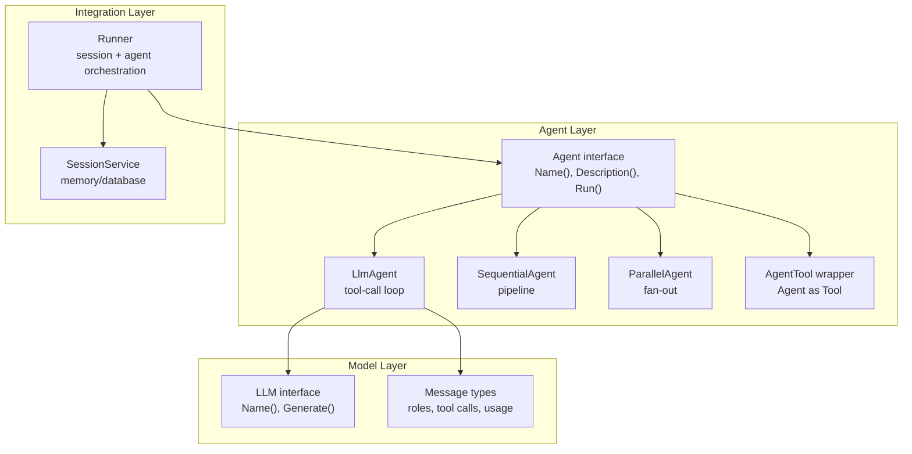
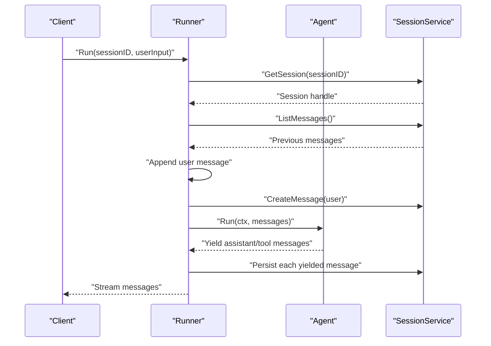
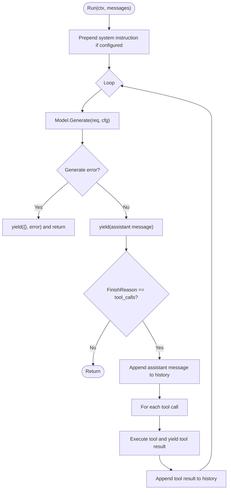
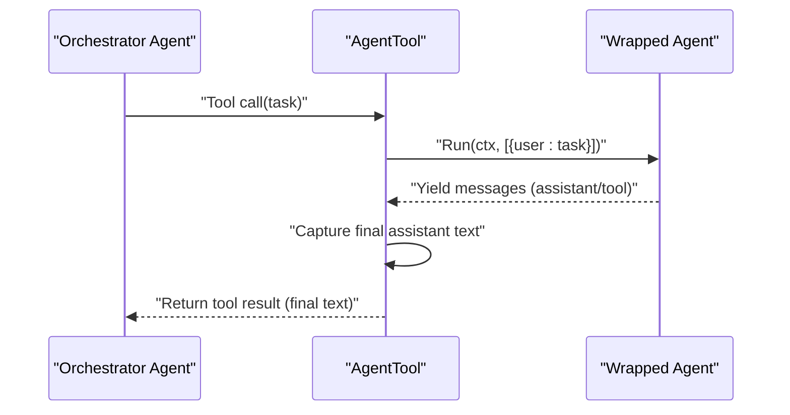
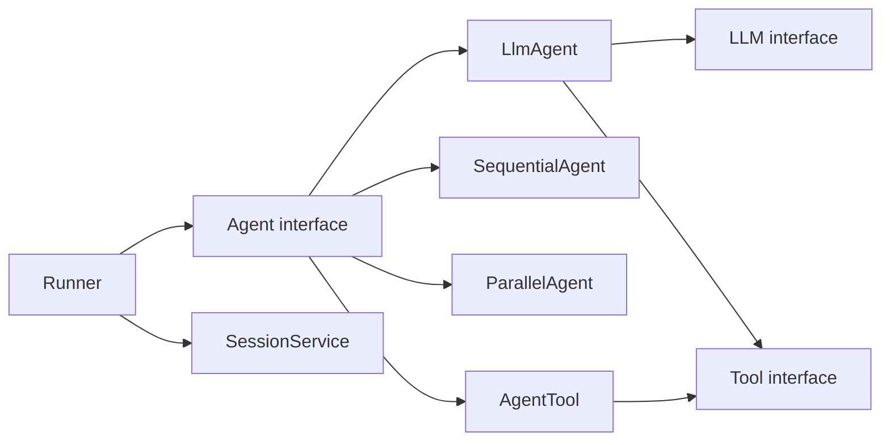

# Custom Agent Development

<cite>
**Referenced Files in This Document**
- [agent.go](file://agent/agent.go)
- [llmagent.go](file://agent/llmagent/llmagent.go)
- [agentool.go](file://agent/agentool/agentool.go)
- [sequential.go](file://agent/sequential/sequential.go)
- [parallel.go](file://agent/parallel/parallel.go)
- [model.go](file://model/model.go)
- [tool.go](file://tool/tool.go)
- [runner.go](file://runner/runner.go)
- [session.go](file://session/session.go)
- [echo.go](file://tool/builtin/echo.go)
- [main.go](file://examples/chat/main.go)
- [llmagent_test.go](file://agent/llmagent/llmagent_test.go)
</cite>

## Table of Contents
1. [Introduction](#introduction)
2. [Project Structure](#project-structure)
3. [Core Components](#core-components)
4. [Architecture Overview](#architecture-overview)
5. [Detailed Component Analysis](#detailed-component-analysis)
6. [Dependency Analysis](#dependency-analysis)
7. [Performance Considerations](#performance-considerations)
8. [Testing Strategies](#testing-strategies)
9. [Production Deployment Patterns](#production-deployment-patterns)
10. [Troubleshooting Guide](#troubleshooting-guide)
11. [Conclusion](#conclusion)

## Introduction
This document explains how to develop custom agents using the Agent interface contract, focusing on streaming response patterns with Go iterators, context cancellation, stateless design, message handling, and error propagation. It covers practical patterns for building agents that integrate with existing LLM providers, delegate work via the AgentTool wrapper, and orchestrate multiple agents in sequential or parallel pipelines. Guidance includes testing strategies, performance considerations, and production deployment patterns.

## Project Structure
The ADK provides a clean separation between stateless agents and stateful runners, with pluggable LLM providers, tools, and session backends. The agent package defines the Agent interface and several built-in agent implementations. The model package defines provider-agnostic LLM interfaces and message types. The runner integrates agents with sessions to persist and stream conversation history.

**Diagram sources**
- [agent.go:10-17](file://agent/agent.go#L10-L17)
- [llmagent.go:25-41](file://agent/llmagent/llmagent.go#L25-L41)
- [sequential.go:18-41](file://agent/sequential/sequential.go#L18-L41)
- [parallel.go:70-101](file://agent/parallel/parallel.go#L70-L101)
- [agentool.go:16-48](file://agent/agentool/agentool.go#L16-L48)
- [model.go:9-23](file://model/model.go#L9-L23)
- [model.go:147-173](file://model/model.go#L147-L173)
- [runner.go:17-37](file://runner/runner.go#L17-L37)
- [session.go:9-23](file://session/session.go#L9-L23)

**Section sources**
- [README.md:35-62](file://README.md#L35-L62)
- [agent.go:10-17](file://agent/agent.go#L10-L17)
- [model.go:9-23](file://model/model.go#L9-L23)
- [runner.go:17-37](file://runner/runner.go#L17-L37)

## Core Components
- Agent interface: Defines Name(), Description(), and Run(ctx, messages) returning an iterator of model.Message and error. This enables streaming responses and incremental processing.
- LlmAgent: A stateless agent that drives an LLM through a tool-call loop, yielding assistant messages and tool results until a stop response.
- AgentTool: Wraps an Agent as a Tool so it can be invoked by an orchestrator LlmAgent via the LLM’s native function-calling mechanism.
- SequentialAgent and ParallelAgent: Compose multiple agents into pipelines (one after another) or fan-out scenarios, preserving message ordering or merging outputs respectively.
- Runner: Coordinates a stateless Agent with a SessionService, loading conversation history, appending user input, persisting yielded messages, and streaming responses.

**Section sources**
- [agent.go:10-17](file://agent/agent.go#L10-L17)
- [llmagent.go:25-105](file://agent/llmagent/llmagent.go#L25-L105)
- [agentool.go:16-79](file://agent/agentool/agentool.go#L16-L79)
- [sequential.go:18-89](file://agent/sequential/sequential.go#L18-L89)
- [parallel.go:70-168](file://agent/parallel/parallel.go#L70-L168)
- [runner.go:17-90](file://runner/runner.go#L17-L90)

## Architecture Overview
The system separates stateless agent logic from stateful session persistence. The Runner loads session history, appends user input, and streams agent outputs back to the session. Agents receive the current conversation context and yield messages incrementally. LlmAgent manages the tool-call loop, while SequentialAgent and ParallelAgent enable composition.

**Diagram sources**
- [runner.go:39-90](file://runner/runner.go#L39-L90)
- [session.go:9-23](file://session/session.go#L9-L23)
- [agent.go:10-17](file://agent/agent.go#L10-L17)

## Detailed Component Analysis

### Agent Interface Contract
- Name(): returns the agent’s name for identification and tool schemas.
- Description(): returns a human-readable description for tool schemas and orchestration.
- Run(ctx, messages): returns an iterator that yields model.Message and error. The caller iterates until completion or breaks early. This enables streaming responses and incremental processing.

Best practices:
- Keep agents stateless; rely on messages passed in and session persistence for state.
- Respect context cancellation; stop work promptly when ctx is cancelled.
- Yield messages in the order they occur (assistant, tool results, etc.) to preserve conversation semantics.
- Propagate errors via the iterator to surface failures to the caller.

**Section sources**
- [agent.go:10-17](file://agent/agent.go#L10-L17)
- [runner.go:76-88](file://runner/runner.go#L76-L88)

### Streaming Response Pattern with Go Iterators and Context Cancellation
LlmAgent demonstrates the streaming pattern:
- Prepend system instruction if configured.
- Call model.Generate in a loop, yielding assistant messages.
- If FinishReason is tool_calls, execute tool calls and yield tool results.
- Stop when FinishReason indicates stop.
- Attach token usage to assistant messages for downstream persistence.

Context cancellation:
- The iterator is driven by the caller; agents should check ctx periodically and return early with an error if cancelled.
- SequentialAgent and ParallelAgent propagate cancellation to sub-agents.

**Diagram sources**
- [llmagent.go:51-105](file://agent/llmagent/llmagent.go#L51-L105)

**Section sources**
- [llmagent.go:51-105](file://agent/llmagent/llmagent.go#L51-L105)
- [sequential.go:56-88](file://agent/sequential/sequential.go#L56-L88)
- [parallel.go:122-168](file://agent/parallel/parallel.go#L122-L168)

### Stateless Agent Design
- LlmAgent is stateless: it does not retain conversation history; it relies on messages passed in and session persistence for continuity.
- SequentialAgent composes agents sequentially, passing the original input plus all previously produced messages to each agent.
- ParallelAgent runs agents concurrently with separate contexts; outputs are merged into a single assistant message.

Best practices:
- Treat agents as pure functions of their inputs; avoid global state.
- Use session services for persistent state and message history.
- Ensure tool execution is deterministic and idempotent where possible.

**Section sources**
- [llmagent.go:25-49](file://agent/llmagent/llmagent.go#L25-L49)
- [sequential.go:18-55](file://agent/sequential/sequential.go#L18-L55)
- [parallel.go:70-85](file://agent/parallel/parallel.go#L70-L85)

### Message Handling Patterns
- Roles: system, user, assistant, tool.
- ToolCalls: assistant messages may request tool invocations; tool results carry ToolCallID to link back.
- ReasoningContent: informational only; preserved through agent outputs.
- Usage: attached to assistant messages for token accounting.

Patterns:
- Yield assistant messages first; if tool_calls are present, yield tool results and then a final assistant stop message.
- Preserve message order to keep conversation semantics intact.

**Section sources**
- [model.go:15-23](file://model/model.go#L15-L23)
- [model.go:125-138](file://model/model.go#L125-L138)
- [model.go:147-173](file://model/model.go#L147-L173)
- [llmagent.go:72-104](file://agent/llmagent/llmagent.go#L72-L104)

### Error Propagation
- LlmAgent yields errors from model.Generate and tool execution.
- SequentialAgent yields the first error encountered from any sub-agent.
- ParallelAgent cancels the shared context upon the first error, signaling siblings to exit early, then yields the error.

Guidelines:
- Return errors via the iterator to inform the caller.
- Ensure context cancellation is respected to avoid resource leaks.
- Log and propagate meaningful errors for observability.

**Section sources**
- [llmagent.go:74-77](file://agent/llmagent/llmagent.go#L74-L77)
- [sequential.go:77-81](file://agent/sequential/sequential.go#L77-L81)
- [parallel.go:135-140](file://agent/parallel/parallel.go#L135-L140)
- [parallel.go:154-160](file://agent/parallel/parallel.go#L154-L160)

### Implementing Custom Agents
To implement a custom agent:
- Define a struct that satisfies the Agent interface (Name, Description, Run).
- Keep Run stateless; accept messages and yield results incrementally.
- Respect context cancellation and propagate errors.
- Optionally wrap your agent as a Tool using AgentTool to enable delegation.

Example patterns:
- Echo agent: a minimal agent that echoes user input as an assistant message.
- Delegation agent: wrap an existing agent with AgentTool to expose it as a tool to another orchestrator agent.

**Section sources**
- [agent.go:10-17](file://agent/agent.go#L10-L17)
- [agentool.go:29-79](file://agent/agentool/agentool.go#L29-L79)
- [echo.go:14-47](file://tool/builtin/echo.go#L14-L47)

### Delegation Patterns Using AgentTool Wrapper
AgentTool converts an Agent into a Tool:
- Uses the agent’s Name() and Description() for the tool’s Definition.
- Expects a single task argument; runs the agent with a user message containing the task.
- Collects the agent’s final assistant text response and returns it as the tool result.
- Silently consumes intermediate messages (tool calls/results) to avoid polluting the orchestrator’s conversation.

**Diagram sources**
- [agentool.go:54-79](file://agent/agentool/agentool.go#L54-L79)
- [agent.go:10-17](file://agent/agent.go#L10-L17)

**Section sources**
- [agentool.go:16-79](file://agent/agentool/agentool.go#L16-L79)

### Integration with Existing LLM Providers
LlmAgent integrates with any provider that implements the LLM interface:
- Model.Generate(req, cfg) returns an assistant message and finish reason.
- Tools are passed in the request; LlmAgent executes tool calls and yields tool results.
- Token usage is attached to assistant messages for persistence.

Examples:
- OpenAI adapter usage is demonstrated in the chat example, including MCP tool integration.

**Section sources**
- [llmagent.go:66-104](file://agent/llmagent/llmagent.go#L66-L104)
- [model.go:9-13](file://model/model.go#L9-L13)
- [main.go:52-124](file://examples/chat/main.go#L52-L124)

## Dependency Analysis
The Agent interface is the core contract; LlmAgent depends on model.LLM and tool.Tool. Runner depends on Agent and SessionService. SequentialAgent and ParallelAgent depend on Agent. AgentTool depends on Agent and tool.Tool.

**Diagram sources**
- [agent.go:10-17](file://agent/agent.go#L10-L17)
- [llmagent.go:25-41](file://agent/llmagent/llmagent.go#L25-L41)
- [sequential.go:18-41](file://agent/sequential/sequential.go#L18-L41)
- [parallel.go:70-101](file://agent/parallel/parallel.go#L70-L101)
- [agentool.go:16-48](file://agent/agentool/agentool.go#L16-L48)
- [model.go:9-13](file://model/model.go#L9-L13)
- [tool.go:17-23](file://tool/tool.go#L17-L23)
- [runner.go:17-37](file://runner/runner.go#L17-L37)
- [session.go:9-23](file://session/session.go#L9-L23)

**Section sources**
- [agent.go:10-17](file://agent/agent.go#L10-L17)
- [llmagent.go:25-41](file://agent/llmagent/llmagent.go#L25-L41)
- [sequential.go:18-41](file://agent/sequential/sequential.go#L18-L41)
- [parallel.go:70-101](file://agent/parallel/parallel.go#L70-L101)
- [agentool.go:16-48](file://agent/agentool/agentool.go#L16-L48)
- [runner.go:17-37](file://runner/runner.go#L17-L37)
- [session.go:9-23](file://session/session.go#L9-L23)

## Performance Considerations
- Streaming via iterators avoids buffering entire conversations; process messages incrementally.
- ParallelAgent fans out sub-agents concurrently; use MergeFunc to combine outputs efficiently.
- SequentialAgent appends all prior messages to each agent; consider message compaction to reduce overhead.
- Respect context cancellation to prevent wasted work on slow or failing sub-agents.
- Attach token usage to assistant messages for cost monitoring and budgeting.

[No sources needed since this section provides general guidance]

## Testing Strategies
Recommended approaches:
- Unit tests with deterministic mocks for LLM.Generate to replay sequences and verify tool-call loops.
- Integration tests using real LLMs (e.g., OpenAI) gated behind environment variables.
- Echo tool tests to validate tool-call round-trips.
- Multi-turn conversation tests to ensure context handling.
- Reasoning model tests to verify ReasoningContent pass-through.

Examples from the test suite:
- Mock LLM with predefined responses to validate agent behavior without network calls.
- Integration tests that require OPENAI_API_KEY and optional OPENAI_MODEL.
- Echo tool integration tests verifying tool-call loop and final assistant stop message.
- Multi-turn tests appending prior results to history.
- Reasoning model tests validating non-empty ReasoningContent.

**Section sources**
- [llmagent_test.go:57-74](file://agent/llmagent/llmagent_test.go#L57-L74)
- [llmagent_test.go:119-139](file://agent/llmagent/llmagent_test.go#L119-L139)
- [llmagent_test.go:163-200](file://agent/llmagent/llmagent_test.go#L163-L200)
- [llmagent_test.go:202-239](file://agent/llmagent/llmagent_test.go#L202-L239)
- [llmagent_test.go:248-278](file://agent/llmagent/llmagent_test.go#L248-L278)
- [llmagent_test.go:282-337](file://agent/llmagent/llmagent_test.go#L282-L337)
- [llmagent_test.go:339-362](file://agent/llmagent/llmagent_test.go#L339-L362)

## Production Deployment Patterns
- Use Runner to coordinate stateless agents with persistent sessions.
- Choose session backends: in-memory for ephemeral use, SQLite for persistence.
- Integrate MCP servers for external tools; wrap agents as tools for cross-agent delegation.
- Monitor token usage and implement message compaction to manage long histories.
- Apply graceful shutdown and context cancellation to handle traffic spikes and maintenance.

**Section sources**
- [runner.go:17-90](file://runner/runner.go#L17-L90)
- [session.go:9-23](file://session/session.go#L9-L23)
- [main.go:52-173](file://examples/chat/main.go#L52-L173)

## Troubleshooting Guide
Common issues and resolutions:
- No output or stuck iterations: verify the iterator is consumed; ensure Run yields messages and respects break conditions.
- Tool not found: AgentTool maps tool names to tools; confirm tool definitions match.
- Excessive latency: consider ParallelAgent for concurrent sub-agents; ensure MergeFunc is efficient.
- Memory growth: apply session compaction to archive old messages; reduce tool-call verbosity.
- Cancellation not respected: ensure Run checks ctx periodically and returns early on cancellation.

**Section sources**
- [agentool.go:108-127](file://agent/agentool/agentool.go#L108-L127)
- [parallel.go:112-168](file://agent/parallel/parallel.go#L112-L168)
- [runner.go:76-88](file://runner/runner.go#L76-L88)

## Conclusion
Custom agents in ADK are designed around the Agent interface, emphasizing statelessness, streaming via Go iterators, and robust error propagation. LlmAgent automates tool-call loops, while SequentialAgent and ParallelAgent enable composition. AgentTool allows agents to be invoked as tools, facilitating delegation and multi-agent orchestration. With Runner coordinating sessions and persistence, and comprehensive testing strategies, ADK provides a solid foundation for building production-grade AI agents.