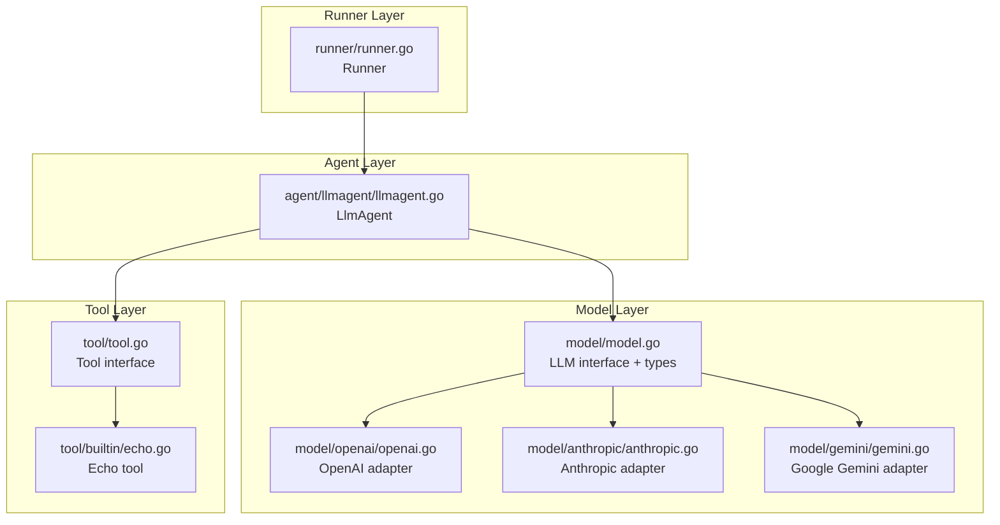
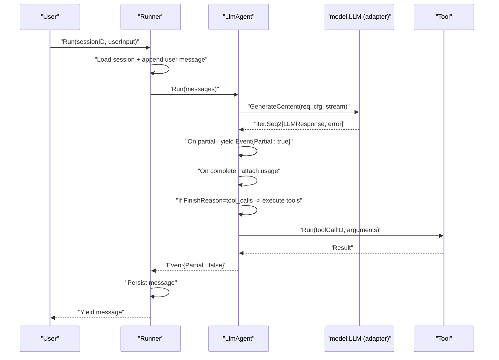
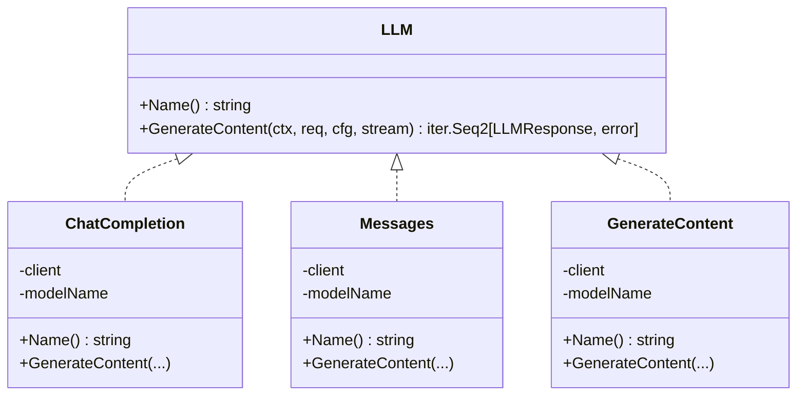
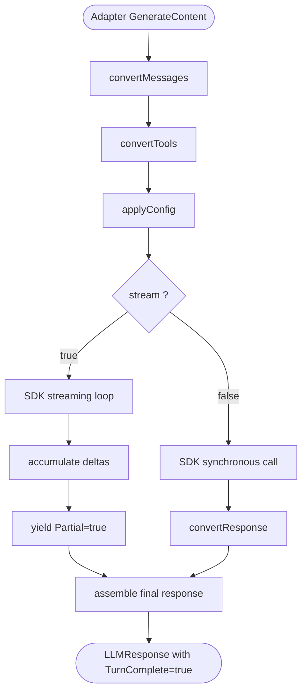
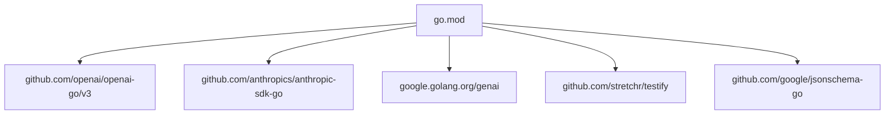
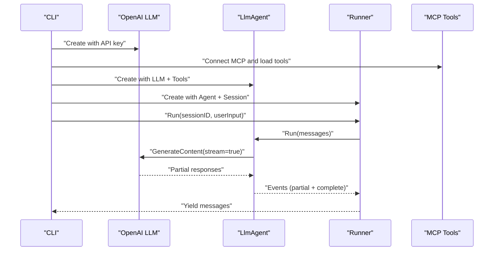

# Custom LLM Provider

<cite>
**Referenced Files in This Document**
- [model.go](file://model/model.go)
- [openai.go](file://model/openai/openai.go)
- [openai_test.go](file://model/openai/openai_test.go)
- [anthropic.go](file://model/anthropic/anthropic.go)
- [anthropic_test.go](file://model/anthropic/anthropic_test.go)
- [gemini.go](file://model/gemini/gemini.go)
- [gemini_test.go](file://model/gemini/gemini_test.go)
- [llmagent.go](file://agent/llmagent/llmagent.go)
- [runner.go](file://runner/runner.go)
- [tool.go](file://tool/tool.go)
- [echo.go](file://tool/builtin/echo.go)
- [main.go](file://examples/chat/main.go)
- [README.md](file://README.md)
- [go.mod](file://go.mod)
</cite>

## Table of Contents
1. [Introduction](#introduction)
2. [Project Structure](#project-structure)
3. [Core Components](#core-components)
4. [Architecture Overview](#architecture-overview)
5. [Detailed Component Analysis](#detailed-component-analysis)
6. [Dependency Analysis](#dependency-analysis)
7. [Performance Considerations](#performance-considerations)
8. [Troubleshooting Guide](#troubleshooting-guide)
9. [Conclusion](#conclusion)
10. [Appendices](#appendices)

## Introduction
This document explains how to develop custom Large Language Model (LLM) providers using the ADK framework. It covers the LLM interface contract, adapter pattern implementation, request/response transformation, streaming support, error handling, authentication, rate limiting, retry strategies, tool call schema validation, performance optimization, testing approaches, and production deployment considerations. The guide references concrete implementations for OpenAI, Anthropic, and Google Gemini to illustrate best practices for adding new providers.

## Project Structure
The ADK organizes LLM providers under the model package, with each provider in its own subpackage. The agent layer consumes the provider-agnostic LLM interface, while the runner coordinates sessions and message persistence.

**Diagram sources**
- [model.go:10-227](file://model/model.go#L10-L227)
- [openai.go:19-164](file://model/openai/openai.go#L19-L164)
- [anthropic.go:25-93](file://model/anthropic/anthropic.go#L25-L93)
- [gemini.go:17-201](file://model/gemini/gemini.go#L17-L201)
- [llmagent.go:29-125](file://agent/llmagent/llmagent.go#L29-L125)
- [runner.go:17-90](file://runner/runner.go#L17-L90)
- [tool.go:9-23](file://tool/tool.go#L9-L23)
- [echo.go:14-46](file://tool/builtin/echo.go#L14-L46)

**Section sources**
- [README.md:65-82](file://README.md#L65-L82)
- [go.mod:1-47](file://go.mod#L1-L47)

## Core Components
The core LLM interface and data structures are defined in the model package. They provide a provider-agnostic contract for message exchange, tool calls, and response handling.

- LLM interface: Defines Name and GenerateContent with streaming support via Go iterators.
- Message types: Roles, FinishReason, ContentPart, ToolCall, TokenUsage, Message, Choice, LLMRequest, LLMResponse, Event.
- GenerateConfig: Controls temperature, reasoning effort, service tier, max tokens, thinking budget, and enabling/disabling reasoning.

Key responsibilities:
- Provider-agnostic request/response: LLMRequest and LLMResponse encapsulate provider differences.
- Streaming: GenerateContent returns an iterator; Partial and TurnComplete distinguish streaming fragments vs. final responses.
- Tool calls: ToolCall carries function name and JSON arguments; providers map their native tool-call formats to the unified schema.

**Section sources**
- [model.go:10-227](file://model/model.go#L10-L227)

## Architecture Overview
The system separates concerns across layers:
- Runner: Loads session history, persists messages, and drives the Agent per user turn.
- Agent: Stateless, receives messages and yields events; orchestrates tool-call loops.
- LLM adapters: Implement model.LLM for specific providers (OpenAI, Anthropic, Gemini).
- Tool layer: Provides the Tool interface and built-in tools with JSON Schema validation.

**Diagram sources**
- [runner.go:39-90](file://runner/runner.go#L39-L90)
- [llmagent.go:55-125](file://agent/llmagent/llmagent.go#L55-L125)
- [model.go:10-227](file://model/model.go#L10-L227)

## Detailed Component Analysis

### LLM Interface Contract
The LLM interface defines:
- Name(): returns the model identifier.
- GenerateContent(ctx, req, cfg, stream): returns an iterator of LLMResponse and error. When stream is true, yields partial responses (Partial=true) followed by a final complete response (TurnComplete=true).

Behavioral guarantees:
- Exactly one final complete response when stream=false.
- Zero or more partial responses when stream=true, followed by a single final complete response.
- Partial responses carry incremental text; TurnComplete indicates the end of the turn.

**Section sources**
- [model.go:10-18](file://model/model.go#L10-L18)
- [model.go:188-227](file://model/model.go#L188-L227)

### Adapter Pattern Implementation
Each provider implements model.LLM with a dedicated struct and methods:
- OpenAI: ChatCompletion with New(apiKey, baseURL, modelName), Name(), GenerateContent().
- Anthropic: Messages with New(apiKey, modelName), Name(), GenerateContent().
- Gemini: GenerateContent with New(ctx, apiKey, modelName) and NewVertexAI(ctx, project, location, modelName), Name(), GenerateContent().

Transformation responsibilities:
- Request conversion: convertMessages, convertTools, applyConfig.
- Response conversion: convertResponse, convertFinishReason.
- Streaming: accumulate deltas, yield partials, assemble final response.

**Diagram sources**
- [model.go:10-18](file://model/model.go#L10-L18)
- [openai.go:19-42](file://model/openai/openai.go#L19-L42)
- [anthropic.go:25-45](file://model/anthropic/anthropic.go#L25-L45)
- [gemini.go:17-64](file://model/gemini/gemini.go#L17-L64)

**Section sources**
- [openai.go:19-164](file://model/openai/openai.go#L19-L164)
- [anthropic.go:25-93](file://model/anthropic/anthropic.go#L25-L93)
- [gemini.go:17-201](file://model/gemini/gemini.go#L17-L201)

### Request/Response Transformation
Providers translate between the provider-agnostic types and provider-specific SDK types:

- OpenAI:
  - convertMessages: maps roles and multi-modal parts to SDK message unions.
  - convertTools: marshals tool definitions and JSON Schemas to SDK tool unions.
  - applyConfig: maps GenerateConfig to SDK params and optional JSON options.
  - convertResponse: maps SDK choice and usage to LLMResponse.

- Anthropic:
  - convertMessages: extracts system prompts, batches tool results, and maps content blocks.
  - convertTools: builds tool definitions with JSON Schema input schemas.
  - applyConfig: maps EnableThinking to ThinkingConfig; Temperature to SDK param.
  - convertResponse: aggregates text and thinking parts; maps stop reasons.

- Gemini:
  - convertMessages: extracts system instruction, batches tool results, maps parts.
  - convertTools: builds FunctionDeclarations with ParametersJsonSchema.
  - applyConfig: maps ReasoningEffort/EnableThinking to ThinkingConfig; Temperature.
  - convertResponse: collects text and thought parts; maps finish reasons.

**Diagram sources**
- [openai.go:48-164](file://model/openai/openai.go#L48-L164)
- [anthropic.go:50-93](file://model/anthropic/anthropic.go#L50-L93)
- [gemini.go:70-201](file://model/gemini/gemini.go#L70-L201)

**Section sources**
- [openai.go:166-362](file://model/openai/openai.go#L166-L362)
- [anthropic.go:95-326](file://model/anthropic/anthropic.go#L95-L326)
- [gemini.go:203-478](file://model/gemini/gemini.go#L203-L478)

### Streaming Support
All three adapters support streaming:
- OpenAI: Uses a streaming iterator; accumulates content and tool calls across chunks; yields partial text and assembles final response.
- Anthropic: Streams via SDK; batches tool results; yields partial text.
- Gemini: Streams via SDK; supports reasoning content; yields partial text and reasoning deltas.

Streaming semantics:
- Partial responses (Partial=true) carry incremental content and reasoning.
- Final response (TurnComplete=true) includes aggregated content, tool calls, and usage.

**Section sources**
- [openai.go:88-164](file://model/openai/openai.go#L88-L164)
- [anthropic.go:47-93](file://model/anthropic/anthropic.go#L47-L93)
- [gemini.go:108-201](file://model/gemini/gemini.go#L108-L201)

### Error Handling
Adapters wrap provider errors with contextual messages and propagate them via the iterator. Typical patterns:
- Validation errors during message/tool conversion.
- API call failures (non-streaming).
- Stream iteration errors (streaming).
- Empty choices/responses guarded with errors.

**Section sources**
- [openai.go:48-87](file://model/openai/openai.go#L48-L87)
- [anthropic.go:50-92](file://model/anthropic/anthropic.go#L50-L92)
- [gemini.go:70-106](file://model/gemini/gemini.go#L70-L106)

### Authentication Mechanisms
- OpenAI: API key via constructor options; optional base URL for compatible endpoints.
- Anthropic: API key via constructor options.
- Gemini: API key for developer API; ADC for Vertex AI via NewVertexAI.

Environment-based examples:
- OpenAI: OPENAI_API_KEY (required), OPENAI_BASE_URL (optional), OPENAI_MODEL (optional).
- Anthropic: ANTHROPIC_API_KEY (required), ANTHROPIC_MODEL (optional).
- Gemini: GEMINI_API_KEY (required), GEMINI_MODEL (optional); Vertex AI requires project and location.

**Section sources**
- [openai.go:25-37](file://model/openai/openai.go#L25-L37)
- [anthropic.go:31-40](file://model/anthropic/anthropic.go#L31-L40)
- [gemini.go:23-59](file://model/gemini/gemini.go#L23-L59)
- [openai_test.go:23-56](file://model/openai/openai_test.go#L23-L56)
- [anthropic_test.go:20-49](file://model/anthropic/anthropic_test.go#L20-L49)
- [gemini_test.go:21-77](file://model/gemini/gemini_test.go#L21-L77)

### Rate Limiting and Retry Strategies
The adapters do not implement rate limiting or retries internally. Recommended approaches:
- Wrap adapters with external retry/backoff libraries around GenerateContent calls.
- Use provider-side rate limits and quotas; monitor FinishReason and usage metrics.
- Implement circuit breakers for transient failures.

[No sources needed since this section provides general guidance]

### Tool Call Schema Validation
Providers rely on the Tool interface’s Definition.InputSchema (JSON Schema) to describe tool inputs:
- OpenAI: convertTools marshals schema to SDK FunctionParameters.
- Anthropic: convertTools marshals schema to ToolInputSchemaParam.
- Gemini: convertTools uses ParametersJsonSchema to pass raw JSON Schema.

Built-in echo tool demonstrates schema generation and validation:
- Definition includes Name, Description, and InputSchema.
- Run parses JSON arguments safely.

**Section sources**
- [tool.go:9-23](file://tool/tool.go#L9-L23)
- [echo.go:14-46](file://tool/builtin/echo.go#L14-L46)
- [openai.go:245-277](file://model/openai/openai.go#L245-L277)
- [anthropic.go:213-240](file://model/anthropic/anthropic.go#L213-L240)
- [gemini.go:326-351](file://model/gemini/gemini.go#L326-L351)

### Implementing a New Provider
Follow these steps to add a new provider:

1. Define a struct implementing model.LLM:
   - Fields for client/connection and model name.
   - Methods: Name(), GenerateContent(ctx, req, cfg, stream).

2. Implement request conversion:
   - convertMessages: map roles and multi-modal parts to provider SDK types.
   - convertTools: map tool definitions and JSON Schemas to provider tool declarations.
   - applyConfig: map GenerateConfig to provider-specific parameters.

3. Implement response conversion:
   - convertResponse: map provider response to LLMResponse.
   - convertFinishReason: map provider finish reasons to model.FinishReason.

4. Handle streaming:
   - Accumulate deltas across chunks.
   - Yield Partial=true events for incremental content.
   - Assemble and yield TurnComplete=true final response.

5. Add tests:
   - Unit tests for conversion functions and config mapping.
   - Integration tests using environment variables for credentials.

6. Example references:
   - OpenAI adapter for synchronous and streaming flows.
   - Anthropic adapter for thinking configuration.
   - Gemini adapter for reasoning content and Vertex AI.

**Section sources**
- [openai.go:19-164](file://model/openai/openai.go#L19-L164)
- [anthropic.go:25-93](file://model/anthropic/anthropic.go#L25-L93)
- [gemini.go:17-201](file://model/gemini/gemini.go#L17-L201)

### Testing Approaches
- Unit tests: Validate conversion functions and config mapping without network calls.
- Integration tests: Use environment variables to call live APIs; test tool-call loops and reasoning features.
- Echo tool: Demonstrates schema validation and safe argument parsing.

Examples:
- OpenAI: Tests for finish reason mapping, message/tool conversion, reasoning toggles.
- Anthropic: Tests for thinking configuration and stop reason mapping.
- Gemini: Tests for reasoning effort mapping and Vertex AI integration.

**Section sources**
- [openai_test.go:58-355](file://model/openai/openai_test.go#L58-L355)
- [anthropic_test.go:51-376](file://model/anthropic/anthropic_test.go#L51-L376)
- [gemini_test.go:79-507](file://model/gemini/gemini_test.go#L79-L507)
- [echo.go:14-46](file://tool/builtin/echo.go#L14-L46)

### Production Deployment Considerations
- Environment variables for credentials and model selection.
- Streaming for responsive UIs; ensure clients handle partial events.
- Token usage tracking via LLMResponse.Usage for cost monitoring.
- Session persistence via Runner to maintain conversation continuity.
- MCP tool integration for dynamic tool discovery and secure transport.

**Section sources**
- [runner.go:17-90](file://runner/runner.go#L17-L90)
- [main.go:52-173](file://examples/chat/main.go#L52-L173)

## Dependency Analysis
External dependencies include provider SDKs and testing utilities. The model package depends on the tool package for tool definitions.

**Diagram sources**
- [go.mod:5-15](file://go.mod#L5-L15)

**Section sources**
- [go.mod:1-47](file://go.mod#L1-L47)

## Performance Considerations
- Prefer streaming for latency-sensitive applications; yield partial events promptly.
- Minimize allocations in hot paths (e.g., string builders for deltas).
- Use provider-specific parameters (e.g., MaxTokens, Temperature) judiciously to balance quality and cost.
- Monitor TokenUsage to optimize prompt sizes and reasoning budgets.
- Batch tool results efficiently to reduce round trips.

[No sources needed since this section provides general guidance]

## Troubleshooting Guide
Common issues and resolutions:
- Unknown roles or content parts: Ensure message roles and parts are supported by the adapter.
- Empty choices or responses: Validate request construction and tool definitions.
- Streaming errors: Check provider SDK errors and ensure proper iteration termination.
- Tool call mismatches: Verify tool names and JSON argument schemas align with provider expectations.

**Section sources**
- [openai.go:166-243](file://model/openai/openai.go#L166-L243)
- [anthropic.go:95-147](file://model/anthropic/anthropic.go#L95-L147)
- [gemini.go:203-268](file://model/gemini/gemini.go#L203-L268)

## Conclusion
The ADK’s provider-agnostic LLM interface and adapter pattern enable seamless integration of multiple LLM providers. By following the established patterns for request/response transformation, streaming, error handling, and testing, developers can implement robust custom providers that integrate cleanly with the agent and runner layers. Production deployments benefit from environment-driven configuration, streaming UX, usage tracking, and secure tool integrations.

## Appendices

### Example: Building a Chat Agent with OpenAI
The example demonstrates constructing an LLM, loading MCP tools, creating an agent, and running a chat loop with streaming.

**Diagram sources**
- [main.go:52-173](file://examples/chat/main.go#L52-L173)
- [llmagent.go:55-125](file://agent/llmagent/llmagent.go#L55-L125)
- [runner.go:39-90](file://runner/runner.go#L39-L90)

**Section sources**
- [main.go:52-173](file://examples/chat/main.go#L52-L173)