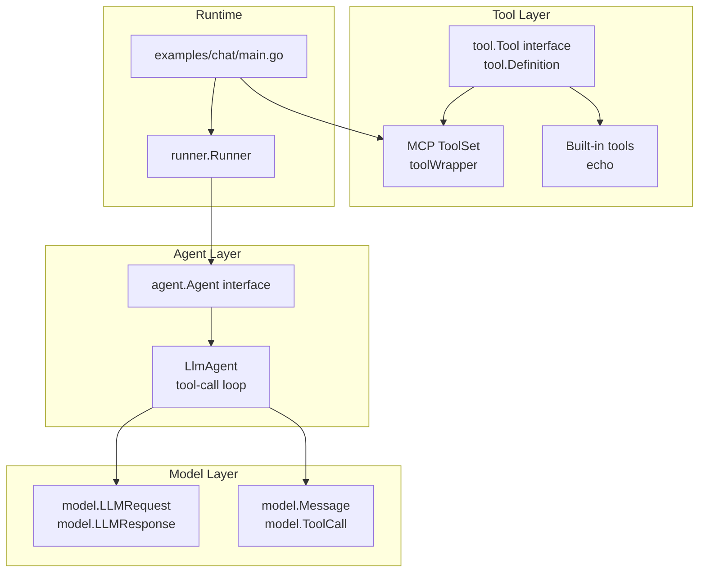
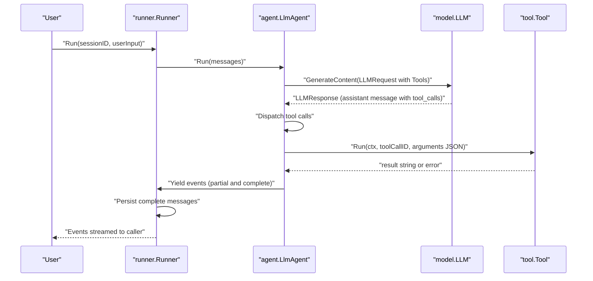
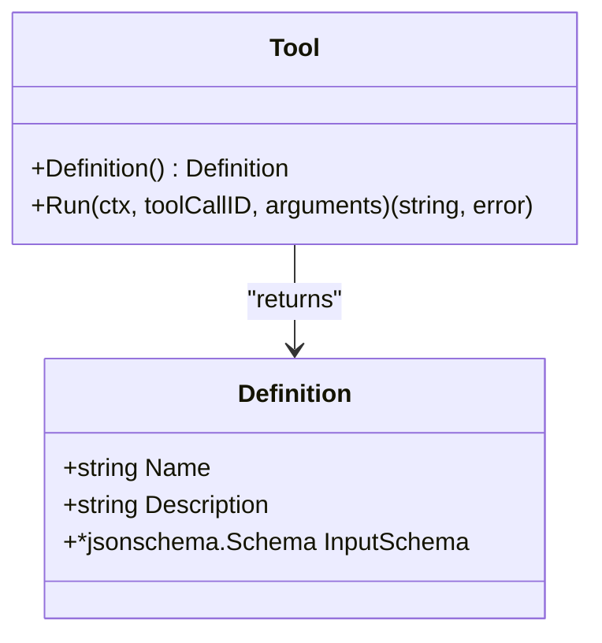
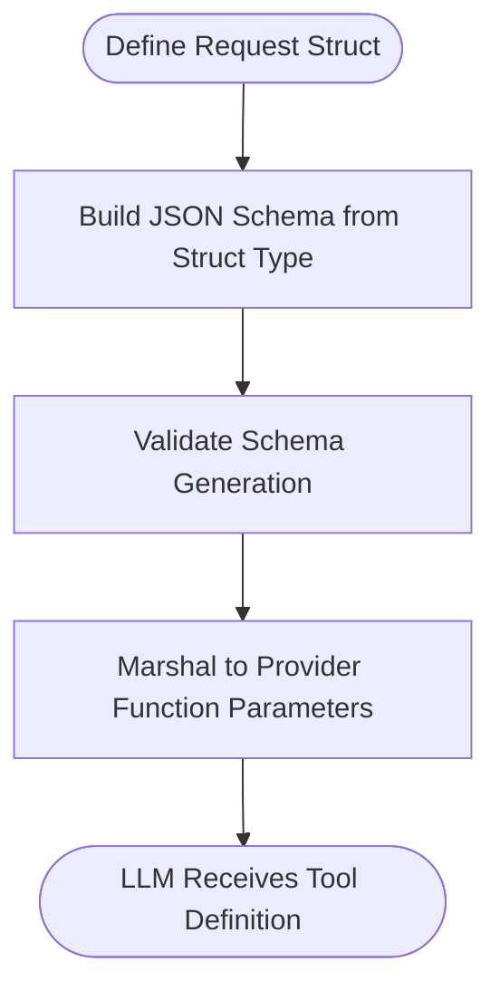
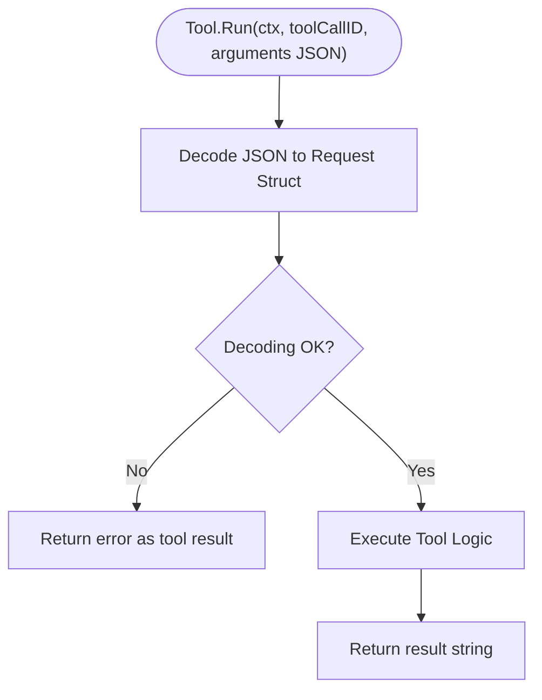
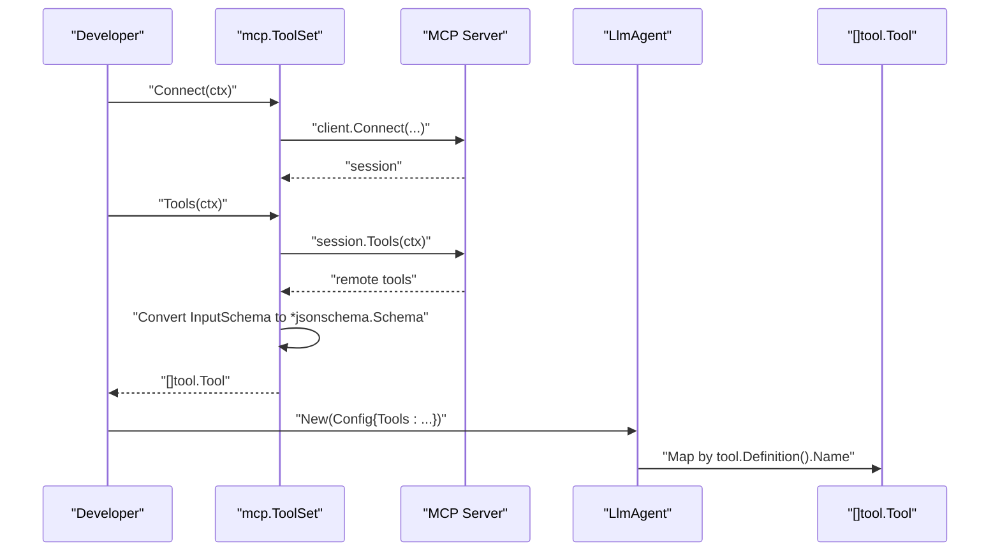
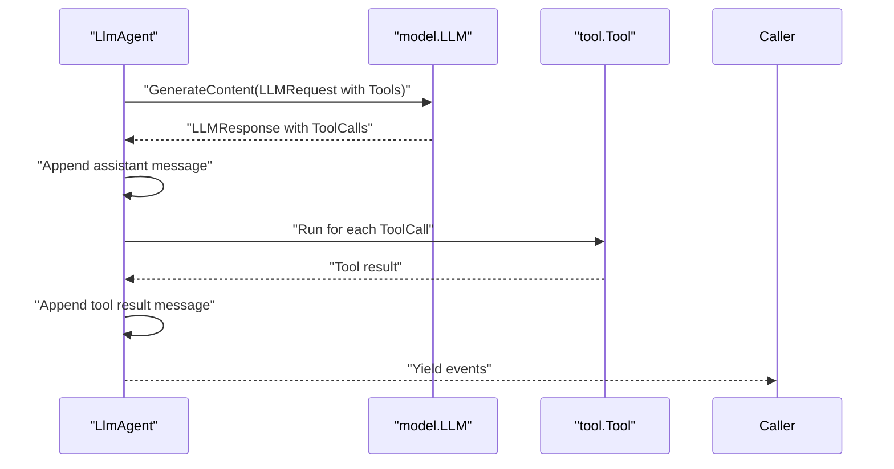
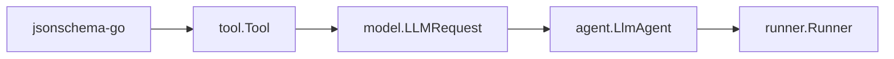

# Custom Tool Development

<cite>
**Referenced Files in This Document**
- [tool/tool.go](file://tool/tool.go)
- [tool/builtin/echo.go](file://tool/builtin/echo.go)
- [tool/mcp/mcp.go](file://tool/mcp/mcp.go)
- [agent/agent.go](file://agent/agent.go)
- [agent/llmagent/llmagent.go](file://agent/llmagent/llmagent.go)
- [model/model.go](file://model/model.go)
- [model/openai/openai.go](file://model/openai/openai.go)
- [runner/runner.go](file://runner/runner.go)
- [examples/chat/main.go](file://examples/chat/main.go)
- [README.md](file://README.md)
</cite>

## Table of Contents
1. [Introduction](#introduction)
2. [Project Structure](#project-structure)
3. [Core Components](#core-components)
4. [Architecture Overview](#architecture-overview)
5. [Detailed Component Analysis](#detailed-component-analysis)
6. [Dependency Analysis](#dependency-analysis)
7. [Performance Considerations](#performance-considerations)
8. [Troubleshooting Guide](#troubleshooting-guide)
9. [Conclusion](#conclusion)
10. [Appendices](#appendices)

## Introduction
This document explains how to develop custom tools for the ADK (Agent Development Kit). It covers the Tool interface contract, JSON schema design for tool parameters, execution logic, validation patterns, tool registration and discovery, integration with agents, and practical examples including built-in tools and MCP tool integration. It also includes testing strategies, performance considerations, and security best practices for tool execution.

## Project Structure
The repository organizes tooling around a small, focused set of packages:
- tool: Defines the Tool interface and tool metadata (Definition) and includes built-in and MCP integrations.
- agent: Provides the Agent interface and the LlmAgent implementation that orchestrates tool calls.
- model: Defines provider-agnostic message types, tool call structures, and LLM request/response contracts.
- runner: Wires sessions and agents together for end-to-end chat flows.
- examples: Demonstrates MCP tool integration with a real server.

**Diagram sources**
- [tool/tool.go:17-23](file://tool/tool.go#L17-L23)
- [tool/builtin/echo.go:14-46](file://tool/builtin/echo.go#L14-L46)
- [tool/mcp/mcp.go:15-121](file://tool/mcp/mcp.go#L15-L121)
- [agent/agent.go:10-19](file://agent/agent.go#L10-L19)
- [agent/llmagent/llmagent.go:29-148](file://agent/llmagent/llmagent.go#L29-L148)
- [model/model.go:130-196](file://model/model.go#L130-L196)
- [runner/runner.go:17-108](file://runner/runner.go#L17-L108)
- [examples/chat/main.go:52-180](file://examples/chat/main.go#L52-L180)

**Section sources**
- [README.md:65-82](file://README.md#L65-L82)
- [tool/tool.go:9-23](file://tool/tool.go#L9-L23)
- [model/model.go:130-196](file://model/model.go#L130-L196)

## Core Components
- Tool interface contract
  - Definition(): returns tool metadata including name, description, and InputSchema.
  - Run(ctx, toolCallID, arguments): executes the tool with JSON-encoded arguments and returns a string result or an error.
- Definition schema
  - InputSchema is a JSON Schema describing the tool’s input parameters. It is used by LLM providers to enable function calling and automatic validation.
- Tool execution model
  - Agents receive tool calls via model.ToolCall (with Arguments as a JSON string).
  - Tools receive the Arguments JSON string and return a result string.
  - Errors are surfaced as tool result messages with error details.

**Section sources**
- [tool/tool.go:9-23](file://tool/tool.go#L9-L23)
- [model/model.go:130-143](file://model/model.go#L130-L143)
- [agent/llmagent/llmagent.go:127-147](file://agent/llmagent/llmagent.go#L127-L147)

## Architecture Overview
The tool system integrates with agents and LLM providers through a consistent contract. The LlmAgent manages a loop where it requests tool calls from the model, executes them via registered tools, and appends results back into the conversation history.

**Diagram sources**
- [runner/runner.go:39-95](file://runner/runner.go#L39-L95)
- [agent/llmagent/llmagent.go:55-125](file://agent/llmagent/llmagent.go#L55-L125)
- [model/model.go:188-212](file://model/model.go#L188-L212)
- [tool/tool.go:17-23](file://tool/tool.go#L17-L23)

## Detailed Component Analysis

### Tool Interface Contract
- Definition
  - Name: unique tool identifier used to match model-generated tool calls.
  - Description: human-readable description shown to the model.
  - InputSchema: JSON Schema describing the tool’s input parameters.
- Run
  - Receives context, toolCallID, and a JSON string of arguments.
  - Must return a string result or propagate an error.
  - The agent maps missing tools to explicit error messages and surfaces other errors as tool results.

**Diagram sources**
- [tool/tool.go:9-23](file://tool/tool.go#L9-L23)

**Section sources**
- [tool/tool.go:9-23](file://tool/tool.go#L9-L23)
- [agent/llmagent/llmagent.go:127-147](file://agent/llmagent/llmagent.go#L127-L147)

### JSON Schema Design Guidelines for Tool Parameters
- Use a dedicated request struct per tool with JSON tags and embedded JSON Schema comments for clarity.
- Build the InputSchema from the request struct type using a JSON Schema generator.
- Ensure InputSchema includes required fields, types, and constraints to guide the model’s function calling.
- Provider adapters marshal the schema to provider-specific function parameter formats.

**Diagram sources**
- [tool/builtin/echo.go:18-34](file://tool/builtin/echo.go#L18-L34)
- [model/openai/openai.go:254-277](file://model/openai/openai.go#L254-L277)

**Section sources**
- [tool/builtin/echo.go:18-34](file://tool/builtin/echo.go#L18-L34)
- [model/openai/openai.go:254-277](file://model/openai/openai.go#L254-L277)

### Execution Logic and Validation Patterns
- Arguments decoding
  - Tools decode the JSON arguments string into a strongly-typed request struct.
  - Errors during decoding are returned as tool results.
- Tool call dispatch
  - The agent resolves tools by name and executes Run with the provided arguments.
  - Missing tools produce explicit error messages; other errors become tool results.
- Error handling
  - Tool errors are converted to tool result strings.
  - MCP tool wrapper propagates errors from the remote tool call.

**Diagram sources**
- [tool/builtin/echo.go:40-46](file://tool/builtin/echo.go#L40-L46)
- [agent/llmagent/llmagent.go:127-147](file://agent/llmagent/llmagent.go#L127-L147)

**Section sources**
- [tool/builtin/echo.go:40-46](file://tool/builtin/echo.go#L40-L46)
- [agent/llmagent/llmagent.go:127-147](file://agent/llmagent/llmagent.go#L127-L147)

### Tool Registration and Discovery Mechanisms
- Built-in tools
  - Tools are constructed with a Definition containing name, description, and InputSchema.
  - They are registered into the agent’s tool map by name.
- MCP tool integration
  - ToolSet.Connect establishes a session with an MCP server.
  - ToolSet.Tools lists remote tools, converts their input schemas to JSON Schema, and wraps them as tool.Tool instances.
  - The agent receives these tools via model.LLMRequest.Tools and dispatches calls automatically.

**Diagram sources**
- [tool/mcp/mcp.go:22-80](file://tool/mcp/mcp.go#L22-L80)
- [agent/llmagent/llmagent.go:35-44](file://agent/llmagent/llmagent.go#L35-L44)

**Section sources**
- [tool/mcp/mcp.go:22-80](file://tool/mcp/mcp.go#L22-L80)
- [agent/llmagent/llmagent.go:35-44](file://agent/llmagent/llmagent.go#L35-L44)

### Integration with Agents
- LlmAgent configuration
  - Accepts a list of tool.Tool instances.
  - Builds an internal map keyed by tool name for dispatch.
- Tool-call loop
  - After receiving an assistant message with tool_calls, the agent executes each tool and appends the result back into the conversation.
  - Streaming is preserved: partial events are forwarded while only complete events are persisted.

**Diagram sources**
- [agent/llmagent/llmagent.go:55-125](file://agent/llmagent/llmagent.go#L55-L125)
- [model/model.go:188-212](file://model/model.go#L188-L212)

**Section sources**
- [agent/llmagent/llmagent.go:55-125](file://agent/llmagent/llmagent.go#L55-L125)
- [model/model.go:188-212](file://model/model.go#L188-L212)

### Examples of Implementing Various Types of Tools

#### Built-in Tool Pattern (Echo)
- Define a request struct with JSON tags and embedded JSON Schema comments.
- Build the InputSchema from the request struct type.
- Implement Tool with Definition() returning the Definition and Run() decoding arguments and returning the result.

**Section sources**
- [tool/builtin/echo.go:14-46](file://tool/builtin/echo.go#L14-L46)

#### MCP Tool Integration
- Create a ToolSet with a transport to the MCP server.
- Connect to the server and list tools.
- Wrap discovered tools and pass them to the agent.

**Section sources**
- [tool/mcp/mcp.go:15-121](file://tool/mcp/mcp.go#L15-L121)
- [examples/chat/main.go:52-180](file://examples/chat/main.go#L52-L180)

### Testing Strategies
- Unit tests for tool logic
  - Decode arguments and assert expected behavior.
  - Validate error propagation by asserting non-empty results and error conditions.
- Integration tests with real providers
  - Use environment variables to configure LLM credentials and models.
  - Verify tool-call loops and reasoning content handling.
- MCP tests
  - Connect to a real MCP server, list tools, and run a representative tool with sample arguments.

**Section sources**
- [agent/llmagent/llmagent_test.go:171-208](file://agent/llmagent/llmagent_test.go#L171-L208)
- [tool/mcp/mcp_test.go:44-101](file://tool/mcp/mcp_test.go#L44-L101)

## Dependency Analysis
- Tool depends on JSON Schema generation to describe inputs.
- Agent depends on Tool via model.LLMRequest.Tools and dispatches by tool name.
- LLM providers depend on Tool.Definition to construct function definitions.
- Runner depends on Agent and persists complete messages.

**Diagram sources**
- [tool/tool.go:6](file://tool/tool.go#L6)
- [model/model.go:188-196](file://model/model.go#L188-L196)
- [agent/llmagent/llmagent.go:29-44](file://agent/llmagent/llmagent.go#L29-L44)
- [runner/runner.go:17-37](file://runner/runner.go#L17-L37)

**Section sources**
- [tool/tool.go:6](file://tool/tool.go#L6)
- [model/model.go:188-196](file://model/model.go#L188-L196)
- [agent/llmagent/llmagent.go:29-44](file://agent/llmagent/llmagent.go#L29-L44)
- [runner/runner.go:17-37](file://runner/runner.go#L17-L37)

## Performance Considerations
- Minimize tool-side computation
  - Offload heavy work to asynchronous jobs or external services; return quick responses or queued job IDs.
- Batch and cache
  - Cache frequently accessed resources and batch repeated operations.
- Streaming
  - Use streaming responses from the model to improve perceived latency; the agent already streams partial events.
- Schema precision
  - Keep InputSchema precise to reduce model confusion and unnecessary retries.

[No sources needed since this section provides general guidance]

## Troubleshooting Guide
- Tool not found
  - The agent maps tools by name; ensure the tool’s Definition.Name matches the model’s requested tool name.
- Argument decoding errors
  - Validate that the Arguments JSON matches the tool’s InputSchema; errors surface as tool results.
- MCP connectivity
  - Confirm transport configuration and authentication; verify that Tools() returns non-empty tool sets.
- Error surfacing
  - Tool errors are converted to tool result strings; inspect tool result messages for error details.

**Section sources**
- [agent/llmagent/llmagent.go:127-147](file://agent/llmagent/llmagent.go#L127-L147)
- [tool/mcp/mcp.go:35-80](file://tool/mcp/mcp.go#L35-L80)

## Conclusion
The ADK provides a clean, provider-agnostic contract for tools: define a JSON Schema for inputs, implement Run to process arguments and return a result, and register tools with the agent. Built-in tools demonstrate a straightforward pattern, while MCP integration enables dynamic discovery and invocation of remote tools. With robust validation, clear error handling, and careful performance design, you can build reliable, extensible tool ecosystems.

[No sources needed since this section summarizes without analyzing specific files]

## Appendices

### Appendix A: Tool Interface Reference
- Definition
  - Name: unique tool identifier.
  - Description: human-readable description.
  - InputSchema: JSON Schema describing parameters.
- Run
  - Inputs: context, toolCallID, arguments JSON string.
  - Output: result string or error.

**Section sources**
- [tool/tool.go:9-23](file://tool/tool.go#L9-L23)

### Appendix B: Example End-to-End Flow (MCP)
- Configure LLM credentials and model.
- Create MCP transport and ToolSet; connect and list tools.
- Instantiate LlmAgent with Tools and run with user input; observe streaming and tool results.

**Section sources**
- [examples/chat/main.go:52-180](file://examples/chat/main.go#L52-L180)