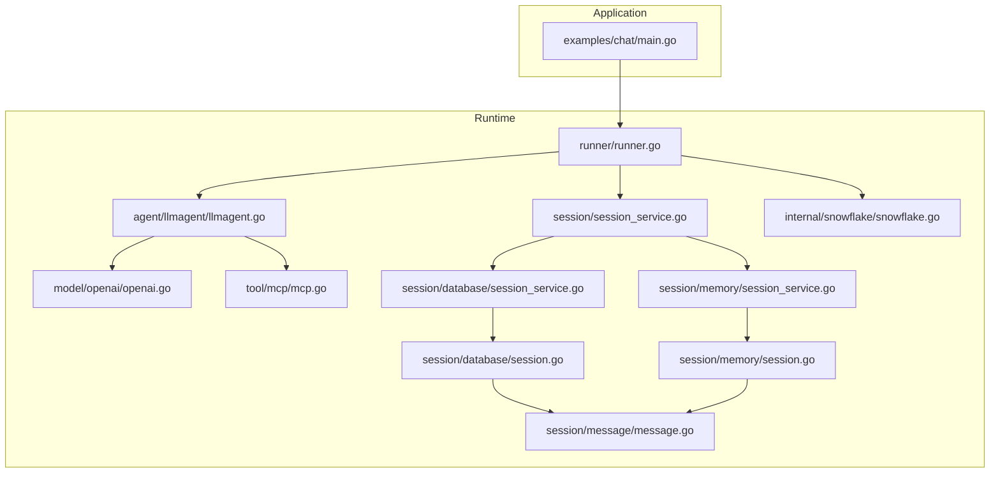
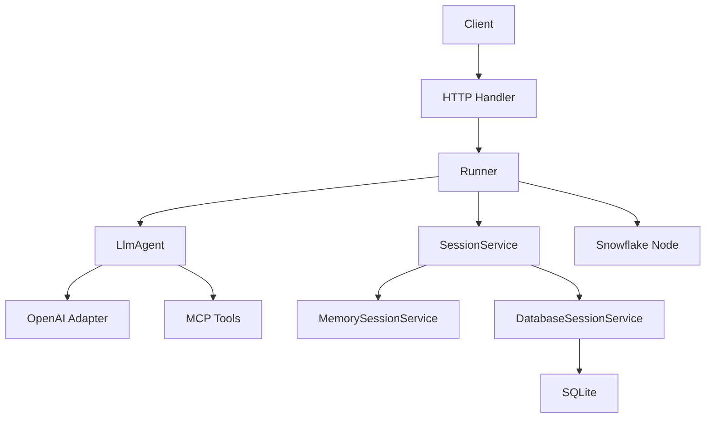
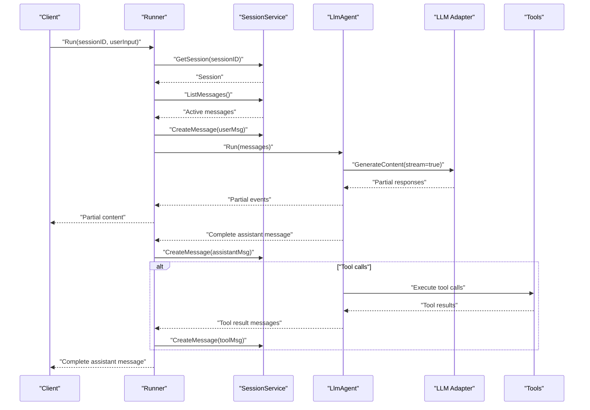
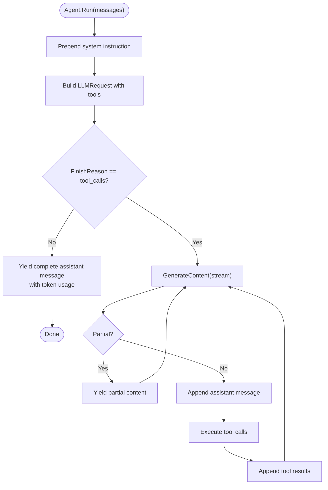
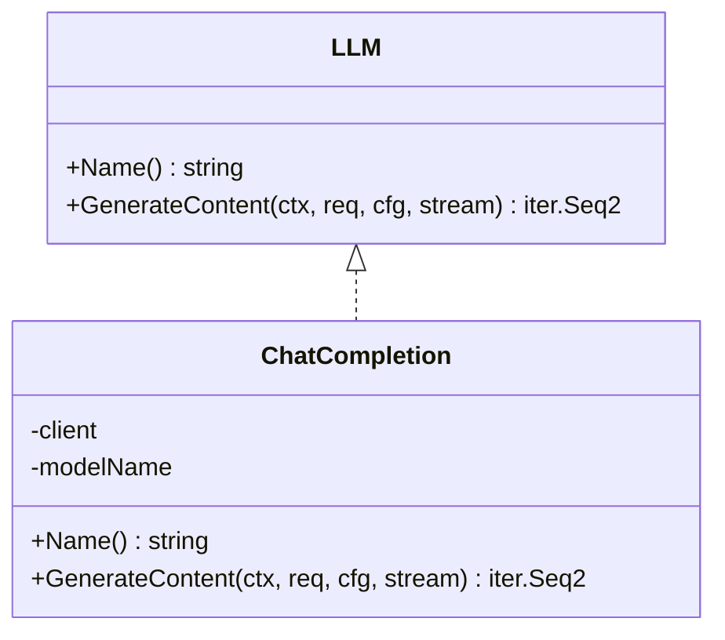
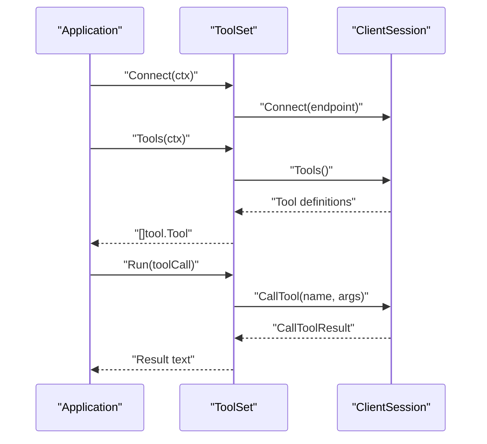
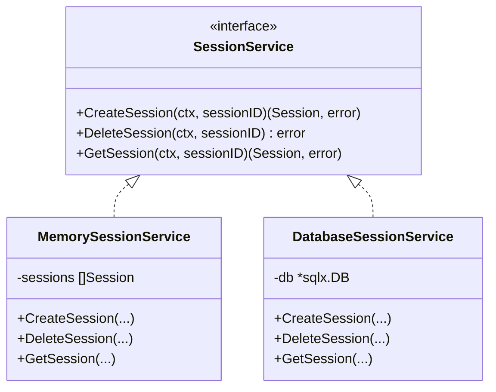
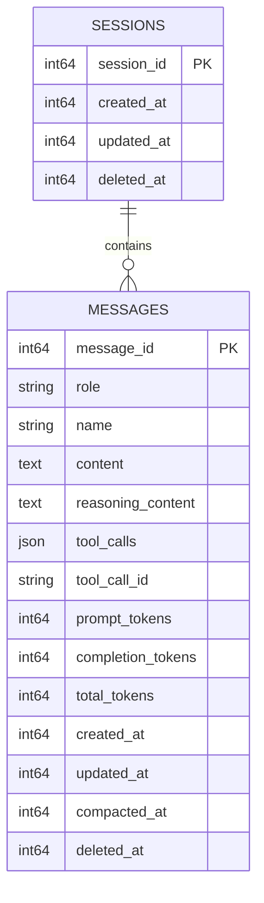
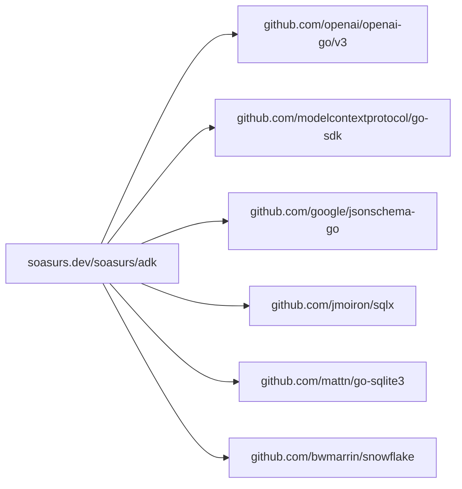

# Production Deployment

<cite>
**Referenced Files in This Document**
- [README.md](file://README.md)
- [go.mod](file://go.mod)
- [examples/chat/main.go](file://examples/chat/main.go)
- [runner/runner.go](file://runner/runner.go)
- [agent/llmagent/llmagent.go](file://agent/llmagent/llmagent.go)
- [model/openai/openai.go](file://model/openai/openai.go)
- [tool/mcp/mcp.go](file://tool/mcp/mcp.go)
- [session/session_service.go](file://session/session_service.go)
- [session/memory/session_service.go](file://session/memory/session_service.go)
- [session/database/session_service.go](file://session/database/session_service.go)
- [session/database/session.go](file://session/database/session.go)
- [session/memory/session.go](file://session/memory/session.go)
- [session/message/message.go](file://session/message/message.go)
- [internal/snowflake/snowflake.go](file://internal/snowflake/snowflake.go)
- [model/model.go](file://model/model.go)
</cite>

## Table of Contents
1. [Introduction](#introduction)
2. [Project Structure](#project-structure)
3. [Core Components](#core-components)
4. [Architecture Overview](#architecture-overview)
5. [Detailed Component Analysis](#detailed-component-analysis)
6. [Dependency Analysis](#dependency-analysis)
7. [Performance Considerations](#performance-considerations)
8. [Monitoring and Observability](#monitoring-and-observability)
9. [Configuration Management and Secrets](#configuration-management-and-secrets)
10. [Deployment Topologies and Containerization](#deployment-topologies-and-containerization)
11. [Scaling Patterns](#scaling-patterns)
12. [Session Persistence and Statefulness](#session-persistence-and-statefulness)
13. [Capacity Planning and Resource Management](#capacity-planning-and-resource-management)
14. [Troubleshooting Guide](#troubleshooting-guide)
15. [Backup and Disaster Recovery](#backup-and-disaster-recovery)
16. [Conclusion](#conclusion)

## Introduction
This document provides production-grade deployment and operational guidance for applications built with the ADK (Agent Development Kit). It focuses on configuration management, environment variables, secrets handling, monitoring and observability, horizontal scaling, load balancing, session persistence, containerization, infrastructure requirements, performance optimization, capacity planning, troubleshooting, backup, and disaster recovery.

## Project Structure
The ADK is organized around a clear separation of concerns:
- Agent layer: stateless orchestration of LLM interactions and tool execution
- Runner layer: stateful session management and message persistence
- Model adapters: provider-agnostic LLM interface with concrete adapters (e.g., OpenAI)
- Tool integrations: pluggable tools via MCP and built-ins
- Session backends: in-memory and persistent (SQLite) storage
- Internal utilities: distributed ID generation

**Diagram sources**
- [examples/chat/main.go:1-180](file://examples/chat/main.go#L1-L180)
- [runner/runner.go:1-108](file://runner/runner.go#L1-L108)
- [agent/llmagent/llmagent.go:1-148](file://agent/llmagent/llmagent.go#L1-L148)
- [model/openai/openai.go:1-362](file://model/openai/openai.go#L1-L362)
- [tool/mcp/mcp.go:1-121](file://tool/mcp/mcp.go#L1-L121)
- [session/session_service.go:1-10](file://session/session_service.go#L1-L10)
- [session/memory/session_service.go:1-41](file://session/memory/session_service.go#L1-L41)
- [session/database/session_service.go:1-49](file://session/database/session_service.go#L1-L49)
- [session/memory/session.go:1-86](file://session/memory/session.go#L1-L86)
- [session/database/session.go:1-146](file://session/database/session.go#L1-L146)
- [session/message/message.go:1-129](file://session/message/message.go#L1-L129)
- [internal/snowflake/snowflake.go:1-66](file://internal/snowflake/snowflake.go#L1-L66)

**Section sources**
- [README.md:65-82](file://README.md#L65-L82)
- [go.mod:1-47](file://go.mod#L1-L47)

## Core Components
- Runner: stateful orchestrator that loads session history, persists user input, drives the Agent, and persists complete assistant/tool messages. It assigns distributed IDs and timestamps to persisted messages.
- Agent (LlmAgent): stateless orchestrator that manages the tool-call loop, streams partial content when enabled, and attaches token usage to final assistant messages.
- Model (OpenAI adapter): provider-agnostic LLM interface implemented for OpenAI-compatible APIs with streaming and non-streaming modes, tool schema conversion, and generation parameter mapping.
- Tool (MCP): dynamic discovery and invocation of tools from an MCP server, converting schemas and routing results.
- Sessions: pluggable backends (in-memory and SQLite) supporting active and compacted message lists, with soft archival semantics.

**Section sources**
- [runner/runner.go:17-108](file://runner/runner.go#L17-L108)
- [agent/llmagent/llmagent.go:29-148](file://agent/llmagent/llmagent.go#L29-L148)
- [model/openai/openai.go:19-362](file://model/openai/openai.go#L19-L362)
- [tool/mcp/mcp.go:15-121](file://tool/mcp/mcp.go#L15-L121)
- [session/session_service.go:5-9](file://session/session_service.go#L5-L9)
- [session/memory/session.go:12-86](file://session/memory/session.go#L12-L86)
- [session/database/session.go:14-146](file://session/database/session.go#L14-L146)

## Architecture Overview
The runtime architecture separates stateful session management from stateless agent execution, enabling scalable deployments with externalized persistence.

**Diagram sources**
- [runner/runner.go:17-108](file://runner/runner.go#L17-L108)
- [agent/llmagent/llmagent.go:55-125](file://agent/llmagent/llmagent.go#L55-L125)
- [model/openai/openai.go:44-164](file://model/openai/openai.go#L44-L164)
- [tool/mcp/mcp.go:45-109](file://tool/mcp/mcp.go#L45-L109)
- [session/session_service.go:5-9](file://session/session_service.go#L5-L9)
- [session/memory/session_service.go:14-40](file://session/memory/session_service.go#L14-L40)
- [session/database/session_service.go:23-48](file://session/database/session_service.go#L23-L48)
- [session/database/session.go:34-41](file://session/database/session.go#L34-L41)
- [internal/snowflake/snowflake.go:17-57](file://internal/snowflake/snowflake.go#L17-L57)

## Detailed Component Analysis

### Runner: Stateful Orchestration and Persistence
- Loads session history and appends user input
- Streams partial assistant content to clients
- Persists only complete messages to the session
- Assigns distributed IDs and timestamps via Snowflake

**Diagram sources**
- [runner/runner.go:45-96](file://runner/runner.go#L45-L96)
- [agent/llmagent/llmagent.go:77-124](file://agent/llmagent/llmagent.go#L77-L124)
- [model/openai/openai.go:88-164](file://model/openai/openai.go#L88-L164)
- [tool/mcp/mcp.go:92-109](file://tool/mcp/mcp.go#L92-L109)

**Section sources**
- [runner/runner.go:17-108](file://runner/runner.go#L17-L108)

### Agent: Stateless Tool-Call Loop
- Prepends system instruction to messages
- Streams partial content when enabled
- Attaches token usage to final assistant messages
- Executes tool calls and yields tool result messages

**Diagram sources**
- [agent/llmagent/llmagent.go:59-125](file://agent/llmagent/llmagent.go#L59-L125)
- [model/model.go:145-227](file://model/model.go#L145-L227)

**Section sources**
- [agent/llmagent/llmagent.go:29-148](file://agent/llmagent/llmagent.go#L29-L148)

### Model: OpenAI Adapter and Streaming
- Converts ADK messages and tools to provider-specific payloads
- Supports streaming with incremental text and accumulated tool calls
- Applies generation parameters (temperature, reasoning effort, service tier)
- Emits final complete response with usage and finish reason

**Diagram sources**
- [model/model.go:10-18](file://model/model.go#L10-L18)
- [model/openai/openai.go:19-42](file://model/openai/openai.go#L19-L42)

**Section sources**
- [model/openai/openai.go:19-362](file://model/openai/openai.go#L19-L362)
- [model/model.go:67-84](file://model/model.go#L67-L84)

### Tool: MCP Integration
- Connects to an MCP server and discovers tools
- Converts tool schemas to JSON schema for validation
- Invokes tools and aggregates text content from results

**Diagram sources**
- [tool/mcp/mcp.go:35-109](file://tool/mcp/mcp.go#L35-L109)

**Section sources**
- [tool/mcp/mcp.go:15-121](file://tool/mcp/mcp.go#L15-L121)

### Sessions: In-Memory and Database Backends
- Memory backend: ephemeral, suitable for single-instance or testing
- Database backend: persistent, supports active and compacted messages, soft archival

**Diagram sources**
- [session/session_service.go:5-9](file://session/session_service.go#L5-L9)
- [session/memory/session_service.go:14-40](file://session/memory/session_service.go#L14-L40)
- [session/database/session_service.go:23-48](file://session/database/session_service.go#L23-L48)

**Section sources**
- [session/memory/session_service.go:10-41](file://session/memory/session_service.go#L10-L41)
- [session/database/session_service.go:19-49](file://session/database/session_service.go#L19-L49)

### Message Persistence and Soft Archival
- Messages stored with roles, content, tool calls, token usage, timestamps
- Soft archival via compacted_at flag; active vs archived queries supported
- JSON serialization for tool calls in database

**Diagram sources**
- [session/database/session.go:14-24](file://session/database/session.go#L14-L24)
- [session/message/message.go:49-73](file://session/message/message.go#L49-L73)

**Section sources**
- [session/database/session.go:70-146](file://session/database/session.go#L70-L146)
- [session/message/message.go:11-129](file://session/message/message.go#L11-L129)

## Dependency Analysis
External dependencies include provider SDKs, MCP client, JSON schema handling, SQL utilities, and Snowflake ID generation.

**Diagram sources**
- [go.mod:5-15](file://go.mod#L5-L15)

**Section sources**
- [go.mod:1-47](file://go.mod#L1-L47)

## Performance Considerations
- Streaming: Enable streaming in the Agent to reduce perceived latency and improve UX. The OpenAI adapter supports incremental text delivery.
- Token usage: Attach usage to assistant messages for cost tracking and optimization.
- Message compaction: Archive old messages to reduce payload sizes and improve retrieval performance.
- Concurrency: Keep Agent stateless to scale horizontally; offload state to the Runner and SessionService.
- Database tuning: Use appropriate indexes and connection pooling for SQLite in production deployments.

[No sources needed since this section provides general guidance]

## Monitoring and Observability
- Logging: Log environment variable initialization, session creation, and error paths in the Runner and examples.
- Metrics: Track request rates, latency, error rates, and token usage per request.
- Tracing: Propagate context across Runner, Agent, LLM adapter, and tool invocations.
- Health checks: Expose readiness/liveness endpoints; ensure database connectivity and MCP server reachability.

[No sources needed since this section provides general guidance]

## Configuration Management and Secrets
- Environment variables:
  - OPENAI_API_KEY: required for OpenAI adapter
  - OPENAI_BASE_URL: optional override for compatible providers
  - OPENAI_MODEL: optional model name with default fallback
  - EXA_API_KEY: optional for authenticated MCP connections
- Secret handling:
  - Store API keys in a secrets manager (e.g., Vault, KMS, or platform-specific secret stores)
  - Mount secrets as environment variables or files; avoid embedding in images
  - Rotate keys regularly and audit access logs
- Configuration validation:
  - Validate presence of required environment variables before initializing adapters
  - Fail fast on invalid configurations

**Section sources**
- [examples/chat/main.go:52-124](file://examples/chat/main.go#L52-L124)
- [model/openai/openai.go:25-37](file://model/openai/openai.go#L25-L37)

## Deployment Topologies and Containerization
- Single-node deployment:
  - Use in-memory session backend for ephemeral state or SQLite for persistence
  - Run as a single process with embedded database
- Multi-node deployment:
  - Use SQLite with a shared filesystem or managed database (PostgreSQL/MySQL) for session persistence
  - Scale horizontally by adding more replicas behind a load balancer
- Containerization:
  - Use minimal base images (e.g., distroless)
  - Set non-root user, drop unnecessary capabilities
  - Mount secrets via environment variables or mounted files
- Orchestration:
  - Kubernetes: Deploy as StatefulSets or Deployments with readiness probes
  - Docker Swarm: Use replicated services with external database

[No sources needed since this section provides general guidance]

## Scaling Patterns
- Horizontal scaling:
  - Stateless Agents: Scale out behind a load balancer
  - Stateful Runner: Use sticky sessions or externalize state to a shared database
- Load balancing:
  - Layer 7 LB with health checks; route based on session affinity if needed
- Session persistence:
  - Prefer database-backed sessions for multi-replica setups
  - Implement compaction to keep payloads manageable

[No sources needed since this section provides general guidance]

## Session Persistence and Statefulness
- Runner is stateful; Agent is stateless
- Use database sessions for multi-node deployments
- Implement message compaction to archive old content while retaining summaries
- Ensure atomicity for compaction operations using transactions

**Section sources**
- [runner/runner.go:17-108](file://runner/runner.go#L17-L108)
- [session/database/session.go:97-146](file://session/database/session.go#L97-L146)

## Capacity Planning and Resource Management
- Estimate peak concurrent requests and streaming bandwidth
- Size database connections and pool appropriately
- Monitor token throughput and adjust model parameters (temperature, max tokens) to control costs
- Plan disk space for message archives and logs

[No sources needed since this section provides general guidance]

## Troubleshooting Guide
- Missing environment variables:
  - OPENAI_API_KEY must be set; otherwise initialization fails
- MCP connectivity:
  - Verify endpoint and authentication headers; ensure network access to MCP server
- Database errors:
  - Check connection strings, permissions, and migrations
- Streaming issues:
  - Confirm stream mode is enabled in the Agent and adapter supports streaming
- Session not found:
  - Ensure sessions are created before invoking Runner.Run

**Section sources**
- [examples/chat/main.go:56-93](file://examples/chat/main.go#L56-L93)
- [session/database/session_service.go:37-48](file://session/database/session_service.go#L37-L48)

## Backup and Disaster Recovery
- Database backups:
  - Schedule regular snapshots/backups of the session database
  - Test restoration procedures periodically
- Secrets rotation:
  - Update environment variables and restart pods gracefully
- Multi-region:
  - Replicate database across regions; use read replicas for scalability
- DR drills:
  - Practice failover scenarios and validate RTO/RPO targets

[No sources needed since this section provides general guidance]

## Conclusion
ADK’s architecture cleanly separates stateful session management from stateless agent execution, enabling robust, scalable deployments. By externalizing state to a database, leveraging streaming, applying message compaction, and following sound configuration and secrets practices, you can operate reliable production systems with strong observability and predictable performance.