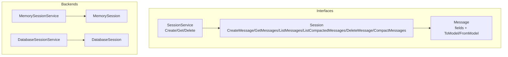
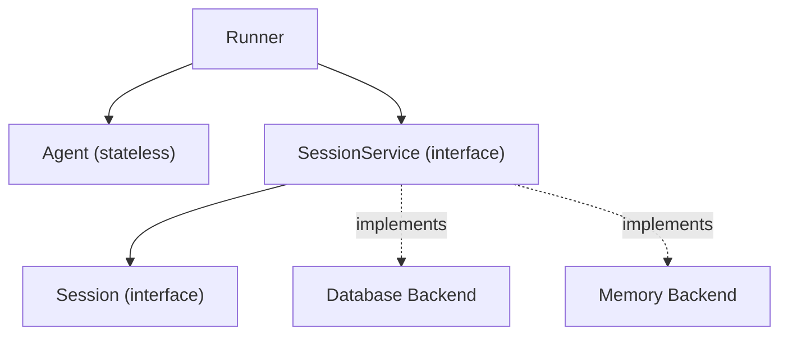
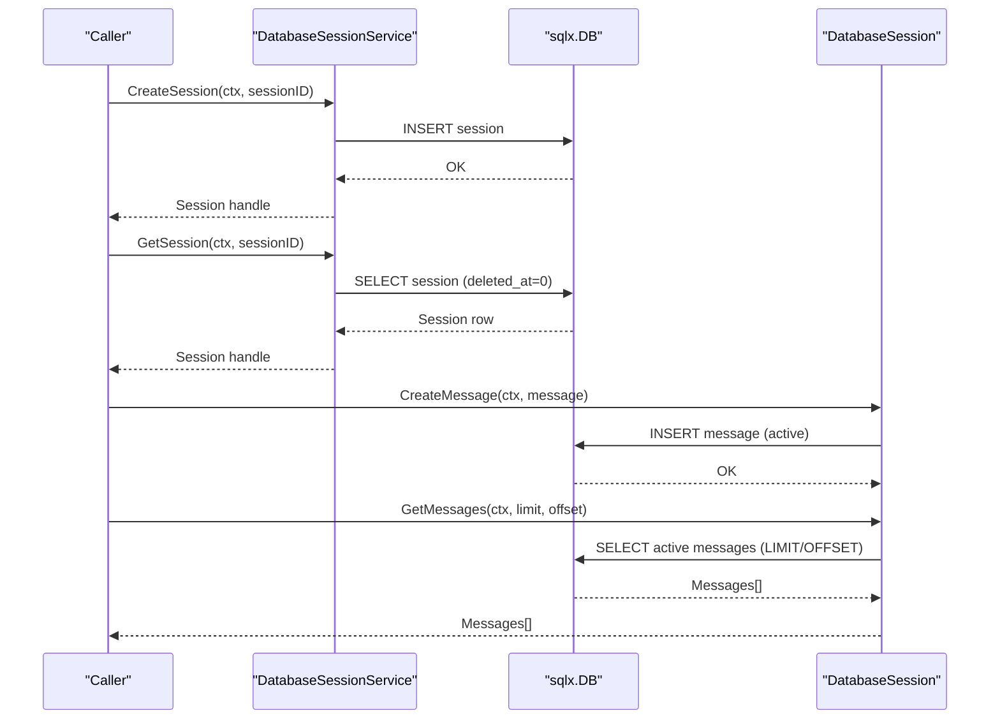
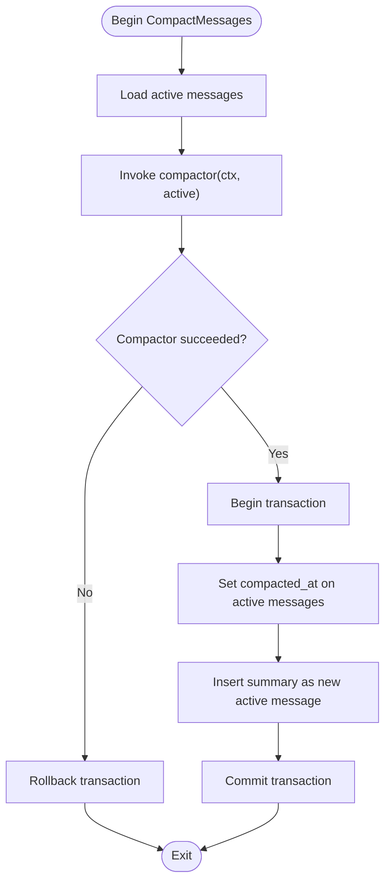
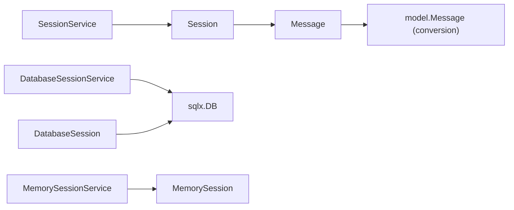

# Session Backend Extension

<cite>
**Referenced Files in This Document**
- [session_service.go](file://session/session_service.go)
- [session.go](file://session/session.go)
- [message.go](file://session/message/message.go)
- [database_session_service.go](file://session/database/session_service.go)
- [database_session.go](file://session/database/session.go)
- [memory_session_service.go](file://session/memory/session_service.go)
- [memory_session.go](file://session/memory/session.go)
- [database_session_test.go](file://session/database/session_test.go)
- [database_session_service_test.go](file://session/database/session_service_test.go)
- [memory_session_test.go](file://session/memory/session_test.go)
- [snowflake.go](file://internal/snowflake/snowflake.go)
- [README.md](file://README.md)
</cite>

## Table of Contents
1. [Introduction](#introduction)
2. [Project Structure](#project-structure)
3. [Core Components](#core-components)
4. [Architecture Overview](#architecture-overview)
5. [Detailed Component Analysis](#detailed-component-analysis)
6. [Dependency Analysis](#dependency-analysis)
7. [Performance Considerations](#performance-considerations)
8. [Troubleshooting Guide](#troubleshooting-guide)
9. [Conclusion](#conclusion)
10. [Appendices](#appendices)

## Introduction
This document explains how to extend session management with custom backends in the ADK (Agent Development Kit). It covers the SessionService interface contract, the Session interface with CRUD operations and pagination, message handling semantics, and patterns for implementing custom storage backends. It also documents database schema design, migration strategies, thread safety, performance optimization, scaling approaches, backup and recovery, monitoring, production deployment considerations, data retention, and compliance.

## Project Structure
The session subsystem is organized around a small set of interfaces and two built-in backends:
- Core interfaces define the contract for session creation, retrieval, deletion, and message operations.
- Memory backend provides an in-memory implementation suitable for testing and single-process scenarios.
- Database backend provides a persistent SQLite-based implementation using SQLX.

**Diagram sources**
- [session_service.go:5-9](file://session/session_service.go#L5-L9)
- [session.go:9-23](file://session/session.go#L9-L23)
- [message.go:49-128](file://session/message/message.go#L49-L128)
- [memory/session_service.go:14-40](file://session/memory/session_service.go#L14-L40)
- [memory/session.go:18-85](file://session/memory/session.go#L18-L85)
- [database/session_service.go:23-48](file://session/database/session_service.go#L23-L48)
- [database/session.go:34-145](file://session/database/session.go#L34-L145)

**Section sources**
- [README.md:65-82](file://README.md#L65-L82)

## Core Components
- SessionService: Defines CreateSession, GetSession, and DeleteSession. These operations manage session lifecycle and identity resolution.
- Session: Defines message operations including CreateMessage, GetMessages (paginated), ListMessages (full history), ListCompactedMessages (archived), DeleteMessage, and CompactMessages (summarization pipeline).
- Message: Represents persisted conversation messages with fields for role, content, tool calls, token usage, timestamps, and compaction/deletion markers.

Key behaviors:
- Pagination: GetMessages supports limit/offset semantics for efficient streaming and browsing.
- Soft compaction: Messages are archived (not deleted) by setting a compaction timestamp; active vs archived queries filter by compaction/deletion flags.
- Deleted-at pattern: Sessions and messages support logical deletion via a deleted_at timestamp.

**Section sources**
- [session_service.go:5-9](file://session/session_service.go#L5-L9)
- [session.go:9-23](file://session/session.go#L9-L23)
- [message.go:49-128](file://session/message/message.go#L49-L128)

## Architecture Overview
The system separates stateless agents from stateful runners. The runner owns a Session backed by a chosen SessionService implementation. The runner loads session history, appends and persists every message, and drives the agent per user turn.

**Diagram sources**
- [README.md:37-62](file://README.md#L37-L62)
- [session_service.go:5-9](file://session/session_service.go#L5-L9)
- [database/session_service.go:23-48](file://session/database/session_service.go#L23-L48)
- [memory/session_service.go:14-40](file://session/memory/session_service.go#L14-L40)

## Detailed Component Analysis

### SessionService Interface Contract
- Responsibilities:
  - CreateSession(ctx, sessionID): Create a new session resource and return a Session handle.
  - GetSession(ctx, sessionID): Retrieve an existing session; return nil if not found.
  - DeleteSession(ctx, sessionID): Mark a session as deleted (logical deletion).
- Thread-safety: The interface does not specify concurrency guarantees; implementers must ensure safe concurrent access if used in multi-threaded environments.

Implementation patterns:
- Memory backend maintains an in-memory slice of sessions and performs linear scans for lookup.
- Database backend uses SQL queries with a deleted_at filter and updates for logical deletion.

**Section sources**
- [session_service.go:5-9](file://session/session_service.go#L5-L9)
- [memory/session_service.go:14-40](file://session/memory/session_service.go#L14-L40)
- [database/session_service.go:23-48](file://session/database/session_service.go#L23-L48)

### Session Interface and Message Operations
- Message CRUD:
  - CreateMessage(ctx, message): Append a new message to the active history.
  - GetMessages(ctx, limit, offset): Paginated retrieval of active messages ordered by created_at ascending.
  - ListMessages(ctx): Full retrieval of active messages ordered by created_at ascending.
  - ListCompactedMessages(ctx): Retrieve archived messages ordered by created_at ascending.
  - DeleteMessage(ctx, messageID): Remove a specific message from active history (logical deletion via deleted_at).
  - CompactMessages(ctx, compactor): Summarize active messages and replace them with a single summary while archiving originals.
- Message model:
  - Fields include role, content, optional reasoning content, tool calls (JSON), tool_call_id, token usage, timestamps, compaction/deletion markers.
  - Conversion helpers ToModel and FromModel bridge persisted messages to model.Message for LLM consumption.

Pagination semantics:
- GetMessages uses LIMIT/OFFSET to page through active messages.
- ListMessages returns the entire active history (useful for full history operations).

Soft compaction:
- Active messages are fetched, passed to a user-provided compactor function, then archived by setting a compaction timestamp. A summary message replaces the active history.

**Section sources**
- [session.go:9-23](file://session/session.go#L9-L23)
- [message.go:49-128](file://session/message/message.go#L49-L128)
- [database/session.go:70-95](file://session/database/session.go#L70-L95)
- [memory/session.go:45-85](file://session/memory/session.go#L45-L85)

### Database Backend Implementation
- Session table:
  - session_id (PK), created_at, updated_at, deleted_at.
- Message table:
  - message_id (PK), role, name, content, reasoning_content, tool_calls (JSON), tool_call_id, prompt_tokens, completion_tokens, total_tokens, created_at, updated_at, compacted_at, deleted_at.
- Queries:
  - Create session insert.
  - Create message insert (active messages only).
  - Delete message logical deletion via deleted_at.
  - GetMessages with LIMIT/OFFSET on active messages (compacted_at=0 AND deleted_at=0).
  - ListMessages and ListCompactedMessages with appropriate filters.
  - CompactMessages uses a transaction to archive active messages and insert the summary atomically.

Concurrency and transactions:
- Uses BeginTx with rollback on error to ensure atomicity of compaction.

**Section sources**
- [database/session.go:14-24](file://session/database/session.go#L14-L24)
- [database/session.go:34-145](file://session/database/session.go#L34-L145)
- [database/session_service.go:14-17](file://session/database/session_service.go#L14-L17)
- [database/session_service.go:23-48](file://session/database/session_service.go#L23-L48)

### Memory Backend Implementation
- Maintains an in-memory slice of sessions and messages.
- GetMessages applies limit/offset on the active message slice.
- DeleteMessage removes a message by ID from the active slice.
- CompactMessages invokes the compactor and moves active messages to a separate compacted slice, replacing active history with a single summary.

Thread-safety:
- Uses slices operations; no explicit synchronization. Concurrent access requires external synchronization.

**Section sources**
- [memory/session.go:12-24](file://session/memory/session.go#L12-L24)
- [memory/session.go:45-85](file://session/memory/session.go#L45-L85)
- [memory/session_service.go:10-16](file://session/memory/session_service.go#L10-L16)
- [memory/session_service.go:18-40](file://session/memory/session_service.go#L18-L40)

### Sequence: Database Session Creation and Message Retrieval

**Diagram sources**
- [database/session_service.go:27-48](file://session/database/session_service.go#L27-L48)
- [database/session.go:34-85](file://session/database/session.go#L34-L85)

### Flowchart: Database Message Compaction

**Diagram sources**
- [database/session.go:97-145](file://session/database/session.go#L97-L145)

## Dependency Analysis
- SessionService depends on the Session interface.
- Database backend depends on sqlx.DB and defines SQL expressions for CRUD and compaction.
- Memory backend depends on slices and time for compaction timestamps.
- Message conversion bridges persisted Message to model.Message and vice versa.

**Diagram sources**
- [session_service.go:5-9](file://session/session_service.go#L5-L9)
- [session.go:9-23](file://session/session.go#L9-L23)
- [message.go:76-128](file://session/message/message.go#L76-L128)
- [database/session_service.go:23-48](file://session/database/session_service.go#L23-L48)
- [database/session.go:34-145](file://session/database/session.go#L34-L145)
- [memory/session_service.go:14-40](file://session/memory/session_service.go#L14-L40)
- [memory/session.go:18-85](file://session/memory/session.go#L18-L85)

**Section sources**
- [session_service.go:5-9](file://session/session_service.go#L5-L9)
- [session.go:9-23](file://session/session.go#L9-L23)
- [message.go:76-128](file://session/message/message.go#L76-L128)
- [database/session_service.go:23-48](file://session/database/session_service.go#L23-L48)
- [database/session.go:34-145](file://session/database/session.go#L34-L145)
- [memory/session_service.go:14-40](file://session/memory/session_service.go#L14-L40)
- [memory/session.go:18-85](file://session/memory/session.go#L18-L85)

## Performance Considerations
- Pagination:
  - Use GetMessages with limit/offset to avoid loading entire histories.
  - Keep order by created_at ascending to leverage index scans.
- Indexing:
  - Add indexes on message.created_at, message.deleted_at, message.compacted_at for efficient filtering and sorting.
  - Add indexes on session_id for session lookups.
- Batch operations:
  - Prefer compacting older messages into summaries to reduce active history size.
- Concurrency:
  - Database backend uses transactions for atomic compaction; ensure connection pooling and appropriate isolation levels.
  - Memory backend lacks internal locking; wrap with mutex if accessed concurrently.
- I/O:
  - SQLite is single-writer optimized; consider WAL mode and appropriate pragmas for write-heavy workloads.
- Streaming:
  - Use ListMessages for full history and GetMessages for paging to balance memory and latency.

[No sources needed since this section provides general guidance]

## Troubleshooting Guide
Common issues and resolutions:
- Session not found:
  - Database backend returns nil when no rows match session_id with deleted_at=0.
  - Memory backend returns nil when sessionID not present.
- Message not found for deletion:
  - Database backend ignores attempts to delete already-deleted messages.
  - Memory backend silently succeeds if messageID absent.
- Compaction failures:
  - Database backend rolls back transaction on compactor error; active messages remain unchanged.
  - Memory backend preserves active messages on compactor error.
- Pagination edge cases:
  - Offset beyond length returns empty results.
  - Limit/offset combinations are clamped internally.

Validation via tests:
- Database and memory backends include comprehensive tests covering CRUD, pagination, compaction, and error paths.

**Section sources**
- [database/session.go:70-95](file://session/database/session.go#L70-L95)
- [database/session_test.go:118-160](file://session/database/session_test.go#L118-L160)
- [database/session_test.go:162-205](file://session/database/session_test.go#L162-L205)
- [database/session_test.go:207-266](file://session/database/session_test.go#L207-L266)
- [database/session_test.go:268-287](file://session/database/session_test.go#L268-L287)
- [database/session_test.go:289-306](file://session/database/session_test.go#L289-L306)
- [database/session_test.go:308-349](file://session/database/session_test.go#L308-L349)
- [memory/session.go:45-85](file://session/memory/session.go#L45-L85)
- [memory/session_test.go:88-126](file://session/memory/session_test.go#L88-L126)
- [memory/session_test.go:128-167](file://session/memory/session_test.go#L128-L167)
- [memory/session_test.go:196-220](file://session/memory/session_test.go#L196-L220)
- [memory/session_test.go:222-237](file://session/memory/session_test.go#L222-L237)
- [memory/session_test.go:239-253](file://session/memory/session_test.go#L239-L253)
- [memory/session_test.go:255-292](file://session/memory/session_test.go#L255-L292)

## Conclusion
The ADK’s session abstraction cleanly separates session lifecycle management from message persistence. By implementing SessionService and Session, you can integrate any storage backend. The provided memory and database backends demonstrate patterns for concurrency, transactions, pagination, and soft compaction. Follow the schema and migration guidance below to build robust, scalable, and compliant session storage.

[No sources needed since this section summarizes without analyzing specific files]

## Appendices

### A. Implementing a Custom Backend
Steps:
1. Define a struct implementing SessionService:
   - CreateSession(ctx, sessionID) -> Session
   - GetSession(ctx, sessionID) -> Session or nil
   - DeleteSession(ctx, sessionID) -> error
2. Define a struct implementing Session:
   - CreateMessage(ctx, message) -> error
   - GetMessages(ctx, limit, offset) -> []*Message
   - ListMessages(ctx) -> []*Message
   - ListCompactedMessages(ctx) -> []*Message
   - DeleteMessage(ctx, messageID) -> error
   - CompactMessages(ctx, compactor) -> error
3. Adhere to:
   - Logical deletion via deleted_at on sessions/messages.
   - Active vs archived filtering via deleted_at and compacted_at.
   - Ascending order by created_at for pagination and listing.
   - Atomic compaction semantics (transaction or equivalent).
4. Provide thread-safety:
   - Use locks or immutable data structures if accessed concurrently.
5. Optimize:
   - Add indexes on session_id, created_at, deleted_at, compacted_at.
   - Use limit/offset for pagination.
   - Consider batch compaction strategies.

**Section sources**
- [session_service.go:5-9](file://session/session_service.go#L5-L9)
- [session.go:9-23](file://session/session.go#L9-L23)
- [database/session.go:14-24](file://session/database/session.go#L14-L24)
- [database/session.go:97-145](file://session/database/session.go#L97-L145)
- [memory/session.go:45-85](file://session/memory/session.go#L45-L85)

### B. Database Schema Design and Migrations
Schema outline:
- sessions(session_id PK, created_at, updated_at, deleted_at)
- messages(message_id PK, role, name, content, reasoning_content, tool_calls JSON, tool_call_id, prompt_tokens, completion_tokens, total_tokens, created_at, updated_at, compacted_at, deleted_at)

Guidelines:
- Use integer primary keys and timestamps in milliseconds for deterministic ordering.
- Store tool_calls as JSON to preserve structured data.
- Apply indexes on session_id, created_at, deleted_at, compacted_at.
- Use logical deletion (deleted_at) and compaction timestamps (compacted_at) to preserve audit trails.
- Migrations:
  - Add missing indexes in-place if supported by your RDBMS.
  - For schema changes, version migrations with reversible steps; keep backward compatibility during rollout.
  - Validate compaction and pagination queries after schema changes.

**Section sources**
- [database/session.go:14-24](file://session/database/session.go#L14-L24)
- [message.go:19-47](file://session/message/message.go#L19-L47)

### C. Backup and Recovery Procedures
- Database backend:
  - Regularly export the database (e.g., SQLite dump) and retain backups per retention policy.
  - Test restore procedures periodically; verify session and message counts.
- Memory backend:
  - Not persistent; rely on external persistence or warm-up logic post-restart.
- Audit and compliance:
  - Retain logs of compaction operations and deletions.
  - Enable database auditing for DDL/DML changes.

[No sources needed since this section provides general guidance]

### D. Monitoring Strategies
- Metrics:
  - Session create/get/delete rates.
  - Message create/delete/compact rates.
  - Pagination latency and throughput.
- Tracing:
  - Instrument SessionService and Session methods to capture slow queries and compaction durations.
- Health checks:
  - Verify connectivity to the underlying datastore.
  - Monitor transaction commit rates (compaction).

[No sources needed since this section provides general guidance]

### E. Production Deployment Considerations
- Scalability:
  - Database: Use read replicas for reads, write leader for compaction; shard by session_id if needed.
  - Memory: Not recommended for multi-instance deployments; use database backend.
- Data retention:
  - Enforce TTL on sessions/messages; purge deleted_at entries older than policy.
- Compliance:
  - Data subject requests: implement deletion by session/message ID and retention by policy.
  - Audit logging: record all compaction and deletion actions.

[No sources needed since this section provides general guidance]

### F. Example Backends
- Redis backend:
  - Use Hashes for sessions and Lists/ZSets for messages keyed by session_id.
  - Implement logical deletion via flags and compaction via Lua scripts.
- DynamoDB backend:
  - Use GSI on session_id and sort by created_at; apply TTL attributes for retention.
  - Use TransactWrite for atomic compaction.

[No sources needed since this section provides general guidance]

### G. ID Generation
- Snowflake IDs are supported for globally unique, time-ordered identifiers. Use them for session_id and message_id to simplify deduplication and ordering.

**Section sources**
- [snowflake.go:17-65](file://internal/snowflake/snowflake.go#L17-L65)