# Agent Composition

<cite>
**Referenced Files in This Document**
- [agent.go](file://agent/agent.go)
- [llmagent.go](file://agent/llmagent/llmagent.go)
- [sequential.go](file://agent/sequential/sequential.go)
- [parallel.go](file://agent/parallel/parallel.go)
- [agentool.go](file://agent/agentool/agentool.go)
- [tool.go](file://tool/tool.go)
- [model.go](file://model/model.go)
- [sequential_test.go](file://agent/sequential/sequential_test.go)
- [parallel_test.go](file://agent/parallel/parallel_test.go)
- [agentool_test.go](file://agent/agentool/agentool_test.go)
- [main.go](file://examples/chat/main.go)
- [README.md](file://README.md)
</cite>

## Update Summary
**Changes Made**
- Enhanced documentation of sequential agent composition patterns with detailed research pipeline examples
- Expanded parallel agent documentation with ensemble approach implementations
- Added comprehensive agent-as-tool patterns for hierarchical delegation
- Included practical examples of research pipelines, multi-model ensembles, and MCP tool integration
- Updated performance considerations and troubleshooting guides with new agent types

## Table of Contents
1. [Introduction](#introduction)
2. [Project Structure](#project-structure)
3. [Core Components](#core-components)
4. [Architecture Overview](#architecture-overview)
5. [Detailed Component Analysis](#detailed-component-analysis)
6. [Advanced Composition Patterns](#advanced-composition-patterns)
7. [Practical Implementation Examples](#practical-implementation-examples)
8. [Dependency Analysis](#dependency-analysis)
9. [Performance Considerations](#performance-considerations)
10. [Troubleshooting Guide](#troubleshooting-guide)
11. [Conclusion](#conclusion)
12. [Appendices](#appendices)

## Introduction
This document explains how to compose agents and wrap existing agents with additional functionality using the AgentTool pattern. It covers sub-agent orchestration techniques, delegation patterns, and workflow composition strategies. You will learn how to implement wrapper interfaces that maintain the Agent contract while adding new capabilities, and how to apply these patterns to build robust systems such as authentication wrappers, logging agents, and validation layers. The document now includes comprehensive coverage of sequential, parallel, and agent-as-tool agent types with practical examples of research pipelines, ensemble approaches, and hierarchical agent delegation patterns.

## Project Structure
The ADK provides a clean separation between stateless agents and a stateful runner, enabling flexible composition and reuse. The core packages relevant to agent composition are:
- agent: defines the Agent interface and composition primitives (sequential, parallel)
- agent/llmagent: an LLM-backed agent that drives tool calls automatically
- agent/agentool: wraps an Agent as a Tool for delegation
- tool: defines the Tool interface and tool definitions
- model: defines provider-agnostic message types and streaming events
- examples: demonstrates real-world usage with MCP tools and chat flows

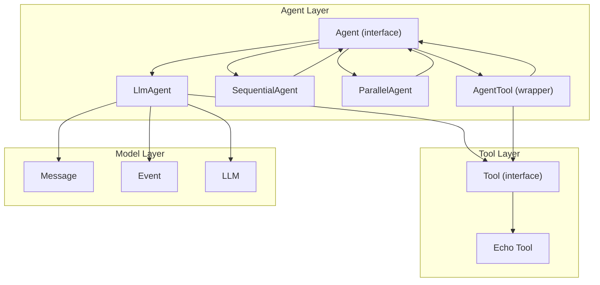

**Diagram sources**
- [agent.go:10-19](file://agent/agent.go#L10-L19)
- [llmagent.go:29-45](file://agent/llmagent/llmagent.go#L29-L45)
- [sequential.go:18-41](file://agent/sequential/sequential.go#L18-L41)
- [parallel.go:70-101](file://agent/parallel/parallel.go#L70-L101)
- [agentool.go:16-48](file://agent/agentool/agentool.go#L16-L48)
- [tool.go:17-23](file://tool/tool.go#L17-L23)
- [model.go:10-227](file://model/model.go#L10-L227)

**Section sources**
- [README.md:65-82](file://README.md#L65-L82)

## Core Components
- Agent interface: a stateless component that yields messages as an iterator, enabling streaming and incremental output.
- LlmAgent: a stateless agent that loops an LLM and executes tool calls automatically, yielding streaming and complete messages.
- SequentialAgent: composes multiple agents sequentially, passing full context between agents and injecting handoff messages.
- ParallelAgent: runs multiple agents concurrently, merging their outputs into a single assistant message.
- AgentTool: wraps an Agent as a Tool so it can be invoked by an orchestrator LlmAgent via the LLM's native function-calling mechanism.
- Tool interface: defines tool metadata and execution contract for LLM-driven function calls.
- Model types: define messages, events, and streaming semantics used across agents and tools.

These components collectively enable composition patterns that scale from simple chaining to sophisticated orchestration with parallelism and error propagation.

**Section sources**
- [agent.go:10-19](file://agent/agent.go#L10-L19)
- [llmagent.go:29-125](file://agent/llmagent/llmagent.go#L29-L125)
- [sequential.go:18-92](file://agent/sequential/sequential.go#L18-L92)
- [parallel.go:70-168](file://agent/parallel/parallel.go#L70-L168)
- [agentool.go:16-78](file://agent/agentool/agentool.go#L16-L78)
- [tool.go:9-23](file://tool/tool.go#L9-L23)
- [model.go:10-227](file://model/model.go#L10-L227)

## Architecture Overview
The ADK architecture separates stateless agents from a stateful runner. Agents receive conversation messages and yield events (streaming or complete). LlmAgent orchestrates tool calls automatically, while composition agents (SequentialAgent and ParallelAgent) orchestrate sub-agents. AgentTool bridges agents and tools, enabling delegation.

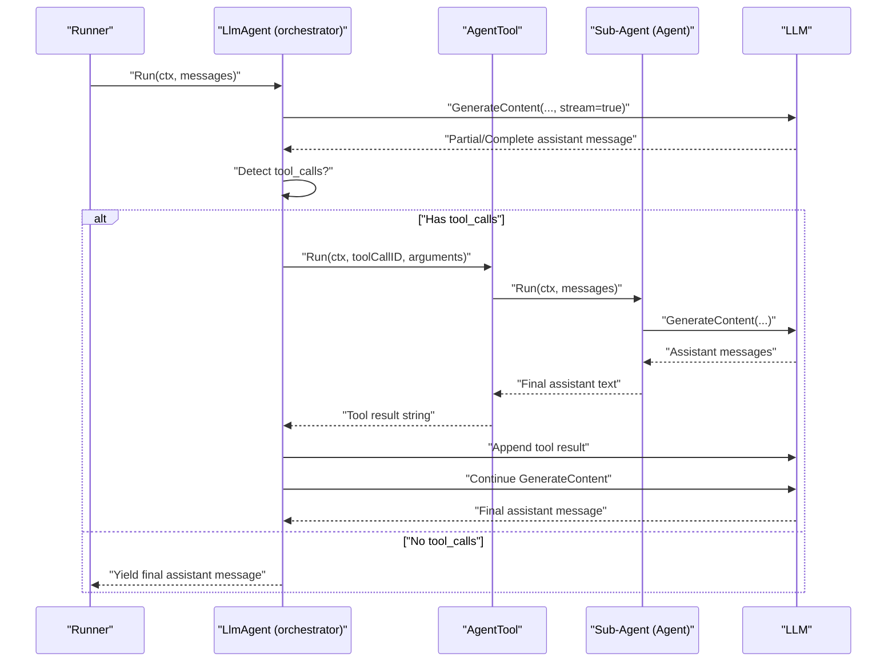

**Diagram sources**
- [llmagent.go:55-125](file://agent/llmagent/llmagent.go#L55-L125)
- [agentool.go:54-78](file://agent/agentool/agentool.go#L54-L78)
- [model.go:214-226](file://model/model.go#L214-L226)

## Detailed Component Analysis

### Agent Interface and Contract
The Agent interface defines a stateless contract:
- Name(): identifies the agent
- Description(): human-readable purpose
- Run(ctx, messages): returns an iterator of model.Event, supporting streaming and complete messages

This contract ensures composition primitives can treat agents uniformly, regardless of their underlying implementation.

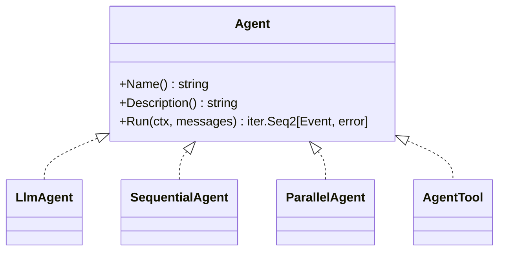

**Diagram sources**
- [agent.go:10-19](file://agent/agent.go#L10-L19)
- [llmagent.go:29-45](file://agent/llmagent/llmagent.go#L29-L45)
- [sequential.go:18-41](file://agent/sequential/sequential.go#L18-L41)
- [parallel.go:70-101](file://agent/parallel/parallel.go#L70-L101)
- [agentool.go:16-48](file://agent/agentool/agentool.go#L16-L48)

**Section sources**
- [agent.go:10-19](file://agent/agent.go#L10-L19)

### LlmAgent: Automatic Tool-Call Loop
LlmAgent is a stateless agent that:
- Prepends a system instruction when configured
- Calls the LLM to generate content, yielding partial events for streaming
- Detects tool_calls and executes them automatically
- Appends tool results back into the conversation history
- Continues generation until the LLM stops requesting tool calls

This design keeps the Agent contract intact while adding orchestration capabilities.

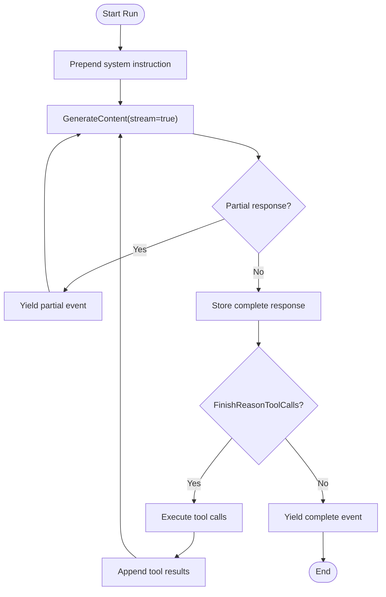

**Diagram sources**
- [llmagent.go:55-125](file://agent/llmagent/llmagent.go#L55-L125)

**Section sources**
- [llmagent.go:29-125](file://agent/llmagent/llmagent.go#L29-L125)

### SequentialAgent: Linear Orchestration
SequentialAgent runs a fixed list of agents in order:
- Builds each agent's input from the original messages plus all complete messages produced so far
- Injects a handoff user message between agents to ensure each agent sees a conversation ending with a user turn
- Yields every event produced by sub-agents (including partial streaming events)
- Accumulates only complete messages into the context for the next agent

This pattern supports multi-step pipelines where each step enriches the context for the next.

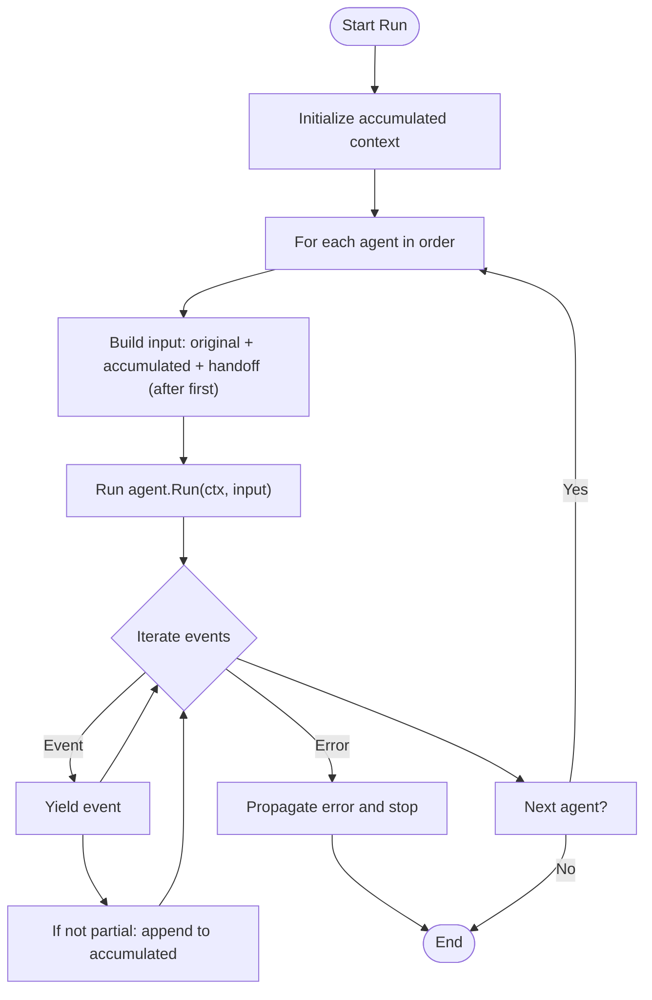

**Diagram sources**
- [sequential.go:46-92](file://agent/sequential/sequential.go#L46-L92)

**Section sources**
- [sequential.go:18-92](file://agent/sequential/sequential.go#L18-L92)

### ParallelAgent: Concurrent Orchestration
ParallelAgent fans out to all sub-agents concurrently:
- Derives a child context and launches each agent in its own goroutine
- Collects all AgentOutput entries (agent name and produced messages)
- On any error, cancels the shared context to signal siblings to exit promptly
- Merges outputs via a configurable MergeFunc (defaults to concatenating attributed assistant messages)

This pattern is ideal for independent tasks, multi-model comparisons, and fan-out scenarios.

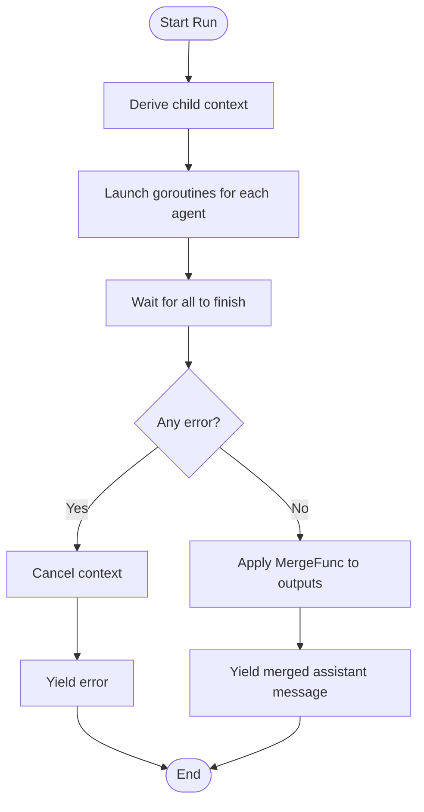

**Diagram sources**
- [parallel.go:112-168](file://agent/parallel/parallel.go#L112-L168)

**Section sources**
- [parallel.go:70-168](file://agent/parallel/parallel.go#L70-L168)

### AgentTool: Wrapping Agents as Tools
AgentTool wraps an Agent as a Tool so it can be invoked by an orchestrator LlmAgent:
- Uses reflection to build a JSON Schema input definition from a taskRequest struct
- On Run, parses arguments, invokes the wrapped agent with a single user message, and captures the final assistant text as the tool result
- Silently consumes intermediate messages (tool calls/results) produced by the sub-agent

This enables delegation of tasks to sub-agents via the LLM's native function-calling mechanism.

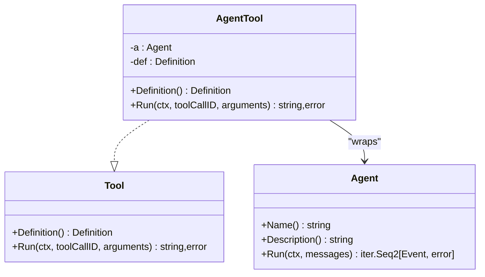

**Diagram sources**
- [agentool.go:16-78](file://agent/agentool/agentool.go#L16-L78)
- [tool.go:17-23](file://tool/tool.go#L17-L23)
- [agent.go:10-19](file://agent/agent.go#L10-L19)

**Section sources**
- [agentool.go:16-78](file://agent/agentool/agentool.go#L16-L78)

### Tool Interface and Definitions
The Tool interface defines:
- Definition(): metadata used by the LLM to understand and call the tool (name, description, JSON Schema)
- Run(ctx, toolCallID, arguments): executes the tool and returns a string result

Tools can be built-in (e.g., Echo), MCP-based, or custom, and are provided to LlmAgent for automatic tool-call execution.

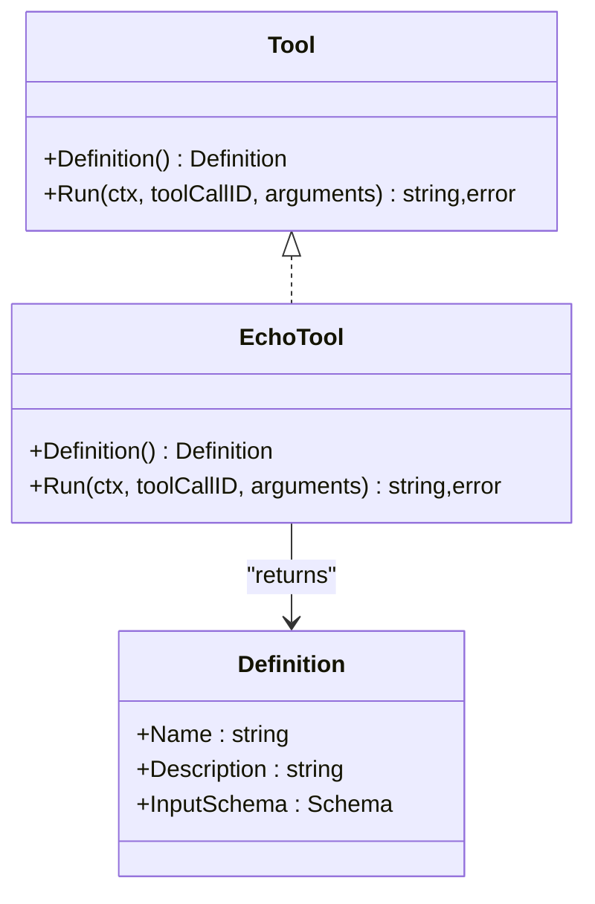

**Diagram sources**
- [tool.go:9-23](file://tool/tool.go#L9-L23)
- [echo.go:14-46](file://tool/builtin/echo.go#L14-L46)

**Section sources**
- [tool.go:9-23](file://tool/tool.go#L9-L23)
- [echo.go:14-46](file://tool/builtin/echo.go#L14-L46)

### Model Types and Streaming Semantics
The model package defines:
- Message: conversation message with roles, content, tool calls, and usage
- Event: wrapper around Message indicating partial vs complete
- LLM: provider-agnostic interface for generating content with streaming support

These types unify how agents and tools exchange information and how runners handle streaming.

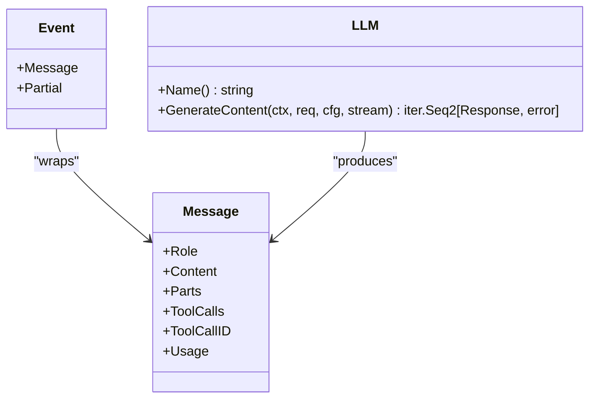

**Diagram sources**
- [model.go:152-227](file://model/model.go#L152-L227)

**Section sources**
- [model.go:10-227](file://model/model.go#L10-L227)

## Advanced Composition Patterns

### Research Pipeline Composition
Sequential agents excel at building research pipelines where each stage builds upon previous findings:

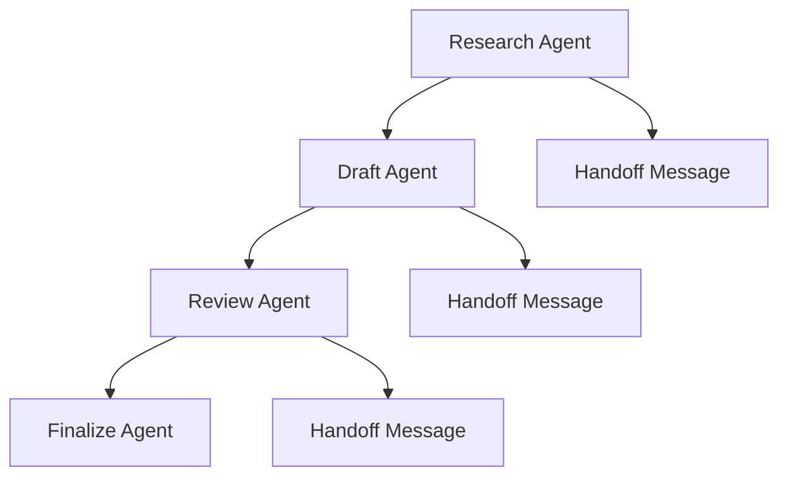

This pattern enables multi-step research workflows where each agent specializes in a particular phase of the research process.

**Section sources**
- [sequential.go:29-30](file://agent/sequential/sequential.go#L29-L30)
- [sequential_test.go:334-400](file://agent/sequential/sequential_test.go#L334-L400)

### Ensemble Approach Implementation
Parallel agents provide multi-model comparison and redundancy:

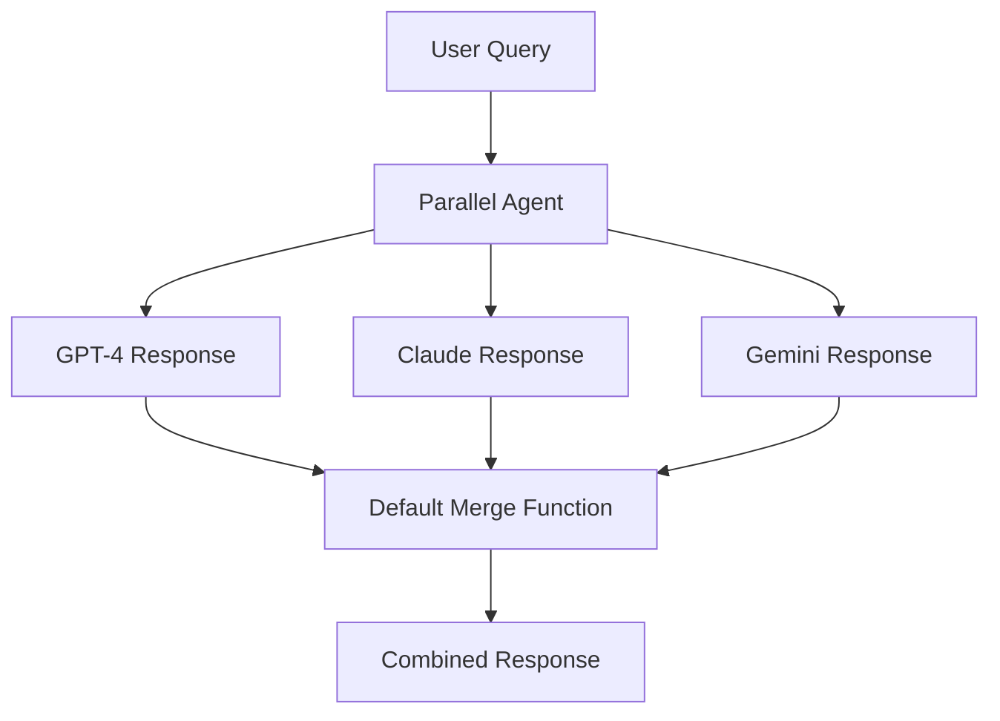

Custom merge functions enable sophisticated aggregation strategies beyond simple concatenation.

**Section sources**
- [parallel.go:43-68](file://agent/parallel/parallel.go#L43-L68)
- [parallel_test.go:351-416](file://agent/parallel/parallel_test.go#L351-L416)

### Hierarchical Agent Delegation
AgentTool enables deep delegation hierarchies where agents can call other agents:

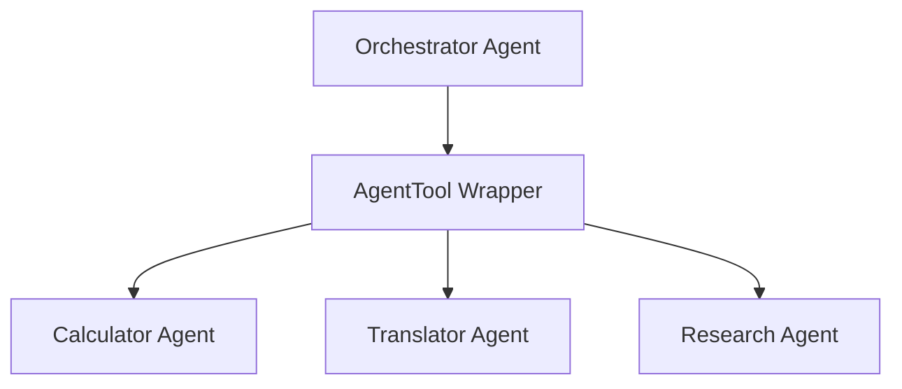

This pattern supports complex agent ecosystems where higher-level agents coordinate specialized sub-agents.

**Section sources**
- [agentool.go:29-48](file://agent/agentool/agentool.go#L29-L48)
- [agentool_test.go:59-136](file://agent/agentool/agentool_test.go#L59-L136)

## Practical Implementation Examples

### Sequential Agent Pipeline Examples

#### Two-Step Research Pipeline
A typical research pipeline consists of summarization followed by translation:

**Section sources**
- [sequential_test.go:334-400](file://agent/sequential/sequential_test.go#L334-L400)

#### Context Propagation Verification
Sequential agents automatically propagate context between stages:

**Section sources**
- [sequential_test.go:184-240](file://agent/sequential/sequential_test.go#L184-L240)

### Parallel Agent Ensemble Examples

#### Multi-Language Translation Ensemble
Parallel agents can compare translations from multiple language models:

**Section sources**
- [parallel_test.go:471-530](file://agent/parallel/parallel_test.go#L471-L530)

#### Custom Merge Function Implementation
Developers can implement custom merge strategies for specialized use cases:

**Section sources**
- [parallel_test.go:351-416](file://agent/parallel/parallel_test.go#L351-L416)

### AgentTool Delegation Examples

#### Orchestrator-Subagent Flow
End-to-end delegation from orchestrator to sub-agent:

**Section sources**
- [agentool_test.go:59-136](file://agent/agentool/agentool_test.go#L59-L136)

#### Real-World Translation Delegation
Integration with real LLM services for production deployments:

**Section sources**
- [agentool_test.go:158-235](file://agent/agentool/agentool_test.go#L158-L235)

### MCP Tool Integration
The examples package demonstrates integration with external tools via MCP:

**Section sources**
- [main.go:52-177](file://examples/chat/main.go#L52-L177)

## Dependency Analysis
The composition primitives depend on the Agent interface and share common patterns:
- SequentialAgent depends on Agent.Run and accumulates messages for context
- ParallelAgent depends on Agent.Run and merges outputs via MergeFunc
- AgentTool depends on Agent.Run and transforms the output into a tool result string
- LlmAgent depends on Tool.Definition and Tool.Run for automatic tool-call execution

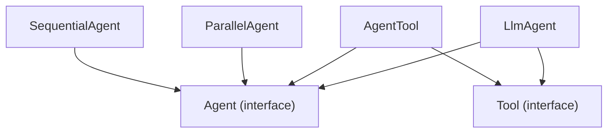

**Diagram sources**
- [agent.go:10-19](file://agent/agent.go#L10-L19)
- [sequential.go:18-41](file://agent/sequential/sequential.go#L18-L41)
- [parallel.go:70-101](file://agent/parallel/parallel.go#L70-L101)
- [agentool.go:16-48](file://agent/agentool/agentool.go#L16-L48)
- [llmagent.go:29-45](file://agent/llmagent/llmagent.go#L29-L45)
- [tool.go:17-23](file://tool/tool.go#L17-L23)

**Section sources**
- [agent.go:10-19](file://agent/agent.go#L10-L19)
- [sequential.go:18-41](file://agent/sequential/sequential.go#L18-L41)
- [parallel.go:70-101](file://agent/parallel/parallel.go#L70-L101)
- [agentool.go:16-48](file://agent/agentool/agentool.go#L16-L48)
- [llmagent.go:29-45](file://agent/llmagent/llmagent.go#L29-L45)
- [tool.go:17-23](file://tool/tool.go#L17-L23)

## Performance Considerations
- SequentialAgent: linear execution; each agent runs after the previous completes. Good for deterministic pipelines but slower for long chains.
- ParallelAgent: concurrent execution reduces latency for independent tasks; however, resource usage scales with the number of agents. Use MergeFunc to minimize overhead.
- AgentTool: adds minimal overhead; the sub-agent's streaming is consumed internally, and only the final assistant text is returned as a tool result.
- LlmAgent: streaming improves perceived responsiveness; partial events are yielded before complete messages, enabling real-time UI updates.
- Context propagation: SequentialAgent injects handoff messages to keep conversations well-formed, which increases message volume slightly but improves agent behavior.
- Memory management: SequentialAgent accumulates complete messages, potentially increasing memory usage for long pipelines.
- Concurrency control: ParallelAgent uses goroutines per agent; consider resource limits for large agent pools.

## Troubleshooting Guide
Common issues and resolutions:
- Early termination: SequentialAgent and ParallelAgent respect caller iteration breaks; ensure you consume all yielded events if you need full results.
- Error propagation: SequentialAgent stops on the first error; ParallelAgent cancels all sibling agents upon any error. Inspect yielded errors and adjust agent ordering or error handling strategies.
- Streaming behavior: LlmAgent yields partial events when enabled; ensure downstream consumers handle partial vs complete messages correctly.
- Tool-call mismatches: AgentTool expects a single task argument; verify tool definitions and argument parsing when delegating tasks.
- Context loss: SequentialAgent requires handoff messages for proper context; ensure your agents handle user-role messages correctly.
- Resource exhaustion: ParallelAgent can consume significant resources; monitor goroutine counts and memory usage.
- Merge conflicts: Custom MergeFunc implementations must handle empty agent outputs gracefully.

**Section sources**
- [sequential.go:46-92](file://agent/sequential/sequential.go#L46-L92)
- [parallel.go:112-168](file://agent/parallel/parallel.go#L112-L168)
- [llmagent.go:55-125](file://agent/llmagent/llmagent.go#L55-L125)
- [agentool.go:54-78](file://agent/agentool/agentool.go#L54-L78)

## Conclusion
The ADK's Agent interface and composition primitives enable powerful agent workflows:
- Wrap agents as tools with AgentTool to enable delegation via LLM-native function calls
- Chain agents sequentially for deterministic multi-step pipelines with automatic context propagation
- Run agents in parallel for independent tasks and multi-model comparisons with customizable merge strategies
- Maintain the Agent contract while adding new capabilities through wrapper interfaces
- Apply best practices for error propagation, streaming, and performance across all composition patterns

These patterns provide a solid foundation for building scalable, maintainable agent systems with comprehensive support for research pipelines, ensemble approaches, and hierarchical delegation architectures.

## Appendices

### Practical Examples and Patterns

#### Sequential Agent Patterns
- **Research Pipelines**: Chain research, drafting, and review agents for comprehensive workflows
- **Multi-step Processing**: Build deterministic pipelines where each step enriches context for the next
- **Context Propagation**: Leverage automatic handoff messages for proper conversation flow

**Section sources**
- [sequential_test.go:133-182](file://agent/sequential/sequential_test.go#L133-L182)
- [sequential_test.go:184-240](file://agent/sequential/sequential_test.go#L184-L240)

#### Parallel Agent Patterns
- **Multi-Model Ensembles**: Compare responses from different LLM providers for quality assessment
- **Independent Task Processing**: Run specialized agents concurrently for improved throughput
- **Custom Merge Strategies**: Implement domain-specific aggregation functions for specialized use cases

**Section sources**
- [parallel_test.go:471-530](file://agent/parallel/parallel_test.go#L471-L530)
- [parallel_test.go:351-416](file://agent/parallel/parallel_test.go#L351-L416)

#### AgentTool Patterns
- **Hierarchical Delegation**: Build agent ecosystems where higher-level agents coordinate specialized sub-agents
- **Tool Integration**: Wrap existing agents as tools for seamless integration with orchestrator agents
- **Real-World Delegation**: Demonstrate end-to-end delegation workflows with production-grade LLMs

**Section sources**
- [agentool_test.go:59-136](file://agent/agentool/agentool_test.go#L59-L136)
- [agentool_test.go:158-235](file://agent/agentool/agentool_test.go#L158-L235)

#### MCP Tool Integration
- **External Tool Access**: Connect to external MCP servers for expanded functionality
- **Real-World Chat Applications**: Demonstrate production chat applications with streaming and tool integration
- **Authentication and Configuration**: Handle API keys and service configurations for external tools

**Section sources**
- [main.go:52-177](file://examples/chat/main.go#L52-L177)

### Wrapper Interface Design and Best Practices
- **Maintain the Agent contract**: Name, Description, and Run must remain consistent across all composition patterns
- **Preserve streaming**: SequentialAgent and ParallelAgent yield partial events; ensure wrappers propagate streaming appropriately
- **Error propagation**: Forward errors from sub-agents to callers; SequentialAgent stops on first error; ParallelAgent cancels siblings on error
- **Result transformation**: AgentTool transforms a stream of assistant messages into a single tool result string; ensure the transformation aligns with downstream expectations
- **Composition best practices**:
  - Prefer SequentialAgent for deterministic pipelines requiring context accumulation
  - Prefer ParallelAgent for independent tasks and multi-model comparisons
  - Use AgentTool for delegation to specialized agents via LLM-native function calls
  - Keep tools simple and focused; leverage AgentTool to encapsulate complex agent behavior
  - Monitor resource usage when composing multiple agents in parallel
  - Implement proper error handling and recovery strategies for production deployments

**Section sources**
- [agentool.go:16-78](file://agent/agentool/agentool.go#L16-L78)
- [sequential.go:18-92](file://agent/sequential/sequential.go#L18-L92)
- [parallel.go:70-168](file://agent/parallel/parallel.go#L70-L168)
- [llmagent.go:29-125](file://agent/llmagent/llmagent.go#L29-L125)