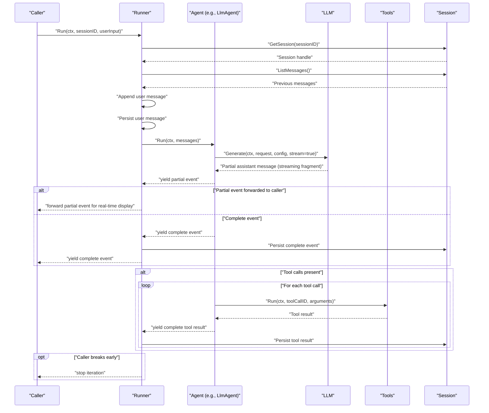
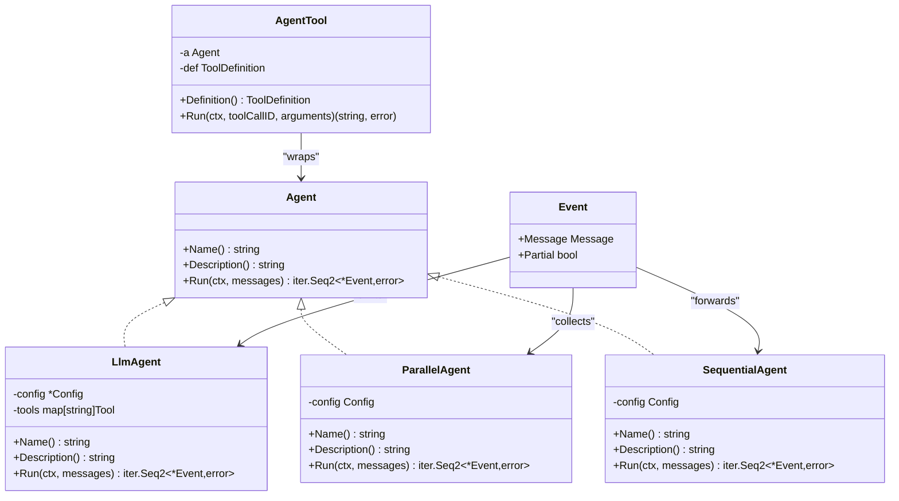
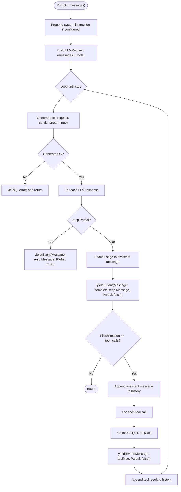
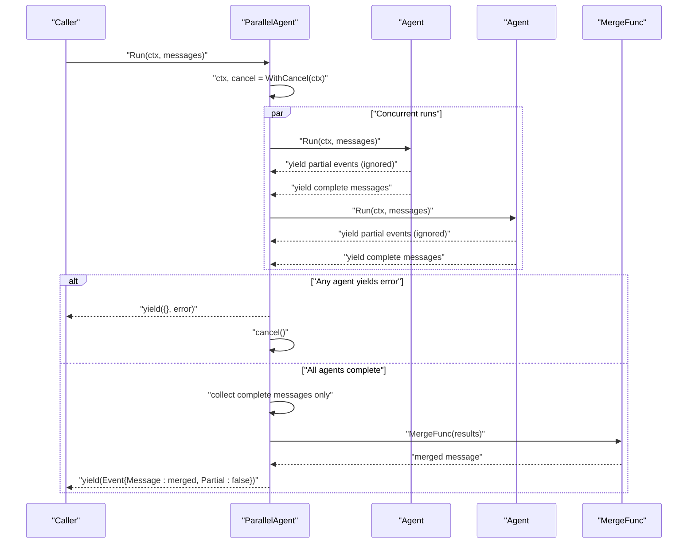
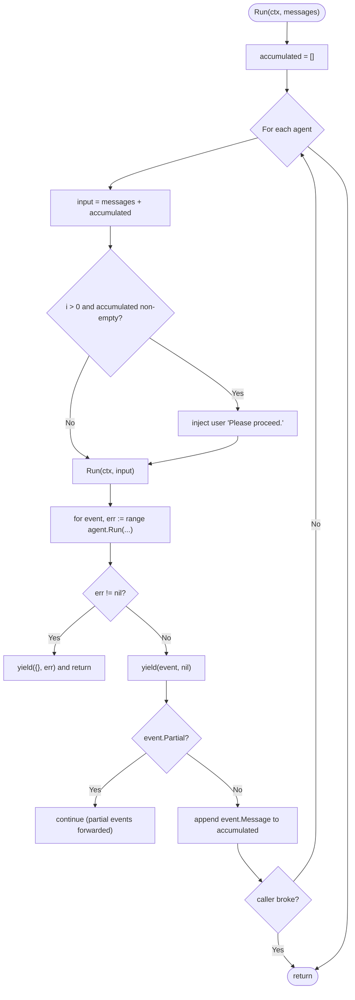
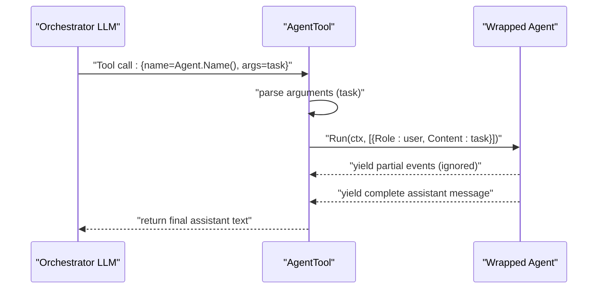
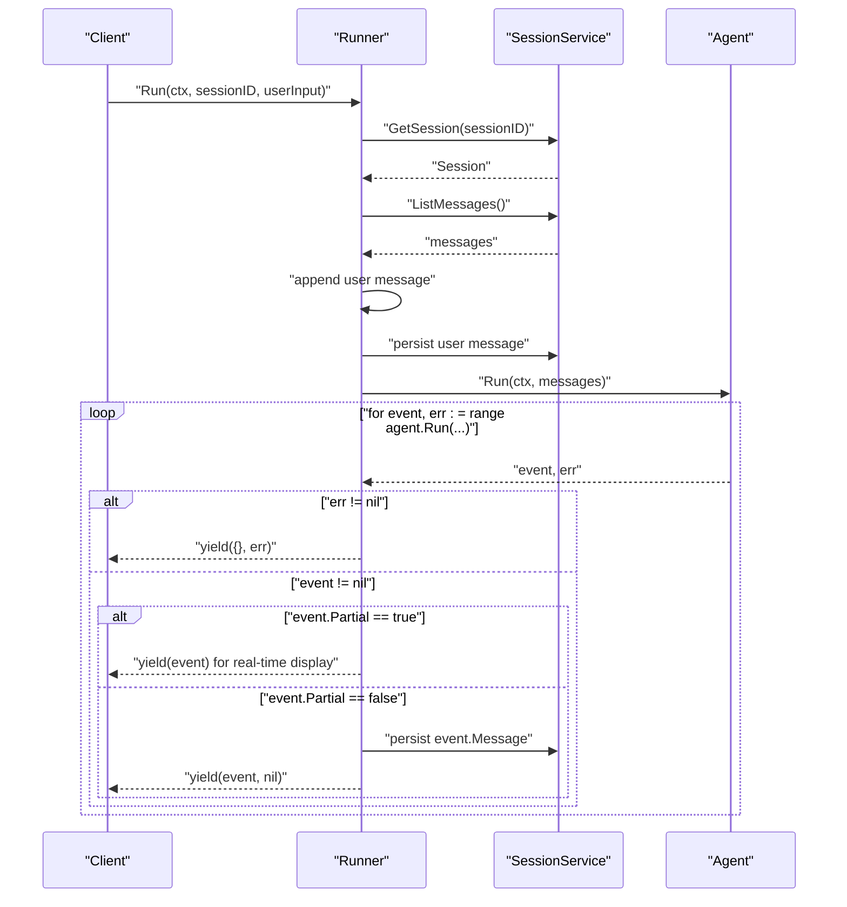
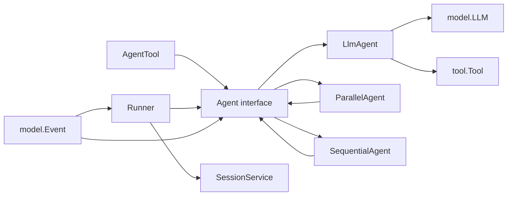

# Agent Interface

<cite>
**Referenced Files in This Document**
- [agent.go](file://agent/agent.go)
- [llmagent.go](file://agent/llmagent/llmagent.go)
- [agentool.go](file://agent/agentool/agentool.go)
- [parallel.go](file://agent/parallel/parallel.go)
- [sequential.go](file://agent/sequential/sequential.go)
- [model.go](file://model/model.go)
- [tool.go](file://tool/tool.go)
- [runner.go](file://runner/runner.go)
- [session.go](file://session/session.go)
- [session_service.go](file://session/session_service.go)
- [main.go](file://examples/chat/main.go)
</cite>

## Update Summary
**Changes Made**
- Updated Agent interface to return streaming events via `iter.Seq2[*model.Event, error]` instead of simple message arrays
- Added comprehensive documentation for the Event type with Partial field for streaming fragments and complete messages
- Updated streaming response pattern documentation to explain the difference between partial and complete events
- Revised orchestrator implementations to handle the new Event-based streaming system
- Enhanced Runner integration to distinguish between partial and complete event persistence

## Table of Contents
1. [Introduction](#introduction)
2. [Project Structure](#project-structure)
3. [Core Components](#core-components)
4. [Architecture Overview](#architecture-overview)
5. [Detailed Component Analysis](#detailed-component-analysis)
6. [Dependency Analysis](#dependency-analysis)
7. [Performance Considerations](#performance-considerations)
8. [Troubleshooting Guide](#troubleshooting-guide)
9. [Conclusion](#conclusion)
10. [Appendices](#appendices)

## Introduction
This document defines the Agent interface contract and responsibilities, focusing on the stateless design, streaming response pattern using Go iterators with Event-based streaming, and the context parameter for cancellation and timeouts. It explains how agents operate independently without maintaining internal state between runs, how they integrate with orchestration patterns (parallel and sequential), and how they relate to the broader system including sessions, runners, models, and tools. The system now uses a sophisticated Event-based streaming mechanism where agents emit both streaming fragments (Partial=true) for real-time display and complete messages (Partial=false) for persistence. Practical guidance is provided for implementing custom agents, validating parameters, handling errors, and following best practices for naming and descriptions.

## Project Structure
The Agent interface and its implementations live under the agent package, with supporting model and tool abstractions in model and tool packages. Orchestrators (parallel and sequential) compose agents, while Runner coordinates agents with Sessions for persistent conversation history. The new Event-based streaming system provides fine-grained control over partial and complete message handling.

```mermaid
graph TB
subgraph "Agent Layer"
A_IF["Agent interface<br/>Name(), Description(), Run()"]
A_LLM["LlmAgent"]
A_PAR["ParallelAgent"]
A_SEQ["SequentialAgent"]
A_TOOL["AgentTool (wraps Agent as Tool)"]
EVT["Event type<br/>Message + Partial flag"]
END
subgraph "Model Layer"
M_IF["LLM interface"]
M_MSG["Message, ToolCall, TokenUsage"]
M_REQ["LLMRequest, LLMResponse"]
END
subgraph "Tool Layer"
T_IF["Tool interface"]
END
subgraph "Runtime Layer"
R_RUN["Runner"]
S_SESS["SessionService + Session"]
END
A_IF --> A_LLM
A_IF --> A_PAR
A_IF --> A_SEQ
A_TOOL --> A_IF
A_LLM --> M_IF
A_LLM --> T_IF
A_PAR --> A_IF
A_SEQ --> A_IF
R_RUN --> A_IF
R_RUN --> S_SESS
M_IF --> M_MSG
M_IF --> M_REQ
T_IF --> M_IF
EVT --> A_IF
EVT --> R_RUN
```

**Diagram sources**
- [agent.go:10-19](file://agent/agent.go#L10-L19)
- [llmagent.go:25-41](file://agent/llmagent/llmagent.go#L25-L41)
- [parallel.go:86-101](file://agent/parallel/parallel.go#L86-L101)
- [sequential.go:30-41](file://agent/sequential/sequential.go#L30-L41)
- [agentool.go:16-48](file://agent/agentool/agentool.go#L16-L48)
- [model.go:9-23](file://model/model.go#L9-L23)
- [model.go:147-199](file://model/model.go#L147-L199)
- [model.go:214-226](file://model/model.go#L214-L226)
- [tool.go:17-23](file://tool/tool.go#L17-L23)
- [runner.go:17-37](file://runner/runner.go#L17-L37)
- [session_service.go:5-9](file://session/session_service.go#L5-L9)
- [session.go:9-23](file://session/session.go#L9-L23)

**Section sources**
- [agent.go:10-19](file://agent/agent.go#L10-L19)
- [runner.go:17-37](file://runner/runner.go#L17-L37)
- [session_service.go:5-9](file://session/session_service.go#L5-L9)
- [session.go:9-23](file://session/session.go#L9-L23)
- [model.go:9-23](file://model/model.go#L9-L23)
- [model.go:147-199](file://model/model.go#L147-L199)
- [model.go:214-226](file://model/model.go#L214-L226)
- [tool.go:17-23](file://tool/tool.go#L17-L23)

## Core Components
- Agent interface: Stateless contract with three methods:
  - Name(): returns a human-readable agent name
  - Description(): returns a human-readable description
  - Run(ctx, messages): returns an iterator over model.Event and error
- Event type: Fundamental unit emitted by Agent.Run with two key fields:
  - Message: Contains the content of the event (assistant replies, tool results, etc.)
  - Partial: Boolean flag indicating whether this is a streaming fragment (true) or complete message (false)
- LlmAgent: A stateless agent that drives an LLM with optional tools and an instruction. It yields assistant messages and tool results incrementally as streaming events.
- ParallelAgent: Runs multiple agents concurrently with the same input, merging their outputs into a single complete assistant message.
- SequentialAgent: Runs agents in order, passing all prior complete messages as context to each subsequent agent.
- AgentTool: Wraps an Agent as a Tool so it can be invoked by an orchestrator LLM via native function-calling.
- Runner: Coordinates a stateless Agent with a SessionService, loading conversation history, appending user input, invoking the agent, and persisting only complete events.
- Model abstractions: LLM interface, Message, ToolCall, TokenUsage, LLMRequest, LLMResponse.
- Tool interface: Provider-agnostic tool abstraction used by LLMs and AgentTool.

Key streaming semantics:
- Run returns iter.Seq2[*model.Event, error], enabling incremental processing with fine-grained control over partial vs complete events.
- Iteration continues until the sequence ends or the caller breaks early.
- Errors are yielded as the second element; the caller decides whether to continue.
- Partial events (Event.Partial=true) carry streaming text fragments for real-time display
- Complete events (Event.Partial=false) carry fully assembled messages for persistence

Context semantics:
- Run(ctx, messages) accepts a context for cancellation and timeout control.
- Orchestrators derive child contexts and propagate cancellation to sibling agents.
- Examples demonstrate using context.WithTimeout for long-running iterations.

**Section sources**
- [agent.go:10-19](file://agent/agent.go#L10-L19)
- [model.go:214-226](file://model/model.go#L214-L226)
- [llmagent.go:51-105](file://agent/llmagent/llmagent.go#L51-L105)
- [parallel.go:112-168](file://agent/parallel/parallel.go#L112-L168)
- [sequential.go:46-89](file://agent/sequential/sequential.go#L46-L89)
- [agentool.go:54-78](file://agent/agentool/agentool.go#L54-L78)
- [runner.go:39-90](file://runner/runner.go#L39-L90)
- [model.go:9-23](file://model/model.go#L9-L23)
- [model.go:147-199](file://model/model.go#L147-L199)
- [tool.go:17-23](file://tool/tool.go#L17-L23)

## Architecture Overview
The Agent interface sits at the center of the system, composing with Models (LLM) and Tools. Orchestrators (ParallelAgent, SequentialAgent) coordinate multiple agents. Runner integrates agents with Sessions for persistent conversation history, with special handling for partial vs complete events.



**Diagram sources**
- [runner.go:39-90](file://runner/runner.go#L39-L90)
- [llmagent.go:51-105](file://agent/llmagent/llmagent.go#L51-L105)
- [model.go:9-23](file://model/model.go#L9-L23)
- [tool.go:17-23](file://tool/tool.go#L17-L23)
- [session.go:9-23](file://session/session.go#L9-L23)
- [session_service.go:5-9](file://session/session_service.go#L5-L9)

## Detailed Component Analysis

### Agent Interface Contract
- Responsibilities:
  - Provide identity: Name() and Description() for attribution and discovery.
  - Execute a turn: Run(ctx, messages) yields model.Event and error.
- Statelessness:
  - Agents do not retain state between runs; all context is passed via messages and configuration.
  - Orchestrators (ParallelAgent, SequentialAgent) manage cross-agent coordination and merging.
- Streaming:
  - Run returns iter.Seq2[*model.Event, error]; callers iterate until completion or break.
  - Event.Partial=true indicates streaming fragments for real-time display
  - Event.Partial=false indicates complete messages for persistence
  - Errors are yielded as the second element; callers decide continuation.
- Context:
  - Run(ctx, ...) respects cancellation and timeouts; orchestrators derive child contexts.



**Diagram sources**
- [agent.go:10-19](file://agent/agent.go#L10-L19)
- [model.go:214-226](file://model/model.go#L214-L226)
- [llmagent.go:25-41](file://agent/llmagent/llmagent.go#L25-L41)
- [parallel.go:86-101](file://agent/parallel/parallel.go#L86-L101)
- [sequential.go:30-41](file://agent/sequential/sequential.go#L30-L41)
- [agentool.go:16-48](file://agent/agentool/agentool.go#L16-L48)

**Section sources**
- [agent.go:10-19](file://agent/agent.go#L10-L19)
- [model.go:214-226](file://model/model.go#L214-L226)

### Event Type and Streaming Semantics
- Event structure:
  - Message: Contains the content of the event (assistant replies, tool results, etc.)
  - Partial: Boolean flag indicating whether this is a streaming fragment (true) or complete message (false)
- Streaming semantics:
  - When Partial=true: Only Message.Content and Message.ReasoningContent carry incremental (delta) text; all other fields may be zero-valued
  - When Partial=false: Message is fully assembled
  - Callers should forward partial events to the client for real-time display but only persist complete events (Partial=false)
- Usage patterns:
  - Streaming fragments enable real-time text display during LLM generation
  - Complete events represent finalized messages ready for storage and processing

**Section sources**
- [model.go:214-226](file://model/model.go#L214-L226)

### LlmAgent Implementation
- Purpose: Stateless agent that drives an LLM with optional tools and an instruction.
- Behavior:
  - Prepends system instruction when configured.
  - Builds LLMRequest from messages and tools.
  - Loops: Generate -> yield partial events for streaming -> yield complete assistant message -> if tool_calls -> execute tools -> yield complete tool results -> repeat until stop.
  - Attaches token usage to assistant messages for persistence.
- Streaming: Yields assistant messages and tool results as streaming events; iteration ends when finish reason indicates stop.
- Error handling: Propagates LLM errors via yield; tool execution errors are captured and returned as tool result content.



**Diagram sources**
- [llmagent.go:51-105](file://agent/llmagent/llmagent.go#L51-L105)
- [llmagent.go:107-127](file://agent/llmagent/llmagent.go#L107-L127)

**Section sources**
- [llmagent.go:25-41](file://agent/llmagent/llmagent.go#L25-L41)
- [llmagent.go:51-105](file://agent/llmagent/llmagent.go#L51-L105)
- [llmagent.go:107-127](file://agent/llmagent/llmagent.go#L107-L127)

### ParallelAgent Implementation
- Purpose: Run multiple agents concurrently with the same input; merge outputs into a single complete assistant message.
- Behavior:
  - Derives a child context; cancels it upon first error to signal siblings to exit.
  - Collects each agent's complete messages only (ignores partial events) for merging.
  - Uses MergeFunc to combine outputs; default merges final assistant text with attribution headers.
- Streaming: Yields exactly one merged message after all agents finish; supports early stop by breaking iteration.
- Event handling: Consumes partial events silently; only complete messages are collected and merged.



**Diagram sources**
- [parallel.go:112-168](file://agent/parallel/parallel.go#L112-L168)

**Section sources**
- [parallel.go:29-41](file://agent/parallel/parallel.go#L29-L41)
- [parallel.go:70-86](file://agent/parallel/parallel.go#L70-L86)
- [parallel.go:112-168](file://agent/parallel/parallel.go#L112-L168)

### SequentialAgent Implementation
- Purpose: Run agents in order; each agent receives the original input plus all prior complete messages as context.
- Behavior:
  - Builds input as original messages + accumulated complete context.
  - Injects a handoff user message before subsequent agents to ensure proper conversation structure.
  - Yields every event produced by each agent (including partial streaming events); supports early stop and error propagation.
  - Only complete (non-partial) messages contribute to accumulated context.
- Streaming: Yields messages in order; caller can break early to stop further agents.



**Diagram sources**
- [sequential.go:46-89](file://agent/sequential/sequential.go#L46-L89)

**Section sources**
- [sequential.go:18-25](file://agent/sequential/sequential.go#L18-L25)
- [sequential.go:46-89](file://agent/sequential/sequential.go#L46-L89)

### AgentTool: Wrapping an Agent as a Tool
- Purpose: Allow an Agent to be invoked as a Tool by an orchestrator LLM via native function-calling.
- Behavior:
  - Definition() returns tool metadata using the agent's Name() and Description().
  - Run(ctx, toolCallID, arguments) parses a task string, runs the agent with a single user message, and returns the agent's final assistant text.
  - Intermediate partial events and complete messages are processed; only the final assistant text is returned as the tool result.



**Diagram sources**
- [agentool.go:29-48](file://agent/agentool/agentool.go#L29-L48)
- [agentool.go:54-78](file://agent/agentool/agentool.go#L54-L78)

**Section sources**
- [agentool.go:16-48](file://agent/agentool/agentool.go#L16-L48)
- [agentool.go:54-78](file://agent/agentool/agentool.go#L54-L78)

### Runner Integration with Sessions
- Purpose: Coordinate a stateless Agent with a SessionService to load history, append user input, run the agent, and persist only complete events.
- Behavior:
  - Loads session, lists messages, appends user message, persists it.
  - Invokes agent.Run(ctx, messages), persists each yielded complete event, and yields it to the caller.
  - Supports early stop and error propagation.
  - Only complete events (Event.Partial=false) are persisted to the session; partial events are forwarded for real-time display only.



**Diagram sources**
- [runner.go:39-90](file://runner/runner.go#L39-L90)
- [session_service.go:5-9](file://session/session_service.go#L5-L9)
- [session.go:9-23](file://session/session.go#L9-L23)

**Section sources**
- [runner.go:17-37](file://runner/runner.go#L17-L37)
- [runner.go:39-90](file://runner/runner.go#L39-L90)
- [session_service.go:5-9](file://session/session_service.go#L5-L9)
- [session.go:9-23](file://session/session.go#L9-L23)

## Dependency Analysis
- Agent depends on:
  - model.LLM for generation
  - tool.Tool for tool execution
- LlmAgent composes:
  - Config (Name, Description, Model, Tools, Instruction, GenerateConfig, Stream)
  - tools map for fast lookup
- ParallelAgent and SequentialAgent depend on Agent interface, enabling composition of arbitrary agents.
- AgentTool depends on Agent interface and tool.Definition to expose the wrapped agent as a Tool.
- Runner depends on Agent and SessionService to coordinate persistence and streaming.
- Event type provides the fundamental unit for streaming communication between agents and runners.



**Diagram sources**
- [agent.go:10-19](file://agent/agent.go#L10-L19)
- [llmagent.go:25-41](file://agent/llmagent/llmagent.go#L25-L41)
- [parallel.go:86-101](file://agent/parallel/parallel.go#L86-L101)
- [sequential.go:30-41](file://agent/sequential/sequential.go#L30-L41)
- [agentool.go:16-48](file://agent/agentool/agentool.go#L16-L48)
- [model.go:9-23](file://model/model.go#L9-L23)
- [tool.go:17-23](file://tool/tool.go#L17-L23)
- [runner.go:17-37](file://runner/runner.go#L17-L37)
- [session_service.go:5-9](file://session/session_service.go#L5-L9)
- [model.go:214-226](file://model/model.go#L214-L226)

**Section sources**
- [agent.go:10-19](file://agent/agent.go#L10-L19)
- [llmagent.go:25-41](file://agent/llmagent/llmagent.go#L25-L41)
- [parallel.go:86-101](file://agent/parallel/parallel.go#L86-L101)
- [sequential.go:30-41](file://agent/sequential/sequential.go#L30-L41)
- [agentool.go:16-48](file://agent/agentool/agentool.go#L16-L48)
- [runner.go:17-37](file://runner/runner.go#L17-L37)
- [session_service.go:5-9](file://session/session_service.go#L5-L9)
- [model.go:214-226](file://model/model.go#L214-L226)

## Performance Considerations
- Streaming and backpressure:
  - Use the iterator pattern to process events incrementally; break early to stop further work.
  - Partial events enable real-time display without blocking the main thread.
  - Avoid buffering large histories; pass only necessary context to agents.
- Concurrency:
  - ParallelAgent runs agents concurrently; ensure upstream LLMs and tools can handle concurrent calls.
  - Use context.WithTimeout to bound long-running iterations; orchestrators cancel child contexts on error.
  - Event-based streaming allows for efficient resource utilization across concurrent agents.
- Memory:
  - Agents are stateless; avoid retaining message histories in agent fields.
  - SequentialAgent accumulates complete messages; consider truncating or summarizing very long histories.
  - Event.Partial=true messages contain minimal data, reducing memory overhead for streaming fragments.
- I/O:
  - Persist only complete events (Event.Partial=false) to minimize rework on restarts.
  - Batch writes if the underlying Session supports it.
  - Partial events are forwarded for real-time display but not persisted, optimizing storage usage.

## Troubleshooting Guide
Common issues and patterns:
- Early termination:
  - If the caller breaks out of the iterator, orchestrators stop further work promptly.
  - Example: ParallelAgent cancels child context upon first error; SequentialAgent stops subsequent agents.
- Error propagation:
  - LlmAgent yields LLM errors; AgentTool wraps tool execution errors into tool result content.
  - Runner yields errors from agent.Run and stops iteration.
- Timeout handling:
  - Use context.WithTimeout around long-running runs; orchestrators derive child contexts.
- Parameter validation:
  - ParallelAgent panics if no agents are provided; SequentialAgent panics similarly.
  - AgentTool validates tool arguments; returns structured errors on parse failure.
- Event handling:
  - Ensure proper distinction between partial and complete events in custom implementations.
  - Only persist complete events (Event.Partial=false) to maintain conversation integrity.

Practical references:
- Early stop and error propagation in orchestrators
  - [parallel.go:112-168](file://agent/parallel/parallel.go#L112-L168)
  - [sequential.go:46-89](file://agent/sequential/sequential.go#L46-L89)
- LlmAgent error handling and tool execution
  - [llmagent.go:51-105](file://agent/llmagent/llmagent.go#L51-L105)
  - [llmagent.go:107-127](file://agent/llmagent/llmagent.go#L107-L127)
- AgentTool argument parsing and error wrapping
  - [agentool.go:54-78](file://agent/agentool/agentool.go#L54-L78)
- Runner error propagation and persistence
  - [runner.go:39-90](file://runner/runner.go#L39-L90)

**Section sources**
- [parallel.go:112-168](file://agent/parallel/parallel.go#L112-L168)
- [sequential.go:46-89](file://agent/sequential/sequential.go#L46-L89)
- [llmagent.go:51-105](file://agent/llmagent/llmagent.go#L51-L105)
- [llmagent.go:107-127](file://agent/llmagent/llmagent.go#L107-L127)
- [agentool.go:54-78](file://agent/agentool/agentool.go#L54-L78)
- [runner.go:39-90](file://runner/runner.go#L39-L90)

## Conclusion
The Agent interface enforces a clean, stateless contract with sophisticated streaming outputs using Event-based communication and explicit context handling. The new Event type with Partial field provides fine-grained control over streaming fragments versus complete messages, enabling real-time display while maintaining data integrity through selective persistence. LlmAgent provides a robust foundation for LLM-driven agents with tool support and streaming capabilities. Orchestrators (ParallelAgent, SequentialAgent) enable flexible composition while properly handling the event streaming semantics. AgentTool exposes agents as callable tools with seamless event processing. Runner integrates agents with persistent sessions, ensuring conversation continuity by distinguishing between partial and complete events. Following the patterns documented here leads to reliable, maintainable, and performant agent systems with excellent streaming support.

## Appendices

### Practical Examples and Patterns
- Implementing a custom agent:
  - Implement the Agent interface (Name, Description, Run) using the iterator pattern with Event emission.
  - Respect context for cancellation and timeouts.
  - Emit Event.Partial=true for streaming fragments and Event.Partial=false for complete messages.
  - Handle and yield errors appropriately.
  - References:
    - [agent.go:10-19](file://agent/agent.go#L10-L19)
    - [runner.go:39-90](file://runner/runner.go#L39-L90)
- Parameter validation:
  - Validate configuration in constructors; panic on invalid inputs (as seen in orchestrators).
  - References:
    - [parallel.go:90-101](file://agent/parallel/parallel.go#L90-L101)
    - [sequential.go:34-41](file://agent/sequential/sequential.go#L34-L41)
- Error handling patterns:
  - Yield errors via the iterator; let callers decide whether to continue.
  - References:
    - [llmagent.go:73-77](file://agent/llmagent/llmagent.go#L73-L77)
    - [agentool.go:59-61](file://agent/agentool/agentool.go#L59-L61)
- Relationship with system components:
  - Agents depend on Model and Tool abstractions; Runner coordinates with Sessions.
  - References:
    - [model.go:9-23](file://model/model.go#L9-L23)
    - [tool.go:17-23](file://tool/tool.go#L17-L23)
    - [runner.go:17-37](file://runner/runner.go#L17-L37)
- Long-running iterations:
  - Use context.WithTimeout; orchestrators cancel child contexts on error.
  - References:
    - [parallel.go:122-125](file://agent/parallel/parallel.go#L122-L125)
    - [sequential.go:56-88](file://agent/sequential/sequential.go#L56-L88)
    - [examples/chat/main.go:125-167](file://examples/chat/main.go#L125-L167)
- Event-based streaming patterns:
  - Use Event.Partial=true for real-time display during generation
  - Use Event.Partial=false for messages ready for persistence
  - References:
    - [model.go:214-226](file://model/model.go#L214-L226)
    - [runner.go:76-94](file://runner/runner.go#L76-L94)

**Section sources**
- [agent.go:10-19](file://agent/agent.go#L10-L19)
- [runner.go:39-90](file://runner/runner.go#L39-L90)
- [parallel.go:90-101](file://agent/parallel/parallel.go#L90-L101)
- [sequential.go:34-41](file://agent/sequential/sequential.go#L34-L41)
- [llmagent.go:73-77](file://agent/llmagent/llmagent.go#L73-L77)
- [agentool.go:59-61](file://agent/agentool/agentool.go#L59-L61)
- [model.go:9-23](file://model/model.go#L9-L23)
- [tool.go:17-23](file://tool/tool.go#L17-L23)
- [examples/chat/main.go:125-167](file://examples/chat/main.go#L125-L167)
- [model.go:214-226](file://model/model.go#L214-L226)
- [runner.go:76-94](file://runner/runner.go#L76-L94)