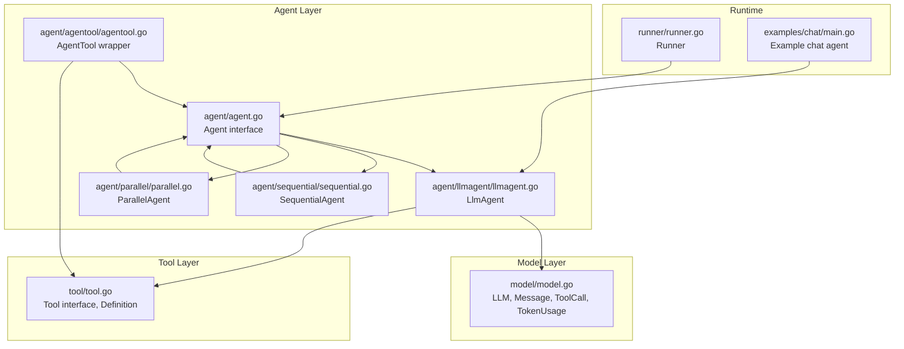
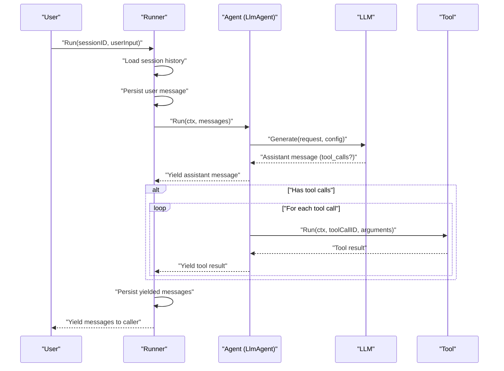
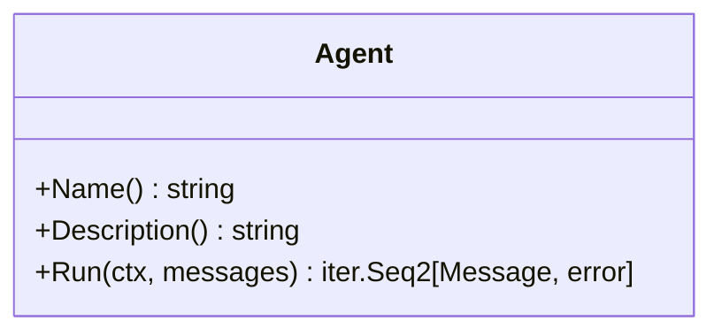
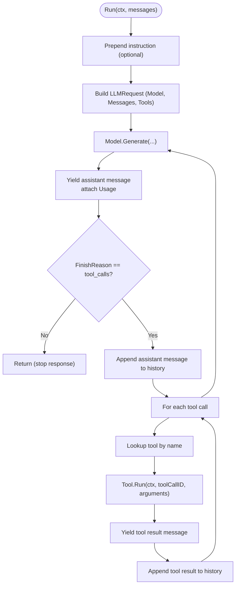
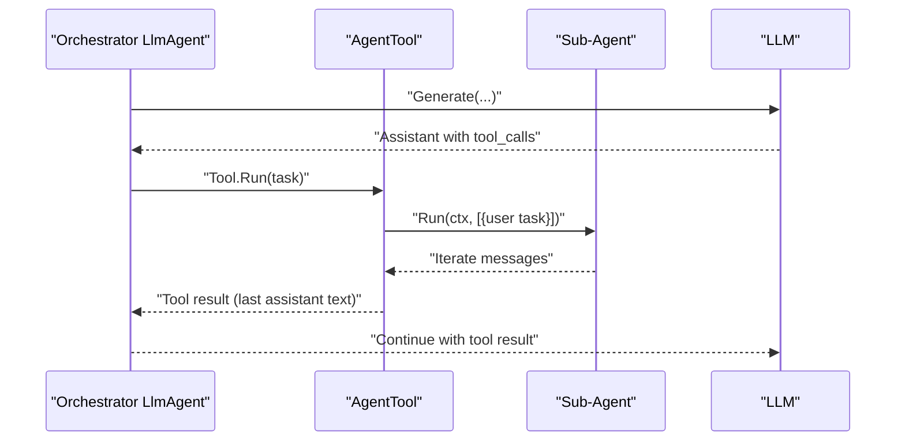
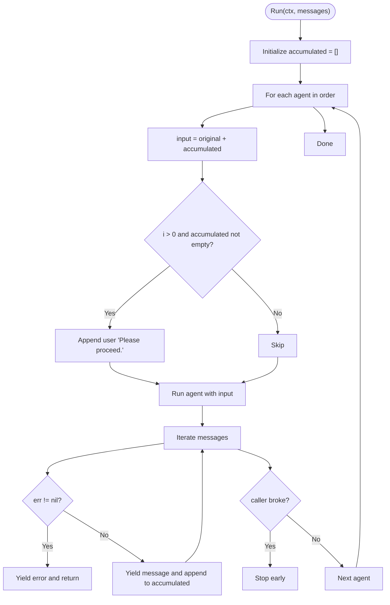
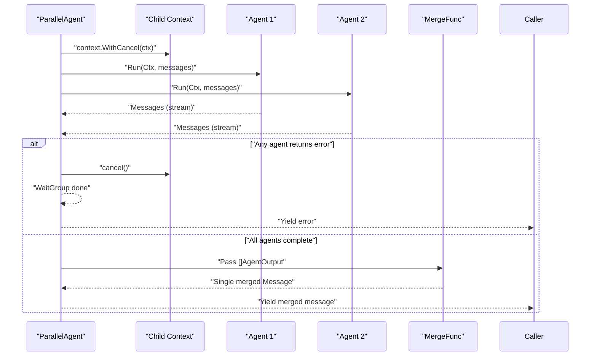
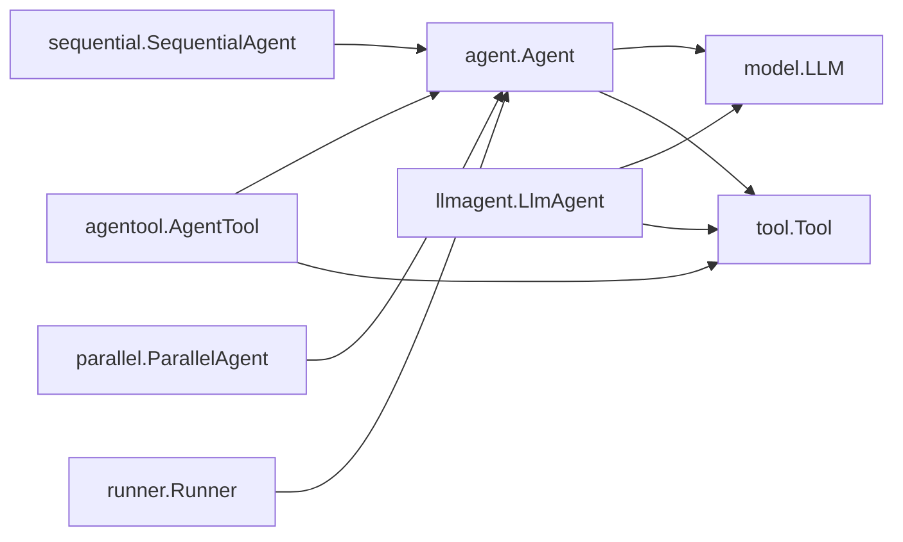

# Agent System

<cite>
**Referenced Files in This Document**
- [agent.go](file://agent/agent.go)
- [llmagent.go](file://agent/llmagent/llmagent.go)
- [agentool.go](file://agent/agentool/agentool.go)
- [sequential.go](file://agent/sequential/sequential.go)
- [parallel.go](file://agent/parallel/parallel.go)
- [model.go](file://model/model.go)
- [tool.go](file://tool/tool.go)
- [runner.go](file://runner/runner.go)
- [main.go](file://examples/chat/main.go)
- [llmagent_test.go](file://agent/llmagent/llmagent_test.go)
- [agentool_test.go](file://agent/agentool/agentool_test.go)
- [sequential_test.go](file://agent/sequential/sequential_test.go)
- [parallel_test.go](file://agent/parallel/parallel_test.go)
</cite>

## Table of Contents
1. [Introduction](#introduction)
2. [Project Structure](#project-structure)
3. [Core Components](#core-components)
4. [Architecture Overview](#architecture-overview)
5. [Detailed Component Analysis](#detailed-component-analysis)
6. [Dependency Analysis](#dependency-analysis)
7. [Performance Considerations](#performance-considerations)
8. [Troubleshooting Guide](#troubleshooting-guide)
9. [Conclusion](#conclusion)
10. [Appendices](#appendices)

## Introduction
This document explains the Agent System component, focusing on the Agent interface contract, stateless design, and streaming response pattern using Go iterators. It covers the LlmAgent implementation, tool-call loop mechanics, and automatic execution flow. It also documents Agent composition patterns via the AgentTool wrapper, sub-agent orchestration, and delegation patterns. Finally, it presents Sequential and Parallel agent coordination for complex workflows, along with practical examples, testing strategies, performance considerations, common use cases, integration patterns, and troubleshooting guidance.

## Project Structure
The Agent System resides under the agent/ package and integrates with model abstractions, tool interfaces, and a Runner that coordinates sessions and agent execution.

**Diagram sources**
- [agent.go:10-17](file://agent/agent.go#L10-L17)
- [llmagent.go:25-41](file://agent/llmagent/llmagent.go#L25-L41)
- [sequential.go:18-41](file://agent/sequential/sequential.go#L18-L41)
- [parallel.go:70-101](file://agent/parallel/parallel.go#L70-L101)
- [agentool.go:16-48](file://agent/agentool/agentool.go#L16-L48)
- [model.go:9-200](file://model/model.go#L9-L200)
- [tool.go:9-24](file://tool/tool.go#L9-L24)
- [runner.go:17-90](file://runner/runner.go#L17-L90)
- [main.go:101-110](file://examples/chat/main.go#L101-L110)

**Section sources**
- [agent.go:10-17](file://agent/agent.go#L10-L17)
- [llmagent.go:25-41](file://agent/llmagent/llmagent.go#L25-L41)
- [sequential.go:18-41](file://agent/sequential/sequential.go#L18-L41)
- [parallel.go:70-101](file://agent/parallel/parallel.go#L70-L101)
- [agentool.go:16-48](file://agent/agentool/agentool.go#L16-L48)
- [model.go:9-200](file://model/model.go#L9-L200)
- [tool.go:9-24](file://tool/tool.go#L9-L24)
- [runner.go:17-90](file://runner/runner.go#L17-L90)
- [main.go:101-110](file://examples/chat/main.go#L101-L110)

## Core Components
- Agent interface: Defines Name(), Description(), and Run(ctx, messages) -> iter.Seq2[Message, error]. The Run method streams messages as they are produced, enabling stateless iteration and early termination.
- LlmAgent: Stateless agent that drives an LLM through a tool-call loop. It prepends an instruction as a system message, generates assistant replies, executes tool calls, and yields tool results and final assistant messages.
- AgentTool wrapper: Wraps an Agent as a Tool so it can be invoked by an orchestrator LlmAgent via the LLM’s native function-calling mechanism. It captures the sub-agent’s final assistant text and returns it as a tool result.
- SequentialAgent: Runs a fixed list of agents sequentially, passing the original input plus all prior messages as context. Injects a handoff user message to keep each agent’s input ending with a user turn.
- ParallelAgent: Runs multiple agents concurrently with the same input, collects their outputs, and merges them into a single assistant message using a configurable MergeFunc. Cancels the shared context on the first error to stop sibling agents.

**Section sources**
- [agent.go:10-17](file://agent/agent.go#L10-L17)
- [llmagent.go:13-41](file://agent/llmagent/llmagent.go#L13-L41)
- [agentool.go:16-48](file://agent/agentool/agentool.go#L16-L48)
- [sequential.go:11-41](file://agent/sequential/sequential.go#L11-L41)
- [parallel.go:29-101](file://agent/parallel/parallel.go#L29-L101)

## Architecture Overview
The Agent System is built around a stateless, streaming interface. Agents receive conversation history and stream messages as they are produced. Tools are provided to the LLM via the model abstraction, and the Runner coordinates session persistence and iteration.

**Diagram sources**
- [runner.go:39-90](file://runner/runner.go#L39-L90)
- [llmagent.go:54-105](file://agent/llmagent/llmagent.go#L54-L105)
- [model.go:183-200](file://model/model.go#L183-L200)
- [tool.go:17-24](file://tool/tool.go#L17-L24)

## Detailed Component Analysis

### Agent Interface Contract
- Responsibilities:
  - Identity: Name() and Description() provide metadata for orchestration and logging.
  - Execution: Run(ctx, messages) returns a Go iterator that yields Message and error pairs. The caller iterates until completion or breaks early.
- Design principle: Stateless. Agents do not retain conversation state; they rely on the provided messages and any external persistence managed by the Runner.

**Diagram sources**
- [agent.go:10-17](file://agent/agent.go#L10-L17)

**Section sources**
- [agent.go:10-17](file://agent/agent.go#L10-L17)

### LlmAgent Implementation
- Configuration:
  - Name, Description: Agent identity.
  - Model: Provider-agnostic LLM interface.
  - Tools: Slice of tools exposed to the LLM.
  - Instruction: Optional system message prepended to every Run.
  - GenerateConfig: Optional generation parameters (temperature, reasoning effort, service tier, max tokens, thinking budget, enable thinking).
- Tool-call loop mechanics:
  - Prepends instruction as a system message when configured.
  - Builds LLMRequest with Model, Messages, and Tools.
  - Calls Model.Generate and yields the assistant message (with Usage attached).
  - If FinishReason is tool_calls, executes each tool call:
    - Looks up tool by name.
    - Invokes Tool.Run with toolCallID and arguments.
    - Yields a tool result message linking back to the tool call.
  - Continues looping until the LLM produces a stop response.
- Automatic execution flow:
  - The agent streams intermediate tool-call messages and tool results.
  - The final assistant message (no tool calls) terminates the loop.

**Diagram sources**
- [llmagent.go:54-105](file://agent/llmagent/llmagent.go#L54-L105)
- [llmagent.go:107-127](file://agent/llmagent/llmagent.go#L107-L127)
- [model.go:183-200](file://model/model.go#L183-L200)

**Section sources**
- [llmagent.go:13-41](file://agent/llmagent/llmagent.go#L13-L41)
- [llmagent.go:54-105](file://agent/llmagent/llmagent.go#L54-L105)
- [llmagent.go:107-127](file://agent/llmagent/llmagent.go#L107-L127)
- [model.go:183-200](file://model/model.go#L183-L200)

### Agent Composition Patterns

#### AgentTool Wrapper
- Purpose: Wrap an Agent as a Tool so an orchestrator LlmAgent can call it via the LLM’s native function-calling mechanism.
- Behavior:
  - Definition(): Uses the wrapped agent’s Name() and Description() and builds a JSON Schema for the tool input (single task string).
  - Run(ctx, toolCallID, arguments): Parses arguments, runs the wrapped Agent with a single user message, and returns the last assistant text as the tool result.
- Use case: Delegation of tasks to sub-agents from an orchestrator agent.

**Diagram sources**
- [agentool.go:54-78](file://agent/agentool/agentool.go#L54-L78)
- [agentool.go:16-48](file://agent/agentool/agentool.go#L16-L48)
- [llmagent.go:54-105](file://agent/llmagent/llmagent.go#L54-L105)

**Section sources**
- [agentool.go:16-48](file://agent/agentool/agentool.go#L16-L48)
- [agentool.go:54-78](file://agent/agentool/agentool.go#L54-L78)

#### Sub-Agent Orchestration and Delegation
- Pattern: An orchestrator LlmAgent exposes an AgentTool that wraps a sub-agent. The orchestrator decides when to delegate, and the sub-agent runs independently, returning only its final assistant text as a tool result.
- Benefits: Encourages modular, reusable agents and allows LLMs to orchestrate multiple specialists.

**Section sources**
- [agentool_test.go:55-130](file://agent/agentool/agentool_test.go#L55-L130)
- [agentool_test.go:152-226](file://agent/agentool/agentool_test.go#L152-L226)

### Sequential Agent Coordination
- Purpose: Execute a fixed list of agents in order, passing the original input plus all messages produced so far as context.
- Handoff: Injects a user message “Please proceed.” between agents to ensure each agent receives a conversation ending with a user turn.
- Behavior:
  - For each agent: build input (original + accumulated), inject handoff if applicable, run agent, yield messages, accumulate messages.
  - Early stop: If the caller breaks out of the iterator, subsequent agents are not executed.
  - Error propagation: If any agent returns an error, it is yielded and iteration stops.

**Diagram sources**
- [sequential.go:56-89](file://agent/sequential/sequential.go#L56-L89)

**Section sources**
- [sequential.go:18-41](file://agent/sequential/sequential.go#L18-L41)
- [sequential.go:56-89](file://agent/sequential/sequential.go#L56-L89)
- [sequential_test.go:127-174](file://agent/sequential/sequential_test.go#L127-L174)
- [sequential_test.go:176-230](file://agent/sequential/sequential_test.go#L176-L230)
- [sequential_test.go:243-282](file://agent/sequential/sequential_test.go#L243-L282)
- [sequential_test.go:284-316](file://agent/sequential/sequential_test.go#L284-L316)

### Parallel Agent Coordination
- Purpose: Run multiple agents concurrently with the same input, then merge their outputs into a single assistant message.
- Execution model:
  - Derives a child context; all agents share it.
  - Launches each agent in its own goroutine.
  - Waits for all agents to finish; cancels the shared context on the first error to stop siblings.
  - Collects AgentOutput for each agent (name and all messages) and passes to MergeFunc.
- MergeFunc:
  - Default: Aggregates each agent’s final assistant text with attribution headers, in definition order, omitting agents that produced no assistant text.
  - Customizable: Caller can supply a custom MergeFunc to control output shape.

**Diagram sources**
- [parallel.go:122-168](file://agent/parallel/parallel.go#L122-L168)
- [parallel.go:53-68](file://agent/parallel/parallel.go#L53-L68)

**Section sources**
- [parallel.go:29-101](file://agent/parallel/parallel.go#L29-L101)
- [parallel.go:122-168](file://agent/parallel/parallel.go#L122-L168)
- [parallel_test.go:190-256](file://agent/parallel/parallel_test.go#L190-L256)
- [parallel_test.go:301-335](file://agent/parallel/parallel.go#L301-L335)
- [parallel_test.go:337-400](file://agent/parallel/parallel_test.go#L337-L400)
- [parallel_test.go:402-447](file://agent/parallel/parallel_test.go#L402-L447)

### Practical Examples

#### Example: Chat Agent with MCP Tools
- Demonstrates an LlmAgent configured with tools loaded from an MCP endpoint, integrated with a Runner and in-memory session.
- Shows how to iterate over yielded messages, handle tool calls, and print the final assistant response.

**Section sources**
- [main.go:101-110](file://examples/chat/main.go#L101-L110)
- [main.go:144-165](file://examples/chat/main.go#L144-L165)

#### Example: Orchestrator Delegation via AgentTool
- Demonstrates an orchestrator LlmAgent exposing an AgentTool that wraps a translator sub-agent.
- Verifies the Thought→Action→Observation cycle: orchestrator decides to delegate, agentool executes the sub-agent, and the orchestrator produces a final answer.

**Section sources**
- [agentool_test.go:55-130](file://agent/agentool/agentool_test.go#L55-L130)
- [agentool_test.go:152-226](file://agent/agentool/agentool_test.go#L152-L226)

#### Example: Sequential Pipeline
- Demonstrates a two-step pipeline: summariser → translator, using real LLM calls.
- Validates that each agent produces a non-empty assistant reply and that the second agent receives the first agent’s output as context.

**Section sources**
- [sequential_test.go:322-385](file://agent/sequential/sequential_test.go#L322-L385)

#### Example: Parallel Fan-out
- Demonstrates running multiple translation agents in parallel and merging their results into a single assistant message with attribution headers.

**Section sources**
- [parallel_test.go:453-509](file://agent/parallel/parallel_test.go#L453-L509)

## Dependency Analysis
- Agent depends on:
  - model.LLM for generation.
  - tool.Tool for tool invocation.
- LlmAgent depends on:
  - model.LLMRequest and model.LLMResponse for request/response.
  - model.Message, model.ToolCall, model.TokenUsage for message semantics.
  - tool.Tool for execution.
- AgentTool depends on:
  - tool.Definition and JSON Schema for tool metadata.
  - agent.Agent for execution.
- SequentialAgent and ParallelAgent depend on:
  - agent.Agent for sub-agent execution.
  - model.Message for message handling.
- Runner depends on:
  - agent.Agent for execution.
  - session.SessionService for persistence.
  - model.Message for message conversion.

**Diagram sources**
- [agent.go:10-17](file://agent/agent.go#L10-L17)
- [llmagent.go:25-41](file://agent/llmagent/llmagent.go#L25-L41)
- [agentool.go:16-48](file://agent/agentool/agentool.go#L16-L48)
- [sequential.go:18-41](file://agent/sequential/sequential.go#L18-L41)
- [parallel.go:70-101](file://agent/parallel/parallel.go#L70-L101)
- [runner.go:17-37](file://runner/runner.go#L17-L37)

**Section sources**
- [model.go:9-200](file://model/model.go#L9-L200)
- [tool.go:9-24](file://tool/tool.go#L9-L24)
- [runner.go:17-37](file://runner/runner.go#L17-L37)

## Performance Considerations
- Streaming iteration: The iterator pattern avoids buffering entire conversations; callers can break early to reduce latency and cost.
- Concurrency:
  - ParallelAgent launches goroutines per sub-agent; ensure reasonable concurrency limits for resource-constrained environments.
  - Context cancellation minimizes wasted work when an error occurs.
- Token usage:
  - Assistant messages carry Usage; persist and monitor token consumption for cost control.
- Tool execution:
  - Tool.Run is synchronous; consider batching or caching where appropriate to reduce overhead.
- Memory:
  - SequentialAgent accumulates messages across agents; for long pipelines, consider trimming or truncating history to manage memory.

[No sources needed since this section provides general guidance]

## Troubleshooting Guide
- No tool calls despite expecting them:
  - Verify Tools are provided in LlmAgent.Config and that the LLM supports function-calling.
  - Check that the orchestrator AgentTool is registered as a tool for the orchestrator LlmAgent.
- Tool not found:
  - Ensure the tool name matches the Tool.Definition().Name used by the LLM.
- Empty final assistant message:
  - Confirm the LLM’s FinishReason is stop and not tool_calls; otherwise, tool results may still be pending.
- Early termination:
  - If the caller breaks out of the iterator, subsequent agents (in Sequential) or remaining agents (in Parallel) will not run.
- Error propagation:
  - In Sequential, an error from any agent stops the pipeline.
  - In Parallel, the first error cancels the shared context and yields the error; sibling agents exit promptly.
- Integration tips:
  - Use timeouts for external LLM calls to avoid indefinite hangs.
  - Persist messages via Runner to maintain conversation continuity across turns.

**Section sources**
- [llmagent.go:107-127](file://agent/llmagent/llmagent.go#L107-L127)
- [sequential.go:56-89](file://agent/sequential/sequential.go#L56-L89)
- [parallel.go:122-168](file://agent/parallel/parallel.go#L122-L168)
- [runner.go:39-90](file://runner/runner.go#L39-L90)

## Conclusion
The Agent System provides a flexible, stateless, and streaming foundation for building intelligent agents. LlmAgent encapsulates the tool-call loop and integrates seamlessly with tools and models. Composition patterns—AgentTool, Sequential, and Parallel—enable sophisticated workflows ranging from simple delegation to multi-agent orchestration. The Runner ties agents to persistent sessions, and the provided examples demonstrate practical integration with real LLMs and tools.

[No sources needed since this section summarizes without analyzing specific files]

## Appendices

### Testing Strategies
- Unit tests with deterministic mocks:
  - Use mockLLM to replay fixed sequences of responses for predictable assertions.
  - Validate tool-call loops, reasoning content pass-through, and error propagation.
- Integration tests:
  - Use environment variables to run against real LLMs (e.g., OPENAI_API_KEY).
  - Verify orchestrator delegation, sequential pipelines, and parallel fan-out.
- Best practices:
  - Keep tests focused on a single behavior (e.g., tool-call loop, context propagation).
  - Use context timeouts to avoid hanging tests.
  - Assert message roles, content presence, and tool-call linkage.

**Section sources**
- [llmagent_test.go:119-200](file://agent/llmagent/llmagent_test.go#L119-L200)
- [llmagent_test.go:241-362](file://agent/llmagent/llmagent_test.go#L241-L362)
- [agentool_test.go:55-130](file://agent/agentool/agentool_test.go#L55-L130)
- [sequential_test.go:127-174](file://agent/sequential/sequential_test.go#L127-L174)
- [sequential_test.go:176-230](file://agent/sequential/sequential_test.go#L176-L230)
- [sequential_test.go:322-385](file://agent/sequential/sequential_test.go#L322-L385)
- [parallel_test.go:190-256](file://agent/parallel/parallel_test.go#L190-L256)
- [parallel_test.go:453-509](file://agent/parallel/parallel_test.go#L453-L509)