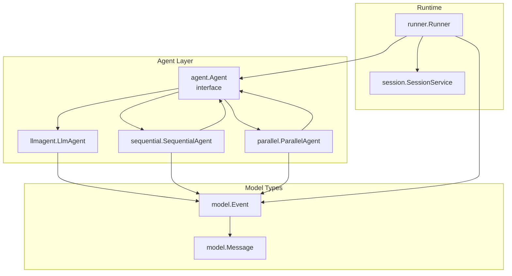
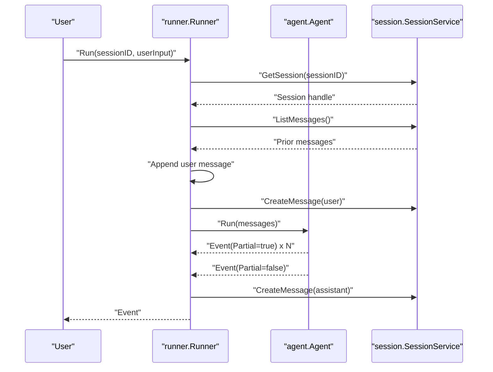
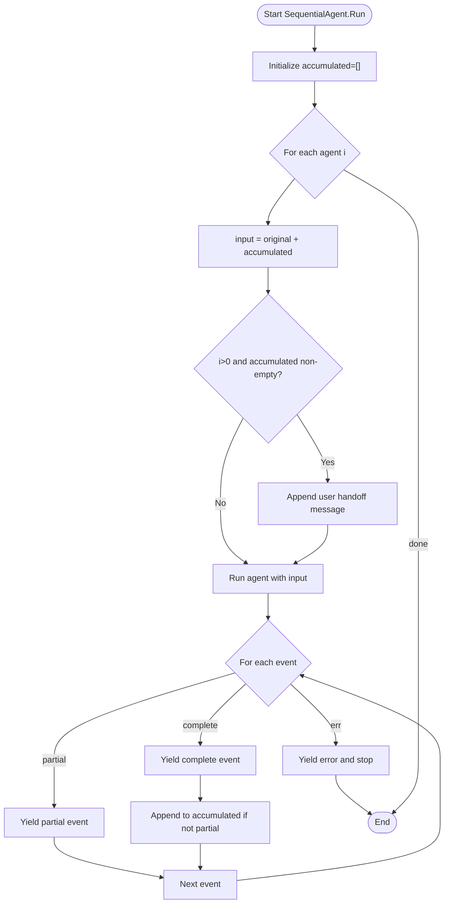
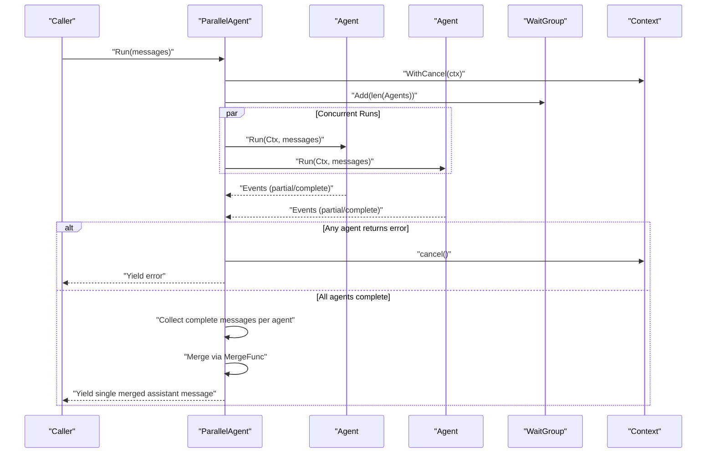
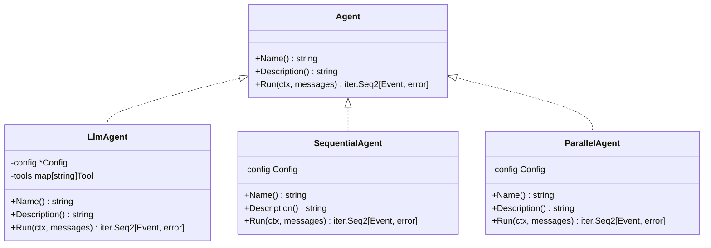
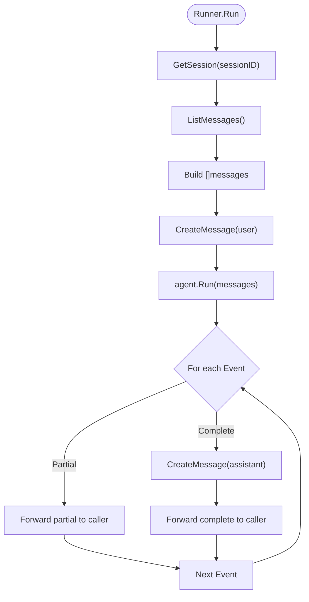
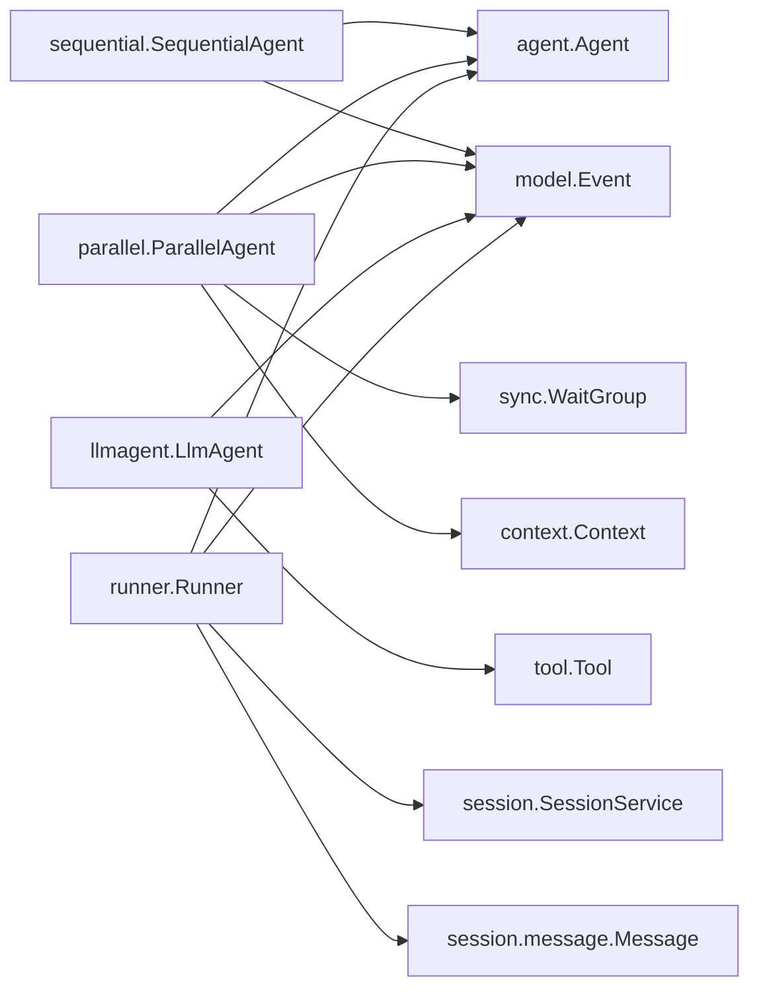
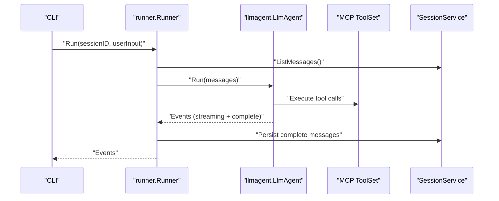

# Coordinated Agents

<cite>
**Referenced Files in This Document**
- [sequential.go](file://agent/sequential/sequential.go)
- [sequential_test.go](file://agent/sequential/sequential_test.go)
- [parallel.go](file://agent/parallel/parallel.go)
- [parallel_test.go](file://agent/parallel/parallel_test.go)
- [agent.go](file://agent/agent.go)
- [llmagent.go](file://agent/llmagent/llmagent.go)
- [runner.go](file://runner/runner.go)
- [model.go](file://model/model.go)
- [session.go](file://session/session.go)
- [message.go](file://session/message/message.go)
- [README.md](file://README.md)
- [main.go](file://examples/chat/main.go)
</cite>

## Table of Contents
1. [Introduction](#introduction)
2. [Project Structure](#project-structure)
3. [Core Components](#core-components)
4. [Architecture Overview](#architecture-overview)
5. [Detailed Component Analysis](#detailed-component-analysis)
6. [Dependency Analysis](#dependency-analysis)
7. [Performance Considerations](#performance-considerations)
8. [Troubleshooting Guide](#troubleshooting-guide)
9. [Conclusion](#conclusion)
10. [Appendices](#appendices)

## Introduction
This document explains coordinated agent execution patterns in the Agent Development Kit (ADK), focusing on Sequential and Parallel agent implementations. It covers how agents are composed, how coordination logic manages dependencies and results, and how errors propagate. It also provides practical guidance on choosing between sequential and parallel execution, optimizing performance, and designing robust workflows.

## Project Structure
The coordinated agents live under the agent package, with dedicated subpackages for sequential and parallel coordination. Agents are stateless and communicate via a unified interface. A Runner coordinates agents with sessions for persistent conversation history.

**Diagram sources**
- [agent.go:10-19](file://agent/agent.go#L10-L19)
- [sequential.go:30-44](file://agent/sequential/sequential.go#L30-L44)
- [parallel.go:86-104](file://agent/parallel/parallel.go#L86-L104)
- [llmagent.go:29-53](file://agent/llmagent/llmagent.go#L29-L53)
- [runner.go:20-37](file://runner/runner.go#L20-L37)
- [model.go:214-226](file://model/model.go#L214-L226)

**Section sources**
- [README.md:65-82](file://README.md#L65-L82)

## Core Components
- Agent interface: Defines the contract for all agents, including Name, Description, and Run, which yields events as they occur.
- SequentialAgent: Executes a fixed list of agents in order, passing the original input plus all complete messages produced so far to each agent. It injects a handoff user message between agents to keep conversations well-formed.
- ParallelAgent: Runs multiple agents concurrently with the same input, collects only complete messages from each agent, and merges them into a single assistant message using a configurable merge function.
- LlmAgent: A stateless agent that drives an LLM, managing tool-call loops and streaming responses.
- Runner: Coordinates a stateless Agent with a SessionService, loading conversation history, appending user input, and persisting complete messages.

**Section sources**
- [agent.go:10-19](file://agent/agent.go#L10-L19)
- [sequential.go:11-44](file://agent/sequential/sequential.go#L11-L44)
- [parallel.go:29-104](file://agent/parallel/parallel.go#L29-L104)
- [llmagent.go:13-53](file://agent/llmagent/llmagent.go#L13-L53)
- [runner.go:17-44](file://runner/runner.go#L17-L44)

## Architecture Overview
The system separates stateless agents from stateful session management. The Runner orchestrates a single turn: it loads prior messages, appends the user’s input, runs the Agent, and persists complete messages back to the session. Sequential and Parallel agents are themselves agents and can be composed with others.

**Diagram sources**
- [runner.go:39-95](file://runner/runner.go#L39-L95)
- [model.go:214-226](file://model/model.go#L214-L226)

## Detailed Component Analysis

### Sequential Agent Pattern
SequentialAgent runs agents in order, building each agent’s input from the original messages and all previously produced complete messages. It injects a handoff user message between agents to ensure each agent receives a conversation ending with a user turn.

Key behaviors:
- Input construction: original messages + all accumulated complete messages.
- Handoff injection: a user message “Please proceed.” is appended after the first agent’s output to keep the next agent’s input well-formed.
- Event yielding: every event (including partial streaming events) is yielded as it occurs.
- Accumulation: only complete (non-partial) messages are appended to the accumulated context for the next agent.
- Early termination: if the caller breaks out of the iteration, subsequent agents are not executed.
- Error propagation: if any agent returns an error, it is yielded and iteration stops.

**Diagram sources**
- [sequential.go:56-91](file://agent/sequential/sequential.go#L56-L91)

Practical examples:
- Two-step pipeline: a summarizer followed by a translator. The second agent receives the first agent’s output as context.
- Early stop: breaking out of iteration after the first message prevents the second agent from running.
- Error propagation: if the first agent errors, the second agent is not invoked.

**Section sources**
- [sequential.go:46-91](file://agent/sequential/sequential.go#L46-L91)
- [sequential_test.go:127-174](file://agent/sequential/sequential_test.go#L127-L174)
- [sequential_test.go:243-282](file://agent/sequential/sequential_test.go#L243-L282)
- [sequential_test.go:284-316](file://agent/sequential/sequential_test.go#L284-L316)

### Parallel Agent Pattern
ParallelAgent fans out to all sub-agents concurrently with the same input messages. Each agent is independent and does not share state. After all agents finish, their outputs are collected and merged into a single assistant message using a configurable merge function.

Key behaviors:
- Concurrency: each agent runs in its own goroutine; a shared context is cancelled upon the first error to signal siblings to exit promptly.
- Output collection: only complete messages are collected; partial streaming events are ignored.
- Merging: DefaultMergeFunc formats each agent’s final assistant text with an attribution header; custom MergeFunc can fully control the merged output.
- Single output: regardless of the number of agents, the ParallelAgent yields exactly one complete assistant message.
- Error handling: the first error encountered is yielded and iteration ends; sibling agents are cancelled via context.

**Diagram sources**
- [parallel.go:112-173](file://agent/parallel/parallel.go#L112-L173)

Practical examples:
- Fan-out: run multiple specialists on the same task; results are merged into a single response.
- Multi-model comparison: compare outputs from different LLMs side-by-side.
- Custom merge: concatenate results with a custom separator or format.

**Section sources**
- [parallel.go:70-173](file://agent/parallel/parallel.go#L70-L173)
- [parallel_test.go:146-188](file://agent/parallel/parallel_test.go#L146-L188)
- [parallel_test.go:190-256](file://agent/parallel/parallel_test.go#L190-L256)
- [parallel_test.go:337-400](file://agent/parallel/parallel_test.go#L337-L400)
- [parallel_test.go:402-447](file://agent/parallel/parallel_test.go#L402-L447)

### Agent Interface and LLM Agent
The Agent interface defines a uniform contract for all agents. LlmAgent is a stateless agent that:
- Prepends a system instruction when configured.
- Drives an LLM through a tool-call loop.
- Streams partial events for real-time display and yields complete events for each full message.
- Persists token usage on assistant messages.

**Diagram sources**
- [agent.go:10-19](file://agent/agent.go#L10-L19)
- [llmagent.go:29-53](file://agent/llmagent/llmagent.go#L29-L53)
- [sequential.go:30-44](file://agent/sequential/sequential.go#L30-L44)
- [parallel.go:86-104](file://agent/parallel/parallel.go#L86-L104)

**Section sources**
- [agent.go:10-19](file://agent/agent.go#L10-L19)
- [llmagent.go:55-125](file://agent/llmagent/llmagent.go#L55-L125)

### Runner and Session Integration
Runner coordinates a stateless Agent with a SessionService:
- Loads conversation history and appends the user’s input.
- Forwards every produced Event to the caller.
- Persists only complete events (Partial=false) to the session.
- Assigns unique IDs and timestamps to persisted messages.

**Diagram sources**
- [runner.go:39-95](file://runner/runner.go#L39-L95)
- [message.go:103-128](file://session/message/message.go#L103-L128)

**Section sources**
- [runner.go:39-95](file://runner/runner.go#L39-L95)
- [session.go:9-23](file://session/session.go#L9-L23)
- [message.go:49-101](file://session/message/message.go#L49-L101)

## Dependency Analysis
- SequentialAgent depends on:
  - agent.Agent for sub-agents.
  - model.Message for event and message types.
- ParallelAgent depends on:
  - agent.Agent for sub-agents.
  - model.Message for event and message types.
  - sync.WaitGroup and context for concurrency and cancellation.
- LlmAgent depends on:
  - model.LLM for generation.
  - tool.Tool for tool execution.
- Runner depends on:
  - agent.Agent for execution.
  - session.SessionService for persistence.
  - model.Event and model.Message for event handling.
  - session.message for conversion between runtime and persisted message types.

**Diagram sources**
- [sequential.go:7-8](file://agent/sequential/sequential.go#L7-L8)
- [parallel.go:10-11](file://agent/parallel/parallel.go#L10-L11)
- [llmagent.go:8-10](file://agent/llmagent/llmagent.go#L8-L10)
- [runner.go:10-14](file://runner/runner.go#L10-L14)
- [message.go:8-9](file://session/message/message.go#L8-L9)

**Section sources**
- [sequential.go:3-9](file://agent/sequential/sequential.go#L3-L9)
- [parallel.go:3-12](file://agent/parallel/parallel.go#L3-L12)
- [llmagent.go:3-11](file://agent/llmagent/llmagent.go#L3-L11)
- [runner.go:3-15](file://runner/runner.go#L3-L15)
- [message.go:3-9](file://session/message/message.go#L3-L9)

## Performance Considerations
- Sequential vs Parallel:
  - Sequential: lower concurrency, predictable ordering, minimal resource contention; suitable for dependent steps.
  - Parallel: higher throughput for independent tasks; potential resource contention; use with caution for CPU-bound agents.
- Streaming:
  - LlmAgent supports streaming; Runner forwards partial events for real-time display but persists only complete messages.
- Concurrency control:
  - ParallelAgent uses goroutines per agent; consider external rate limits or batching if agents call external APIs.
- Memory:
  - SequentialAgent accumulates complete messages; long pipelines may increase memory usage.
  - ParallelAgent collects only complete messages; memory footprint scales with number of agents and their outputs.
- Merging cost:
  - DefaultMergeFunc scans each agent’s messages to find the last assistant text; custom merge functions can optimize this.

[No sources needed since this section provides general guidance]

## Troubleshooting Guide
Common issues and remedies:
- Empty agent list:
  - SequentialAgent panics if no agents are provided.
  - ParallelAgent panics if no agents are provided.
- Early termination:
  - Sequential: breaking out of iteration prevents subsequent agents from running.
  - Parallel: breaking after the merged message ends iteration cleanly.
- Error propagation:
  - Sequential: any agent error halts the pipeline and yields the error.
  - Parallel: the first error cancels the shared context, prompting sibling agents to exit; the error is yielded.
- Streaming behavior:
  - Runner persists only complete events; partial events are forwarded for real-time display.
- Handoff message:
  - SequentialAgent injects a user handoff message after the first agent’s output to keep subsequent agents’ inputs well-formed.

**Section sources**
- [sequential.go:36-40](file://agent/sequential/sequential.go#L36-L40)
- [sequential.go:54-56](file://agent/sequential/sequential.go#L54-L56)
- [sequential_test.go:243-282](file://agent/sequential/sequential_test.go#L243-L282)
- [sequential_test.go:284-316](file://agent/sequential/sequential_test.go#L284-L316)
- [parallel.go:90-101](file://agent/parallel/parallel.go#L90-L101)
- [parallel.go:115-121](file://agent/parallel/parallel.go#L115-L121)
- [parallel_test.go:301-335](file://agent/parallel/parallel_test.go#L301-L335)
- [runner.go:76-94](file://runner/runner.go#L76-L94)

## Conclusion
Sequential and Parallel agents provide complementary coordination patterns for building sophisticated workflows:
- Use SequentialAgent for ordered, dependent steps where each stage benefits from enriched context.
- Use ParallelAgent for independent tasks or comparisons where throughput matters and results can be aggregated.
Choose based on use case requirements, resource constraints, and desired result ordering. Combine with Runner and Session for persistent, streaming-friendly conversations.

[No sources needed since this section summarizes without analyzing specific files]

## Appendices

### Practical Orchestration Patterns
- Sequential pipelines:
  - Research → Draft → Review: each stage builds on the previous.
  - Summarize → Translate: the second agent consumes the first’s output as context.
- Parallel fan-out:
  - Multiple translators in parallel on the same input.
  - Compare outputs from different LLMs side-by-side.
- Conditional branching:
  - Compose a decision agent that selects a sub-pipeline (Sequential or Parallel) based on input.
- Resource sharing:
  - For shared resources, wrap agents with a shared tool or service; ensure thread-safe access. Alternatively, pre-fetch shared data in a parent agent before invoking sub-agents.

[No sources needed since this section provides general guidance]

### Choosing Between Sequential and Parallel
- Sequential:
  - Pros: deterministic order, easy to reason about, lower overhead.
  - Cons: slower for independent tasks.
- Parallel:
  - Pros: faster for independent tasks, scalable with concurrency.
  - Cons: complexity in error handling and result aggregation.

[No sources needed since this section provides general guidance]

### Example: Chat Application Integration
The example demonstrates how to wire an LlmAgent with a Runner and an MCP toolset, enabling a chat loop with streaming and tool execution.

**Diagram sources**
- [main.go:125-170](file://examples/chat/main.go#L125-L170)
- [runner.go:39-95](file://runner/runner.go#L39-L95)
- [llmagent.go:55-125](file://agent/llmagent/llmagent.go#L55-L125)

**Section sources**
- [main.go:52-176](file://examples/chat/main.go#L52-L176)