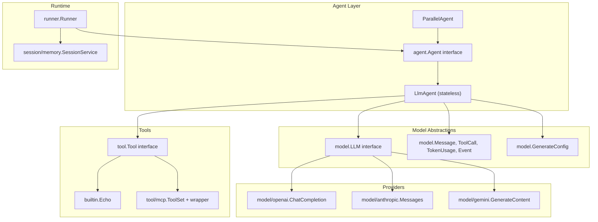
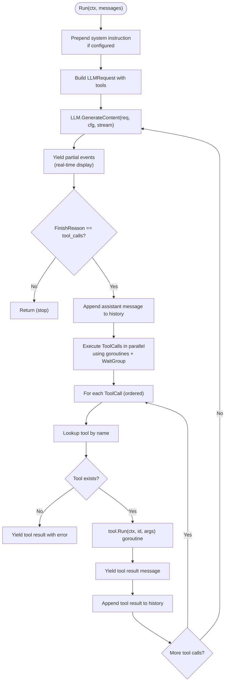
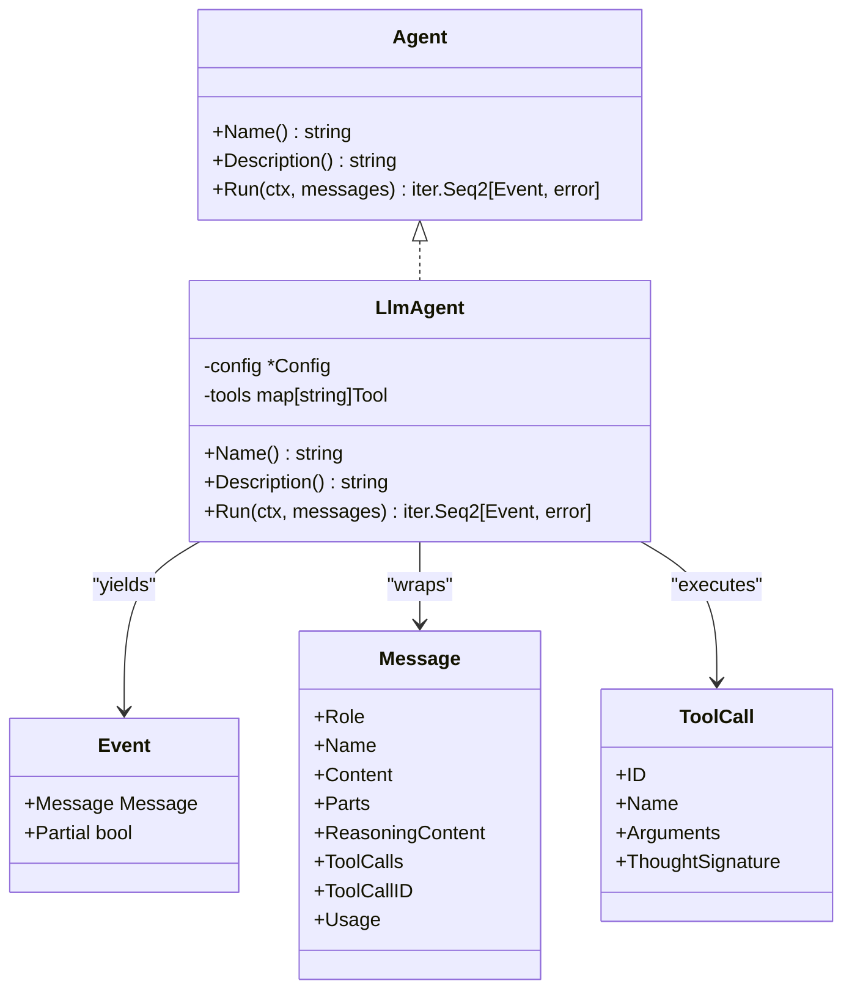
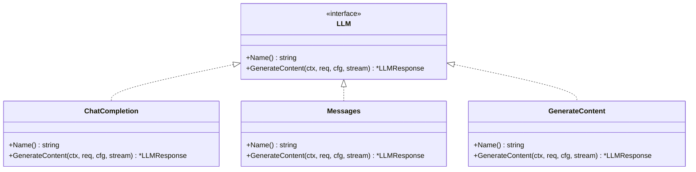
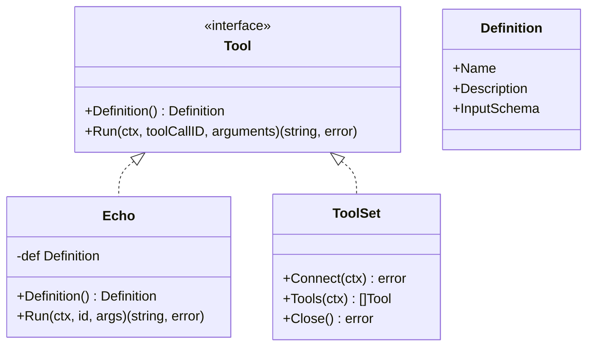
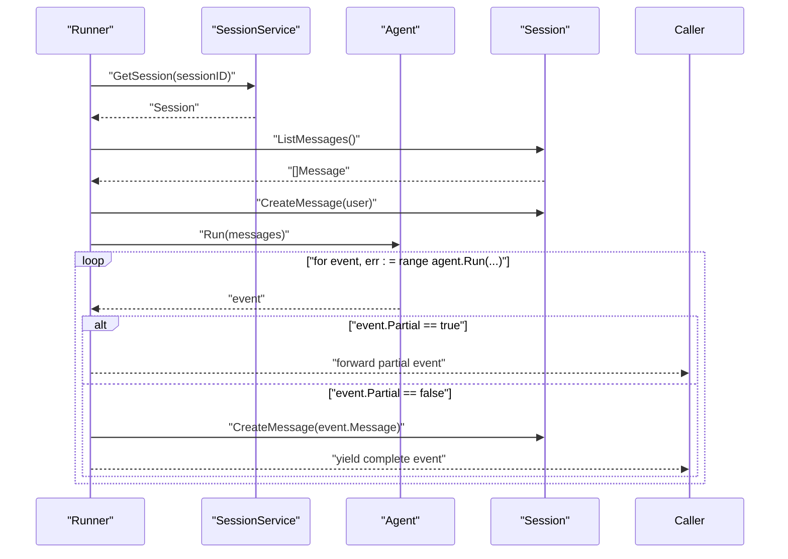
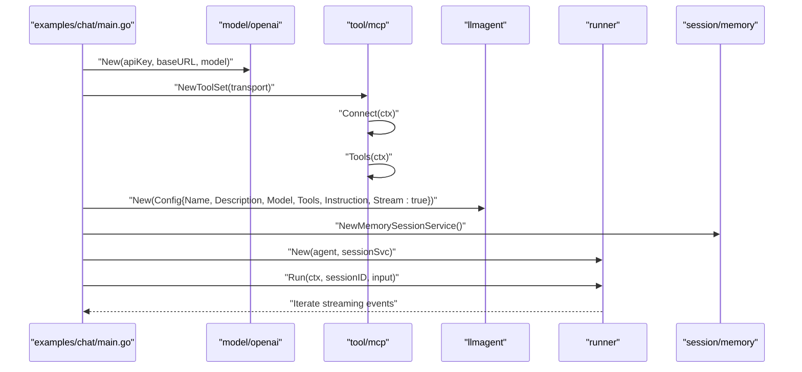
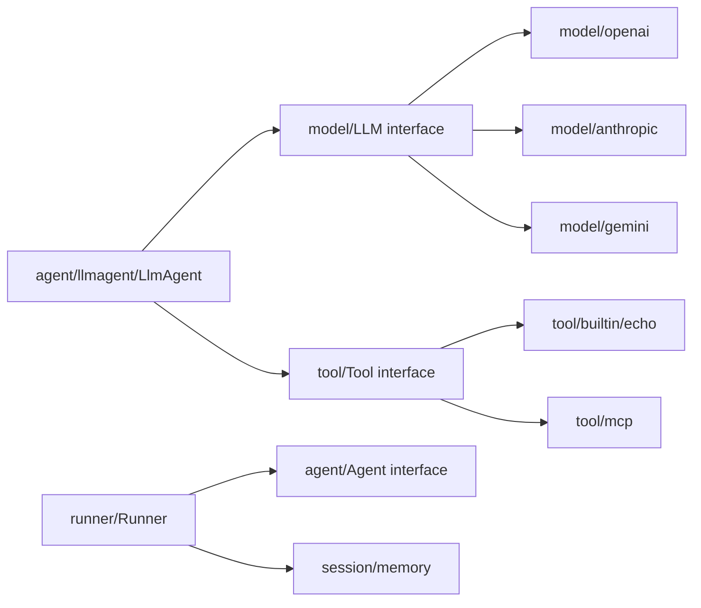

# LLM Agent Implementation

<cite>
**Referenced Files in This Document**
- [llmagent.go](file://agent/llmagent/llmagent.go)
- [llmagent_test.go](file://agent/llmagent/llmagent_test.go)
- [agent.go](file://agent/agent.go)
- [model.go](file://model/model.go)
- [openai.go](file://model/openai/openai.go)
- [anthropic.go](file://model/anthropic/anthropic.go)
- [gemini.go](file://model/gemini/gemini.go)
- [tool.go](file://tool/tool.go)
- [echo.go](file://tool/builtin/echo.go)
- [mcp.go](file://tool/mcp/mcp.go)
- [runner.go](file://runner/runner.go)
- [session_service.go](file://session/memory/session_service.go)
- [main.go](file://examples/chat/main.go)
- [parallel.go](file://agent/parallel/parallel.go)
- [parallel_test.go](file://agent/parallel/parallel_test.go)
- [README.md](file://README.md)
</cite>

## Update Summary
**Changes Made**
- Added comprehensive documentation for streaming mode support with Config.Stream flag
- Updated tool-call loop section to reflect parallel execution using goroutines and WaitGroup
- Enhanced performance considerations section with streaming and concurrency details
- Added new troubleshooting guidance for streaming-related issues
- Updated architecture diagrams to show streaming flow and parallel execution patterns

## Table of Contents
1. [Introduction](#introduction)
2. [Project Structure](#project-structure)
3. [Core Components](#core-components)
4. [Architecture Overview](#architecture-overview)
5. [Detailed Component Analysis](#detailed-component-analysis)
6. [Dependency Analysis](#dependency-analysis)
7. [Performance Considerations](#performance-considerations)
8. [Troubleshooting Guide](#troubleshooting-guide)
9. [Conclusion](#conclusion)
10. [Appendices](#appendices)

## Introduction
This document explains the stateless LLM-backed agent implementation, focusing on the LlmAgent architecture, configuration options, tool-call loop mechanics, initialization, provider integration, and message handling patterns. The LlmAgent now supports streaming mode with Config.Stream flag and executes tools in parallel using goroutines and WaitGroup for improved performance. It also covers practical setup examples, error handling strategies, performance optimization, and troubleshooting guidance grounded in the repository's code and tests.

## Project Structure
The agent stack is organized around a provider-agnostic model layer, pluggable LLM adapters, a stateless agent, a runner that manages sessions, and tools (built-in and MCP). The example demonstrates a complete chat loop integrating an OpenAI LLM with an MCP-powered toolset and streaming capabilities.



**Diagram sources**
- [agent.go:10-17](file://agent/agent.go#L10-L17)
- [llmagent.go:25-41](file://agent/llmagent/llmagent.go#L25-L41)
- [parallel.go:86-101](file://agent/parallel/parallel.go#L86-L101)
- [model.go:9-13](file://model/model.go#L9-L13)
- [openai.go:17-40](file://model/openai/openai.go#L17-L40)
- [anthropic.go:24-44](file://model/anthropic/anthropic.go#L24-L44)
- [gemini.go:16-63](file://model/gemini/gemini.go#L16-L63)
- [tool.go:17-23](file://tool/tool.go#L17-L23)
- [echo.go:14-34](file://tool/builtin/echo.go#L14-L34)
- [mcp.go:15-33](file://tool/mcp/mcp.go#L15-L33)
- [runner.go:17-37](file://runner/runner.go#L17-L37)
- [session_service.go:14-22](file://session/memory/session_service.go#L14-L22)

**Section sources**
- [README.md:35-62](file://README.md#L35-L62)
- [agent.go:10-17](file://agent/agent.go#L10-L17)
- [llmagent.go:25-41](file://agent/llmagent/llmagent.go#L25-L41)
- [parallel.go:86-101](file://agent/parallel/parallel.go#L86-L101)
- [model.go:9-13](file://model/model.go#L9-L13)
- [openai.go:17-40](file://model/openai/openai.go#L17-L40)
- [anthropic.go:24-44](file://model/anthropic/anthropic.go#L24-L44)
- [gemini.go:16-63](file://model/gemini/gemini.go#L16-L63)
- [tool.go:17-23](file://tool/tool.go#L17-L23)
- [echo.go:14-34](file://tool/builtin/echo.go#L14-L34)
- [mcp.go:15-33](file://tool/mcp/mcp.go#L15-L33)
- [runner.go:17-37](file://runner/runner.go#L17-L37)
- [session_service.go:14-22](file://session/memory/session_service.go#L14-L22)

## Core Components
- LlmAgent: Stateless agent that runs a tool-call loop with an LLM, yielding assistant messages and tool results incrementally with support for streaming mode.
- Agent interface: Defines the contract for agents (name, description, Run).
- model.LLM: Provider-agnostic interface for LLMs with Generate method and provider-specific adapters.
- model.GenerateConfig: Tunable generation parameters (temperature, reasoning effort, service tier, max tokens, thinking budget, enable thinking).
- model.Message, model.ToolCall, model.Event: Message roles, multi-modal content, tool calls, reasoning content, usage tracking, and streaming event handling.
- Tool interface: Tool definitions with JSON Schema input schema and Run method.
- Runner: Wires agent and session service, persists messages, and streams agent output.
- Session memory service: In-memory session backend for quick iteration and testing.

**Section sources**
- [llmagent.go:13-28](file://agent/llmagent/llmagent.go#L13-L28)
- [llmagent.go:25-41](file://agent/llmagent/llmagent.go#L25-L41)
- [agent.go:10-17](file://agent/agent.go#L10-L17)
- [model.go:62-79](file://model/model.go#L62-L79)
- [model.go:147-173](file://model/model.go#L147-L173)
- [model.go:125-138](file://model/model.go#L125-L138)
- [model.go:214-226](file://model/model.go#L214-L226)
- [tool.go:17-23](file://tool/tool.go#L17-L23)
- [runner.go:17-37](file://runner/runner.go#L17-L37)
- [session_service.go:14-22](file://session/memory/session_service.go#L14-L22)

## Architecture Overview
The system separates stateless agent logic from stateful session management and provider-specific LLM adapters. The Runner loads session history, appends user input, and streams agent output while persisting each message. The LlmAgent prepares the instruction/system prompt, invokes the LLM with streaming support, and executes tool calls in parallel until a stop response. The agent now supports real-time streaming with partial events and parallel tool execution for improved performance.

```mermaid
sequenceDiagram
participant User as "User"
participant Runner as "runner.Runner"
participant Agent as "LlmAgent"
participant LLM as "model.LLM"
participant Tools as "tool.Tool"
User->>Runner : "Run(sessionID, userInput)"
Runner->>Runner : "Load session + list messages"
Runner->>Runner : "Persist user message"
Runner->>Agent : "Run(messages)"
Agent->>LLM : "GenerateContent(req, cfg, stream=true)"
LLM-->>Agent : "Streaming fragments (Partial=true)"
Agent-->>Runner : "Yield partial events"
Agent->>LLM : "GenerateContent(req, cfg, stream=false)"
LLM-->>Agent : "Complete assistant message (Partial=false)"
Agent-->>Runner : "Yield complete assistant message"
alt "FinishReason == tool_calls"
Agent->>Agent : "Append assistant message to history"
par "Parallel Tool Execution"
Agent->>Tools : "Run(toolCall1) goroutine"
Agent->>Tools : "Run(toolCall2) goroutine"
Agent->>Tools : "Run(toolCallN) goroutine"
and "WaitGroup synchronization"
Tools-->>Agent : "Tool result 1"
Tools-->>Agent : "Tool result 2"
Tools-->>Agent : "Tool result N"
end
Agent->>Agent : "Append tool results to history"
Agent-->>Runner : "Yield tool result messages"
Agent->>LLM : "GenerateContent(req, cfg, stream=false)"
LLM-->>Agent : "Final assistant message"
Agent-->>Runner : "Yield final message"
Runner->>Runner : "Persist complete messages"
Runner-->>User : "Stream events"
```

**Diagram sources**
- [runner.go:39-89](file://runner/runner.go#L39-L89)
- [llmagent.go:56-136](file://agent/llmagent/llmagent.go#L56-L136)
- [model.go:183-199](file://model/model.go#L183-L199)
- [tool.go:21-22](file://tool/tool.go#L21-L22)

**Section sources**
- [README.md:35-62](file://README.md#L35-L62)
- [runner.go:39-89](file://runner/runner.go#L39-L89)
- [llmagent.go:56-136](file://agent/llmagent/llmagent.go#L56-L136)

## Detailed Component Analysis

### LlmAgent: Stateless Agent with Streaming and Parallel Tool Execution
- **Initialization**: New builds a map of tools keyed by tool name for fast lookup.
- **Streaming Support**: Config.Stream flag enables real-time streaming with partial events (Event.Partial=true) for incremental text display.
- **Run loop**:
  - Prepends system instruction if configured.
  - Builds LLMRequest with current history and registered tools.
  - Calls LLM.GenerateContent with streaming enabled/disabled based on Config.Stream.
  - Yields partial events immediately for real-time display during streaming.
  - If FinishReason is tool_calls, executes ToolCalls in parallel using goroutines and WaitGroup for improved performance.
  - Preserves original tool call order while executing concurrently.
  - Continues until FinishReason is stop.
  - Attaches token usage to the assistant message for persistence.



**Diagram sources**
- [llmagent.go:56-136](file://agent/llmagent/llmagent.go#L56-L136)
- [llmagent.go:116-133](file://agent/llmagent/llmagent.go#L116-L133)

**Section sources**
- [llmagent.go:31-41](file://agent/llmagent/llmagent.go#L31-L41)
- [llmagent.go:56-136](file://agent/llmagent/llmagent.go#L56-L136)
- [llmagent.go:116-133](file://agent/llmagent/llmagent.go#L116-L133)

### Streaming Mode Configuration and Behavior
- **Config.Stream Flag**: When true, enables streaming responses with partial events (Event.Partial=true) containing incremental text.
- **Event Types**: model.Event distinguishes between partial (streaming fragments) and complete (final assembled) messages.
- **Real-time Display**: Partial events are yielded immediately for real-time client display without persistence.
- **Complete Messages**: Final assistant messages are yielded after all streaming fragments and are persisted to session storage.
- **Provider Integration**: LLM adapters must support streaming mode and yield partial responses before the final complete response.

**Section sources**
- [llmagent.go:24-27](file://agent/llmagent/llmagent.go#L24-L27)
- [llmagent.go:80-94](file://agent/llmagent/llmagent.go#L80-L94)
- [model.go:214-226](file://model/model.go#L214-L226)

### Parallel Tool Execution Mechanics
- **Goroutine Pool**: Multiple tool calls are executed concurrently using separate goroutines for each tool.
- **WaitGroup Synchronization**: sync.WaitGroup ensures all tool executions complete before proceeding.
- **Order Preservation**: Results are stored in the original order using indexed arrays to maintain tool call sequence.
- **Error Handling**: Individual tool failures don't block other concurrent executions.
- **Performance Benefits**: Reduces total execution time when multiple tools are called simultaneously.

**Section sources**
- [llmagent.go:116-133](file://agent/llmagent/llmagent.go#L116-L133)
- [llmagent_test.go:604-672](file://agent/llmagent/llmagent_test.go#L604-L672)

### Agent Interface and Enhanced Message Handling
- Agent interface defines Name, Description, and Run returning an iterator of model.Event and errors.
- **Event Structure**: model.Event wraps Message with Partial flag indicating streaming status.
- Message roles and fields: system, user, assistant, tool; multi-modal parts; tool calls; reasoning content; usage; tool-call linkage.
- **Streaming Integration**: Events support both partial streaming fragments and complete assembled messages.



**Diagram sources**
- [agent.go:10-17](file://agent/agent.go#L10-L17)
- [llmagent.go:25-41](file://agent/llmagent/llmagent.go#L25-L41)
- [model.go:214-226](file://model/model.go#L214-L226)
- [model.go:147-173](file://model/model.go#L147-L173)
- [model.go:125-138](file://model/model.go#L125-L138)

**Section sources**
- [agent.go:10-17](file://agent/agent.go#L10-L17)
- [model.go:214-226](file://model/model.go#L214-L226)
- [model.go:147-173](file://model/model.go#L147-L173)
- [model.go:125-138](file://model/model.go#L125-L138)

### Provider Integration: Enhanced Streaming Support
- **OpenAI adapter**: Supports streaming with GenerateContent method, converts messages and tools, applies GenerateConfig, and maps responses to provider-agnostic types with partial event support.
- **Anthropic adapter**: Handles system prompts, batching of tool results, thinking configuration, and streaming response handling.
- **Gemini adapter**: Manages system instruction, multi-part content, function declarations, thinking configuration, and streaming behavior.



**Diagram sources**
- [model.go:9-13](file://model/model.go#L9-L13)
- [openai.go:17-76](file://model/openai/openai.go#L17-L76)
- [anthropic.go:24-84](file://model/anthropic/anthropic.go#L24-L84)
- [gemini.go:16-96](file://model/gemini/gemini.go#L16-L96)

**Section sources**
- [openai.go:42-76](file://model/openai/openai.go#L42-L76)
- [anthropic.go:46-84](file://model/anthropic/anthropic.go#L46-L84)
- [gemini.go:65-96](file://model/gemini/gemini.go#L65-L96)

### Tool Integration: Parallel Execution Support
- Tool interface: Definition returns metadata and JSON Schema; Run executes with tool call ID and arguments.
- Built-in Echo tool: Demonstrates input schema generation and echoing arguments.
- MCP ToolSet: Connects to an MCP server, discovers tools, and wraps them as tool.Tool instances.
- **Parallel Compatibility**: Tools are designed to be thread-safe and can be executed concurrently.



**Diagram sources**
- [tool.go:9-23](file://tool/tool.go#L9-L23)
- [echo.go:14-46](file://tool/builtin/echo.go#L14-L46)
- [mcp.go:15-80](file://tool/mcp/mcp.go#L15-L80)

**Section sources**
- [tool.go:9-23](file://tool/tool.go#L9-L23)
- [echo.go:14-46](file://tool/builtin/echo.go#L14-L46)
- [mcp.go:45-80](file://tool/mcp/mcp.go#L45-L80)

### Runner and Enhanced Session Management
- Runner coordinates a stateless Agent with a SessionService, loading history, appending user input, and persisting each yielded message.
- **Streaming Integration**: Runner handles both partial and complete events, forwarding partial events for real-time display while persisting only complete messages.
- Memory session service provides in-memory sessions for testing and single-process use.



**Diagram sources**
- [runner.go:39-89](file://runner/runner.go#L39-L89)
- [session_service.go:18-40](file://session/memory/session_service.go#L18-L40)

**Section sources**
- [runner.go:39-89](file://runner/runner.go#L39-L89)
- [session_service.go:18-40](file://session/memory/session_service.go#L18-L40)

### Example: Enhanced Chat Agent with Streaming and Parallel Tools
- Creates an OpenAI LLM, connects to an MCP server (Exa), loads tools, initializes LlmAgent with streaming enabled and tools, and runs a chat loop via Runner with real-time streaming support.



**Diagram sources**
- [main.go:52-173](file://examples/chat/main.go#L52-L173)
- [openai.go:23-35](file://model/openai/openai.go#L23-L35)
- [mcp.go:22-80](file://tool/mcp/mcp.go#L22-L80)
- [llmagent.go:31-41](file://agent/llmagent/llmagent.go#L31-L41)
- [runner.go:26-37](file://runner/runner.go#L26-L37)
- [session_service.go:14-22](file://session/memory/session_service.go#L14-L22)

**Section sources**
- [main.go:52-173](file://examples/chat/main.go#L52-L173)

## Dependency Analysis
- LlmAgent depends on model.LLM for generation and tool.Tool for execution.
- model.LLM implementations depend on provider SDKs (OpenAI, Anthropic, Gemini).
- Runner depends on Agent and SessionService; SessionService is pluggable (memory/databases).
- Tools depend on JSON Schema for input validation and provider SDKs for MCP.
- **Enhanced Dependencies**: Streaming support requires LLM adapters to implement streaming GenerateContent method.



**Diagram sources**
- [llmagent.go:25-41](file://agent/llmagent/llmagent.go#L25-L41)
- [model.go:9-13](file://model/model.go#L9-L13)
- [openai.go:17-40](file://model/openai/openai.go#L17-L40)
- [anthropic.go:24-44](file://model/anthropic/anthropic.go#L24-L44)
- [gemini.go:16-63](file://model/gemini/gemini.go#L16-L63)
- [tool.go:17-23](file://tool/tool.go#L17-L23)
- [echo.go:14-34](file://tool/builtin/echo.go#L14-L34)
- [mcp.go:15-33](file://tool/mcp/mcp.go#L15-L33)
- [runner.go:17-37](file://runner/runner.go#L17-L37)
- [session_service.go:14-22](file://session/memory/session_service.go#L14-L22)

**Section sources**
- [llmagent.go:25-41](file://agent/llmagent/llmagent.go#L25-L41)
- [model.go:9-13](file://model/model.go#L9-L13)
- [tool.go:17-23](file://tool/tool.go#L17-L23)
- [runner.go:17-37](file://runner/runner.go#L17-L37)

## Performance Considerations
- **Stateless Design**: LlmAgent avoids maintaining cross-turn state, reducing memory overhead and simplifying scaling.
- **Enhanced Streaming**: Streaming via iterators allows early termination and reduced latency with real-time partial event delivery.
- **Parallel Tool Execution**: Goroutine-based parallel execution significantly reduces total tool-call latency when multiple tools are invoked simultaneously.
- **WaitGroup Synchronization**: Efficient synchronization mechanism ensures all parallel operations complete before proceeding.
- **Minimal Allocations**: History is pre-sized where possible; tool lookup uses a pre-built map keyed by tool name.
- **Provider Tuning**: Use GenerateConfig to cap max tokens, adjust temperature, and control reasoning effort/thinking budgets to balance quality and cost.
- **Session Compaction**: Soft archiving of old messages reduces storage and retrieval costs without losing context.
- **Memory Management**: Streaming mode reduces memory pressure by not accumulating partial content in agent state.
- **Concurrent Execution**: Parallel tool execution scales linearly with available CPU cores for CPU-bound tools.

**Section sources**
- [llmagent.go:116-133](file://agent/llmagent/llmagent.go#L116-L133)
- [llmagent_test.go:604-672](file://agent/llmagent/llmagent_test.go#L604-L672)

## Troubleshooting Guide
Common issues and strategies:
- **Tool Failures**:
  - Symptom: Tool not found or tool.Run returns an error.
  - Resolution: Verify tool name matches Definition.Name; ensure tools are registered in Config.Tools; inspect tool result messages yielded by the agent.
  - Evidence: runToolCall path returns an error result when tool lookup fails or tool.Run errors.
- **LLM Timeouts or Errors**:
  - Symptom: LLM.Generate returns an error.
  - Resolution: Retry with backoff; validate API keys and endpoints; check provider quotas; reduce max tokens or reasoning effort.
  - Evidence: LlmAgent yields the error immediately upon Generate failure.
- **Response Parsing Errors**:
  - Symptom: Unexpected finish reasons or malformed tool calls.
  - Resolution: Validate provider adapters' conversion logic; confirm tool schemas; ensure provider supports tool-calling.
  - Evidence: Provider adapters convert provider responses to model types and map finish reasons.
- **Streaming Interruptions**:
  - Symptom: Iterator exits early or missing partial events.
  - Resolution: Handle errors from agent.Run and persist partial histories; verify Config.Stream is enabled; check provider streaming support.
  - Evidence: Streaming mode requires LLM.GenerateContent to yield partial responses before complete response.
- **Parallel Execution Issues**:
  - Symptom: Tools not executing concurrently or incorrect ordering.
  - Resolution: Verify multiple tool calls in single LLM response; check WaitGroup synchronization; ensure tools are thread-safe.
  - Evidence: Parallel execution uses goroutines with index-based result preservation.
- **Performance Degradation**:
  - Symptom: Slow tool execution or high memory usage.
  - Resolution: Monitor tool complexity; consider streaming mode for long responses; optimize tool implementations; use WaitGroup for proper synchronization.

**Section sources**
- [llmagent.go:73-77](file://agent/llmagent/llmagent.go#L73-L77)
- [llmagent.go:107-127](file://agent/llmagent/llmagent.go#L107-L127)
- [llmagent.go:116-133](file://agent/llmagent/llmagent.go#L116-L133)
- [openai.go:42-76](file://model/openai/openai.go#L42-L76)
- [anthropic.go:46-84](file://model/anthropic/anthropic.go#L46-L84)
- [gemini.go:65-96](file://model/gemini/gemini.go#L65-L96)

## Conclusion
The LlmAgent provides a clean, stateless abstraction for driving LLMs with automatic tool-call loops, enhanced with streaming support and parallel execution capabilities. The streaming mode enables real-time partial event delivery for responsive user experiences, while parallel tool execution significantly improves performance for multi-tool scenarios. The Runner and session services manage persistence and multi-turn conversations with streaming-aware message handling. Provider adapters encapsulate differences across OpenAI, Anthropic, and Gemini, and the tool system supports built-in and MCP-based integrations with thread-safe concurrent execution. Together, these components enable scalable, maintainable agent applications with robust streaming, parallel execution, and comprehensive error handling.

## Appendices

### Practical Setup and Configuration
- **Initialize an LLM adapter (OpenAI example)**:
  - Set API key and optional base URL and model name.
- **Define tools**:
  - Built-in tools (e.g., Echo) or MCP ToolSet discovered tools.
- **Configure LlmAgent with streaming**:
  - Provide Name, Description, Model, Tools, optional Instruction, and Config.Stream = true.
- **Run with Runner and in-memory session**:
  - Create session, then call Runner.Run to stream events with real-time partial display.

**Section sources**
- [openai.go:23-35](file://model/openai/openai.go#L23-L35)
- [echo.go:22-34](file://tool/builtin/echo.go#L22-L34)
- [mcp.go:45-80](file://tool/mcp/mcp.go#L45-L80)
- [llmagent.go:31-41](file://agent/llmagent/llmagent.go#L31-L41)
- [runner.go:26-37](file://runner/runner.go#L26-L37)
- [session_service.go:14-22](file://session/memory/session_service.go#L14-L22)

### Enhanced Testing Patterns and Edge Cases
- **Unit tests with deterministic mock LLM**:
  - Replay sequences of responses to verify tool-call loop, reasoning content propagation, and streaming behavior.
- **Integration tests with real providers**:
  - Validate text generation, tool-calling, reasoning model behavior, and streaming responses under different configurations.
- **Streaming-specific tests**:
  - Verify partial event delivery, complete message assembly, and real-time display behavior.
- **Parallel execution tests**:
  - Validate concurrent tool execution timing, result ordering preservation, and error isolation.
- **Example-driven tests**:
  - End-to-end chat loop with MCP tools, OpenAI LLM, and streaming support.

**Section sources**
- [llmagent_test.go:57-74](file://agent/llmagent/llmagent_test.go#L57-L74)
- [llmagent_test.go:119-200](file://agent/llmagent/llmagent_test.go#L119-L200)
- [llmagent_test.go:241-337](file://agent/llmagent/llmagent_test.go#L241-L337)
- [llmagent_test.go:278-320](file://agent/llmagent/llmagent_test.go#L278-L320)
- [llmagent_test.go:449-500](file://agent/llmagent/llmagent_test.go#L449-L500)
- [llmagent_test.go:502-579](file://agent/llmagent/llmagent_test.go#L502-L579)
- [llmagent_test.go:604-672](file://agent/llmagent/llmagent_test.go#L604-L672)
- [openai_test.go:208-290](file://model/openai/openai_test.go#L208-L290)
- [openai_test.go:292-354](file://model/openai/openai_test.go#L292-L354)
- [main.go:52-173](file://examples/chat/main.go#L52-L173)