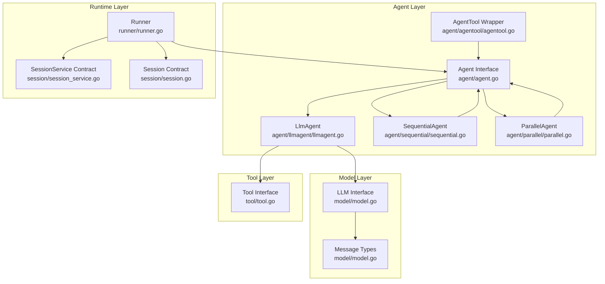
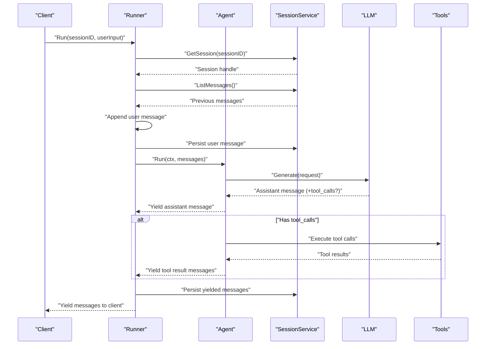
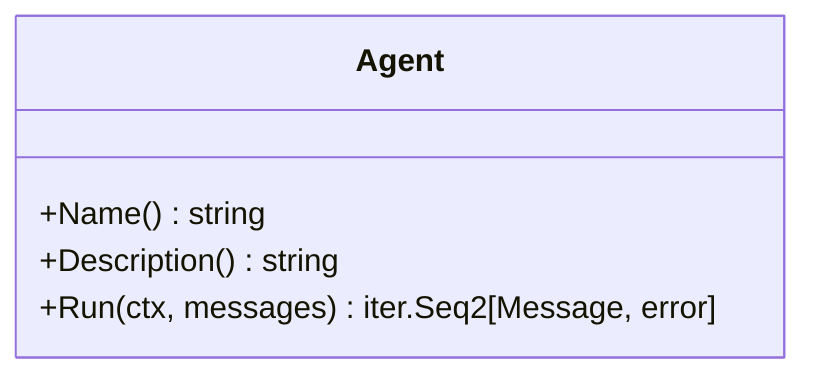
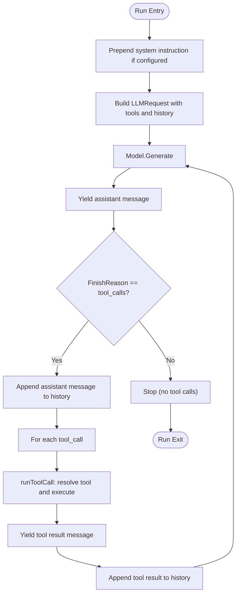
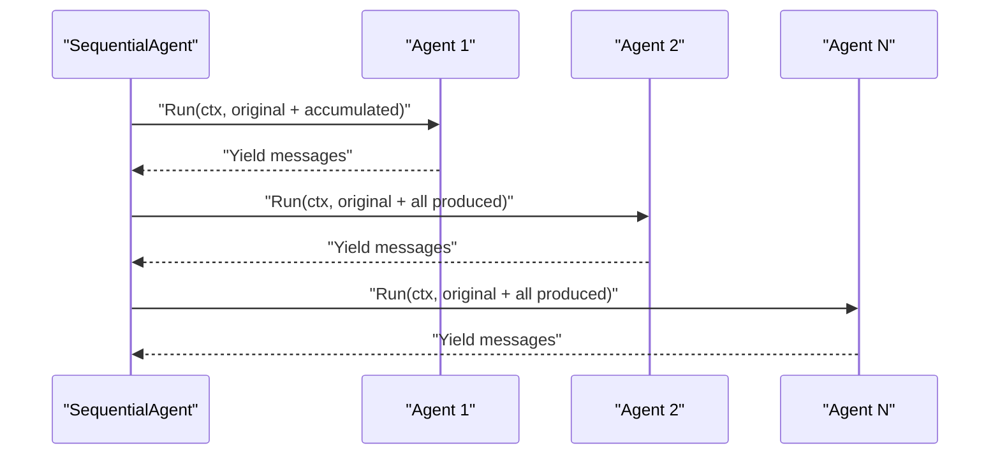
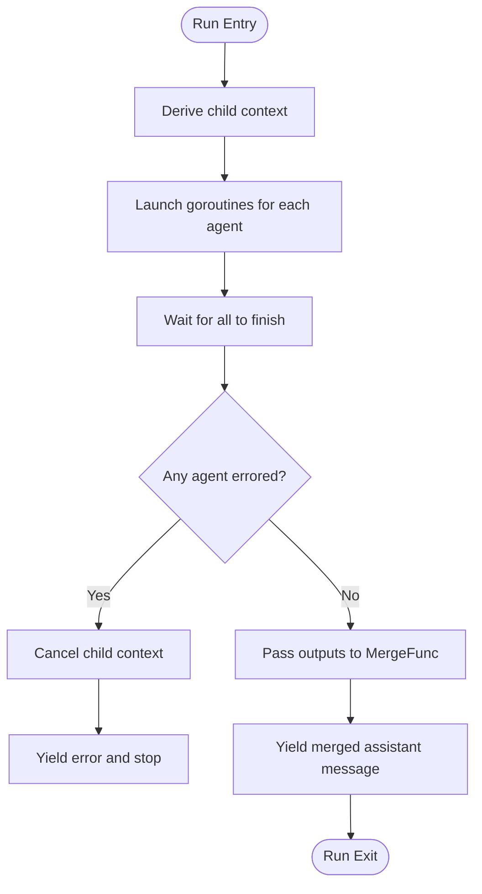
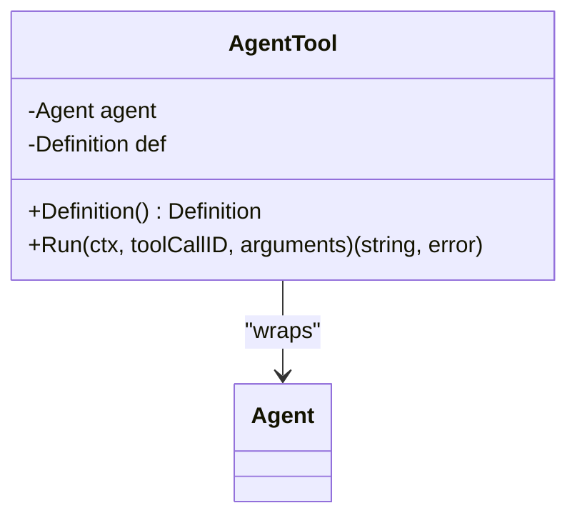
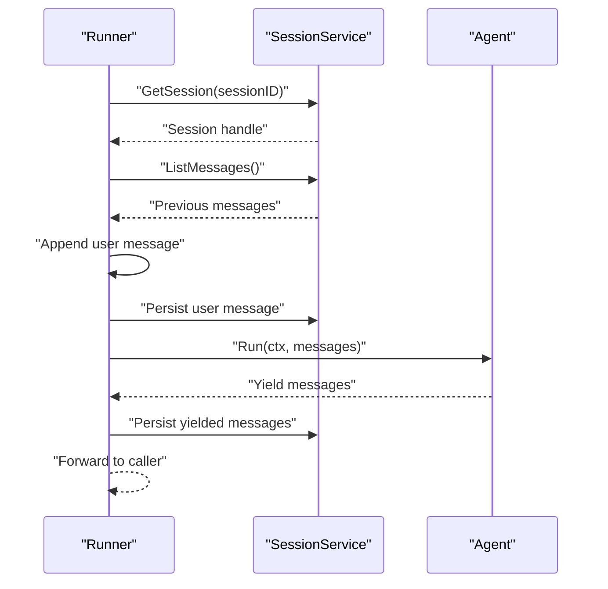
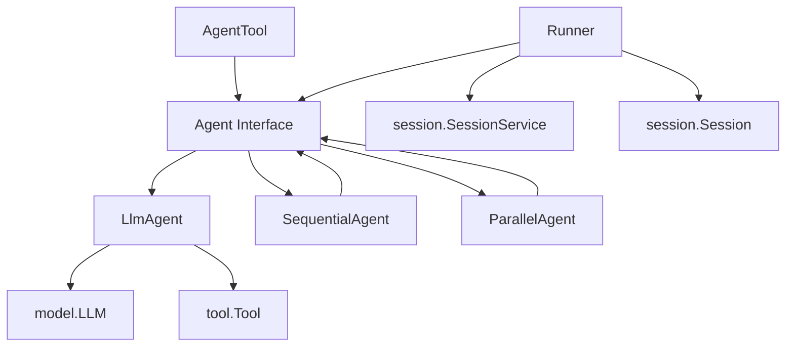

# Agent Architecture

<cite>
**Referenced Files in This Document**
- [agent.go](file://agent/agent.go)
- [llmagent.go](file://agent/llmagent/llmagent.go)
- [sequential.go](file://agent/sequential/sequential.go)
- [parallel.go](file://agent/parallel/parallel.go)
- [agentool.go](file://agent/agentool/agentool.go)
- [model.go](file://model/model.go)
- [tool.go](file://tool/tool.go)
- [runner.go](file://runner/runner.go)
- [session.go](file://session/session.go)
- [session_service.go](file://session/session_service.go)
- [main.go](file://examples/chat/main.go)
</cite>

## Table of Contents
1. [Introduction](#introduction)
2. [Project Structure](#project-structure)
3. [Core Components](#core-components)
4. [Architecture Overview](#architecture-overview)
5. [Detailed Component Analysis](#detailed-component-analysis)
6. [Dependency Analysis](#dependency-analysis)
7. [Performance Considerations](#performance-considerations)
8. [Troubleshooting Guide](#troubleshooting-guide)
9. [Conclusion](#conclusion)
10. [Appendices](#appendices)

## Introduction
This document explains the Agent Architecture in ADK with a focus on the core Agent interface design, streaming response patterns using Go iterators, and the stateless design principle. It documents the LlmAgent implementation as the primary agent type with automatic tool-call loops, the AgentTool wrapper for tool composition, and the Sequential and Parallel agent orchestration patterns. It also covers agent identification via Name() and Description(), the Run method’s iterator-based streaming approach, and practical examples showing agent creation, configuration, and execution. Finally, it addresses agent composition strategies, delegation patterns, and integration with the Runner for stateful coordination.

## Project Structure
The Agent Architecture spans several packages:
- agent: Defines the Agent interface and concrete implementations (LlmAgent, SequentialAgent, ParallelAgent).
- agentool: Wraps an Agent as a Tool for delegation and recursive orchestration.
- model: Provides provider-agnostic abstractions for LLMs, messages, tool calls, and generation configuration.
- tool: Defines the Tool interface and tool metadata used by LLMs.
- runner: Coordinates a stateless Agent with a SessionService to manage conversation state.
- session: Defines the session contract for loading and persisting messages.
- examples: Demonstrates practical usage with an LLM-backed agent and MCP tools.

**Diagram sources**
- [agent.go:10-17](file://agent/agent.go#L10-L17)
- [llmagent.go:25-41](file://agent/llmagent/llmagent.go#L25-L41)
- [sequential.go:18-41](file://agent/sequential/sequential.go#L18-L41)
- [parallel.go:70-101](file://agent/parallel/parallel.go#L70-L101)
- [agentool.go:16-48](file://agent/agentool/agentool.go#L16-L48)
- [model.go:9-23](file://model/model.go#L9-L23)
- [model.go:147-173](file://model/model.go#L147-L173)
- [tool.go:9-23](file://tool/tool.go#L9-L23)
- [runner.go:17-37](file://runner/runner.go#L17-L37)
- [session_service.go:5-9](file://session/session_service.go#L5-L9)
- [session.go:9-23](file://session/session.go#L9-L23)

**Section sources**
- [agent.go:10-17](file://agent/agent.go#L10-L17)
- [model.go:9-23](file://model/model.go#L9-L23)
- [tool.go:9-23](file://tool/tool.go#L9-L23)
- [runner.go:17-37](file://runner/runner.go#L17-L37)
- [session_service.go:5-9](file://session/session_service.go#L5-L9)
- [session.go:9-23](file://session/session.go#L9-L23)

## Core Components
- Agent interface: Defines Name(), Description(), and Run(ctx, messages) -> iter.Seq2[Message, error]. The Run method streams messages as they are produced, enabling incremental processing and early termination.
- LlmAgent: A stateless agent that drives an LLM through a tool-call loop. It prepends a system instruction when configured, generates assistant messages, and executes tool calls until the LLM stops or completes the loop.
- SequentialAgent: Runs a fixed list of agents sequentially, passing the original input plus all messages produced so far to each agent. It injects a handoff user message to ensure each agent sees a conversation ending with a user turn.
- ParallelAgent: Runs multiple agents concurrently with the same input, collecting their outputs and merging them into a single assistant message via a configurable MergeFunc. It cancels the shared context on the first error to stop sibling agents.
- AgentTool: Wraps an Agent as a Tool so it can be invoked by an orchestrator LlmAgent via the LLM’s native function-calling mechanism. It captures the agent’s final assistant text response and returns it as the tool result.
- Runner: Coordinates a stateless Agent with a SessionService. It loads conversation history, persists user input, streams agent outputs, and persists each yielded message back to the session.

**Section sources**
- [agent.go:10-17](file://agent/agent.go#L10-L17)
- [llmagent.go:25-105](file://agent/llmagent/llmagent.go#L25-L105)
- [sequential.go:18-89](file://agent/sequential/sequential.go#L18-L89)
- [parallel.go:70-168](file://agent/parallel/parallel.go#L70-L168)
- [agentool.go:16-79](file://agent/agentool/agentool.go#L16-L79)
- [runner.go:17-102](file://runner/runner.go#L17-L102)

## Architecture Overview
The Agent Architecture follows a stateless design: Agents do not maintain conversation state. Instead, the Runner manages session state by loading persisted messages, appending user input, invoking the Agent, and persisting each yielded message. This separation keeps Agents composable and reusable across different contexts.

**Diagram sources**
- [runner.go:39-90](file://runner/runner.go#L39-L90)
- [llmagent.go:51-105](file://agent/llmagent/llmagent.go#L51-L105)
- [model.go:183-200](file://model/model.go#L183-L200)
- [tool.go:17-23](file://tool/tool.go#L17-L23)

## Detailed Component Analysis

### Agent Interface Design
- Purpose: Provide a uniform contract for all agents, enabling composition and orchestration.
- Methods:
  - Name(): returns a human-readable agent name.
  - Description(): returns a human-readable description.
  - Run(ctx, messages): returns an iterator that yields Message and error pairs as the agent produces them.
- Streaming Pattern: The iterator allows clients to process messages incrementally, break early, and handle errors gracefully.

**Diagram sources**
- [agent.go:10-17](file://agent/agent.go#L10-L17)

**Section sources**
- [agent.go:10-17](file://agent/agent.go#L10-L17)

### LlmAgent Implementation
- Stateless Design: Maintains no conversation state; relies on Runner to load and persist messages.
- Configuration:
  - Name, Description: identification metadata.
  - Model: provider-agnostic LLM interface.
  - Tools: list of tools exposed to the LLM.
  - Instruction: optional system instruction prepended to every Run.
  - GenerateConfig: optional generation parameters.
- Tool-Call Loop:
  - Prepends system instruction if configured.
  - Builds LLMRequest with current history and tools.
  - Calls Model.Generate and yields the assistant message.
  - If FinishReason indicates tool_calls, executes each tool call and yields tool results.
  - Continues until the LLM produces a stop response.
- runToolCall:
  - Resolves tool by name.
  - Executes tool.Run and returns a RoleTool message with ToolCallID.

**Diagram sources**
- [llmagent.go:51-105](file://agent/llmagent/llmagent.go#L51-L105)
- [llmagent.go:107-127](file://agent/llmagent/llmagent.go#L107-L127)
- [model.go:183-200](file://model/model.go#L183-L200)

**Section sources**
- [llmagent.go:13-41](file://agent/llmagent/llmagent.go#L13-L41)
- [llmagent.go:25-105](file://agent/llmagent/llmagent.go#L25-L105)
- [llmagent.go:107-127](file://agent/llmagent/llmagent.go#L107-L127)

### Sequential Agent Orchestration
- Purpose: Execute a fixed list of agents in order, passing the original input plus all messages produced so far to each agent.
- Behavior:
  - For each agent, builds input as original messages + accumulated context.
  - Injects a handoff user message after the first agent to ensure each agent sees a conversation ending with a user turn.
  - Yields every message produced by each agent in order.
  - Accumulates messages for subsequent agents.

**Diagram sources**
- [sequential.go:46-89](file://agent/sequential/sequential.go#L46-L89)

**Section sources**
- [sequential.go:11-41](file://agent/sequential/sequential.go#L11-L41)
- [sequential.go:46-89](file://agent/sequential/sequential.go#L46-L89)

### Parallel Agent Orchestration
- Purpose: Run multiple agents concurrently with the same input, merge their outputs into a single assistant message.
- Behavior:
  - Derives a child context; launches each agent in a goroutine.
  - Collects each agent’s produced messages and stores them with the agent’s Name().
  - On any agent error, cancels the shared context to stop sibling agents.
  - Passes all outputs to MergeFunc (defaults to DefaultMergeFunc) and yields the merged message.
- DefaultMergeFunc:
  - Extracts the last non-empty assistant text from each agent.
  - Formats each agent’s final assistant text with an attribution header.
  - Joins them into a single assistant message.

**Diagram sources**
- [parallel.go:112-168](file://agent/parallel/parallel.go#L112-L168)
- [parallel.go:43-68](file://agent/parallel/parallel.go#L43-L68)

**Section sources**
- [parallel.go:29-101](file://agent/parallel/parallel.go#L29-L101)
- [parallel.go:112-168](file://agent/parallel/parallel.go#L112-L168)
- [parallel.go:43-68](file://agent/parallel/parallel.go#L43-L68)

### AgentTool Wrapper for Tool Composition
- Purpose: Wrap an Agent as a Tool so it can be invoked by an orchestrator LLM via the LLM’s native function-calling mechanism.
- Behavior:
  - Uses the wrapped Agent’s Name() and Description() as the tool’s metadata.
  - Defines an input schema requiring a single task string.
  - On invocation, runs the Agent with a single user message containing the task.
  - Captures the agent’s final assistant text response and returns it as the tool result string.
  - Silently consumes intermediate messages (tool calls, tool results).

**Diagram sources**
- [agentool.go:16-48](file://agent/agentool/agentool.go#L16-L48)
- [agentool.go:54-79](file://agent/agentool/agentool.go#L54-L79)

**Section sources**
- [agentool.go:16-48](file://agent/agentool/agentool.go#L16-L48)
- [agentool.go:54-79](file://agent/agentool/agentool.go#L54-L79)

### Runner Integration and State Management
- Purpose: Coordinate a stateless Agent with a SessionService to manage conversation state.
- Responsibilities:
  - Loads session history and appends the incoming user message.
  - Invokes Agent.Run and persists each yielded message back to the session.
  - Assigns snowflake IDs and timestamps to persisted messages.
- Interaction:
  - Runner.Run loads messages, persists user input, streams agent outputs, and persists each yielded message.
  - The Agent remains stateless; the Runner maintains session continuity.

**Diagram sources**
- [runner.go:39-90](file://runner/runner.go#L39-L90)

**Section sources**
- [runner.go:17-102](file://runner/runner.go#L17-L102)
- [session_service.go:5-9](file://session/session_service.go#L5-L9)
- [session.go:9-23](file://session/session.go#L9-L23)

## Dependency Analysis
- Agent depends on:
  - model.LLM for generation.
  - tool.Tool for tool invocation.
  - model.Message for streaming messages.
- LlmAgent depends on:
  - model.LLM and model.LLMRequest/LLMResponse.
  - tool.Tool for executing tool calls.
- SequentialAgent depends on:
  - agent.Agent for composing pipelines.
  - model.Message for accumulating context.
- ParallelAgent depends on:
  - agent.Agent for concurrent execution.
  - MergeFunc for consolidating outputs.
- AgentTool depends on:
  - agent.Agent for delegation.
  - tool.Tool for tool metadata and JSON schema.
- Runner depends on:
  - agent.Agent for stateless execution.
  - session.SessionService and session.Session for persistence.

**Diagram sources**
- [agent.go:10-17](file://agent/agent.go#L10-L17)
- [llmagent.go:25-105](file://agent/llmagent/llmagent.go#L25-L105)
- [sequential.go:18-89](file://agent/sequential/sequential.go#L18-L89)
- [parallel.go:70-168](file://agent/parallel/parallel.go#L70-L168)
- [agentool.go:16-79](file://agent/agentool/agentool.go#L16-L79)
- [runner.go:17-102](file://runner/runner.go#L17-L102)
- [session_service.go:5-9](file://session/session_service.go#L5-L9)
- [session.go:9-23](file://session/session.go#L9-L23)

**Section sources**
- [agent.go:10-17](file://agent/agent.go#L10-L17)
- [llmagent.go:25-105](file://agent/llmagent/llmagent.go#L25-L105)
- [sequential.go:18-89](file://agent/sequential/sequential.go#L18-L89)
- [parallel.go:70-168](file://agent/parallel/parallel.go#L70-L168)
- [agentool.go:16-79](file://agent/agentool/agentool.go#L16-L79)
- [runner.go:17-102](file://runner/runner.go#L17-L102)
- [session_service.go:5-9](file://session/session_service.go#L5-L9)
- [session.go:9-23](file://session/session.go#L9-L23)

## Performance Considerations
- Streaming with iterators: Enables low-latency processing and early termination. Clients can break out of the iteration loop when sufficient output is received.
- Concurrency in ParallelAgent: Running agents concurrently can reduce total latency for multi-agent pipelines. Use MergeFunc to consolidate outputs efficiently.
- Tool-call loops: Each tool call incurs an additional round-trip; batch related tasks or minimize tool calls to reduce overhead.
- Session persistence: Persisting each yielded message ensures durability but adds I/O overhead. Consider batching writes or using efficient storage backends.
- Memory usage: SequentialAgent accumulates all messages for subsequent agents; for long histories, consider pruning or using compacted sessions.

[No sources needed since this section provides general guidance]

## Troubleshooting Guide
- Agent does not appear in tool list:
  - Ensure the AgentTool wrapper is constructed with the Agent and that the Agent’s Name() and Description() are set.
- Tool not found during tool-call loop:
  - Verify tool names match the tool.Definition().Name used by the LLM.
- Early termination or missing tool results:
  - Confirm that the Agent’s Run loop continues until FinishReason indicates stop, not tool_calls.
- ParallelAgent stalls:
  - Check for errors in any agent; the shared context is cancelled on the first error to stop siblings.
- Session persistence failures:
  - Validate session creation and message creation calls; ensure snowflake IDs and timestamps are assigned.

**Section sources**
- [agentool.go:29-48](file://agent/agentool/agentool.go#L29-L48)
- [llmagent.go:107-127](file://agent/llmagent/llmagent.go#L107-L127)
- [parallel.go:119-121](file://agent/parallel/parallel.go#L119-L121)
- [runner.go:92-102](file://runner/runner.go#L92-L102)

## Conclusion
ADK’s Agent Architecture emphasizes composability and statelessness. Agents expose a simple, streaming interface, enabling flexible orchestration via SequentialAgent and ParallelAgent. The Runner integrates stateful session management with stateless Agents, allowing incremental processing and robust persistence. LlmAgent provides a powerful, automatic tool-call loop, while AgentTool enables recursive delegation. Together, these components support practical patterns for research-assistant chat, multi-step pipelines, and multi-model comparisons.

[No sources needed since this section summarizes without analyzing specific files]

## Appendices

### Practical Examples and Patterns
- Creating and configuring an LlmAgent with tools:
  - Construct an LLM client and tool set.
  - Build an llmagent.Config with Name, Description, Model, Tools, and Instruction.
  - Call llmagent.New to create the agent.
- Using Runner for stateful coordination:
  - Initialize a SessionService and create a session.
  - Create a Runner with the Agent and SessionService.
  - Iterate over Runner.Run to stream messages and persist them.
- Delegation patterns:
  - Wrap an Agent as a Tool using AgentTool to enable recursive orchestration.
  - Use SequentialAgent to chain multiple agents for multi-step workflows.
  - Use ParallelAgent to compare outputs from multiple agents or models.

**Section sources**
- [main.go:101-124](file://examples/chat/main.go#L101-L124)
- [main.go:119-124](file://examples/chat/main.go#L119-L124)
- [main.go:142-167](file://examples/chat/main.go#L142-L167)
- [agentool.go:29-48](file://agent/agentool/agentool.go#L29-L48)
- [sequential.go:34-41](file://agent/sequential/sequential.go#L34-L41)
- [parallel.go:90-101](file://agent/parallel/parallel.go#L90-L101)