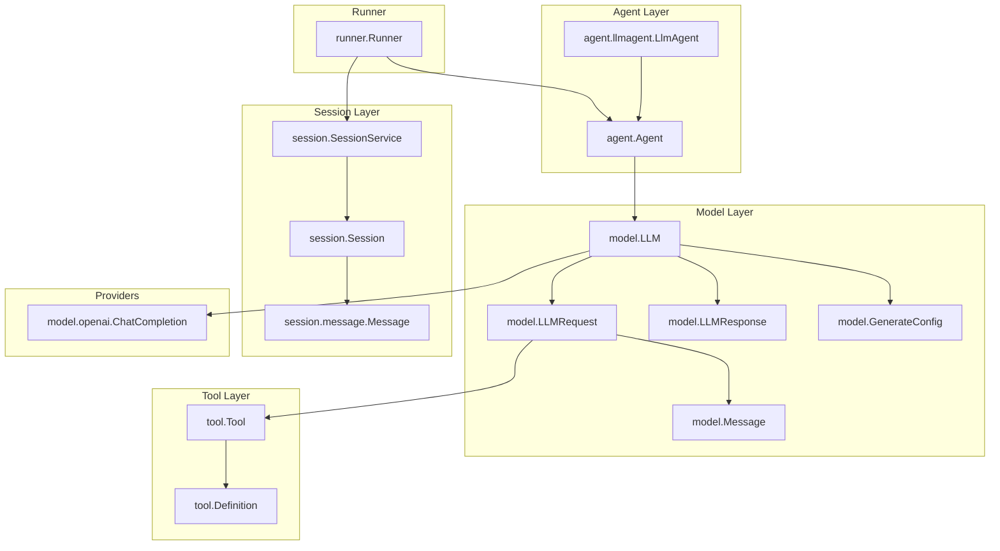
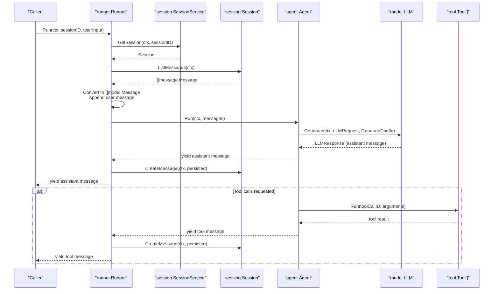
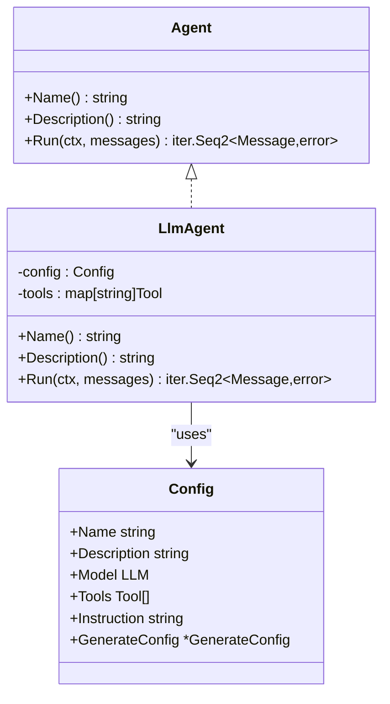
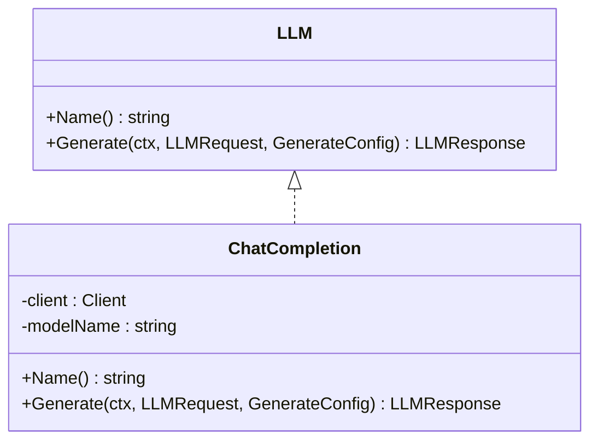
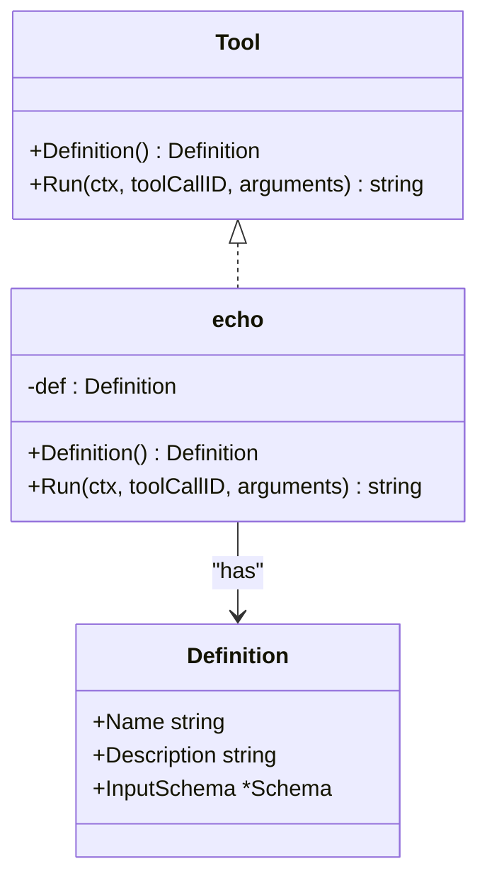
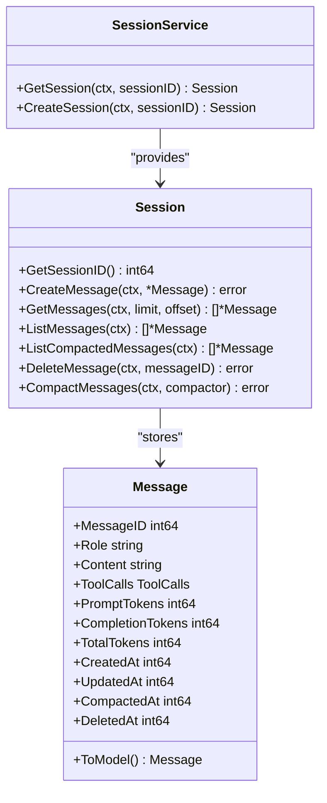
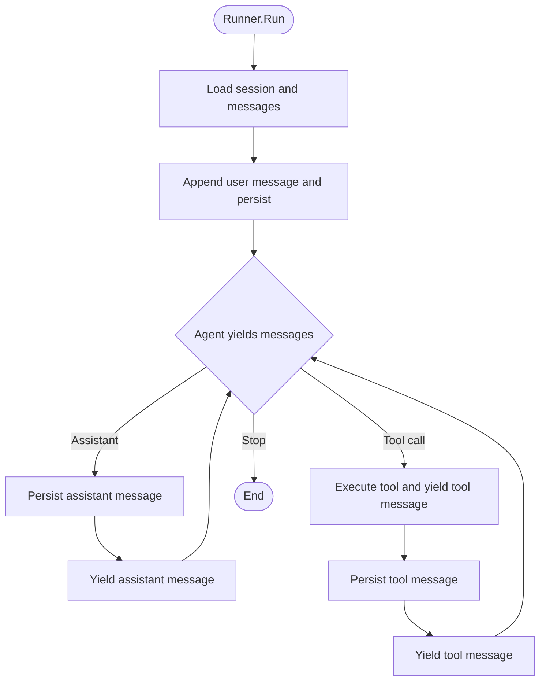
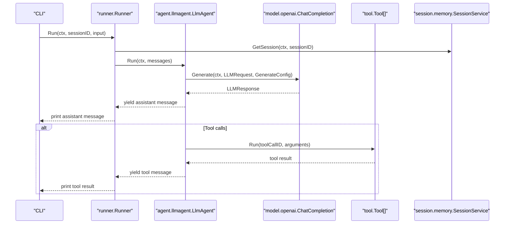
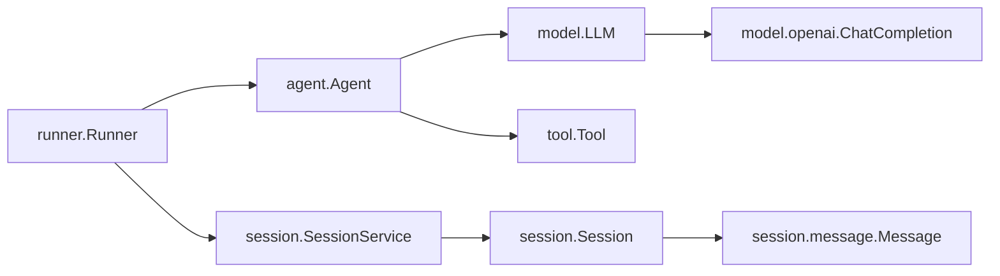

# Core Concepts

<cite>
**Referenced Files in This Document**
- [README.md](file://README.md)
- [agent.go](file://agent/agent.go)
- [llmagent.go](file://agent/llmagent/llmagent.go)
- [model.go](file://model/model.go)
- [openai.go](file://model/openai/openai.go)
- [tool.go](file://tool/tool.go)
- [echo.go](file://tool/builtin/echo.go)
- [runner.go](file://runner/runner.go)
- [session.go](file://session/session.go)
- [message.go](file://session/message/message.go)
- [memory_session.go](file://session/memory/session.go)
- [main.go](file://examples/chat/main.go)
</cite>

## Table of Contents
1. [Introduction](#introduction)
2. [Project Structure](#project-structure)
3. [Core Components](#core-components)
4. [Architecture Overview](#architecture-overview)
5. [Detailed Component Analysis](#detailed-component-analysis)
6. [Dependency Analysis](#dependency-analysis)
7. [Performance Considerations](#performance-considerations)
8. [Troubleshooting Guide](#troubleshooting-guide)
9. [Conclusion](#conclusion)

## Introduction
This document explains the core architectural concepts of the Agent Development Kit (ADK). It focuses on the Agent interface, LLM provider abstraction, Tool system design, and Session management. It documents the stateless vs stateful design principle (Runner owns session state while Agents remain stateless), the message flow architecture, streaming response patterns using Go iterators, and the provider-agnostic design approach. It also covers key data structures (model.Message, tool.Definition, and session management patterns), separation of concerns, dependency injection patterns, and extensibility points.

## Project Structure
ADK is organized around four primary domains:
- Agent: Defines the Agent interface and stateless agent implementations.
- Model: Provides provider-agnostic LLM interfaces and shared data structures.
- Tool: Defines the Tool interface and tool definitions.
- Session: Defines session and message abstractions and provides in-memory and persistent backends.
- Runner: Orchestrates Agent execution against a SessionService and streams results.

**Diagram sources**
- [agent.go:10-17](file://agent/agent.go#L10-L17)
- [llmagent.go:25-41](file://agent/llmagent/llmagent.go#L25-L41)
- [model.go:9-13](file://model/model.go#L9-L13)
- [model.go:147-199](file://model/model.go#L147-L199)
- [tool.go:17-23](file://tool/tool.go#L17-L23)
- [session.go:9-23](file://session/session.go#L9-L23)
- [message.go:49-73](file://session/message/message.go#L49-L73)
- [runner.go:17-24](file://runner/runner.go#L17-L24)
- [openai.go:17-35](file://model/openai/openai.go#L17-L35)

**Section sources**
- [README.md:65-82](file://README.md#L65-L82)

## Core Components
This section introduces the foundational interfaces and data structures that define ADK’s design.

- Agent interface
  - Stateless contract for agents to produce a stream of model.Message items.
  - Implemented by LlmAgent, enabling automatic tool-call loops.

- LLM provider abstraction
  - model.LLM defines a provider-agnostic interface with Name and Generate.
  - model.GenerateConfig encapsulates generation parameters in a provider-agnostic way.

- Tool system design
  - tool.Tool exposes Definition and Run.
  - tool.Definition carries tool metadata and JSON Schema for inputs.

- Session management
  - session.Session and session.SessionService manage message history and compaction.
  - session.message.Message is the persisted representation with conversion helpers.

- Runner orchestration
  - runner.Runner wires Agent and SessionService, loading history, appending user input, and streaming produced messages.

**Section sources**
- [agent.go:10-17](file://agent/agent.go#L10-L17)
- [model.go:9-79](file://model/model.go#L9-L79)
- [tool.go:9-23](file://tool/tool.go#L9-L23)
- [session.go:9-23](file://session/session.go#L9-L23)
- [message.go:49-128](file://session/message/message.go#L49-L128)
- [runner.go:17-101](file://runner/runner.go#L17-L101)

## Architecture Overview
ADK follows a strict separation of concerns:
- Runner is stateful and owns session state; it loads and persists messages and orchestrates Agent execution.
- Agent is stateless; it receives the current conversation and yields messages without retaining prior turns.
- LLM providers implement model.LLM; tool integrations implement tool.Tool; both are injected into Agent and Tool layers respectively.

**Diagram sources**
- [runner.go:44-90](file://runner/runner.go#L44-L90)
- [llmagent.go:54-105](file://agent/llmagent/llmagent.go#L54-L105)
- [model.go:183-199](file://model/model.go#L183-L199)
- [openai.go:42-76](file://model/openai/openai.go#L42-L76)
- [tool.go:17-23](file://tool/tool.go#L17-L23)

## Detailed Component Analysis

### Agent Interface and LlmAgent
- Agent interface
  - Contract: Name(), Description(), Run(ctx, messages) -> iter.Seq2[model.Message, error].
  - Enables streaming output and incremental processing.

- LlmAgent
  - Stateless agent that:
    - Prepends a system instruction when configured.
    - Builds model.LLMRequest with model, messages, and tools.
    - Calls model.LLM.Generate in a loop.
    - Yields assistant messages and attaches token usage.
    - Executes tool calls and yields tool results; continues until stop.

**Diagram sources**
- [agent.go:10-17](file://agent/agent.go#L10-L17)
- [llmagent.go:13-41](file://agent/llmagent/llmagent.go#L13-L41)

**Section sources**
- [agent.go:10-17](file://agent/agent.go#L10-L17)
- [llmagent.go:25-105](file://agent/llmagent/llmagent.go#L25-L105)

### LLM Provider Abstraction (OpenAI Adapter)
- model.LLM
  - Name(): returns model identifier.
  - Generate(ctx, *LLMRequest, *GenerateConfig): returns *LLMResponse.

- OpenAI adapter
  - Implements model.LLM using the OpenAI Chat Completions API.
  - Converts between model.Message and OpenAI message structures.
  - Applies provider-agnostic GenerateConfig to request parameters.
  - Extracts FinishReason and token usage, and supports reasoning content extraction.

**Diagram sources**
- [model.go:9-13](file://model/model.go#L9-L13)
- [openai.go:17-76](file://model/openai/openai.go#L17-L76)

**Section sources**
- [model.go:9-79](file://model/model.go#L9-L79)
- [openai.go:17-274](file://model/openai/openai.go#L17-L274)

### Tool System Design
- tool.Tool
  - Definition(): returns tool.Definition (name, description, JSON Schema).
  - Run(ctx, toolCallID, arguments): executes tool and returns result string.

- tool.Definition
  - Carries tool metadata and JSON Schema for input validation.

- Example: Echo tool
  - Demonstrates building a JSON Schema for tool inputs and returning the argument content.

**Diagram sources**
- [tool.go:17-23](file://tool/tool.go#L17-L23)
- [echo.go:14-47](file://tool/builtin/echo.go#L14-L47)

**Section sources**
- [tool.go:9-23](file://tool/tool.go#L9-L23)
- [echo.go:14-47](file://tool/builtin/echo.go#L14-L47)

### Session Management Patterns
- session.Session
  - Methods to load, paginate, list, compact, delete messages, and track compaction/deletion timestamps.

- session.SessionService
  - Manages sessions and delegates to a concrete session implementation.

- session.message.Message
  - Persisted representation with JSON serialization for tool calls and token usage.
  - Conversion helpers: ToModel() and FromModel() to bridge persisted and runtime messages.

- In-memory backend
  - Simple in-memory storage with compaction support.

**Diagram sources**
- [session.go:9-23](file://session/session.go#L9-L23)
- [message.go:49-128](file://session/message/message.go#L49-L128)
- [memory_session.go:12-85](file://session/memory/session.go#L12-L85)

**Section sources**
- [session.go:9-23](file://session/session.go#L9-L23)
- [message.go:49-128](file://session/message/message.go#L49-L128)
- [memory_session.go:12-85](file://session/memory/session.go#L12-L85)

### Runner Orchestration and Streaming
- Runner
  - Holds agent, session service, and a snowflake node for IDs.
  - Run(ctx, sessionID, userInput) returns an iter.Seq2[model.Message, error] for streaming.
  - Loads session history, appends user input, persists it, runs agent, persists yielded messages, and yields them to the caller.

- Message persistence
  - Assigns snowflake IDs and timestamps, then saves via session service.

**Diagram sources**
- [runner.go:44-101](file://runner/runner.go#L44-L101)

**Section sources**
- [runner.go:17-101](file://runner/runner.go#L17-L101)

### Practical Example: Chat Loop
- The example demonstrates:
  - Creating an OpenAI LLM adapter.
  - Loading MCP tools and building an LlmAgent with tools and instruction.
  - Creating a memory session service and a Runner.
  - Running a chat loop that streams assistant messages and tool results.

**Diagram sources**
- [main.go:52-173](file://examples/chat/main.go#L52-L173)
- [runner.go:44-90](file://runner/runner.go#L44-L90)
- [llmagent.go:54-105](file://agent/llmagent/llmagent.go#L54-L105)
- [openai.go:42-76](file://model/openai/openai.go#L42-L76)

**Section sources**
- [main.go:52-173](file://examples/chat/main.go#L52-L173)

## Dependency Analysis
ADK emphasizes loose coupling and dependency injection:
- Agents depend on model.LLM and tool.Tool; they do not depend on session storage.
- Runner depends on Agent and SessionService; it manages stateful persistence.
- Providers implement model.LLM; tools implement tool.Tool; both are injected into higher-level components.
- Session backends implement session.Session; SessionService abstracts creation and retrieval.

**Diagram sources**
- [agent.go:10-17](file://agent/agent.go#L10-L17)
- [runner.go:17-37](file://runner/runner.go#L17-L37)
- [session.go:9-23](file://session/session.go#L9-L23)
- [message.go:49-73](file://session/message/message.go#L49-L73)
- [openai.go:17-35](file://model/openai/openai.go#L17-L35)

**Section sources**
- [agent.go:10-17](file://agent/agent.go#L10-L17)
- [runner.go:17-37](file://runner/runner.go#L17-L37)
- [session.go:9-23](file://session/session.go#L9-L23)
- [message.go:49-73](file://session/message/message.go#L49-L73)
- [openai.go:17-35](file://model/openai/openai.go#L17-L35)

## Performance Considerations
- Streaming via Go iterators
  - The Agent interface returns iter.Seq2[model.Message, error], enabling incremental rendering and reduced latency.
- Minimal copying
  - LlmAgent builds a small initial history slice and appends messages as needed; consider pre-sizing when appropriate.
- Token usage propagation
  - Assistant messages carry usage; persisting them avoids recomputation and aids cost monitoring.
- Compaction
  - Soft archiving of old messages reduces query overhead while preserving historical context.

[No sources needed since this section provides general guidance]

## Troubleshooting Guide
- Provider conversion errors
  - OpenAI adapter validates message roles and content parts; ensure model.Message fields align with expected types.
- Tool schema mismatches
  - Verify tool.Definition.InputSchema matches the tool’s expected arguments; mismatches cause parsing errors.
- Session persistence failures
  - Confirm session service is initialized and sessions are created before running.
- Streaming interruptions
  - Iterators terminate when the Agent yields an error; handle and log errors from runner.Run.

**Section sources**
- [openai.go:78-155](file://model/openai/openai.go#L78-L155)
- [openai.go:157-189](file://model/openai/openai.go#L157-L189)
- [openai.go:218-257](file://model/openai/openai.go#L218-L257)
- [tool.go:17-23](file://tool/tool.go#L17-L23)
- [runner.go:44-90](file://runner/runner.go#L44-L90)

## Conclusion
ADK’s core design centers on a provider-agnostic LLM interface, a stateless Agent that yields messages via Go iterators, and a stateful Runner that manages session persistence. The Tool system is decoupled and schema-driven, while Session backends offer flexible persistence strategies. This separation of concerns, combined with dependency injection and streaming, yields a modular, extensible, and efficient foundation for building AI agents.