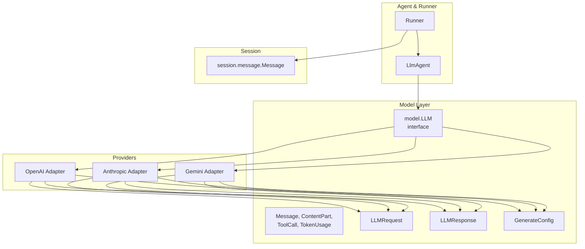
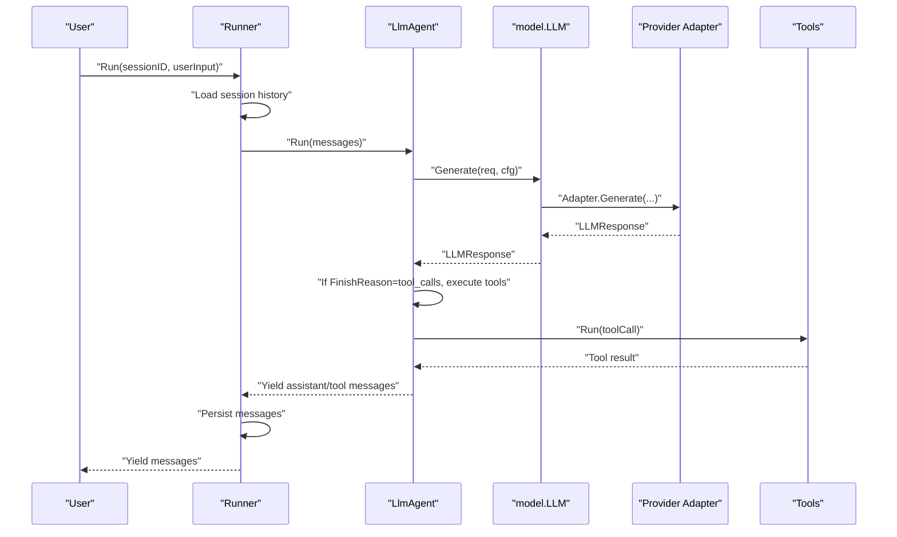
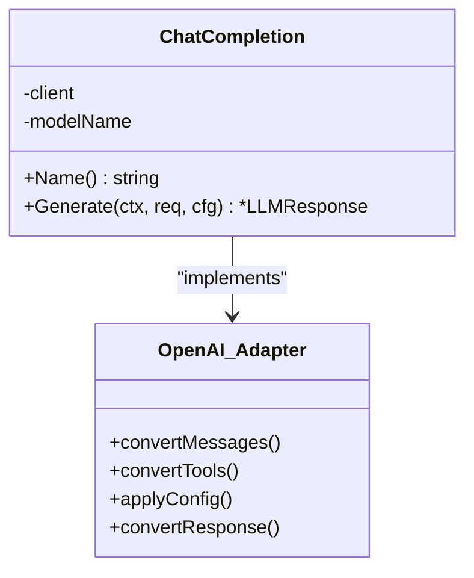
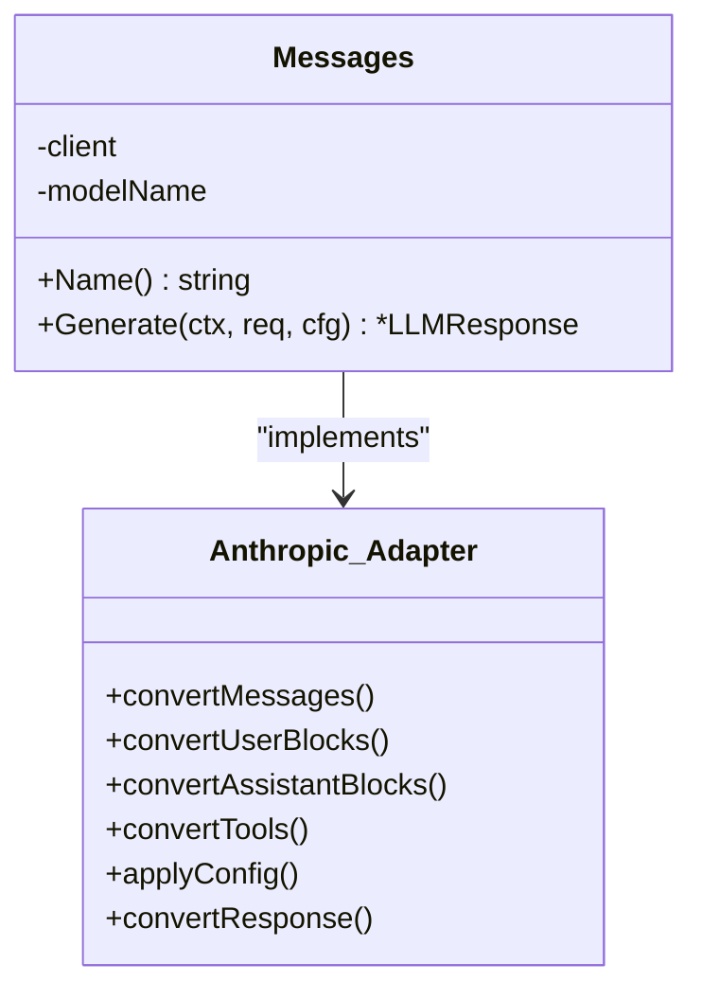
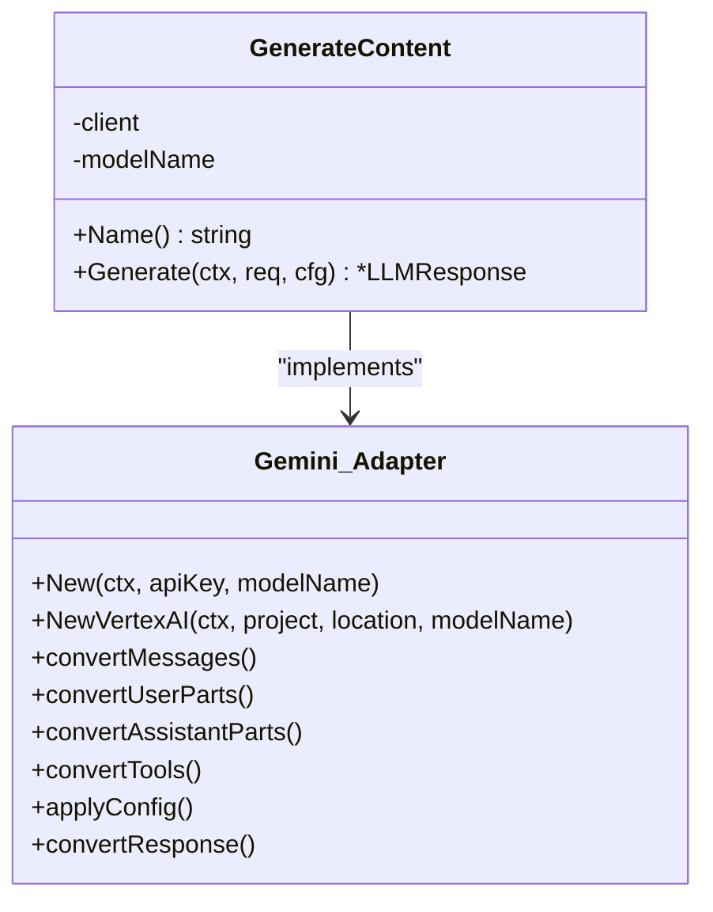
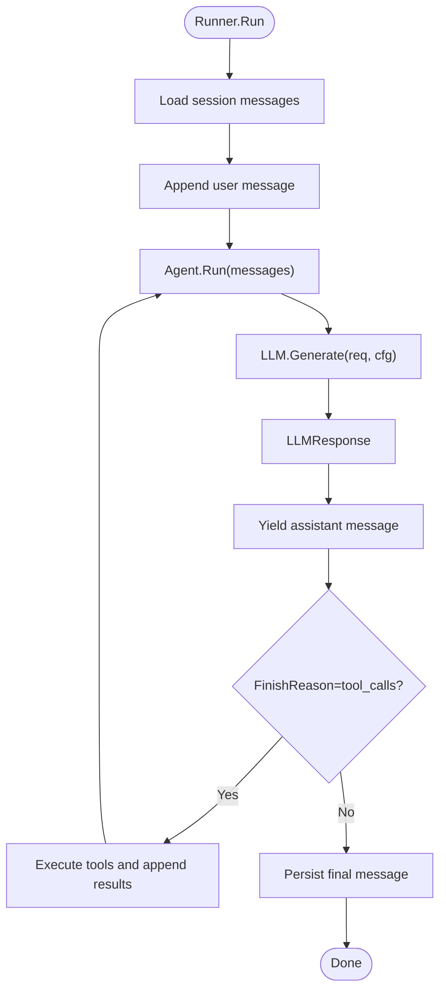
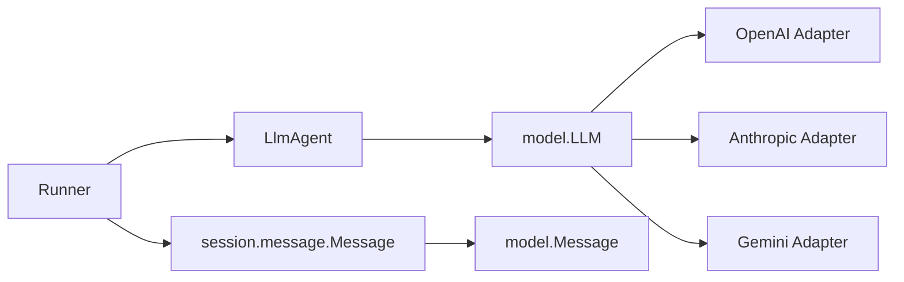

# LLM Provider Abstraction

<cite>
**Referenced Files in This Document**
- [README.md](file://README.md)
- [model/model.go](file://model/model.go)
- [model/openai/openai.go](file://model/openai/openai.go)
- [model/anthropic/anthropic.go](file://model/anthropic/anthropic.go)
- [model/gemini/gemini.go](file://model/gemini/gemini.go)
- [session/message/message.go](file://session/message/message.go)
- [agent/llmagent/llmagent.go](file://agent/llmagent/llmagent.go)
- [runner/runner.go](file://runner/runner.go)
- [examples/chat/main.go](file://examples/chat/main.go)
</cite>

## Table of Contents
1. [Introduction](#introduction)
2. [Project Structure](#project-structure)
3. [Core Components](#core-components)
4. [Architecture Overview](#architecture-overview)
5. [Detailed Component Analysis](#detailed-component-analysis)
6. [Dependency Analysis](#dependency-analysis)
7. [Performance Considerations](#performance-considerations)
8. [Troubleshooting Guide](#troubleshooting-guide)
9. [Conclusion](#conclusion)
10. [Appendices](#appendices)

## Introduction
This document explains ADK’s LLM Provider Abstraction: a provider-agnostic interface that enables seamless switching among OpenAI, Gemini, and Anthropic models. It covers the Message structure, LLMRequest and LLMResponse types, generation configuration options, and how each provider adapter implements the common interface while handling provider-specific features such as tool support, reasoning capabilities, and multi-modal processing. It also documents authentication setup, API client configuration, response normalization across providers, practical examples for provider selection and migration, and best practices and performance considerations.

## Project Structure
ADK organizes the LLM abstraction under a dedicated model package with provider-specific adapters. Agents consume the unified interface, while runners coordinate sessions and message persistence.

**Diagram sources**
- [model/model.go:10-205](file://model/model.go#L10-L205)
- [model/openai/openai.go:17-76](file://model/openai/openai.go#L17-L76)
- [model/anthropic/anthropic.go:24-84](file://model/anthropic/anthropic.go#L24-L84)
- [model/gemini/gemini.go:16-96](file://model/gemini/gemini.go#L16-L96)
- [agent/llmagent/llmagent.go:25-105](file://agent/llmagent/llmagent.go#L25-L105)
- [runner/runner.go:17-90](file://runner/runner.go#L17-L90)
- [session/message/message.go:49-129](file://session/message/message.go#L49-L129)

**Section sources**
- [README.md:65-82](file://README.md#L65-L82)
- [model/model.go:10-205](file://model/model.go#L10-L205)

## Core Components
- Provider-agnostic LLM interface: Defines Name and Generate methods for all adapters.
- Message and multi-modal content: Role, Content, Parts, ReasoningContent, ToolCalls, ToolCallID, Usage.
- Request and response: LLMRequest carries Model, Messages, and Tools; LLMResponse carries Message, FinishReason, and Usage.
- Generation configuration: Temperature, ReasoningEffort, ServiceTier, MaxTokens, ThinkingBudget, EnableThinking.
- Tool integration: Tools are described via JSON Schema and invoked by the agent loop.

**Section sources**
- [model/model.go:10-205](file://model/model.go#L10-L205)
- [agent/llmagent/llmagent.go:13-105](file://agent/llmagent/llmagent.go#L13-L105)

## Architecture Overview
The system separates concerns: Runner manages session persistence and orchestrates turns; Agent consumes the unified LLM interface and runs a tool-call loop; Adapters normalize provider-specific APIs into the common types.

**Diagram sources**
- [runner/runner.go:44-90](file://runner/runner.go#L44-L90)
- [agent/llmagent/llmagent.go:54-105](file://agent/llmagent/llmagent.go#L54-L105)
- [model/model.go:10-18](file://model/model.go#L10-L18)
- [model/openai/openai.go:42-76](file://model/openai/openai.go#L42-L76)
- [model/anthropic/anthropic.go:46-84](file://model/anthropic/anthropic.go#L46-L84)
- [model/gemini/gemini.go:65-96](file://model/gemini/gemini.go#L65-L96)

## Detailed Component Analysis

### Unified LLM Interface and Types
- LLM interface: Name and Generate methods define the contract for all adapters.
- Roles and finish reasons: Standardized enumerations for interoperability.
- GenerateConfig: Cross-provider tuning knobs for temperature, reasoning, tiers, and token limits.
- ContentPart: Multi-modal content (text, image URL, base64) with image detail control.
- ToolCall: Structured tool invocation with ThoughtSignature for providers that support it.
- TokenUsage: Aggregated token counts for prompt, completion, and total.
- Message: Conversation unit with roles, content, multi-modal parts, reasoning content, tool calls, and usage.
- LLMRequest and LLMResponse: Provider-agnostic request/response envelopes.

**Section sources**
- [model/model.go:10-205](file://model/model.go#L10-L205)

### OpenAI Adapter
- Client creation: Supports API key and optional base URL for OpenAI-compatible endpoints.
- Message conversion: Maps system/user/assistant/tool roles to OpenAI message unions; supports multi-part user messages with text and images.
- Tool integration: Converts tool definitions to function tools with JSON schema.
- Configuration mapping: Applies temperature, reasoning effort, service tier, and enable_thinking toggles.
- Response normalization: Extracts assistant content, tool calls, reasoning content, finish reason, and usage.

**Diagram sources**
- [model/openai/openai.go:17-76](file://model/openai/openai.go#L17-L76)
- [model/openai/openai.go:78-155](file://model/openai/openai.go#L78-L155)
- [model/openai/openai.go:157-189](file://model/openai/openai.go#L157-L189)
- [model/openai/openai.go:191-216](file://model/openai/openai.go#L191-L216)
- [model/openai/openai.go:218-273](file://model/openai/openai.go#L218-L273)

**Section sources**
- [model/openai/openai.go:23-35](file://model/openai/openai.go#L23-L35)
- [model/openai/openai.go:78-155](file://model/openai/openai.go#L78-L155)
- [model/openai/openai.go:157-189](file://model/openai/openai.go#L157-L189)
- [model/openai/openai.go:191-216](file://model/openai/openai.go#L191-L216)
- [model/openai/openai.go:218-273](file://model/openai/openai.go#L218-L273)

### Anthropic Adapter
- Client creation: Requires API key; uses Messages API.
- Message conversion: Extracts system instructions, batches tool results, and maps roles to content blocks; supports images via URL or base64.
- Tool integration: Converts tool definitions to function tools with JSON schema.
- Configuration mapping: Uses EnableThinking with a thinking budget; temperature supported.
- Response normalization: Aggregates text and thinking parts; maps stop reasons; collects tool calls.

**Diagram sources**
- [model/anthropic/anthropic.go:24-84](file://model/anthropic/anthropic.go#L24-L84)
- [model/anthropic/anthropic.go:86-138](file://model/anthropic/anthropic.go#L86-L138)
- [model/anthropic/anthropic.go:140-202](file://model/anthropic/anthropic.go#L140-L202)
- [model/anthropic/anthropic.go:204-231](file://model/anthropic/anthropic.go#L204-L231)
- [model/anthropic/anthropic.go:233-251](file://model/anthropic/anthropic.go#L233-L251)
- [model/anthropic/anthropic.go:253-317](file://model/anthropic/anthropic.go#L253-L317)

**Section sources**
- [model/anthropic/anthropic.go:30-39](file://model/anthropic/anthropic.go#L30-L39)
- [model/anthropic/anthropic.go:86-138](file://model/anthropic/anthropic.go#L86-L138)
- [model/anthropic/anthropic.go:140-202](file://model/anthropic/anthropic.go#L140-L202)
- [model/anthropic/anthropic.go:204-231](file://model/anthropic/anthropic.go#L204-L231)
- [model/anthropic/anthropic.go:233-251](file://model/anthropic/anthropic.go#L233-L251)
- [model/anthropic/anthropic.go:253-317](file://model/anthropic/anthropic.go#L253-L317)

### Gemini Adapter
- Client creation: Supports both Gemini API and Vertex AI backends; Vertex AI uses ADC by default.
- Message conversion: Extracts a single system instruction and batches tool results; supports images via URL or base64.
- Tool integration: Converts tool definitions to FunctionDeclarations with JSON schema via ParametersJsonSchema.
- Configuration mapping: Maps ReasoningEffort and EnableThinking to ThinkingConfig; temperature and max output tokens supported.
- Response normalization: Collects text and thought parts; promotes FunctionCall parts to ToolCalls; maps finish reasons.

**Diagram sources**
- [model/gemini/gemini.go:16-96](file://model/gemini/gemini.go#L16-L96)
- [model/gemini/gemini.go:98-163](file://model/gemini/gemini.go#L98-L163)
- [model/gemini/gemini.go:165-194](file://model/gemini/gemini.go#L165-L194)
- [model/gemini/gemini.go:196-219](file://model/gemini/gemini.go#L196-L219)
- [model/gemini/gemini.go:221-246](file://model/gemini/gemini.go#L221-L246)
- [model/gemini/gemini.go:248-295](file://model/gemini/gemini.go#L248-L295)
- [model/gemini/gemini.go:297-373](file://model/gemini/gemini.go#L297-L373)

**Section sources**
- [model/gemini/gemini.go:22-58](file://model/gemini/gemini.go#L22-L58)
- [model/gemini/gemini.go:98-163](file://model/gemini/gemini.go#L98-L163)
- [model/gemini/gemini.go:165-194](file://model/gemini/gemini.go#L165-L194)
- [model/gemini/gemini.go:196-219](file://model/gemini/gemini.go#L196-L219)
- [model/gemini/gemini.go:221-246](file://model/gemini/gemini.go#L221-L246)
- [model/gemini/gemini.go:248-295](file://model/gemini/gemini.go#L248-L295)
- [model/gemini/gemini.go:297-373](file://model/gemini/gemini.go#L297-L373)

### Agent and Runner Integration
- LlmAgent builds LLMRequest from session messages and instruction, then calls the adapter’s Generate in a loop. When tool calls are requested, it executes tools and appends results back to the conversation history.
- Runner loads session messages, persists user input, runs the agent, and persists each yielded message.

**Diagram sources**
- [runner/runner.go:44-90](file://runner/runner.go#L44-L90)
- [agent/llmagent/llmagent.go:54-105](file://agent/llmagent/llmagent.go#L54-L105)

**Section sources**
- [runner/runner.go:44-90](file://runner/runner.go#L44-L90)
- [agent/llmagent/llmagent.go:54-105](file://agent/llmagent/llmagent.go#L54-L105)

## Dependency Analysis
- The LLM interface is the central dependency for agents and runners.
- Each adapter depends on its respective SDK and normalizes responses to the common types.
- The session layer persists messages using a separate persisted message type that maps to the common Message.

**Diagram sources**
- [agent/llmagent/llmagent.go:13-105](file://agent/llmagent/llmagent.go#L13-L105)
- [runner/runner.go:17-90](file://runner/runner.go#L17-L90)
- [session/message/message.go:49-129](file://session/message/message.go#L49-L129)
- [model/model.go:10-205](file://model/model.go#L10-L205)

**Section sources**
- [agent/llmagent/llmagent.go:13-105](file://agent/llmagent/llmagent.go#L13-L105)
- [runner/runner.go:17-90](file://runner/runner.go#L17-L90)
- [session/message/message.go:49-129](file://session/message/message.go#L49-L129)
- [model/model.go:10-205](file://model/model.go#L10-L205)

## Performance Considerations
- Token budgets: Use MaxTokens and ThinkingBudget to cap costs and reasoning overhead.
- Reasoning effort: Prefer ReasoningEffort where supported (OpenAI and Gemini) for predictable behavior; Anthropic uses EnableThinking with a budget.
- Multi-modal inputs: Base64 images reduce URL round-trips; Gemini prefers base64 for broader compatibility.
- Streaming: The interface supports streaming via iterators; adapters can expose streaming where supported by the underlying SDK.
- Caching and batching: Consider caching tool definitions and minimizing repeated conversions.

[No sources needed since this section provides general guidance]

## Troubleshooting Guide
- Unknown role or content part type: Adapters return errors for unsupported roles or content parts; ensure Message roles and ContentPart types are valid.
- Tool schema issues: Tool definitions must serialize to JSON schema; malformed schemas cause conversion failures.
- Missing choices or candidates: Some providers may return empty results; adapters handle and surface these conditions.
- Authentication failures: Verify API keys and base URLs; Gemini Vertex AI requires ADC configuration.
- Image ingestion: Gemini may reject certain HTTP URLs; prefer base64 for maximum compatibility.

**Section sources**
- [model/openai/openai.go:118-120](file://model/openai/openai.go#L118-L120)
- [model/anthropic/anthropic.go:170-172](file://model/anthropic/anthropic.go#L170-L172)
- [model/gemini/gemini.go:176-180](file://model/gemini/gemini.go#L176-L180)
- [model/openai/openai.go:51-73](file://model/openai/openai.go#L51-L73)
- [model/anthropic/anthropic.go:50-81](file://model/anthropic/anthropic.go#L50-L81)
- [model/gemini/gemini.go:67-95](file://model/gemini/gemini.go#L67-L95)

## Conclusion
ADK’s LLM Provider Abstraction cleanly separates agent logic from provider specifics. The unified Message, LLMRequest, LLMResponse, and GenerateConfig enable seamless migration between OpenAI, Gemini, and Anthropic. Each adapter normalizes provider-specific features—tools, reasoning, and multi-modal inputs—into a consistent interface, while the Runner and Agent manage session persistence and iterative tool loops.

[No sources needed since this section summarizes without analyzing specific files]

## Appendices

### Practical Examples

- Provider selection and configuration
  - OpenAI: Create an adapter with API key and optional base URL; pass model name.
  - Anthropic: Create an adapter with API key and model name.
  - Gemini: Create an adapter with API key and model name for Gemini API, or with project/location for Vertex AI.

- Migration between providers
  - Replace the adapter instance while keeping agent and runner unchanged.
  - Adjust configuration mapping: ReasoningEffort vs EnableThinking; service tiers; thinking budgets.

- Example usage
  - See the chat example demonstrating OpenAI adapter instantiation and agent/tool integration.

**Section sources**
- [examples/chat/main.go:52-66](file://examples/chat/main.go#L52-L66)
- [examples/chat/main.go:101-110](file://examples/chat/main.go#L101-L110)
- [README.md:85-153](file://README.md#L85-L153)

### Provider-Specific Notes
- OpenAI
  - Supports reasoning effort and enable_thinking toggle; service tier supported.
  - Tool calls mapped to function tools; reasoning content extracted from raw JSON when present.

- Anthropic
  - Thinking budget controlled via EnableThinking; requires at least one content block for assistant messages.
  - Tool use blocks mapped to tool calls; stop reasons mapped to finish reasons.

- Gemini
  - ThinkingConfig supports effort levels and toggles; supports both Gemini API and Vertex AI.
  - FunctionCall parts promoted to tool calls; ThoughtSignature preserved for reasoning models.

**Section sources**
- [model/openai/openai.go:191-216](file://model/openai/openai.go#L191-L216)
- [model/openai/openai.go:218-273](file://model/openai/openai.go#L218-L273)
- [model/anthropic/anthropic.go:233-251](file://model/anthropic/anthropic.go#L233-L251)
- [model/anthropic/anthropic.go:253-317](file://model/anthropic/anthropic.go#L253-L317)
- [model/gemini/gemini.go:248-295](file://model/gemini/gemini.go#L248-L295)
- [model/gemini/gemini.go:297-373](file://model/gemini/gemini.go#L297-L373)