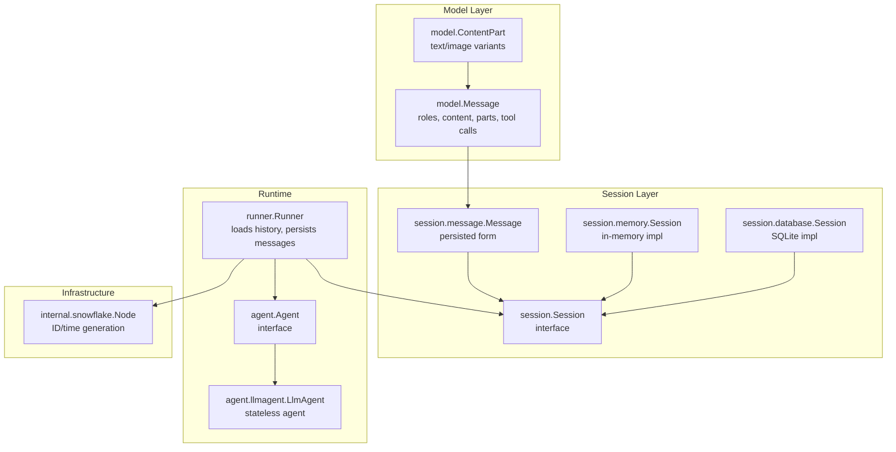
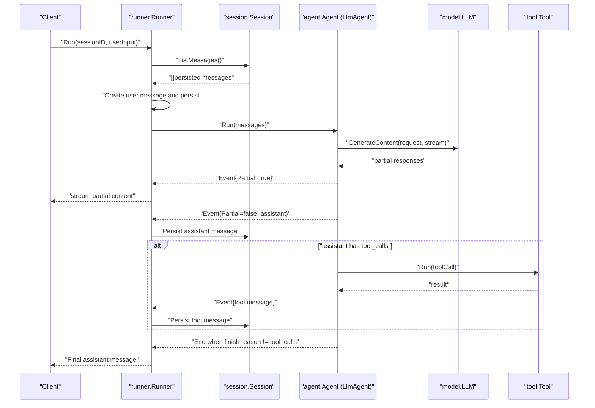
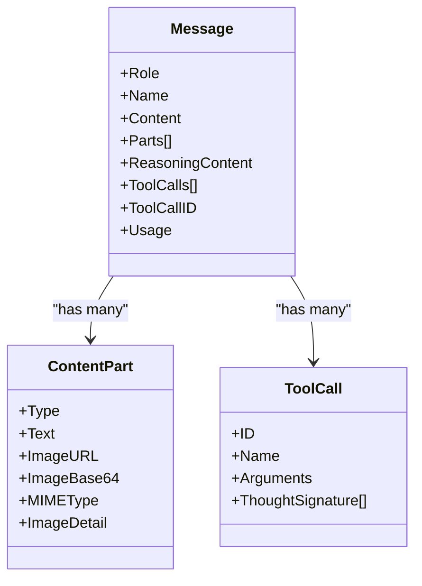
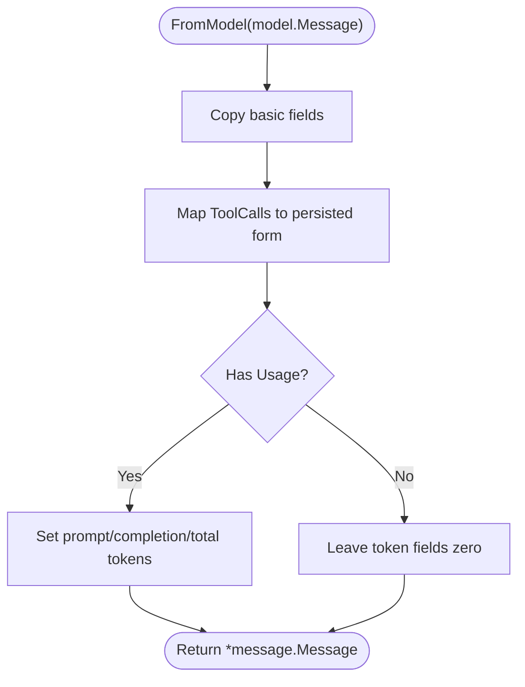
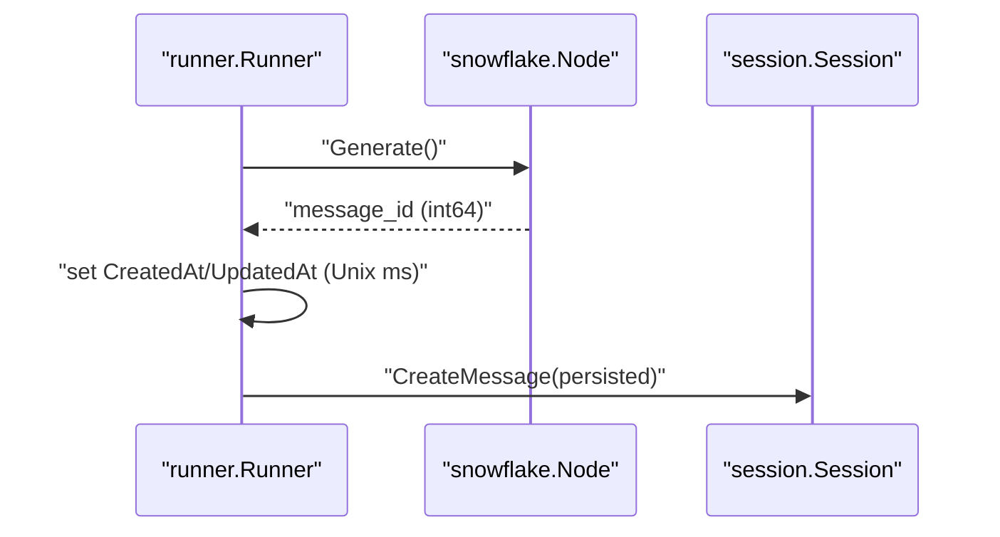
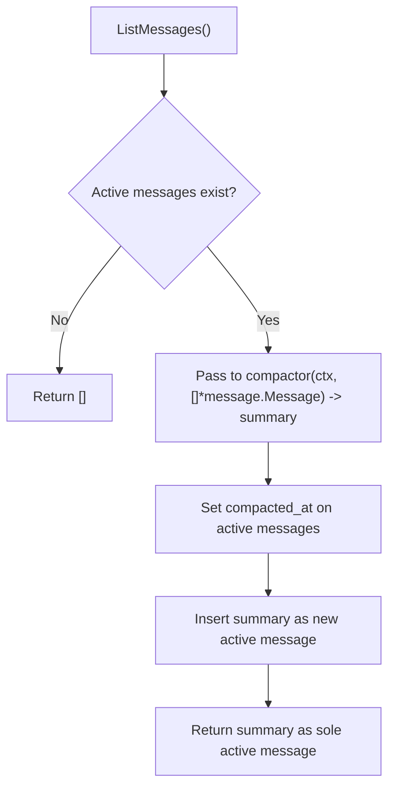
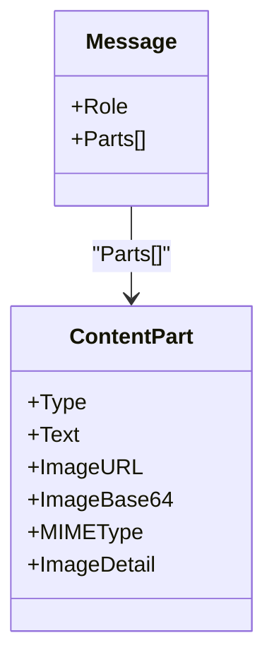
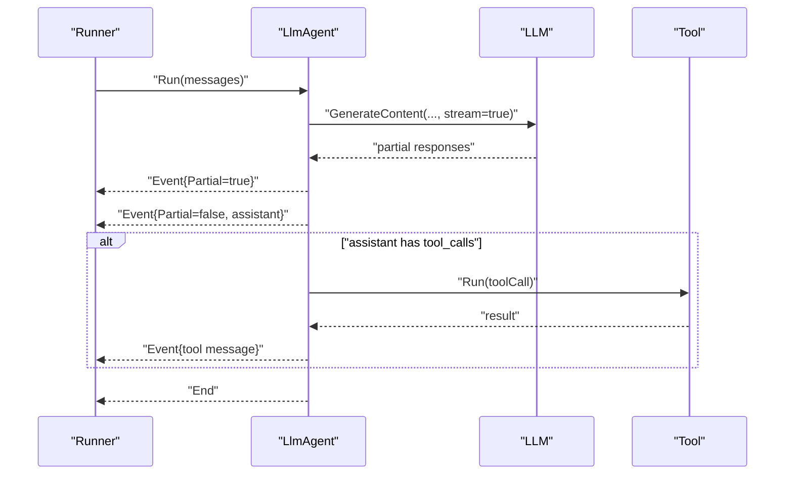
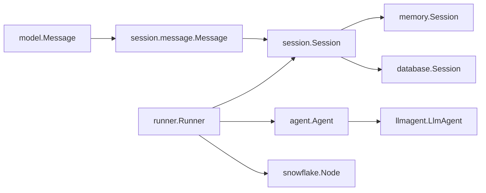

# Message Types and Roles

<cite>
**Referenced Files in This Document**
- [message.go](file://session/message/message.go)
- [model.go](file://model/model.go)
- [session.go](file://session/session.go)
- [session_service.go](file://session/session_service.go)
- [runner.go](file://runner/runner.go)
- [llmagent.go](file://agent/llmagent/llmagent.go)
- [agent.go](file://agent/agent.go)
- [session.go (memory)](file://session/memory/session.go)
- [session.go (database)](file://session/database/session.go)
- [snowflake.go](file://internal/snowflake/snowflake.go)
- [README.md](file://README.md)
- [main.go (examples/chat)](file://examples/chat/main.go)
</cite>

## Table of Contents
1. [Introduction](#introduction)
2. [Project Structure](#project-structure)
3. [Core Components](#core-components)
4. [Architecture Overview](#architecture-overview)
5. [Detailed Component Analysis](#detailed-component-analysis)
6. [Dependency Analysis](#dependency-analysis)
7. [Performance Considerations](#performance-considerations)
8. [Troubleshooting Guide](#troubleshooting-guide)
9. [Conclusion](#conclusion)

## Introduction
This document explains ADK’s message types and roles, focusing on the core Message structure, role types (system, user, assistant, tool), content handling for text and multi-modal data, and timestamp management. It documents message serialization patterns, content validation, role-specific processing rules, and the relationship between messages and conversation flow through the agent-tool execution pipeline. It also covers message history management, compaction strategies, archival patterns, and multi-modal support for text and image content, including content type handling and processing workflows. Practical examples demonstrate message creation, manipulation, and processing patterns throughout the system.

## Project Structure
ADK organizes message-related logic across several packages:
- model: Defines provider-agnostic message types, roles, and multi-modal content parts.
- session: Interfaces for session management and message persistence.
- session/message: Persisted message representation and conversion helpers.
- session/memory and session/database: In-memory and SQLite-backed session implementations.
- runner: Orchestrates message loading, persistence, and agent execution.
- agent/llmagent: Stateless agent that drives LLM generation and tool execution loops.
- internal/snowflake: Distributed, time-ordered ID generation for message IDs and timestamps.

**Diagram sources**
- [model.go:152-178](file://model/model.go#L152-L178)
- [model.go:109-128](file://model/model.go#L109-L128)
- [session.go:9-23](file://session/session.go#L9-L23)
- [session.go (memory):12-24](file://session/memory/session.go#L12-L24)
- [session.go (database):26-32](file://session/database/session.go#L26-L32)
- [message.go:49-73](file://session/message/message.go#L49-L73)
- [runner.go:17-24](file://runner/runner.go#L17-L24)
- [agent.go:10-19](file://agent/agent.go#L10-L19)
- [llmagent.go:29-33](file://agent/llmagent/llmagent.go#L29-L33)
- [snowflake.go:17-56](file://internal/snowflake/snowflake.go#L17-L56)

**Section sources**
- [README.md:65-81](file://README.md#L65-L81)
- [model.go:152-178](file://model/model.go#L152-L178)
- [session.go:9-23](file://session/session.go#L9-L23)
- [session.go (memory):12-24](file://session/memory/session.go#L12-L24)
- [session.go (database):26-32](file://session/database/session.go#L26-L32)
- [message.go:49-73](file://session/message/message.go#L49-L73)
- [runner.go:17-24](file://runner/runner.go#L17-L24)
- [agent.go:10-19](file://agent/agent.go#L10-L19)
- [llmagent.go:29-33](file://agent/llmagent/llmagent.go#L29-L33)
- [snowflake.go:17-56](file://internal/snowflake/snowflake.go#L17-L56)

## Core Components
- Role types: system, user, assistant, tool.
- Message fields:
  - Role, Name, Content, ReasoningContent, ToolCalls, ToolCallID, Usage (token counts), and timestamps (CreatedAt, UpdatedAt, CompactedAt, DeletedAt).
- Multi-modal content:
  - ContentPart supports text and images (URL or base64 with MIME type).
  - For user messages, Parts take precedence over Content.
- Serialization:
  - ToolCalls serialize to JSON for persistence.
  - Message conversion helpers translate between persisted and model forms.

**Section sources**
- [model.go:20-28](file://model/model.go#L20-L28)
- [model.go:152-178](file://model/model.go#L152-L178)
- [model.go:109-128](file://model/model.go#L109-L128)
- [message.go:11-17](file://session/message/message.go#L11-L17)
- [message.go:49-73](file://session/message/message.go#L49-L73)
- [message.go:75-101](file://session/message/message.go#L75-L101)
- [message.go:103-128](file://session/message/message.go#L103-L128)

## Architecture Overview
The system separates stateless agent logic from stateful session persistence. The Runner loads active messages from the session, appends user input, and runs the agent. The agent yields events (partial or complete). Only complete events are persisted; partial events stream to clients for real-time display. Assistant messages may include tool calls; the agent executes tools and emits tool messages back into the conversation.

**Diagram sources**
- [runner.go:39-96](file://runner/runner.go#L39-L96)
- [agent.go:10-19](file://agent/agent.go#L10-L19)
- [llmagent.go:55-124](file://agent/llmagent/llmagent.go#L55-L124)
- [model.go:188-212](file://model/model.go#L188-L212)
- [tool/tool.go:17-23](file://tool/tool.go#L17-L23)

**Section sources**
- [README.md:35-62](file://README.md#L35-L62)
- [runner.go:39-96](file://runner/runner.go#L39-L96)
- [llmagent.go:55-124](file://agent/llmagent/llmagent.go#L55-L124)
- [model.go:188-212](file://model/model.go#L188-L212)

## Detailed Component Analysis

### Message Types and Roles
- Roles:
  - system: contextual instructions; prepended by the agent.
  - user: human input; supports multi-modal content via Parts.
  - assistant: model output; may include tool calls and token usage.
  - tool: results of tool executions; linked back via ToolCallID.
- Multi-modal content:
  - ContentPartTypeText, ContentPartTypeImageURL, ContentPartTypeImageBase64.
  - ImageDetail controls resolution; MIMEType required for base64 images.
  - For user messages, Parts take precedence over Content.

**Diagram sources**
- [model.go:152-178](file://model/model.go#L152-L178)
- [model.go:109-128](file://model/model.go#L109-L128)
- [model.go:130-143](file://model/model.go#L130-L143)

**Section sources**
- [model.go:20-28](file://model/model.go#L20-L28)
- [model.go:152-178](file://model/model.go#L152-L178)
- [model.go:109-128](file://model/model.go#L109-L128)

### Persisted Message Representation and Serialization
- Persisted fields include message_id, role, name, content, reasoning_content, tool_calls (JSON), tool_call_id, token counts, and timestamps.
- ToolCalls serialize to JSON for database storage and scanning.
- Conversion helpers:
  - ToModel: converts persisted message to model.Message for LLM consumption.
  - FromModel: converts model.Message to persisted message for storage.

**Diagram sources**
- [message.go:103-128](file://session/message/message.go#L103-L128)

**Section sources**
- [message.go:49-73](file://session/message/message.go#L49-L73)
- [message.go:103-128](file://session/message/message.go#L103-L128)
- [message.go:75-101](file://session/message/message.go#L75-L101)

### Timestamp Management and ID Generation
- Message IDs are generated using a distributed, time-ordered snowflake node.
- CreatedAt and UpdatedAt are set to Unix milliseconds before persistence.
- CompactedAt marks archived messages after compaction; DeletedAt supports soft deletion.

**Diagram sources**
- [runner.go:98-107](file://runner/runner.go#L98-L107)
- [snowflake.go:17-56](file://internal/snowflake/snowflake.go#L17-L56)

**Section sources**
- [runner.go:98-107](file://runner/runner.go#L98-L107)
- [snowflake.go:11-15](file://internal/snowflake/snowflake.go#L11-L15)

### Message History Management and Compaction
- Active vs archived:
  - Active messages: deleted_at = 0 and compacted_at = 0.
  - Archived messages: compacted_at > 0 and deleted_at = 0.
- Compaction process:
  - Retrieve active messages, pass to a compactor function to produce a summary.
  - Soft-archive active messages by setting compacted_at.
  - Insert the summary as a new active message.
- Backends:
  - Memory: maintains separate slices for active and compacted messages.
  - Database: uses SQL queries to select active/archived messages and updates compacted_at atomically.

**Diagram sources**
- [session.go (memory):70-85](file://session/memory/session.go#L70-L85)
- [session.go (database):97-145](file://session/database/session.go#L97-L145)

**Section sources**
- [session.go:12-22](file://session/session.go#L12-L22)
- [session.go (memory):12-24](file://session/memory/session.go#L12-L24)
- [session.go (memory):70-85](file://session/memory/session.go#L70-L85)
- [session.go (database):14-24](file://session/database/session.go#L14-L24)
- [session.go (database):97-145](file://session/database/session.go#L97-L145)

### Multi-modal Message Support
- Supported content parts:
  - Text: plain-text content.
  - Image via URL: HTTPS URL with optional detail level.
  - Image via Base64: raw data with MIME type and optional detail level.
- Precedence:
  - For user messages, multi-part content (Parts) takes precedence over Content.
- Example usage pattern:
  - Construct a user message with mixed parts (text + image).
  - Agent receives the message and forwards it to the LLM.

**Diagram sources**
- [model.go:109-128](file://model/model.go#L109-L128)
- [model.go:152-178](file://model/model.go#L152-L178)

**Section sources**
- [model.go:86-97](file://model/model.go#L86-L97)
- [model.go:99-107](file://model/model.go#L99-L107)
- [model.go:109-128](file://model/model.go#L109-L128)
- [model.go:152-178](file://model/model.go#L152-L178)
- [README.md:259-275](file://README.md#L259-L275)

### Role-Specific Processing Rules and Validation
- Role-specific expectations:
  - system: prepended by the agent; not stored in the message body for provider calls.
  - user: input; supports multi-modal parts.
  - assistant: output; may include ToolCalls and Usage.
  - tool: result of tool execution; must link back via ToolCallID.
- Validation patterns:
  - ToolCalls must include IDs that match assistant ToolCalls.
  - ToolCallID in tool messages must correspond to the assistant’s ToolCall.ID.
  - Content vs Parts precedence for user messages.
- Streaming:
  - Partial events carry incremental deltas for Content and ReasoningContent; other fields may be zero-valued.

**Section sources**
- [llmagent.go:55-124](file://agent/llmagent/llmagent.go#L55-L124)
- [model.go:152-178](file://model/model.go#L152-L178)
- [model.go:214-226](file://model/model.go#L214-L226)

### Conversation Flow Through the Agent-Tool Pipeline
- The Runner:
  - Loads active messages from the session.
  - Creates and persists a user message.
  - Runs the agent with the combined history.
  - Yields events; persists only complete events.
- The Agent (LlmAgent):
  - Optionally prepends a system instruction.
  - Calls the LLM; streams partial responses.
  - On tool calls, executes tools and appends tool results to history.
  - Continues until the model stops requesting tools.

**Diagram sources**
- [runner.go:39-96](file://runner/runner.go#L39-L96)
- [llmagent.go:55-124](file://agent/llmagent/llmagent.go#L55-L124)
- [model.go:188-212](file://model/model.go#L188-L212)

**Section sources**
- [runner.go:39-96](file://runner/runner.go#L39-L96)
- [llmagent.go:55-124](file://agent/llmagent/llmagent.go#L55-L124)
- [model.go:188-212](file://model/model.go#L188-L212)

### Practical Examples
- Creating a multi-modal user message:
  - Compose a user message with text and an image part (URL or base64).
  - The agent will forward this as-is to the LLM.
- Running a chat loop:
  - Use Runner.Run to send user input and iterate over events.
  - Print partial content for streaming; handle tool calls when present.
- Compacting history:
  - Use Session.CompactMessages with a custom compactor to summarize and archive old messages.

**Section sources**
- [README.md:259-275](file://README.md#L259-L275)
- [main.go (examples/chat):125-175](file://examples/chat/main.go#L125-L175)
- [session.go](file://session/session.go#L22)

## Dependency Analysis
- Cohesion:
  - model.Message encapsulates all message semantics; session/message.Message focuses on persistence.
  - runner.Runner orchestrates orchestration without embedding domain logic.
- Coupling:
  - agent.Agent depends on model.Message; agent.llmagent depends on model.LLM and tool.Tool.
  - session.Session defines persistence contract; memory/database implement it.
- External dependencies:
  - Snowflake for IDs.
  - SQLx for database operations.
  - JSON marshalling/unmarshalling for ToolCalls.

**Diagram sources**
- [model.go:152-178](file://model/model.go#L152-L178)
- [message.go:49-73](file://session/message/message.go#L49-L73)
- [session.go:9-23](file://session/session.go#L9-L23)
- [session.go (memory):12-24](file://session/memory/session.go#L12-L24)
- [session.go (database):26-32](file://session/database/session.go#L26-L32)
- [runner.go:17-24](file://runner/runner.go#L17-L24)
- [llmagent.go:29-33](file://agent/llmagent/llmagent.go#L29-L33)
- [snowflake.go:17-56](file://internal/snowflake/snowflake.go#L17-L56)

**Section sources**
- [model.go:152-178](file://model/model.go#L152-L178)
- [message.go:49-73](file://session/message/message.go#L49-L73)
- [session.go:9-23](file://session/session.go#L9-L23)
- [runner.go:17-24](file://runner/runner.go#L17-L24)
- [llmagent.go:29-33](file://agent/llmagent/llmagent.go#L29-L33)
- [snowflake.go:17-56](file://internal/snowflake/snowflake.go#L17-L56)

## Performance Considerations
- Streaming:
  - Partial events reduce perceived latency; only complete events are persisted.
- Token accounting:
  - Usage is attached to assistant messages; keep track of prompt/completion totals for cost control.
- Compaction:
  - Summarize long histories to reduce payload sizes and improve latency.
- Storage:
  - Prefer database backend for persistence across restarts; memory backend for ephemeral use.

[No sources needed since this section provides general guidance]

## Troubleshooting Guide
- Tool call mismatches:
  - Ensure ToolCallID in tool messages matches the assistant’s ToolCall.ID.
- Multi-modal issues:
  - For base64 images, provide MIMEType; for URLs, ensure HTTPS and accessibility.
- Persistence problems:
  - Verify timestamps and compacted_at flags; confirm active vs archived queries.
- Streaming artifacts:
  - Expect partial content deltas; assemble complete messages only when Partial=false.

**Section sources**
- [llmagent.go:127-147](file://agent/llmagent/llmagent.go#L127-L147)
- [model.go:109-128](file://model/model.go#L109-L128)
- [session.go (database):14-24](file://session/database/session.go#L14-L24)
- [model.go:214-226](file://model/model.go#L214-L226)

## Conclusion
ADK’s message system cleanly separates provider-agnostic message semantics from persistence and runtime orchestration. Roles, multi-modal content, and tool-call handling are first-class, with robust streaming, compaction, and archival capabilities. The Runner-agent-session architecture ensures that message history is consistently managed while enabling efficient, extensible agent-tool workflows.