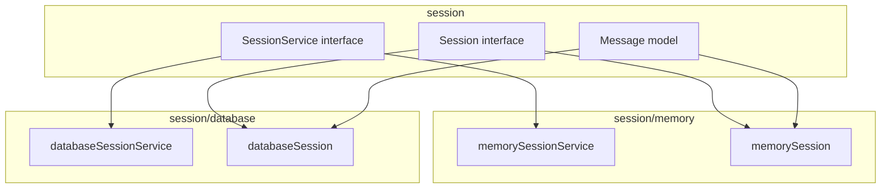
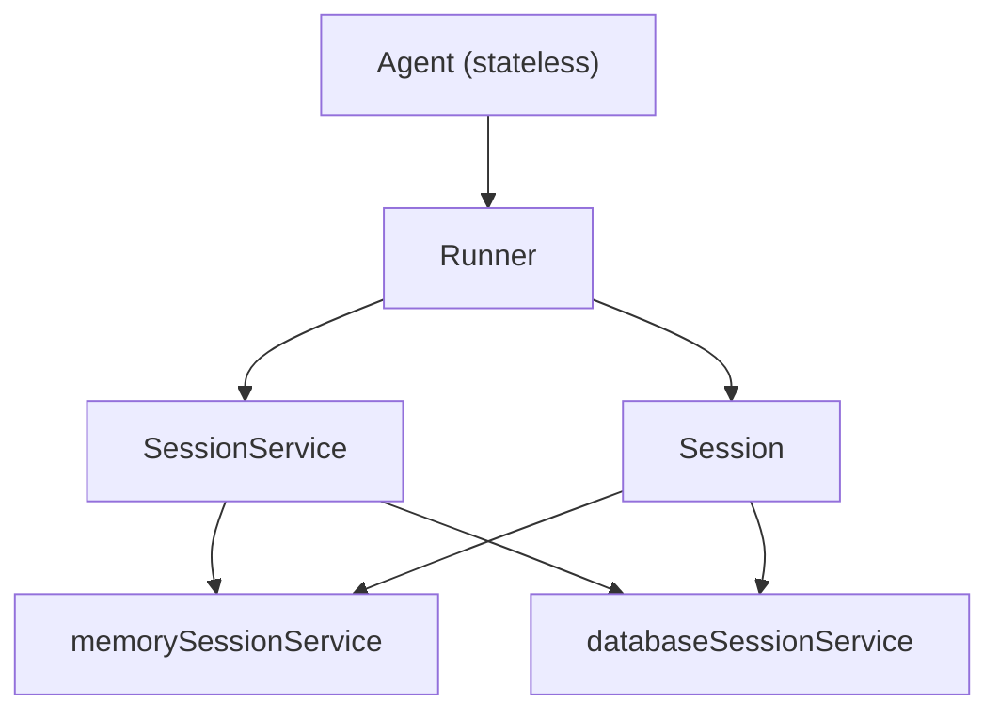
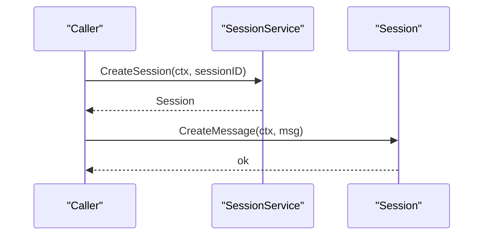
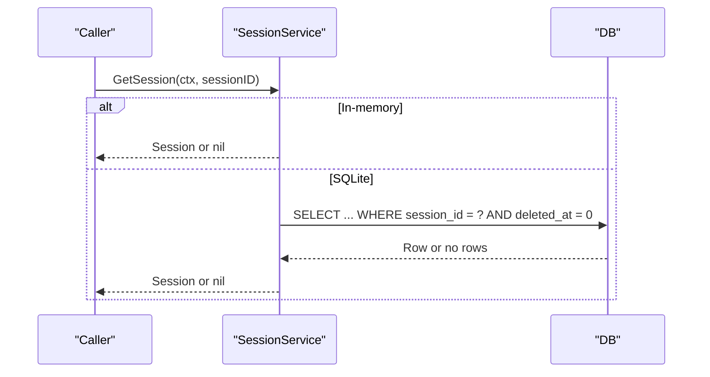
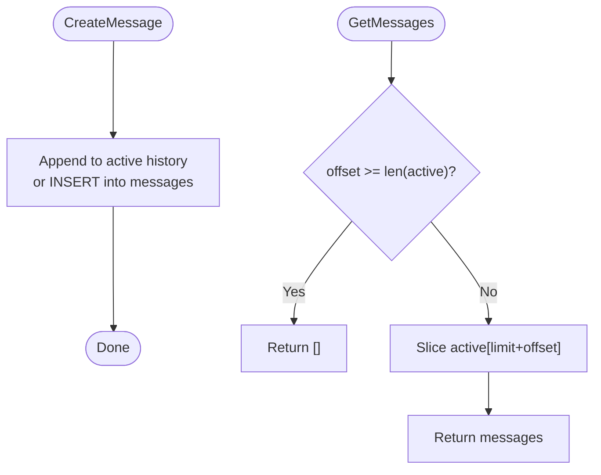
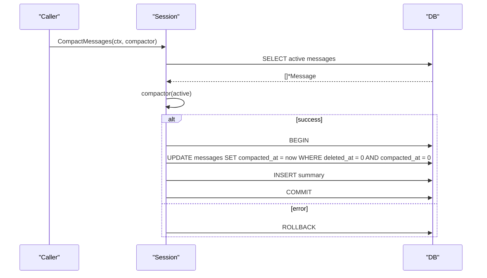
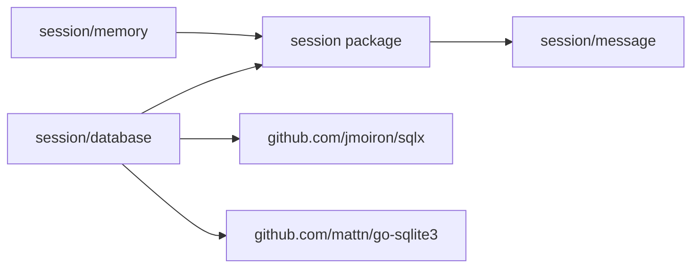

# Session Management

<cite>
**Referenced Files in This Document**
- [session/session.go](file://session/session.go)
- [session/session_service.go](file://session/session_service.go)
- [session/message/message.go](file://session/message/message.go)
- [session/memory/session_service.go](file://session/memory/session_service.go)
- [session/memory/session.go](file://session/memory/session.go)
- [session/database/session_service.go](file://session/database/session_service.go)
- [session/database/session.go](file://session/database/session.go)
- [session/database/session_test.go](file://session/database/session_test.go)
- [session/memory/session_test.go](file://session/memory/session_test.go)
- [README.md](file://README.md)
- [go.mod](file://go.mod)
</cite>

## Table of Contents
1. [Introduction](#introduction)
2. [Project Structure](#project-structure)
3. [Core Components](#core-components)
4. [Architecture Overview](#architecture-overview)
5. [Detailed Component Analysis](#detailed-component-analysis)
6. [Dependency Analysis](#dependency-analysis)
7. [Performance Considerations](#performance-considerations)
8. [Troubleshooting Guide](#troubleshooting-guide)
9. [Conclusion](#conclusion)
10. [Appendices](#appendices)

## Introduction
This document explains ADK’s Session Management subsystem. It covers the SessionService interface design, CRUD operations, pagination support, and message persistence patterns. It documents the in-memory backend for development and testing, including thread-safety considerations and limitations. It details the SQLite database backend with schema design, transactional compaction, and performance considerations. It also explains message compaction strategies, soft archival patterns, and historical preservation techniques. Finally, it outlines session creation, loading, updating, and deletion workflows, and provides practical examples and operational guidance for scaling, backups, and retention.

## Project Structure
ADK organizes session-related code under the session package with two pluggable backends:
- session: defines the Session and SessionService interfaces and message types
- session/memory: in-memory backend for zero-config development/testing
- session/database: SQLite backend for persistent storage

**Diagram sources**
- [session/session_service.go:5-9](file://session/session_service.go#L5-L9)
- [session/session.go:9-23](file://session/session.go#L9-L23)
- [session/message/message.go:49-73](file://session/message/message.go#L49-L73)
- [session/memory/session_service.go:10-16](file://session/memory/session_service.go#L10-L16)
- [session/memory/session.go:12-24](file://session/memory/session.go#L12-L24)
- [session/database/session_service.go:19-25](file://session/database/session_service.go#L19-L25)
- [session/database/session.go:26-32](file://session/database/session.go#L26-L32)

**Section sources**
- [README.md:65-82](file://README.md#L65-L82)
- [session/session_service.go:5-9](file://session/session_service.go#L5-L9)
- [session/session.go:9-23](file://session/session.go#L9-L23)
- [session/message/message.go:49-73](file://session/message/message.go#L49-L73)

## Core Components
- SessionService: Factory for creating, retrieving, and deleting sessions.
- Session: CRUD operations on messages, pagination, listing, compaction, and archival.
- Message: Persisted message model with token usage and compaction/deletion markers.

Key responsibilities:
- SessionService: lifecycle management of sessions (create/get/delete).
- Session: message lifecycle (create/delete), pagination (GetMessages), full listing (ListMessages/ListCompactedMessages), and compaction (CompactMessages).
- Message: serialization of tool calls to JSON, conversion to/from model.Message, and archival metadata.

**Section sources**
- [session/session_service.go:5-9](file://session/session_service.go#L5-L9)
- [session/session.go:9-23](file://session/session.go#L9-L23)
- [session/message/message.go:11-129](file://session/message/message.go#L11-L129)

## Architecture Overview
The system separates stateless agents from stateful runners. The runner owns the session and persists every message. Two backends provide the same interface:
- In-memory: zero-config, ephemeral, suitable for testing and single-process use.
- SQLite: persistent, transactional, supports compaction and archival.

**Diagram sources**
- [README.md:35-62](file://README.md#L35-L62)
- [session/session_service.go:5-9](file://session/session_service.go#L5-L9)
- [session/session.go:9-23](file://session/session.go#L9-L23)
- [session/memory/session_service.go:14-16](file://session/memory/session_service.go#L14-L16)
- [session/database/session_service.go:23-25](file://session/database/session_service.go#L23-L25)

## Detailed Component Analysis

### SessionService Interface
- CreateSession(ctx, sessionID): returns a Session bound to the given sessionID.
- GetSession(ctx, sessionID): retrieves an existing session or nil if not found.
- DeleteSession(ctx, sessionID): marks the session as deleted (soft delete).

Thread-safety: The in-memory implementation is not thread-safe. Concurrent access to the session collection requires external synchronization.

**Section sources**
- [session/session_service.go:5-9](file://session/session_service.go#L5-L9)
- [session/memory/session_service.go:18-40](file://session/memory/session_service.go#L18-L40)

### Session Interface
- GetSessionID(): returns the session identifier.
- CreateMessage(ctx, message): appends a message to the active history.
- GetMessages(ctx, limit, offset): paginated retrieval of active messages ordered by created_at ascending.
- ListMessages(ctx): returns all active messages ordered by created_at ascending.
- ListCompactedMessages(ctx): returns archived messages ordered by created_at ascending.
- DeleteMessage(ctx, messageID): deletes a message by ID (soft delete).
- CompactMessages(ctx, compactor): archives active messages and replaces them with a summary produced by the compactor callback.

Pagination semantics:
- GetMessages uses LIMIT/OFFSET on active, non-compacted, non-deleted messages.
- ListMessages returns the full active history.
- ListCompactedMessages returns archived messages.

Soft archival:
- Messages are marked with compacted_at upon archiving; deleted_at is used for soft-deleting messages.
- Active vs archived filtering is enforced by WHERE conditions in queries.

**Section sources**
- [session/session.go:9-23](file://session/session.go#L9-L23)

### Message Model
- Fields include identity, role, name, content, reasoning content, tool calls, tool call linkage, token usage, timestamps, and archival/deletion markers.
- ToolCalls implements JSON serialization/deserialization for storage.
- Conversion helpers convert between persisted Message and model.Message.

**Section sources**
- [session/message/message.go:49-129](file://session/message/message.go#L49-L129)

### In-Memory Backend
- memorySessionService: maintains a slice of sessions; Create/Delete/Get operate on this slice.
- memorySession: maintains two slices:
  - active messages
  - compacted/archived messages
- Compaction:
  - Invokes compactor with active messages.
  - On success, sets compacted_at on each active message and moves them to compactedMessages.
  - Replaces active messages with a single summary message.
  - On failure, preserves active messages and leaves compactedMessages unchanged.

Thread-safety:
- Not thread-safe. Concurrent modifications to the sessions slice or message slices can cause race conditions. Use external synchronization or a single-threaded access pattern.

Limitations:
- Ephemeral storage; data lost on process exit.
- Memory growth proportional to active + archived messages.

**Section sources**
- [session/memory/session_service.go:10-40](file://session/memory/session_service.go#L10-L40)
- [session/memory/session.go:12-86](file://session/memory/session.go#L12-L86)

### SQLite Backend
- databaseSessionService: wraps a sqlx.DB and delegates session operations to databaseSession.
- databaseSession:
  - CreateSession inserts a new session row.
  - CreateMessage inserts a new message with compacted_at = 0 and deleted_at = 0.
  - DeleteMessage performs a soft delete by setting deleted_at.
  - GetMessages uses LIMIT/OFFSET on active, non-deleted, non-compacted messages.
  - ListMessages returns all active messages.
  - ListCompactedMessages returns archived messages.
  - CompactMessages:
    - Fetches active messages.
    - Invokes compactor to produce a summary.
    - Starts a transaction; sets compacted_at on active messages; inserts the summary as a new active message.
    - Commits the transaction; rollback on error.

Schema design:
- sessions: session_id (PK), created_at, updated_at, deleted_at.
- messages: message_id (PK), role, name, content, reasoning_content, tool_calls (JSON), tool_call_id, prompt_tokens, completion_tokens, total_tokens, created_at, updated_at, compacted_at, deleted_at.

Migration strategies:
- The tests demonstrate creating tables in-memory for SQLite. For persistent databases, apply equivalent DDL to initialize sessions and messages tables before use.

**Section sources**
- [session/database/session_service.go:19-48](file://session/database/session_service.go#L19-L48)
- [session/database/session.go:14-146](file://session/database/session.go#L14-L146)
- [session/database/session_test.go:17-52](file://session/database/session_test.go#L17-L52)

### Workflows

#### Session Creation
- CreateSession(ctx, sessionID) returns a Session bound to sessionID.
- In-memory: instantiates a memorySession and appends to the service’s slice.
- SQLite: inserts a new session row.

**Diagram sources**
- [session/session_service.go:6](file://session/session_service.go#L6)
- [session/memory/session_service.go:18-22](file://session/memory/session_service.go#L18-L22)
- [session/database/session_service.go:27-29](file://session/database/session_service.go#L27-L29)
- [session/memory/session.go:30-33](file://session/memory/session.go#L30-L33)
- [session/database/session.go:46-63](file://session/database/session.go#L46-L63)

#### Session Loading
- GetSession(ctx, sessionID) returns the session or nil if not found.
- In-memory: linear scan by sessionID.
- SQLite: SELECT with deleted_at = 0.

**Diagram sources**
- [session/memory/session_service.go:34-40](file://session/memory/session_service.go#L34-L40)
- [session/database/session_service.go:37-48](file://session/database/session_service.go#L37-L48)

#### Message CRUD and Pagination
- CreateMessage: append to active history (in-memory) or INSERT into messages (SQLite).
- GetMessages: LIMIT/OFFSET on active, non-compacted, non-deleted messages.
- ListMessages: full active history.
- DeleteMessage: soft delete by setting deleted_at.

**Diagram sources**
- [session/memory/session.go:30-56](file://session/memory/session.go#L30-L56)
- [session/database/session.go:46-86](file://session/database/session.go#L46-L86)

#### Compaction Workflow
- Fetch active messages.
- Invoke compactor to produce a summary.
- Transactionally:
  - Set compacted_at on active messages.
  - Insert the summary as a new active message.
- On error, rollback and preserve active messages.

**Diagram sources**
- [session/memory/session.go:70-85](file://session/memory/session.go#L70-L85)
- [session/database/session.go:97-145](file://session/database/session.go#L97-L145)

## Dependency Analysis
- session depends on session/message for message types.
- memory and database backends depend on the session interfaces.
- database backend depends on sqlx and sqlite3.

**Diagram sources**
- [session/session.go:3-7](file://session/session.go#L3-L7)
- [session/message/message.go:3-9](file://session/message/message.go#L3-L9)
- [session/database/session_service.go:3-12](file://session/database/session_service.go#L3-L12)
- [go.mod:9-10](file://go.mod#L9-L10)

**Section sources**
- [go.mod:5-15](file://go.mod#L5-L15)
- [session/database/session_service.go:3-12](file://session/database/session_service.go#L3-L12)

## Performance Considerations
- In-memory backend:
  - O(n) lookup for GetSession by sessionID.
  - O(n) deletion by scanning active messages.
  - Linear-time pagination over active messages.
  - Memory grows with active + archived messages; consider compaction to reduce size.
- SQLite backend:
  - Indexes on created_at and filters on deleted_at and compacted_at are implied by queries; consider adding indexes for performance on large histories.
  - Transactions ensure atomicity for compaction; keep compactor fast to minimize lock contention.
  - LIMIT/OFFSET queries scale with offset; consider cursor-based pagination for very large histories.
- Message serialization:
  - ToolCalls are stored as JSON; large tool call lists increase storage and IO overhead.

[No sources needed since this section provides general guidance]

## Troubleshooting Guide
Common issues and resolutions:
- Session not found:
  - Ensure sessionID exists and was created. In-memory, sessions are ephemeral; in SQLite, confirm the row exists and deleted_at is zero.
- Compaction failures:
  - If compactor returns an error, active messages remain unchanged and compactedMessages remains empty. Verify compactor logic and retry.
- Deleted messages still appear:
  - Confirm deleted_at filtering in queries and that DeleteMessage was invoked.
- Pagination returns empty:
  - Check offset bounds; GetMessages returns empty when offset >= len(active).

**Section sources**
- [session/database/session_test.go:40-52](file://session/database/session_test.go#L40-L52)
- [session/database/session_test.go:238-266](file://session/database/session_test.go#L238-L266)
- [session/memory/session_test.go:69-86](file://session/memory/session_test.go#L69-L86)
- [session/memory/session_test.go:196-220](file://session/memory/session_test.go#L196-L220)

## Conclusion
ADK’s Session Management provides a clean abstraction for message history with two backends. The in-memory backend is ideal for testing and single-process scenarios, while the SQLite backend offers persistence and transactional compaction. Soft archival preserves historical context without deleting data, enabling summarization and long-term retention strategies. Proper indexing, compaction, and careful handling of concurrency and transactions are essential for production deployments.

[No sources needed since this section summarizes without analyzing specific files]

## Appendices

### Practical Examples

- Choosing a backend:
  - In-memory: import and instantiate the memory service for testing or single-process use.
  - SQLite: import and instantiate the database service with a path to a SQLite file.

- Creating a session and iterating messages:
  - Create a session once.
  - For each turn, load the session, run the agent, and persist each yielded message.

- Message history management:
  - Use ListMessages for full active history.
  - Use GetMessages with limit/offset for paginated retrieval.
  - Use ListCompactedMessages to access archived messages.

- Compaction strategies:
  - Implement a compactor that produces a summary message from active messages.
  - Call CompactMessages to archive active messages and replace them with the summary.

- Scaling considerations:
  - Prefer SQLite for multi-process or persistent deployments.
  - Add indexes on frequently queried columns (e.g., created_at) to improve pagination performance.
  - Keep compactor logic efficient to minimize transaction duration.

- Backup strategies:
  - For SQLite, back up the database file regularly.
  - For in-memory, rely on external persistence or snapshot mechanisms.

- Data retention policies:
  - Use soft deletion (deleted_at) and archival (compacted_at) to manage retention without destructive operations.
  - Periodically compact older segments to reduce storage footprint.

**Section sources**
- [README.md:114-153](file://README.md#L114-L153)
- [README.md:212-231](file://README.md#L212-L231)
- [session/database/session_test.go:63-84](file://session/database/session_test.go#L63-L84)
- [session/database/session_test.go:118-160](file://session/database/session_test.go#L118-L160)
- [session/database/session_test.go:162-205](file://session/database/session_test.go#L162-L205)
- [session/memory/session_test.go:23-39](file://session/memory/session_test.go#L23-L39)
- [session/memory/session_test.go:88-126](file://session/memory/session_test.go#L88-L126)
- [session/memory/session_test.go:128-167](file://session/memory/session_test.go#L128-L167)