# Tool System Design

<cite>
**Referenced Files in This Document**
- [tool.go](file://tool/tool.go)
- [echo.go](file://tool/builtin/echo.go)
- [mcp.go](file://tool/mcp/mcp.go)
- [mcp_test.go](file://tool/mcp/mcp_test.go)
- [agentool.go](file://agent/agentool/agentool.go)
- [llmagent.go](file://agent/llmagent/llmagent.go)
- [main.go](file://examples/chat/main.go)
- [README.md](file://README.md)
</cite>

## Table of Contents
1. [Introduction](#introduction)
2. [Project Structure](#project-structure)
3. [Core Components](#core-components)
4. [Architecture Overview](#architecture-overview)
5. [Detailed Component Analysis](#detailed-component-analysis)
6. [Dependency Analysis](#dependency-analysis)
7. [Performance Considerations](#performance-considerations)
8. [Troubleshooting Guide](#troubleshooting-guide)
9. [Conclusion](#conclusion)
10. [Appendices](#appendices)

## Introduction
This document explains the Tool System Design in the Agent Development Kit (ADK). It covers the Tool interface contract, JSON schema validation for tool definitions, built-in tools, MCP integration for external tool servers, tool registration patterns, parameter validation, execution workflows, composition strategies, error handling, result processing, security considerations, and performance optimization techniques. Practical examples demonstrate custom tool development, MCP tool integration, and tool execution patterns.

## Project Structure
The tool system is organized around a small set of packages:
- tool: defines the Tool interface and tool.Definition metadata
- tool/builtin: provides built-in tools (e.g., Echo)
- tool/mcp: integrates with MCP servers to discover and invoke remote tools
- agent/llmagent: orchestrates tool calls during LLM generation loops
- agent/agentool: composes agents as tools
- examples/chat: demonstrates MCP tool integration in a runnable example

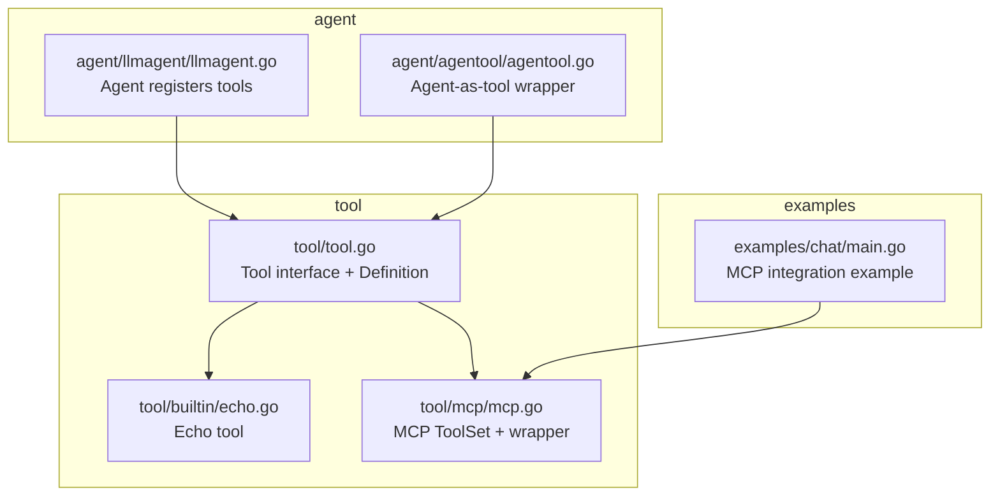

**Diagram sources**
- [tool.go:1-24](file://tool/tool.go#L1-L24)
- [echo.go:1-47](file://tool/builtin/echo.go#L1-L47)
- [mcp.go:1-121](file://tool/mcp/mcp.go#L1-L121)
- [llmagent.go:1-148](file://agent/llmagent/llmagent.go#L1-L148)
- [agentool.go:1-79](file://agent/agentool/agentool.go#L1-L79)
- [main.go:52-123](file://examples/chat/main.go#L52-L123)

**Section sources**
- [README.md:65-82](file://README.md#L65-L82)
- [tool.go:1-24](file://tool/tool.go#L1-L24)
- [mcp.go:1-121](file://tool/mcp/mcp.go#L1-L121)
- [echo.go:1-47](file://tool/builtin/echo.go#L1-L47)
- [llmagent.go:1-148](file://agent/llmagent/llmagent.go#L1-L148)
- [agentool.go:1-79](file://agent/agentool/agentool.go#L1-L79)
- [main.go:52-123](file://examples/chat/main.go#L52-L123)

## Core Components
- Tool interface contract:
  - Definition(): returns tool metadata including name, description, and input JSON schema
  - Run(ctx, toolCallID, arguments): executes the tool with validated JSON arguments and returns a string result
- tool.Definition:
  - Holds Name, Description, and InputSchema for LLM tool discovery and invocation
- JSON schema validation:
  - InputSchema is a compiled jsonschema.Schema used to validate tool arguments
  - Built-in tools derive schemas from Go structs annotated with jsonschema tags
- Tool registration:
  - Agents register tools by name; LLM requests are matched by tool name during execution

**Section sources**
- [tool.go:9-23](file://tool/tool.go#L9-L23)
- [echo.go:18-34](file://tool/builtin/echo.go#L18-L34)
- [llmagent.go:36-44](file://agent/llmagent/llmagent.go#L36-L44)

## Architecture Overview
The tool system integrates with the LLM agent loop to enable automatic tool-call execution. The agent maintains a registry of tools keyed by name. During generation, when the LLM emits tool calls, the agent resolves the tool by name and invokes Run with the provided arguments. Results are appended back into the conversation history for subsequent reasoning.

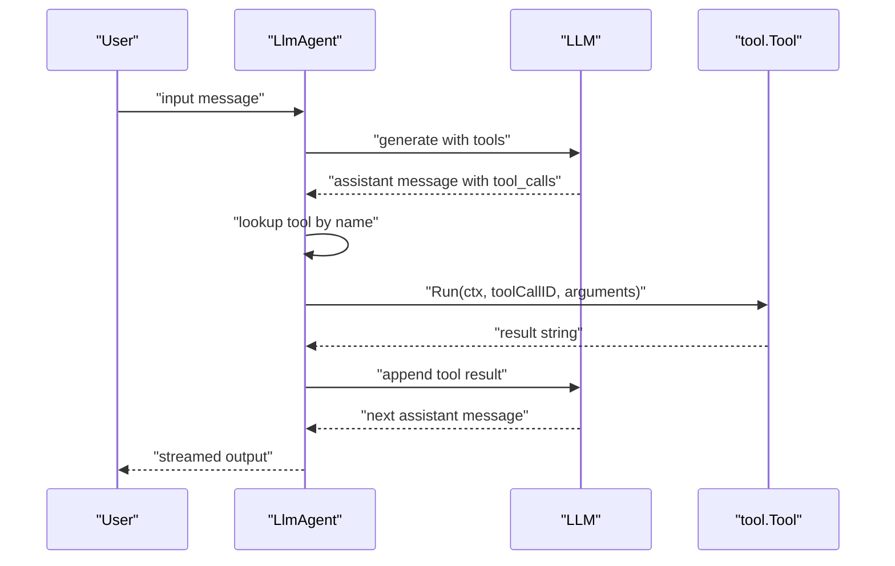

**Diagram sources**
- [llmagent.go:59-124](file://agent/llmagent/llmagent.go#L59-L124)
- [llmagent.go:127-147](file://agent/llmagent/llmagent.go#L127-L147)
- [tool.go:17-23](file://tool/tool.go#L17-L23)

## Detailed Component Analysis

### Tool Interface Contract
The Tool interface defines a provider-agnostic contract for tools:
- Definition(): returns tool metadata used by the LLM to understand and call the tool
- Run(ctx, toolCallID, arguments): executes the tool with the given arguments JSON string and returns the result as a string

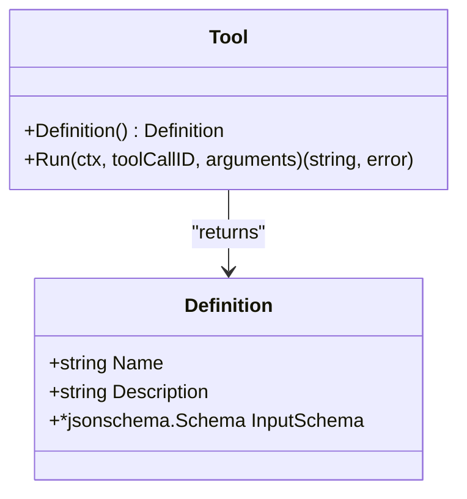

**Diagram sources**
- [tool.go:17-23](file://tool/tool.go#L17-L23)
- [tool.go:9-15](file://tool/tool.go#L9-L15)

**Section sources**
- [tool.go:17-23](file://tool/tool.go#L17-L23)

### JSON Schema Validation and Tool Definitions
- Built-in tools derive their InputSchema from Go struct types using jsonschema.ForType
- The echo tool’s input schema is generated from a struct with a single field annotated with jsonschema tags
- MCP tools convert the server-provided input schema (typed as any) to a compiled jsonschema.Schema by round-tripping through JSON

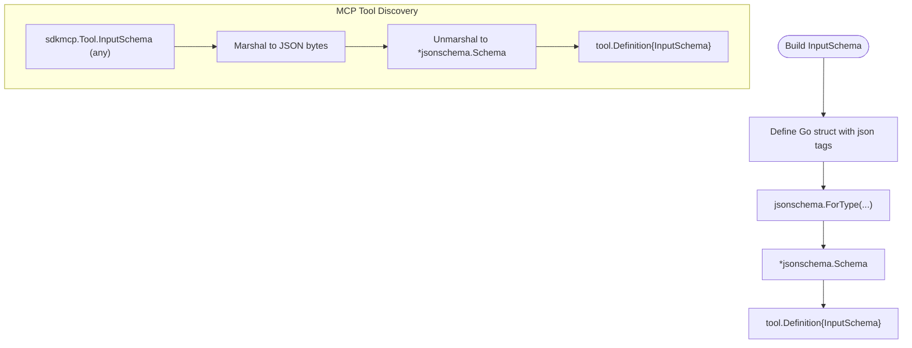

**Diagram sources**
- [echo.go:22-34](file://tool/builtin/echo.go#L22-L34)
- [mcp.go:46-72](file://tool/mcp/mcp.go#L46-L72)

**Section sources**
- [echo.go:18-34](file://tool/builtin/echo.go#L18-L34)
- [mcp.go:46-72](file://tool/mcp/mcp.go#L46-L72)

### Built-in Tools: Echo Example
The Echo tool demonstrates:
- Defining a request struct with a single field and jsonschema tag
- Building an InputSchema from the struct type
- Unmarshalling the arguments JSON into the request struct
- Returning the validated argument as the tool result

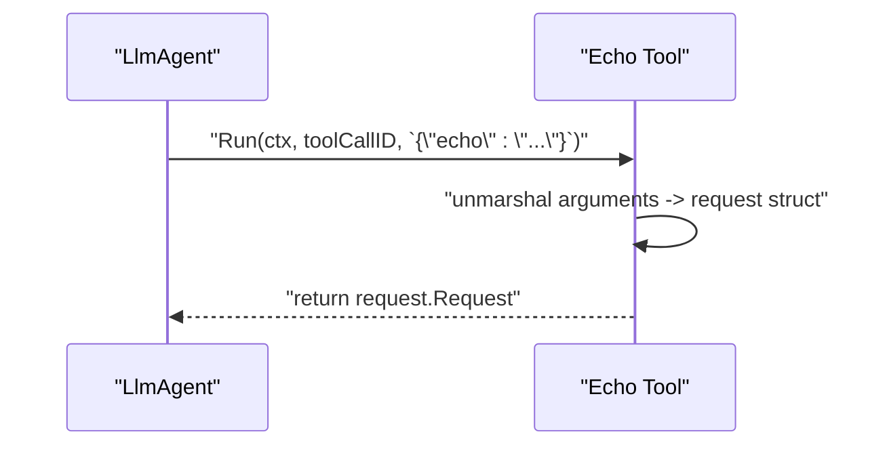

**Diagram sources**
- [echo.go:40-46](file://tool/builtin/echo.go#L40-L46)

**Section sources**
- [echo.go:1-47](file://tool/builtin/echo.go#L1-L47)

### MCP Integration: Transport Configuration and Tool Discovery
The MCP ToolSet:
- Creates an MCP client and establishes a session over a provided transport
- Discovers tools from the server and wraps each as a tool.Tool
- Converts server-provided input schemas to compiled jsonschema.Schema
- Executes tools by calling the MCP session’s CallTool and extracting text content

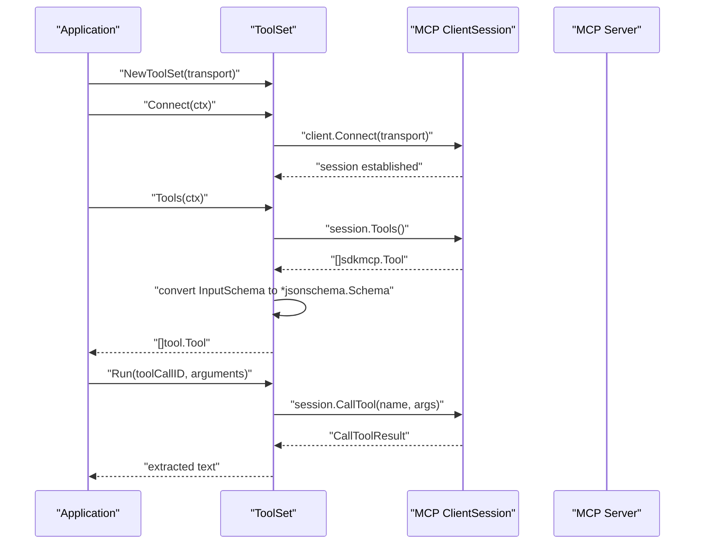

**Diagram sources**
- [mcp.go:22-80](file://tool/mcp/mcp.go#L22-L80)
- [mcp.go:82-121](file://tool/mcp/mcp.go#L82-L121)

**Section sources**
- [mcp.go:15-121](file://tool/mcp/mcp.go#L15-L121)
- [mcp_test.go:44-100](file://tool/mcp/mcp_test.go#L44-L100)

### Tool Registration Patterns
- Agent registration:
  - The agent constructs a map of tools keyed by tool name from the provided tool list
  - Tool resolution during execution is performed by name lookup
- Composition:
  - An agent can be wrapped as a tool using agentool, enabling tool-call loops to invoke agents as tools

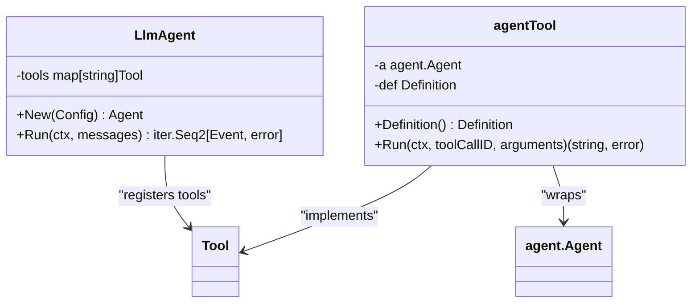

**Diagram sources**
- [llmagent.go:36-44](file://agent/llmagent/llmagent.go#L36-L44)
- [llmagent.go:127-147](file://agent/llmagent/llmagent.go#L127-L147)
- [agentool.go:16-48](file://agent/agentool/agentool.go#L16-L48)

**Section sources**
- [llmagent.go:36-44](file://agent/llmagent/llmagent.go#L36-L44)
- [agentool.go:16-48](file://agent/agentool/agentool.go#L16-L48)

### Execution Workflows
- Agent-driven loop:
  - The agent builds an LLM request including tools and iterates generations
  - On FinishReasonToolCalls, it executes tool calls sequentially, appending tool results back into the conversation
- Tool execution:
  - Lookup tool by name
  - Invoke Run with toolCallID and arguments
  - Convert errors to tool result strings and propagate as tool messages

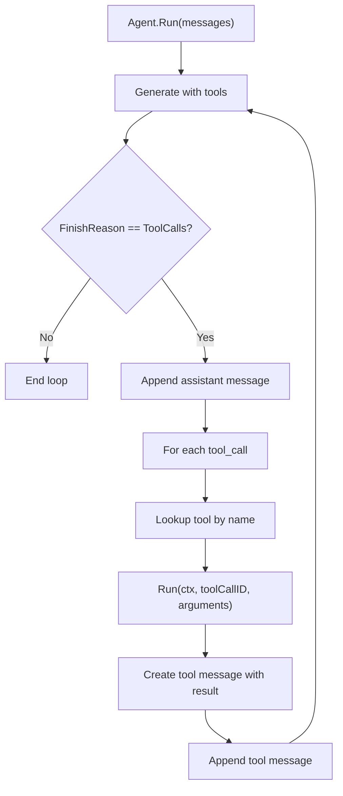

**Diagram sources**
- [llmagent.go:59-124](file://agent/llmagent/llmagent.go#L59-L124)
- [llmagent.go:127-147](file://agent/llmagent/llmagent.go#L127-L147)

**Section sources**
- [llmagent.go:59-147](file://agent/llmagent/llmagent.go#L59-L147)

### Tool Composition Strategies
- Agent-as-tool:
  - Wrap an agent as a tool so it can be invoked by another agent
  - The wrapper parses a task argument and streams the agent’s final assistant response
- Echo tool:
  - Demonstrates minimal input schema and direct passthrough behavior

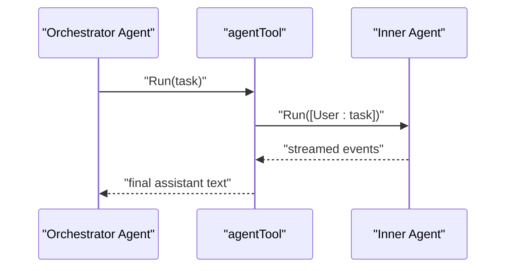

**Diagram sources**
- [agentool.go:54-78](file://agent/agentool/agentool.go#L54-L78)

**Section sources**
- [agentool.go:16-79](file://agent/agentool/agentool.go#L16-L79)
- [echo.go:1-47](file://tool/builtin/echo.go#L1-L47)

### Error Handling and Result Processing
- Built-in tools:
  - Echo returns an error if arguments JSON cannot be parsed
- MCP tools:
  - Arguments parsing errors are wrapped with context
  - CallTool errors are wrapped; tool errors are detected via IsError and surfaced as errors
  - Extracted text content is joined from multiple text parts
- Agent tool:
  - Parsing errors are wrapped with context; agent runtime errors are propagated
- Agent execution:
  - Unknown tool names produce tool messages indicating missing tool
  - Errors from tool execution are formatted into tool messages

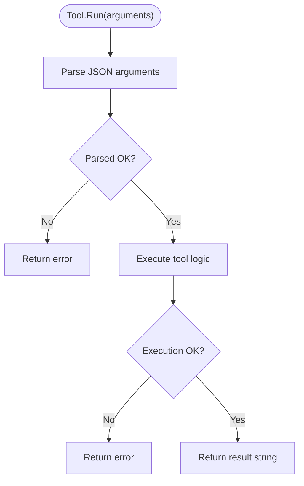

**Diagram sources**
- [echo.go:40-46](file://tool/builtin/echo.go#L40-L46)
- [mcp.go:92-109](file://tool/mcp/mcp.go#L92-L109)
- [agentool.go:57-78](file://agent/agentool/agentool.go#L57-L78)
- [llmagent.go:127-147](file://agent/llmagent/llmagent.go#L127-L147)

**Section sources**
- [echo.go:40-46](file://tool/builtin/echo.go#L40-L46)
- [mcp.go:92-121](file://tool/mcp/mcp.go#L92-L121)
- [agentool.go:57-78](file://agent/agentool/agentool.go#L57-L78)
- [llmagent.go:127-147](file://agent/llmagent/llmagent.go#L127-L147)

### Practical Examples

#### Custom Tool Development
- Define a request struct with a single field and jsonschema tags
- Build an InputSchema using jsonschema.ForType
- Implement Tool with Definition and Run
- Validate arguments by unmarshalling into the request struct inside Run

Reference paths:
- [echo.go:18-34](file://tool/builtin/echo.go#L18-L34)
- [echo.go:40-46](file://tool/builtin/echo.go#L40-L46)

#### MCP Tool Integration
- Create a transport (e.g., StreamableClientTransport or StdioTransport)
- Instantiate ToolSet, connect, and discover tools
- Pass discovered tools to the agent configuration
- Run the agent; tool calls are executed automatically

Reference paths:
- [mcp.go:22-80](file://tool/mcp/mcp.go#L22-L80)
- [mcp.go:46-72](file://tool/mcp/mcp.go#L46-L72)
- [mcp_test.go:44-100](file://tool/mcp/mcp_test.go#L44-L100)
- [main.go:68-123](file://examples/chat/main.go#L68-L123)

#### Tool Execution Patterns
- Agent resolves tools by name and executes Run with toolCallID and arguments
- Tool results are appended as tool messages and fed back into the LLM

Reference paths:
- [llmagent.go:127-147](file://agent/llmagent/llmagent.go#L127-L147)

## Dependency Analysis
- tool depends on google/jsonschema-go for schema compilation and validation
- tool/mcp depends on github.com/modelcontextprotocol/go-sdk/mcp for MCP client and session management
- agent/llmagent depends on tool for tool interface and registration
- agent/agentool depends on tool and agent for wrapping agents as tools
- examples/chat demonstrates MCP transport configuration and tool discovery

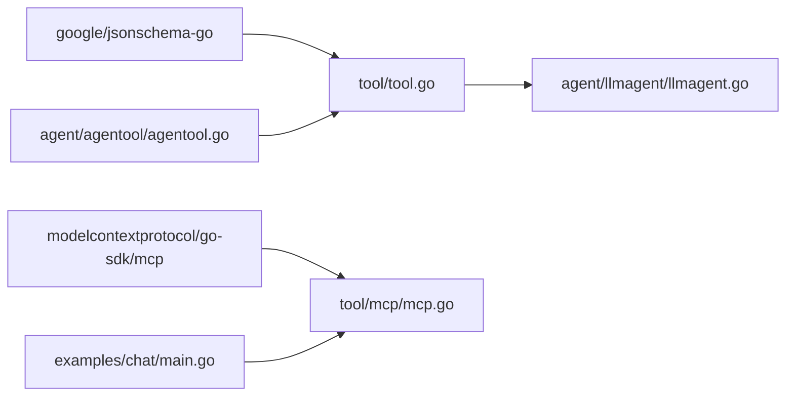

**Diagram sources**
- [tool.go:3-7](file://tool/tool.go#L3-L7)
- [mcp.go:3-12](file://tool/mcp/mcp.go#L3-L12)
- [llmagent.go:8-11](file://agent/llmagent/llmagent.go#L8-L11)
- [agentool.go:3-14](file://agent/agentool/agentool.go#L3-L14)
- [main.go:68-87](file://examples/chat/main.go#L68-L87)

**Section sources**
- [tool.go:3-7](file://tool/tool.go#L3-L7)
- [mcp.go:3-12](file://tool/mcp/mcp.go#L3-L12)
- [llmagent.go:8-11](file://agent/llmagent/llmagent.go#L8-L11)
- [agentool.go:3-14](file://agent/agentool/agentool.go#L3-L14)
- [main.go:68-87](file://examples/chat/main.go#L68-L87)

## Performance Considerations
- Schema compilation cost:
  - Build InputSchema once per tool during initialization; reuse compiled schemas
- JSON marshalling/unmarshalling:
  - Minimize allocations by reusing buffers where possible; avoid repeated round-trips
- MCP round-trips:
  - Batch tool calls when feasible; reduce network latency by connecting once and reusing sessions
- Streaming:
  - Leverage agent streaming to yield partial results early; avoid blocking on long-running tools
- Memory:
  - Avoid retaining large intermediate results; keep tool results concise and text-based for MCP

[No sources needed since this section provides general guidance]

## Troubleshooting Guide
- Tool not found:
  - Ensure the tool name matches exactly; agent tool lookup is by name
- Arguments JSON invalid:
  - Verify the arguments JSON matches the tool’s InputSchema; built-in tools return errors on parse failures
- MCP connection errors:
  - Confirm transport configuration and endpoint; check credentials and network connectivity
- MCP tool errors:
  - Inspect IsError flag and extracted text content; wrap errors with context for easier diagnosis
- Agent tool wrapper errors:
  - Validate task argument structure; ensure the wrapped agent runs to completion and yields a final assistant message

**Section sources**
- [llmagent.go:127-147](file://agent/llmagent/llmagent.go#L127-L147)
- [echo.go:40-46](file://tool/builtin/echo.go#L40-L46)
- [mcp.go:92-121](file://tool/mcp/mcp.go#L92-L121)
- [agentool.go:57-78](file://agent/agentool/agentool.go#L57-L78)

## Conclusion
The ADK tool system provides a clean, provider-agnostic interface for tools, robust JSON schema validation, and seamless integration with MCP servers. Built-in tools like Echo illustrate minimal implementation patterns, while MCP ToolSet enables dynamic discovery and invocation of external tools. Composition strategies, such as wrapping agents as tools, enable powerful orchestration patterns. Proper error handling and result processing ensure reliable tool execution within the agent loop.

[No sources needed since this section summarizes without analyzing specific files]

## Appendices

### Tool Interface Reference
- Definition():
  - Returns tool metadata including Name, Description, and InputSchema
- Run(ctx, toolCallID, arguments):
  - Executes the tool with validated JSON arguments and returns a string result

**Section sources**
- [tool.go:17-23](file://tool/tool.go#L17-L23)

### MCP Integration Reference
- Transport configuration:
  - Use StreamableClientTransport or StdioTransport depending on server deployment
- Connection and discovery:
  - Connect once, then call Tools to enumerate server tools
- Execution:
  - Arguments are passed as JSON; results are text content extracted from the tool response

**Section sources**
- [mcp.go:22-80](file://tool/mcp/mcp.go#L22-L80)
- [mcp.go:46-72](file://tool/mcp/mcp.go#L46-L72)
- [mcp.go:92-121](file://tool/mcp/mcp.go#L92-L121)
- [mcp_test.go:44-100](file://tool/mcp/mcp_test.go#L44-L100)
- [main.go:68-123](file://examples/chat/main.go#L68-L123)