# Examples & Tutorials

<cite>
**Referenced Files in This Document**
- [examples/chat/main.go](file://examples/chat/main.go)
- [tool/mcp/mcp.go](file://tool/mcp/mcp.go)
- [agent/llmagent/llmagent.go](file://agent/llmagent/llmagent.go)
- [runner/runner.go](file://runner/runner.go)
- [session/memory/session_service.go](file://session/memory/session_service.go)
- [session/memory/session.go](file://session/memory/session.go)
- [model/openai/openai.go](file://model/openai/openai.go)
- [model/anthropic/anthropic.go](file://model/anthropic/anthropic.go)
- [model/gemini/gemini.go](file://model/gemini/gemini.go)
- [model/model.go](file://model/model.go)
- [agent/sequential/sequential.go](file://agent/sequential/sequential.go)
- [agent/parallel/parallel.go](file://agent/parallel/parallel.go)
- [tool/tool.go](file://tool/tool.go)
- [tool/builtin/echo.go](file://tool/builtin/echo.go)
- [README.md](file://README.md)
- [go.mod](file://go.mod)
- [tool/mcp/mcp_test.go](file://tool/mcp/mcp_test.go)
- [agent/llmagent/llmagent_test.go](file://agent/llmagent/llmagent_test.go)
</cite>

## Update Summary
**Changes Made**
- Added comprehensive documentation for multi-modal input capabilities using model.ContentPart structures
- Expanded provider support documentation covering OpenAI, Anthropic, and Gemini implementations
- Enhanced streaming response handling documentation with reasoning content support
- Added agent composition patterns documentation for sequential and parallel agent workflows
- Updated examples to demonstrate multi-modal chat scenarios combining text and image inputs

## Table of Contents
1. [Introduction](#introduction)
2. [Project Structure](#project-structure)
3. [Core Components](#core-components)
4. [Architecture Overview](#architecture-overview)
5. [Detailed Component Analysis](#detailed-component-analysis)
6. [Multi-Modal Input Support](#multi-modal-input-support)
7. [Enhanced Streaming Capabilities](#enhanced-streaming-capabilities)
8. [Agent Composition Patterns](#agent-composition-patterns)
9. [Provider Support Matrix](#provider-support-matrix)
10. [Dependency Analysis](#dependency-analysis)
11. [Performance Considerations](#performance-considerations)
12. [Troubleshooting Guide](#troubleshooting-guide)
13. [Conclusion](#conclusion)
14. [Appendices](#appendices)

## Introduction
This document provides a comprehensive tutorial for the example chat application and related patterns in the Agent Development Kit (ADK). It explains how to set up, configure, and run the example chat agent that integrates with an MCP server (specifically Exa) to perform web search. The example now showcases expanded provider support, agent composition patterns, and enhanced streaming capabilities, including multi-modal input examples combining text and image inputs using model.ContentPart structures. It covers MCP tool integration, streaming response handling, UI design considerations for terminal-based chat, and best practices for building extensible agents. Variations and extensions are included, such as adding custom tools, implementing different UI patterns, and integrating with web frameworks.

## Project Structure
The example lives under examples/chat and orchestrates:
- An LLM provider (OpenAI) via the OpenAI adapter
- An MCP ToolSet that connects to an MCP server and exposes tools
- An LlmAgent that performs tool-call loops
- A Runner that manages sessions and streams messages
- An in-memory session backend for persistence
- Multi-modal input support through ContentPart structures

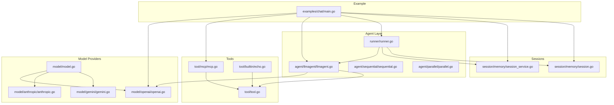

**Diagram sources**
- [examples/chat/main.go:1-181](file://examples/chat/main.go#L1-L181)
- [agent/llmagent/llmagent.go:1-159](file://agent/llmagent/llmagent.go#L1-L159)
- [runner/runner.go:1-102](file://runner/runner.go#L1-L102)
- [model/openai/openai.go:1-362](file://model/openai/openai.go#L1-L362)
- [model/anthropic/anthropic.go:1-326](file://model/anthropic/anthropic.go#L1-L326)
- [model/gemini/gemini.go:1-478](file://model/gemini/gemini.go#L1-L478)
- [model/model.go:1-227](file://model/model.go#L1-L227)
- [agent/sequential/sequential.go:1-93](file://agent/sequential/sequential.go#L1-L93)
- [agent/parallel/parallel.go:1-175](file://agent/parallel/parallel.go#L1-L175)
- [tool/mcp/mcp.go:1-121](file://tool/mcp/mcp.go#L1-L121)
- [tool/tool.go:1-24](file://tool/tool.go#L1-L24)
- [tool/builtin/echo.go:1-47](file://tool/builtin/echo.go#L1-L47)
- [session/memory/session_service.go:1-41](file://session/memory/session_service.go#L1-L41)
- [session/memory/session.go:1-86](file://session/memory/session.go#L1-L86)

**Section sources**
- [README.md:35-82](file://README.md#L35-L82)
- [go.mod:1-47](file://go.mod#L1-L47)

## Core Components
- Example chat application: Orchestrates LLM, MCP tools, agent, runner, and session to provide a terminal chat loop with multi-modal support.
- LlmAgent: Stateless agent that generates assistant replies and executes tool calls automatically until a stop response, supporting streaming and reasoning content.
- Runner: Stateful orchestrator that loads session history, persists messages, and streams agent/tool outputs with enhanced streaming capabilities.
- Multi-provider LLM adapters: Provider-agnostic LLM implementations for OpenAI, Anthropic, and Gemini-compatible APIs with comprehensive multi-modal support.
- MCP ToolSet: Connects to an MCP server, lists tools, and wraps them as tool.Tool instances.
- In-memory session service: Zero-config session backend for quick iteration and testing.
- Agent composition: Sequential and parallel agent patterns for complex multi-step workflows.

**Section sources**
- [examples/chat/main.go:52-173](file://examples/chat/main.go#L52-L173)
- [agent/llmagent/llmagent.go:13-159](file://agent/llmagent/llmagent.go#L13-L159)
- [runner/runner.go:17-102](file://runner/runner.go#L17-L102)
- [model/openai/openai.go:17-362](file://model/openai/openai.go#L17-L362)
- [model/anthropic/anthropic.go:17-326](file://model/anthropic/anthropic.go#L17-L326)
- [model/gemini/gemini.go:17-478](file://model/gemini/gemini.go#L17-L478)
- [tool/mcp/mcp.go:15-121](file://tool/mcp/mcp.go#L15-L121)
- [session/memory/session_service.go:10-41](file://session/memory/session_service.go#L10-L41)

## Architecture Overview
The example follows a clean separation with enhanced multi-modal and composition capabilities:
- Runner owns session state and persists every message
- Agent is stateless and yields messages incrementally with reasoning content
- LLM providers adapt to OpenAI, Anthropic, and Gemini-compatible APIs with comprehensive multi-modal support
- MCP tools are dynamically discovered and integrated
- Agent composition patterns enable complex workflows through sequential and parallel execution

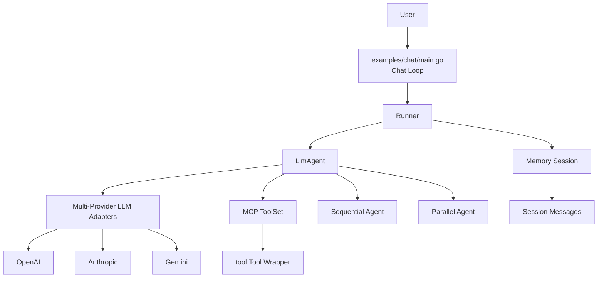

**Diagram sources**
- [examples/chat/main.go:125-167](file://examples/chat/main.go#L125-L167)
- [runner/runner.go:39-89](file://runner/runner.go#L39-L89)
- [agent/llmagent/llmagent.go:51-105](file://agent/llmagent/llmagent.go#L51-L105)
- [model/openai/openai.go:42-76](file://model/openai/openai.go#L42-L76)
- [model/anthropic/anthropic.go:42-93](file://model/anthropic/anthropic.go#L42-L93)
- [model/gemini/gemini.go:66-106](file://model/gemini/gemini.go#L66-L106)
- [tool/mcp/mcp.go:45-72](file://tool/mcp/mcp.go#L45-L72)
- [session/memory/session.go:12-86](file://session/memory/session.go#L12-L86)
- [agent/sequential/sequential.go:46-91](file://agent/sequential/sequential.go#L46-L91)
- [agent/parallel/parallel.go:112-173](file://agent/parallel/parallel.go#L112-L173)

## Detailed Component Analysis

### Example Chat Application Walkthrough
Step-by-step implementation highlights:
- Environment configuration for LLM and optional MCP authentication
- MCP transport setup and connection
- Tool discovery and registration
- Agent creation with tools and instructions
- Session initialization and runner creation
- Interactive chat loop with streaming-like behavior and multi-modal support

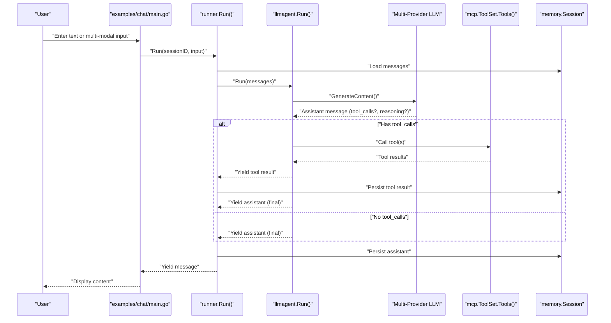

**Diagram sources**
- [examples/chat/main.go:125-167](file://examples/chat/main.go#L125-L167)
- [runner/runner.go:39-89](file://runner/runner.go#L39-L89)
- [agent/llmagent/llmagent.go:51-105](file://agent/llmagent/llmagent.go#L51-L105)
- [model/openai/openai.go:42-76](file://model/openai/openai.go#L42-L76)
- [tool/mcp/mcp.go:45-72](file://tool/mcp/mcp.go#L45-L72)
- [session/memory/session.go:30-33](file://session/memory/session.go#L30-L33)

**Section sources**
- [examples/chat/main.go:52-173](file://examples/chat/main.go#L52-L173)

### MCP Tool Integration
Key implementation patterns:
- Transport creation with optional authenticated HTTP client
- Connection establishment and tool enumeration
- Dynamic wrapping of MCP tools into tool.Tool
- Argument marshalling/unmarshalling and error propagation

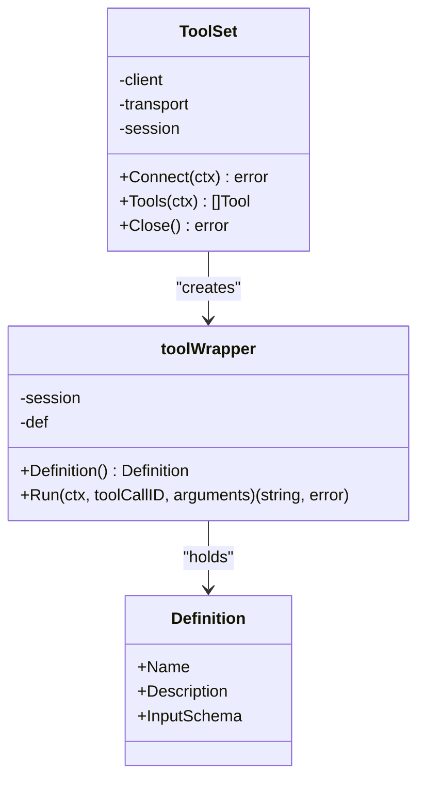

**Diagram sources**
- [tool/mcp/mcp.go:15-121](file://tool/mcp/mcp.go#L15-L121)
- [tool/tool.go:9-24](file://tool/tool.go#L9-L24)

**Section sources**
- [tool/mcp/mcp.go:35-121](file://tool/mcp/mcp.go#L35-L121)
- [tool/mcp/mcp_test.go:44-100](file://tool/mcp/mcp_test.go#L44-L100)

### Streaming Response Handling
- The agent yields each message incrementally via an iterator, enabling streaming-like output
- The example prints assistant content as it arrives and shows tool invocation prompts
- Runner persists each yielded message immediately, ensuring continuity across iterations
- Enhanced streaming now supports reasoning content alongside text content

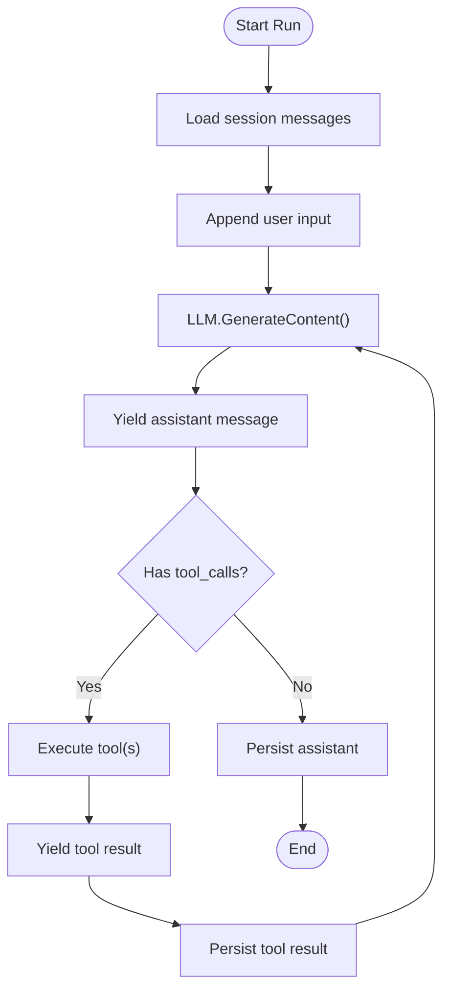

**Diagram sources**
- [runner/runner.go:39-89](file://runner/runner.go#L39-L89)
- [agent/llmagent/llmagent.go:51-105](file://agent/llmagent/llmagent.go#L51-L105)

**Section sources**
- [runner/runner.go:39-102](file://runner/runner.go#L39-L102)
- [agent/llmagent/llmagent.go:51-159](file://agent/llmagent/llmagent.go#L51-L159)

### UI Design Considerations for Terminal Chat
- Clear role-based output: prefix assistant/tool outputs distinctly
- Tool-call indication: announce tool names before printing tool results
- Graceful exit handling: recognize exit/quit commands
- Incremental printing: print assistant content as it becomes available
- Multi-modal display: handle both text and image content appropriately

**Section sources**
- [examples/chat/main.go:125-167](file://examples/chat/main.go#L125-L167)

### Adding Custom Tools
- Define a tool with a JSON Schema input definition
- Implement the tool.Tool interface
- Register the tool with the agent's tool list

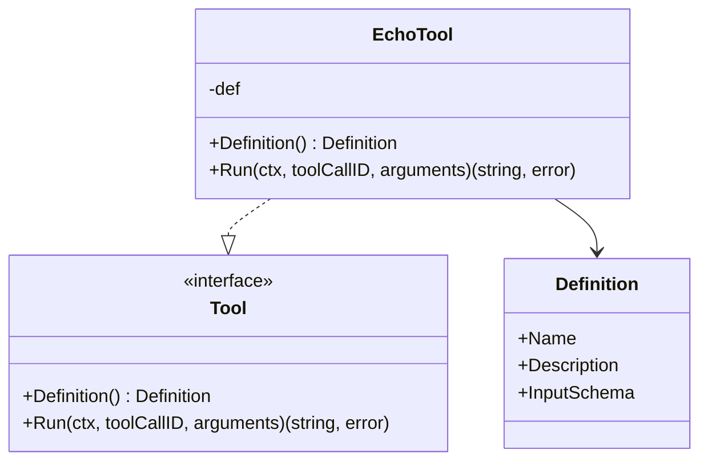

**Diagram sources**
- [tool/tool.go:17-24](file://tool/tool.go#L17-L24)
- [tool/builtin/echo.go:14-47](file://tool/builtin/echo.go#L14-L47)

**Section sources**
- [tool/tool.go:9-24](file://tool/tool.go#L9-L24)
- [tool/builtin/echo.go:22-47](file://tool/builtin/echo.go#L22-L47)

### Integrating with Web Frameworks
- Replace the terminal chat loop with HTTP handlers
- Use the Runner to process requests and stream responses
- Maintain session IDs per user/connection
- Consider middleware for authentication and rate limiting

### Variations and Extensions
- Multiple providers: Swap the OpenAI adapter for other providers supported by the model interface
- Persistent sessions: Use the database session backend instead of in-memory
- Parallel agents: Compose multiple agents to handle specialized tasks concurrently
- Reasoning models: Configure reasoning effort or enable thinking toggles via GenerateConfig
- Multi-modal agents: Combine text and image inputs using ContentPart structures

**Section sources**
- [README.md:157-231](file://README.md#L157-L231)
- [model/openai/openai.go:191-216](file://model/openai/openai.go#L191-L216)

## Multi-Modal Input Support

### ContentPart Structures
The ADK now supports multi-modal inputs through the ContentPart structure, enabling agents to process combinations of text and images:

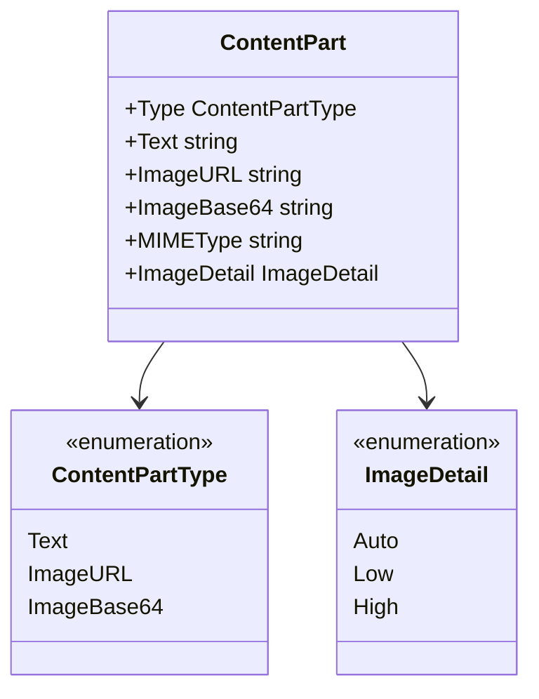

**Diagram sources**
- [model/model.go:86-128](file://model/model.go#L86-L128)

### Provider Implementations
All major providers now support multi-modal inputs:

- **OpenAI**: Supports text and image URLs with detail control
- **Anthropic**: Supports text and base64-encoded images with MIME types
- **Gemini**: Comprehensive multi-modal support with reasoning content

**Section sources**
- [model/model.go:109-128](file://model/model.go#L109-L128)
- [model/openai/openai.go:185-210](file://model/openai/openai.go#L185-L210)
- [model/anthropic/anthropic.go:157-184](file://model/anthropic/anthropic.go#L157-L184)
- [model/gemini/gemini.go:277-324](file://model/gemini/gemini.go#L277-L324)

### Multi-Modal Chat Scenarios
The example now demonstrates how to combine text and image inputs:

- **Mixed modalities**: Users can send both text queries and image attachments
- **Image URLs**: Direct HTTPS URL references for remote images
- **Base64 encoding**: Raw image data with MIME type specification
- **Detail control**: Automatic, low, or high resolution processing

**Section sources**
- [examples/chat/main.go:144-171](file://examples/chat/main.go#L144-L171)
- [model/model.go:111-128](file://model/model.go#L111-L128)

## Enhanced Streaming Capabilities

### Streaming with Reasoning Content
The enhanced streaming now supports reasoning content alongside text:

- **OpenAI**: Streams both text and reasoning content for compatible models
- **Gemini**: Comprehensive streaming with reasoning content and tool calls
- **Anthropic**: Text streaming with thinking blocks for reasoning models

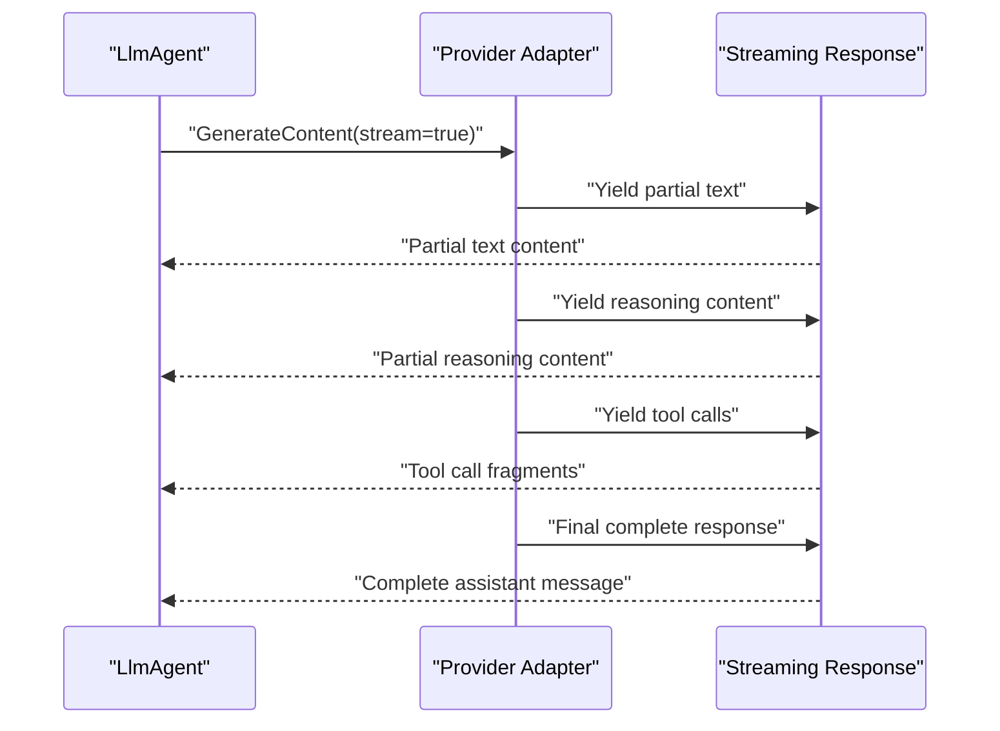

**Diagram sources**
- [agent/llmagent/llmagent.go:81-94](file://agent/llmagent/llmagent.go#L81-L94)
- [model/gemini/gemini.go:115-179](file://model/gemini/gemini.go#L115-L179)
- [model/openai/openai.go:96-163](file://model/openai/openai.go#L96-L163)

### Streaming Configuration
- **Stream flag**: Controls whether streaming is enabled in LlmAgent
- **Partial events**: Incremental content delivery for responsive UIs
- **Complete events**: Final assembled messages for persistence
- **Reasoning content**: Separate streaming channel for internal model reasoning

**Section sources**
- [agent/llmagent/llmagent.go:24-27](file://agent/llmagent/llmagent.go#L24-L27)
- [model/model.go:214-227](file://model/model.go#L214-L227)
- [model/gemini/gemini.go:108-179](file://model/gemini/gemini.go#L108-L179)

## Agent Composition Patterns

### Sequential Agent Pattern
The SequentialAgent runs agents one after another, passing complete messages as context:

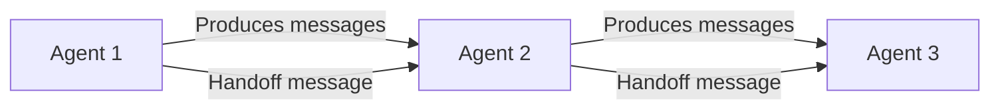

**Diagram sources**
- [agent/sequential/sequential.go:46-91](file://agent/sequential/sequential.go#L46-L91)

### Parallel Agent Pattern
The ParallelAgent runs multiple agents concurrently and merges their outputs:

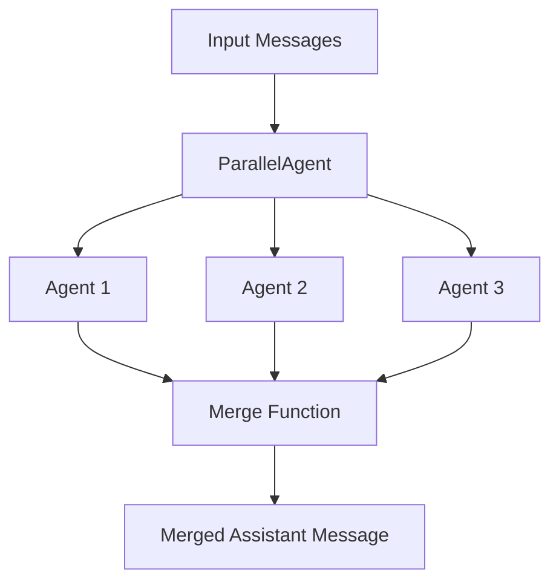

**Diagram sources**
- [agent/parallel/parallel.go:112-173](file://agent/parallel/parallel.go#L112-L173)

### Composition Use Cases
- **Research pipeline**: Research → Draft → Review workflow
- **Multi-model comparison**: Compare responses from different LLMs
- **Specialized tasks**: Translator + summarizer + classifier pipeline
- **Error resilience**: Parallel execution with fallback mechanisms

**Section sources**
- [agent/sequential/sequential.go:26-29](file://agent/sequential/sequential.go#L26-L29)
- [agent/parallel/parallel.go:82-85](file://agent/parallel/parallel.go#L82-L85)

## Provider Support Matrix

### Multi-Modal Support
| Feature | OpenAI | Anthropic | Gemini |
|---------|--------|-----------|--------|
| Text-only | ✅ | ✅ | ✅ |
| Image URLs | ✅ | ❌ | ✅ |
| Base64 Images | ❌ | ✅ | ✅ |
| Mixed Modalities | ✅ | ✅ | ✅ |
| Reasoning Content | ✅ | ✅ | ✅ |
| Streaming | ✅ | ❌ | ✅ |

### Advanced Features
- **OpenAI**: Tool calls, reasoning effort, thinking toggles
- **Anthropic**: Thinking configuration, tool use blocks
- **Gemini**: Comprehensive thinking, streaming, multi-modal

**Section sources**
- [model/openai/openai.go:167-210](file://model/openai/openai.go#L167-L210)
- [model/anthropic/anthropic.go:149-184](file://model/anthropic/anthropic.go#L149-L184)
- [model/gemini/gemini.go:277-324](file://model/gemini/gemini.go#L277-L324)

## Dependency Analysis
External libraries and their roles:
- OpenAI SDK for chat completions
- Anthropic SDK for messages API
- Google Gemini SDK for multimodal content
- MCP SDK for connecting to Model Context Protocol servers
- JSON schema library for tool input validation
- SQLite and sqlx for persistent session storage
- Snowflake for distributed message IDs

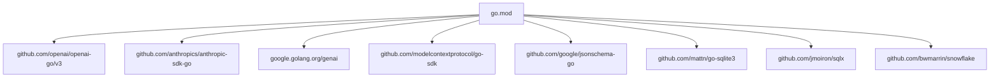

**Diagram sources**
- [go.mod:5-15](file://go.mod#L5-L15)

**Section sources**
- [go.mod:1-47](file://go.mod#L1-L47)

## Performance Considerations
- Streaming iteration: The iterator-based design avoids buffering entire responses
- Minimal allocations: Reuse slices and avoid unnecessary copies
- Session compaction: Archive old messages to reduce payload sizes for long conversations
- Provider tuning: Adjust temperature, max tokens, and reasoning effort thoughtfully
- Multi-modal optimization: Efficient image processing and caching strategies
- Agent composition: Parallel execution for improved throughput

**Section sources**
- [README.md:212-231](file://README.md#L212-L231)
- [model/openai/openai.go:191-216](file://model/openai/openai.go#L191-L216)

## Troubleshooting Guide
Common issues and resolutions:
- Missing environment variables: Ensure required keys are set before running the example
- MCP connectivity: Verify endpoint and authentication headers; check network access
- Tool invocation errors: Inspect tool argument JSON and schema; confirm tool availability
- Session persistence failures: Confirm session service initialization and permissions
- Multi-modal errors: Validate image URLs, base64 encoding, and MIME types
- Provider-specific issues: Check model compatibility and API limits

**Section sources**
- [examples/chat/main.go:56-60](file://examples/chat/main.go#L56-L60)
- [tool/mcp/mcp.go:36-43](file://tool/mcp/mcp.go#L36-L43)
- [tool/mcp/mcp_test.go:44-100](file://tool/mcp/mcp_test.go#L44-L100)
- [runner/runner.go:92-101](file://runner/runner.go#L92-L101)

## Conclusion
The example demonstrates a production-ready pattern for building chat agents with dynamic tooling via MCP, streaming output, and flexible session backends. The enhanced multi-modal capabilities now support sophisticated scenarios combining text and image inputs across multiple providers. Agent composition patterns enable complex workflows through sequential and parallel execution. By separating stateful orchestration from stateless agent logic, the system remains extensible and maintainable. The patterns shown here can be adapted to various UIs and deployment environments, including web frameworks, while preserving robust error handling and performance characteristics.

## Appendices

### Setup and Configuration Checklist
- Set environment variables for the LLM provider
- Optionally set MCP authentication for the server
- Configure multi-modal inputs (image URLs or base64 data)
- Run the example and observe tool discovery and chat loop behavior

**Section sources**
- [examples/chat/main.go:3-12](file://examples/chat/main.go#L3-L12)

### Best Practices Demonstrated
- Provider-agnostic design enables easy switching between LLM providers
- Iterator-based streaming supports responsive UIs
- Tool schemas enforce correct argument passing
- Session compaction keeps long histories manageable
- Multi-modal inputs enhance user interaction capabilities
- Agent composition enables complex workflow automation

**Section sources**
- [README.md:14-24](file://README.md#L14-L24)
- [README.md:212-231](file://README.md#L212-L231)
- [model/model.go:109-128](file://model/model.go#L109-L128)
- [agent/sequential/sequential.go:46-91](file://agent/sequential/sequential.go#L46-L91)
- [agent/parallel/parallel.go:112-173](file://agent/parallel/parallel.go#L112-L173)