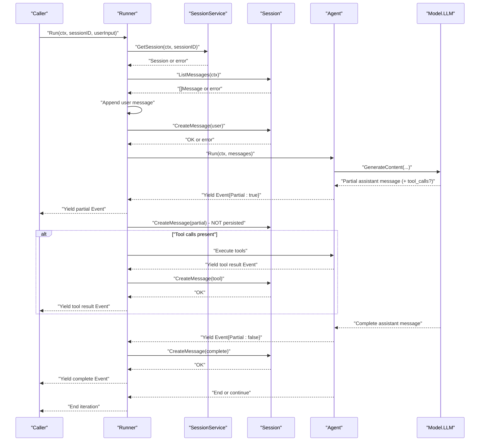
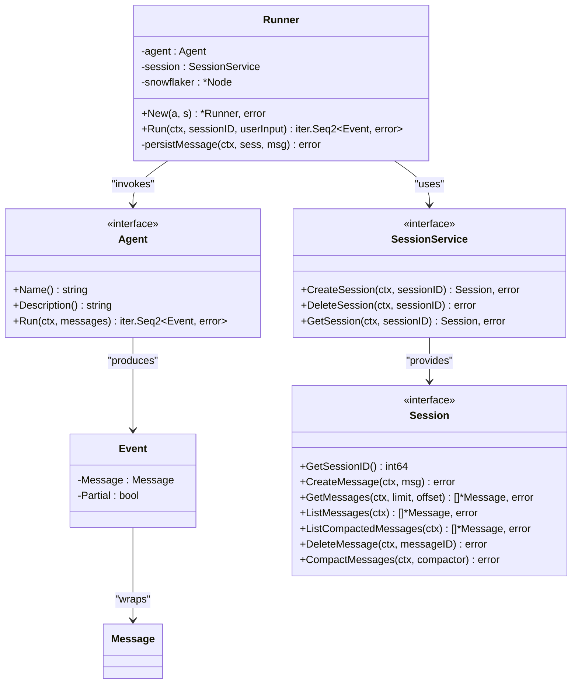
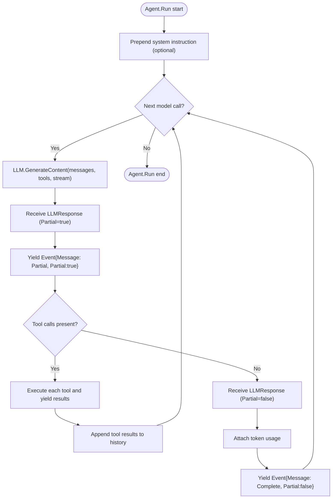
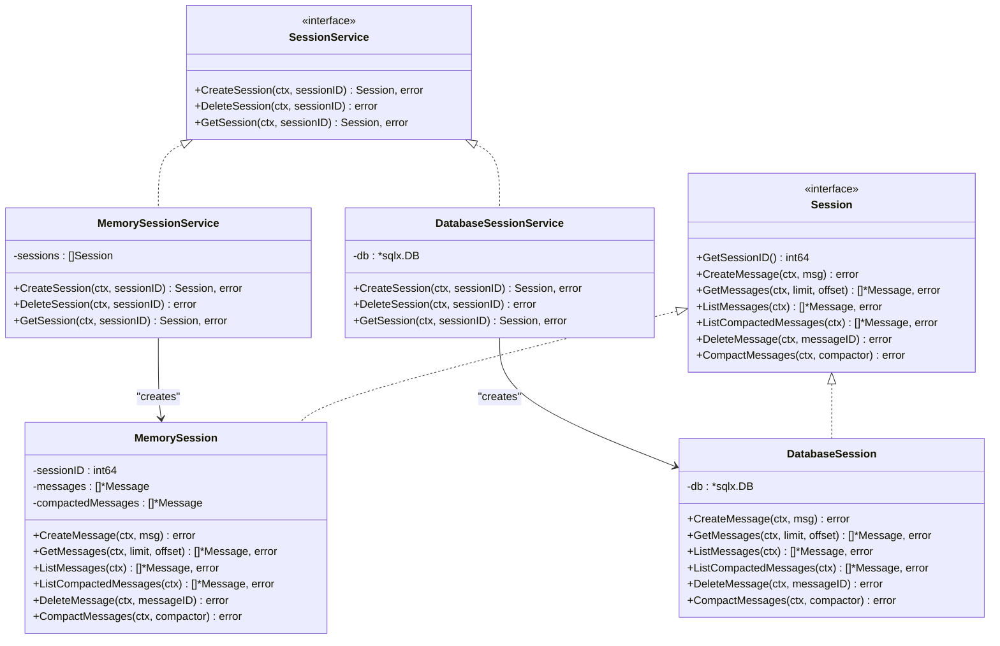
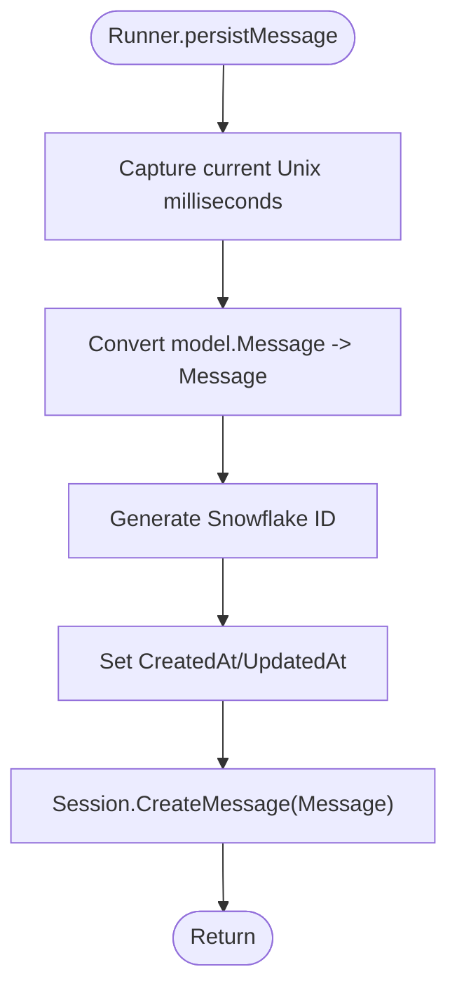
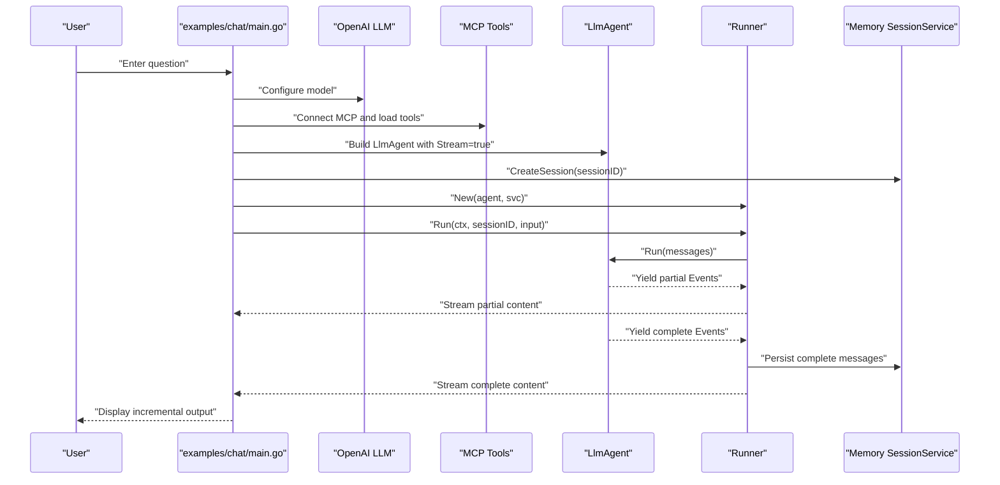
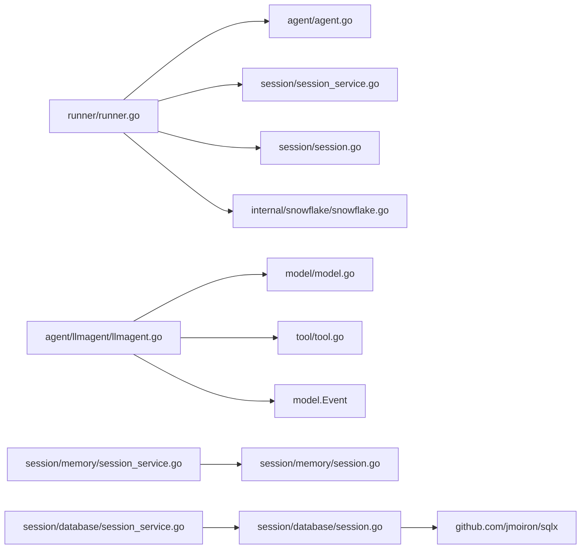

# Execution Orchestration

<cite>
**Referenced Files in This Document**
- [runner.go](file://runner/runner.go)
- [runner_test.go](file://runner/runner_test.go)
- [agent.go](file://agent/agent.go)
- [llmagent.go](file://agent/llmagent/llmagent.go)
- [session_service.go](file://session/session_service.go)
- [session.go](file://session/session.go)
- [message.go](file://session/message/message.go)
- [memory_session_service.go](file://session/memory/session_service.go)
- [memory_session.go](file://session/memory/session.go)
- [database_session_service.go](file://session/database/session_service.go)
- [database_session.go](file://session/database/session.go)
- [snowflake.go](file://internal/snowflake/snowflake.go)
- [model.go](file://model/model.go)
- [main.go](file://examples/chat/main.go)
- [README.md](file://README.md)
</cite>

## Update Summary
**Changes Made**
- Updated Agent interface documentation to reflect event-based iteration system
- Revised Runner documentation to explain Event structure with Partial flag
- Added comprehensive coverage of streaming capabilities and real-time display vs complete message persistence
- Updated examples to demonstrate partial vs complete event handling
- Enhanced streaming workflow documentation with new Event.Partial semantics

## Table of Contents
1. [Introduction](#introduction)
2. [Project Structure](#project-structure)
3. [Core Components](#core-components)
4. [Architecture Overview](#architecture-overview)
5. [Detailed Component Analysis](#detailed-component-analysis)
6. [Dependency Analysis](#dependency-analysis)
7. [Performance Considerations](#performance-considerations)
8. [Troubleshooting Guide](#troubleshooting-guide)
9. [Conclusion](#conclusion)
10. [Appendices](#appendices)

## Introduction
This document describes the Execution Orchestration layer centered on the Runner. The Runner is a stateful coordinator that orchestrates Agent and SessionService components to manage conversational turns, stream incremental outputs, persist messages, and propagate errors. It ensures that each user input is appended to the session history, passed to the Agent, and that every yielded Event (assistant replies, tool results, and intermediate steps) is processed according to its Partial flag status. The Runner leverages Go's iterator pattern to stream outputs and uses Snowflake IDs for distributed, time-ordered message identifiers. The new event-based iteration system provides enhanced streaming capabilities with Partial boolean flag support for real-time display versus complete message persistence.

## Project Structure
The execution orchestration spans several packages:
- runner: Orchestrator that wires Agent and SessionService together
- agent: Defines the Agent interface and the LlmAgent implementation
- session: Interfaces and implementations for session storage (memory and database)
- session/message: Persisted message model and conversion helpers
- internal/snowflake: Snowflake node factory for globally unique IDs
- model: Provider-agnostic LLM and message types with Event structure
- examples/chat: Practical end-to-end example integrating Runner, Agent, and Session

```mermaid
graph TB
subgraph "Execution Orchestration"
R["Runner<br/>runner/runner.go"]
end
subgraph "Agent Layer"
A["Agent interface<br/>agent/agent.go"]
LA["LlmAgent<br/>agent/llmagent/llmagent.go"]
E["Event structure<br/>model/model.go"]
end
subgraph "Session Layer"
SS["SessionService interface<br/>session/session_service.go"]
S["Session interface<br/>session/session.go"]
MSG["Message model<br/>session/message/message.go"]
END["Event.Partial flag<br/>Real-time vs persistence"]
end
subgraph "Backends"
MSVC["Memory SessionService<br/>session/memory/session_service.go"]
M["Memory Session<br/>session/memory/session.go"]
DSVC["Database SessionService<br/>session/database/session_service.go"]
D["Database Session<br/>session/database/session.go"]
end
subgraph "Infrastructure"
SF["Snowflake Node<br/>internal/snowflake/snowflake.go"]
MD["Model types<br/>model/model.go"]
END
EX["Example app<br/>examples/chat/main.go"]
R --> A
R --> SS
R --> SF
A --> E
E --> MD
LA --> E
SS --> S
S --> MSG
MSVC --> M
DSVC --> D
EX --> R
EX --> SS
EX --> LA
```

**Diagram sources**
- [runner.go:17-108](file://runner/runner.go#L17-L108)
- [agent.go:10-19](file://agent/agent.go#L10-L19)
- [llmagent.go:56-136](file://agent/llmagent/llmagent.go#L56-L136)
- [model.go:214-227](file://model/model.go#L214-L227)
- [session_service.go:5-9](file://session/session_service.go#L5-L9)
- [session.go:9-24](file://session/session.go#L9-L24)
- [message.go:49-129](file://session/message/message.go#L49-L129)
- [memory_session_service.go:10-40](file://session/memory/session_service.go#L10-L40)
- [memory_session.go:12-85](file://session/memory/session.go#L12-L85)
- [database_session_service.go:19-48](file://session/database/session_service.go#L19-L48)
- [database_session.go:26-145](file://session/database/session.go#L26-L145)
- [snowflake.go:17-56](file://internal/snowflake/snowflake.go#L17-L56)
- [model.go:9-227](file://model/model.go#L9-L227)
- [main.go:52-181](file://examples/chat/main.go#L52-L181)

**Section sources**
- [README.md:35-82](file://README.md#L35-L82)
- [runner.go:17-108](file://runner/runner.go#L17-L108)
- [agent.go:10-19](file://agent/agent.go#L10-L19)
- [session_service.go:5-9](file://session/session_service.go#L5-L9)
- [session.go:9-24](file://session/session.go#L9-L24)
- [message.go:49-129](file://session/message/message.go#L49-L129)
- [snowflake.go:17-56](file://internal/snowflake/snowflake.go#L17-L56)
- [model.go:9-227](file://model/model.go#L9-L227)
- [main.go:52-181](file://examples/chat/main.go#L52-L181)

## Core Components
- Runner: Stateful orchestrator that loads session history, appends user input, invokes the Agent, streams and persists each yielded Event, and yields them to the caller. It distinguishes between partial streaming fragments (for real-time display) and complete events (for persistence) using the Event.Partial flag.
- Agent: Stateless component that consumes a conversation slice and yields Events incrementally. The LlmAgent implements tool-call loops and integrates with model providers, producing both partial streaming fragments and complete messages.
- SessionService and Session: Abstractions for creating, retrieving, and managing sessions; Session exposes message listing and compaction APIs.
- Event structure: The fundamental unit emitted by Agent.Run, containing a Message and Partial flag that determines whether content is streaming text or a complete message.
- Message model: Persisted representation of conversation messages with fields for roles, tool calls, token usage, and soft archival via compaction.
- Snowflake: Distributed ID generator used to assign unique, time-ordered IDs to messages.

Key responsibilities:
- Event-based streaming workflow: User input and agent outputs are processed according to Event.Partial flag - partial events for real-time display, complete events for persistence.
- Streaming response handling: Uses Go iterators to yield Events and errors, enabling incremental processing and early termination with proper partial/complete distinction.
- Error propagation: Errors from session retrieval, message listing, agent execution, and persistence are propagated to the caller via the iterator's error channel.
- Execution loop: Manages a single user turn, including history loading, user input appending, agent invocation, and per-event persistence based on Partial flag.
- Real-time display vs persistence: Partial events (Event.Partial=true) are forwarded to callers for immediate UI updates without persistence; complete events (Event.Partial=false) are persisted to the session.

**Section sources**
- [runner.go:17-108](file://runner/runner.go#L17-L108)
- [agent.go:10-19](file://agent/agent.go#L10-L19)
- [llmagent.go:56-136](file://agent/llmagent/llmagent.go#L56-L136)
- [session_service.go:5-9](file://session/session_service.go#L5-L9)
- [session.go:9-24](file://session/session.go#L9-L24)
- [message.go:49-129](file://session/message/message.go#L49-L129)
- [snowflake.go:17-56](file://internal/snowflake/snowflake.go#L17-L56)
- [model.go:214-227](file://model/model.go#L214-L227)

## Architecture Overview
The Runner sits between the Agent and SessionService, coordinating stateful persistence and streaming output with enhanced event-based iteration. The Agent is stateless and only operates on the messages passed to it, producing Events with Partial flags. Sessions are pluggable (memory or database), supporting soft compaction to archive older messages without deletion.



**Diagram sources**
- [runner.go:39-96](file://runner/runner.go#L39-L96)
- [llmagent.go:78-136](file://agent/llmagent/llmagent.go#L78-L136)
- [session.go:12-24](file://session/session.go#L12-L24)
- [message.go:103-129](file://session/message/message.go#L103-L129)

## Detailed Component Analysis

### Runner
The Runner is the stateful coordinator responsible for:
- Loading session history and preparing the conversation slice
- Appending and persisting the user message
- Invoking the Agent and streaming each yielded Event
- Persisting only complete events (Event.Partial=false) to the session
- Forwarding partial events (Event.Partial=true) for real-time display without persistence
- Assigning Snowflake IDs and timestamps to persisted messages



**Diagram sources**
- [runner.go:20-37](file://runner/runner.go#L20-L37)
- [runner.go:45-96](file://runner/runner.go#L45-L96)
- [agent.go:10-19](file://agent/agent.go#L10-L19)
- [model.go:214-227](file://model/model.go#L214-L227)
- [session_service.go:5-9](file://session/session_service.go#L5-L9)
- [session.go:9-24](file://session/session.go#L9-L24)

Key behaviors:
- Initialization: Creates a Snowflake node and stores references to Agent and SessionService.
- Run lifecycle:
  - Retrieves the session and lists existing messages
  - Appends the user message and persists it
  - Invokes Agent.Run and processes each yielded Event
  - Only persists complete events (Event.Partial=false) to the session
  - Yields all events (partial and complete) to the caller
  - Stops on error or when the iterator is broken by the caller
- Event processing: Distinguishes between partial streaming fragments and complete messages using Event.Partial flag
- Persistence: Uses the Snowflake node to assign IDs and timestamps, then calls Session.CreateMessage only for complete events

Error propagation:
- Errors from GetSession, ListMessages, persistMessage, and Agent.Run are yielded as errors to the caller.

Streaming:
- The iterator allows the caller to process assistant replies and tool results incrementally
- Partial events enable real-time UI updates without persistence overhead
- Complete events ensure message integrity and proper session state

**Section sources**
- [runner.go:26-37](file://runner/runner.go#L26-L37)
- [runner.go:45-96](file://runner/runner.go#L45-L96)
- [runner.go:98-108](file://runner/runner.go#L98-L108)
- [runner_test.go:108-121](file://runner/runner_test.go#L108-L121)
- [runner_test.go:122-143](file://runner/runner_test.go#L122-L143)
- [runner_test.go:313-333](file://runner/runner_test.go#L313-L333)
- [runner_test.go:337-356](file://runner/runner_test.go#L337-L356)

### Agent and LlmAgent
The Agent interface defines a Run method that returns a Go iterator of Events and errors. The LlmAgent is a stateless implementation that:
- Prepends a system instruction if configured
- Calls the underlying model to generate assistant messages with streaming support
- Attaches token usage to complete assistant messages
- Executes tool calls when requested and yields tool results as complete events
- Continues looping until the model signals completion
- Produces partial events for real-time streaming display



**Diagram sources**
- [llmagent.go:78-136](file://agent/llmagent/llmagent.go#L78-L136)

**Section sources**
- [agent.go:10-19](file://agent/agent.go#L10-L19)
- [llmagent.go:14-28](file://agent/llmagent/llmagent.go#L14-L28)
- [llmagent.go:56-136](file://agent/llmagent/llmagent.go#L56-L136)
- [llmagent.go:138-159](file://agent/llmagent/llmagent.go#L138-L159)

### Event System and Streaming
The Event structure is the fundamental unit emitted by Agent.Run, replacing the previous direct message iteration approach. Events contain:
- Message: The actual content being streamed or completed
- Partial: Boolean flag indicating whether content is streaming fragment or complete message

Streaming workflow:
- Partial events (Event.Partial=true): Carry incremental text for real-time display, not persisted to session
- Complete events (Event.Partial=false): Contain fully assembled messages, persisted to session
- Runner persists only complete events, forwarding all events to callers
- Callers can process partial events for immediate UI updates while waiting for complete messages

**Section sources**
- [model.go:214-227](file://model/model.go#L214-L227)
- [runner.go:45-96](file://runner/runner.go#L45-L96)
- [runner_test.go:289-309](file://runner/runner_test.go#L289-L309)
- [runner_test.go:313-333](file://runner/runner_test.go#L313-L333)
- [runner_test.go:337-356](file://runner/runner_test.go#L337-L356)

### Session Management
Sessions encapsulate conversation state and provide:
- Creation and deletion of sessions
- Message creation, listing, pagination, and compaction
- Soft archival of messages via compaction

Backends:
- Memory backend: Stores messages in-memory and supports compaction by summarization.
- Database backend: Persists sessions and messages to SQLite with soft deletion and compaction.



**Diagram sources**
- [session_service.go:5-9](file://session/session_service.go#L5-L9)
- [memory_session_service.go:10-40](file://session/memory/session_service.go#L10-L40)
- [memory_session.go:12-85](file://session/memory/session.go#L12-L85)
- [database_session_service.go:19-48](file://session/database/session_service.go#L19-L48)
- [database_session.go:26-145](file://session/database/session.go#L26-L145)

**Section sources**
- [session_service.go:5-9](file://session/session_service.go#L5-L9)
- [session.go:9-24](file://session/session.go#L9-L24)
- [memory_session_service.go:18-40](file://session/memory/session_service.go#L18-L40)
- [memory_session.go:30-85](file://session/memory/session.go#L30-L85)
- [database_session_service.go:27-48](file://session/database/session_service.go#L27-L48)
- [database_session.go:46-145](file://session/database/session.go#L46-L145)

### Message Persistence Workflow
The Runner persists messages using a Snowflake node to generate unique IDs and timestamps. The persisted message type mirrors the model.Message but adds database-specific fields and JSON serialization for tool calls. The new event-based system ensures that only complete events are persisted, while partial streaming fragments are forwarded for real-time display without persistence.



**Diagram sources**
- [runner.go:98-108](file://runner/runner.go#L98-L108)
- [message.go:103-129](file://session/message/message.go#L103-L129)
- [snowflake.go:17-56](file://internal/snowflake/snowflake.go#L17-L56)

**Section sources**
- [runner.go:98-108](file://runner/runner.go#L98-L108)
- [message.go:49-129](file://session/message/message.go#L49-L129)
- [snowflake.go:17-56](file://internal/snowflake/snowflake.go#L17-L56)

### Example: Chat Application
The example demonstrates initializing an LLM, building an Agent with MCP tools, creating a Runner with an in-memory SessionService, and running a chat loop that streams outputs and handles tool calls. The new event-based system enables real-time streaming with partial events for immediate display and complete events for final persistence.



**Diagram sources**
- [main.go:52-181](file://examples/chat/main.go#L52-L181)
- [llmagent.go:14-28](file://agent/llmagent/llmagent.go#L14-L28)
- [runner.go:26-37](file://runner/runner.go#L26-L37)
- [memory_session_service.go:18-22](file://session/memory/session_service.go#L18-L22)

**Section sources**
- [main.go:52-181](file://examples/chat/main.go#L52-L181)
- [README.md:85-153](file://README.md#L85-L153)

## Dependency Analysis
Runner depends on:
- Agent interface for stateless execution
- SessionService and Session for stateful persistence
- Snowflake node for unique IDs

Agent depends on:
- Model LLM for generation with streaming support
- Tool registry for tool execution
- Event structure for streaming semantics

Session backends depend on:
- Memory slice for in-memory storage
- SQLx for database operations



**Diagram sources**
- [runner.go:10-14](file://runner/runner.go#L10-L14)
- [agent.go:3-8](file://agent/agent.go#L3-L8)
- [llmagent.go:3-11](file://agent/llmagent/llmagent.go#L3-L11)
- [model.go:214-227](file://model/model.go#L214-L227)
- [session_service.go:3](file://session/session_service.go#L3)
- [session.go](file://session/session.go)
- [snowflake.go:8](file://internal/snowflake/snowflake.go#L8)
- [memory_session_service.go:7](file://session/memory/session_service.go#L7)
- [database_session_service.go](file://session/database/session_service.go)
- [database_session.go](file://session/database/session.go)

**Section sources**
- [runner.go:10-14](file://runner/runner.go#L10-L14)
- [agent.go:3-8](file://agent/agent.go#L3-L8)
- [llmagent.go:3-11](file://agent/llmagent/llmagent.go#L3-L11)
- [model.go:214-227](file://model/model.go#L214-L227)
- [session_service.go](file://session/session_service.go)
- [session.go](file://session/session.go)
- [snowflake.go:8](file://internal/snowflake/snowflake.go#L8)
- [memory_session_service.go:7](file://session/memory/session_service.go#L7)
- [database_session_service.go](file://session/database/session_service.go)
- [database_session.go](file://session/database/session.go)

## Performance Considerations
- Enhanced streaming via iterators: Enables low-latency incremental delivery of assistant replies and tool results with partial events for real-time display, reducing perceived latency.
- Partial vs complete distinction: Reduces persistence overhead by only storing complete messages while streaming partial fragments for immediate UI updates.
- Pagination vs. full-list: Use ListMessages when the full history is needed; otherwise, consider GetMessages with limits for large histories.
- Compaction: Archive older messages to reduce payload sizes and improve retrieval performance. The database backend soft-deletes by setting compacted_at timestamps.
- Snowflake IDs: Provide efficient, distributed uniqueness without requiring centralized coordination.
- Early termination: Iterators can be broken early to cancel long-running generations and free resources promptly.
- Concurrency: The Runner itself is single-threaded per turn; scale horizontally by running multiple Runner instances or by sharding sessions.

[No sources needed since this section provides general guidance]

## Troubleshooting Guide
Common issues and resolutions:
- Session not found: Ensure sessions are created before invoking Runner.Run. The memory backend returns nil when a session is missing; handle this gracefully.
- Persistence failures: Verify that Session.CreateMessage succeeds after complete agent outputs. Check timestamps and IDs are set for persisted messages.
- Agent errors: Errors from Agent.Run are propagated; inspect the error and consider retry or fallback strategies.
- Early iteration breaks: The Runner tolerates consumers breaking out of the iterator; ensure partial results are handled appropriately.
- Tool execution errors: Tool errors are surfaced in tool messages; confirm tool availability and arguments.
- Streaming issues: Verify that Event.Partial flag is correctly handled - partial events should not be persisted, complete events should be stored.

**Section sources**
- [runner_test.go:213-231](file://runner/runner_test.go#L213-L231)
- [runner_test.go:233-243](file://runner/runner_test.go#L233-L243)
- [runner_test.go:245-268](file://runner/runner_test.go#L245-L268)
- [runner_test.go:337-356](file://runner/runner_test.go#L337-L356)

## Conclusion
The Runner provides a robust, event-based orchestration layer that cleanly separates stateless Agent logic from stateful session management. The new event-based iteration system with Partial flag support enables enhanced streaming capabilities, allowing real-time display of partial content while ensuring complete message persistence. It persists only complete events atomically per yielded item, propagates errors predictably, and supports scalable deployment through pluggable session backends and horizontal Runner scaling. The example application demonstrates end-to-end usage with real-time streaming, tool integration, and proper event handling.

[No sources needed since this section summarizes without analyzing specific files]

## Appendices

### Configuration Options
- LlmAgent configuration includes name, description, model, tools, instruction, generation parameters, and Stream flag for enabling partial event streaming.
- GenerateConfig supports temperature, reasoning effort, service tier, max tokens, thinking budget, and enablement flags.
- Event.Partial flag controls whether content is streaming fragment or complete message.

**Section sources**
- [llmagent.go:14-28](file://agent/llmagent/llmagent.go#L14-L28)
- [model.go:67-84](file://model/model.go#L67-L84)
- [model.go:214-227](file://model/model.go#L214-L227)

### Monitoring Approaches
- Track token usage attached to assistant messages for cost and performance insights.
- Monitor iteration throughput and latency for Agent.Run and Session.CreateMessage.
- Observe compaction frequency and archived message counts to gauge memory pressure.
- Monitor partial vs complete event ratios to optimize streaming performance.

[No sources needed since this section provides general guidance]

### Scaling Considerations
- Horizontal scaling: Run multiple Runner instances behind a load balancer, shard by sessionID.
- Backends: Prefer the database backend for persistence across restarts and multi-instance deployments.
- Resource management: Limit concurrent runs per Runner; apply backpressure when downstream LLM or tools throttle.
- Streaming optimization: Use partial events for real-time display to reduce persistence overhead.

[No sources needed since this section provides general guidance]

### Integration Patterns
- Web frameworks: Stream Runner outputs over Server-Sent Events or WebSockets to deliver incremental assistant replies and tool results using Event.Partial flag semantics.
- Real-time apps: Use iterators to push partial content chunks to clients as they are yielded for immediate display, while storing complete messages for session continuity.
- Progressive enhancement: Handle both partial and complete events to support both streaming and non-streaming clients.

[No sources needed since this section provides general guidance]