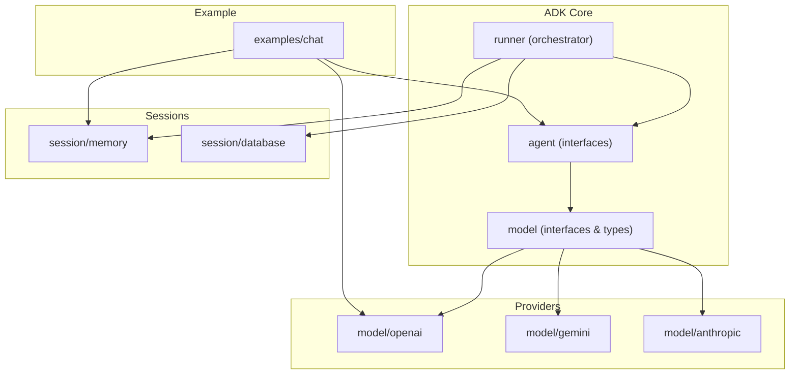
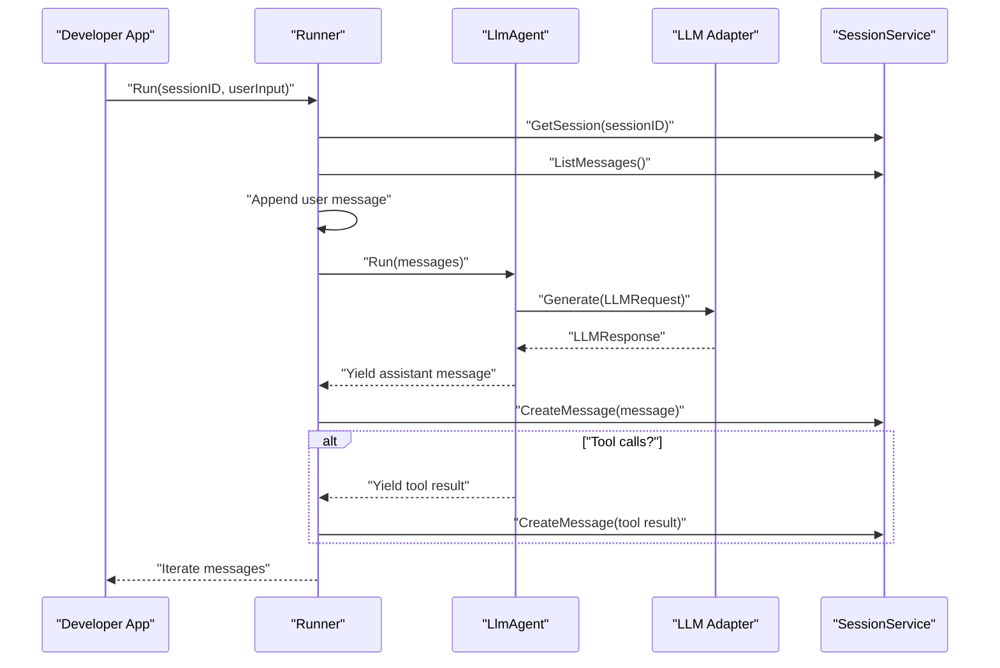
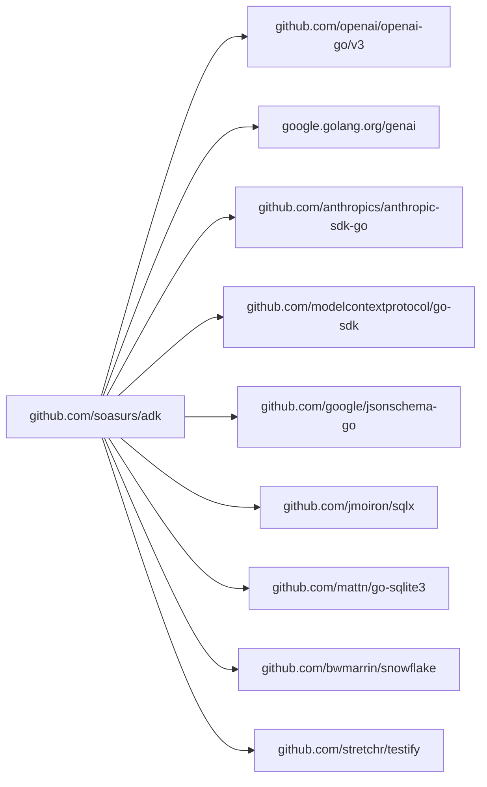

# Installation & Setup

<cite>
**Referenced Files in This Document**
- [README.md](file://README.md)
- [go.mod](file://go.mod)
- [examples/chat/main.go](file://examples/chat/main.go)
- [model/openai/openai.go](file://model/openai/openai.go)
- [model/gemini/gemini.go](file://model/gemini/gemini.go)
- [model/anthropic/anthropic.go](file://model/anthropic/anthropic.go)
- [model/model.go](file://model/model.go)
- [session/memory/session.go](file://session/memory/session.go)
- [session/database/session.go](file://session/database/session.go)
- [runner/runner.go](file://runner/runner.go)
- [agent/llmagent/llmagent.go](file://agent/llmagent/llmagent.go)
- [.gitignore](file://.gitignore)
</cite>

## Update Summary
**Changes Made**
- Updated module path references from `soasurs.dev/soasurs/adk` to `github.com/soasurs/adk`
- Updated installation commands to use the new GitHub module path
- Updated all import statements throughout the documentation to reflect the new module path
- Verified that all code files have been updated to use the new module path

## Table of Contents
1. [Introduction](#introduction)
2. [Project Structure](#project-structure)
3. [Core Components](#core-components)
4. [Architecture Overview](#architecture-overview)
5. [Detailed Component Analysis](#detailed-component-analysis)
6. [Dependency Analysis](#dependency-analysis)
7. [Performance Considerations](#performance-considerations)
8. [Troubleshooting Guide](#troubleshooting-guide)
9. [Conclusion](#conclusion)
10. [Appendices](#appendices)

## Introduction
This guide explains how to install and set up the Agent Development Kit (ADK) in a Go project. It covers:
- Go version requirements
- Module installation using go get
- Environment variable configuration for LLM providers (OpenAI, Gemini, Anthropic)
- Initial project setup and a basic project structure
- Development environment configuration
- Troubleshooting common setup issues and platform-specific considerations
- Best practices for organizing projects that use ADK and integrating with existing Go applications

## Project Structure
ADK is organized as a Go module with provider-agnostic interfaces and pluggable adapters for multiple LLM providers. The key areas you will interact with during setup and development are:
- model: provider-agnostic interfaces and message types
- model/openai, model/gemini, model/anthropic: provider adapters
- agent: agent interfaces and implementations (e.g., LlmAgent)
- session: session interfaces and backends (memory and database)
- runner: orchestrator that wires agents and sessions together
- examples: runnable example showcasing a chat agent with MCP tools

**Diagram sources**
- [model/model.go:9-200](file://model/model.go#L9-L200)
- [agent/llmagent/llmagent.go:13-41](file://agent/llmagent/llmagent.go#L13-L41)
- [runner/runner.go:17-37](file://runner/runner.go#L17-L37)
- [model/openai/openai.go:17-35](file://model/openai/openai.go#L17-L35)
- [model/gemini/gemini.go:16-37](file://model/gemini/gemini.go#L16-L37)
- [model/anthropic/anthropic.go:24-39](file://model/anthropic/anthropic.go#L24-L39)
- [session/memory/session.go:12-24](file://session/memory/session.go#L12-L24)
- [session/database/session.go:26-41](file://session/database/session.go#26-L41)
- [examples/chat/main.go:14-31](file://examples/chat/main.go#L14-L31)

**Section sources**
- [README.md:65-82](file://README.md#L65-L82)
- [go.mod:1-47](file://go.mod#L1-L47)

## Core Components
- Provider-agnostic LLM interface and message types in model
- Provider adapters for OpenAI, Gemini, and Anthropic
- Stateless LlmAgent that drives generation and tool calls
- Runner that manages session history and persists messages
- Session backends: in-memory and SQLite-based persistence

Key capabilities:
- Automatic tool-call loop in LlmAgent
- Pluggable session backends with soft compaction
- Streaming via Go iterators
- Multi-modal input support

**Section sources**
- [README.md:14-24](file://README.md#L14-L24)
- [model/model.go:9-200](file://model/model.go#L9-L200)
- [agent/llmagent/llmagent.go:25-105](file://agent/llmagent/llmagent.go#L25-L105)
- [runner/runner.go:17-90](file://runner/runner.go#L17-L90)
- [session/memory/session.go:70-85](file://session/memory/session.go#L70-L85)
- [session/database/session.go:97-145](file://session/database/session.go#L97-L145)

## Architecture Overview
The typical runtime flow connects a Runner to an Agent and a SessionService, with an LLM adapter backing the Agent.

**Diagram sources**
- [runner/runner.go:39-89](file://runner/runner.go#L39-L89)
- [agent/llmagent/llmagent.go:51-104](file://agent/llmagent/llmagent.go#L51-L104)
- [model/model.go:183-200](file://model/model.go#L183-L200)

## Detailed Component Analysis

### Installation and Go Version Requirements
- Module path: **github.com/soasurs/adk** *(Updated)*
- Minimum Go version: 1.26+

Install the module into your project using go get.

**Updated** Module path has been migrated from `soasurs.dev/soasurs/adk` to `github.com/soasurs/adk`

**Section sources**
- [README.md:9-11](file://README.md#L9-L11)
- [README.md:27-31](file://README.md#L27-L31)
- [go.mod:1-4](file://go.mod#L1-L4)

### Environment Variables for LLM Providers
Configure API keys and optional overrides depending on the provider you choose.

- OpenAI
  - Required: OPENAI_API_KEY
  - Optional: OPENAI_BASE_URL, OPENAI_MODEL
- Gemini
  - Requires API key for Developer API mode
  - For Vertex AI mode, configure Google Cloud credentials via ADC or GOOGLE_APPLICATION_CREDENTIALS
- Anthropic
  - Required: ANTHROPIC_API_KEY

These environment variables are used by the respective adapters and example code.

**Section sources**
- [examples/chat/main.go:5-11](file://examples/chat/main.go#L5-L11)
- [model/openai/openai.go:23-35](file://model/openai/openai.go#L23-L35)
- [model/gemini/gemini.go:22-58](file://model/gemini/gemini.go#L22-L58)
- [model/anthropic/anthropic.go:30-39](file://model/anthropic/anthropic.go#L30-L39)

### Step-by-Step: Basic Project Setup
Follow these steps to create a minimal working setup using the OpenAI adapter and in-memory session.

1. Initialize a new Go module in your project directory.
2. Install ADK:
   - Run go get **github.com/soasurs/adk**
3. Set environment variables:
   - OPENAI_API_KEY (and optionally OPENAI_BASE_URL, OPENAI_MODEL)
4. Create a basic program that:
   - Creates an OpenAI LLM adapter
   - Builds an LlmAgent with the adapter
   - Uses an in-memory SessionService
   - Runs the Runner with a session and user input
5. Iterate over the returned messages to stream assistant replies and tool results.

Reference example and code paths:
- Example program: [examples/chat/main.go:52-173](file://examples/chat/main.go#L52-L173)
- OpenAI adapter creation: [model/openai/openai.go:23-35](file://model/openai/openai.go#L23-L35)
- LlmAgent configuration: [agent/llmagent/llmagent.go:31-41](file://agent/llmagent/llmagent.go#L31-L41)
- In-memory session: [session/memory/session.go:18-24](file://session/memory/session.go#L18-L24)
- Runner orchestration: [runner/runner.go:26-37](file://runner/runner.go#L26-L37)

**Updated** Installation command now uses the new GitHub module path

**Section sources**
- [README.md:85-153](file://README.md#L85-L153)
- [examples/chat/main.go:52-173](file://examples/chat/main.go#L52-L173)
- [model/openai/openai.go:23-35](file://model/openai/openai.go#L23-L35)
- [agent/llmagent/llmagent.go:31-41](file://agent/llmagent/llmagent.go#L31-L41)
- [session/memory/session.go:18-24](file://session/memory/session.go#L18-L24)
- [runner/runner.go:26-37](file://runner/runner.go#L26-L37)

### Dependency Management
ADK declares its external dependencies in go.mod. When you run go get **github.com/soasurs/adk**, Go resolves and vendors these dependencies according to your module's Go version and the declared require list.

Common dependencies include:
- Provider SDKs (OpenAI, Anthropic, Google GenAI)
- JSON schema utilities
- SQL tooling and SQLite driver
- Snowflake ID generator
- Test helpers

For most setups, you do not need to manually manage these; go get pulls them automatically.

**Updated** Installation command uses the new GitHub module path

**Section sources**
- [go.mod:5-15](file://go.mod#L5-L15)
- [README.md:279-290](file://README.md#L279-L290)

### Development Environment Configuration
- Use a recent Go version (1.26+)
- Keep your module tidy by avoiding vendoring unless required by your workflow
- Consider using .env files for local development (note: .env is included in .gitignore)
- For SQLite-backed sessions, ensure the sqlite3 driver is available on your platform

**Section sources**
- [go.mod:3-3](file://go.mod#L3-L3)
- [.gitignore:27-28](file://.gitignore#L27-L28)

### Integrating with Existing Go Applications
- Import ADK packages in your application code
- Compose an LLM adapter, an Agent, and a SessionService
- Wire them with Runner
- Stream and handle messages in your application loop
- Swap providers by changing the adapter without altering agent logic

**Section sources**
- [README.md:14-24](file://README.md#L14-L24)
- [runner/runner.go:17-37](file://runner/runner.go#L17-L37)
- [agent/llmagent/llmagent.go:51-104](file://agent/llmagent/llmagent.go#L51-L104)

## Dependency Analysis
ADK depends on provider SDKs and auxiliary libraries. The diagram below shows the primary external dependencies declared in go.mod.

**Updated** All dependencies now use the new GitHub module path

**Diagram sources**
- [go.mod:5-15](file://go.mod#L5-L15)

**Section sources**
- [go.mod:5-15](file://go.mod#L5-L15)
- [README.md:279-290](file://README.md#L279-L290)

## Performance Considerations
- Use streaming via the iterator returned by Runner.Run to minimize latency and memory overhead
- Prefer in-memory sessions for single-process, low-data scenarios; use SQLite-backed sessions for persistence across restarts
- Tune GenerateConfig (temperature, reasoning effort, service tier, max tokens) to balance quality and cost
- For multi-modal inputs, prefer base64 images when provider compatibility is uncertain

[No sources needed since this section provides general guidance]

## Troubleshooting Guide
Common setup issues and resolutions:

- Go version mismatch
  - Symptom: build errors indicating unsupported language features
  - Resolution: upgrade to Go 1.26 or later

- Missing API keys
  - Symptom: adapter initialization fails or runtime errors when calling provider APIs
  - Resolution: set the required environment variables for your chosen provider

- Provider-specific configuration
  - OpenAI: ensure OPENAI_API_KEY is set; optionally set OPENAI_BASE_URL and OPENAI_MODEL
  - Gemini: for Developer API, provide API key; for Vertex AI, configure Google Cloud credentials
  - Anthropic: set ANTHROPIC_API_KEY

- SQLite driver issues
  - Symptom: build failures related to CGO or missing sqlite3 driver
  - Resolution: ensure your platform supports CGO and the sqlite3 driver; verify OS-specific build prerequisites

- Unexpected tool-call behavior
  - Symptom: tools not being invoked or tool results not recognized
  - Resolution: confirm tool definitions and JSON schemas are correctly provided; verify tool names match between agent and tools

- Session compaction and persistence
  - Symptom: missing or duplicated messages after compaction
  - Resolution: use the provided compaction APIs and verify session backends are initialized correctly

**Section sources**
- [examples/chat/main.go:55-66](file://examples/chat/main.go#L55-L66)
- [model/openai/openai.go:23-35](file://model/openai/openai.go#L23-L35)
- [model/gemini/gemini.go:22-58](file://model/gemini/gemini.go#L22-L58)
- [model/anthropic/anthropic.go:30-39](file://model/anthropic/anthropic.go#L30-L39)
- [session/database/session.go:97-145](file://session/database/session.go#L97-L145)

## Conclusion
You can quickly integrate ADK into your Go project by installing the module, configuring provider credentials, and composing an LLM adapter, an Agent, and a SessionService with Runner. The provider-agnostic design allows you to switch providers and adapt session backends with minimal code changes. Use the example program as a blueprint for building interactive chat agents and tool integrations.

[No sources needed since this section summarizes without analyzing specific files]

## Appendices

### Appendix A: Quick Reference — Environment Variables
- OpenAI: OPENAI_API_KEY, OPENAI_BASE_URL, OPENAI_MODEL
- Gemini: API key for Developer API; Google Cloud credentials for Vertex AI
- Anthropic: ANTHROPIC_API_KEY

**Section sources**
- [examples/chat/main.go:5-11](file://examples/chat/main.go#L5-L11)
- [model/openai/openai.go:23-35](file://model/openai/openai.go#L23-L35)
- [model/gemini/gemini.go:22-58](file://model/gemini/gemini.go#L22-L58)
- [model/anthropic/anthropic.go:30-39](file://model/anthropic/anthropic.go#L30-L39)

### Appendix B: Example Program Walkthrough
The example demonstrates:
- Reading environment variables for provider configuration
- Creating an OpenAI LLM adapter
- Connecting MCP tools (optional)
- Building an LlmAgent with tools and instructions
- Using an in-memory session and Runner
- Running a chat loop and streaming responses

**Section sources**
- [examples/chat/main.go:52-173](file://examples/chat/main.go#L52-L173)