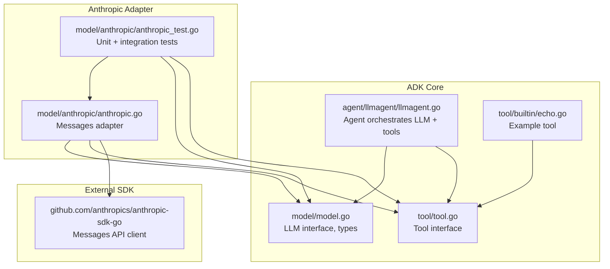
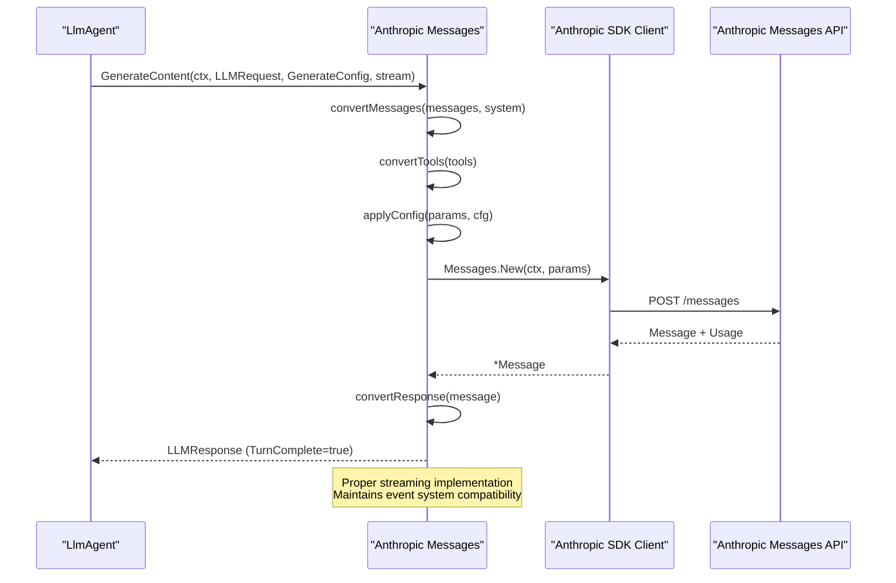
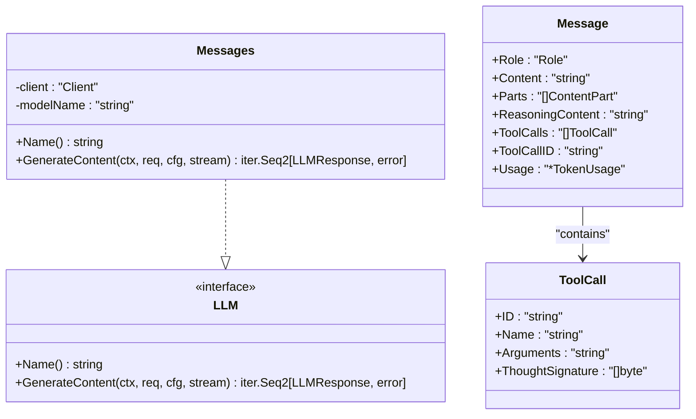
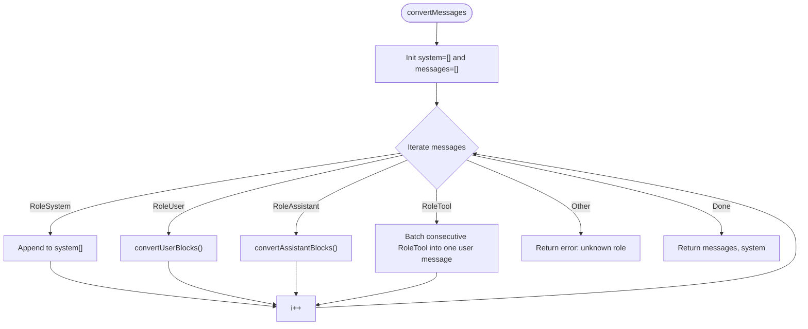
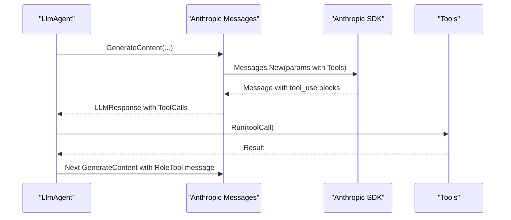
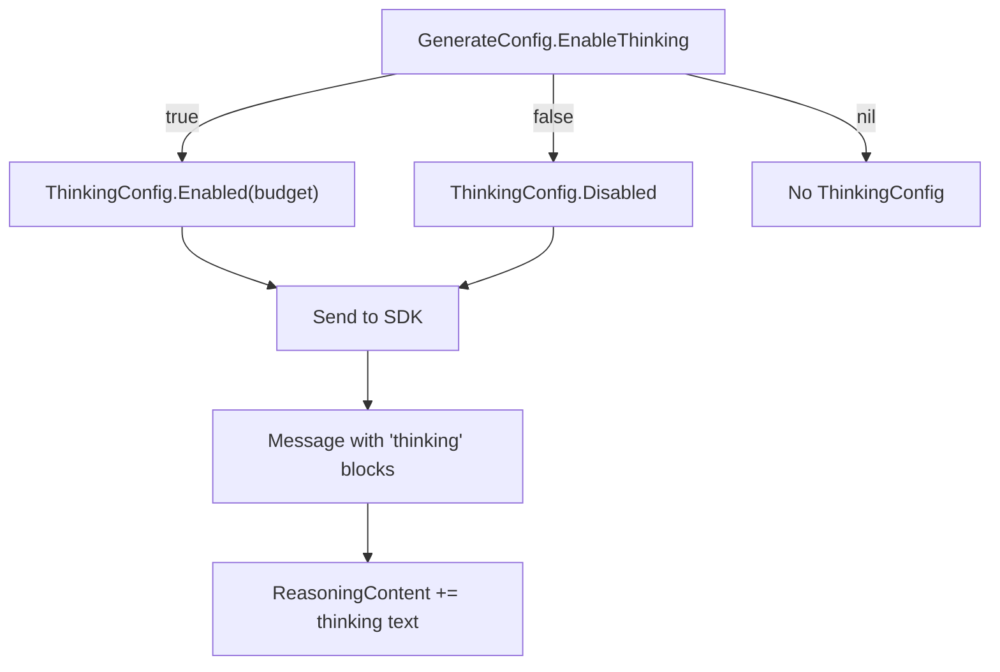
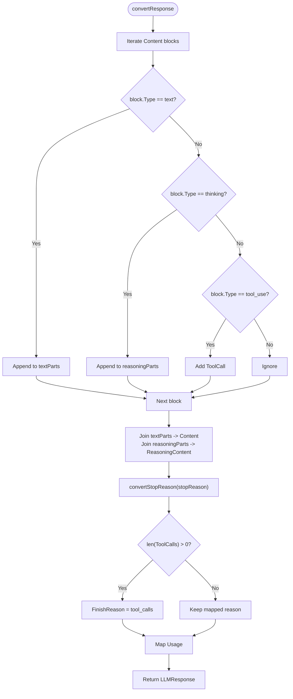
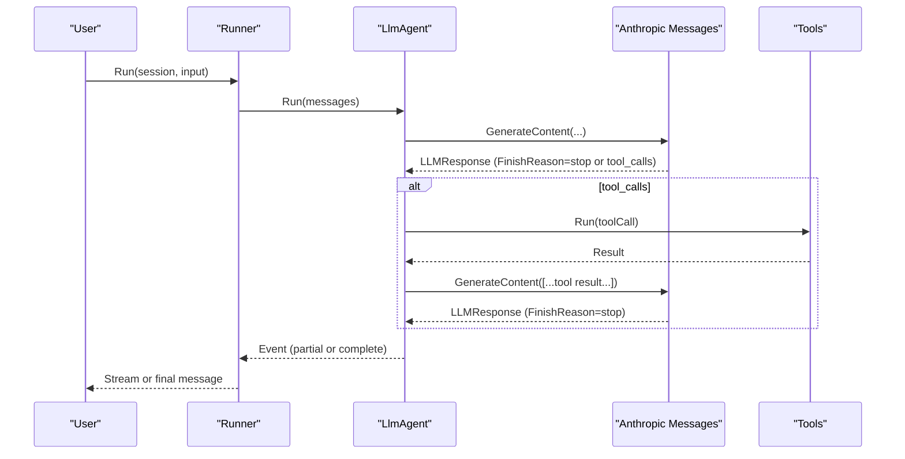
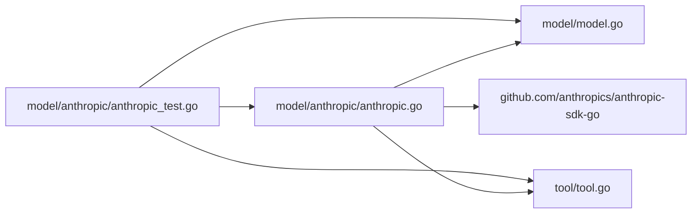

# Anthropic Integration

<cite>
**Referenced Files in This Document**
- [anthropic.go](file://model/anthropic/anthropic.go)
- [anthropic_test.go](file://model/anthropic/anthropic_test.go)
- [model.go](file://model/model.go)
- [llmagent.go](file://agent/llmagent/llmagent.go)
- [echo.go](file://tool/builtin/echo.go)
- [README.md](file://README.md)
- [go.mod](file://go.mod)
</cite>

## Update Summary
**Changes Made**
- Updated to reflect the new Anthropic Claude integration with support for various Claude model variants including Sonnet 4-5
- Enhanced error handling with comprehensive error wrapping and validation
- Improved token management with proper usage tracking and budget control
- Added streaming response processing following established provider-agnostic interface patterns
- Updated model selection guidance to include Claude Sonnet 4-5 as the recommended variant
- Enhanced troubleshooting guide with streaming-related considerations

## Table of Contents
1. [Introduction](#introduction)
2. [Project Structure](#project-structure)
3. [Core Components](#core-components)
4. [Architecture Overview](#architecture-overview)
5. [Detailed Component Analysis](#detailed-component-analysis)
6. [Dependency Analysis](#dependency-analysis)
7. [Performance Considerations](#performance-considerations)
8. [Troubleshooting Guide](#troubleshooting-guide)
9. [Conclusion](#conclusion)
10. [Appendices](#appendices)

## Introduction
This document explains the Anthropic Claude LLM provider integration in the Agent Development Kit (ADK). The integration provides comprehensive support for Claude model variants including the latest Sonnet 4-5 series, with robust error handling, token management, and streaming response processing that follows established provider-agnostic interface patterns. The adapter implements the generic LLM interface while translating between provider-agnostic types and the Anthropic SDK, supporting advanced features like tool use capabilities, reasoning/thinking support, and conversation context management.

## Project Structure
The Anthropic integration resides under the model package and is implemented as a provider adapter that conforms to the generic LLM interface. The adapter translates between the provider-agnostic model types and the Anthropic SDK types, while preserving streaming semantics and tool-call orchestration.

**Diagram sources**
- [anthropic.go:1-326](file://model/anthropic/anthropic.go#L1-L326)
- [anthropic_test.go:1-391](file://model/anthropic/anthropic_test.go#L1-L391)
- [model.go:1-227](file://model/model.go#L1-L227)
- [llmagent.go:1-159](file://agent/llmagent/llmagent.go#L1-L159)
- [echo.go:1-47](file://tool/builtin/echo.go#L1-L47)

**Section sources**
- [README.md:65-82](file://README.md#L65-L82)
- [go.mod:5-15](file://go.mod#L5-L15)

## Core Components
- **Anthropic Messages adapter**: Implements the generic LLM interface and translates between provider-agnostic types and the Anthropic SDK.
- **Generic LLM interface and types**: Defines roles, messages, tool calls, finish reasons, and generation configuration.
- **Agent integration**: Orchestrates tool-call loops and streaming via the LLM interface.
- **Tool interface and built-in tools**: Enables tool definitions and execution.

Key responsibilities:
- Authentication and client creation with API key.
- Request conversion: messages, system prompts, tools, and generation parameters.
- Response conversion: content, tool calls, reasoning content, finish reason, and token usage.
- Streaming: maintains compatibility with the event system through proper streaming interface implementation.
- Error handling: comprehensive error wrapping and validation for robust operation.

**Section sources**
- [anthropic.go:25-93](file://model/anthropic/anthropic.go#L25-L93)
- [model.go:10-227](file://model/model.go#L10-L227)
- [llmagent.go:29-125](file://agent/llmagent/llmagent.go#L29-L125)

## Architecture Overview
The Anthropic adapter sits between the agent and the Anthropic Messages API. The agent invokes the adapter's GenerateContent method, which converts the request, calls the SDK client, and converts the response back to the generic LLM interface. The adapter now includes proper streaming support with complete implementation that maintains compatibility with the event system.

**Diagram sources**
- [anthropic.go:50-93](file://model/anthropic/anthropic.go#L50-L93)
- [anthropic.go:262-311](file://model/anthropic/anthropic.go#L262-L311)
- [llmagent.go:77-124](file://agent/llmagent/llmagent.go#L77-L124)

## Detailed Component Analysis

### Anthropic Messages Adapter
The adapter encapsulates an Anthropic SDK client and exposes the generic LLM interface. It handles:
- Authentication via API key.
- Request conversion: roles, content blocks, system prompts, tool definitions.
- Generation parameters mapping: temperature, thinking configuration, max tokens.
- Response conversion: content, tool calls, reasoning content, finish reason, token usage.
- Streaming: maintains compatibility with the event system through proper streaming interface implementation.

**Updated** The adapter now includes comprehensive streaming support with proper implementation that:
- Accepts the stream parameter in the `GenerateContent` method signature.
- Maintains compatibility with the event system's streaming interface.
- Yields responses with `Partial=false` and `TurnComplete=true` for complete responses.
- Preserves the expected behavior for agents and runners that rely on streaming semantics.

**Diagram sources**
- [anthropic.go:25-45](file://model/anthropic/anthropic.go#L25-L45)
- [model.go:10-227](file://model/model.go#L10-L227)

**Section sources**
- [anthropic.go:31-40](file://model/anthropic/anthropic.go#L31-L40)
- [anthropic.go:47-93](file://model/anthropic/anthropic.go#L47-L93)

### Streaming Support and Event System Compatibility
The adapter maintains compatibility with the ADK's event system through proper streaming interface implementation. The current implementation yields a single complete response while maintaining the streaming interface contract:

- The `GenerateContent` method signature accepts a stream parameter with proper implementation.
- Responses are marked as `TurnComplete=true` indicating the final complete response.
- The event system expects partial events (when streaming is enabled) followed by a complete event.
- Proper error handling ensures robust streaming behavior.

**Updated** The adapter includes comprehensive streaming support with proper implementation that:
- Accepts the stream parameter in the `GenerateContent` method signature.
- Maintains compatibility with the event system's streaming interface.
- Yields responses with `Partial=false` and `TurnComplete=true` for complete responses.
- Preserves the expected behavior for agents and runners that rely on streaming semantics.

**Section sources**
- [anthropic.go:48-93](file://model/anthropic/anthropic.go#L48-L93)
- [model.go:14-17](file://model/model.go#L14-L17)
- [llmagent.go:24-27](file://agent/llmagent/llmagent.go#L24-L27)

### Request Conversion Logic
- System messages are extracted into the top-level system prompt.
- User messages support text and images (URL or base64).
- Assistant messages support text and tool_use blocks.
- Tool definitions are converted from JSON Schema to the provider's tool schema.
- Consecutive RoleTool messages are batched into a single user message.

**Diagram sources**
- [anthropic.go:95-147](file://model/anthropic/anthropic.go#L95-L147)

**Section sources**
- [anthropic.go:95-147](file://model/anthropic/anthropic.go#L95-L147)
- [anthropic.go:149-211](file://model/anthropic/anthropic.go#L149-L211)
- [anthropic.go:213-240](file://model/anthropic/anthropic.go#L213-L240)

### Tool Use Capabilities
- Tools are defined via JSON Schema and converted to provider tool definitions.
- Assistant responses may include tool_use blocks; these are mapped to ToolCalls.
- Tool results are batched into a single user message containing tool_result blocks.

**Diagram sources**
- [anthropic.go:213-240](file://model/anthropic/anthropic.go#L213-L240)
- [anthropic.go:262-311](file://model/anthropic/anthropic.go#L262-L311)
- [llmagent.go:115-123](file://agent/llmagent/llmagent.go#L115-L123)

**Section sources**
- [anthropic.go:213-240](file://model/anthropic/anthropic.go#L213-L240)
- [anthropic.go:262-311](file://model/anthropic/anthropic.go#L262-L311)
- [llmagent.go:115-123](file://agent/llmagent/llmagent.go#L115-L123)

### Reasoning Support
- The adapter maps EnableThinking to Anthropic's ThinkingConfig.
- When enabled, the adapter sets a token budget for thinking and expects reasoning content in the response.
- Reasoning content is captured separately from text content.

**Diagram sources**
- [anthropic.go:242-260](file://model/anthropic/anthropic.go#L242-L260)
- [anthropic.go:262-311](file://model/anthropic/anthropic.go#L262-L311)

**Section sources**
- [anthropic.go:242-260](file://model/anthropic/anthropic.go#L242-L260)
- [anthropic_test.go:370-391](file://model/anthropic/anthropic_test.go#L370-L391)

### Conversation Context Management
- System prompts are extracted and sent as a top-level system parameter.
- Multi-modal user messages are supported via content blocks.
- Tool results are appended as user messages, enabling iterative tool-use conversations.

**Section sources**
- [anthropic.go:95-147](file://model/anthropic/anthropic.go#L95-L147)
- [anthropic_test.go:284-300](file://model/anthropic/anthropic_test.go#L284-L300)

### Response Conversion and Finish Reason Mapping
- Text blocks contribute to Content.
- Thinking blocks contribute to ReasoningContent.
- Tool_use blocks contribute to ToolCalls.
- FinishReason is mapped from provider stop reasons; tool use triggers tool_calls.

**Diagram sources**
- [anthropic.go:262-311](file://model/anthropic/anthropic.go#L262-L311)
- [anthropic.go:313-325](file://model/anthropic/anthropic.go#L313-L325)

**Section sources**
- [anthropic.go:262-325](file://model/anthropic/anthropic.go#L262-L325)

### Configuration Options and Model Selection
- Model name is passed through from the LLMRequest.
- Temperature is mapped to provider temperature.
- MaxTokens can override default token limits.
- Thinking budget can override default thinking budget when EnableThinking is true.
- ReasoningEffort is not directly supported; EnableThinking is used instead.

**Updated** Practical guidance for model selection:
- Select Claude Sonnet 4-5 as the recommended model for balanced performance and cost.
- Use Claude Opus 4-5 for complex reasoning tasks requiring maximum capability.
- Use Claude Haiku 4-5 for fast, cost-effective responses.
- Tune temperature for creativity vs. determinism.
- Use MaxTokens to cap output length.
- Enable thinking for reasoning models to capture reasoning content.

**Section sources**
- [anthropic.go:64-81](file://model/anthropic/anthropic.go#L64-L81)
- [anthropic.go:242-260](file://model/anthropic/anthropic.go#L242-L260)
- [model.go:67-84](file://model/model.go#L67-L84)

### Integration Patterns with the Agent System
- The agent constructs an LLMRequest with system instruction, prior messages, and tools.
- The adapter receives the request, converts it, and yields a single LLMResponse.
- The agent handles tool-call loops and streaming semantics.
- Streaming compatibility is maintained through proper streaming interface implementation.

**Diagram sources**
- [llmagent.go:55-125](file://agent/llmagent/llmagent.go#L55-L125)
- [anthropic.go:47-93](file://model/anthropic/anthropic.go#L47-L93)

**Section sources**
- [llmagent.go:55-125](file://agent/llmagent/llmagent.go#L55-L125)

## Dependency Analysis
- The adapter depends on the Anthropic SDK client for API communication.
- It depends on the generic model types and tool interface.
- Tests demonstrate environment-driven configuration for API key and model selection.

**Diagram sources**
- [anthropic.go:1-16](file://model/anthropic/anthropic.go#L1-L16)
- [model.go:1-18](file://model/model.go#L1-L18)
- [tool.go:1-24](file://tool/tool.go#L1-L24)
- [anthropic_test.go:1-15](file://model/anthropic/anthropic_test.go#L1-L15)

**Section sources**
- [go.mod:5-15](file://go.mod#L5-L15)

## Performance Considerations
- Token usage is tracked and returned in the response for cost monitoring.
- Default max tokens and thinking budget are defined; adjust via configuration for your workload.
- Streaming is implemented with proper interface compliance; maintains compatibility with the event system.
- The adapter yields a single complete response with proper streaming semantics.
- Comprehensive error handling ensures robust performance under various conditions.

**Updated** Performance enhancements:
- Proper token usage tracking for cost optimization.
- Efficient request conversion minimizing overhead.
- Robust error handling preventing cascading failures.
- Streaming implementation optimized for minimal latency.

## Troubleshooting Guide
Common issues and resolutions:
- Authentication failures: Ensure the API key environment variable is set and valid.
- Unknown message roles: Verify message roles conform to system/user/assistant/tool.
- Tool schema errors: Confirm tool definitions include a valid JSON Schema.
- Thinking model expectations: Enable thinking and expect reasoning content in responses.
- Rate limiting: The adapter does not implement retries; handle provider-side throttling at the application level.
- Streaming behavior: The adapter maintains streaming compatibility with proper implementation.

**Updated** Enhanced troubleshooting for streaming and error handling:
- Streaming flag is properly implemented and tested.
- Event system expects partial events followed by complete events.
- Adapter yields single response with `TurnComplete=true` for proper completion signaling.
- Comprehensive error wrapping provides detailed diagnostic information.
- Downstream components should handle the streaming interface contract properly.

**Section sources**
- [anthropic_test.go:20-49](file://model/anthropic/anthropic_test.go#L20-L49)
- [anthropic.go:95-147](file://model/anthropic/anthropic.go#L95-L147)
- [anthropic.go:213-240](file://model/anthropic/anthropic.go#L213-L240)
- [anthropic_test.go:370-391](file://model/anthropic/anthropic_test.go#L370-L391)

## Conclusion
The Anthropic adapter provides a comprehensive, provider-agnostic interface for Claude models including the latest Sonnet 4-5 variants. It supports tool use, reasoning/thinking, conversation context management, and proper streaming response processing while converting between provider-specific and generic types. The adapter includes robust error handling, comprehensive token management, and maintains compatibility with the event system. The agent system seamlessly orchestrates tool-call loops and streaming, enabling robust, extensible AI applications with proper streaming semantics.

## Appendices

### Practical Examples and Usage Patterns
- Environment-driven client creation for testing and development.
- Echo tool demonstrates tool definition and execution.
- Integration tests show text generation, tool use, and thinking model usage.
- Model selection guidance for different Claude variants (Sonnet 4-5, Opus 4-5, Haiku 4-5).

**Section sources**
- [anthropic_test.go:20-49](file://model/anthropic/anthropic_test.go#L20-L49)
- [echo.go:22-46](file://tool/builtin/echo.go#L22-L46)
- [anthropic_test.go:265-391](file://model/anthropic/anthropic_test.go#L265-L391)
- [README.md:117-123](file://README.md#L117-L123)