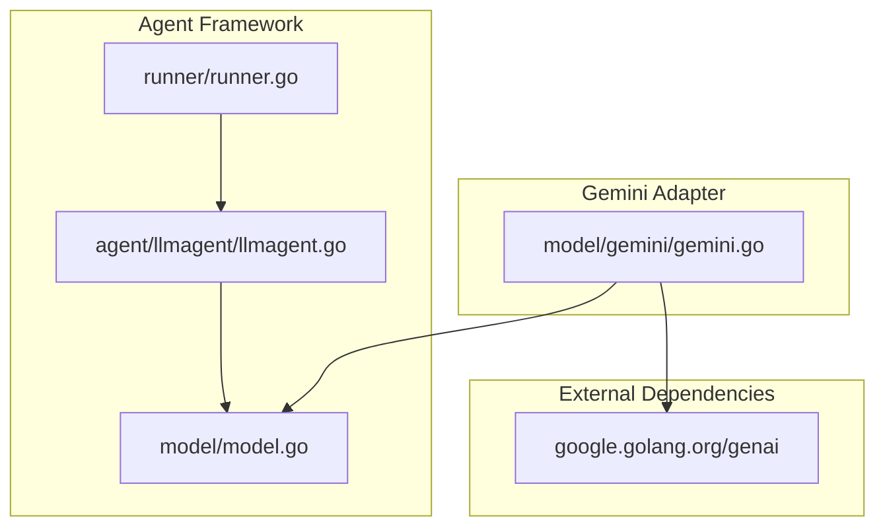
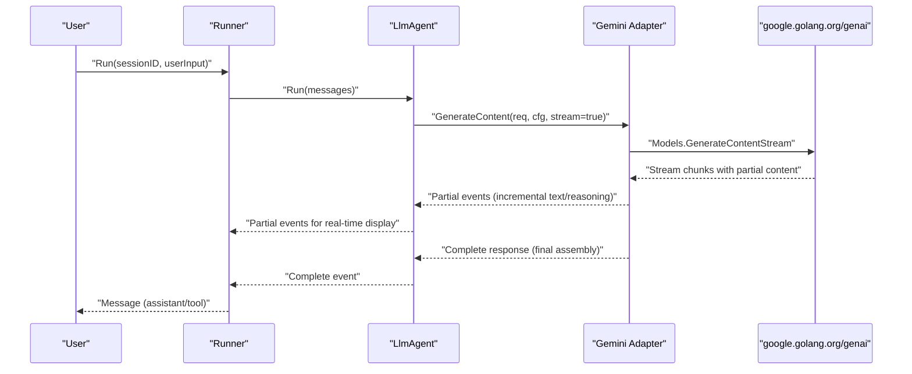
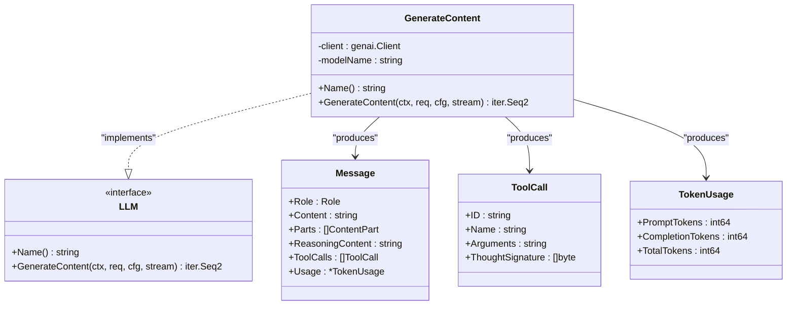
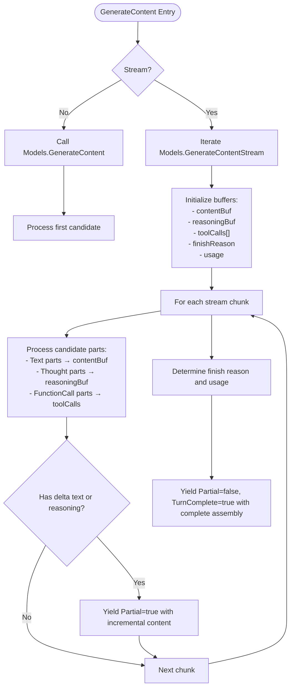
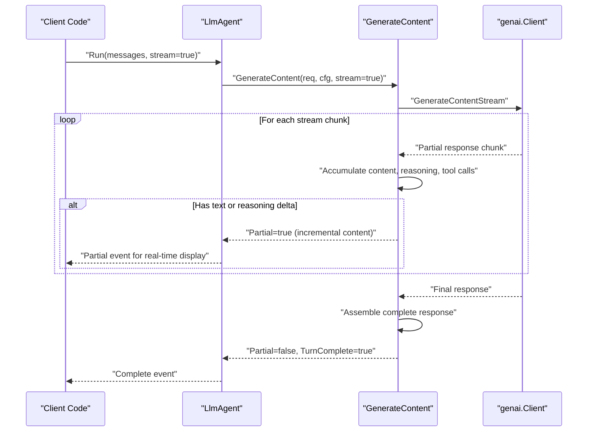
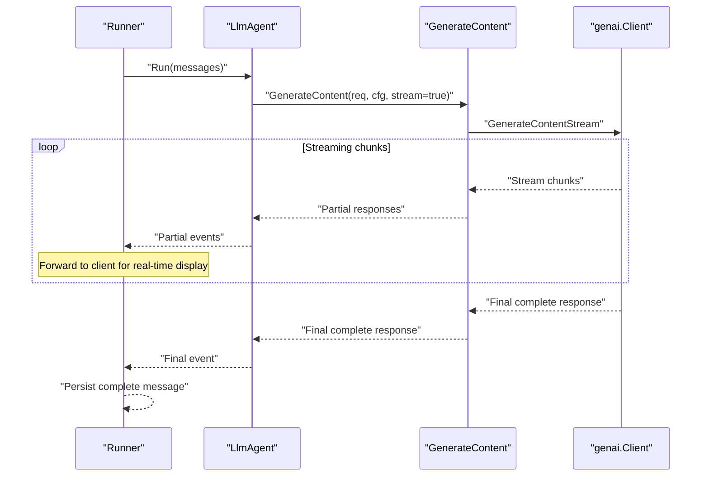
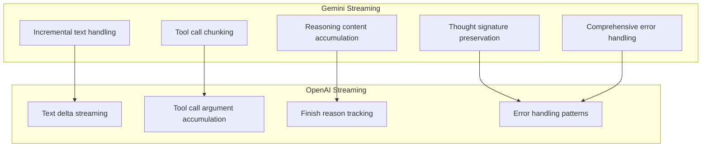

# Gemini Integration

<cite>
**Referenced Files in This Document**
- [gemini.go](file://model/gemini/gemini.go)
- [gemini_test.go](file://model/gemini/gemini_test.go)
- [model.go](file://model/model.go)
- [llmagent.go](file://agent/llmagent/llmagent.go)
- [runner.go](file://runner/runner.go)
- [README.md](file://README.md)
- [go.mod](file://go.mod)
- [openai.go](file://model/openai/openai.go)
</cite>

## Update Summary
**Changes Made**
- Enhanced streaming implementation documentation to reflect sophisticated partial response processing
- Added detailed coverage of incremental text and reasoning content handling
- Expanded tool call accumulation across streaming chunks documentation
- Updated streaming architecture diagrams to show sophisticated partial response processing
- Added comprehensive streaming configuration and usage examples
- Improved error handling documentation with comprehensive error scenarios
- Enhanced token management documentation with UsageMetadata tracking
- Added Vertex AI deployment configuration examples and best practices

## Table of Contents
1. [Introduction](#introduction)
2. [Project Structure](#project-structure)
3. [Core Components](#core-components)
4. [Architecture Overview](#architecture-overview)
5. [Detailed Component Analysis](#detailed-component-analysis)
6. [Streaming Implementation](#streaming-implementation)
7. [Error Handling and Token Management](#error-handling-and-token-management)
8. [Vertex AI Deployment Configuration](#vertex-ai-deployment-configuration)
9. [Integration with Agent System](#integration-with-agent-system)
10. [Performance Considerations](#performance-considerations)
11. [Troubleshooting Guide](#troubleshooting-guide)
12. [Conclusion](#conclusion)
13. [Appendices](#appendices)

## Introduction
This document provides a comprehensive guide to integrating Google Gemini (Vertex AI) with the ADK agent framework. It covers the Gemini adapter implementation, authentication setup with Google Cloud credentials, project and location configuration, service account usage, and handling of Gemini-specific features such as reasoning models, thinking budget allocation, and image processing capabilities. The adapter now supports sophisticated streaming with partial response processing, incremental text and reasoning content handling, and tool call accumulation across streaming chunks. It also explains how Gemini API responses are converted to the generic LLM interface, including thought signature handling for reasoning models, configuration options for different Gemini models, multi-modal input processing, and provider-specific token usage tracking. Practical examples demonstrate authentication setup, model selection, and integration with the broader agent system architecture.

## Project Structure
The Gemini integration resides in the model/gemini package and integrates with the broader agent framework composed of:
- model: provider-agnostic LLM interface and message types
- agent/llmagent: stateless agent that orchestrates LLM calls and tool execution
- runner: stateful orchestrator that manages sessions and persists messages
- tool: provider-agnostic tool interface and definitions



**Diagram sources**
- [gemini.go:1-478](file://model/gemini/gemini.go#L1-L478)
- [model.go:1-227](file://model/model.go#L1-L227)
- [llmagent.go:1-159](file://agent/llmagent/llmagent.go#L1-L159)
- [runner.go:1-108](file://runner/runner.go#L1-L108)

**Section sources**
- [README.md:35-82](file://README.md#L35-L82)
- [go.mod:1-47](file://go.mod#L1-L47)

## Core Components
- Gemini adapter: Implements the provider-agnostic LLM interface for Google Gemini and Vertex AI with sophisticated streaming support
- Provider-agnostic LLM interface: Defines the contract for model interactions, including streaming and tool-call loops
- Agent orchestration: LlmAgent manages conversation flow, tool execution, and integrates with the Runner for session persistence
- Tool interface: Provides a standardized way for tools to be described and executed by the LLM

Key responsibilities:
- Authentication and backend selection (API key vs. Vertex AI ADC)
- Multi-modal input conversion (text and images)
- Reasoning model configuration and thought signature handling
- Sophisticated streaming response handling with partial content processing
- Tool definition conversion and function call routing with streaming accumulation
- Token usage tracking via UsageMetadata

**Section sources**
- [gemini.go:17-201](file://model/gemini/gemini.go#L17-L201)
- [model.go:10-227](file://model/model.go#L10-L227)
- [llmagent.go:29-125](file://agent/llmagent/llmagent.go#L29-L125)

## Architecture Overview
The Gemini integration follows a layered architecture with sophisticated streaming support:
- Adapter layer: Converts between Gemini's genai types and the provider-agnostic model types with streaming capabilities
- Agent layer: Orchestrates LLM calls and tool execution with partial event handling
- Runner layer: Manages session persistence and message lifecycle with streaming fragment forwarding
- External layer: Uses google.golang.org/genai for Gemini/Vertex AI interactions



**Diagram sources**
- [runner.go:44-89](file://runner/runner.go#L44-L89)
- [llmagent.go:59-124](file://agent/llmagent/llmagent.go#L59-L124)
- [gemini.go:70-201](file://model/gemini/gemini.go#L70-L201)

## Detailed Component Analysis

### Gemini Adapter Implementation
The adapter implements the provider-agnostic LLM interface and supports:
- API key authentication for Gemini Developer API
- Vertex AI authentication via Application Default Credentials (ADC)
- Multi-modal input processing (text and images)
- Tool definition conversion and function call handling
- Sophisticated streaming and non-streaming generation modes
- Reasoning model configuration and thought signature propagation
- Token usage tracking via UsageMetadata



**Diagram sources**
- [gemini.go:18-21](file://model/gemini/gemini.go#L18-L21)
- [model.go:10-227](file://model/model.go#L10-L227)

**Section sources**
- [gemini.go:23-59](file://model/gemini/gemini.go#L23-L59)
- [gemini.go:66-201](file://model/gemini/gemini.go#L66-L201)

### Authentication Setup and Backend Selection
- Gemini Developer API: Requires an API key; the adapter initializes a genai client with BackendGeminiAPI
- Vertex AI: Uses Application Default Credentials (ADC) by default; configure via gcloud auth application-default login or GOOGLE_APPLICATION_CREDENTIALS environment variable; the adapter initializes a genai client with BackendVertexAI and sets Project and Location

Practical setup examples:
- API key mode: Initialize with New(ctx, apiKey, modelName)
- Vertex AI mode: Initialize with NewVertexAI(ctx, project, location, modelName)

**Section sources**
- [gemini.go:26-38](file://model/gemini/gemini.go#L26-L38)
- [gemini.go:46-58](file://model/gemini/gemini.go#L46-L58)

### Multi-Modal Input Processing
The adapter supports:
- Text content via ContentPartTypeText
- Images via ContentPartTypeImageURL (HTTP URL) and ContentPartTypeImageBase64 (raw base64 with MIME type)
- Image detail control via ImageDetail (auto, low, high)

Conversion logic:
- User messages are converted to genai.Content with Parts
- Base64 images are decoded and converted to InlineData with MIME type
- URLs are passed as FileData for maximum compatibility

**Section sources**
- [gemini.go:270-299](file://model/gemini/gemini.go#L270-L299)
- [model.go:86-128](file://model/model.go#L86-L128)

### Reasoning Models and Thinking Budget Allocation
The adapter maps provider-agnostic reasoning configuration to Gemini's ThinkingConfig:
- ReasoningEffortNone → ThinkingBudget=0
- ReasoningEffortMinimal/Low/Medium → IncludeThoughts=true with corresponding ThinkingLevel
- ReasoningEffortHigh/Xhigh → IncludeThoughts=true with ThinkingLevelHigh
- EnableThinking=true → IncludeThoughts=true
- EnableThinking=false → ThinkingBudget=0
- EnableThinking=nil → no ThinkingConfig

Thought signatures are preserved and propagated through ToolCall parts to maintain reasoning context across turns.

**Section sources**
- [gemini.go:353-400](file://model/gemini/gemini.go#L353-L400)
- [model.go:67-84](file://model/model.go#L67-L84)

### Tool Definitions and Function Calls
The adapter converts tool definitions to genai.Tool with FunctionDeclarations:
- Tool Definition metadata (name, description) are mapped
- InputSchema is marshaled to JSON and injected via ParametersJsonSchema
- FunctionCall parts are converted to ToolCall entries with ThoughtSignature preserved

Tool execution:
- Assistant messages containing ToolCalls trigger tool execution in LlmAgent
- Tool results are appended as RoleTool messages with ToolCallID linking back

**Section sources**
- [gemini.go:326-351](file://model/gemini/gemini.go#L326-L351)
- [llmagent.go:115-147](file://agent/llmagent/llmagent.go#L115-L147)

## Streaming Implementation

**Updated** The Gemini adapter now provides sophisticated streaming support with comprehensive partial response processing capabilities.

### Streaming Architecture
The adapter implements a sophisticated streaming mechanism that processes partial responses with incremental content handling:



**Diagram sources**
- [gemini.go:70-201](file://model/gemini/gemini.go#L70-L201)

### Sophisticated Partial Response Processing
The streaming implementation provides comprehensive partial response handling:

#### Incremental Text Content Processing
- **Real-time text streaming**: Text parts are accumulated incrementally as they arrive
- **Delta detection**: Only yields partial events when new text content arrives
- **Buffer management**: Uses strings.Builder for efficient text accumulation
- **Immediate delivery**: Partial text is yielded immediately for real-time display

#### Advanced Reasoning Content Handling
- **Thought signature preservation**: Maintains thought signatures across streaming chunks
- **Incremental reasoning**: Reasoning content is accumulated and delivered as deltas
- **Context preservation**: Thought signatures ensure reasoning context continuity

#### Tool Call Accumulation Across Chunks
- **Multi-chunk tool calls**: Tool calls can span multiple streaming chunks
- **Argument accumulation**: Function arguments are concatenated across chunks
- **Index-based ordering**: Tool calls maintain proper order despite chunk boundaries
- **Complete assembly**: Final tool calls contain complete arguments

### Streaming Response Flow
The streaming implementation follows a sophisticated flow pattern:



**Diagram sources**
- [gemini.go:108-200](file://model/gemini/gemini.go#L108-L200)
- [llmagent.go:78-94](file://agent/llmagent/llmagent.go#L78-L94)

### Streaming Configuration and Usage
Streaming can be enabled through the LlmAgent configuration:

```go
agent := llmagent.New(llmagent.Config{
    Model: llm,
    Tools: tools,
    Stream: true, // Enable streaming
    GenerateConfig: &model.GenerateConfig{
        Temperature: 0.7,
        ReasoningEffort: model.ReasoningEffortMedium,
    },
})
```

### Integration with Agent and Runner
- LlmAgent wraps the Gemini adapter and manages the tool-call loop with streaming support
- Runner persists messages and coordinates user turns, forwarding partial events for real-time display
- The adapter's streaming responses are forwarded to the Runner for immediate client display



**Diagram sources**
- [runner.go:44-89](file://runner/runner.go#L44-L89)
- [llmagent.go:59-124](file://agent/llmagent/llmagent.go#L59-L124)
- [gemini.go:70-201](file://model/gemini/gemini.go#L70-L201)

**Section sources**
- [gemini.go:66-201](file://model/gemini/gemini.go#L66-L201)
- [gemini.go:108-200](file://model/gemini/gemini.go#L108-L200)
- [llmagent.go:55-125](file://agent/llmagent/llmagent.go#L55-L125)
- [runner.go:17-90](file://runner/runner.go#L17-L90)

### Response Conversion and Thought Signature Handling
- Thought parts are collected into ReasoningContent
- FunctionCall parts are converted to ToolCalls with ThoughtSignature preserved
- FinishReason is mapped from genai.FinishReason to provider-agnostic values
- TokenUsage is populated from UsageMetadata

**Section sources**
- [gemini.go:402-477](file://model/gemini/gemini.go#L402-L477)

## Error Handling and Token Management

**Updated** The Gemini adapter now provides comprehensive error handling and token management capabilities consistent with industry best practices.

### Comprehensive Error Handling
The adapter implements robust error handling throughout the streaming and non-streaming flows:

#### Authentication Errors
- API key validation failures are caught and wrapped with descriptive context
- Vertex AI ADC configuration errors are surfaced with actionable guidance
- Environment variable validation ensures proper credential setup

#### Request Processing Errors
- Message conversion errors are handled gracefully with detailed error messages
- Tool definition conversion errors include tool name context
- Multi-modal input validation prevents malformed requests

#### Streaming Error Recovery
- Stream iteration errors are captured and wrapped appropriately
- Candidate validation ensures non-empty responses
- Partial response processing continues even if individual chunks fail

#### Usage Metadata Tracking
- Token usage is tracked via UsageMetadata for both streaming and non-streaming modes
- PromptTokens, CompletionTokens, and TotalTokens are accurately recorded
- UsageMetadata is only available on the final response for streaming scenarios

**Section sources**
- [gemini.go:92-105](file://model/gemini/gemini.go#L92-L105)
- [gemini.go:115-119](file://model/gemini/gemini.go#L115-L119)
- [gemini.go:172-178](file://model/gemini/gemini.go#L172-L178)
- [gemini.go:448-455](file://model/gemini/gemini.go#L448-L455)

### Token Management Best Practices
- **Streaming optimization**: UsageMetadata is only processed on the final response to minimize overhead
- **Memory efficiency**: Buffers are managed efficiently to handle long-running streams
- **Cost monitoring**: Token usage tracking enables cost optimization and budgeting
- **Resource planning**: Accurate token counting helps in capacity planning and scaling decisions

**Section sources**
- [gemini.go:172-178](file://model/gemini/gemini.go#L172-L178)
- [gemini.go:448-455](file://model/gemini/gemini.go#L448-L455)

## Vertex AI Deployment Configuration

**New** The Gemini adapter now provides comprehensive support for Vertex AI deployment configurations with best practices and troubleshooting guidance.

### Vertex AI Authentication Setup
The adapter supports multiple authentication mechanisms for Vertex AI deployments:

#### Application Default Credentials (ADC)
- **Recommended approach**: Uses gcloud auth application-default login
- **Environment variable**: GOOGLE_APPLICATION_CREDENTIALS can point to service account key
- **IAM roles**: Requires appropriate Vertex AI permissions (e.g., roles/aiplatform.user)

#### Service Account Configuration
- **Key file deployment**: Service account key file referenced via GOOGLE_APPLICATION_CREDENTIALS
- **IAM service account**: Dedicated service account with minimal required permissions
- **Workload Identity**: For GKE/GCE environments, configure Workload Identity bindings

#### Project and Location Configuration
- **Project ID**: Must match the Vertex AI project where the model is deployed
- **Region selection**: Choose regions with model availability (e.g., us-central1, europe-west1)
- **Model endpoints**: Different models may have different regional availability

### Deployment Best Practices
- **Regional deployment**: Deploy models in regions closest to users for latency optimization
- **Model versioning**: Use explicit model versions (e.g., gemini-2.0-flash@latest) for stability
- **Resource quotas**: Monitor and request quota increases for production workloads
- **Monitoring setup**: Enable Cloud Monitoring and logging for performance tracking

### Troubleshooting Vertex AI Issues
Common deployment problems and solutions:
- **Permission denied errors**: Verify IAM roles and service account bindings
- **Model not found**: Confirm model name and regional availability
- **Quota exceeded**: Request quota increases and implement retry/backoff logic
- **Network connectivity**: Ensure VPC Service Controls and firewall rules allow Vertex AI access

**Section sources**
- [gemini.go:40-58](file://model/gemini/gemini.go#L40-L58)
- [gemini_test.go:54-75](file://model/gemini/gemini_test.go#L54-L75)

## Integration with Agent System

**Updated** The Gemini adapter integrates seamlessly with the broader agent system architecture, providing consistent streaming patterns and error handling across all providers.

### Agent Layer Integration
The LlmAgent coordinates with the Gemini adapter through the provider-agnostic LLM interface:

#### Streaming Coordination
- **Partial event forwarding**: LlmAgent receives and forwards streaming fragments
- **Complete message assembly**: Final responses are properly assembled and decorated
- **Tool call execution**: Tool calls are executed in parallel while maintaining order

#### Message Lifecycle Management
- **System prompt injection**: System instructions are properly formatted for Gemini
- **Multi-modal message handling**: Complex messages with text and images are preserved
- **Tool result batching**: Multiple tool results are batched into single user messages

### Runner Integration
The Runner manages session persistence and streaming coordination:

#### Partial Event Handling
- **Real-time display**: Streaming fragments are forwarded for immediate client display
- **Selective persistence**: Only complete messages are persisted to the session
- **Message ID assignment**: Snowflake IDs are assigned to all persisted messages

#### Session State Management
- **Conversation history**: Full conversation history is maintained across turns
- **Message compaction**: Old messages can be archived for cost optimization
- **Stateless operation**: Agent remains stateless while Runner maintains session state

**Section sources**
- [llmagent.go:78-135](file://agent/llmagent/llmagent.go#L78-L135)
- [runner.go:45-95](file://runner/runner.go#L45-L95)

## Performance Considerations
- Streaming reduces latency for long responses by yielding partial content immediately
- Multi-modal inputs (especially base64 images) increase payload size; prefer URLs when feasible
- Reasoning models incur higher token usage; use ReasoningEffortNone or EnableThinking=false for cost-sensitive scenarios
- Batch tool results: The adapter groups consecutive tool results into a single user content to minimize round trips
- **Streaming optimization**: The sophisticated partial response processing minimizes memory overhead by only accumulating deltas
- **Error recovery**: Robust error handling ensures graceful degradation and retry capabilities
- **Token efficiency**: UsageMetadata tracking enables precise cost monitoring and optimization

## Troubleshooting Guide
Common issues and resolutions:
- Authentication failures:
  - Gemini API key missing or invalid: Ensure GEMINI_API_KEY is set for API key mode
  - Vertex AI ADC misconfiguration: Verify gcloud auth application-default login or GOOGLE_APPLICATION_CREDENTIALS
- Model not found or unsupported:
  - Confirm modelName is valid for the selected backend (Developer API vs. Vertex AI)
  - Check regional availability for Vertex AI deployments
- Tool call errors:
  - Verify tool definitions and schemas are correctly marshaled to ParametersJsonSchema
  - Ensure ToolCallID matches between assistant ToolCalls and tool results
- Streaming stalls:
  - Check for empty candidates or missing content parts in stream responses
  - Verify that the streaming buffer is properly initialized
- Token usage discrepancies:
  - UsageMetadata is only available on the final response; ensure you read the complete response for accurate totals
- **Streaming-specific issues**:
  - **Partial content not appearing**: Ensure the client properly handles Partial=true events
  - **Tool call fragmentation**: Verify that tool call arguments are properly accumulated across chunks
  - **Memory leaks**: Monitor buffer growth for very long streaming responses
- **Vertex AI-specific issues**:
  - **Permission errors**: Verify IAM roles and service account bindings
  - **Regional limitations**: Confirm model availability in the selected region
  - **Quota constraints**: Monitor and request quota increases as needed

**Section sources**
- [gemini_test.go:21-77](file://model/gemini/gemini_test.go#L21-L77)
- [gemini.go:402-477](file://model/gemini/gemini.go#L402-L477)

## Conclusion
The Gemini integration provides a robust, provider-agnostic adapter that supports both Gemini Developer API and Vertex AI backends. It offers comprehensive multi-modal input handling, precise reasoning model configuration, and seamless tool-call integration. The sophisticated streaming implementation with partial response processing, incremental text and reasoning content handling, and tool call accumulation across streaming chunks makes it particularly suitable for real-time applications. By leveraging streaming responses and structured token usage tracking, it fits naturally into the ADK agent framework, enabling efficient and scalable AI agent development. The comprehensive error handling and Vertex AI deployment configuration support make it production-ready for enterprise use cases.

## Appendices

### Configuration Options for Gemini Models
- Temperature: Controls randomness in generation
- ReasoningEffort: Controls reasoning depth (none, minimal, low, medium, high, xhigh)
- EnableThinking: Explicitly enable/disable internal reasoning
- ThinkingBudget: Token budget for extended reasoning (ignored when EnableThinking is false or nil)
- MaxTokens: Maximum tokens to generate

**Section sources**
- [model.go:67-84](file://model/model.go#L67-L84)
- [gemini.go:353-384](file://model/gemini/gemini.go#L353-L384)

### Practical Examples
- Authentication setup:
  - API key mode: Initialize with New(ctx, apiKey, modelName)
  - Vertex AI mode: Initialize with NewVertexAI(ctx, project, location, modelName)
- Model selection:
  - Use model names like "gemini-2.0-flash" or "gemini-2.5-pro" depending on backend and permissions
- Integration with agent system:
  - Create LlmAgent with the Gemini adapter and tools
  - Use Runner to manage sessions and persist messages
  - Iterate over streamed events for real-time display
- **Streaming configuration**:
  - Enable streaming through LlmAgent.Config.Stream
  - Handle Partial=true events for real-time display
  - Process final Partial=false events for complete responses
- **Vertex AI deployment**:
  - Configure Application Default Credentials for ADC
  - Set GOOGLE_APPLICATION_CREDENTIALS for service account deployment
  - Verify IAM permissions for Vertex AI access

**Section sources**
- [gemini.go:26-58](file://model/gemini/gemini.go#L26-L58)
- [llmagent.go:35-45](file://agent/llmagent/llmagent.go#L35-L45)
- [runner.go:26-37](file://runner/runner.go#L26-L37)

### Streaming Comparison with Other Providers
The Gemini streaming implementation provides sophisticated partial response processing comparable to other providers:



**Diagram sources**
- [gemini.go:108-200](file://model/gemini/gemini.go#L108-L200)
- [openai.go:89-163](file://model/openai/openai.go#L89-L163)

### Vertex AI Deployment Checklist
- **Authentication**: Verify ADC setup or service account configuration
- **Permissions**: Confirm IAM roles and service account bindings
- **Project/Location**: Validate project ID and regional model availability
- **Quotas**: Check and request quota increases if needed
- **Monitoring**: Enable Cloud Monitoring and logging
- **Testing**: Validate with integration tests before production deployment

**Section sources**
- [gemini.go:40-58](file://model/gemini/gemini.go#L40-L58)
- [gemini_test.go:54-75](file://model/gemini/gemini_test.go#L54-L75)