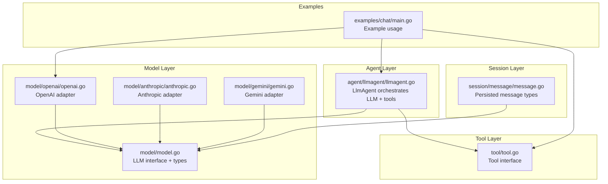
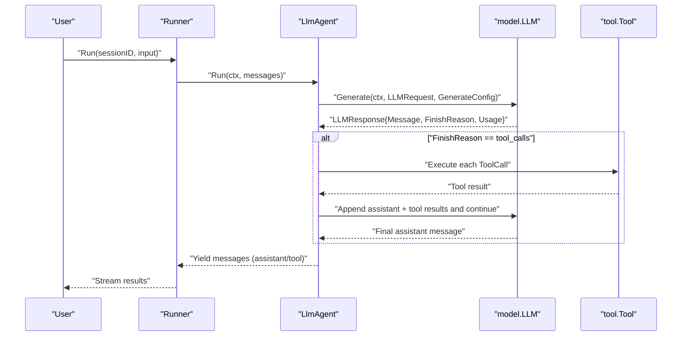
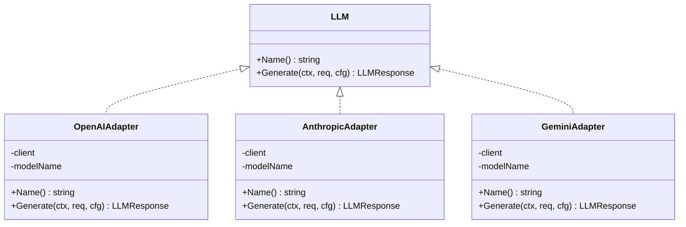
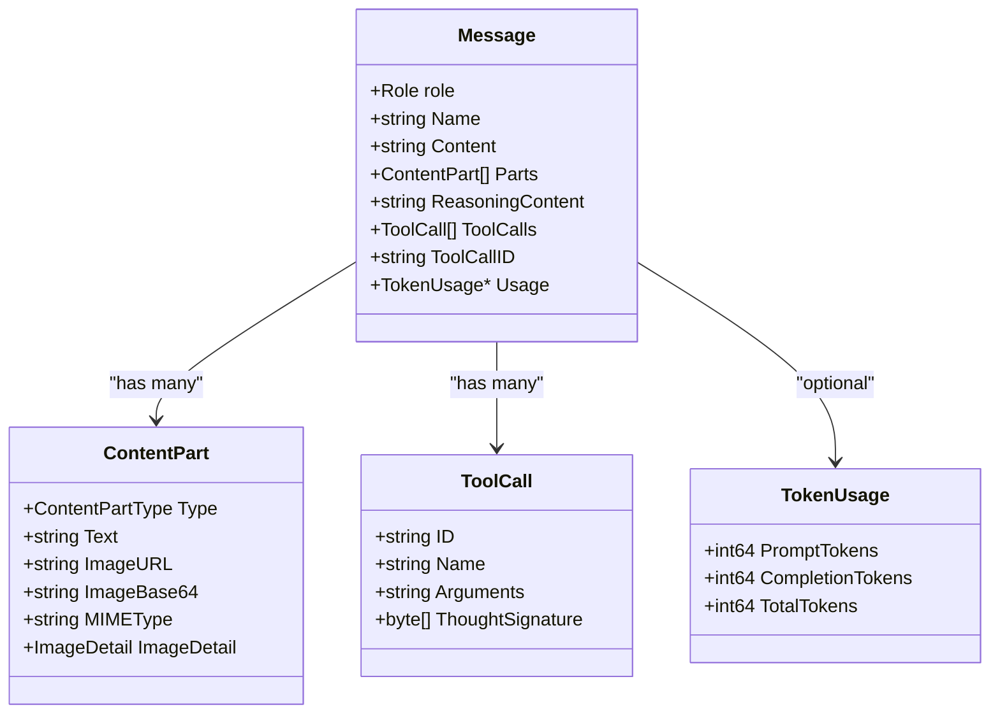
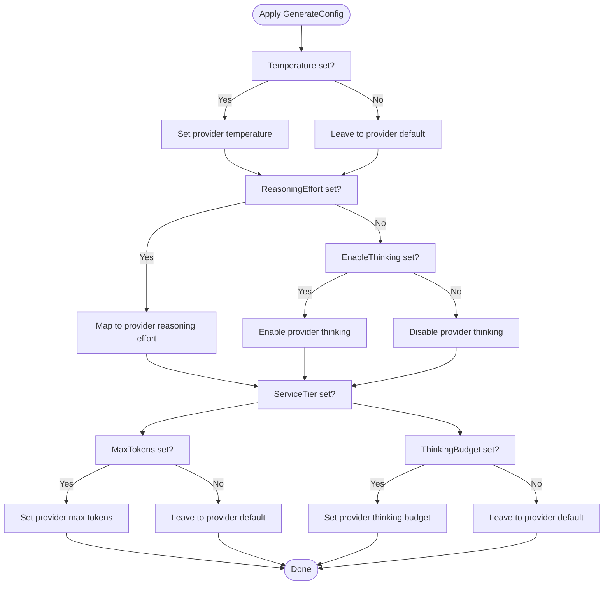
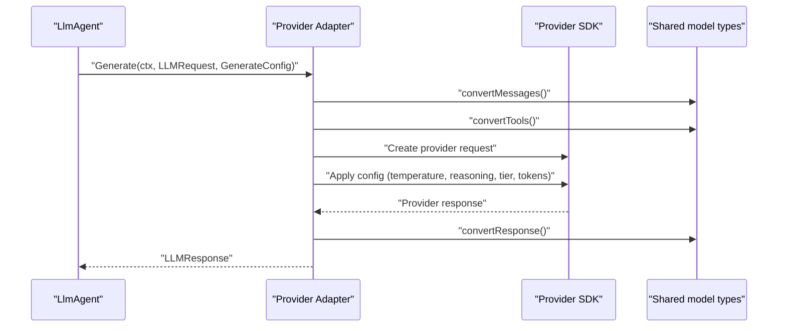
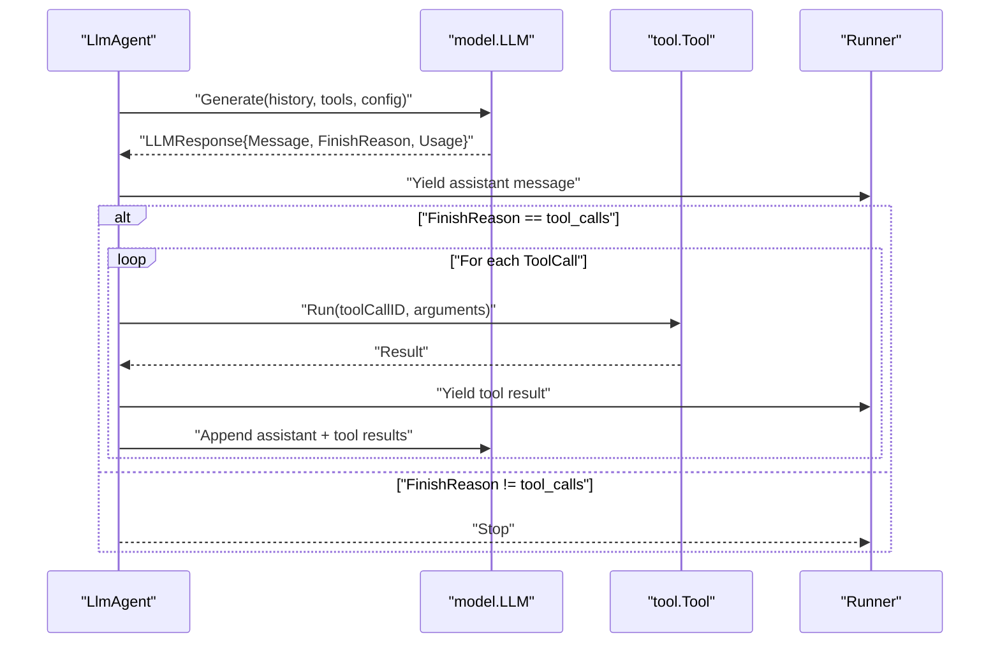
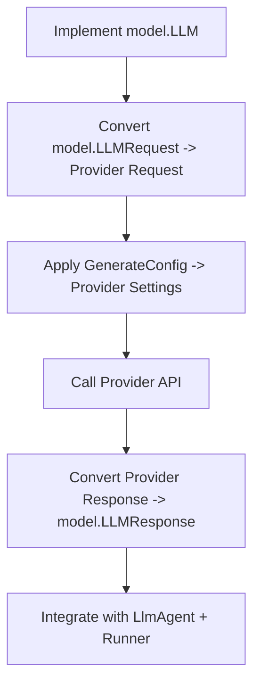
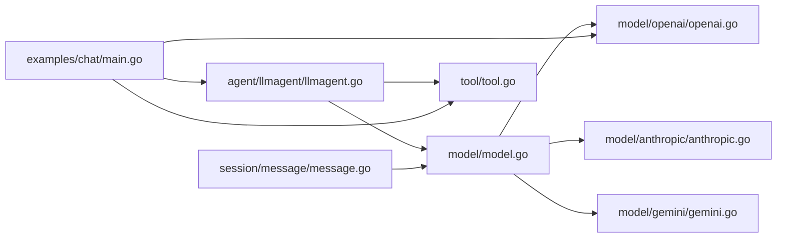

# LLM Interface

<cite>
**Referenced Files in This Document**
- [model.go](file://model/model.go)
- [openai.go](file://model/openai/openai.go)
- [anthropic.go](file://model/anthropic/anthropic.go)
- [gemini.go](file://model/gemini/gemini.go)
- [llmagent.go](file://agent/llmagent/llmagent.go)
- [message.go](file://session/message/message.go)
- [main.go](file://examples/chat/main.go)
- [tool.go](file://tool/tool.go)
</cite>

## Table of Contents
1. [Introduction](#introduction)
2. [Project Structure](#project-structure)
3. [Core Components](#core-components)
4. [Architecture Overview](#architecture-overview)
5. [Detailed Component Analysis](#detailed-component-analysis)
6. [Dependency Analysis](#dependency-analysis)
7. [Performance Considerations](#performance-considerations)
8. [Troubleshooting Guide](#troubleshooting-guide)
9. [Conclusion](#conclusion)

## Introduction
This document defines the core LLM interface contract and its provider-agnostic design. It explains how the LLM interface abstracts multiple LLM providers behind a unified API, covering the LLM interface methods, message types, configuration structures, and integration patterns. It also documents how the agent system consumes the LLM interface to drive multi-turn conversations with tool-calls.

## Project Structure
The LLM interface and its adapters live under the model package, with provider-specific implementations in subpackages. The agent layer composes the LLM interface with tools and sessions to form a complete agent pipeline.

**Diagram sources**
- [model.go:9-200](file://model/model.go#L9-L200)
- [openai.go:17-76](file://model/openai/openai.go#L17-L76)
- [anthropic.go:24-84](file://model/anthropic/anthropic.go#L24-L84)
- [gemini.go:16-96](file://model/gemini/gemini.go#L16-L96)
- [llmagent.go:25-105](file://agent/llmagent/llmagent.go#L25-L105)
- [message.go:49-129](file://session/message/message.go#L49-L129)
- [main.go:52-173](file://examples/chat/main.go#L52-L173)
- [tool.go:17-24](file://tool/tool.go#L17-L24)

**Section sources**
- [model.go:9-200](file://model/model.go#L9-L200)
- [openai.go:17-76](file://model/openai/openai.go#L17-L76)
- [anthropic.go:24-84](file://model/anthropic/anthropic.go#L24-L84)
- [gemini.go:16-96](file://model/gemini/gemini.go#L16-L96)
- [llmagent.go:25-105](file://agent/llmagent/llmagent.go#L25-L105)
- [message.go:49-129](file://session/message/message.go#L49-L129)
- [main.go:52-173](file://examples/chat/main.go#L52-L173)
- [tool.go:17-24](file://tool/tool.go#L17-L24)

## Core Components
This section documents the LLM interface contract and the core data structures that define the provider-agnostic API.

- LLM interface
  - Name(): returns the model identifier used by the adapter.
  - Generate(ctx, req, cfg): executes a single inference call and returns a provider-agnostic response.

- Message types
  - Role constants: system, user, assistant, tool.
  - FinishReason enumeration: stop, tool_calls, length, content_filter.
  - ContentPart types: text, image_url, image_base64.
  - ToolCall: structured tool invocation with ID, name, and arguments.
  - TokenUsage: prompt, completion, and total token counts.
  - Message: container for role, content, multi-modal parts, tool calls, reasoning content, and usage.

- Request and response
  - LLMRequest: model identifier, message history, and available tools.
  - LLMResponse: assistant message, finish reason, and usage.

- Generation configuration
  - GenerateConfig: temperature, reasoning effort, service tier, max tokens, thinking budget, and enable/disable reasoning.

**Section sources**
- [model.go:9-200](file://model/model.go#L9-L200)

## Architecture Overview
The LLM interface sits at the center of the agent pipeline. Agents consume the LLM interface to produce assistant messages and tool-calls. Tools are described to the LLM via JSON Schemas and executed by the agent. Sessions persist messages and token usage for later retrieval.

**Diagram sources**
- [llmagent.go:51-105](file://agent/llmagent/llmagent.go#L51-L105)
- [model.go:183-200](file://model/model.go#L183-L200)
- [tool.go:17-24](file://tool/tool.go#L17-L24)

## Detailed Component Analysis

### LLM Interface Contract
The LLM interface defines the minimal contract that all providers must implement to be interchangeable.

**Diagram sources**
- [model.go:9-13](file://model/model.go#L9-L13)
- [openai.go:17-40](file://model/openai/openai.go#L17-L40)
- [anthropic.go:24-44](file://model/anthropic/anthropic.go#L24-L44)
- [gemini.go:16-63](file://model/gemini/gemini.go#L16-L63)

**Section sources**
- [model.go:9-13](file://model/model.go#L9-L13)
- [openai.go:37-76](file://model/openai/openai.go#L37-L76)
- [anthropic.go:41-84](file://model/anthropic/anthropic.go#L41-L84)
- [gemini.go:60-96](file://model/gemini/gemini.go#L60-L96)

### Message Types and Multi-modal Content
The message model supports both text-only and multi-modal content. Roles and finish reasons are standardized across providers. Tool calls are represented consistently, enabling the agent to orchestrate tool execution.

**Diagram sources**
- [model.go:147-173](file://model/model.go#L147-L173)
- [model.go:104-123](file://model/model.go#L104-L123)
- [model.go:125-138](file://model/model.go#L125-L138)
- [model.go:140-145](file://model/model.go#L140-L145)

**Section sources**
- [model.go:147-173](file://model/model.go#L147-L173)
- [model.go:104-123](file://model/model.go#L104-L123)
- [model.go:125-138](file://model/model.go#L125-L138)
- [model.go:140-145](file://model/model.go#L140-L145)

### Generation Configuration
The GenerateConfig structure provides a provider-agnostic way to control generation behavior, including reasoning effort, service tiers, and token limits.

**Diagram sources**
- [model.go:62-79](file://model/model.go#L62-L79)
- [openai.go:191-216](file://model/openai/openai.go#L191-L216)
- [anthropic.go:233-251](file://model/anthropic/anthropic.go#L233-L251)
- [gemini.go:248-279](file://model/gemini/gemini.go#L248-L279)

**Section sources**
- [model.go:62-79](file://model/model.go#L62-L79)
- [openai.go:191-216](file://model/openai/openai.go#L191-L216)
- [anthropic.go:233-251](file://model/anthropic/anthropic.go#L233-L251)
- [gemini.go:248-279](file://model/gemini/gemini.go#L248-L279)

### Provider Adapters: OpenAI, Anthropic, and Gemini
Each provider adapter implements the LLM interface and translates between the provider’s SDK types and the shared model types. They handle message conversion, tool definitions, and finish reason mapping.

**Diagram sources**
- [openai.go:42-76](file://model/openai/openai.go#L42-L76)
- [anthropic.go:46-84](file://model/anthropic/anthropic.go#L46-L84)
- [gemini.go:65-96](file://model/gemini/gemini.go#L65-L96)

**Section sources**
- [openai.go:42-76](file://model/openai/openai.go#L42-L76)
- [anthropic.go:46-84](file://model/anthropic/anthropic.go#L46-L84)
- [gemini.go:65-96](file://model/gemini/gemini.go#L65-L96)

### Agent Integration and Tool-Call Loop
The LlmAgent orchestrates a tool-call loop: it calls the LLM, executes tool calls, and continues until the LLM stops or runs out of tokens. It streams messages back to the runner and persists token usage.

**Diagram sources**
- [llmagent.go:51-105](file://agent/llmagent/llmagent.go#L51-L105)
- [tool.go:17-24](file://tool/tool.go#L17-L24)

**Section sources**
- [llmagent.go:51-105](file://agent/llmagent/llmagent.go#L51-L105)
- [tool.go:17-24](file://tool/tool.go#L17-L24)

### Practical Example: Implementing a Custom LLM Provider
To implement a custom LLM provider:
- Implement the LLM interface with Name() and Generate().
- Convert incoming model.LLMRequest to your provider’s request format.
- Convert your provider’s response to model.LLMResponse.
- Map finish reasons and token usage appropriately.
- Optionally translate GenerateConfig into provider-specific knobs.

Then, wire it into the agent system by passing it to LlmAgent.Config and using it with Runner.

**Diagram sources**
- [model.go:9-13](file://model/model.go#L9-L13)
- [llmagent.go:13-23](file://agent/llmagent/llmagent.go#L13-L23)
- [main.go:101-110](file://examples/chat/main.go#L101-L110)

**Section sources**
- [model.go:9-13](file://model/model.go#L9-L13)
- [llmagent.go:13-23](file://agent/llmagent/llmagent.go#L13-L23)
- [main.go:101-110](file://examples/chat/main.go#L101-L110)

## Dependency Analysis
The LLM interface is consumed by the agent layer and integrates with tools and sessions. Provider adapters depend on their respective SDKs while remaining isolated from agent and session logic.

**Diagram sources**
- [model.go:9-200](file://model/model.go#L9-L200)
- [openai.go:17-76](file://model/openai/openai.go#L17-L76)
- [anthropic.go:24-84](file://model/anthropic/anthropic.go#L24-L84)
- [gemini.go:16-96](file://model/gemini/gemini.go#L16-L96)
- [llmagent.go:25-105](file://agent/llmagent/llmagent.go#L25-L105)
- [message.go:49-129](file://session/message/message.go#L49-L129)
- [main.go:52-173](file://examples/chat/main.go#L52-L173)
- [tool.go:17-24](file://tool/tool.go#L17-L24)

**Section sources**
- [model.go:9-200](file://model/model.go#L9-L200)
- [openai.go:17-76](file://model/openai/openai.go#L17-L76)
- [anthropic.go:24-84](file://model/anthropic/anthropic.go#L24-L84)
- [gemini.go:16-96](file://model/gemini/gemini.go#L16-L96)
- [llmagent.go:25-105](file://agent/llmagent/llmagent.go#L25-L105)
- [message.go:49-129](file://session/message/message.go#L49-L129)
- [main.go:52-173](file://examples/chat/main.go#L52-L173)
- [tool.go:17-24](file://tool/tool.go#L17-L24)

## Performance Considerations
- Token limits: Use MaxTokens to cap output and prevent runaway costs.
- Thinking budgets: Configure ThinkingBudget for providers that support extended reasoning.
- Reasoning effort: Choose appropriate effort levels to balance quality and cost.
- Service tiers: Select tiers that match latency and throughput requirements.
- Message compaction: Archive older messages to reduce context size and improve performance.

[No sources needed since this section provides general guidance]

## Troubleshooting Guide
Common issues and resolutions:
- Unknown role or content part type: Ensure message roles and content part types are among the supported constants.
- Tool not found: Verify tool names match the definitions provided to the LLM.
- No choices returned: Some providers may return empty choices; handle gracefully and retry if appropriate.
- Finish reason mapping: Provider-specific finish reasons are mapped to the shared enum; confirm mapping aligns with expectations.

**Section sources**
- [openai.go:91-155](file://model/openai/openai.go#L91-L155)
- [anthropic.go:86-138](file://model/anthropic/anthropic.go#L86-L138)
- [gemini.go:98-163](file://model/gemini/gemini.go#L98-L163)
- [openai.go:259-273](file://model/openai/openai.go#L259-L273)
- [anthropic.go:304-316](file://model/anthropic/anthropic.go#L304-L316)
- [gemini.go:359-372](file://model/gemini/gemini.go#L359-L372)

## Conclusion
The LLM interface provides a robust, provider-agnostic abstraction for interacting with multiple LLM providers. By standardizing message types, finish reasons, and configuration, it enables seamless swapping of providers and integration with tools and sessions. The agent layer builds on this foundation to deliver a flexible, streaming, and tool-aware conversational system.