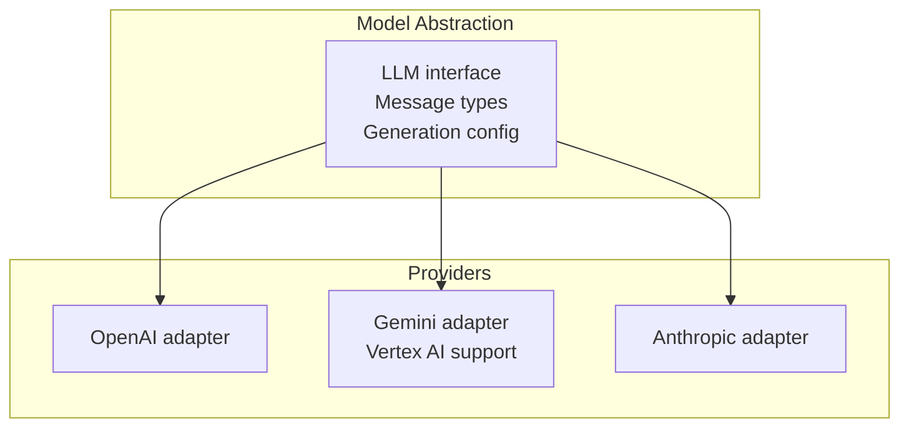
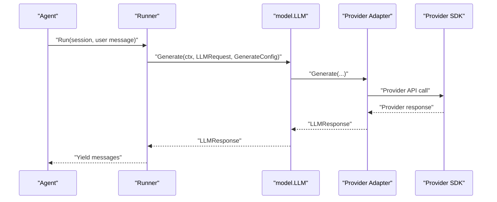
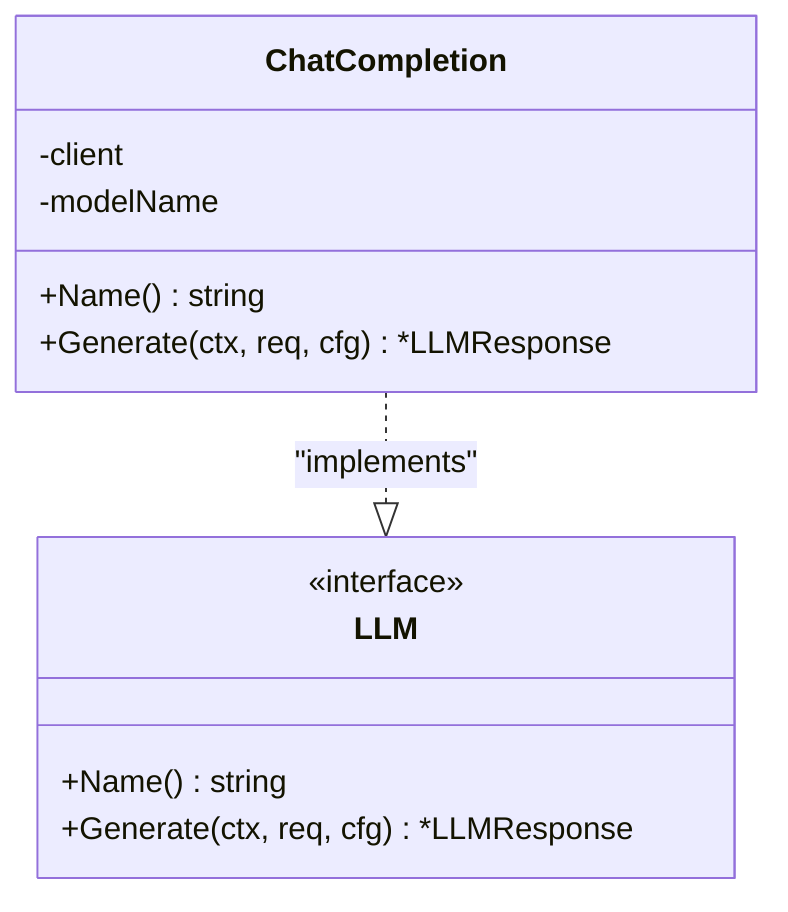
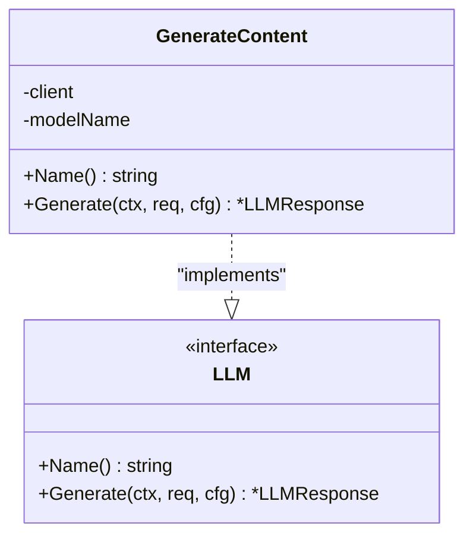
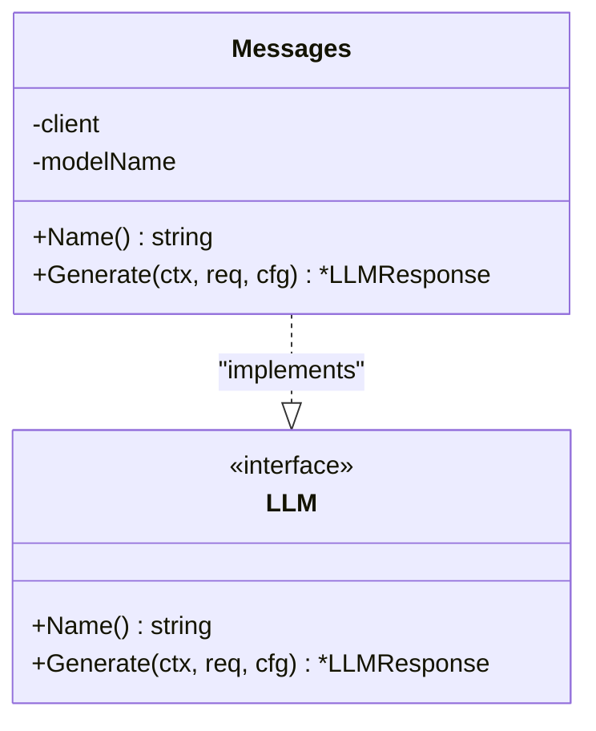
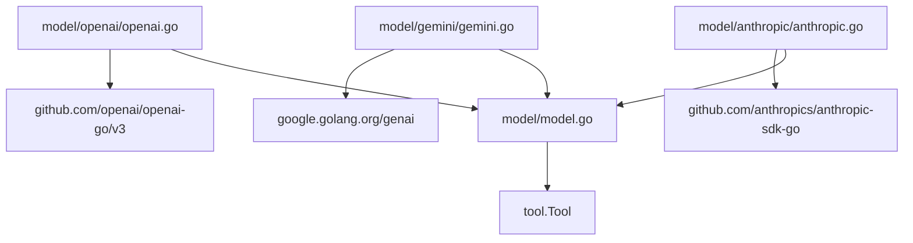

# Model Abstraction

<cite>
**Referenced Files in This Document**
- [model.go](file://model/model.go)
- [openai.go](file://model/openai/openai.go)
- [openai_test.go](file://model/openai/openai_test.go)
- [gemini.go](file://model/gemini/gemini.go)
- [gemini_test.go](file://model/gemini/gemini_test.go)
- [anthropic.go](file://model/anthropic/anthropic.go)
- [anthropic_test.go](file://model/anthropic/anthropic_test.go)
- [README.md](file://README.md)
- [go.mod](file://go.mod)
</cite>

## Table of Contents
1. [Introduction](#introduction)
2. [Project Structure](#project-structure)
3. [Core Components](#core-components)
4. [Architecture Overview](#architecture-overview)
5. [Detailed Component Analysis](#detailed-component-analysis)
6. [Dependency Analysis](#dependency-analysis)
7. [Performance Considerations](#performance-considerations)
8. [Troubleshooting Guide](#troubleshooting-guide)
9. [Conclusion](#conclusion)

## Introduction
This document explains the Model Abstraction layer that provides a provider-agnostic interface to Large Language Models (LLMs). It documents the common contract that all LLM providers implement, the message types and generation configuration patterns, and the concrete provider implementations for OpenAI, Gemini, and Anthropic. It also covers configuration, authentication, rate limiting considerations, provider-specific features, error handling, retry strategies, and performance optimizations.

## Project Structure
The Model Abstraction resides under the model package and includes provider-specific adapters:
- model/model.go defines the LLM interface, message types, and generation configuration.
- model/openai/openai.go implements the OpenAI adapter using the official OpenAI Go SDK.
- model/gemini/gemini.go implements the Gemini adapter using the official Google GenAI SDK, including Vertex AI support.
- model/anthropic/anthropic.go implements the Anthropic adapter using the official Anthropic Go SDK.

**Diagram sources**
- [model.go:9-199](file://model/model.go#L9-L199)
- [openai.go:17-76](file://model/openai/openai.go#L17-L76)
- [gemini.go:16-96](file://model/gemini/gemini.go#L16-L96)
- [anthropic.go:24-84](file://model/anthropic/anthropic.go#L24-L84)

**Section sources**
- [README.md:65-82](file://README.md#L65-L82)
- [go.mod:5-15](file://go.mod#L5-L15)

## Core Components
The Model Abstraction defines a provider-agnostic LLM interface and a set of data types that represent messages, tool calls, and generation configuration.

- LLM interface: Provides Name() and Generate() methods to identify the model and produce responses.
- Message roles: system, user, assistant, tool.
- Finish reasons: stop, tool_calls, length, content_filter.
- Generation configuration: Temperature, ReasoningEffort, ServiceTier, MaxTokens, ThinkingBudget, EnableThinking.
- Content parts: text, image URL, base64 image with MIME type and detail level.
- Tool call representation: ID, name, JSON-encoded arguments, and provider-specific thought signature.
- Token usage: prompt, completion, total tokens.
- Request/response types: LLMRequest (messages, tools, model) and LLMResponse (message, finish reason, usage).

These types unify multi-modal input, tool calling, and provider-specific capabilities behind a single contract.

**Section sources**
- [model.go:9-199](file://model/model.go#L9-L199)

## Architecture Overview
The abstraction layer sits between the agent and provider clients. Agents and runners consume model.LLM without knowing the underlying provider. Each provider adapter translates the common types to provider-specific request parameters and maps provider responses back to the common types.

**Diagram sources**
- [model.go:9-199](file://model/model.go#L9-L199)
- [openai.go:42-76](file://model/openai/openai.go#L42-L76)
- [gemini.go:65-96](file://model/gemini/gemini.go#L65-L96)
- [anthropic.go:46-84](file://model/anthropic/anthropic.go#L46-L84)

## Detailed Component Analysis

### LLM Interface Contract
- Name(): returns the model identifier used by the adapter.
- Generate(ctx, *LLMRequest, *GenerateConfig): executes a generation and returns a provider-agnostic response.

The LLMRequest carries:
- Model: provider model identifier.
- Messages: conversation history with roles and content.
- Tools: list of tools the model may call.

The LLMResponse carries:
- Message: assistant message with content, tool calls, reasoning content, and usage.
- FinishReason: why generation stopped.
- Usage: token counts.

**Section sources**
- [model.go:9-199](file://model/model.go#L9-L199)

### Message Types and Multi-modal Content
- Roles: system, user, assistant, tool.
- Message.Content vs Message.Parts: when Parts is non-empty, it takes precedence over Content.
- ContentPartType: text, image_url, image_base64 with MIME type and detail level.
- ReasoningContent: informational chain-of-thought content from reasoning-capable models.
- ToolCalls: assistant-requested tool invocations with JSON-encoded arguments.
- ToolCallID: links tool-result messages back to their originating tool call.

Provider adapters handle conversion between common message types and provider-specific formats.

**Section sources**
- [model.go:147-199](file://model/model.go#L147-L199)

### Generation Configuration Patterns
- Temperature: controls randomness.
- ReasoningEffort: provider-agnostic reasoning effort levels mapped to provider-specific controls.
- ServiceTier: provider-specific service tier selection.
- MaxTokens: overrides provider’s default maximum output tokens.
- ThinkingBudget: provider-agnostic budget for extended reasoning.
- EnableThinking: boolean toggle for reasoning; when ReasoningEffort is unset, false maps to “none”.

Provider adapters translate these settings into provider-specific parameters or request options.

**Section sources**
- [model.go:62-79](file://model/model.go#L62-L79)

### OpenAI Adapter
The OpenAI adapter implements model.LLM using the official OpenAI Go SDK. It supports:
- API key authentication.
- Base URL override for OpenAI-compatible endpoints.
- Tool definitions via function tools.
- Multi-modal user content (text and images).
- Reasoning effort and enable_thinking toggles.
- Usage reporting.

Key implementation details:
- New(apiKey, baseURL, modelName): creates a client with optional base URL override.
- Generate(ctx, req, cfg): converts messages and tools, applies config, calls Chat Completions API, and converts the response.
- Message conversion: system, user (with parts), assistant (content and tool calls), tool.
- Tool conversion: marshals tool input schema to function parameters.
- Config mapping: reasoning effort, enable_thinking, service tier, max tokens, temperature.
- Response conversion: finish reason mapping, tool calls extraction, reasoning content parsing from raw JSON when present.

**Diagram sources**
- [openai.go:17-76](file://model/openai/openai.go#L17-L76)

**Section sources**
- [openai.go:17-274](file://model/openai/openai.go#L17-L274)

#### OpenAI Configuration and Authentication
- Authentication: API key via option.WithAPIKey.
- Endpoint override: optional base URL for compatible providers.
- Model name: stored and returned by Name().
- Tool schema: JSON schema marshaled to function parameters.

Environment-driven tests demonstrate typical usage patterns and configuration.

**Section sources**
- [openai.go:23-35](file://model/openai/openai.go#L23-L35)
- [openai_test.go:23-56](file://model/openai/openai_test.go#L23-L56)

#### OpenAI Error Handling and Response Processing
- Validation errors for unknown roles and unsupported content part types.
- Mapping of finish_reason to provider-agnostic FinishReason.
- Tool call extraction and reasoning content parsing from raw JSON.
- Usage mapping from CompletionUsage.

**Section sources**
- [openai.go:78-155](file://model/openai/openai.go#L78-L155)
- [openai.go:157-189](file://model/openai/openai.go#L157-L189)
- [openai.go:191-216](file://model/openai/openai.go#L191-L216)
- [openai.go:218-273](file://model/openai/openai.go#L218-L273)

### Gemini Adapter
The Gemini adapter implements model.LLM using the official Google GenAI SDK and supports:
- Developer API mode with API key.
- Vertex AI mode with Application Default Credentials (ADC).
- System instruction placement.
- Tool definitions via FunctionDeclarations with JSON schema.
- Multi-modal user content (text, URL, base64).
- Thinking configuration via ThinkingConfig (reasoning effort and budget).
- Usage metadata mapping.

Key implementation details:
- New(ctx, apiKey, modelName): developer API client.
- NewVertexAI(ctx, project, location, modelName): Vertex AI client with ADC.
- Generate(ctx, req, cfg): converts messages and tools, applies config, calls GenerateContent, and converts response.
- Message conversion: system instruction, user parts, assistant parts, batching of consecutive tool results.
- Tool conversion: FunctionDeclarations with ParametersJsonSchema.
- Config mapping: temperature, reasoning effort, enable thinking, max output tokens.
- Response conversion: thought parts to reasoning content, function calls to tool calls, finish reason mapping, usage metadata.

**Diagram sources**
- [gemini.go:16-96](file://model/gemini/gemini.go#L16-L96)

**Section sources**
- [gemini.go:16-373](file://model/gemini/gemini.go#L16-L373)

#### Gemini Authentication and Backends
- Developer API: API key via ClientConfig.APIKey.
- Vertex AI: BackendVertexAI with project and location; ADC used by default.
- Environment-driven tests show how to configure both modes.

**Section sources**
- [gemini.go:22-58](file://model/gemini/gemini.go#L22-L58)
- [gemini_test.go:21-77](file://model/gemini/gemini_test.go#L21-L77)

#### Gemini Error Handling and Response Processing
- Unknown roles and unsupported content parts produce errors.
- System instruction is extracted and applied at the top level.
- Tool results are batched into a single user content to group function responses.
- Finish reason mapping handles safety and prohibited content as content_filter.
- Usage metadata mapping for token counts.

**Section sources**
- [gemini.go:98-163](file://model/gemini/gemini.go#L98-L163)
- [gemini.go:165-219](file://model/gemini/gemini.go#L165-L219)
- [gemini.go:221-246](file://model/gemini/gemini.go#L221-L246)
- [gemini.go:248-295](file://model/gemini/gemini.go#L248-L295)
- [gemini.go:297-372](file://model/gemini/gemini.go#L297-L372)

### Anthropic Adapter
The Anthropic adapter implements model.LLM using the official Anthropic Go SDK and supports:
- API key authentication.
- System prompts via top-level system parameter.
- Tool definitions via ToolUnionParam with JSON schema input.
- Multi-modal user content (text and images via URL/base64).
- Thinking configuration via ThinkingConfig (enabled/disabled with budget).
- Usage mapping from input/output tokens.

Key implementation details:
- New(apiKey, modelName): creates a client with API key.
- Generate(ctx, req, cfg): converts messages and tools, applies config, calls Messages.New, and converts response.
- Message conversion: system blocks, user blocks (text and images), assistant blocks (text and tool_use), batching of tool results.
- Tool conversion: ToolUnionParam with ToolInputSchemaParam.
- Config mapping: temperature, enable thinking with budget fallback, max tokens.
- Response conversion: text and thinking parts to content and reasoning content, tool_use blocks to tool calls, finish reason mapping.

**Diagram sources**
- [anthropic.go:24-84](file://model/anthropic/anthropic.go#L24-L84)

**Section sources**
- [anthropic.go:24-317](file://model/anthropic/anthropic.go#L24-L317)

#### Anthropic Configuration and Authentication
- Authentication: API key via option.WithAPIKey.
- Model name: stored and returned by Name().
- Default max tokens and thinking budget constants.

**Section sources**
- [anthropic.go:17-39](file://model/anthropic/anthropic.go#L17-L39)
- [anthropic_test.go:20-49](file://model/anthropic/anthropic_test.go#L20-L49)

#### Anthropic Error Handling and Response Processing
- Unknown roles and unsupported content parts produce errors.
- System prompts are extracted to the top-level system parameter.
- Tool results are batched into user messages as tool_result blocks.
- Finish reason mapping includes tool_use to tool_calls.
- Usage mapping from input/output tokens.

**Section sources**
- [anthropic.go:86-138](file://model/anthropic/anthropic.go#L86-L138)
- [anthropic.go:140-202](file://model/anthropic/anthropic.go#L140-L202)
- [anthropic.go:204-231](file://model/anthropic/anthropic.go#L204-L231)
- [anthropic.go:233-251](file://model/anthropic/anthropic.go#L233-L251)
- [anthropic.go:253-316](file://model/anthropic/anthropic.go#L253-L316)

### Provider-Specific Features Summary
- OpenAI: reasoning_effort, enable_thinking toggle, service tier, function tools, raw reasoning content extraction.
- Gemini: ThinkingConfig with levels and budgets, system instruction, FunctionDeclarations, usage metadata.
- Anthropic: ThinkingConfig enabled/disabled with budget, system prompts, tool_use blocks, usage mapping.

**Section sources**
- [openai.go:191-216](file://model/openai/openai.go#L191-L216)
- [gemini.go:248-295](file://model/gemini/gemini.go#L248-L295)
- [anthropic.go:233-251](file://model/anthropic/anthropic.go#L233-L251)

## Dependency Analysis
The Model Abstraction depends on the tool interface and provider SDKs. The adapters depend on their respective SDKs and translate between common types and provider-specific parameters.

**Diagram sources**
- [model.go:6-6](file://model/model.go#L6-L6)
- [openai.go:8-14](file://model/openai/openai.go#L8-L14)
- [gemini.go:10-13](file://model/gemini/gemini.go#L10-L13)
- [anthropic.go:9-14](file://model/anthropic/anthropic.go#L9-L14)
- [go.mod:5-15](file://go.mod#L5-L15)

**Section sources**
- [go.mod:5-15](file://go.mod#L5-L15)

## Performance Considerations
- Minimize round-trips: leverage tool-call loops in the agent to batch tool executions and reduce latency.
- Use MaxTokens judiciously: cap output tokens to control cost and latency.
- Reasoning effort and budgets: adjust ReasoningEffort or EnableThinking to balance quality and speed.
- Multi-modal content: prefer base64 images for maximum compatibility and avoid unnecessary image detail levels.
- Usage tracking: monitor TokenUsage to optimize prompts and reduce token consumption.
- Streaming: while adapters focus on single-shot generation, consider streaming APIs at the runner level if needed.

[No sources needed since this section provides general guidance]

## Troubleshooting Guide
Common issues and resolutions:
- Unknown message role or unsupported content part type: ensure messages conform to supported roles and part types.
- No choices/candidates returned: verify model availability and request validity.
- Tool call mismatches: ensure ToolCallID links tool-result messages back to the original tool call.
- Authentication failures: confirm API keys and environment variables for each provider.
- Rate limits and quotas: implement retries with exponential backoff and consider provider-specific rate-limit headers.
- Reasoning content absence: verify EnableThinking or ReasoningEffort settings for reasoning-capable models.

Provider-specific tests demonstrate typical scenarios and environment-driven configuration.

**Section sources**
- [openai.go:78-155](file://model/openai/openai.go#L78-L155)
- [gemini.go:98-163](file://model/gemini/gemini.go#L98-L163)
- [anthropic.go:86-138](file://model/anthropic/anthropic.go#L86-L138)
- [openai_test.go:130-133](file://model/openai/openai_test.go#L130-L133)
- [gemini_test.go:222-225](file://model/gemini/gemini_test.go#L222-L225)
- [anthropic_test.go:173-176](file://model/anthropic/anthropic_test.go#L173-L176)

## Conclusion
The Model Abstraction layer cleanly separates agent logic from provider specifics. By defining a common LLM interface, message types, and generation configuration, it enables seamless switching among OpenAI, Gemini, and Anthropic while preserving provider-specific capabilities. The adapters encapsulate provider differences, offering robust conversion logic, configuration mapping, and response processing. With clear authentication patterns, environment-driven configuration, and comprehensive error handling, the abstraction supports production-grade AI agents.