# OpenAI Integration

<cite>
**Referenced Files in This Document**
- [openai.go](file://model/openai/openai.go)
- [openai_test.go](file://model/openai/openai_test.go)
- [model.go](file://model/model.go)
- [llmagent.go](file://agent/llmagent/llmagent.go)
- [main.go](file://examples/chat/main.go)
- [README.md](file://README.md)
- [go.mod](file://go.mod)
</cite>

## Update Summary
**Changes Made**
- Enhanced streaming support documentation with incremental text chunks and tool call detection
- Added reasoning content processing capabilities for reasoning-capable models
- Updated response conversion section to cover streaming scenarios
- Expanded troubleshooting guide with streaming-specific considerations
- Added comprehensive testing coverage for streaming functionality

## Table of Contents
1. [Introduction](#introduction)
2. [Project Structure](#project-structure)
3. [Core Components](#core-components)
4. [Architecture Overview](#architecture-overview)
5. [Detailed Component Analysis](#detailed-component-analysis)
6. [Dependency Analysis](#dependency-analysis)
7. [Performance Considerations](#performance-considerations)
8. [Troubleshooting Guide](#troubleshooting-guide)
9. [Conclusion](#conclusion)
10. [Appendices](#appendices)

## Introduction
This document provides comprehensive documentation for integrating OpenAI LLM providers using the ADK framework. It explains the OpenAI adapter implementation, API client initialization, authentication setup, configuration options, and the adapter's conversion between provider-specific requests/responses and the generic LLM interface types. It also covers OpenAI-specific features such as reasoning effort mapping, tool call support, multi-modal content processing, and **comprehensive streaming support with incremental text chunks, reasoning content processing, and tool call detection during streaming responses**. Practical guidance is included for model selection, parameter tuning, rate limiting considerations, error handling strategies, provider-specific limitations, token pricing considerations, and best practices for cost optimization, along with integration patterns with the agent system.

## Project Structure
The OpenAI integration resides in the model/openai package and integrates with the provider-agnostic model types, agent orchestration, and example usage. The key files are:
- Adapter implementation: model/openai/openai.go
- Provider-agnostic types and interfaces: model/model.go
- Agent orchestration: agent/llmagent/llmagent.go
- Example usage: examples/chat/main.go
- Documentation: README.md
- Dependencies: go.mod

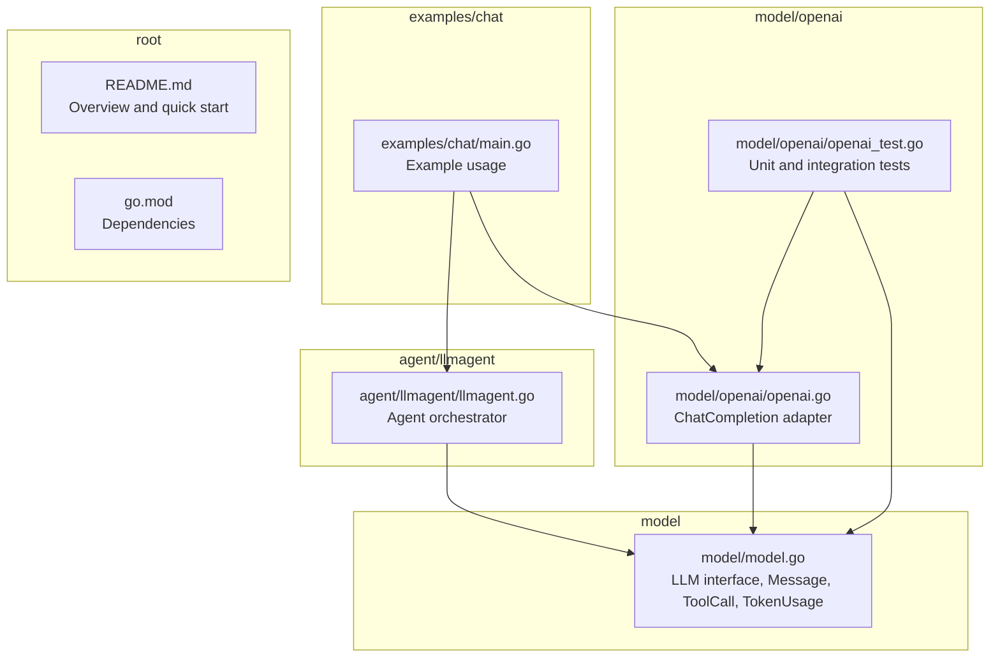

**Diagram sources**
- [openai.go:1-362](file://model/openai/openai.go#L1-L362)
- [model.go:1-227](file://model/model.go#L1-L227)
- [llmagent.go:1-159](file://agent/llmagent/llmagent.go#L1-L159)
- [main.go:1-181](file://examples/chat/main.go#L1-L181)
- [README.md:1-296](file://README.md#L1-L296)
- [go.mod:1-47](file://go.mod#L1-L47)

**Section sources**
- [README.md:65-82](file://README.md#L65-L82)
- [go.mod:5-15](file://go.mod#L5-L15)

## Core Components
- OpenAI ChatCompletion adapter: Implements the provider-agnostic LLM interface and translates between generic LLM requests and OpenAI API calls.
- Provider-agnostic types: Define roles, messages, tool calls, token usage, finish reasons, and configuration options.
- Agent orchestration: Drives the LLM with automatic tool-call loops and integrates with session persistence.

Key responsibilities:
- Authentication and client initialization via API key and optional base URL override.
- Request conversion: generic LLMRequest to OpenAI ChatCompletion parameters.
- Response conversion: OpenAI response to generic LLMResponse.
- **Streaming support: incremental partial responses with text chunks, reasoning content, and tool call accumulation during streaming.**
- Tool call support: bidirectional mapping between generic tool calls and provider tool definitions.
- Multi-modal content: text and images (URL or base64) for user messages.
- Reasoning effort mapping: reasoning effort levels and enable/disable toggles.

**Section sources**
- [openai.go:19-164](file://model/openai/openai.go#L19-L164)
- [model.go:10-227](file://model/model.go#L10-L227)
- [llmagent.go:25-105](file://agent/llmagent/llmagent.go#L25-L105)

## Architecture Overview
The OpenAI adapter sits between the agent and the OpenAI API. The agent prepares the conversation history and tool definitions, the adapter converts them to OpenAI-compatible parameters, and the OpenAI client executes the request. Responses are converted back to the generic LLMResponse format, including token usage and finish reasons. **The streaming architecture supports real-time text delivery with incremental chunks and tool call detection during the streaming process.**

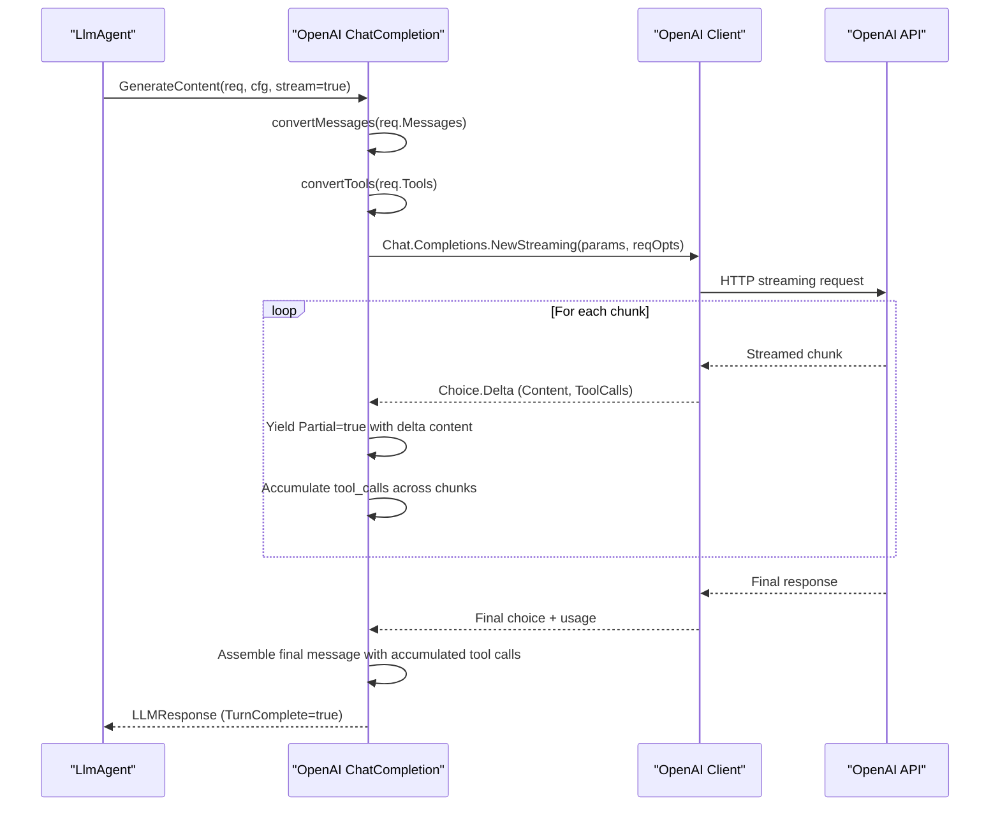

**Diagram sources**
- [openai.go:44-164](file://model/openai/openai.go#L44-L164)
- [llmagent.go:51-105](file://agent/llmagent/llmagent.go#L51-L105)

## Detailed Component Analysis

### OpenAI Adapter Implementation
The ChatCompletion adapter encapsulates an OpenAI client and model name. It exposes:
- Name(): returns the model identifier.
- GenerateContent(): sends requests to the OpenAI Chat Completions API, supporting both non-streaming and **streaming modes with comprehensive incremental text chunk support**.

Implementation highlights:
- Authentication: API key is required; optional base URL override for compatible providers.
- Request conversion: messages and tools mapped to OpenAI parameters.
- **Streaming: accumulates deltas, yields partial text chunks with Partial=true, detects tool calls across chunks, and assembles final response with tool calls and finish reason.**
- Response conversion: maps provider response to generic LLMResponse, including token usage and finish reason.
- Reasoning effort: supports explicit reasoning effort levels and a boolean toggle for providers that do not use reasoning effort.
- **Reasoning content extraction: extracts reasoning_content from raw JSON responses for reasoning-capable providers.**

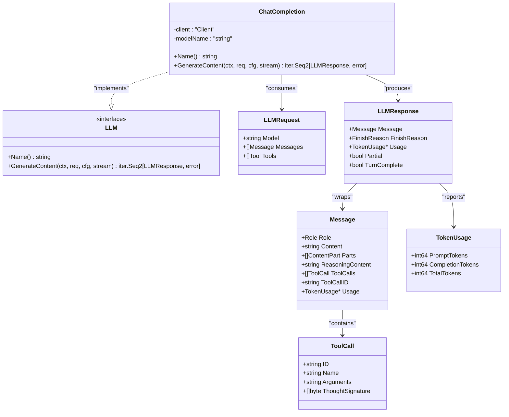

**Diagram sources**
- [openai.go:19-42](file://model/openai/openai.go#L19-L42)
- [model.go:10-227](file://model/model.go#L10-L227)

**Section sources**
- [openai.go:25-42](file://model/openai/openai.go#L25-L42)
- [openai.go:44-164](file://model/openai/openai.go#L44-L164)
- [openai.go:166-243](file://model/openai/openai.go#L166-L243)
- [openai.go:245-277](file://model/openai/openai.go#L245-L277)
- [openai.go:279-304](file://model/openai/openai.go#L279-L304)
- [openai.go:306-345](file://model/openai/openai.go#L306-L345)
- [openai.go:347-361](file://model/openai/openai.go#L347-L361)

### Request Conversion
- Messages: Role mapping to system/user/assistant/tool; multi-modal user parts converted to text and image content parts.
- Tools: Tool definitions converted to function tools using JSON Schema.

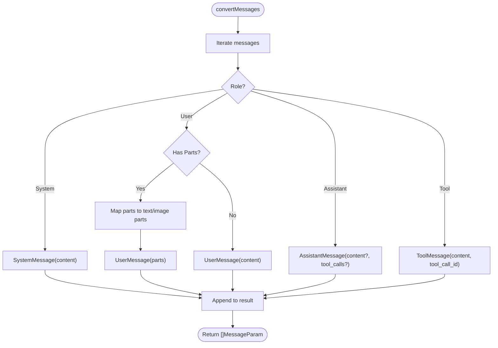

**Diagram sources**
- [openai.go:166-243](file://model/openai/openai.go#L166-L243)

**Section sources**
- [openai.go:166-243](file://model/openai/openai.go#L166-L243)

### Response Conversion and Streaming
- Non-streaming: single response with token usage and finish reason.
- **Streaming: yields partial text chunks (Partial=true) with incremental content, accumulates tool calls across chunks, and assembles final response with tool calls and finish reason.**

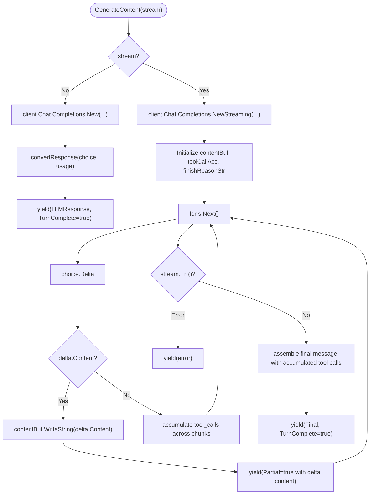

**Diagram sources**
- [openai.go:44-164](file://model/openai/openai.go#L44-L164)

**Section sources**
- [openai.go:44-164](file://model/openai/openai.go#L44-L164)

### Streaming Support Details
**Updated** The OpenAI adapter now provides comprehensive streaming support with the following capabilities:

- **Incremental Text Chunks**: When streaming is enabled, the adapter yields partial responses (Partial=true) containing only the newly generated text content. These chunks are streamed immediately as they become available.
- **Tool Call Detection During Streaming**: Tool calls are detected and accumulated across streaming chunks. The adapter maintains a map of tool call fragments indexed by their position and reconstructs complete tool calls by concatenating arguments across chunks.
- **Reasoning Content Processing**: For reasoning-capable models, the adapter extracts reasoning_content from the raw JSON response when present, making it available in the ReasoningContent field of the Message structure.
- **Partial Response Handling**: Streaming responses include only the incremental content, while other fields remain zero-valued until the final complete response is assembled.

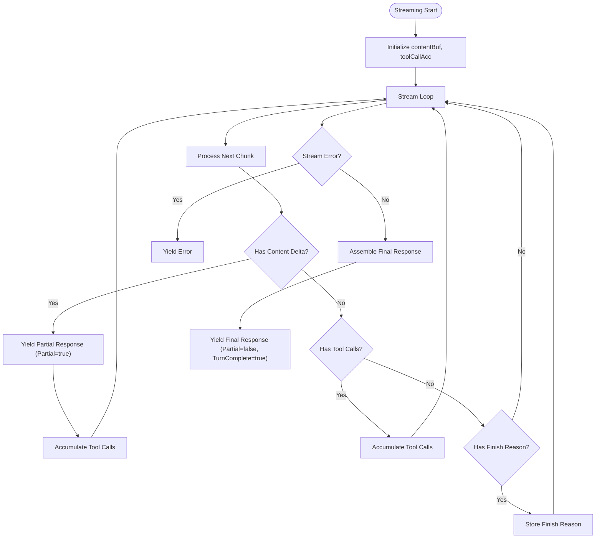

**Diagram sources**
- [openai.go:89-163](file://model/openai/openai.go#L89-L163)

**Section sources**
- [openai.go:89-163](file://model/openai/openai.go#L89-L163)

### Tool Call Support
- Tool definitions are converted to function tools with JSON Schema parameters.
- Assistant tool calls are mapped to generic ToolCall structures.
- Tool results are linked back via ToolCallID.

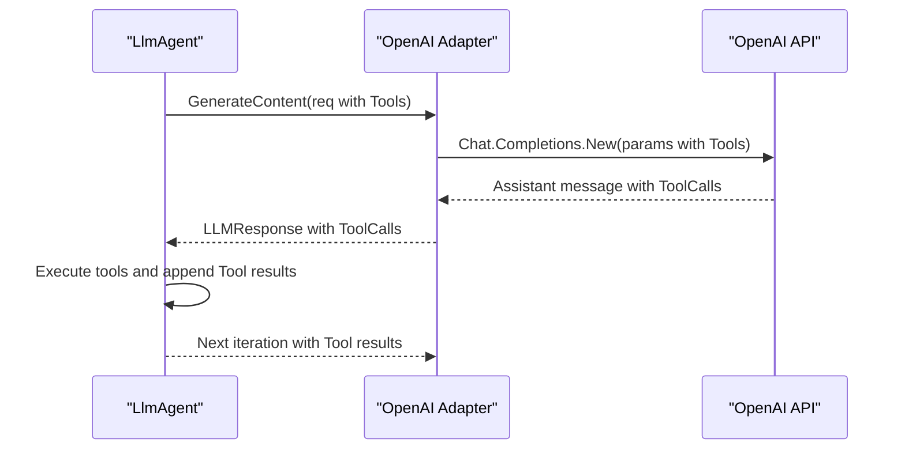

**Diagram sources**
- [openai.go:245-277](file://model/openai/openai.go#L245-L277)
- [llmagent.go:72-104](file://agent/llmagent/llmagent.go#L72-L104)

**Section sources**
- [openai.go:245-277](file://model/openai/openai.go#L245-L277)
- [llmagent.go:72-104](file://agent/llmagent/llmagent.go#L72-L104)

### Multi-modal Content Processing
- User messages can include text and images (URL or base64).
- Image detail controls processing fidelity.
- Base64 images are converted to data URIs automatically.

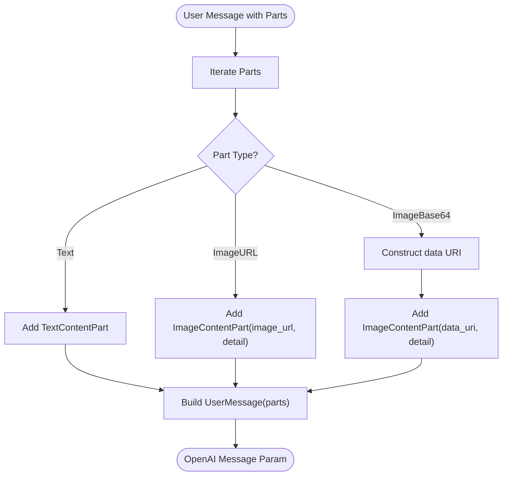

**Diagram sources**
- [openai.go:185-210](file://model/openai/openai.go#L185-L210)
- [model.go:111-128](file://model/model.go#L111-L128)

**Section sources**
- [openai.go:185-210](file://model/openai/openai.go#L185-L210)
- [model.go:86-128](file://model/model.go#L86-L128)

### Reasoning Effort Mapping
- Explicit reasoning effort levels are mapped to provider values.
- When reasoning effort is not set but thinking is disabled, it maps to "none".
- For providers that use a boolean toggle instead of reasoning effort, a JSON option is injected.

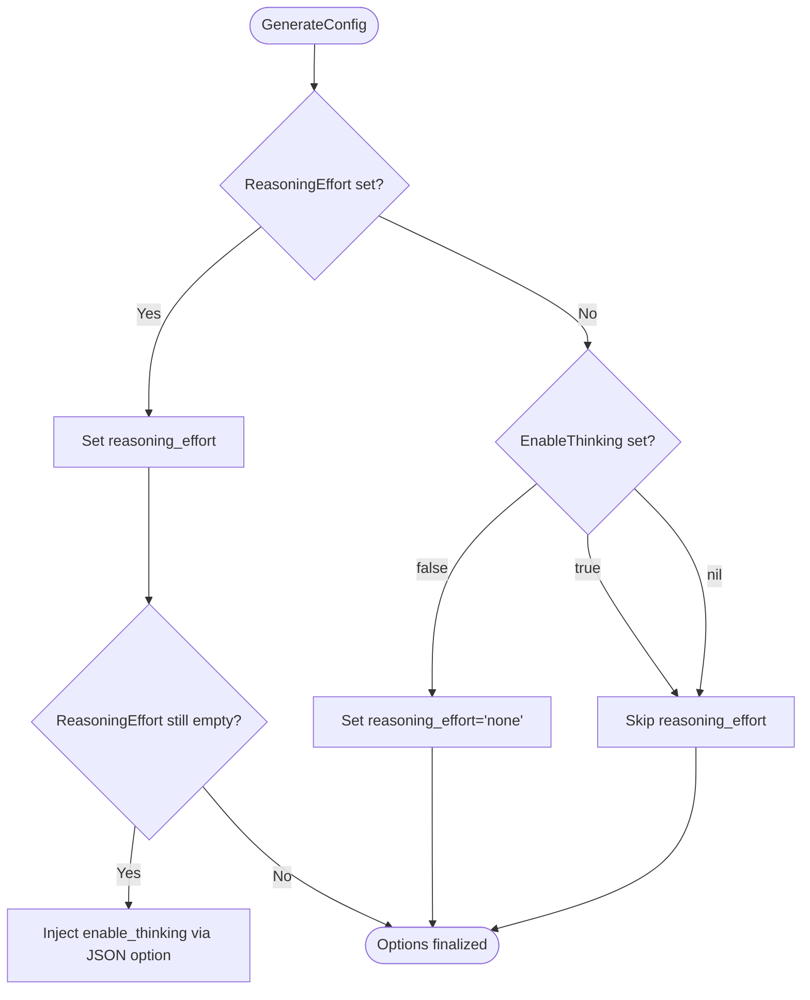

**Diagram sources**
- [openai.go:279-304](file://model/openai/openai.go#L279-L304)

**Section sources**
- [openai.go:279-304](file://model/openai/openai.go#L279-L304)

### Reasoning Content Processing
**Updated** The adapter now includes comprehensive reasoning content processing capabilities:

- **Raw JSON Extraction**: The adapter extracts reasoning_content from the raw JSON response when present, specifically targeting reasoning-capable providers (e.g., DeepSeek-R1, compatible endpoints).
- **Structured Access**: Reasoning content is made available in the ReasoningContent field of the Message structure, allowing downstream components to access and utilize the model's internal chain-of-thought output.
- **Informational Purpose**: Reasoning content is informational only and is not forwarded to the LLM on subsequent turns, maintaining conversation flow integrity.

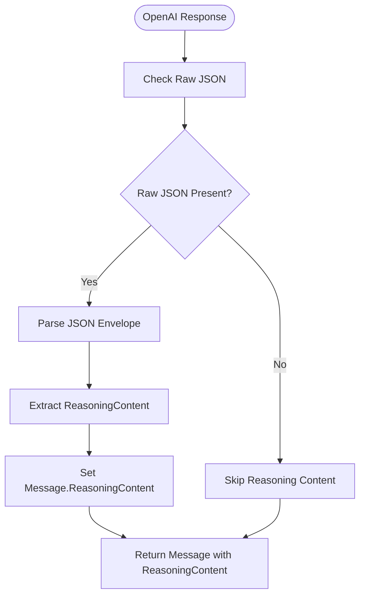

**Diagram sources**
- [openai.go:313-323](file://model/openai/openai.go#L313-L323)

**Section sources**
- [openai.go:313-323](file://model/openai/openai.go#L313-L323)

### Configuration Options
- Temperature: controls randomness.
- ReasoningEffort: controls reasoning depth.
- ServiceTier: selects service tier.
- MaxTokens: limits generation length.
- ThinkingBudget: budget for extended reasoning (provider-dependent).
- EnableThinking: boolean toggle for reasoning capability.

These options are applied to OpenAI parameters and request options depending on the provider's capabilities.

**Section sources**
- [model.go:67-84](file://model/model.go#L67-L84)
- [openai.go:279-304](file://model/openai/openai.go#L279-L304)

### Authentication Setup and Client Initialization
- API key is mandatory; passed via request option.
- Optional base URL override enables compatibility with OpenAI-compatible providers.
- Model name is stored and used for request routing.

**Section sources**
- [openai.go:25-37](file://model/openai/openai.go#L25-L37)

### Integration Patterns with the Agent System
- The agent prepends a system instruction and runs a loop until the LLM stops or completes tool calls.
- The adapter handles streaming and non-streaming responses uniformly.
- Tool results are appended to the conversation history for subsequent turns.
- **Streaming integration: The agent yields partial events for real-time display and complete events for final message assembly.**

**Section sources**
- [llmagent.go:51-105](file://agent/llmagent/llmagent.go#L51-L105)
- [openai.go:44-164](file://model/openai/openai.go#L44-L164)

## Dependency Analysis
External dependencies relevant to OpenAI integration:
- OpenAI client SDK for Go v3: used for API calls and streaming.
- JSON schema for tool definitions.
- MCP SDK for tool integration.

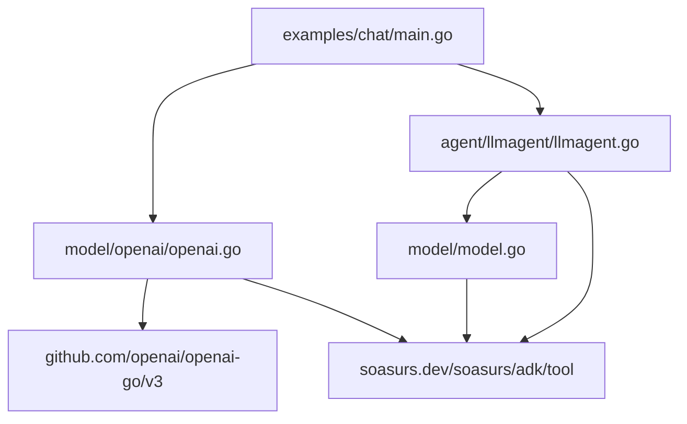

**Diagram sources**
- [openai.go:3-17](file://model/openai/openai.go#L3-L17)
- [llmagent.go:3-11](file://agent/llmagent/llmagent.go#L3-L11)
- [main.go:24-31](file://examples/chat/main.go#L24-L31)
- [go.mod:5-15](file://go.mod#L5-L15)

**Section sources**
- [go.mod:5-15](file://go.mod#L5-L15)

## Performance Considerations
- **Streaming reduces latency for long generations by yielding partial text immediately, enabling real-time user experience.**
- Token usage reporting enables cost-awareness and budgeting.
- Reasoning effort and thinking toggles can increase token usage; tune carefully for cost control.
- Multi-modal content increases token consumption; use appropriate image detail levels.
- **Streaming with tool call detection requires careful buffer management to handle fragmented tool call arguments across chunks.**

## Troubleshooting Guide
Common issues and strategies:
- Authentication failures: ensure API key is set and valid; verify base URL if using a compatible provider.
- No choices returned: check model availability and request parameters.
- **Streaming errors: inspect stream.Err() and handle partial responses appropriately; ensure proper handling of tool call argument fragmentation across chunks.**
- Tool call mismatches: verify tool definitions and JSON schema alignment.
- Rate limiting: implement retries with exponential backoff and respect provider quotas.
- **Reasoning content not appearing: verify the model supports reasoning and that EnableThinking is properly configured for reasoning-capable models.**
- **Partial response handling: ensure downstream components properly handle Partial=true responses and accumulate content until TurnComplete=true.**

**Section sources**
- [openai.go:74-82](file://model/openai/openai.go#L74-L82)
- [openai.go:139-142](file://model/openai/openai.go#L139-L142)

## Conclusion
The OpenAI adapter provides a robust, provider-agnostic integration with OpenAI's Chat Completions API. It supports streaming, tool calls, multi-modal content, and reasoning effort controls while maintaining a clean separation from agent logic. **The comprehensive streaming support with incremental text chunks, reasoning content processing, and tool call detection during streaming responses makes it suitable for real-time applications requiring immediate feedback and sophisticated reasoning capabilities.** By leveraging the generic LLM interface, developers can configure models, tune parameters, and integrate tools seamlessly, with clear pathways for cost optimization and error handling.

## Appendices

### Practical Examples and Configuration
- Environment variables for example usage:
  - OPENAI_API_KEY: required for authentication.
  - OPENAI_BASE_URL: optional base URL override for compatible providers.
  - OPENAI_MODEL: model name; defaults to a common model when omitted.
- Example usage demonstrates initializing the OpenAI adapter, connecting MCP tools, constructing an agent, and running a chat loop with streaming enabled.
- **Streaming demonstration: The example shows real-time text streaming with partial responses and tool call detection during conversation flow.**

**Section sources**
- [main.go:3-12](file://examples/chat/main.go#L3-L12)
- [main.go:52-66](file://examples/chat/main.go#L52-L66)
- [README.md:85-96](file://README.md#L85-L96)

### Testing Coverage
- Unit tests validate message conversion, tool conversion, finish reason mapping, and reasoning effort toggles.
- Integration tests exercise text generation, tool calls, and reasoning model behavior with explicit thinking toggles.
- **Streaming tests validate incremental text chunk delivery, tool call accumulation across chunks, and reasoning content extraction from raw JSON responses.**

**Section sources**
- [openai_test.go:62-84](file://model/openai/openai_test.go#L62-L84)
- [openai_test.go:135-185](file://model/openai/openai_test.go#L135-L185)
- [openai_test.go:208-290](file://model/openai/openai_test.go#L208-L290)
- [openai_test.go:311-354](file://model/openai/openai_test.go#L311-L354)