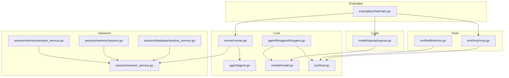
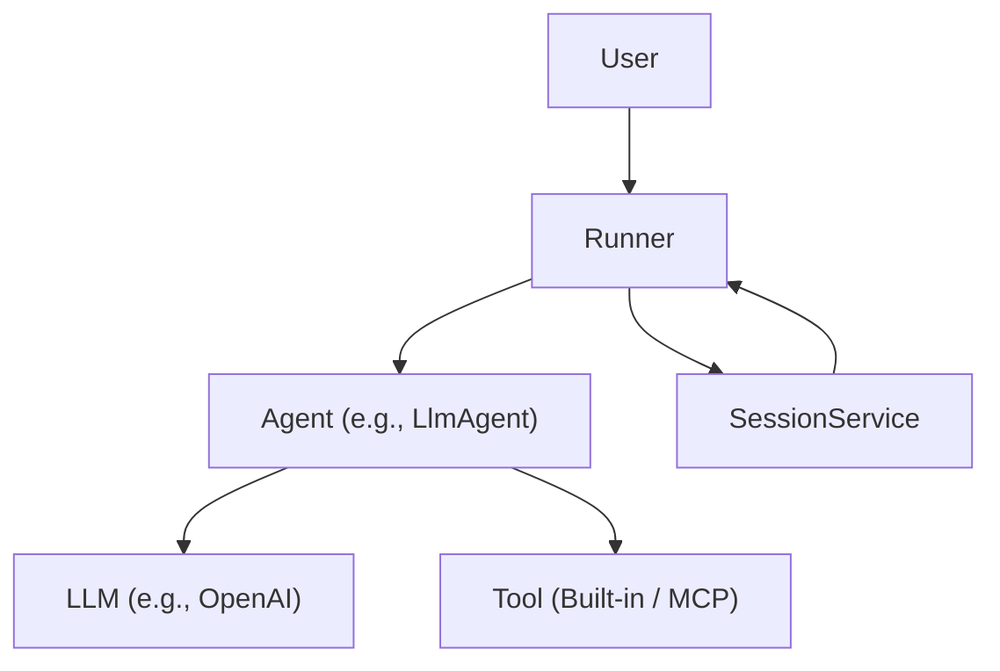
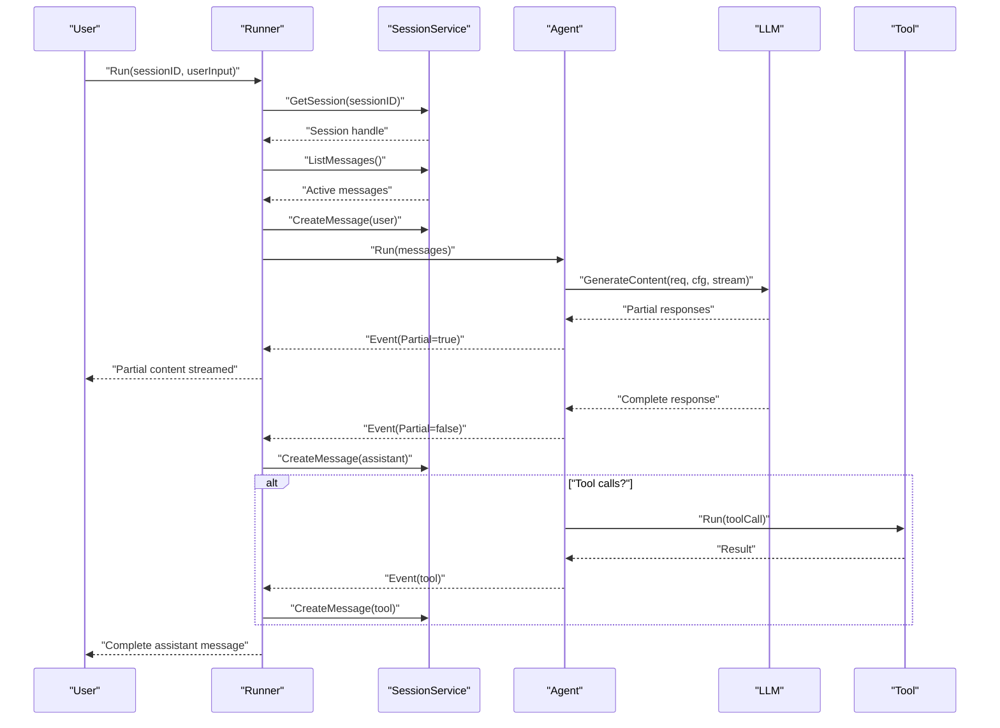
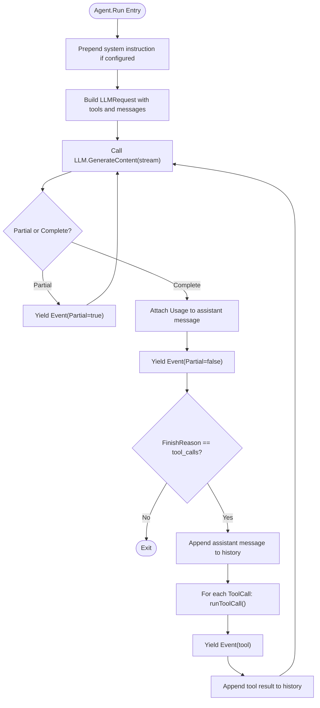
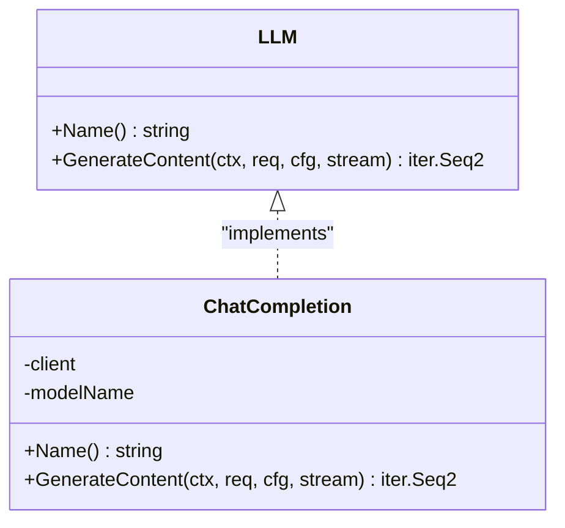
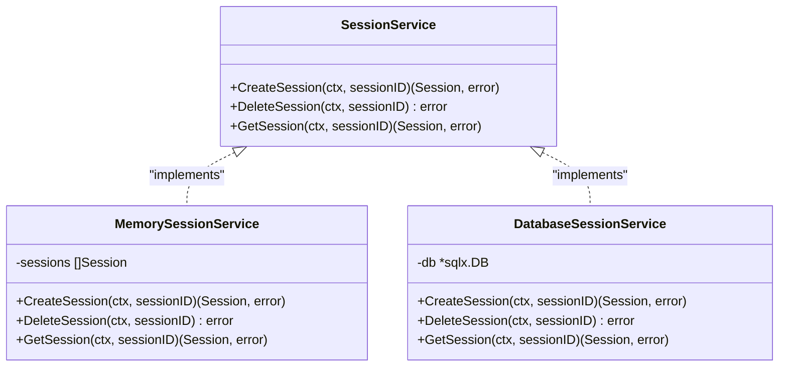
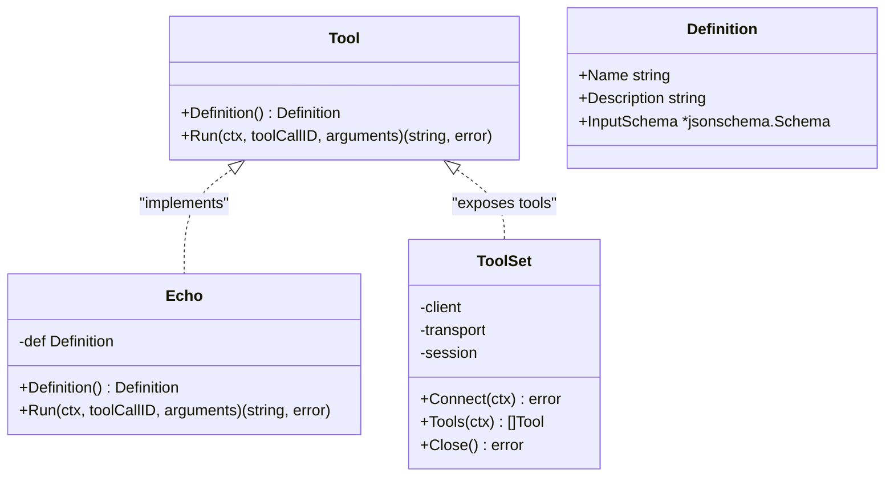
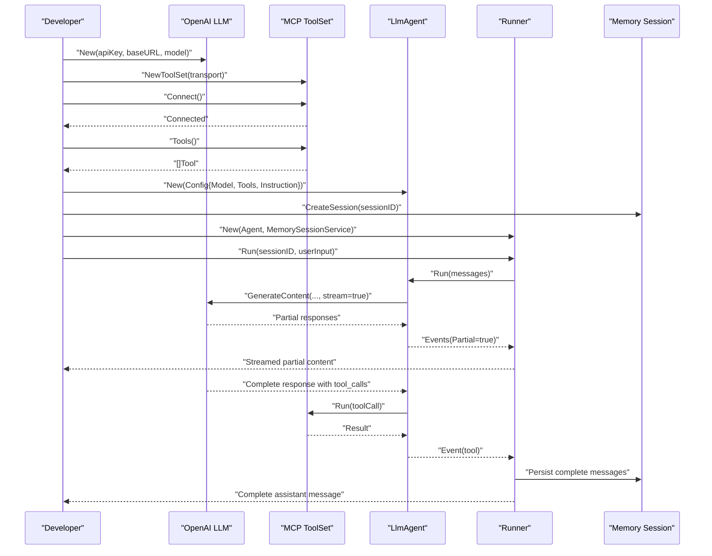
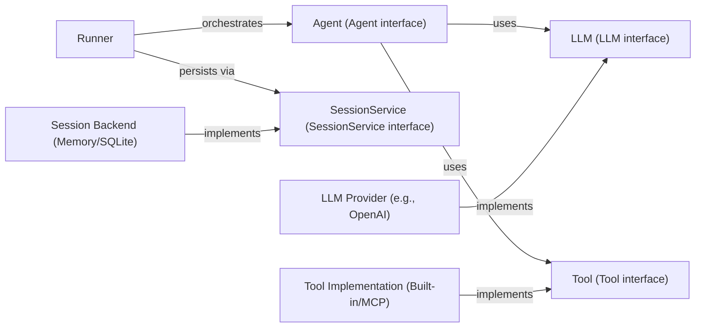

# Architecture Overview

<cite>
**Referenced Files in This Document**
- [README.md](file://README.md)
- [agent/agent.go](file://agent/agent.go)
- [agent/llmagent/llmagent.go](file://agent/llmagent/llmagent.go)
- [runner/runner.go](file://runner/runner.go)
- [model/model.go](file://model/model.go)
- [model/openai/openai.go](file://model/openai/openai.go)
- [session/session_service.go](file://session/session_service.go)
- [session/memory/session_service.go](file://session/memory/session_service.go)
- [session/memory/session.go](file://session/memory/session.go)
- [session/database/session_service.go](file://session/database/session_service.go)
- [tool/tool.go](file://tool/tool.go)
- [tool/builtin/echo.go](file://tool/builtin/echo.go)
- [tool/mcp/mcp.go](file://tool/mcp/mcp.go)
- [examples/chat/main.go](file://examples/chat/main.go)
- [go.mod](file://go.mod)
</cite>

## Table of Contents
1. [Introduction](#introduction)
2. [Project Structure](#project-structure)
3. [Core Components](#core-components)
4. [Architecture Overview](#architecture-overview)
5. [Detailed Component Analysis](#detailed-component-analysis)
6. [Dependency Analysis](#dependency-analysis)
7. [Performance Considerations](#performance-considerations)
8. [Troubleshooting Guide](#troubleshooting-guide)
9. [Conclusion](#conclusion)

## Introduction
This document presents the high-level architecture of ADK (Agent Development Kit), focusing on the layered design that separates stateless agent logic from stateful session management and provider-specific LLM implementations. The system emphasizes:
- Stateless agents that encapsulate conversational logic and tool orchestration
- Stateful runners that manage session persistence and message lifecycle
- Provider-agnostic LLM interfaces and pluggable tool integrations
- Streaming via Go iterators for real-time user feedback
- Extensibility through interfaces and adapters

The architecture supports swapping LLM providers, switching session backends, and adding tools without changing agent code.

## Project Structure
ADK is organized into packages that align with distinct responsibilities:
- agent: Defines the Agent interface and concrete agent implementations (e.g., LlmAgent)
- model: Provides provider-agnostic LLM interfaces, message types, and streaming primitives
- session: Defines session abstractions and offers in-memory and SQLite backends
- tool: Defines the Tool interface and built-in/MCP integrations
- runner: Orchestrates Agent and SessionService to drive conversational turns
- examples: Demonstrates usage with OpenAI and MCP tools

**Diagram sources**
- [agent/agent.go:10-19](file://agent/agent.go#L10-L19)
- [agent/llmagent/llmagent.go:29-45](file://agent/llmagent/llmagent.go#L29-L45)
- [runner/runner.go:17-37](file://runner/runner.go#L17-L37)
- [model/model.go:10-18](file://model/model.go#L10-L18)
- [tool/tool.go:17-23](file://tool/tool.go#L17-L23)
- [session/session_service.go:5-9](file://session/session_service.go#L5-L9)
- [session/memory/session_service.go:14-16](file://session/memory/session_service.go#L14-L16)
- [session/memory/session.go:18-24](file://session/memory/session.go#L18-L24)
- [session/database/session_service.go:23-25](file://session/database/session_service.go#L23-L25)
- [model/openai/openai.go:19-37](file://model/openai/openai.go#L19-L37)
- [tool/builtin/echo.go:22-34](file://tool/builtin/echo.go#L22-L34)
- [tool/mcp/mcp.go:22-33](file://tool/mcp/mcp.go#L22-L33)
- [examples/chat/main.go:52-123](file://examples/chat/main.go#L52-L123)

**Section sources**
- [README.md:65-82](file://README.md#L65-L82)
- [go.mod:1-47](file://go.mod#L1-L47)

## Core Components
- Agent: Encapsulates conversational logic and yields a stream of Events. The Agent interface defines Name, Description, and Run, returning an iterator of model.Event.
- LlmAgent: A stateless agent that:
  - Prepends a system instruction when configured
  - Calls model.LLM.GenerateContent in a loop
  - Executes tool calls automatically and yields assistant/tool messages
  - Supports streaming partial responses
- Runner: Stateful orchestrator that:
  - Loads session history and persists user input
  - Drives Agent.Run and forwards yielded Events to the caller
  - Persists only complete Events (Partial=false) to the session
- LLM implementations: Provider adapters (e.g., OpenAI) implement model.LLM and translate between provider APIs and the unified model types
- SessionService: Abstraction for session creation, retrieval, and deletion; concrete backends include in-memory and SQLite
- Tool: Provider-agnostic interface for tools; built-ins (e.g., Echo) and MCP bridges expose external capabilities

**Section sources**
- [agent/agent.go:10-19](file://agent/agent.go#L10-L19)
- [agent/llmagent/llmagent.go:29-45](file://agent/llmagent/llmagent.go#L29-L45)
- [runner/runner.go:17-37](file://runner/runner.go#L17-L37)
- [model/model.go:10-18](file://model/model.go#L10-L18)
- [session/session_service.go:5-9](file://session/session_service.go#L5-L9)
- [tool/tool.go:17-23](file://tool/tool.go#L17-L23)

## Architecture Overview
ADK follows a layered architecture:
- Presentation/Orchestration Layer: Runner
- Domain Layer: Agent (stateless), Tool definitions
- Infrastructure Layer: SessionService (stateful), LLM adapters

**Diagram sources**
- [runner/runner.go:17-37](file://runner/runner.go#L17-L37)
- [agent/llmagent/llmagent.go:29-45](file://agent/llmagent/llmagent.go#L29-L45)
- [model/openai/openai.go:19-37](file://model/openai/openai.go#L19-L37)
- [tool/mcp/mcp.go:22-33](file://tool/mcp/mcp.go#L22-L33)

## Detailed Component Analysis

### Runner Orchestration
Runner coordinates a stateless Agent with a SessionService. It:
- Loads session history and appends user input
- Invokes Agent.Run and streams Events to the caller
- Persists only complete Events to the session
- Assigns IDs and timestamps to persisted messages

**Diagram sources**
- [runner/runner.go:45-96](file://runner/runner.go#L45-L96)
- [agent/llmagent/llmagent.go:59-125](file://agent/llmagent/llmagent.go#L59-L125)
- [model/model.go:173-227](file://model/model.go#L173-L227)

**Section sources**
- [runner/runner.go:17-108](file://runner/runner.go#L17-L108)

### LlmAgent Loop and Tool Execution
LlmAgent implements the Agent interface and:
- Prepends a system instruction if configured
- Builds an LLMRequest with tools and messages
- Streams partial responses when enabled
- After receiving a complete assistant message, checks FinishReason
- If FinishReason is tool_calls, executes tools and appends results back into the conversation

**Diagram sources**
- [agent/llmagent/llmagent.go:59-125](file://agent/llmagent/llmagent.go#L59-L125)
- [model/model.go:188-212](file://model/model.go#L188-L212)

**Section sources**
- [agent/llmagent/llmagent.go:29-148](file://agent/llmagent/llmagent.go#L29-L148)

### LLM Provider Abstraction (OpenAI Adapter)
The OpenAI adapter implements model.LLM and:
- Converts model.Message and model.Tool to provider-specific structures
- Supports non-streaming and streaming responses
- Aggregates tool-call deltas and emits final complete responses
- Applies GenerateConfig (temperature, reasoning effort, service tier, thinking toggles)

**Diagram sources**
- [model/model.go:10-18](file://model/model.go#L10-L18)
- [model/openai/openai.go:19-42](file://model/openai/openai.go#L19-L42)

**Section sources**
- [model/openai/openai.go:19-362](file://model/openai/openai.go#L19-L362)

### Session Backends
ADK provides two session backends via the SessionService interface:
- In-memory backend: stores messages in process memory and supports compaction
- SQLite backend: persists sessions to disk using sqlx

**Diagram sources**
- [session/session_service.go:5-9](file://session/session_service.go#L5-L9)
- [session/memory/session_service.go:14-16](file://session/memory/session_service.go#L14-L16)
- [session/database/session_service.go:23-25](file://session/database/session_service.go#L23-L25)

**Section sources**
- [session/memory/session_service.go:10-41](file://session/memory/session_service.go#L10-L41)
- [session/memory/session.go:12-86](file://session/memory/session.go#L12-L86)
- [session/database/session_service.go:19-49](file://session/database/session_service.go#L19-L49)

### Tool Integrations
Tools expose a Definition and a Run method. Built-in tools (e.g., Echo) and MCP bridges wrap external capabilities:
- Built-in tools define JSON schemas and execute synchronously
- MCP tools dynamically discover server-provided tools and call them remotely

**Diagram sources**
- [tool/tool.go:9-23](file://tool/tool.go#L9-L23)
- [tool/builtin/echo.go:14-34](file://tool/builtin/echo.go#L14-L34)
- [tool/mcp/mcp.go:15-80](file://tool/mcp/mcp.go#L15-L80)

**Section sources**
- [tool/tool.go:9-24](file://tool/tool.go#L9-L24)
- [tool/builtin/echo.go:14-47](file://tool/builtin/echo.go#L14-L47)
- [tool/mcp/mcp.go:15-121](file://tool/mcp/mcp.go#L15-L121)

### Example Usage: Chat Agent with MCP Tools
The example demonstrates:
- Creating an OpenAI LLM adapter
- Connecting to an MCP server and loading tools
- Building an LlmAgent with tools and instruction
- Using a Runner with an in-memory session to run conversational turns
- Streaming partial content and handling tool-call loops

**Diagram sources**
- [examples/chat/main.go:52-176](file://examples/chat/main.go#L52-L176)
- [model/openai/openai.go:25-37](file://model/openai/openai.go#L25-L37)
- [tool/mcp/mcp.go:35-72](file://tool/mcp/mcp.go#L35-L72)
- [agent/llmagent/llmagent.go:35-45](file://agent/llmagent/llmagent.go#L35-L45)
- [runner/runner.go:27-37](file://runner/runner.go#L27-L37)
- [session/memory/session_service.go:18-22](file://session/memory/session_service.go#L18-L22)

**Section sources**
- [examples/chat/main.go:52-176](file://examples/chat/main.go#L52-L176)

## Dependency Analysis
ADK’s design leverages interface segregation and adapter patterns:
- Interface segregation: Agent, Tool, SessionService, and LLM each define focused contracts
- Strategy pattern: Different LLM providers implement model.LLM; different session backends implement SessionService
- Adapter pattern: LLM adapters (e.g., OpenAI) translate between provider APIs and model types

**Diagram sources**
- [agent/agent.go:10-19](file://agent/agent.go#L10-L19)
- [model/model.go:10-18](file://model/model.go#L10-L18)
- [session/session_service.go:5-9](file://session/session_service.go#L5-L9)
- [tool/tool.go:17-23](file://tool/tool.go#L17-L23)
- [runner/runner.go:17-37](file://runner/runner.go#L17-L37)
- [model/openai/openai.go:19-42](file://model/openai/openai.go#L19-L42)
- [session/memory/session_service.go:14-16](file://session/memory/session_service.go#L14-L16)
- [session/database/session_service.go:23-25](file://session/database/session_service.go#L23-L25)
- [tool/builtin/echo.go:22-34](file://tool/builtin/echo.go#L22-L34)
- [tool/mcp/mcp.go:22-33](file://tool/mcp/mcp.go#L22-L33)

**Section sources**
- [go.mod:5-15](file://go.mod#L5-L15)

## Performance Considerations
- Streaming via iterators reduces latency and memory overhead by yielding partial content incrementally
- Tool-call loops are bounded by the LLM’s FinishReason; ensure tool implementations are efficient and avoid long-running operations
- Session compaction archives old messages to keep active histories lean; consider summarization strategies for long conversations
- LLM adapters should minimize conversion overhead and leverage provider streaming when available

## Troubleshooting Guide
Common issues and remedies:
- Empty or missing tool definitions: Verify Tool.Definition returns a valid JSON schema and non-empty name
- Streaming interruptions: Ensure the caller iterates the returned iterator to completion; partial events may arrive before the final complete event
- Session persistence errors: Confirm the SessionService backend is initialized and reachable; check for concurrent access conflicts
- LLM provider errors: Inspect provider-specific error wrapping and retry policies; validate API keys and model names
- Tool execution failures: Log tool arguments and results; handle provider-side errors gracefully and surface meaningful messages

**Section sources**
- [tool/tool.go:9-23](file://tool/tool.go#L9-L23)
- [model/openai/openai.go:48-164](file://model/openai/openai.go#L48-L164)
- [runner/runner.go:45-96](file://runner/runner.go#L45-L96)

## Conclusion
ADK’s architecture cleanly separates stateless agent logic from stateful session management and provider-specific LLM implementations. Through well-defined interfaces and adapters, it enables:
- Pluggable LLM providers and session backends
- Automatic tool-call execution loops
- Streaming responses via Go iterators
- Extensible tool integrations (built-in and MCP)

This design promotes maintainability, testability, and adaptability to evolving requirements while preserving a simple, composable API.