# Core Concepts

<cite>
**Referenced Files in This Document**
- [README.md](file://README.md)
- [model/model.go](file://model/model.go)
- [agent/agent.go](file://agent/agent.go)
- [agent/llmagent/llmagent.go](file://agent/llmagent/llmagent.go)
- [tool/tool.go](file://tool/tool.go)
- [session/session.go](file://session/session.go)
- [session/session_service.go](file://session/session_service.go)
- [session/message/message.go](file://session/message/message.go)
- [runner/runner.go](file://runner/runner.go)
- [internal/snowflake/snowflake.go](file://internal/snowflake/snowflake.go)
- [model/openai/openai.go](file://model/openai/openai.go)
- [session/memory/session_service.go](file://session/memory/session_service.go)
- [session/database/session_service.go](file://session/database/session_service.go)
- [tool/builtin/echo.go](file://tool/builtin/echo.go)
- [examples/chat/main.go](file://examples/chat/main.go)
</cite>

## Table of Contents
1. [Introduction](#introduction)
2. [Project Structure](#project-structure)
3. [Core Components](#core-components)
4. [Architecture Overview](#architecture-overview)
5. [Detailed Component Analysis](#detailed-component-analysis)
6. [Dependency Analysis](#dependency-analysis)
7. [Performance Considerations](#performance-considerations)
8. [Troubleshooting Guide](#troubleshooting-guide)
9. [Conclusion](#conclusion)
10. [Appendices](#appendices)

## Introduction
This document explains the core concepts of the ADK framework with a focus on its architectural principles and interfaces. ADK separates agent logic from provider, tool, and session concerns, enabling:
- Provider-agnostic LLM interface
- Stateless agent design with a stateful runner pattern
- Automatic tool-call loop mechanics
- Pluggable session backends
- Multi-modal content support
- Streaming via Go iterators
- Snowflake ID generation

These concepts are grounded in the repository’s interfaces and implementations, and illustrated with conceptual diagrams and practical examples.

## Project Structure
ADK organizes functionality by responsibility:
- model: provider-agnostic LLM interface, message types, and streaming response types
- agent: agent interface and stateless agent implementations (e.g., LlmAgent)
- tool: tool interface and definitions
- session: session and session-service interfaces plus in-memory and database backends
- runner: orchestrator that wires agents and sessions, manages Snowflake IDs, and streams output
- internal/snowflake: Snowflake node factory for distributed IDs
- examples: runnable example integrating OpenAI and MCP tools

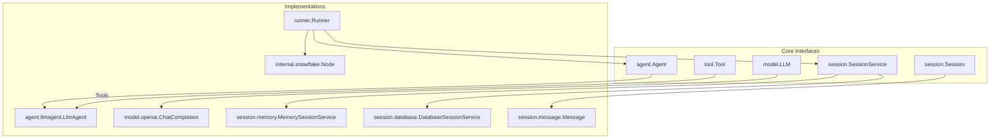

**Diagram sources**
- [agent/agent.go:10-19](file://agent/agent.go#L10-L19)
- [model/model.go:11-18](file://model/model.go#L11-L18)
- [tool/tool.go:17-23](file://tool/tool.go#L17-L23)
- [session/session_service.go:5-9](file://session/session_service.go#L5-L9)
- [session/session.go:9-23](file://session/session.go#L9-L23)
- [agent/llmagent/llmagent.go:25-41](file://agent/llmagent/llmagent.go#L25-L41)
- [model/openai/openai.go:19-42](file://model/openai/openai.go#L19-L42)
- [session/memory/session_service.go:14-40](file://session/memory/session_service.go#L14-L40)
- [session/database/session_service.go:23-48](file://session/database/session_service.go#L23-L48)
- [session/message/message.go:49-128](file://session/message/message.go#L49-L128)
- [runner/runner.go:17-37](file://runner/runner.go#L17-L37)
- [internal/snowflake/snowflake.go:17-56](file://internal/snowflake/snowflake.go#L17-L56)

**Section sources**
- [README.md:65-82](file://README.md#L65-L82)

## Core Components
This section defines the key interfaces and their responsibilities, and how they relate to each other.

- model.LLM: provider-agnostic interface for generating content and streaming responses
- agent.Agent: stateless interface that yields events/messages via Go iterators
- tool.Tool: provider-agnostic tool interface with definition and execution
- session.SessionService and session.Session: pluggable persistence for conversations
- runner.Runner: stateful orchestrator that loads history, persists messages, and streams output

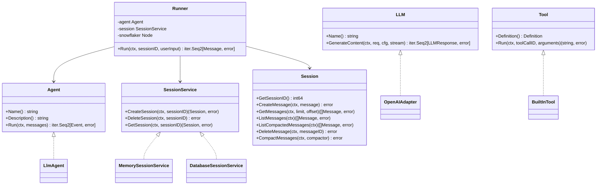

**Diagram sources**
- [model/model.go:11-18](file://model/model.go#L11-L18)
- [agent/agent.go:10-19](file://agent/agent.go#L10-L19)
- [tool/tool.go:17-23](file://tool/tool.go#L17-L23)
- [session/session_service.go:5-9](file://session/session_service.go#L5-L9)
- [session/session.go:9-23](file://session/session.go#L9-L23)
- [runner/runner.go:17-37](file://runner/runner.go#L17-L37)
- [agent/llmagent/llmagent.go:25-41](file://agent/llmagent/llmagent.go#L25-L41)
- [model/openai/openai.go:19-42](file://model/openai/openai.go#L19-L42)
- [session/memory/session_service.go:14-40](file://session/memory/session_service.go#L14-L40)
- [session/database/session_service.go:23-48](file://session/database/session_service.go#L23-L48)

**Section sources**
- [model/model.go:11-227](file://model/model.go#L11-L227)
- [agent/agent.go:10-19](file://agent/agent.go#L10-L19)
- [tool/tool.go:9-23](file://tool/tool.go#L9-L23)
- [session/session_service.go:5-9](file://session/session_service.go#L5-L9)
- [session/session.go:9-23](file://session/session.go#L9-L23)
- [runner/runner.go:17-102](file://runner/runner.go#L17-L102)

## Architecture Overview
ADK follows a clear separation of concerns:
- Runner is stateful: it owns the session, loads history, persists every message, and streams output
- Agent is stateless: it receives the current messages and yields events; it does not manage persistence
- LLM adapters implement model.LLM generically
- Tools implement tool.Tool and are described by tool.Definition
- Session backends implement session.SessionService and session.Session

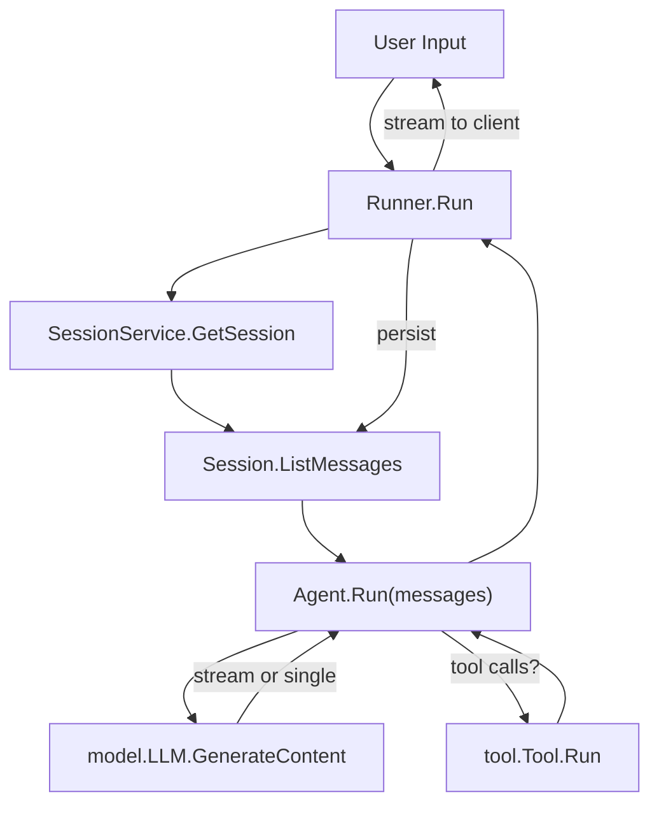

**Diagram sources**
- [runner/runner.go:39-90](file://runner/runner.go#L39-L90)
- [agent/llmagent/llmagent.go:51-105](file://agent/llmagent/llmagent.go#L51-L105)
- [model/model.go:11-18](file://model/model.go#L11-L18)
- [tool/tool.go:17-23](file://tool/tool.go#L17-L23)
- [session/session.go:12-22](file://session/session.go#L12-L22)

**Section sources**
- [README.md:35-63](file://README.md#L35-L63)

## Detailed Component Analysis

### Provider-Agnostic LLM Interface (model.LLM)
- Responsibilities:
  - Provide a Name for identification
  - GenerateContent with optional streaming
  - Return provider-agnostic LLMResponse including finish reason and token usage
- Streaming behavior:
  - When stream is false: yields exactly one complete LLMResponse
  - When stream is true: yields zero or more partial LLMResponse entries (Partial=true) followed by one complete LLMResponse (TurnComplete=true)
- Message types:
  - model.Message supports roles (system, user, assistant, tool), multi-modal content parts, tool calls, reasoning content, and token usage
- Generation configuration:
  - Temperature, reasoning effort, service tier, max tokens, thinking budget, and enable thinking toggles are provider-agnostic

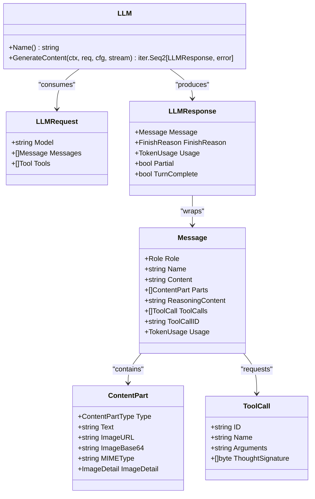

**Diagram sources**
- [model/model.go:11-227](file://model/model.go#L11-L227)

**Section sources**
- [model/model.go:11-227](file://model/model.go#L11-L227)

### Stateless Agent Design with Automatic Tool-Call Loop
- Agent interface:
  - Run returns an iterator of model.Event, supporting partial and complete messages
- LlmAgent:
  - Prepends system instruction if configured
  - Calls model.LLM.Generate in a loop
  - Executes tool calls automatically when FinishReason indicates tool_calls
  - Yields each produced message (assistant replies, tool results) and stops when a stop response is received
- Tool integration:
  - Tools are indexed by name and executed synchronously
  - Tool results are appended back into the message history for the next round

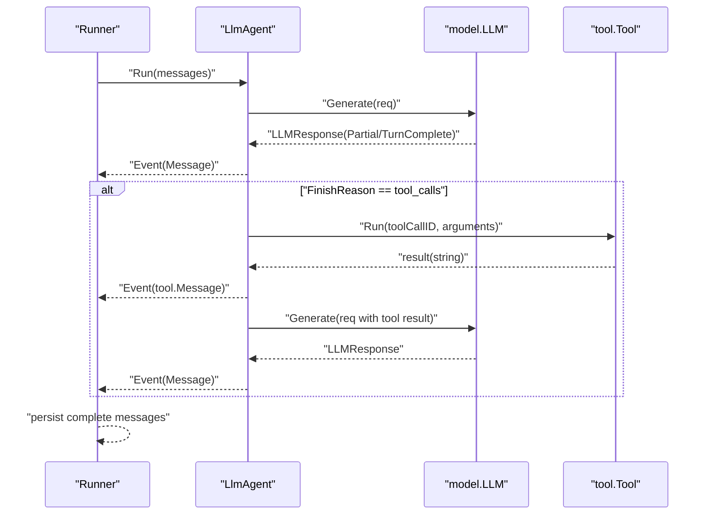

**Diagram sources**
- [agent/llmagent/llmagent.go:51-105](file://agent/llmagent/llmagent.go#L51-L105)
- [model/model.go:188-227](file://model/model.go#L188-L227)
- [tool/tool.go:17-23](file://tool/tool.go#L17-L23)

**Section sources**
- [agent/agent.go:10-19](file://agent/agent.go#L10-L19)
- [agent/llmagent/llmagent.go:25-128](file://agent/llmagent/llmagent.go#L25-L128)

### Pluggable Session Backends and Message Persistence
- SessionService:
  - CreateSession, GetSession, DeleteSession
- Session:
  - CreateMessage, ListMessages, ListCompactedMessages, GetMessages, DeleteMessage
  - CompactMessages archives old messages without deletion
- session.message.Message:
  - Persists roles, content, reasoning content, tool calls/results, token usage, timestamps, and compaction markers
- Backends:
  - In-memory: simple slice-backed storage
  - Database: SQL-backed with soft-delete and compaction

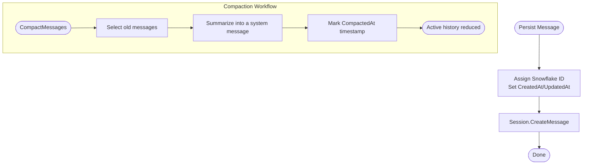

**Diagram sources**
- [runner/runner.go:92-101](file://runner/runner.go#L92-L101)
- [session/message/message.go:49-128](file://session/message/message.go#L49-L128)
- [session/session.go:22](file://session/session.go#L22)
- [session/memory/session_service.go:18-40](file://session/memory/session_service.go#L18-L40)
- [session/database/session_service.go:27-48](file://session/database/session_service.go#L27-L48)

**Section sources**
- [session/session_service.go:5-9](file://session/session_service.go#L5-L9)
- [session/session.go:9-23](file://session/session.go#L9-L23)
- [session/message/message.go:49-128](file://session/message/message.go#L49-L128)
- [session/memory/session_service.go:14-40](file://session/memory/session_service.go#L14-L40)
- [session/database/session_service.go:19-49](file://session/database/session_service.go#L19-L49)

### Streaming via Go Iterators
- model.LLM.GenerateContent returns iter.Seq2[*LLMResponse, error]
- Runner.Run returns iter.Seq2[model.Message, error]
- LlmAgent.Run returns iter.Seq2[*model.Event, error]
- Streaming semantics:
  - Partial responses carry incremental content for real-time display
  - Complete responses mark TurnComplete and include final token usage
- Practical example:
  - The example program iterates over runner.Run and prints assistant content as it arrives

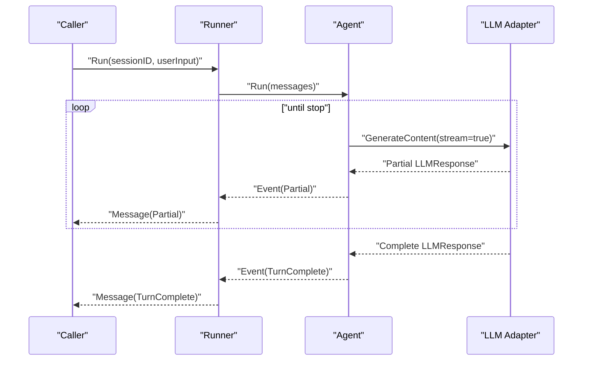

**Diagram sources**
- [model/model.go:14-17](file://model/model.go#L14-L17)
- [runner/runner.go:44-89](file://runner/runner.go#L44-L89)
- [agent/agent.go:13-18](file://agent/agent.go#L13-L18)
- [model/openai/openai.go:48-164](file://model/openai/openai.go#L48-L164)

**Section sources**
- [model/model.go:14-17](file://model/model.go#L14-L17)
- [runner/runner.go:44-89](file://runner/runner.go#L44-L89)
- [examples/chat/main.go:144-162](file://examples/chat/main.go#L144-L162)

### Snowflake ID Generation
- Runner uses internal.snowflake.Node to generate distributed, time-ordered IDs
- Snowflake epoch and bit layout are configured at package initialization
- Runner assigns MessageID, CreatedAt, UpdatedAt before persisting

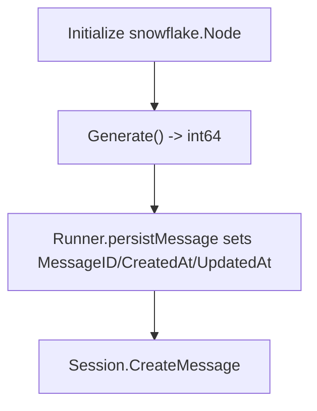

**Diagram sources**
- [runner/runner.go:28-36](file://runner/runner.go#L28-L36)
- [runner/runner.go:94-101](file://runner/runner.go#L94-L101)
- [internal/snowflake/snowflake.go:11-15](file://internal/snowflake/snowflake.go#L11-L15)
- [internal/snowflake/snowflake.go:17-56](file://internal/snowflake/snowflake.go#L17-L56)

**Section sources**
- [runner/runner.go:28-36](file://runner/runner.go#L28-L36)
- [runner/runner.go:94-101](file://runner/runner.go#L94-L101)
- [internal/snowflake/snowflake.go:11-56](file://internal/snowflake/snowflake.go#L11-L56)

### Message Types, Roles, and Multi-Modal Content
- Roles: system, user, assistant, tool
- Multi-modal user content:
  - ContentPart supports text and images (URL or base64)
  - Image detail controls resolution
- Assistant messages may include tool calls and reasoning content
- Tool results link back via ToolCallID

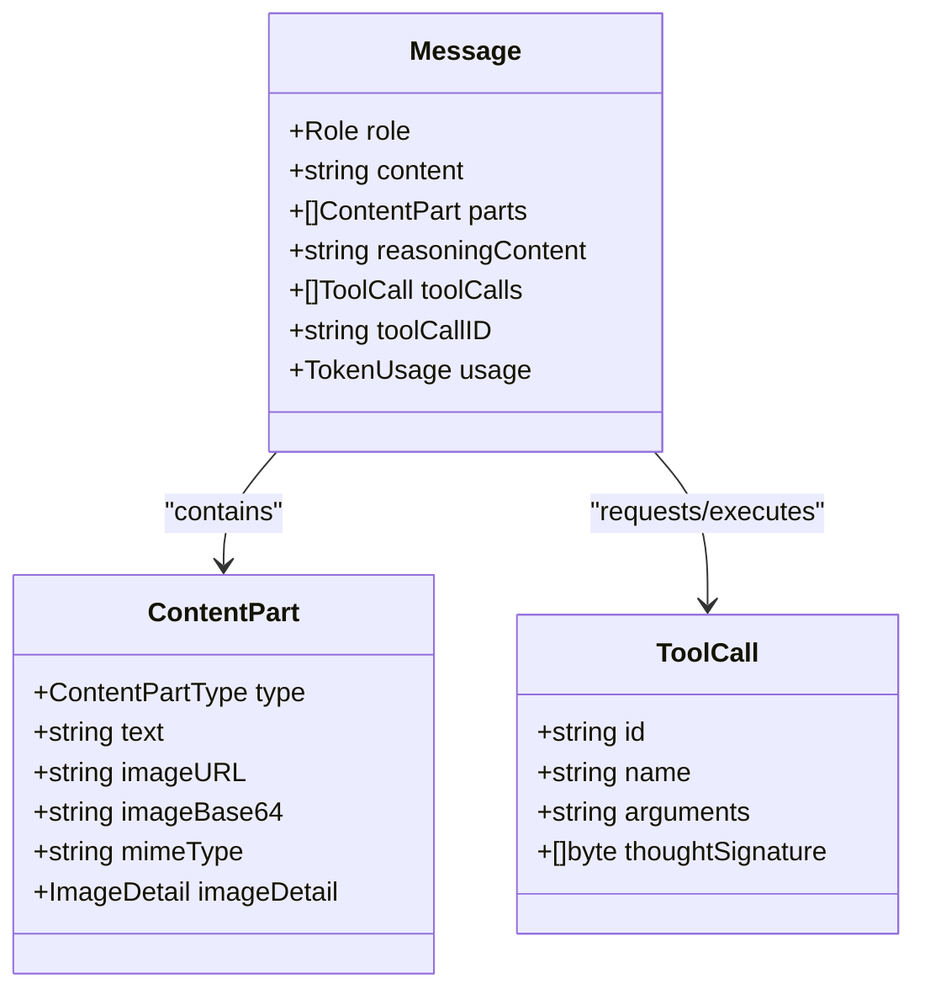

**Diagram sources**
- [model/model.go:152-178](file://model/model.go#L152-L178)
- [model/model.go:109-128](file://model/model.go#L109-L128)
- [model/model.go:130-143](file://model/model.go#L130-L143)

**Section sources**
- [model/model.go:20-28](file://model/model.go#L20-L28)
- [model/model.go:86-128](file://model/model.go#L86-L128)
- [model/model.go:152-178](file://model/model.go#L152-L178)

### Example: Building a Production-Ready Agent
- Steps:
  - Create an LLM adapter (e.g., OpenAI)
  - Build an Agent (e.g., LlmAgent) with tools
  - Choose a Session backend (memory or database)
  - Create a Runner and run a chat loop
- The example demonstrates:
  - Connecting to an MCP toolset
  - Using Runner.Run to stream assistant replies
  - Handling tool-call loops transparently

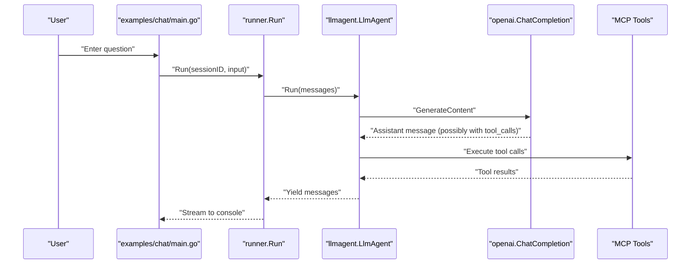

**Diagram sources**
- [examples/chat/main.go:52-173](file://examples/chat/main.go#L52-L173)
- [agent/llmagent/llmagent.go:51-105](file://agent/llmagent/llmagent.go#L51-L105)
- [model/openai/openai.go:48-164](file://model/openai/openai.go#L48-L164)

**Section sources**
- [examples/chat/main.go:52-173](file://examples/chat/main.go#L52-L173)

## Dependency Analysis
- Coupling:
  - Runner depends on Agent, SessionService, and Snowflake node
  - LlmAgent depends on model.LLM and tool.Tool
  - OpenAI adapter depends on external SDK and converts between model types
- Cohesion:
  - model package encapsulates provider-agnostic types
  - session packages encapsulate persistence concerns
  - runner encapsulates orchestration and streaming
- External dependencies:
  - OpenAI SDK, MCP SDK, JSON schema, SQLx, SQLite driver, Snowflake, testify

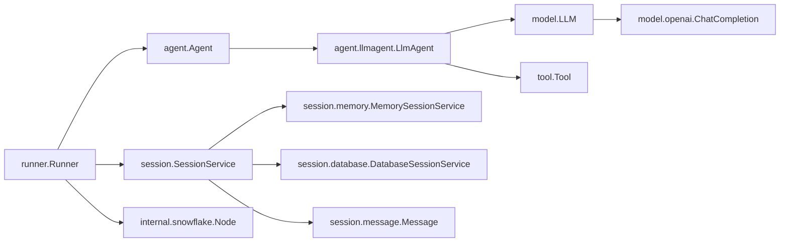

**Diagram sources**
- [runner/runner.go:17-37](file://runner/runner.go#L17-L37)
- [agent/llmagent/llmagent.go:25-41](file://agent/llmagent/llmagent.go#L25-L41)
- [model/openai/openai.go:19-42](file://model/openai/openai.go#L19-L42)
- [session/memory/session_service.go:14-40](file://session/memory/session_service.go#L14-L40)
- [session/database/session_service.go:23-48](file://session/database/session_service.go#L23-L48)
- [session/message/message.go:49-128](file://session/message/message.go#L49-L128)

**Section sources**
- [runner/runner.go:17-37](file://runner/runner.go#L17-L37)
- [agent/llmagent/llmagent.go:25-41](file://agent/llmagent/llmagent.go#L25-L41)
- [model/openai/openai.go:19-42](file://model/openai/openai.go#L19-L42)

## Performance Considerations
- Streaming reduces latency by delivering partial content immediately
- Soft compaction keeps active histories manageable without losing archival data
- Provider-agnostic generation configuration enables tuning without changing agent logic
- Iterator-based processing avoids buffering entire responses in memory

[No sources needed since this section provides general guidance]

## Troubleshooting Guide
- Empty or missing tool definitions:
  - Ensure tool.Definition.InputSchema is valid and matches tool.Run arguments
- Tool not found:
  - LlmAgent logs a tool-not-found message when a requested tool name is absent
- Streaming issues:
  - Verify stream flag and handle Partial vs TurnComplete responses
- Session persistence:
  - Confirm session creation and message compaction logic
- Snowflake ID generation:
  - Ensure node initialization succeeds and network interfaces are available

**Section sources**
- [tool/tool.go:9-23](file://tool/tool.go#L9-L23)
- [agent/llmagent/llmagent.go:108-127](file://agent/llmagent/llmagent.go#L108-L127)
- [model/openai/openai.go:48-164](file://model/openai/openai.go#L48-L164)
- [session/session.go:22](file://session/session.go#L22)
- [internal/snowflake/snowflake.go:17-56](file://internal/snowflake/snowflake.go#L17-L56)

## Conclusion
ADK’s core concepts enable production-ready AI agents by:
- Decoupling provider, tool, and session concerns behind stable interfaces
- Enforcing a clean separation between stateless agent logic and stateful orchestration
- Automating tool-call loops and streaming output
- Supporting multi-modal inputs and persistent conversation histories with compaction
- Providing robust ID generation and pluggable backends

[No sources needed since this section summarizes without analyzing specific files]

## Appendices

### Practical Examples Index
- OpenAI LLM setup and usage
- In-memory and database session backends
- Built-in and MCP tools integration
- Chat loop with streaming output

**Section sources**
- [examples/chat/main.go:52-173](file://examples/chat/main.go#L52-L173)
- [session/memory/session_service.go:14-40](file://session/memory/session_service.go#L14-L40)
- [session/database/session_service.go:23-48](file://session/database/session_service.go#L23-L48)
- [tool/builtin/echo.go:22-46](file://tool/builtin/echo.go#L22-L46)
- [model/openai/openai.go:25-42](file://model/openai/openai.go#L25-L42)