# Features and Highlights

<cite>
**Referenced Files in This Document**
- [README.md](file://README.md)
- [model/model.go](file://model/model.go)
- [agent/llmagent/llmagent.go](file://agent/llmagent/llmagent.go)
- [session/session.go](file://session/session.go)
- [session/memory/session.go](file://session/memory/session.go)
- [session/database/session.go](file://session/database/session.go)
- [tool/tool.go](file://tool/tool.go)
- [tool/mcp/mcp.go](file://tool/mcp/mcp.go)
- [model/openai/openai.go](file://model/openai/openai.go)
- [model/gemini/gemini.go](file://model/gemini/gemini.go)
- [model/anthropic/anthropic.go](file://model/anthropic/anthropic.go)
- [runner/runner.go](file://runner/runner.go)
- [internal/snowflake/snowflake.go](file://internal/snowflake/snowflake.go)
- [examples/chat/main.go](file://examples/chat/main.go)
</cite>

## Table of Contents
1. [Introduction](#introduction)
2. [Project Structure](#project-structure)
3. [Core Components](#core-components)
4. [Architecture Overview](#architecture-overview)
5. [Detailed Component Analysis](#detailed-component-analysis)
6. [Dependency Analysis](#dependency-analysis)
7. [Performance Considerations](#performance-considerations)
8. [Troubleshooting Guide](#troubleshooting-guide)
9. [Conclusion](#conclusion)

## Introduction
This document showcases ADK’s key capabilities with practical examples and implementation patterns. ADK is a lightweight, idiomatic Go library for building production-ready AI agents. It decouples agent logic from LLM providers, session storage, and tool integrations, enabling composable, provider-agnostic solutions. Highlights include:
- Provider-agnostic LLM interface supporting OpenAI, Gemini, and Anthropic with seamless switching
- Automatic tool-call loop in LlmAgent that drives model generation until stop responses
- Pluggable session backends including zero-configuration in-memory storage and persistent SQLite database support
- Message history compaction with soft archival that preserves conversation context while managing storage
- MCP tool integration for connecting external Model Context Protocol servers
- Streaming responses via native Go iterators for incremental output processing
- Snowflake ID generation for distributed, time-ordered message identifiers
- Multi-modal input support for text and images

## Project Structure
ADK organizes functionality by concern:
- agent: Stateless agent interface and LLM-backed agent with tool-call loop
- model: Provider-agnostic LLM interface, message types, and provider adapters
- session: Session and message persistence with in-memory and SQLite backends
- tool: Tool interface and MCP integration
- runner: Orchestrator wiring agent and session together
- internal/snowflake: Snowflake node factory for distributed IDs
- examples: Practical chat example integrating MCP tools

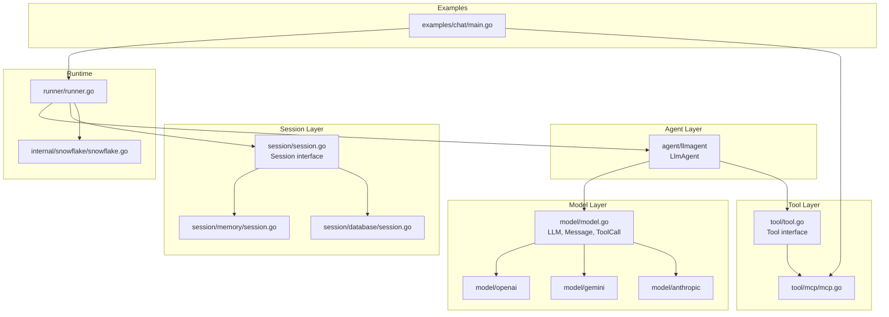

**Diagram sources**
- [agent/llmagent/llmagent.go:1-148](file://agent/llmagent/llmagent.go#L1-L148)
- [model/model.go:1-227](file://model/model.go#L1-L227)
- [session/session.go:1-24](file://session/session.go#L1-L24)
- [session/memory/session.go:1-86](file://session/memory/session.go#L1-L86)
- [session/database/session.go:1-146](file://session/database/session.go#L1-L146)
- [tool/tool.go:1-24](file://tool/tool.go#L1-L24)
- [tool/mcp/mcp.go:1-121](file://tool/mcp/mcp.go#L1-L121)
- [runner/runner.go:1-102](file://runner/runner.go#L1-L102)
- [internal/snowflake/snowflake.go:1-66](file://internal/snowflake/snowflake.go#L1-L66)
- [examples/chat/main.go:1-177](file://examples/chat/main.go#L1-L177)

**Section sources**
- [README.md:65-82](file://README.md#L65-L82)

## Core Components
- Provider-agnostic LLM interface: model.LLM defines a uniform contract for providers, enabling seamless switching among OpenAI, Gemini, and Anthropic.
- LlmAgent: Stateless agent that runs a tool-call loop, streaming partial responses and yielding complete assistant messages and tool results.
- Session backends: In-memory and SQLite implementations support zero-config in-memory storage and persistent sessions.
- Tool integration: Tool interface and MCP bridge expose external tools to the agent.
- Streaming: Native Go iterators deliver incremental output for real-time UX.
- Snowflake IDs: Distributed, time-ordered identifiers for messages.
- Multi-modal: Content parts support text and images for richer prompts.

**Section sources**
- [README.md:14-24](file://README.md#L14-L24)
- [model/model.go:10-227](file://model/model.go#L10-L227)
- [agent/llmagent/llmagent.go:29-148](file://agent/llmagent/llmagent.go#L29-L148)
- [session/session.go:9-24](file://session/session.go#L9-L24)
- [tool/tool.go:9-24](file://tool/tool.go#L9-L24)
- [runner/runner.go:17-102](file://runner/runner.go#L17-L102)
- [internal/snowflake/snowflake.go:11-66](file://internal/snowflake/snowflake.go#L11-L66)

## Architecture Overview
ADK separates stateful orchestration from stateless agent logic:
- Runner loads session history, appends user input, and drives the Agent per turn.
- LlmAgent prepends system instructions, calls model.LLM.GenerateContent in a loop, executes tool calls, and yields each message.
- SessionService persists every yielded message and supports pagination and compaction.
- Tools can be built-in or MCP-managed.

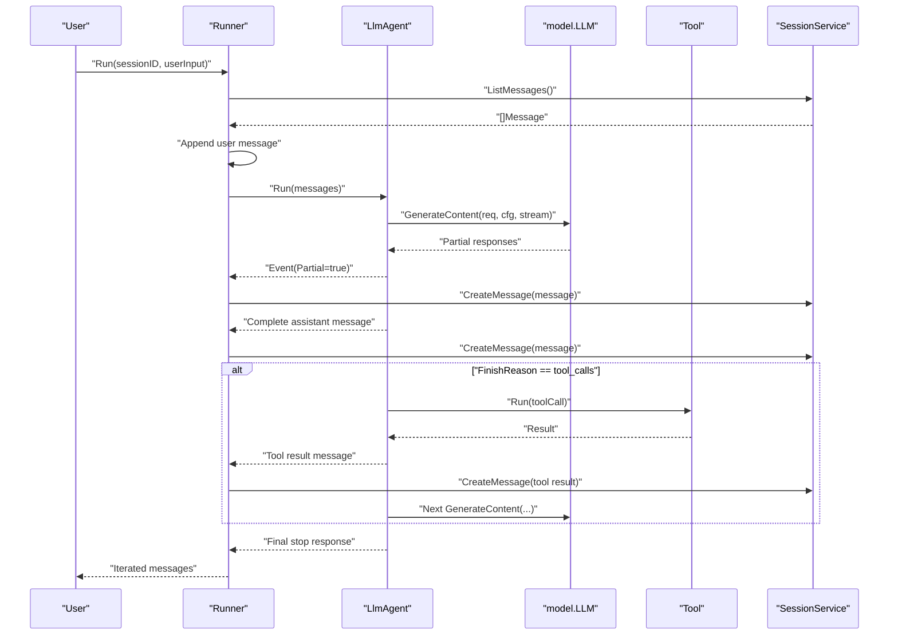

**Diagram sources**
- [runner/runner.go:39-90](file://runner/runner.go#L39-L90)
- [agent/llmagent/llmagent.go:55-125](file://agent/llmagent/llmagent.go#L55-L125)
- [model/model.go:10-227](file://model/model.go#L10-L227)
- [session/session.go:9-24](file://session/session.go#L9-L24)
- [tool/tool.go:17-24](file://tool/tool.go#L17-L24)

## Detailed Component Analysis

### Provider-Agnostic LLM Interface
ADK defines a provider-agnostic LLM interface and message types. The central model.LLM interface exposes:
- Name(): string
- GenerateContent(ctx, req, cfg, stream) iter.Seq2[*LLMResponse, error]

Key message types:
- Role: system, user, assistant, tool
- ContentPart: text, image_url, image_base64
- ToolCall: ID, Name, Arguments, ThoughtSignature
- Message: structured conversation entry with optional reasoning content and tool calls
- LLMRequest/LLMResponse: provider-agnostic request/response envelopes

Provider adapters:
- OpenAI: Chat Completions API with streaming and tool-call support
- Gemini: GenerateContent API with reasoning and tool-call support
- Anthropic: Messages API with tool-call support

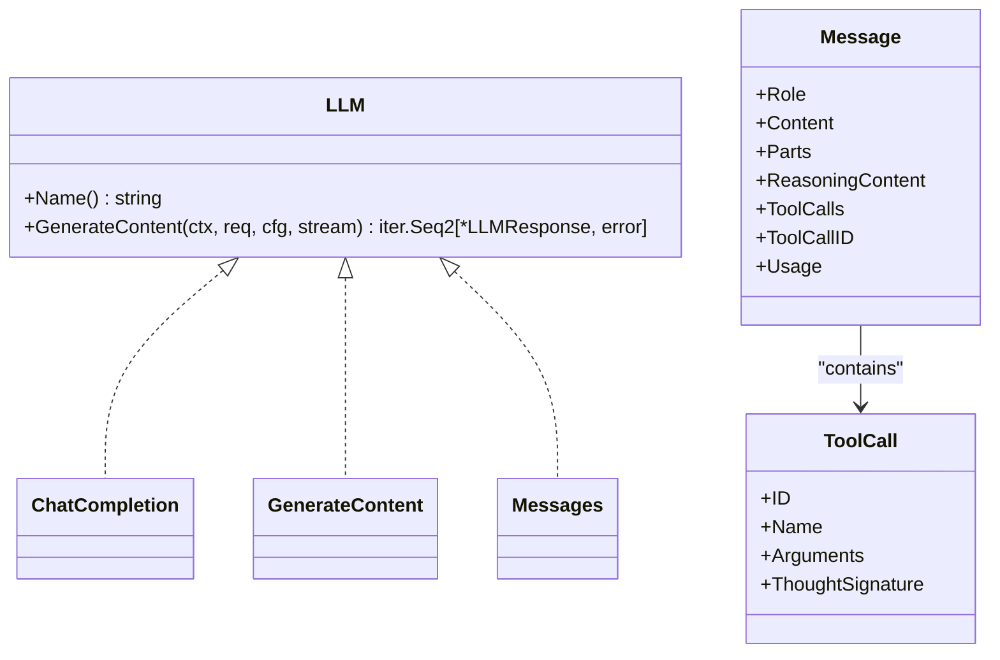

**Diagram sources**
- [model/model.go:10-227](file://model/model.go#L10-L227)
- [model/openai/openai.go:19-42](file://model/openai/openai.go#L19-L42)
- [model/gemini/gemini.go:17-64](file://model/gemini/gemini.go#L17-L64)
- [model/anthropic/anthropic.go:25-45](file://model/anthropic/anthropic.go#L25-L45)

**Section sources**
- [model/model.go:10-227](file://model/model.go#L10-L227)
- [model/openai/openai.go:44-164](file://model/openai/openai.go#L44-L164)
- [model/gemini/gemini.go:66-201](file://model/gemini/gemini.go#L66-L201)
- [model/anthropic/anthropic.go:47-93](file://model/anthropic/anthropic.go#L47-L93)

### Automatic Tool-Call Loop in LlmAgent
LlmAgent orchestrates a tool-call loop:
- Prepends system instruction if configured
- Calls model.GenerateContent in a loop
- Streams partial assistant responses
- On tool_calls, executes tools and appends results
- Continues until stop response

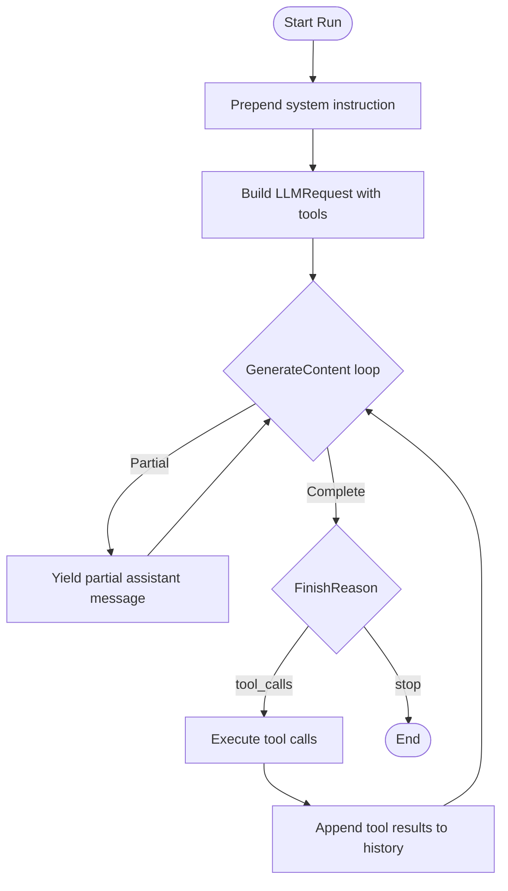

**Diagram sources**
- [agent/llmagent/llmagent.go:55-125](file://agent/llmagent/llmagent.go#L55-L125)

**Section sources**
- [agent/llmagent/llmagent.go:55-148](file://agent/llmagent/llmagent.go#L55-L148)

### Pluggable Session Backends
ADK supports two session backends:
- In-memory: Zero-configuration, suitable for testing or single-process use
- SQLite: Persistent across restarts, with transactional compaction

Both backends implement the Session interface:
- CreateMessage, GetMessages, ListMessages, ListCompactedMessages, DeleteMessage, CompactMessages

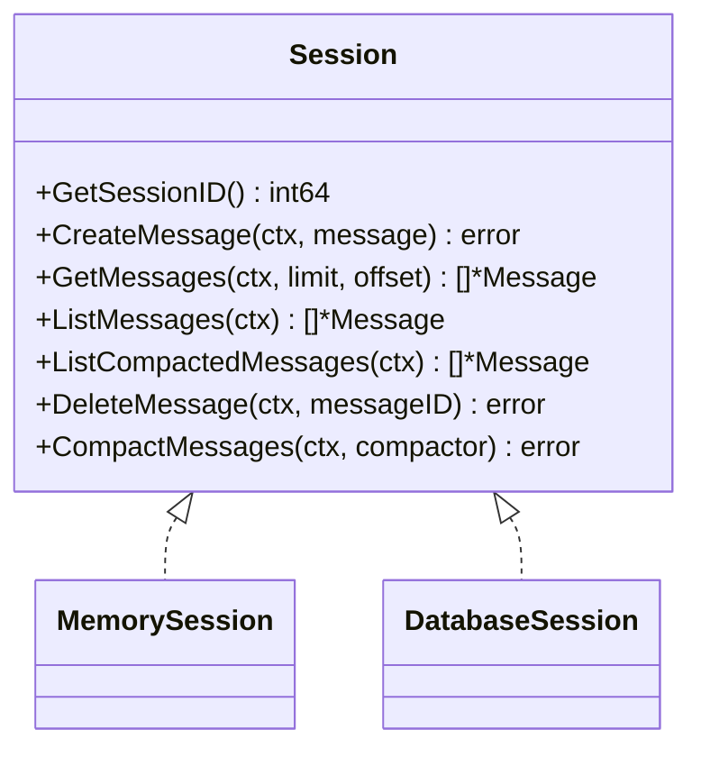

**Diagram sources**
- [session/session.go:9-24](file://session/session.go#L9-L24)
- [session/memory/session.go:12-86](file://session/memory/session.go#L12-L86)
- [session/database/session.go:26-146](file://session/database/session.go#L26-L146)

**Section sources**
- [session/session.go:9-24](file://session/session.go#L9-L24)
- [session/memory/session.go:18-86](file://session/memory/session.go#L18-L86)
- [session/database/session.go:34-146](file://session/database/session.go#L34-L146)

### Message History Compaction with Soft Archival
Soft archival preserves conversation context while managing storage:
- CompactMessages accepts a compactor function that produces a summary message
- Active messages are archived (marked with compacted_at) without deletion
- After compaction, only the summary remains active; archived messages remain retrievable

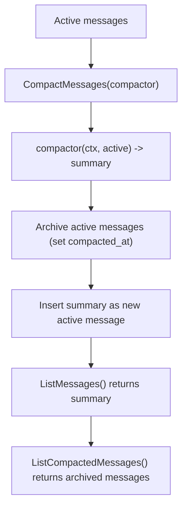

**Diagram sources**
- [session/session.go:22](file://session/session.go#L22)
- [session/memory/session.go:70-85](file://session/memory/session.go#L70-L85)
- [session/database/session.go:97-145](file://session/database/session.go#L97-L145)

**Section sources**
- [README.md:212-230](file://README.md#L212-L230)
- [session/memory/session.go:70-85](file://session/memory/session.go#L70-L85)
- [session/database/session.go:97-145](file://session/database/session.go#L97-L145)

### MCP Tool Integration
ADK integrates external Model Context Protocol servers:
- ToolSet.Connect establishes a session with the MCP server
- ToolSet.Tools enumerates tools and wraps them as tool.Tool instances
- toolWrapper.Definition returns metadata and JSON Schema
- toolWrapper.Run calls the MCP tool via CallTool and returns text content

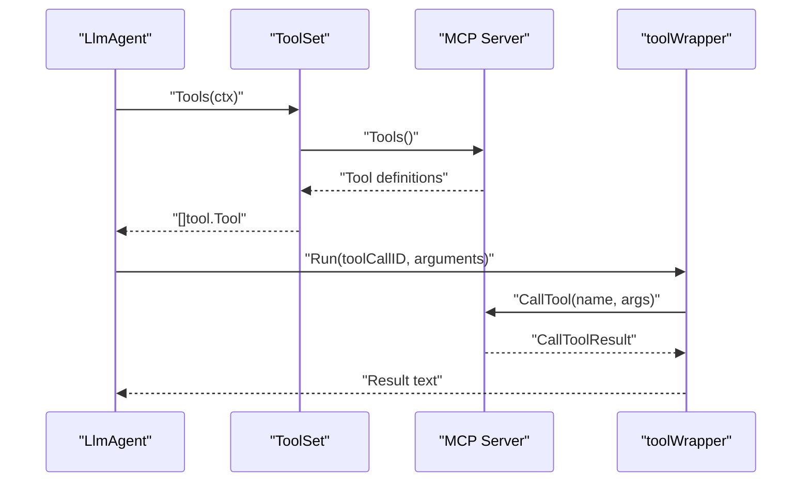

**Diagram sources**
- [tool/mcp/mcp.go:45-121](file://tool/mcp/mcp.go#L45-L121)
- [tool/tool.go:17-24](file://tool/tool.go#L17-L24)

**Section sources**
- [README.md:234-256](file://README.md#L234-L256)
- [tool/mcp/mcp.go:15-121](file://tool/mcp/mcp.go#L15-L121)
- [tool/tool.go:9-24](file://tool/tool.go#L9-L24)

### Streaming Responses via Go Iterators
ADK uses native Go iterators for streaming:
- model.LLM.GenerateContent returns iter.Seq2[*LLMResponse, error]
- LlmAgent yields partial responses (Partial=true) for real-time display
- Runner persists only complete messages (Partial=false) to the session

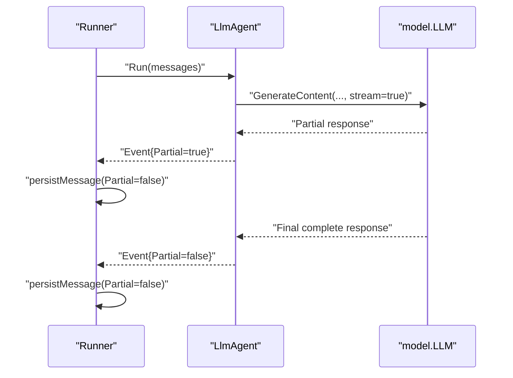

**Diagram sources**
- [model/model.go:13-18](file://model/model.go#L13-L18)
- [agent/llmagent/llmagent.go:77-93](file://agent/llmagent/llmagent.go#L77-L93)
- [runner/runner.go:92-101](file://runner/runner.go#L92-L101)

**Section sources**
- [README.md:23](file://README.md#L23)
- [model/model.go:13-227](file://model/model.go#L13-L227)
- [agent/llmagent/llmagent.go:77-125](file://agent/llmagent/llmagent.go#L77-L125)
- [runner/runner.go:92-101](file://runner/runner.go#L92-L101)

### Snowflake ID Generation
Runner assigns distributed, time-ordered IDs to messages:
- snowflake.New initializes a node using network interface hashing
- Runner.persistMessage assigns MessageID, CreatedAt, UpdatedAt, and persists

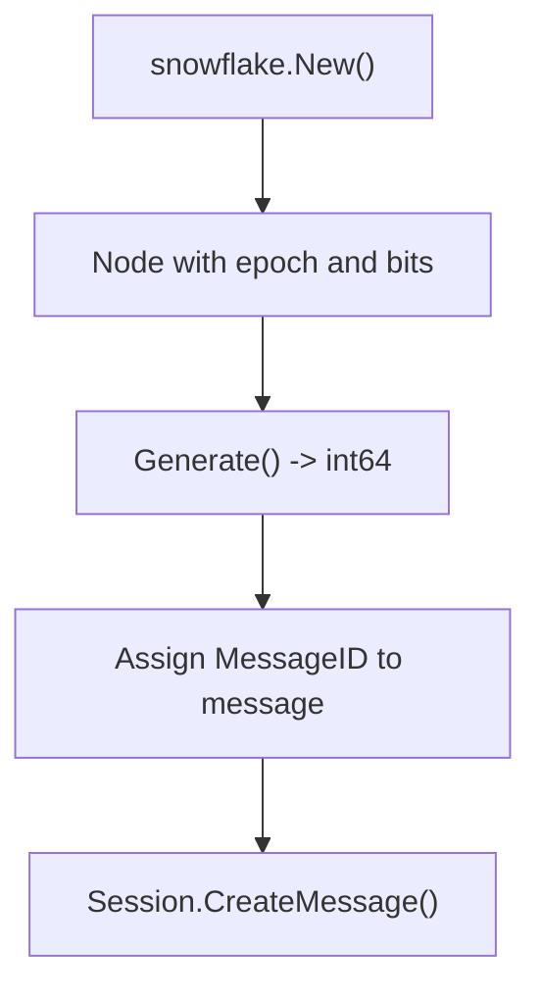

**Diagram sources**
- [internal/snowflake/snowflake.go:11-66](file://internal/snowflake/snowflake.go#L11-L66)
- [runner/runner.go:92-101](file://runner/runner.go#L92-L101)

**Section sources**
- [README.md:22](file://README.md#L22)
- [internal/snowflake/snowflake.go:11-66](file://internal/snowflake/snowflake.go#L11-L66)
- [runner/runner.go:92-101](file://runner/runner.go#L92-L101)

### Multi-Modal Input Support
ADK supports multi-modal messages:
- ContentPart supports text, image_url, and image_base64
- Providers convert multi-modal content to their native formats
- Example usage demonstrates passing images alongside text

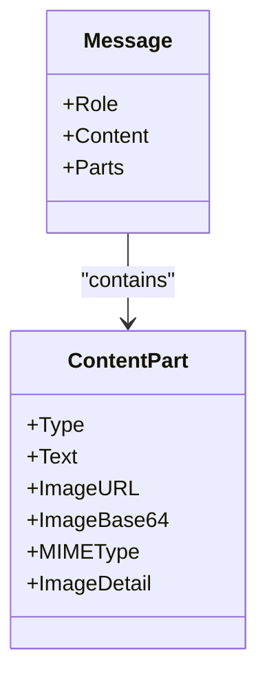

**Diagram sources**
- [model/model.go:86-128](file://model/model.go#L86-L128)
- [model/model.go:152-178](file://model/model.go#L152-L178)

**Section sources**
- [README.md:259-275](file://README.md#L259-L275)
- [model/model.go:86-128](file://model/model.go#L86-L128)
- [model/openai/openai.go:185-212](file://model/openai/openai.go#L185-L212)
- [model/gemini/gemini.go:270-299](file://model/gemini/gemini.go#L270-L299)
- [model/anthropic/anthropic.go:149-184](file://model/anthropic/anthropic.go#L149-L184)

### Practical Examples
- Quick start: Create an OpenAI LLM, build an LlmAgent, choose in-memory or SQLite session, and run a chat loop
- MCP integration: Connect to an MCP server (e.g., Exa), discover tools, and wire them into the agent
- Multi-modal: Compose a message with text and images for vision-enabled models

**Section sources**
- [README.md:85-153](file://README.md#L85-L153)
- [examples/chat/main.go:52-173](file://examples/chat/main.go#L52-L173)

## Dependency Analysis
ADK maintains low coupling and high cohesion:
- Agent depends on model.LLM and tool.Tool
- Runner depends on Agent and SessionService
- Provider adapters depend on their respective SDKs
- MCP tool wrapper depends on the MCP SDK
- Snowflake node is injected into Runner

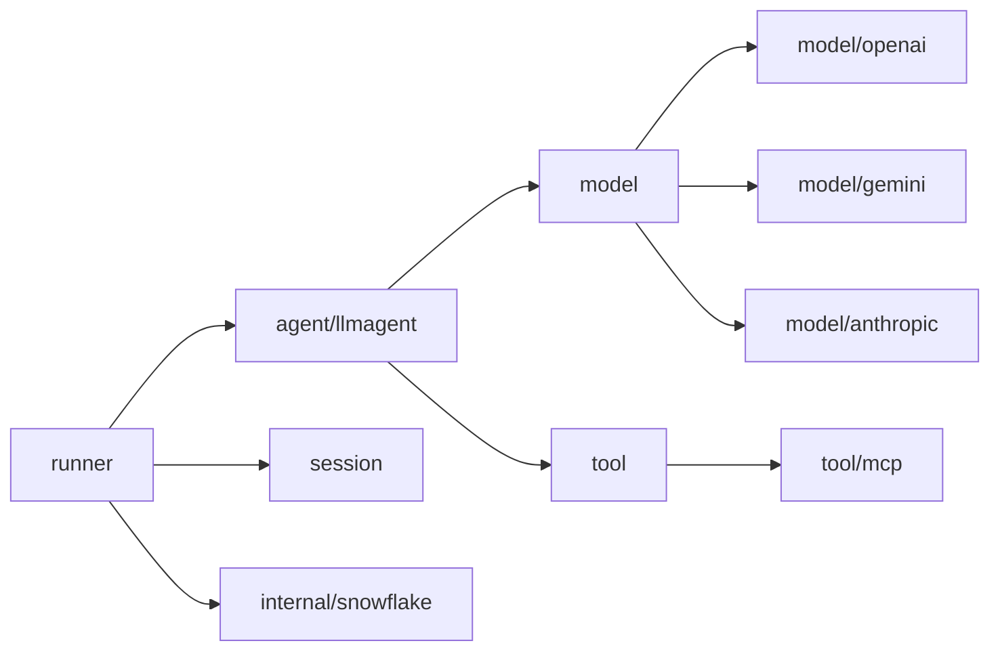

**Diagram sources**
- [agent/llmagent/llmagent.go:1-148](file://agent/llmagent/llmagent.go#L1-L148)
- [runner/runner.go:1-102](file://runner/runner.go#L1-L102)
- [model/model.go:1-227](file://model/model.go#L1-L227)
- [tool/tool.go:1-24](file://tool/tool.go#L1-L24)
- [tool/mcp/mcp.go:1-121](file://tool/mcp/mcp.go#L1-L121)
- [internal/snowflake/snowflake.go:1-66](file://internal/snowflake/snowflake.go#L1-L66)

**Section sources**
- [README.md:279-290](file://README.md#L279-L290)

## Performance Considerations
- Streaming reduces latency by yielding partial responses; persist only complete messages to minimize write amplification
- Soft compaction keeps recent summaries active while archiving older messages, controlling storage growth
- Provider adapters translate provider-specific parameters to a unified configuration for efficient tuning
- Snowflake IDs avoid contention and ensure global uniqueness across distributed nodes

[No sources needed since this section provides general guidance]

## Troubleshooting Guide
- Provider errors: Adapter functions wrap provider-specific errors with context (e.g., openai, gemini, anthropic)
- Streaming issues: Ensure stream=true is set when expecting partial responses; verify adapter streaming logic
- MCP connectivity: Confirm ToolSet.Connect succeeds and Tools enumeration returns expected definitions
- Session compaction: Verify compactor returns a valid summary message and that archived messages are retrievable

**Section sources**
- [model/openai/openai.go:50-87](file://model/openai/openai.go#L50-L87)
- [model/gemini/gemini.go:115-120](file://model/gemini/gemini.go#L115-L120)
- [model/anthropic/anthropic.go:83-92](file://model/anthropic/anthropic.go#L83-L92)
- [tool/mcp/mcp.go:36-43](file://tool/mcp/mcp.go#L36-L43)

## Conclusion
ADK delivers a composable, provider-agnostic framework for building AI agents in Go. Its design emphasizes:
- Seamless provider switching via a unified LLM interface
- Automatic tool-call loops and streaming for responsive UX
- Pluggable session backends with soft compaction
- MCP integration for extensible tool ecosystems
- Distributed, time-ordered IDs and multi-modal support

These features collectively enable rapid prototyping and production-grade deployments across diverse LLM providers and use cases.