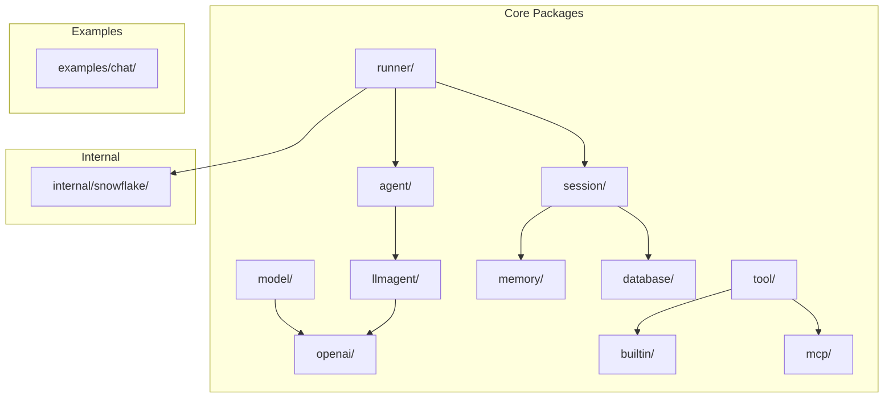
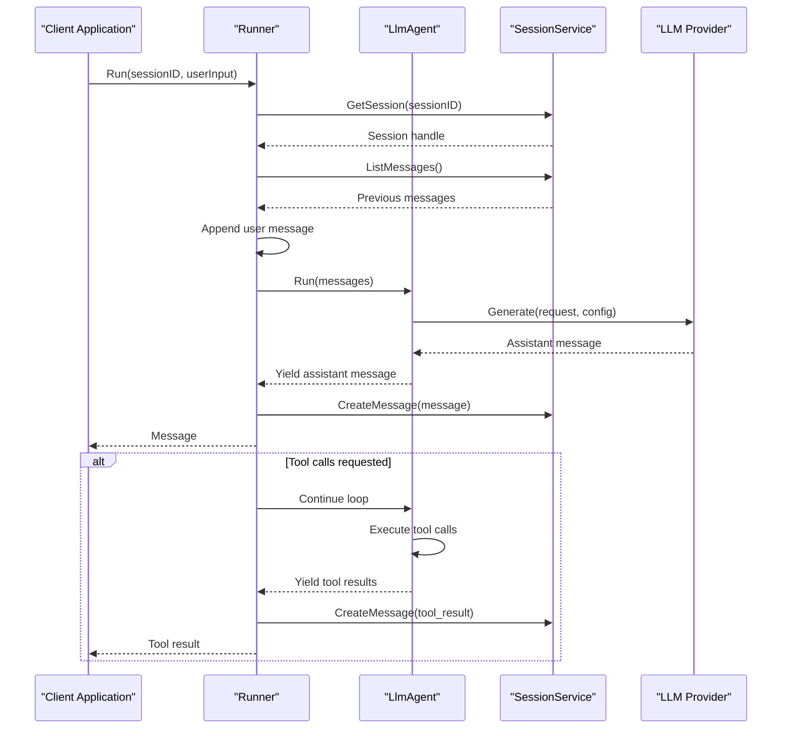
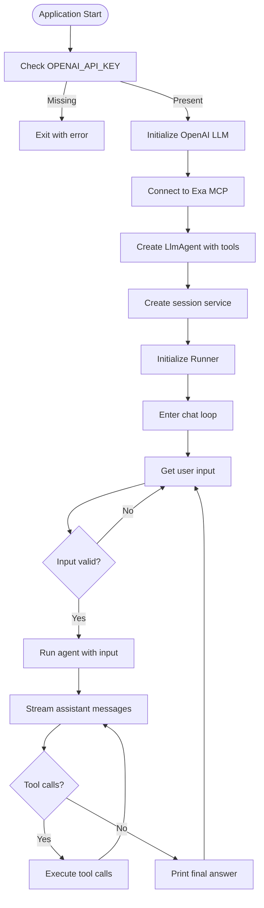
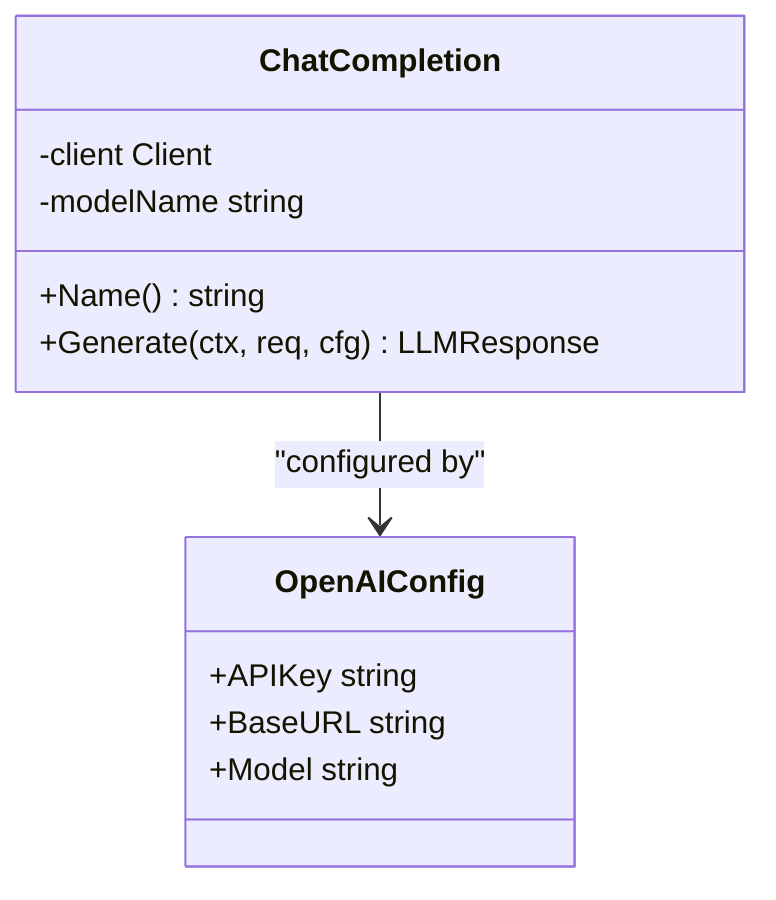
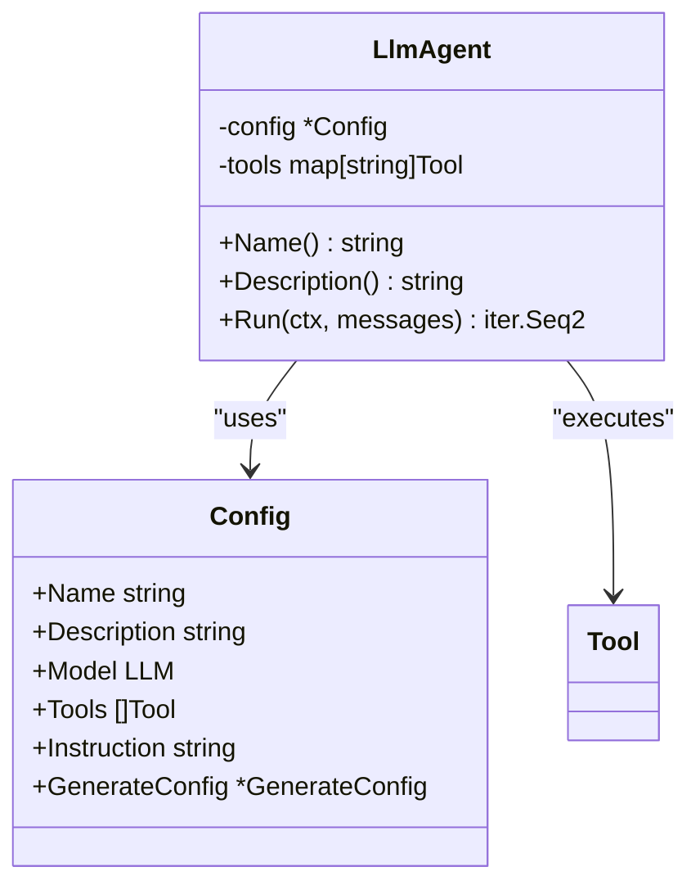
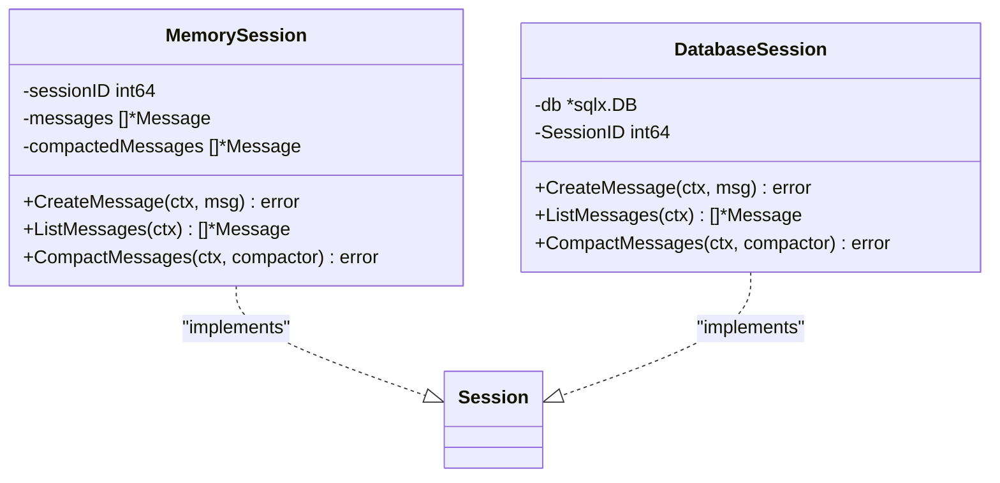
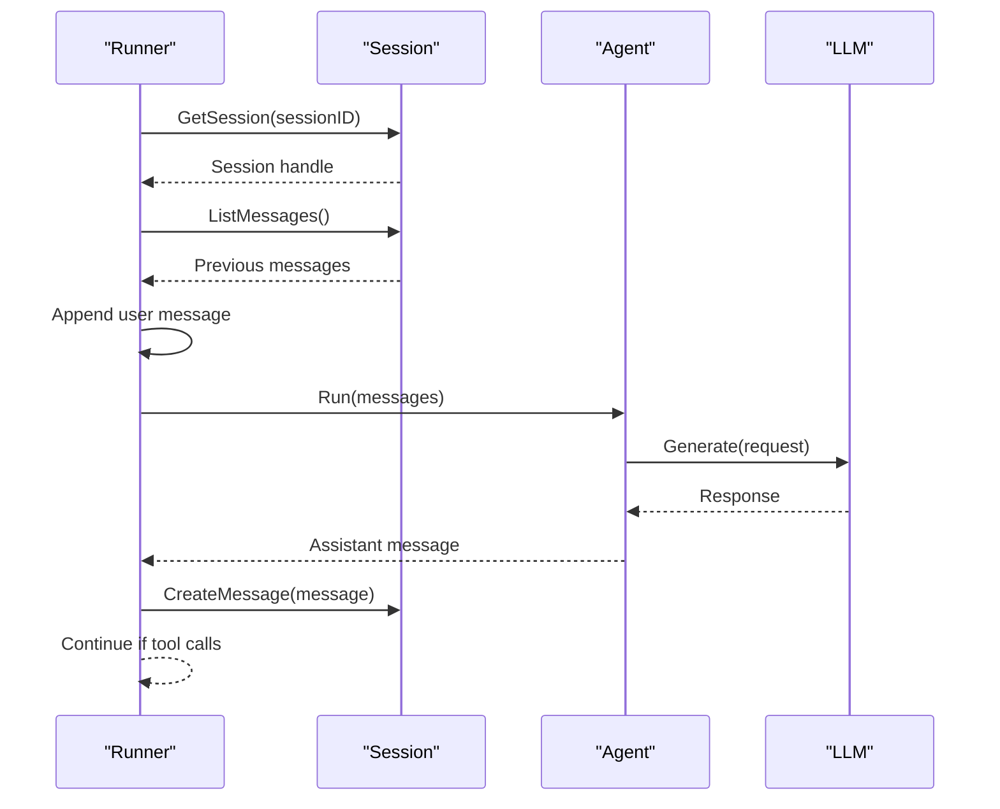

# Getting Started

<cite>
**Referenced Files in This Document**
- [README.md](file://README.md)
- [go.mod](file://go.mod)
- [examples/chat/main.go](file://examples/chat/main.go)
- [agent/llmagent/llmagent.go](file://agent/llmagent/llmagent.go)
- [runner/runner.go](file://runner/runner.go)
- [session/memory/session.go](file://session/memory/session.go)
- [session/database/session.go](file://session/database/session.go)
- [model/openai/openai.go](file://model/openai/openai.go)
- [model/model.go](file://model/model.go)
- [agent/agent.go](file://agent/agent.go)
- [tool/tool.go](file://tool/tool.go)
</cite>

## Table of Contents
1. [Introduction](#introduction)
2. [Project Structure](#project-structure)
3. [Core Components](#core-components)
4. [Architecture Overview](#architecture-overview)
5. [Installation and Setup](#installation-and-setup)
6. [Quick Start Workflow](#quick-start-workflow)
7. [Practical Code Walkthrough](#practical-code-walkthrough)
8. [Common Pitfalls and Troubleshooting](#common-pitfalls-and-troubleshooting)
9. [Verification Steps](#verification-steps)
10. [Conclusion](#conclusion)

## Introduction
ADK (Agent Development Kit) is a lightweight, idiomatic Go library for building production-ready AI agents. It provides a clean separation between stateless agent logic and stateful session management, enabling you to compose exactly the pieces you need for your agent applications.

Key benefits:
- Provider-agnostic LLM interface for swapping models without changing agent code
- Stateless Agent + Stateful Runner separation of concerns
- Automatic tool-call loop execution
- Pluggable session backends (in-memory or SQLite)
- Message history compaction and Snowflake ID generation

## Project Structure
The ADK project follows a modular package layout designed for composability:



**Diagram sources**
- [README.md:65-82](file://README.md#L65-L82)

**Section sources**
- [README.md:65-82](file://README.md#L65-L82)

## Core Components
ADK centers around four primary abstractions that work together to build intelligent agents:

### LLM Interface
The `model.LLM` interface defines the contract for all language model providers. It requires:
- `Name()` - returns the model identifier
- `Generate()` - executes a generation request with configurable parameters

### Agent Interface
The `agent.Agent` interface encapsulates agent logic with:
- `Name()` and `Description()` for identification
- `Run()` - returns a Go iterator that yields each produced message incrementally

### Session Management
ADK provides two session backends:
- **Memory backend**: Zero-configuration in-memory storage for testing
- **Database backend**: Persistent SQLite storage across application restarts

### Runner Coordination
The `runner.Runner` orchestrates the entire conversation flow by coordinating between agents and session storage.

**Section sources**
- [model/model.go:9-13](file://model/model.go#L9-L13)
- [agent/agent.go:10-17](file://agent/agent.go#L10-L17)
- [session/session_service.go:5-9](file://session/session_service.go#L5-L9)
- [runner/runner.go:17-24](file://runner/runner.go#L17-L24)

## Architecture Overview
ADK follows a clean separation of concerns with the Runner managing state and the Agent being stateless:



**Diagram sources**
- [runner/runner.go:39-90](file://runner/runner.go#L39-L90)
- [agent/llmagent/llmagent.go:51-105](file://agent/llmagent/llmagent.go#L51-L105)

## Installation and Setup
ADK requires Go 1.26 or later and can be installed using the module path:

### Installation
```bash
go get soasurs.dev/soasurs/adk
```

### Go Version Requirements
- Minimum Go version: 1.26
- Module path: `soasurs.dev/soasurs/adk`

### Environment Configuration
For OpenAI integration, set the following environment variables:
- `OPENAI_API_KEY` - Required for authentication
- `OPENAI_BASE_URL` - Optional endpoint override (for compatible providers)
- `OPENAI_MODEL` - Optional model name (defaults to "gpt-4o-mini")

**Section sources**
- [README.md:27-31](file://README.md#L27-L31)
- [README.md:9-10](file://README.md#L9-L10)
- [README.md:85-96](file://README.md#L85-L96)

## Quick Start Workflow
Follow these four essential steps to build your first agent:

### Step 1: Create an LLM Instance
Initialize an OpenAI-compatible LLM provider:

```go
import "soasurs.dev/soasurs/adk/model/openai"

llm := openai.New(openai.Config{
    APIKey: os.Getenv("OPENAI_API_KEY"),
    Model:  "gpt-4o-mini",
})
```

### Step 2: Build an Agent
Create an LlmAgent with your LLM and configuration:

```go
import (
    "soasurs.dev/soasurs/adk/agent/llmagent"
    "soasurs.dev/soasurs/adk/model"
)

agent := llmagent.New(llmagent.LlmAgentConfig{
    Name:         "my-agent",
    Description:  "A helpful assistant",
    Model:        llm,
    SystemPrompt: "You are a helpful assistant.",
})
```

### Step 3: Choose a Session Backend
Select between in-memory or persistent storage:

**In-memory (testing):**
```go
import "soasurs.dev/soasurs/adk/session/memory"

svc := memory.NewSessionService()
```

**SQLite (production):**
```go
import "soasurs.dev/soasurs/adk/session/database"

svc, err := database.NewSessionService("sessions.db")
```

### Step 4: Create a Runner and Run
Wire everything together and execute conversations:

```go
import (
    "soasurs.dev/soasurs/adk/runner"
)

r, err := runner.New(agent, svc)
if err != nil { /* handle error */ }

ctx := context.Background()
sessionID := int64(1)

// Create the session once
_, _ = svc.CreateSession(ctx, sessionID)

// Send a user message and iterate over the results
for msg, err := range r.Run(ctx, sessionID, "Hello!") {
    if err != nil { /* handle error */ }
    fmt.Println(msg.Role, msg.Content)
}
```

**Section sources**
- [README.md:85-153](file://README.md#L85-L153)

## Practical Code Walkthrough
Let me demonstrate the complete workflow using the example chat application:

### Complete Example Analysis
The example application shows a production-ready chat agent with MCP tool integration:



**Diagram sources**
- [examples/chat/main.go:52-173](file://examples/chat/main.go#L52-L173)

### Step-by-Step Implementation

#### 1. LLM Provider Setup
The example initializes an OpenAI-compatible LLM with environment variable support:



**Diagram sources**
- [model/openai/openai.go:17-35](file://model/openai/openai.go#L17-L35)

#### 2. Agent Configuration
The LlmAgent wraps the LLM with tool-call capabilities:



**Diagram sources**
- [agent/llmagent/llmagent.go:13-41](file://agent/llmagent/llmagent.go#L13-L41)

#### 3. Session Backend Selection
Choose between memory and database backends:



**Diagram sources**
- [session/memory/session.go:12-24](file://session/memory/session.go#L12-L24)
- [session/database/session.go:26-32](file://session/database/session.go#L26-L32)

#### 4. Runner Orchestration
The Runner manages the conversation flow:



**Diagram sources**
- [runner/runner.go:39-90](file://runner/runner.go#L39-L90)

**Section sources**
- [examples/chat/main.go:52-173](file://examples/chat/main.go#L52-L173)
- [model/openai/openai.go:23-35](file://model/openai/openai.go#L23-L35)
- [agent/llmagent/llmagent.go:31-41](file://agent/llmagent/llmagent.go#L31-L41)
- [session/memory/session.go:18-24](file://session/memory/session.go#L18-L24)
- [session/database/session.go:34-41](file://session/database/session.go#L34-L41)
- [runner/runner.go:26-37](file://runner/runner.go#L26-L37)

## Common Pitfalls and Troubleshooting

### Installation Issues
- **Go version mismatch**: Ensure Go 1.26+ is installed
- **Module path errors**: Verify the correct module path `soasurs.dev/soasurs/adk`
- **Network connectivity**: Some providers require outbound internet access

### Configuration Problems
- **Missing API keys**: `OPENAI_API_KEY` is required for OpenAI integration
- **Invalid model names**: Ensure the specified model exists on your provider
- **Endpoint configuration**: Use `OPENAI_BASE_URL` for compatible providers

### Runtime Errors
- **Session creation failures**: Check database permissions for SQLite backend
- **Tool execution errors**: Verify tool definitions and JSON schemas
- **Memory leaks**: Ensure proper session cleanup in long-running applications

### Performance Considerations
- **Message compaction**: Use the compaction feature for long conversations
- **Streaming responses**: Leverage the iterator-based streaming for responsive UIs
- **Connection pooling**: Configure provider clients appropriately for concurrent usage

**Section sources**
- [README.md:279-290](file://README.md#L279-L290)
- [examples/chat/main.go:55-66](file://examples/chat/main.go#L55-L66)

## Verification Steps
To ensure your setup is working correctly:

### Basic Health Check
1. **Import verification**: Confirm successful compilation with ADK imports
2. **Environment variables**: Verify required environment variables are set
3. **LLM connectivity**: Test a simple generation request
4. **Session persistence**: Verify message creation and retrieval

### Integration Testing
1. **End-to-end flow**: Run a complete conversation cycle
2. **Tool integration**: Test tool execution if using MCP or built-in tools
3. **Session backend**: Validate both memory and database backends
4. **Error handling**: Test graceful error recovery scenarios

### Performance Validation
1. **Response latency**: Measure end-to-end conversation timing
2. **Memory usage**: Monitor memory consumption for long sessions
3. **Throughput**: Test concurrent conversation handling

**Section sources**
- [examples/chat/main.go:112-123](file://examples/chat/main.go#L112-L123)
- [runner/runner.go:92-101](file://runner/runner.go#L92-L101)

## Conclusion
ADK provides a robust foundation for building AI agents in Go with clean separation of concerns and flexible architecture. By following the four-step workflow outlined above, you can quickly set up a functional agent that integrates with popular LLM providers while maintaining flexibility for future enhancements.

The modular design allows you to:
- Swap LLM providers without changing agent logic
- Choose appropriate session backends for your deployment needs
- Extend functionality through tool integrations
- Scale from development prototypes to production deployments

For advanced use cases, explore the MCP tool integration, multi-modal input support, and custom tool implementations documented in the full project reference.