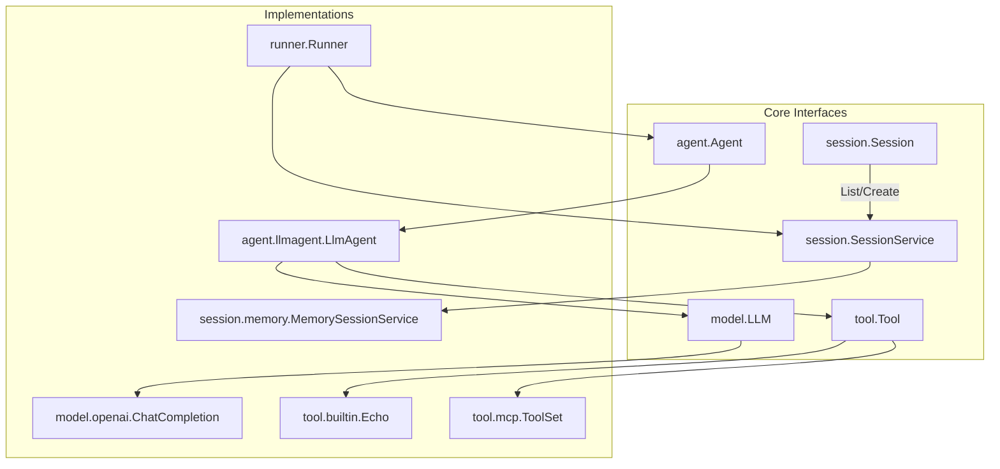
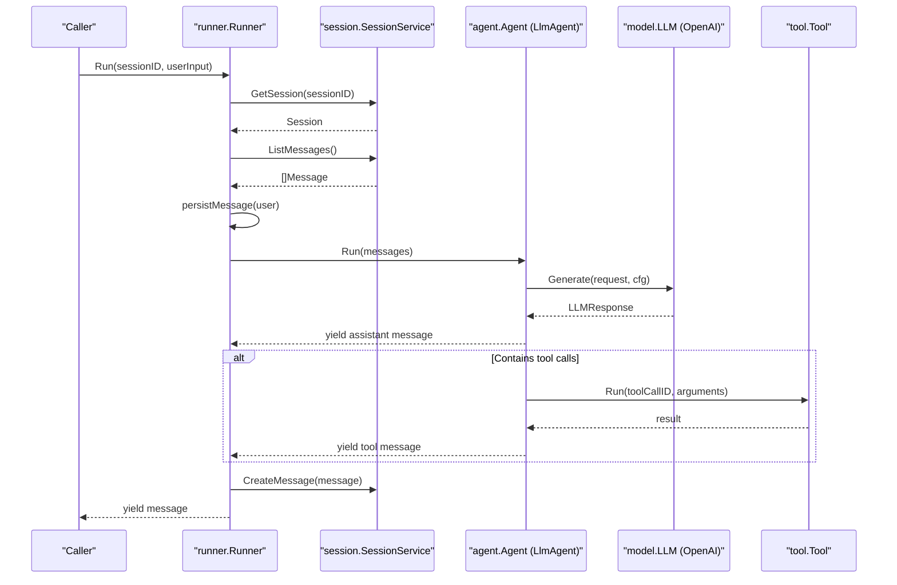
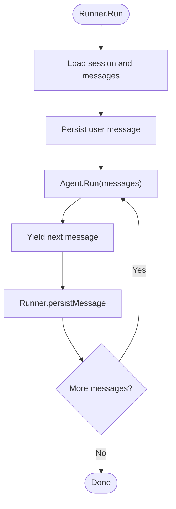
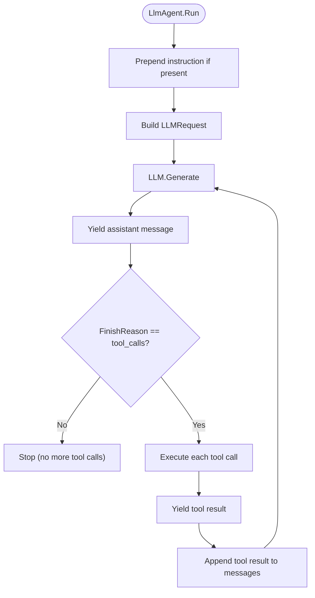
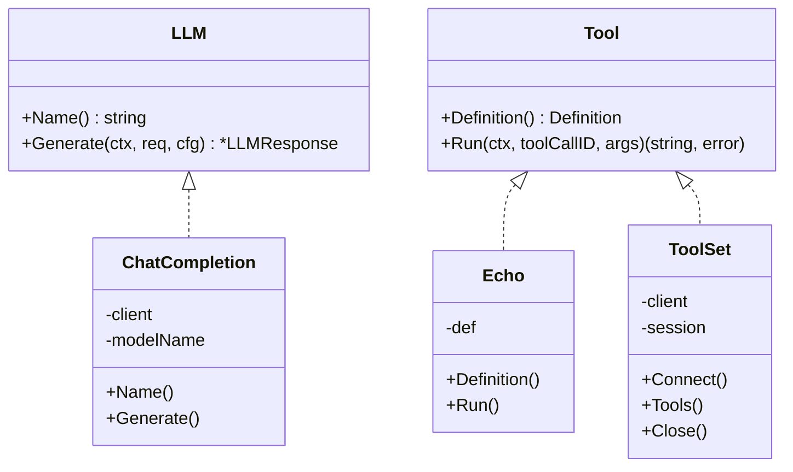
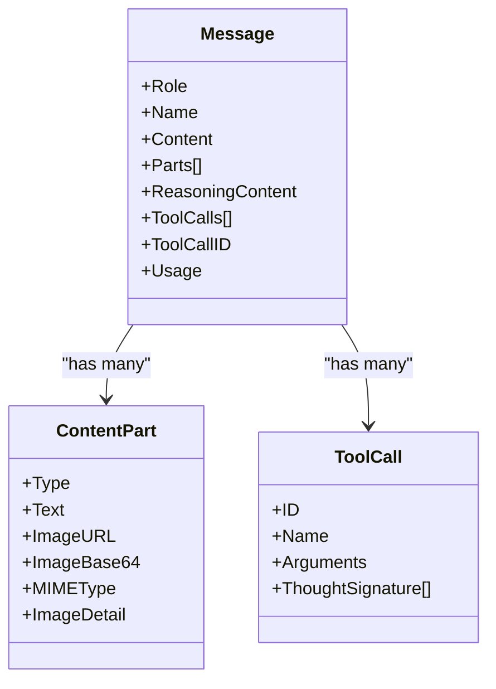
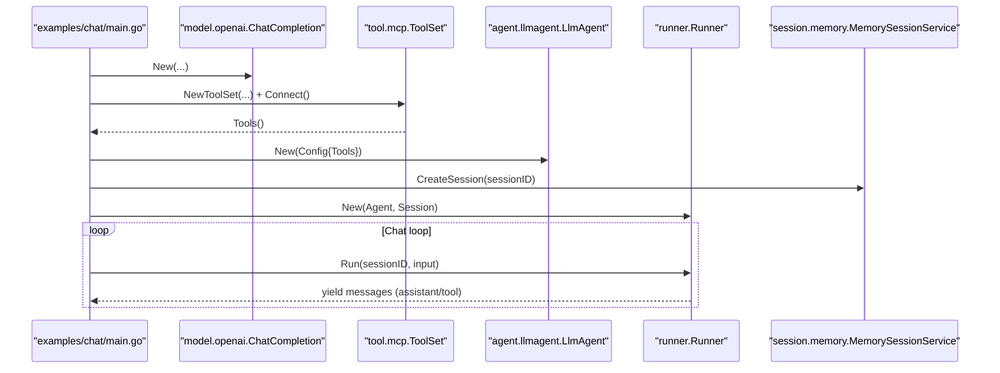
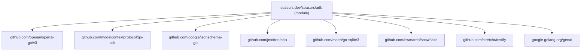

# Project Overview

<cite>
**Referenced Files in This Document**
- [README.md](file://README.md)
- [go.mod](file://go.mod)
- [agent/agent.go](file://agent/agent.go)
- [agent/llmagent/llmagent.go](file://agent/llmagent/llmagent.go)
- [runner/runner.go](file://runner/runner.go)
- [session/session.go](file://session/session.go)
- [session/session_service.go](file://session/session_service.go)
- [session/memory/session_service.go](file://session/memory/session_service.go)
- [model/model.go](file://model/model.go)
- [model/openai/openai.go](file://model/openai/openai.go)
- [tool/tool.go](file://tool/tool.go)
- [tool/builtin/echo.go](file://tool/builtin/echo.go)
- [tool/mcp/mcp.go](file://tool/mcp/mcp.go)
- [internal/snowflake/snowflake.go](file://internal/snowflake/snowflake.go)
- [examples/chat/main.go](file://examples/chat/main.go)
</cite>

## Table of Contents
1. [Introduction](#introduction)
2. [Project Structure](#project-structure)
3. [Core Components](#core-components)
4. [Architecture Overview](#architecture-overview)
5. [Detailed Component Analysis](#detailed-component-analysis)
6. [Dependency Analysis](#dependency-analysis)
7. [Performance Considerations](#performance-considerations)
8. [Troubleshooting Guide](#troubleshooting-guide)
9. [Conclusion](#conclusion)
10. [Appendices](#appendices)

## Introduction
ADK (Agent Development Kit) is a lightweight, idiomatic Go library designed to build production-ready AI agents. Its core philosophy is to decouple agent logic from LLM providers, session storage, and tool integrations, enabling composable, provider-agnostic systems. The framework emphasizes:
- Stateless agents with stateful runners
- Automatic tool-call loops driven by LLM responses
- Pluggable components for models, sessions, and tools
- Streaming outputs via Go iterators
- Practical features such as message compaction, Snowflake IDs, and MCP tool integration

Module path and Go version:
- Module path: soasurs.dev/soasurs/adk
- Minimum Go version: 1.26+

Benefits:
- Provider-agnostic LLM interface for easy model swaps
- Clean separation of concerns: Runner manages persistence and turns; Agent focuses on reasoning and tool orchestration
- Automatic tool-call loop reduces boilerplate
- Pluggable session backends (in-memory and SQLite)
- Message compaction to manage long histories
- MCP tool integration for connecting external tool servers
- Snowflake IDs for distributed, time-ordered identifiers
- Streaming via Go iterators for responsive UIs and real-time feedback

**Section sources**
- [README.md:5-11](file://README.md#L5-L11)
- [go.mod:1-3](file://go.mod#L1-L3)

## Project Structure
ADK organizes functionality by responsibility:
- agent: Agent interface and implementations (e.g., LlmAgent)
- model: Provider-agnostic LLM interface, message types, and adapters (OpenAI, Gemini, Anthropic)
- session: Session and SessionService interfaces plus in-memory and SQLite backends
- tool: Tool interface, definitions, built-in tools, and MCP bridge
- runner: Orchestrator that wires Agent and SessionService together
- internal/snowflake: Snowflake node factory for distributed IDs
- examples: End-to-end chat example integrating OpenAI + MCP tools

**Diagram sources**
- [agent/agent.go:10-17](file://agent/agent.go#L10-L17)
- [model/model.go:9-13](file://model/model.go#L9-L13)
- [session/session_service.go:5-9](file://session/session_service.go#L5-L9)
- [session/session.go:9-23](file://session/session.go#L9-L23)
- [tool/tool.go:17-23](file://tool/tool.go#L17-L23)
- [agent/llmagent/llmagent.go:25-41](file://agent/llmagent/llmagent.go#L25-L41)
- [runner/runner.go:17-37](file://runner/runner.go#L17-L37)
- [session/memory/session_service.go:14-40](file://session/memory/session_service.go#L14-L40)
- [model/openai/openai.go:17-35](file://model/openai/openai.go#L17-L35)
- [tool/builtin/echo.go:22-34](file://tool/builtin/echo.go#L22-L34)
- [tool/mcp/mcp.go:15-33](file://tool/mcp/mcp.go#L15-L33)

**Section sources**
- [README.md:65-82](file://README.md#L65-L82)

## Core Components
- Agent: Defines Name, Description, and Run, returning an iterator of model.Message. The LlmAgent is a stateless implementation that orchestrates tool calls.
- LLM: Provider-agnostic interface with Name and Generate, enabling adapters for OpenAI, Gemini, Anthropic, etc.
- SessionService and Session: Abstractions for creating, retrieving, listing, compacting, and persisting messages.
- Tool: Provider-agnostic interface with Definition and Run, supporting built-in tools and MCP tool sets.
- Runner: Stateful orchestrator that loads history, persists user input, streams agent outputs, and persists each yielded message.

Key data types:
- model.Message: Supports roles (system, user, assistant, tool), multi-modal content parts, tool calls, reasoning content, and token usage.
- model.LLMRequest/LLMResponse: Provider-agnostic request/response envelopes.
- tool.Definition: JSON Schema-based tool metadata.

**Section sources**
- [agent/agent.go:10-17](file://agent/agent.go#L10-L17)
- [agent/llmagent/llmagent.go:13-41](file://agent/llmagent/llmagent.go#L13-L41)
- [model/model.go:9-200](file://model/model.go#L9-L200)
- [session/session_service.go:5-9](file://session/session_service.go#L5-L9)
- [session/session.go:9-23](file://session/session.go#L9-L23)
- [tool/tool.go:9-23](file://tool/tool.go#L9-L23)
- [runner/runner.go:17-101](file://runner/runner.go#L17-L101)

## Architecture Overview
ADK’s architecture cleanly separates stateful orchestration from stateless agent logic:
- Runner is stateful: owns the session, loads and persists messages, and drives the Agent per user turn.
- Agent is stateless: receives the current conversation and yields messages without retaining prior turns.
- LlmAgent runs a loop: Generate -> Yield assistant message -> If tool calls, execute tools and append tool results -> Repeat until stop.

**Diagram sources**
- [runner/runner.go:44-90](file://runner/runner.go#L44-L90)
- [agent/llmagent/llmagent.go:54-105](file://agent/llmagent/llmagent.go#L54-L105)
- [model/openai/openai.go:44-76](file://model/openai/openai.go#L44-L76)
- [tool/mcp/mcp.go:92-109](file://tool/mcp/mcp.go#L92-L109)

**Section sources**
- [README.md:35-63](file://README.md#L35-L63)

## Detailed Component Analysis

### Stateless Agent + Stateful Runner
- Runner encapsulates session lifecycle and message persistence. It assigns Snowflake IDs, timestamps, and writes each yielded message back to the session.
- Agent is stateless: it only operates on the messages passed to Run and does not retain prior turns.

**Diagram sources**
- [runner/runner.go:44-101](file://runner/runner.go#L44-L101)
- [agent/agent.go:13-16](file://agent/agent.go#L13-L16)

**Section sources**
- [runner/runner.go:17-101](file://runner/runner.go#L17-L101)
- [agent/agent.go:10-17](file://agent/agent.go#L10-L17)

### Automatic Tool-Call Loop
- LlmAgent generates assistant messages and checks FinishReason.
- If FinishReasonToolCalls, it executes each tool call, yields tool results, appends them to the conversation, and continues generation.

**Diagram sources**
- [agent/llmagent/llmagent.go:54-105](file://agent/llmagent/llmagent.go#L54-L105)

**Section sources**
- [agent/llmagent/llmagent.go:51-105](file://agent/llmagent/llmagent.go#L51-L105)

### Pluggable Components
- LLM adapters: OpenAI adapter converts provider-specific messages/tools to/from model types.
- Session backends: Memory backend for ephemeral use; SQLite backend for persistence.
- Tools: Built-in tools (e.g., Echo) and MCP ToolSet for dynamic tool discovery and invocation.

**Diagram sources**
- [model/model.go:9-13](file://model/model.go#L9-L13)
- [model/openai/openai.go:17-35](file://model/openai/openai.go#L17-L35)
- [tool/tool.go:17-23](file://tool/tool.go#L17-L23)
- [tool/builtin/echo.go:14-34](file://tool/builtin/echo.go#L14-L34)
- [tool/mcp/mcp.go:15-33](file://tool/mcp/mcp.go#L15-L33)

**Section sources**
- [model/openai/openai.go:44-76](file://model/openai/openai.go#L44-L76)
- [tool/builtin/echo.go:22-46](file://tool/builtin/echo.go#L22-L46)
- [tool/mcp/mcp.go:45-80](file://tool/mcp/mcp.go#L45-L80)

### Message Types and Multi-Modal Support
- model.Message supports roles, content, multi-modal parts (text/images), tool calls/results, reasoning content, and token usage.
- Content parts enable images via URL or base64 with detail controls.

**Diagram sources**
- [model/model.go:147-173](file://model/model.go#L147-L173)
- [model/model.go:104-123](file://model/model.go#L104-L123)
- [model/model.go:125-138](file://model/model.go#L125-L138)

**Section sources**
- [model/model.go:147-173](file://model/model.go#L147-L173)
- [model/model.go:104-123](file://model/model.go#L104-L123)
- [model/model.go:125-138](file://model/model.go#L125-L138)

### Example: Chat Agent with MCP Tools
- Demonstrates OpenAI LLM, MCP tool discovery, LlmAgent configuration, in-memory session, and streaming iteration over Runner outputs.

**Diagram sources**
- [examples/chat/main.go:52-173](file://examples/chat/main.go#L52-L173)
- [model/openai/openai.go:23-35](file://model/openai/openai.go#L23-L35)
- [tool/mcp/mcp.go:35-80](file://tool/mcp/mcp.go#L35-L80)
- [agent/llmagent/llmagent.go:31-41](file://agent/llmagent/llmagent.go#L31-L41)
- [runner/runner.go:26-37](file://runner/runner.go#L26-L37)
- [session/memory/session_service.go:18-22](file://session/memory/session_service.go#L18-L22)

**Section sources**
- [examples/chat/main.go:52-173](file://examples/chat/main.go#L52-L173)

## Dependency Analysis
- Module path and Go version are declared in go.mod.
- External dependencies include OpenAI SDK, MCP SDK, JSON schema, SQLite, Snowflake, testify, and Google GenAI.

**Diagram sources**
- [go.mod:5-15](file://go.mod#L5-L15)

**Section sources**
- [go.mod:1-47](file://go.mod#L1-L47)

## Performance Considerations
- Streaming via Go iterators enables low-latency, incremental output delivery.
- Message compaction archives older messages to reduce retrieval overhead without losing data.
- Snowflake IDs avoid contention and provide global uniqueness/time ordering.
- LlmAgent’s tool-call loop minimizes round trips by batching tool execution within a single turn.

[No sources needed since this section provides general guidance]

## Troubleshooting Guide
Common issues and remedies:
- Missing API keys or invalid endpoints: Ensure environment variables are set for LLM providers and MCP servers.
- Empty tool lists from MCP: Verify connectivity and that the MCP server exposes tools.
- Session creation failures: Confirm the SessionService backend is initialized and reachable (e.g., SQLite file permissions).
- Tool argument parsing errors: Validate JSON schema compliance and argument formatting.

**Section sources**
- [examples/chat/main.go:55-66](file://examples/chat/main.go#L55-L66)
- [tool/mcp/mcp.go:35-43](file://tool/mcp/mcp.go#L35-L43)
- [tool/mcp/mcp.go:92-109](file://tool/mcp/mcp.go#L92-L109)

## Conclusion
ADK offers a pragmatic, modular foundation for building AI agents in Go. By keeping agents stateless and runners stateful, it cleanly separates concerns and simplifies testing and deployment. Its provider-agnostic design, automatic tool-loop, pluggable session backends, and streaming outputs make it suitable for production-grade applications ranging from simple chatbots to complex reasoning agents with external tools.

[No sources needed since this section summarizes without analyzing specific files]

## Appendices

### Beginner-Friendly Concepts
- Agent: A “brain” that decides what to say and when to call tools.
- Runner: A “note-taker” that keeps track of the conversation and feeds it to the Agent.
- LLM: The model engine that generates text and tool calls.
- Tool: A function the Agent can invoke to extend capabilities (e.g., search, calculations).
- Session: A place to store and retrieve conversation history.

### Technical Details for Experienced Developers
- Iterator-based streaming: Agents return iter.Seq2 to yield messages progressively.
- Provider abstraction: model.LLM hides provider specifics behind a uniform interface.
- Tool schema: tool.Definition uses JSON Schema for deterministic tool invocation.
- Snowflake IDs: Distributed, collision-free IDs generated from network interfaces.
- Session compaction: Soft-archive mechanism preserves history while reducing load.

**Section sources**
- [README.md:14-25](file://README.md#L14-L25)
- [README.md:157-231](file://README.md#L157-L231)
- [internal/snowflake/snowflake.go:17-57](file://internal/snowflake/snowflake.go#L17-L57)