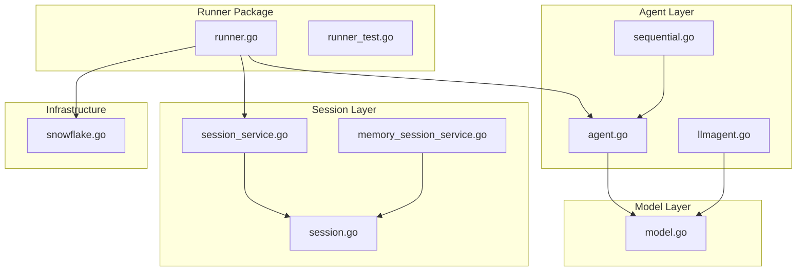
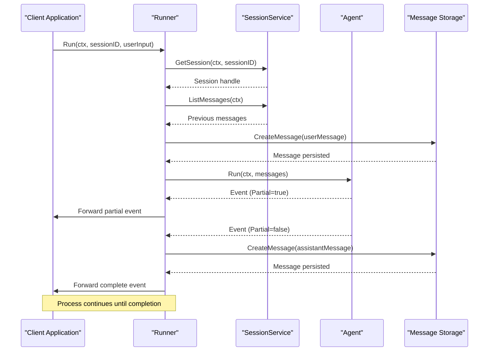
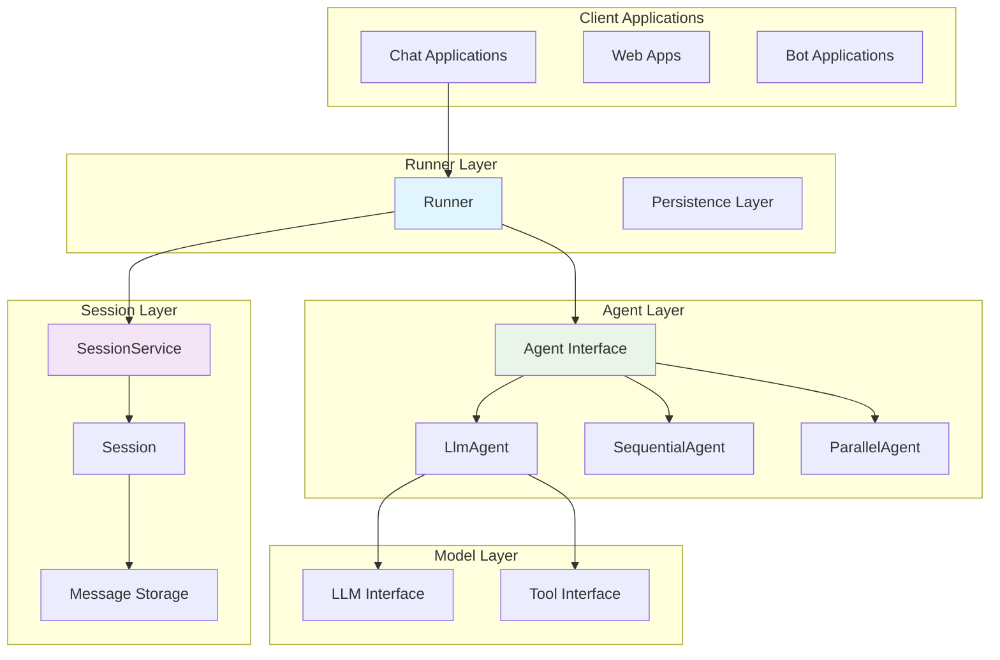
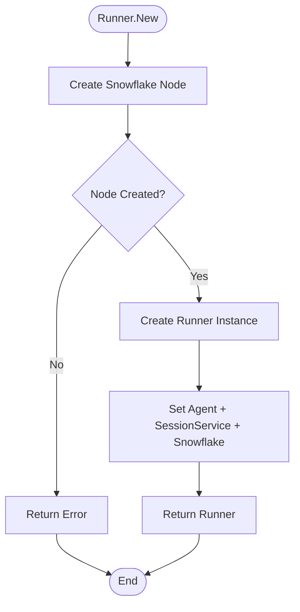
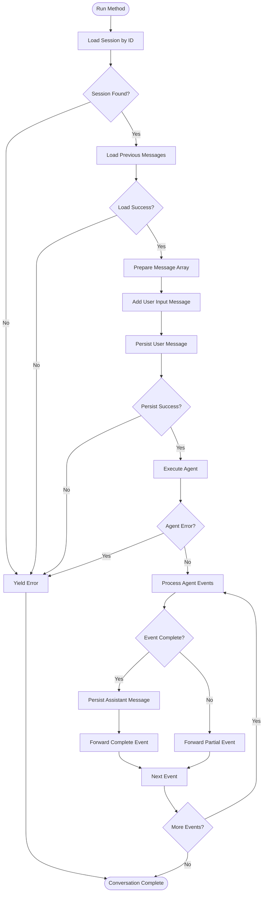
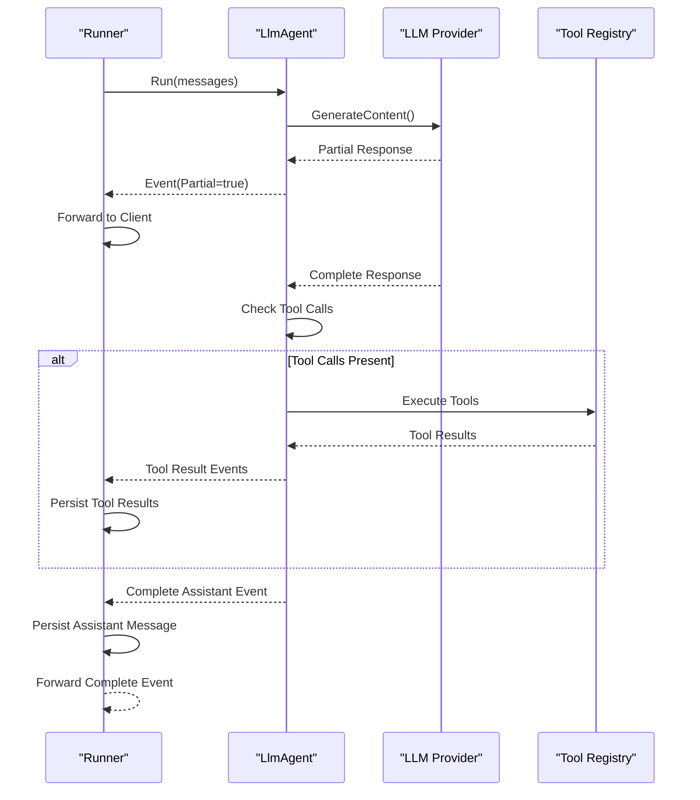
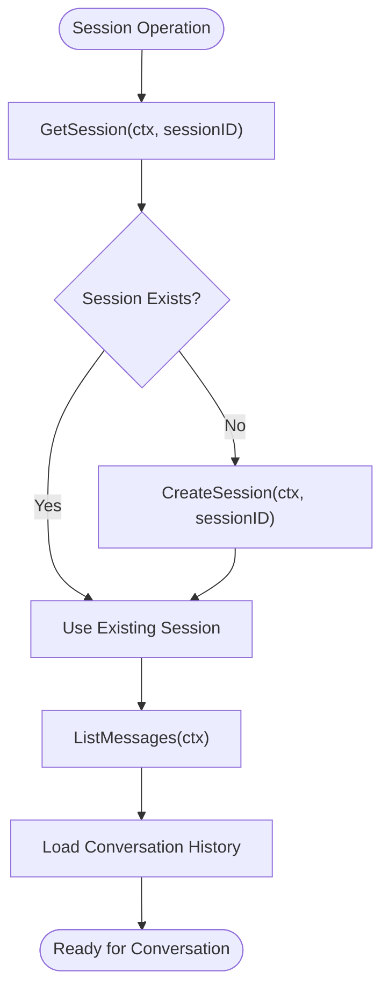
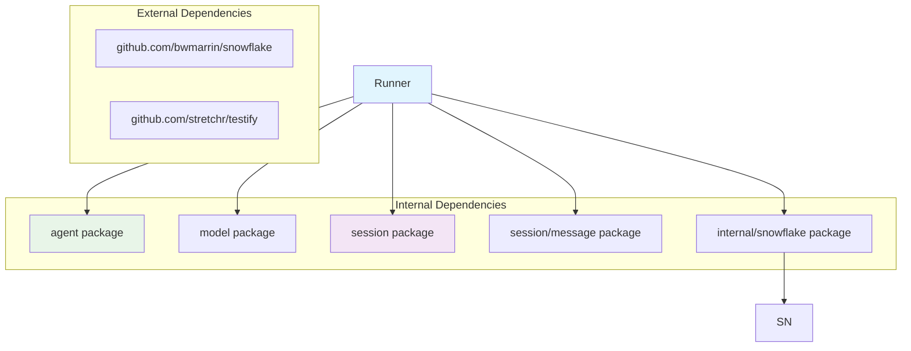

# Runner

<cite>
**Referenced Files in This Document**
- [runner.go](file://runner/runner.go)
- [runner_test.go](file://runner/runner_test.go)
- [agent.go](file://agent/agent.go)
- [llmagent.go](file://agent/llmagent/llmagent.go)
- [sequential.go](file://agent/sequential/sequential.go)
- [session.go](file://session/session.go)
- [session_service.go](file://session/session_service.go)
- [memory_session_service.go](file://session/memory/session_service.go)
- [snowflake.go](file://internal/snowflake/snowflake.go)
- [model.go](file://model/model.go)
- [main.go](file://examples/chat/main.go)
- [README.md](file://README.md)
</cite>

## Table of Contents
1. [Introduction](#introduction)
2. [Project Structure](#project-structure)
3. [Core Components](#core-components)
4. [Architecture Overview](#architecture-overview)
5. [Detailed Component Analysis](#detailed-component-analysis)
6. [Dependency Analysis](#dependency-analysis)
7. [Performance Considerations](#performance-considerations)
8. [Troubleshooting Guide](#troubleshooting-guide)
9. [Conclusion](#conclusion)

## Introduction
The Runner is the stateful orchestrator in the ADK (Agent Development Kit) that coordinates conversation flow between stateless Agents and persistent Session storage. It manages message persistence, handles streaming responses, and maintains conversation continuity across multiple turns while delegating the actual reasoning and tool execution to specialized Agent implementations.

The Runner follows a clean separation of concerns: it handles persistence and orchestration while Agents remain stateless and focused solely on generating responses based on provided conversation context.

## Project Structure
The Runner component resides in the `runner` package and integrates with several other core packages:

**Diagram sources**
- [runner.go:1-108](file://runner/runner.go#L1-L108)
- [agent.go:1-20](file://agent/agent.go#L1-L20)
- [session_service.go:1-10](file://session/session_service.go#L1-L10)

**Section sources**
- [README.md:67-89](file://README.md#L67-L89)
- [runner.go:17-24](file://runner/runner.go#L17-L24)

## Core Components
The Runner consists of three primary components working together:

### Runner Structure
The Runner maintains three key dependencies:
- **Agent**: The stateless reasoning engine that generates responses
- **SessionService**: The persistent storage interface for conversation history
- **Snowflake Node**: Distributed ID generator for message identifiers

### Message Flow Architecture
The Runner implements a sophisticated message persistence and streaming system:

**Diagram sources**
- [runner.go:45-96](file://runner/runner.go#L45-L96)
- [session.go:9-23](file://session/session.go#L9-L23)

**Section sources**
- [runner.go:20-37](file://runner/runner.go#L20-L37)
- [runner.go:45-108](file://runner/runner.go#L45-L108)

## Architecture Overview
The Runner sits at the intersection of stateless Agent logic and persistent session storage, providing a clean separation of concerns:

**Diagram sources**
- [runner.go:17-24](file://runner/runner.go#L17-L24)
- [agent.go:10-19](file://agent/agent.go#L10-L19)
- [session_service.go:5-9](file://session/session_service.go#L5-L9)

The architecture ensures that:
- **Stateless Agents** focus purely on reasoning and response generation
- **Runner** manages persistence and conversation flow
- **SessionService** abstracts storage implementation
- **Message IDs** use distributed Snowflake IDs for global uniqueness

## Detailed Component Analysis

### Runner Implementation
The Runner implements a sophisticated conversation orchestration system with the following key features:

#### Constructor and Initialization
The Runner constructor initializes a Snowflake node for distributed ID generation and validates agent-session compatibility:

**Diagram sources**
- [runner.go:27-37](file://runner/runner.go#L27-L37)
- [snowflake.go:17-57](file://internal/snowflake/snowflake.go#L17-L57)

#### Run Method Processing Logic
The Run method implements a comprehensive conversation flow:

**Diagram sources**
- [runner.go:45-96](file://runner/runner.go#L45-L96)

#### Message Persistence Strategy
The Runner implements a selective persistence strategy:

| Message Type | Persistence Decision | Streaming Behavior |
|--------------|---------------------|-------------------|
| User Messages | Always persisted | Not streamed (already complete) |
| Assistant Messages | Only complete ones persisted | Streamed as partial fragments, then complete |
| Tool Results | Always persisted | Not streamed (already complete) |

**Section sources**
- [runner.go:45-108](file://runner/runner.go#L45-L108)
- [runner_test.go:106-211](file://runner/runner_test.go#L106-L211)

### Agent Integration
The Runner works seamlessly with various Agent implementations:

#### LlmAgent Integration
The Runner delegates all reasoning to LlmAgent while managing persistence:

**Diagram sources**
- [runner.go:78-94](file://runner/runner.go#L78-L94)
- [llmagent.go:60-136](file://agent/llmagent/llmagent.go#L60-L136)

#### Sequential Agent Integration
For multi-step conversations, the Runner coordinates SequentialAgent:

| Step | Action | Persistence Behavior |
|------|--------|---------------------|
| 1st Agent | Receives original messages + accumulated context | Accumulated messages persisted |
| 2nd Agent | Receives original + all previous agent outputs | Each complete message persisted |
| Nth Agent | Receives original + all previous outputs | Each complete message persisted |

**Section sources**
- [sequential.go:56-92](file://agent/sequential/sequential.go#L56-L92)
- [runner.go:78-94](file://runner/runner.go#L78-L94)

### Session Management
The Runner abstracts session operations through the SessionService interface:

#### Session Lifecycle

**Diagram sources**
- [session_service.go:5-9](file://session/session_service.go#L5-L9)
- [session.go:12-17](file://session/session.go#L12-L17)

**Section sources**
- [session_service.go:1-10](file://session/session_service.go#L1-L10)
- [session.go:1-24](file://session/session.go#L1-L24)

## Dependency Analysis
The Runner has a clean dependency structure with minimal coupling:

**Diagram sources**
- [runner.go:3-15](file://runner/runner.go#L3-L15)
- [snowflake.go:1-9](file://internal/snowflake/snowflake.go#L1-L9)

### Coupling and Cohesion Analysis
- **Cohesion**: High - Runner focuses exclusively on orchestration and persistence
- **Coupling**: Low - Uses interfaces (Agent, SessionService) rather than concrete implementations
- **Circular Dependencies**: None detected
- **External Dependencies**: Minimal and well-defined

**Section sources**
- [runner.go:3-15](file://runner/runner.go#L3-L15)
- [agent.go:10-19](file://agent/agent.go#L10-L19)
- [session_service.go:5-9](file://session/session_service.go#L5-L9)

## Performance Considerations
The Runner is designed for optimal performance through several mechanisms:

### Streaming Optimization
- **Real-time Delivery**: Partial events are forwarded immediately without buffering
- **Selective Persistence**: Only complete messages are persisted to reduce I/O overhead
- **Iterator-Based Processing**: Uses Go's native `iter.Seq2` for efficient streaming

### Memory Management
- **Message Buffering**: Pre-allocates message slices with capacity hints
- **Context Propagation**: Leverages context cancellation for early termination
- **Resource Cleanup**: Proper cleanup of goroutines in agent compositions

### Scalability Features
- **Distributed Identifiers**: Snowflake IDs enable global uniqueness across deployments
- **Interface Abstraction**: Allows swapping storage backends without code changes
- **Concurrent Processing**: Supports parallel agent execution in composition patterns

## Troubleshooting Guide

### Common Issues and Solutions

#### Session Loading Failures
**Symptoms**: `GetSession` returns nil or errors
**Causes**: 
- Session doesn't exist for the given ID
- Storage backend connection issues
- Permission problems

**Solutions**:
- Verify session creation before use
- Check storage backend connectivity
- Validate session ID format

#### Message Persistence Errors
**Symptoms**: `persistMessage` fails during conversation
**Causes**:
- Storage backend unavailability
- ID generation failures
- Timestamp conversion issues

**Solutions**:
- Implement retry logic for transient failures
- Monitor storage health
- Validate message format before persistence

#### Streaming Interruptions
**Symptoms**: Conversation ends unexpectedly during streaming
**Causes**:
- Client breaks iteration loop
- Context cancellation
- Agent error during generation

**Solutions**:
- Handle context cancellation gracefully
- Implement proper error propagation
- Ensure client handles partial events correctly

**Section sources**
- [runner_test.go:213-243](file://runner/runner_test.go#L213-L243)
- [runner_test.go:245-268](file://runner/runner_test.go#L245-L268)

### Testing Strategies
The Runner includes comprehensive test coverage for various scenarios:

#### Test Categories
- **Basic Functionality**: Single turn conversations with persistence
- **Multi-turn Conversations**: History preservation across turns
- **Streaming Behavior**: Partial event forwarding vs. persistence
- **Error Handling**: Session errors, agent errors, early termination
- **Edge Cases**: Empty conversations, no agent output, malformed data

#### Test Utilities
The test suite provides helper functions for:
- Mock agent creation with custom behavior
- Memory session service setup
- Event collection and validation
- Error scenario simulation

**Section sources**
- [runner_test.go:18-100](file://runner/runner_test.go#L18-L100)
- [runner_test.go:289-356](file://runner/runner_test.go#L289-L356)

## Conclusion
The Runner represents a sophisticated yet elegant solution for orchestrating AI agent conversations with persistent state management. Its design achieves several key goals:

### Architectural Strengths
- **Clean Separation of Concerns**: Stateful orchestration vs. stateless reasoning
- **Flexible Integration**: Works with any Agent implementation through interfaces
- **Robust Persistence**: Selective message persistence with streaming support
- **Scalable Design**: Distributed identifiers and pluggable storage backends

### Practical Benefits
- **Developer Experience**: Simple API with comprehensive streaming support
- **Production Ready**: Extensive error handling and testing coverage
- **Extensible**: Easy to integrate new Agent types and storage backends
- **Performance Optimized**: Efficient memory usage and streaming delivery

The Runner's architecture enables developers to build complex conversational AI applications while maintaining clean code organization and optimal performance characteristics. Its interface-driven design ensures compatibility with future Agent implementations and storage backends without requiring code modifications.