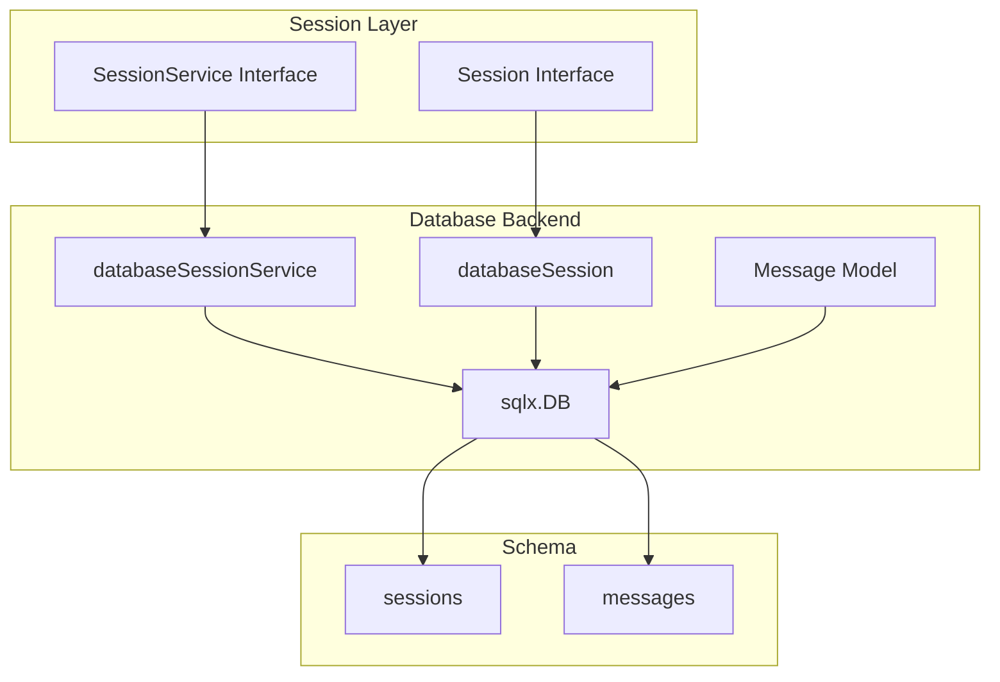
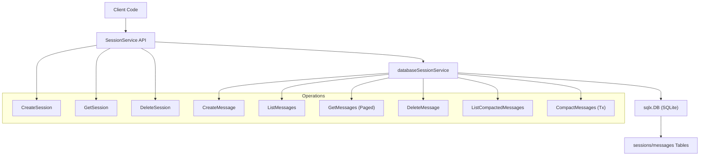
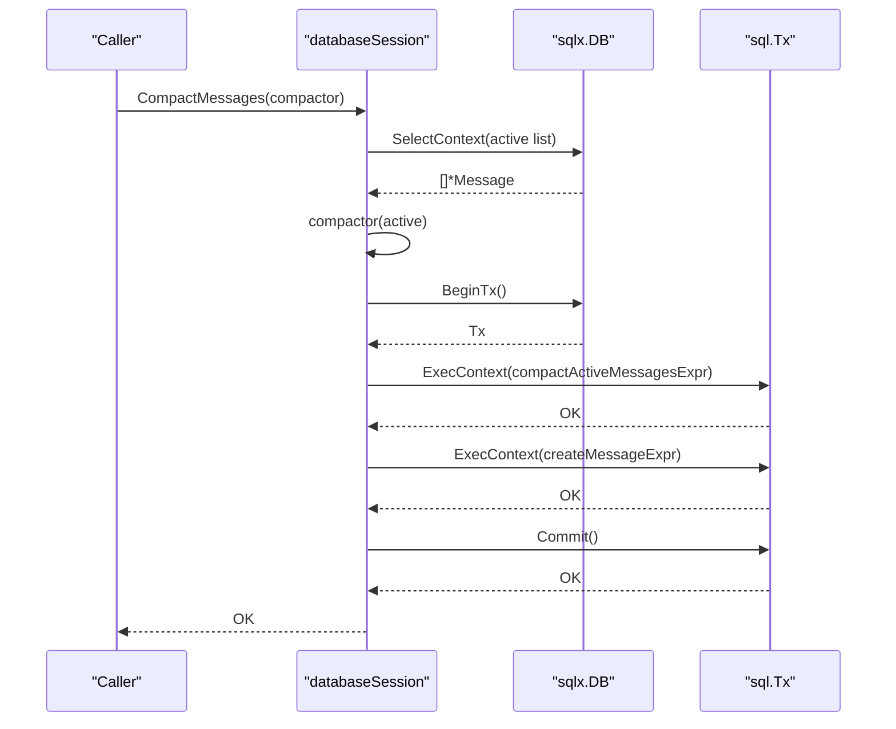
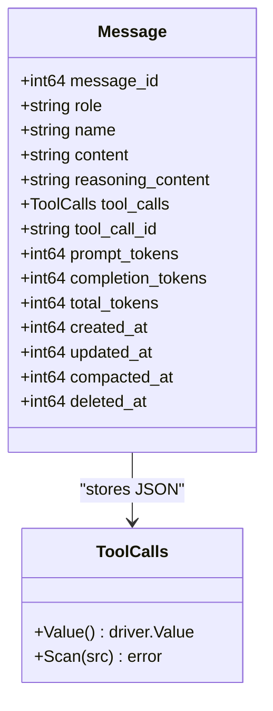
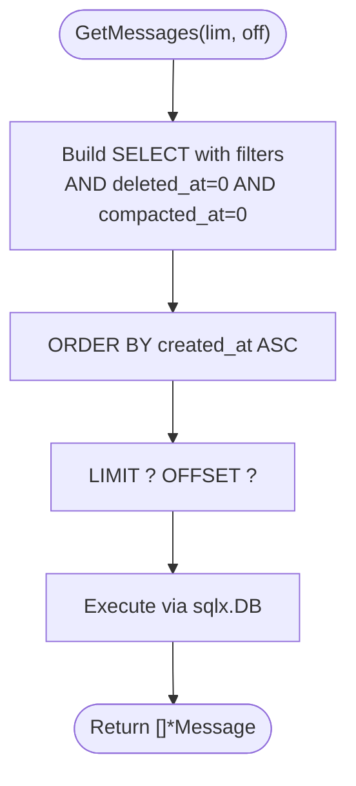
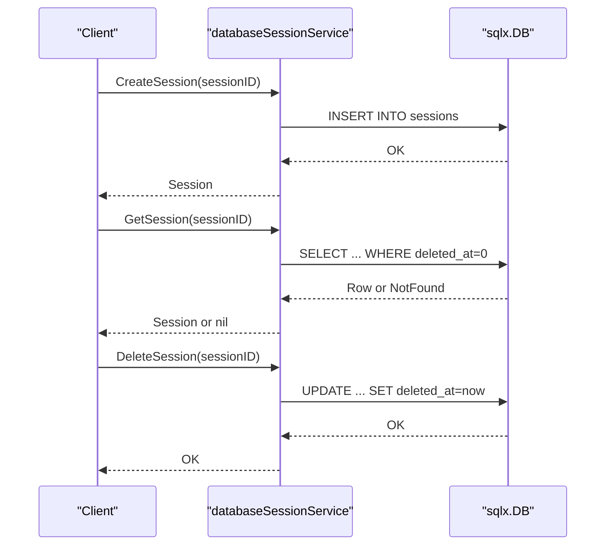
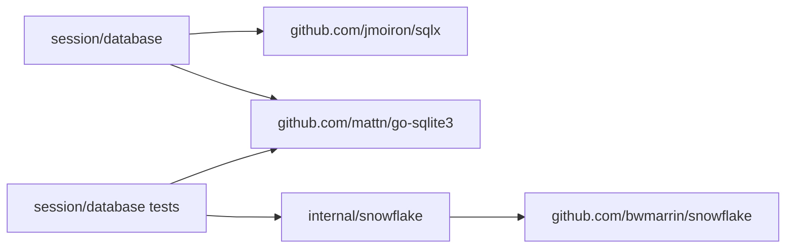

# Database Backend

<cite>
**Referenced Files in This Document**
- [session.go](file://session/database/session.go)
- [session_service.go](file://session/database/session_service.go)
- [message.go](file://session/message/message.go)
- [session.go](file://session/session.go)
- [session_service.go](file://session/session_service.go)
- [session_test.go](file://session/database/session_test.go)
- [session_service_test.go](file://session/database/session_service_test.go)
- [snowflake.go](file://internal/snowflake/snowflake.go)
- [go.mod](file://go.mod)
- [main.go](file://examples/chat/main.go)
</cite>

## Table of Contents
1. [Introduction](#introduction)
2. [Project Structure](#project-structure)
3. [Core Components](#core-components)
4. [Architecture Overview](#architecture-overview)
5. [Detailed Component Analysis](#detailed-component-analysis)
6. [Dependency Analysis](#dependency-analysis)
7. [Performance Considerations](#performance-considerations)
8. [Troubleshooting Guide](#troubleshooting-guide)
9. [Conclusion](#conclusion)
10. [Appendices](#appendices)

## Introduction
This document describes the Database Backend implementation using SQLite within the project. It covers the database schema design, table structures, and migration strategies. It explains SQLite integration, connection management, and transaction handling. It details message storage patterns, indexing strategies, and query optimization. It also documents database initialization, schema migration procedures, and maintenance tasks, along with practical examples of database backend setup, session persistence operations, and backup procedures. Finally, it addresses performance considerations, concurrent access patterns, and troubleshooting database-related issues, including configuration options, connection pooling, and production deployment considerations.

## Project Structure
The database backend resides under the session/database package and integrates with the broader session abstraction. The message model supports structured storage of conversation turns, including tool-call metadata serialized as JSON. Tests demonstrate schema creation and end-to-end operations against an in-memory SQLite database.

**Diagram sources**
- [session.go:1-146](file://session/database/session.go#L1-L146)
- [session_service.go:1-49](file://session/database/session_service.go#L1-L49)
- [message.go:1-129](file://session/message/message.go#L1-L129)

**Section sources**
- [session.go:1-146](file://session/database/session.go#L1-L146)
- [session_service.go:1-49](file://session/database/session_service.go#L1-L49)
- [message.go:1-129](file://session/message/message.go#L1-L129)

## Core Components
- databaseSessionService: Implements session.SessionService using an injected sqlx.DB. Provides CreateSession, GetSession, and DeleteSession operations against the sessions table.
- databaseSession: Implements session.Session backed by SQLite. Supports CreateMessage, DeleteMessage, GetMessages (paginated), ListMessages (all active), ListCompactedMessages, and CompactMessages (archive-and-summarize).
- Message model: Defines the persisted message structure and provides JSON serialization for tool_calls via sql.Scanner/sql.Valuer.

Key behaviors:
- Soft deletion pattern: deleted_at is used to mark rows as deleted without physical removal.
- Active vs compacted messages: active messages have compacted_at = 0; archived messages have compacted_at set to a timestamp.
- Transactional compaction: CompactMessages runs atomically to avoid inconsistent states.

**Section sources**
- [session.go:1-146](file://session/database/session.go#L1-L146)
- [session_service.go:1-49](file://session/database/session_service.go#L1-L49)
- [message.go:1-129](file://session/message/message.go#L1-L129)

## Architecture Overview
The database backend uses a straightforward relational schema with two tables:
- sessions: per-session lifecycle and soft-delete tracking.
- messages: per-message content, metadata, token usage, and archival flags.

Operations flow through the session abstraction, enabling pluggable persistence backends (e.g., memory vs SQLite).

**Diagram sources**
- [session.go:1-146](file://session/database/session.go#L1-L146)
- [session_service.go:1-49](file://session/database/session_service.go#L1-L49)
- [session_test.go:17-52](file://session/database/session_test.go#L17-L52)

## Detailed Component Analysis

### Database Schema Design
Tables and fields:
- sessions
  - session_id (PK): unique session identifier
  - created_at: timestamp of creation
  - updated_at: last update timestamp
  - deleted_at: soft-delete marker
- messages
  - message_id (PK): unique message identifier
  - role, name, content, reasoning_content: message metadata and payload
  - tool_calls: JSON array of tool calls
  - tool_call_id: links tool-role messages to assistant tool call
  - prompt_tokens, completion_tokens, total_tokens: token usage
  - created_at, updated_at: timestamps
  - compacted_at: archival timestamp (0 = active)
  - deleted_at: soft-delete marker

Indexing strategy:
- Primary keys on sessions(session_id) and messages(message_id).
- Implicit index on primary keys.
- No explicit secondary indexes are defined in the schema; queries filter by deleted_at and compacted_at flags.

Query patterns:
- Active messages: WHERE deleted_at = 0 AND compacted_at = 0
- Archived messages: WHERE compacted_at > 0 AND deleted_at = 0
- Pagination: ORDER BY created_at ASC LIMIT ? OFFSET ?

**Section sources**
- [session_test.go:21-48](file://session/database/session_test.go#L21-L48)
- [session.go:14-24](file://session/database/session.go#L14-L24)

### SQLite Integration and Connection Management
- Driver: github.com/mattn/go-sqlite3 via github.com/jmoiron/sqlx.
- Connection: sqlx.DB is passed into constructors and used for all operations.
- In-memory testing: tests connect to ":memory:" for fast, isolated setups.
- Production guidance: replace ":memory:" with a file path or DSN suitable for your environment.

Practical setup example (from tests):
- Connect to SQLite using sqlx.Connect("sqlite3", "<DSN>").
- Initialize schema by executing CREATE TABLE statements for sessions and messages.

**Section sources**
- [go.mod:10-10](file://go.mod#L10-L10)
- [session_test.go:17-52](file://session/database/session_test.go#L17-L52)

### Transaction Handling
- CompactMessages uses a transaction to atomically archive active messages and insert the summarized message.
- Rollback is deferred on error; Commit occurs after successful archive and insert.
- This ensures atomicity and prevents partial compaction states.

**Diagram sources**
- [session.go:97-145](file://session/database/session.go#L97-L145)

**Section sources**
- [session.go:97-145](file://session/database/session.go#L97-L145)

### Message Storage Patterns and JSON Serialization
- tool_calls is stored as JSON text and mapped via a custom type implementing sql.Valuer and sql.Scanner.
- This enables structured persistence while remaining portable across SQL providers.

**Diagram sources**
- [message.go:11-129](file://session/message/message.go#L11-L129)

**Section sources**
- [message.go:11-129](file://session/message/message.go#L11-L129)

### Query Optimization and Pagination
- Queries filter by deleted_at and compacted_at to isolate active/archived messages.
- Sorting by created_at ASC supports chronological ordering.
- Pagination uses LIMIT and OFFSET; consider adding an index on (deleted_at, compacted_at, created_at) for improved performance on large histories.

**Diagram sources**
- [session.go:70-86](file://session/database/session.go#L70-L86)

**Section sources**
- [session.go:70-86](file://session/database/session.go#L70-L86)

### Session Persistence Operations
- CreateSession: Inserts a new row into sessions with current timestamps.
- GetSession: Retrieves a session by session_id with soft-delete guard.
- DeleteSession: Marks a session as deleted by updating deleted_at.
- CreateMessage/DeleteMessage/ListMessages/GetMessages/ListCompactedMessages: Operate on messages with active/archived separation and soft deletion.

**Diagram sources**
- [session_service.go:27-48](file://session/database/session_service.go#L27-L48)
- [session.go:34-41](file://session/database/session.go#L34-L41)

**Section sources**
- [session_service.go:1-49](file://session/database/session_service.go#L1-L49)
- [session.go:1-146](file://session/database/session.go#L1-L146)

### Backup Procedures
- For file-backed SQLite databases, perform backups by copying the database file while the application is offline or during a maintenance window.
- For in-memory databases used in tests, persist to disk by connecting to a file path instead of ":memory:" before running backup procedures.

[No sources needed since this section provides general guidance]

### Practical Examples
- Example chat application demonstrates runtime usage of session services but uses an in-memory backend. To switch to SQLite, initialize sqlx.DB with a file path and pass it to NewDatabaseSessionService.

**Section sources**
- [main.go:112-123](file://examples/chat/main.go#L112-L123)

## Dependency Analysis
External dependencies relevant to the database backend:
- github.com/jmoiron/sqlx: SQL convenience library for Go.
- github.com/mattn/go-sqlite3: SQLite driver for Go.
- github.com/bwmarrin/snowflake: Used in tests to generate deterministic session IDs.

**Diagram sources**
- [go.mod:9-10](file://go.mod#L9-L10)
- [go.mod:7-7](file://go.mod#L7-L7)
- [session_test.go:8-14](file://session/database/session_test.go#L8-L14)

**Section sources**
- [go.mod:1-47](file://go.mod#L1-L47)
- [session_test.go:1-16](file://session/database/session_test.go#L1-L16)

## Performance Considerations
- Indexing: Add an index on (deleted_at, compacted_at, created_at) to optimize GetMessages pagination and filtering.
- Token usage: Store token counts to enable downstream analytics without parsing content.
- JSON size: tool_calls JSON can grow; consider limiting tool call arguments or normalizing tool definitions externally if storage becomes a concern.
- Concurrency: SQLite supports concurrent reads; write contention can occur with heavy writes. Use transactions (as implemented) and consider WAL mode for improved concurrency.
- Vacuum/PRAGMA: Periodically run PRAGMA integrity_check and consider VACUUM after large deletions to reclaim space.

[No sources needed since this section provides general guidance]

## Troubleshooting Guide
Common issues and resolutions:
- Connection failures: Verify the SQLite driver is imported and the DSN is valid. Tests use ":memory:" for isolation; ensure your production DSN points to a writable location.
- Schema mismatches: Ensure sessions and messages tables exist with the expected columns. Tests create these tables explicitly; replicate the schema in production.
- Soft deletes: Deleted rows are invisible to active queries due to WHERE deleted_at = 0 checks. Confirm deleted_at values when diagnosing missing rows.
- Transaction anomalies: CompactMessages uses a transaction to archive and insert. If compaction fails partway, the rollback prevents partial states. Inspect error returns and logs around compaction.
- JSON deserialization: tool_calls requires proper JSON. Validate JSON content and handle unexpected types in Scan.

**Section sources**
- [session_test.go:17-52](file://session/database/session_test.go#L17-L52)
- [session.go:97-145](file://session/database/session.go#L97-L145)
- [message.go:31-47](file://session/message/message.go#L31-L47)

## Conclusion
The database backend provides a clean, minimal SQLite-backed persistence layer for sessions and messages. It leverages soft deletes, active/archived message separation, and transactional compaction to maintain a concise active history while preserving archival records. The design is straightforward, testable, and adaptable to production environments with appropriate schema, indexing, and operational practices.

[No sources needed since this section summarizes without analyzing specific files]

## Appendices

### Database Initialization and Migration
- Initialization: Create sessions and messages tables as shown in tests. Apply this schema to your production database.
- Migrations: For future schema changes, define incremental migrations that alter tables while preserving data. Use transactions for each migration step and maintain backward compatibility during rollout.

**Section sources**
- [session_test.go:21-48](file://session/database/session_test.go#L21-L48)

### Configuration Options and Connection Pooling
- Connection pool: sqlx.DB exposes standard database/sql pool settings (e.g., SetMaxOpenConns, SetMaxIdleConns, SetConnMaxLifetime). Tune these according to workload characteristics.
- SQLite-specific: Consider enabling WAL mode and appropriate synchronous settings for durability/performance trade-offs.

[No sources needed since this section provides general guidance]

### Production Deployment Considerations
- Storage: Use a durable filesystem-backed SQLite database file. Back up regularly and monitor disk space.
- Concurrency: Expect read concurrency; write-heavy workloads may benefit from batching and transaction boundaries.
- Monitoring: Track query latency, transaction retries, and compaction frequency. Monitor disk usage and vacuum activity.

[No sources needed since this section provides general guidance]