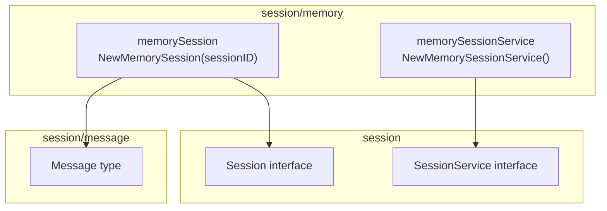
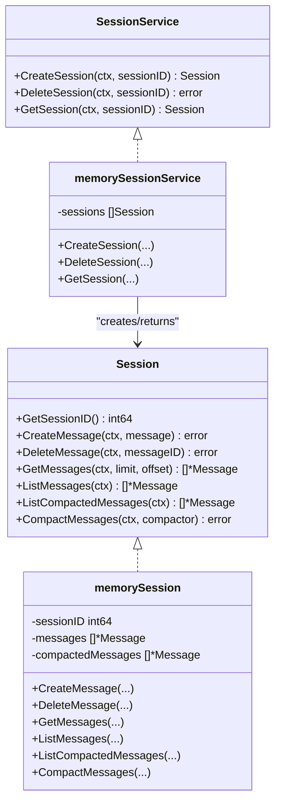
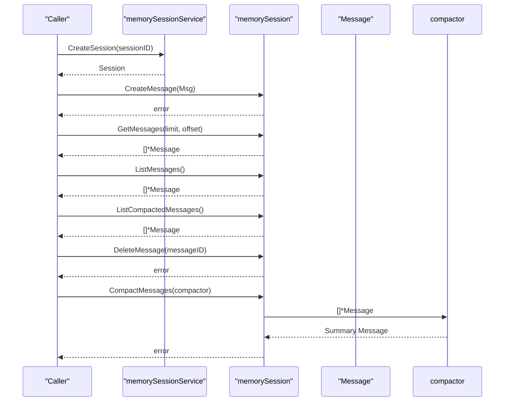
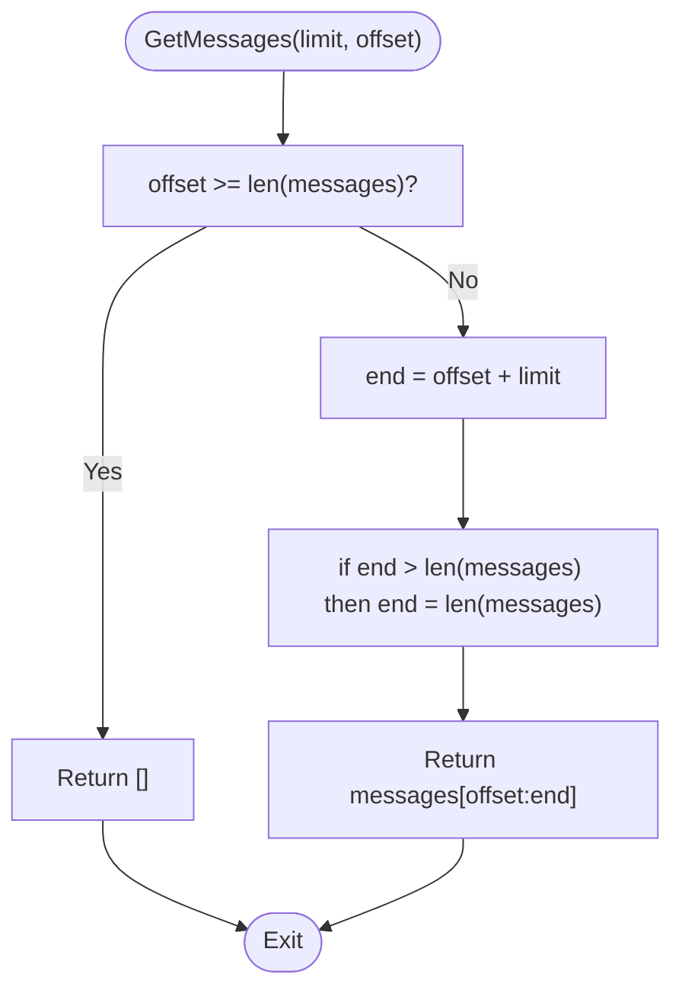
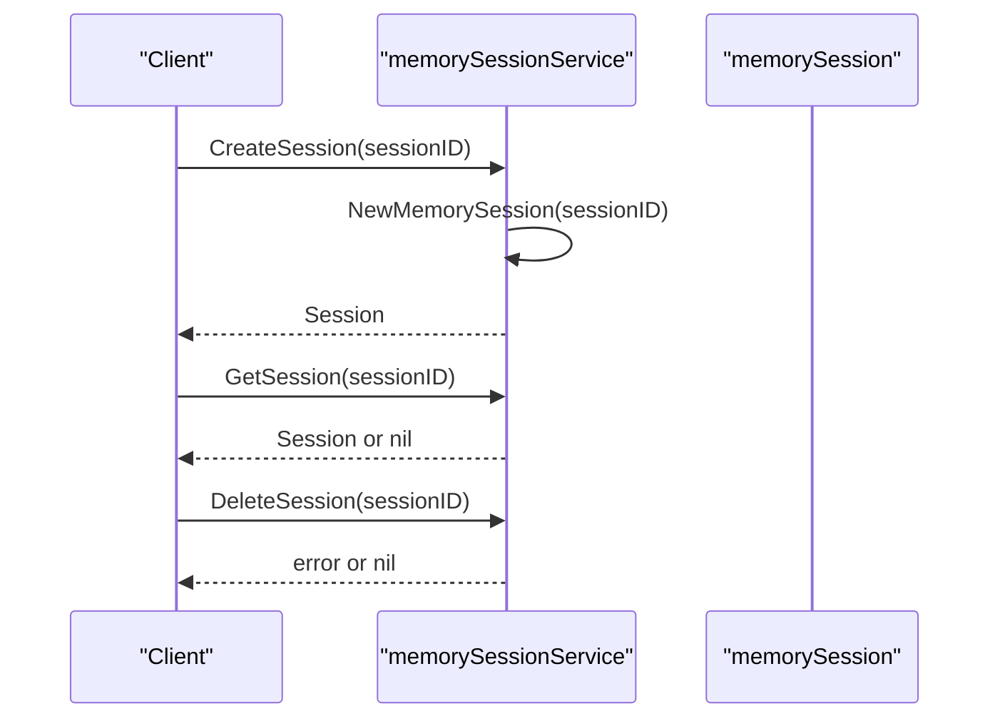
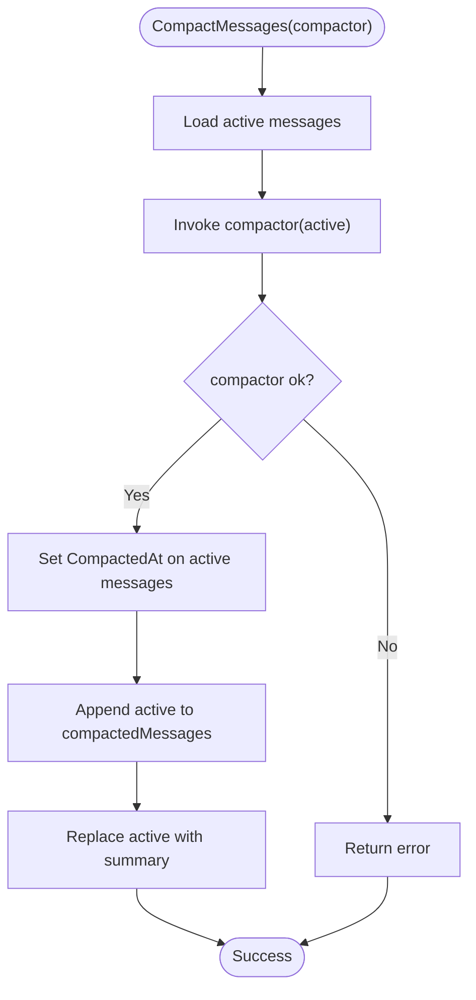
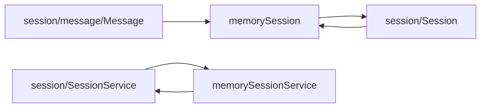

# Memory Backend

<cite>
**Referenced Files in This Document**
- [session/memory/session.go](file://session/memory/session.go)
- [session/memory/session_service.go](file://session/memory/session_service.go)
- [session/memory/session_test.go](file://session/memory/session_test.go)
- [session/memory/session_service_test.go](file://session/memory/session_service_test.go)
- [session/session.go](file://session/session.go)
- [session/session_service.go](file://session/session_service.go)
- [session/message/message.go](file://session/message/message.go)
- [session/database/session.go](file://session/database/session.go)
- [session/database/session_service.go](file://session/database/session_service.go)
- [README.md](file://README.md)
- [examples/chat/main.go](file://examples/chat/main.go)
</cite>

## Table of Contents
1. [Introduction](#introduction)
2. [Project Structure](#project-structure)
3. [Core Components](#core-components)
4. [Architecture Overview](#architecture-overview)
5. [Detailed Component Analysis](#detailed-component-analysis)
6. [Dependency Analysis](#dependency-analysis)
7. [Performance Considerations](#performance-considerations)
8. [Troubleshooting Guide](#troubleshooting-guide)
9. [Conclusion](#conclusion)
10. [Appendices](#appendices)

## Introduction
This document explains the Memory Backend implementation used for session and message storage in the ADK project. It covers the in-memory storage architecture, thread safety characteristics, and practical guidance for testing and development scenarios. It also compares the memory backend with the database backend, outlines performance and memory usage patterns, and provides migration strategies between backends.

## Project Structure
The Memory Backend resides under the session/memory package and implements the Session and SessionService interfaces defined in the session package. It is complemented by the database backend for persistent storage and by message types used for serialization and compaction.

**Diagram sources**
- [session/memory/session_service.go:14-41](file://session/memory/session_service.go#L14-L41)
- [session/memory/session.go:18-86](file://session/memory/session.go#L18-L86)
- [session/session.go:9-24](file://session/session.go#L9-L24)
- [session/session_service.go:5-10](file://session/session_service.go#L5-L10)
- [session/message/message.go:49-129](file://session/message/message.go#L49-L129)

**Section sources**
- [README.md:74-75](file://README.md#L74-L75)
- [session/memory/session_service.go:14-41](file://session/memory/session_service.go#L14-L41)
- [session/memory/session.go:18-86](file://session/memory/session.go#L18-L86)
- [session/session.go:9-24](file://session/session.go#L9-L24)
- [session/session_service.go:5-10](file://session/session_service.go#L5-L10)
- [session/message/message.go:49-129](file://session/message/message.go#L49-L129)

## Core Components
- memorySession: An in-memory implementation of the Session interface. It stores active messages and an archive of compacted messages. It supports creating, listing, paginating, deleting, and compacting messages.
- memorySessionService: An in-memory implementation of the SessionService interface. It manages a slice of sessions and supports creating, retrieving, and deleting sessions by ID.
- Message: The persisted message type used by both backends. It includes fields for role, content, tool calls, token usage, timestamps, and compaction metadata.

Key capabilities:
- Zero-configuration in-memory storage for fast iteration and testing.
- Message compaction that archives older messages while keeping a summary as the active history.
- Pagination and listing APIs for active and archived messages.

**Section sources**
- [session/memory/session.go:12-86](file://session/memory/session.go#L12-L86)
- [session/memory/session_service.go:10-41](file://session/memory/session_service.go#L10-L41)
- [session/message/message.go:49-129](file://session/message/message.go#L49-L129)

## Architecture Overview
The memory backend is a pluggable component that satisfies the same interfaces as the database backend. This allows seamless switching between in-memory and persistent storage without changing agent or runner code.

**Diagram sources**
- [session/session.go:9-24](file://session/session.go#L9-L24)
- [session/session_service.go:5-10](file://session/session_service.go#L5-L10)
- [session/memory/session_service.go:10-41](file://session/memory/session_service.go#L10-L41)
- [session/memory/session.go:12-86](file://session/memory/session.go#L12-L86)

## Detailed Component Analysis

### memorySession
Responsibilities:
- Store active messages and an archive of compacted messages.
- Provide message lifecycle operations: create, delete, list, paginate, and compact.
- Support compaction by invoking a user-provided compactor function and moving active messages to the compacted archive.

Implementation highlights:
- Active messages are stored in a slice; compacted messages are stored in another slice.
- GetMessages supports pagination via limit and offset.
- ListMessages returns a copy of active messages to prevent external mutation.
- ListCompactedMessages returns a copy of archived messages.
- CompactMessages invokes the compactor with active messages, then moves active messages to the compacted archive and replaces them with a summary message.

Thread safety:
- The implementation does not use locks. Concurrent access to the same session instance from multiple goroutines may lead to race conditions. Use separate session instances per goroutine or synchronize access externally.

Complexity:
- CreateMessage: O(1) amortized append.
- DeleteMessage: O(n) scan and deletion.
- GetMessages: O(k) where k is the number of messages in the slice.
- ListMessages/ListCompactedMessages: O(n) copy.
- CompactMessages: O(n) to pass messages to compactor plus O(n) to archive and replace.

Edge cases covered by tests:
- Deleting a non-existent message does not error.
- GetMessages handles offsets beyond length gracefully.
- Compaction with an empty active history works.
- Compaction failure does not alter the active history or archive.
- Multiple rounds of compaction accumulate archived messages.

**Section sources**
- [session/memory/session.go:18-86](file://session/memory/session.go#L18-L86)
- [session/memory/session_test.go:23-293](file://session/memory/session_test.go#L23-L293)

### memorySessionService
Responsibilities:
- Manage a collection of sessions in-memory.
- Create, retrieve, and delete sessions by ID.

Implementation highlights:
- Stores sessions in a slice.
- Uses linear scans for lookup and deletion.
- GetSession returns nil when not found.

Thread safety:
- Not thread-safe. Concurrent create/delete/get operations can cause races. Use synchronization or separate services per goroutine.

Complexity:
- CreateSession: O(1) append.
- GetSession: O(n) linear scan.
- DeleteSession: O(n) scan and deletion.

Edge cases covered by tests:
- Creating multiple sessions and retrieving them by ID.
- Getting a non-existent session returns nil.
- Deleting a non-existent session does not error.

**Section sources**
- [session/memory/session_service.go:14-41](file://session/memory/session_service.go#L14-L41)
- [session/memory/session_service_test.go:10-110](file://session/memory/session_service_test.go#L10-L110)

### Message Type
The Message type defines the persisted representation of a conversation message. It includes:
- Identity and role fields.
- Content and reasoning content.
- Tool calls and linkage to tool call IDs.
- Token usage metrics.
- Timestamps for creation, update, compaction, and deletion.
- Serialization helpers for database storage.

These fields enable both backends to persist and retrieve messages consistently, including compaction metadata.

**Section sources**
- [session/message/message.go:49-129](file://session/message/message.go#L49-L129)

### Comparison with Database Backend
- Storage: Memory backend keeps all data in process memory; database backend persists to disk.
- Persistence: Memory backend loses data on process exit; database backend survives restarts.
- Concurrency: Memory backend is not thread-safe; database backend uses transactions for atomic operations.
- Compaction: Both support soft compaction; database backend uses transactions to atomically archive and insert summaries.

**Section sources**
- [session/database/session.go:34-146](file://session/database/session.go#L34-L146)
- [session/database/session_service.go:23-49](file://session/database/session_service.go#L23-L49)

## Architecture Overview

**Diagram sources**
- [session/memory/session_service.go:18-40](file://session/memory/session_service.go#L18-L40)
- [session/memory/session.go:30-85](file://session/memory/session.go#L30-L85)
- [session/message/message.go:49-129](file://session/message/message.go#L49-L129)

## Detailed Component Analysis

### Message Storage and Retrieval
- Active messages: Stored in a slice and returned via ListMessages and GetMessages with pagination.
- Archived messages: Stored separately and returned via ListCompactedMessages.
- Deletion: Implemented by scanning and removing entries by ID; non-existent IDs are ignored.
- Pagination: Offsets beyond length return empty results; limits are clamped to available messages.

**Diagram sources**
- [session/memory/session.go:45-56](file://session/memory/session.go#L45-L56)

**Section sources**
- [session/memory/session.go:45-62](file://session/memory/session.go#L45-L62)
- [session/memory/session_test.go:88-126](file://session/memory/session_test.go#L88-L126)

### Session Creation and Lifecycle
- CreateSession: Creates a new memorySession and appends it to the service’s slice.
- GetSession: Linearly scans sessions by ID; returns nil if not found.
- DeleteSession: Removes a session by ID; non-existent IDs are ignored.

**Diagram sources**
- [session/memory/session_service.go:18-40](file://session/memory/session_service.go#L18-L40)

**Section sources**
- [session/memory/session_service.go:18-40](file://session/memory/session_service.go#L18-L40)
- [session/memory/session_service_test.go:35-78](file://session/memory/session_service_test.go#L35-L78)

### Message Compaction Workflow
- Collect active messages and pass them to the compactor.
- On success, mark active messages as compacted and append them to the archive.
- Replace active messages with a single summary message returned by the compactor.
- On failure, leave active messages unchanged and do not modify the archive.

**Diagram sources**
- [session/memory/session.go:70-85](file://session/memory/session.go#L70-L85)

**Section sources**
- [session/memory/session.go:70-85](file://session/memory/session.go#L70-L85)
- [session/memory/session_test.go:128-220](file://session/memory/session_test.go#L128-L220)

## Dependency Analysis
- memorySessionService depends on memorySession and the Session interface.
- memorySession depends on Message and the Session interface.
- Both backends implement the same interfaces, enabling drop-in replacement.

**Diagram sources**
- [session/memory/session.go:18-86](file://session/memory/session.go#L18-L86)
- [session/memory/session_service.go:14-41](file://session/memory/session_service.go#L14-L41)
- [session/session.go:9-24](file://session/session.go#L9-L24)
- [session/session_service.go:5-10](file://session/session_service.go#L5-L10)
- [session/message/message.go:49-129](file://session/message/message.go#L49-L129)

**Section sources**
- [session/memory/session.go:18-86](file://session/memory/session.go#L18-L86)
- [session/memory/session_service.go:14-41](file://session/memory/session_service.go#L14-L41)
- [session/session.go:9-24](file://session/session.go#L9-L24)
- [session/session_service.go:5-10](file://session/session_service.go#L5-L10)
- [session/message/message.go:49-129](file://session/message/message.go#L49-L129)

## Performance Considerations
- Time complexity:
  - CreateMessage: O(1) amortized.
  - DeleteMessage: O(n) due to linear scan and slice deletion.
  - GetMessages: O(k) where k is the number of messages in the slice.
  - ListMessages/ListCompactedMessages: O(n) copy.
  - CompactMessages: O(n) to pass messages to compactor plus O(n) to archive and replace.
- Space complexity:
  - Active messages and compacted messages are stored in separate slices; memory usage grows with message count.
- Concurrency:
  - Not thread-safe. Concurrent access to the same session instance may cause data races. Use separate instances per goroutine or synchronize access externally.
- Persistence:
  - Data is lost when the process exits. Use the database backend for persistence across restarts.

[No sources needed since this section provides general guidance]

## Troubleshooting Guide
Common issues and resolutions:
- Concurrent access panics or corrupts data: Use separate session instances per goroutine or wrap operations with a mutex.
- Deleting a non-existent message fails silently: Expected behavior; verify IDs before deletion.
- GetMessages returns fewer items than expected: Check limit and offset; ensure they do not exceed message length.
- Compaction fails: The active history remains unchanged; inspect the compactor error and retry.

**Section sources**
- [session/memory/session_test.go:69-86](file://session/memory/session_test.go#L69-L86)
- [session/memory/session_test.go:196-220](file://session/memory/session_test.go#L196-L220)
- [session/memory/session_test.go:88-126](file://session/memory/session_test.go#L88-L126)

## Conclusion
The Memory Backend offers a zero-configuration, fast, and convenient option for testing and development. It supports the full session lifecycle and message compaction. However, it is not thread-safe and does not persist data across process restarts. For production use, prefer the database backend to ensure durability and safe concurrent access.

[No sources needed since this section summarizes without analyzing specific files]

## Appendices

### Practical Examples

- Initialize memory backend and create a session:
  - See [examples/chat/main.go:112-117](file://examples/chat/main.go#L112-L117) for creating a memory session service and a session.

- Perform session operations:
  - Create a message: [session/memory/session.go:30-33](file://session/memory/session.go#L30-L33)
  - Retrieve messages with pagination: [session/memory/session.go:45-56](file://session/memory/session.go#L45-L56)
  - List all active messages: [session/memory/session.go:58-62](file://session/memory/session.go#L58-L62)
  - List archived messages: [session/memory/session.go:64-68](file://session/memory/session.go#L64-L68)
  - Delete a message: [session/memory/session.go:35-43](file://session/memory/session.go#L35-L43)
  - Compact messages: [session/memory/session.go:70-85](file://session/memory/session.go#L70-L85)

- Cleanup procedures:
  - Delete a session: [session/memory/session_service.go:24-32](file://session/memory/session_service.go#L24-L32)
  - Ensure no lingering references to avoid memory leaks.

**Section sources**
- [examples/chat/main.go:112-117](file://examples/chat/main.go#L112-L117)
- [session/memory/session.go:30-85](file://session/memory/session.go#L30-L85)
- [session/memory/session_service.go:24-32](file://session/memory/session_service.go#L24-L32)

### Choosing Between Memory and Database Backends
- Choose memory backend when:
  - Prototyping or testing locally.
  - Low-latency access to messages is desired.
  - No persistence across restarts is acceptable.
- Choose database backend when:
  - Durability across process restarts is required.
  - Multiple goroutines or processes need to access the same session.
  - Long-running services require reliable persistence.

**Section sources**
- [README.md:116-130](file://README.md#L116-L130)

### Migration Strategies
- From memory to database:
  - Capture active messages from memory sessions.
  - Insert them into the database using the database session’s create operation.
  - Optionally compact and archive messages according to your policy.
  - Replace the memory session service with the database session service.
- From database to memory:
  - Read active and archived messages from the database.
  - Repopulate memory sessions with the retrieved messages.
  - Replace the database session service with the memory session service.

**Section sources**
- [session/database/session.go:46-95](file://session/database/session.go#L46-L95)
- [session/memory/session.go:30-85](file://session/memory/session.go#L30-L85)