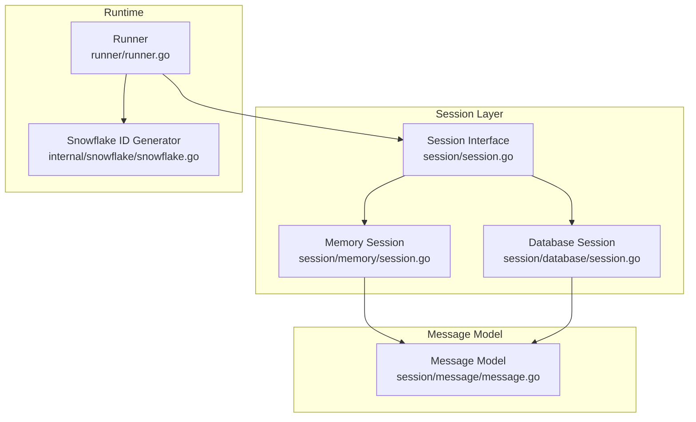
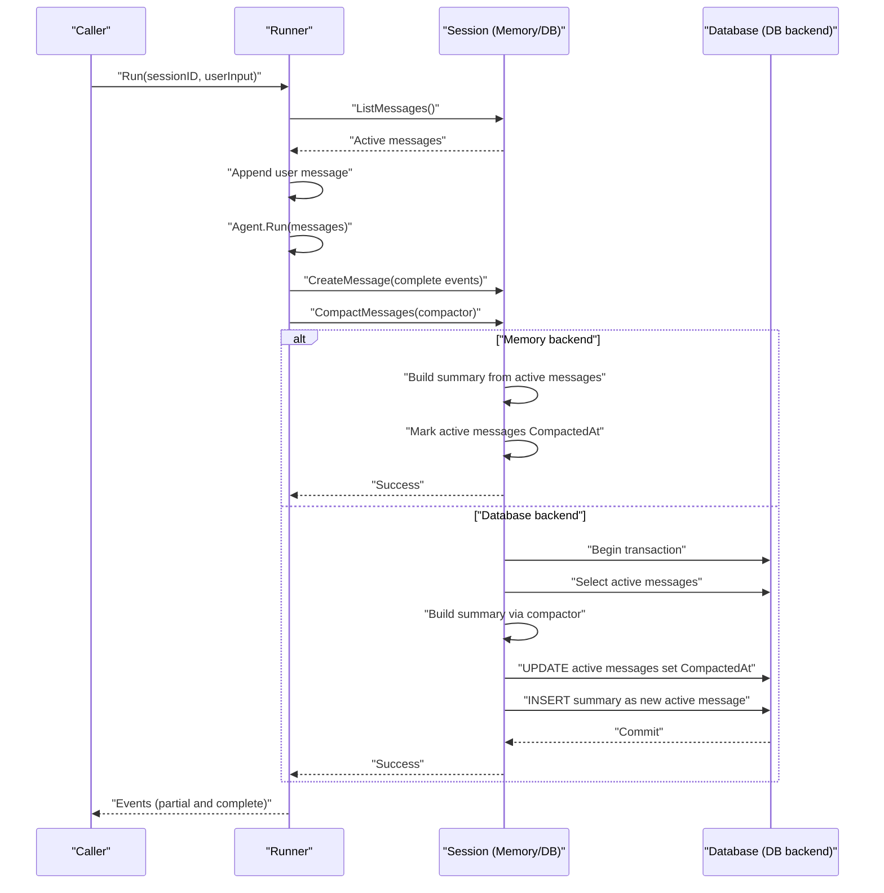
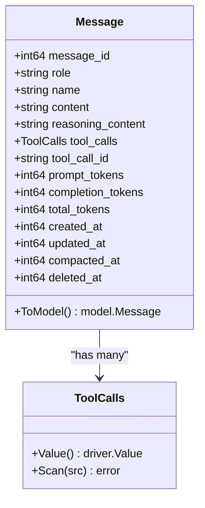
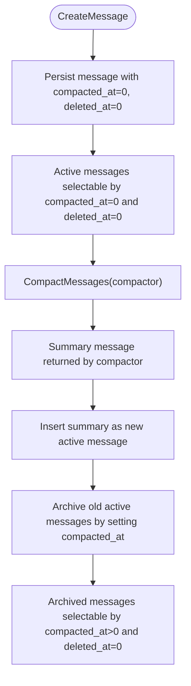
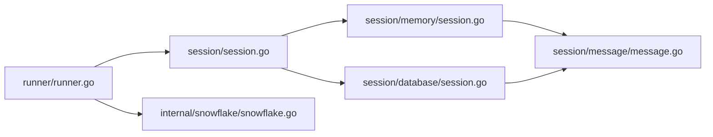

# Message Compaction

<cite>
**Referenced Files in This Document**
- [message.go](file://session/message/message.go)
- [session.go](file://session/session.go)
- [session_service.go](file://session/session_service.go)
- [memory_session.go](file://session/memory/session.go)
- [database_session.go](file://session/database/session.go)
- [memory_session_test.go](file://session/memory/session_test.go)
- [database_session_test.go](file://session/database/session_test.go)
- [runner.go](file://runner/runner.go)
- [snowflake.go](file://internal/snowflake/snowflake.go)
- [README.md](file://README.md)
</cite>

## Table of Contents
1. [Introduction](#introduction)
2. [Project Structure](#project-structure)
3. [Core Components](#core-components)
4. [Architecture Overview](#architecture-overview)
5. [Detailed Component Analysis](#detailed-component-analysis)
6. [Dependency Analysis](#dependency-analysis)
7. [Performance Considerations](#performance-considerations)
8. [Troubleshooting Guide](#troubleshooting-guide)
9. [Conclusion](#conclusion)
10. [Appendices](#appendices)

## Introduction
This document explains the Message Compaction system, focusing on the soft archival strategy, historical preservation, and summarization integration patterns. It documents compaction triggers, thresholds, and automated cleanup processes, along with the message lifecycle (creation, archival, and restoration). It also covers the relationship between compaction and session persistence, performance implications, storage optimization, practical configuration and manual intervention procedures, monitoring effectiveness, edge cases, rollback procedures, and best practices for balancing storage efficiency with historical data availability.

## Project Structure
The compaction system spans several packages:
- session/message: defines the persisted message model and conversion helpers
- session: defines the Session interface and methods for message lifecycle and compaction
- session/memory and session/database: concrete implementations of Session with soft archival semantics
- runner: orchestrates message creation and integrates with compaction
- internal/snowflake: generates unique IDs for messages and sessions
- Tests under session/memory and session/database validate compaction behavior across backends

**Diagram sources**
- [session.go:9-23](file://session/session.go#L9-L23)
- [memory_session.go:12-24](file://session/memory/session.go#L12-L24)
- [database_session.go:26-32](file://session/database/session.go#L26-L32)
- [message.go:49-73](file://session/message/message.go#L49-L73)
- [runner.go:17-37](file://runner/runner.go#L17-L37)
- [snowflake.go:17-57](file://internal/snowflake/snowflake.go#L17-L57)

**Section sources**
- [session.go:9-23](file://session/session.go#L9-L23)
- [message.go:49-73](file://session/message/message.go#L49-L73)
- [memory_session.go:12-24](file://session/memory/session.go#L12-L24)
- [database_session.go:26-32](file://session/database/session.go#L26-L32)
- [runner.go:17-37](file://runner/runner.go#L17-L37)
- [snowflake.go:17-57](file://internal/snowflake/snowflake.go#L17-L57)

## Core Components
- Message model: captures content, roles, tool calls, token usage, timestamps, and compaction/deletion markers.
- Session interface: defines message CRUD, pagination, listing, compaction, and archival accessors.
- Memory and database implementations: provide soft archival via a compaction timestamp and separate archival buckets.
- Runner: persists user and agent messages and integrates compaction after turns.

Key responsibilities:
- Soft archival: messages are marked archived rather than deleted, enabling historical preservation and potential restoration.
- Summarization integration: compaction callback receives active messages and returns a summary message to replace them.
- Historical access: archived messages remain queryable while active messages are filtered by compaction state.

**Section sources**
- [message.go:49-73](file://session/message/message.go#L49-L73)
- [session.go:9-23](file://session/session.go#L9-L23)
- [memory_session.go:70-85](file://session/memory/session.go#L70-L85)
- [database_session.go:97-145](file://session/database/session.go#L97-L145)
- [runner.go:39-96](file://runner/runner.go#L39-L96)

## Architecture Overview
Soft compaction is implemented as a two-phase process:
1. Collect active messages and pass them to a compactor function.
2. On success, archive active messages (mark compaction timestamp) and insert the summary as the new active message.

**Diagram sources**
- [runner.go:39-96](file://runner/runner.go#L39-L96)
- [memory_session.go:70-85](file://session/memory/session.go#L70-L85)
- [database_session.go:97-145](file://session/database/session.go#L97-L145)

## Detailed Component Analysis

### Message Model
The Message struct encapsulates:
- Identity and metadata: message_id, role, name, content, reasoning_content, tool_call_id
- Tool call payloads: ToolCalls serialized as JSON
- Token usage: prompt_tokens, completion_tokens, total_tokens
- Timestamps: created_at, updated_at, compacted_at, deleted_at
- Conversion helpers: ToModel and FromModel bridge to/from the model layer

Soft archival is signaled by a non-zero compacted_at timestamp. Deleted messages carry a non-zero deleted_at.

**Diagram sources**
- [message.go:49-129](file://session/message/message.go#L49-L129)

**Section sources**
- [message.go:49-129](file://session/message/message.go#L49-L129)

### Session Interface and Lifecycle
The Session interface defines:
- Creation, deletion, pagination, and listing of active messages
- Listing of archived messages
- Compaction with a compactor callback
- Session identification

Lifecycle highlights:
- Active messages: compacted_at = 0 and deleted_at = 0
- Archived messages: compacted_at > 0 and deleted_at = 0
- Deleted messages: deleted_at > 0 (not returned by active queries)

**Diagram sources**
- [session.go:9-23](file://session/session.go#L9-L23)
- [database_session.go:14-24](file://session/database/session.go#L14-L24)
- [database_session.go:97-145](file://session/database/session.go#L97-L145)
- [memory_session.go:70-85](file://session/memory/session.go#L70-L85)

**Section sources**
- [session.go:9-23](file://session/session.go#L9-L23)
- [database_session.go:14-24](file://session/database/session.go#L14-L24)
- [memory_session.go:70-85](file://session/memory/session.go#L70-L85)

### Memory Session Implementation
Behavior:
- Stores active messages in-memory
- Compacts by invoking the compactor, marking each active message with a compaction timestamp, and replacing the active set with a single summary message
- Maintains an archival bucket for compacted messages

Edge cases validated by tests:
- Empty active set compaction succeeds and inserts a summary
- Compactor error aborts compaction without moving messages
- Multiple rounds of compaction accumulate archived messages

**Section sources**
- [memory_session.go:12-24](file://session/memory/session.go#L12-L24)
- [memory_session.go:70-85](file://session/memory/session.go#L70-L85)
- [memory_session_test.go:128-167](file://session/memory/session_test.go#L128-L167)
- [memory_session_test.go:169-194](file://session/memory/session_test.go#L169-L194)
- [memory_session_test.go:196-220](file://session/memory/session_test.go#L196-L220)
- [memory_session_test.go:255-292](file://session/memory/session_test.go#L255-L292)

### Database Session Implementation
Behavior:
- Uses SQL queries to select active messages and archive them atomically
- Executes compaction inside a transaction:
  - Select active messages
  - Invoke compactor to produce a summary
  - Update active messages to set compacted_at
  - Insert the summary as a new active message
  - Commit transaction

Queries:
- Create message: initializes compacted_at and deleted_at to zero
- Get/List active messages: filters by compacted_at = 0 and deleted_at = 0
- List archived messages: filters by compacted_at > 0 and deleted_at = 0
- Archive active messages: updates compacted_at for all active messages

**Section sources**
- [database_session.go:14-24](file://session/database/session.go#L14-L24)
- [database_session.go:97-145](file://session/database/session.go#L97-L145)
- [database_session_test.go:162-205](file://session/database/session_test.go#L162-L205)
- [database_session_test.go:207-236](file://session/database/session_test.go#L207-L236)
- [database_session_test.go:238-266](file://session/database/session_test.go#L238-L266)
- [database_session_test.go:308-349](file://session/database/session_test.go#L308-L349)

### Runner Integration
Runner coordinates message creation and compaction:
- Loads active messages from the session
- Persists user input and agent-generated complete events
- Invokes compaction after each turn using a provided compactor function
- Assigns unique IDs and timestamps to persisted messages

**Section sources**
- [runner.go:39-96](file://runner/runner.go#L39-L96)
- [runner.go:98-107](file://runner/runner.go#L98-L107)
- [snowflake.go:17-57](file://internal/snowflake/snowflake.go#L17-L57)

## Dependency Analysis
- Session depends on Message model for persistence and conversion
- Memory and Database sessions implement the Session interface
- Runner depends on SessionService to obtain a Session and on Snowflake for IDs
- Tests validate both backends’ compaction semantics

**Diagram sources**
- [runner.go:17-37](file://runner/runner.go#L17-L37)
- [session.go:9-23](file://session/session.go#L9-L23)
- [memory_session.go:12-24](file://session/memory/session.go#L12-L24)
- [database_session.go:26-32](file://session/database/session.go#L26-L32)
- [message.go:49-73](file://session/message/message.go#L49-L73)
- [snowflake.go:17-57](file://internal/snowflake/snowflake.go#L17-L57)

**Section sources**
- [runner.go:17-37](file://runner/runner.go#L17-L37)
- [session.go:9-23](file://session/session.go#L9-L23)
- [memory_session.go:12-24](file://session/memory/session.go#L12-L24)
- [database_session.go:26-32](file://session/database/session.go#L26-L32)
- [message.go:49-73](file://session/message/message.go#L49-L73)
- [snowflake.go:17-57](file://internal/snowflake/snowflake.go#L17-L57)

## Performance Considerations
- Soft archival avoids expensive physical deletions and reduces fragmentation.
- Database backend uses a transaction to ensure atomicity of archival and insertion of summaries.
- Pagination of active messages prevents loading the entire history into memory.
- ToolCalls serialization as JSON adds overhead; consider minimizing payload size or compressing when appropriate.
- Compaction cost scales linearly with the number of active messages; batch compaction to reduce frequency.

[No sources needed since this section provides general guidance]

## Troubleshooting Guide
Common issues and resolutions:
- Compactor returns an error: compaction aborts and no messages are moved to the archived bucket. Verify compactor logic and inputs.
- No archived messages after compaction: ensure compactor returns a summary message and that the backend transaction commits successfully.
- Active messages still present after compaction: confirm that the compactor returns a summary and that the backend updated compacted_at.
- Multiple compaction rounds: archived messages accumulate across rounds; verify expected counts using ListCompactedMessages.

Operational checks:
- Confirm active vs archived queries filter by compacted_at and deleted_at appropriately.
- Validate that deleted_at filtering excludes deleted messages from active lists.

**Section sources**
- [memory_session_test.go:196-220](file://session/memory/session_test.go#L196-L220)
- [database_session_test.go:238-266](file://session/database/session_test.go#L238-L266)
- [database_session.go:14-24](file://session/database/session.go#L14-L24)
- [database_session.go:97-145](file://session/database/session.go#L97-L145)

## Conclusion
The Message Compaction system provides a robust, backend-agnostic mechanism for soft archival and historical preservation. By replacing long histories with summaries and retaining archived messages, it optimizes storage and performance while preserving access to historical context. Integration with the Runner enables seamless summarization-driven lifecycle management, and tests validate correctness across memory and database backends.

[No sources needed since this section summarizes without analyzing specific files]

## Appendices

### Compaction Triggers and Thresholds
- Trigger: invoked by the Runner after each turn or on-demand via Session.CompactMessages.
- Thresholds: not enforced by the system; implement application-specific policies (e.g., message count, total token size, elapsed time) to decide when to call compaction.

[No sources needed since this section provides general guidance]

### Automated Cleanup Processes
- Soft archival does not automatically delete archived messages; implement application-specific retention policies to purge archived messages when appropriate.
- Consider periodic maintenance jobs to remove archived messages older than a configured retention period.

[No sources needed since this section provides general guidance]

### Message Lifecycle Management
- Creation: Runner assigns IDs and timestamps, persists messages as active.
- Archival: Session.CompactMessages archives active messages and inserts a summary.
- Restoration: There is no built-in restoration; archived messages remain queryable via ListCompactedMessages for potential rehydration by external logic.

**Section sources**
- [runner.go:98-107](file://runner/runner.go#L98-L107)
- [database_session.go:97-145](file://session/database/session.go#L97-L145)
- [memory_session.go:70-85](file://session/memory/session.go#L70-L85)
- [session.go:18-20](file://session/session.go#L18-L20)

### Practical Configuration and Manual Intervention
- Define a compactor function that accepts active messages and returns a summary message.
- Call Session.CompactMessages manually when desired (e.g., after a threshold is met).
- Use ListMessages to inspect active messages and ListCompactedMessages to review archived messages.

**Section sources**
- [session.go:22-23](file://session/session.go#L22-L23)
- [README.md:212-230](file://README.md#L212-L230)

### Monitoring Compaction Effectiveness
- Track counts: compare ListMessages length before and after compaction.
- Inspect archived counts: verify ListCompactedMessages grows as expected.
- Measure latency: monitor compaction duration and compactor execution time.

[No sources needed since this section provides general guidance]

### Edge Cases and Rollback Procedures
- Empty active set: compaction succeeds and inserts a summary; archived count remains unchanged.
- Compactor error: no archival occurs; active messages remain unchanged.
- Multiple rounds: archived messages accumulate; there is no built-in rollback; manage archived messages externally if rollback is required.

**Section sources**
- [memory_session_test.go:169-194](file://session/memory/session_test.go#L169-L194)
- [memory_session_test.go:196-220](file://session/memory/session_test.go#L196-L220)
- [database_session_test.go:207-236](file://session/database/session_test.go#L207-L236)
- [database_session_test.go:238-266](file://session/database/session_test.go#L238-L266)

### Best Practices
- Choose a compactor that balances fidelity and conciseness; tailor summarization to downstream LLM usage.
- Apply compaction when message volume or token usage approaches limits.
- Use ListCompactedMessages for compliance or auditability; implement retention policies to control storage growth.
- Prefer database backend for durability and ACID guarantees; use memory backend for testing or ephemeral scenarios.

[No sources needed since this section provides general guidance]