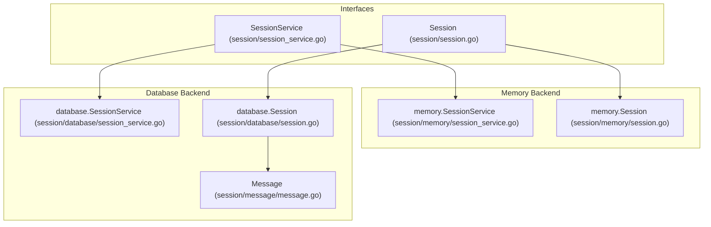
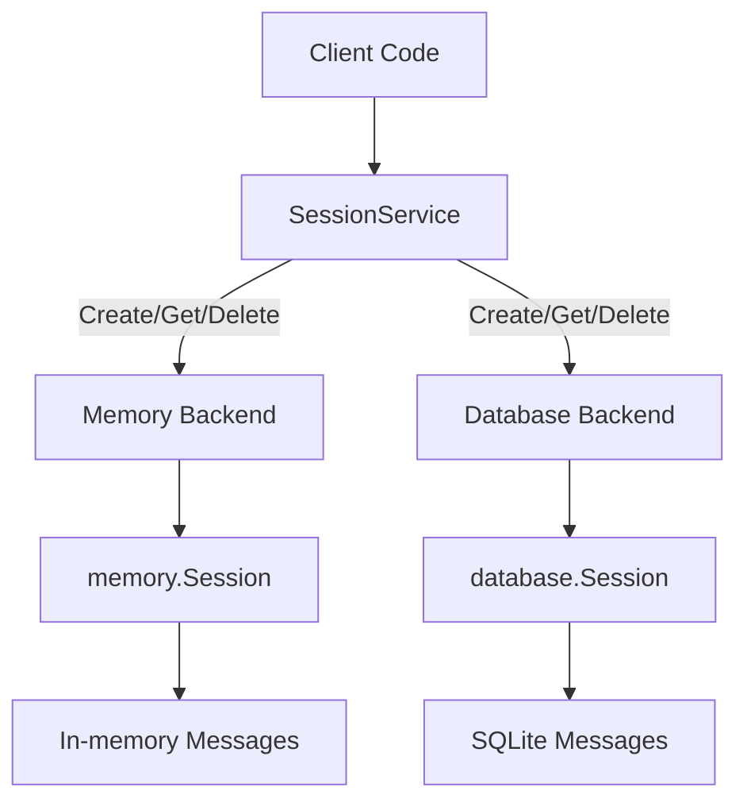
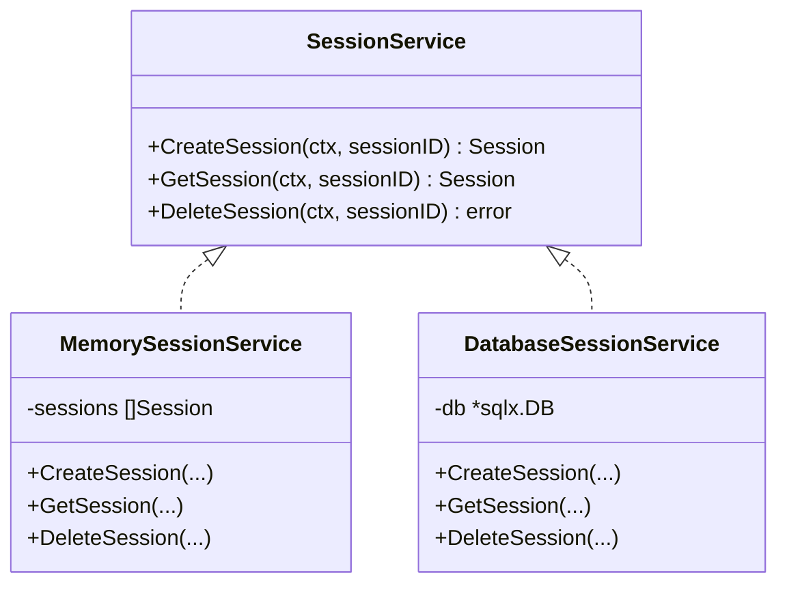
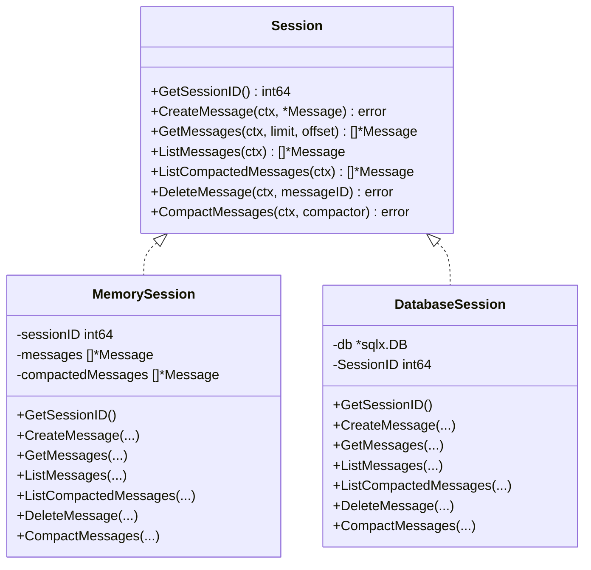
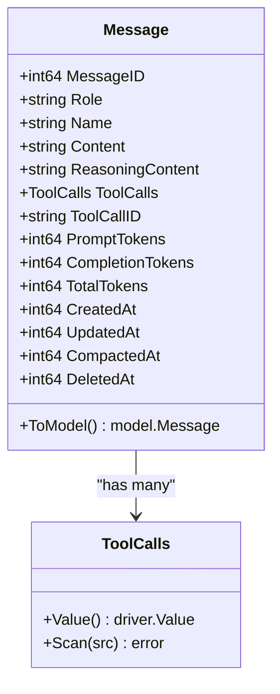
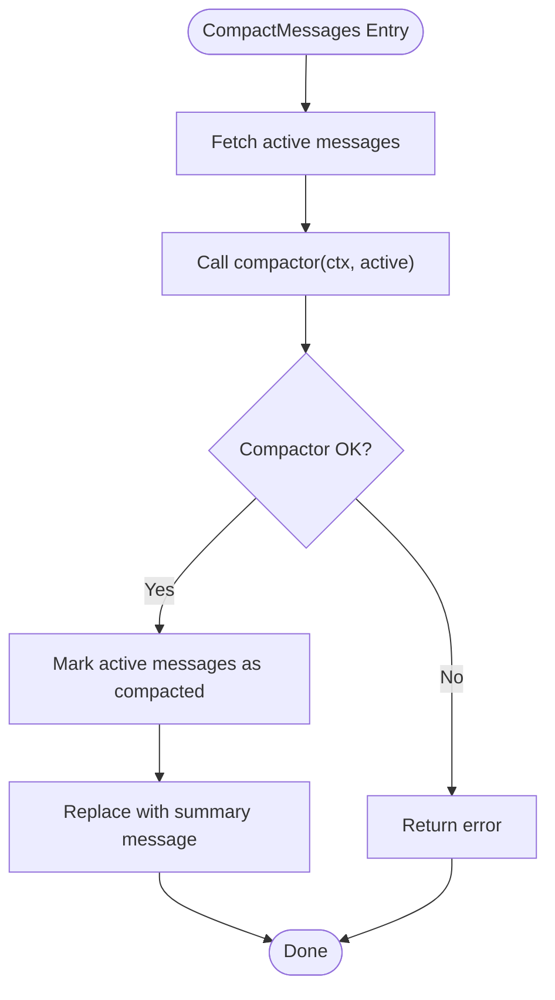
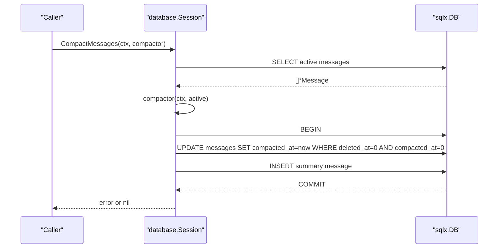
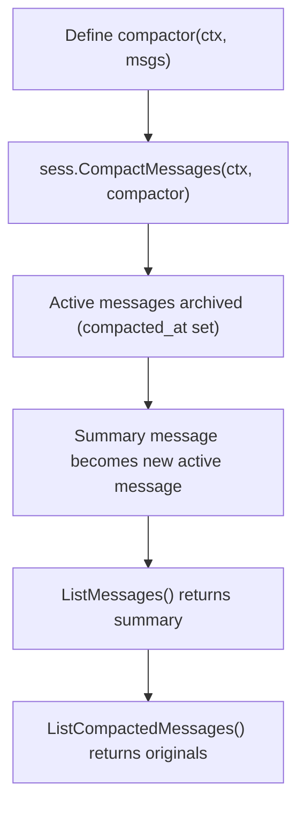
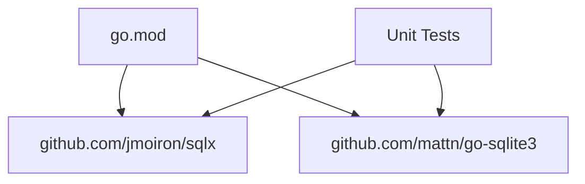

# Session Management

<cite>
**Referenced Files in This Document**
- [session.go](file://session/session.go)
- [session_service.go](file://session/session_service.go)
- [message.go](file://session/message/message.go)
- [session.go](file://session/memory/session.go)
- [session_service.go](file://session/memory/session_service.go)
- [session.go](file://session/database/session.go)
- [session_service.go](file://session/database/session_service.go)
- [session_test.go](file://session/database/session_test.go)
- [session_service_test.go](file://session/database/session_service_test.go)
- [session_service_test.go](file://session/memory/session_service_test.go)
- [main.go](file://examples/chat/main.go)
- [README.md](file://README.md)
- [go.mod](file://go.mod)
</cite>

## Table of Contents
1. [Introduction](#introduction)
2. [Project Structure](#project-structure)
3. [Core Components](#core-components)
4. [Architecture Overview](#architecture-overview)
5. [Detailed Component Analysis](#detailed-component-analysis)
6. [Dependency Analysis](#dependency-analysis)
7. [Performance Considerations](#performance-considerations)
8. [Troubleshooting Guide](#troubleshooting-guide)
9. [Conclusion](#conclusion)
10. [Appendices](#appendices)

## Introduction
This document describes the Session Management system in the ADK codebase. It covers the SessionService interface contract, dual backend architecture (memory and database), message compaction strategies, session lifecycle, pagination support, and practical usage patterns. It also addresses performance, concurrency, backups, and troubleshooting.

## Project Structure
The Session Management system is organized around a small set of interfaces and two concrete implementations:
- Interfaces define the contract for sessions and session services.
- Memory backend provides zero-config, in-memory storage suitable for testing and single-process usage.
- Database backend provides persistent storage using SQLite via SQLx.

**Diagram sources**
- [session_service.go:5-9](file://session/session_service.go#L5-L9)
- [session.go:9-23](file://session/session.go#L9-L23)
- [session_service.go:10-16](file://session/memory/session_service.go#L10-L16)
- [session.go:12-24](file://session/memory/session.go#L12-L24)
- [session_service.go:19-25](file://session/database/session_service.go#L19-L25)
- [session.go:26-32](file://session/database/session.go#L26-L32)
- [message.go:49-73](file://session/message/message.go#L49-L73)

**Section sources**
- [session.go:9-23](file://session/session.go#L9-L23)
- [session_service.go:5-9](file://session/session_service.go#L5-L9)
- [message.go:49-73](file://session/message/message.go#L49-L73)
- [session.go:12-24](file://session/memory/session.go#L12-L24)
- [session_service.go:10-16](file://session/memory/session_service.go#L10-L16)
- [session.go:26-32](file://session/database/session.go#L26-L32)
- [session_service.go:19-25](file://session/database/session_service.go#L19-L25)

## Core Components
- SessionService: Creates, retrieves, and deletes sessions.
- Session: Manages a single conversation session, including message CRUD, pagination, listing, compaction, and deletion.
- Message: The persisted representation of a conversation message, including token usage and compaction metadata.

Key capabilities:
- CRUD operations on messages with pagination support.
- Listing active vs archived (compacted) messages.
- Compaction via a pluggable compactor function that produces a summary message.
- Soft archival semantics: messages are marked archived rather than deleted.

**Section sources**
- [session_service.go:5-9](file://session/session_service.go#L5-L9)
- [session.go:9-23](file://session/session.go#L9-L23)
- [message.go:49-73](file://session/message/message.go#L49-L73)

## Architecture Overview
The system supports two backends:
- Memory backend: Stores all data in process memory; ideal for testing and single-run scenarios.
- Database backend: Uses SQLite via SQLx for persistent storage.

Both backends implement the same interfaces, enabling seamless switching between zero-config memory usage and persistent SQLite storage.

**Diagram sources**
- [session_service.go:5-9](file://session/session_service.go#L5-L9)
- [session_service.go:18-22](file://session/memory/session_service.go#L18-L22)
- [session_service.go:27-29](file://session/database/session_service.go#L27-L29)
- [session.go:18-24](file://session/memory/session.go#L18-L24)
- [session.go:34-41](file://session/database/session.go#L34-L41)

## Detailed Component Analysis

### SessionService Interface Contract
Responsibilities:
- CreateSession(ctx, sessionID) -> Session
- GetSession(ctx, sessionID) -> Session or nil
- DeleteSession(ctx, sessionID) -> error

Behavior:
- CreateSession persists a new session record and returns a Session handle.
- GetSession retrieves an existing session; returns nil if not found.
- DeleteSession marks a session as deleted (soft delete).

**Diagram sources**
- [session_service.go:5-9](file://session/session_service.go#L5-L9)
- [session_service.go:10-16](file://session/memory/session_service.go#L10-L16)
- [session_service.go:19-25](file://session/database/session_service.go#L19-L25)

**Section sources**
- [session_service.go:5-9](file://session/session_service.go#L5-L9)
- [session_service.go:18-22](file://session/memory/session_service.go#L18-L22)
- [session_service.go:27-35](file://session/database/session_service.go#L27-L35)

### Session Interface Contract
Responsibilities:
- GetSessionID(): int64
- CreateMessage(ctx, *Message) error
- GetMessages(ctx, limit, offset) []*Message
- ListMessages(ctx) []*Message
- ListCompactedMessages(ctx) []*Message
- DeleteMessage(ctx, messageID) error
- CompactMessages(ctx, compactor) error

Pagination:
- GetMessages supports limit/offset with ascending created_at ordering.
- ListMessages returns the full active history.

Archival:
- CompactMessages runs a compactor over active messages, archives them by setting a compaction timestamp, and replaces them with a summary message.

**Diagram sources**
- [session.go:9-23](file://session/session.go#L9-L23)
- [session.go:12-24](file://session/memory/session.go#L12-L24)
- [session.go:26-32](file://session/database/session.go#L26-L32)

**Section sources**
- [session.go:9-23](file://session/session.go#L9-L23)
- [session.go:18-86](file://session/memory/session.go#L18-L86)
- [session.go:34-146](file://session/database/session.go#L34-L146)

### Message Model
Fields include identity, role, content, reasoning content, tool calls, token usage, timestamps, and compaction/deletion markers. ToolCalls are stored as JSON and serialized/deserialized via sql.Valuer/sql.Scanner.

**Diagram sources**
- [message.go:49-73](file://session/message/message.go#L49-L73)
- [message.go:11-20](file://session/message/message.go#L11-L20)
- [message.go:22-47](file://session/message/message.go#L22-L47)
- [message.go:75-101](file://session/message/message.go#L75-L101)
- [message.go:103-128](file://session/message/message.go#L103-L128)

**Section sources**
- [message.go:49-73](file://session/message/message.go#L49-L73)
- [message.go:11-20](file://session/message/message.go#L11-L20)
- [message.go:22-47](file://session/message/message.go#L22-L47)
- [message.go:75-101](file://session/message/message.go#L75-L101)
- [message.go:103-128](file://session/message/message.go#L103-L128)

### Memory Backend
- In-memory storage for messages and archived messages.
- Supports CreateMessage, DeleteMessage, GetMessages (with pagination), ListMessages, ListCompactedMessages, and CompactMessages.
- Compaction stores archived messages with a compaction timestamp and replaces active messages with a summary.

**Diagram sources**
- [session.go:70-85](file://session/memory/session.go#L70-L85)

**Section sources**
- [session.go:18-86](file://session/memory/session.go#L18-L86)

### Database Backend
- Uses SQLite via SQLx with explicit queries for CRUD and compaction.
- Sessions and messages are stored in separate tables with soft-delete and soft-archive semantics.
- Compaction is transactional: updates active messages to archived, inserts the summary, and commits.

**Diagram sources**
- [session.go:97-145](file://session/database/session.go#L97-L145)

**Section sources**
- [session.go:34-146](file://session/database/session.go#L34-L146)

### Pagination Support
- GetMessages(ctx, limit, offset) returns a paginated subset of active messages ordered by created_at ascending.
- Offset beyond length returns an empty slice.
- ListMessages(ctx) returns the entire active history.

**Section sources**
- [session.go:12-17](file://session/session.go#L12-L17)
- [session.go:45-56](file://session/memory/session.go#L45-L56)
- [session.go:70-86](file://session/database/session.go#L70-L86)

### Message Iteration and History Handling
- Active messages: retrieved via GetMessages or ListMessages.
- Archived messages: retrieved via ListCompactedMessages.
- Deletion: DeleteMessage marks a message as deleted (soft delete).

**Section sources**
- [session.go:12-22](file://session/session.go#L12-L22)
- [session.go:58-68](file://session/memory/session.go#L58-L68)
- [session.go:87-95](file://session/database/session.go#L87-L95)
- [session.go:65-68](file://session/database/session.go#L65-L68)

### Practical Examples

#### Example: Chat Agent with In-Memory Session
- Demonstrates creating a session service, creating a session, and iterating over agent outputs.

**Section sources**
- [main.go:112-124](file://examples/chat/main.go#L112-L124)
- [main.go:144-162](file://examples/chat/main.go#L144-L162)

#### Example: Session Lifecycle (Memory Backend)
- Create sessions, retrieve them, and delete them.

**Section sources**
- [session_service_test.go:10-18](file://session/memory/session_service_test.go#L10-L18)
- [session_service_test.go:35-46](file://session/memory/session_service_test.go#L35-L46)
- [session_service_test.go:57-70](file://session/memory/session_service_test.go#L57-L70)

#### Example: Session Lifecycle (Database Backend)
- Create sessions, retrieve them, and delete them using SQLite.

**Section sources**
- [session_service_test.go:13-24](file://session/database/session_service_test.go#L13-L24)
- [session_service_test.go:44-58](file://session/database/session_service_test.go#L44-L58)
- [session_service_test.go:72-88](file://session/database/session_service_test.go#L72-L88)

#### Example: Pagination with Database Backend
- Demonstrates limit/offset pagination across multiple tests.

**Section sources**
- [session_test.go:118-160](file://session/database/session_test.go#L118-L160)

### Message Compaction Workflows
- Define a compactor function that accepts active messages and returns a summary message.
- Call CompactMessages on the session.
- Retrieve archived messages via ListCompactedMessages.

**Diagram sources**
- [session.go:22-22](file://session/session.go#L22-L22)
- [session.go:97-145](file://session/database/session.go#L97-L145)
- [session.go:70-85](file://session/memory/session.go#L70-L85)

**Section sources**
- [README.md:212-230](file://README.md#L212-L230)

## Dependency Analysis
External dependencies relevant to session management:
- SQLx for database operations.
- sqlite3 driver for SQLite.
- Testing framework for unit tests.

**Diagram sources**
- [go.mod:5-15](file://go.mod#L5-L15)

**Section sources**
- [go.mod:5-15](file://go.mod#L5-L15)

## Performance Considerations
- Memory backend:
  - O(n) operations for message retrieval and deletion; suitable for small histories.
  - No disk I/O overhead.
- Database backend:
  - Index-friendly queries with ORDER BY created_at and LIMIT/OFFSET.
  - Transactional compaction ensures atomicity but may block writes during the operation.
  - Consider vacuuming or reindexing periodically if long-running sessions accumulate many archived messages.

[No sources needed since this section provides general guidance]

## Troubleshooting Guide
Common issues and resolutions:
- Session not found:
  - GetSession returns nil when not found; ensure CreateSession was called and the sessionID is correct.
- Compaction failures:
  - Verify the compactor function returns a valid summary message and handles errors appropriately.
- Pagination confusion:
  - GetMessages uses ascending created_at; ensure limit/offset align with expectations.
- Deleting messages:
  - DeleteMessage performs a soft delete; confirm DeletedAt semantics if querying directly.

**Section sources**
- [session_service.go:37-48](file://session/database/session_service.go#L37-L48)
- [session.go:65-68](file://session/database/session.go#L65-L68)
- [session.go:70-86](file://session/database/session.go#L70-L86)

## Conclusion
The Session Management system provides a clean, provider-agnostic abstraction for conversation history with two interchangeable backends. The memory backend enables zero-config usage for testing, while the database backend offers persistence. Compaction supports soft archival and summarization, preserving historical context without losing performance.

[No sources needed since this section summarizes without analyzing specific files]

## Appendices

### Migration Strategies
- From memory to database:
  - Persist active messages to the database after compaction.
  - Use ListMessages and ListCompactedMessages to export all history.
  - Import into the database backend and recreate sessions.
- Versioning:
  - Add schema migrations if Message schema evolves; preserve backward compatibility for archived messages.

[No sources needed since this section provides general guidance]

### Concurrency Considerations
- Memory backend:
  - Not safe for concurrent access; use a single goroutine per session or synchronize externally.
- Database backend:
  - SQLx operations are safe; transactions wrap compaction to maintain consistency.
  - Use connection pooling and appropriate isolation levels for multi-writer scenarios.

[No sources needed since this section provides general guidance]

### Backup Procedures
- Database backend:
  - Back up the SQLite file regularly.
  - Use transactions to minimize inconsistency windows during backups.
- Memory backend:
  - Export active and archived messages periodically and store off-process.

[No sources needed since this section provides general guidance]