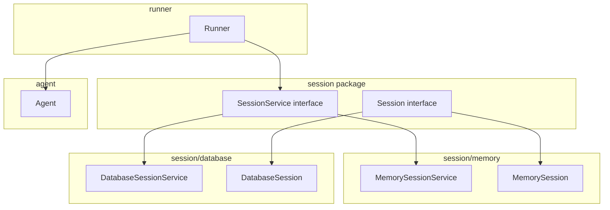
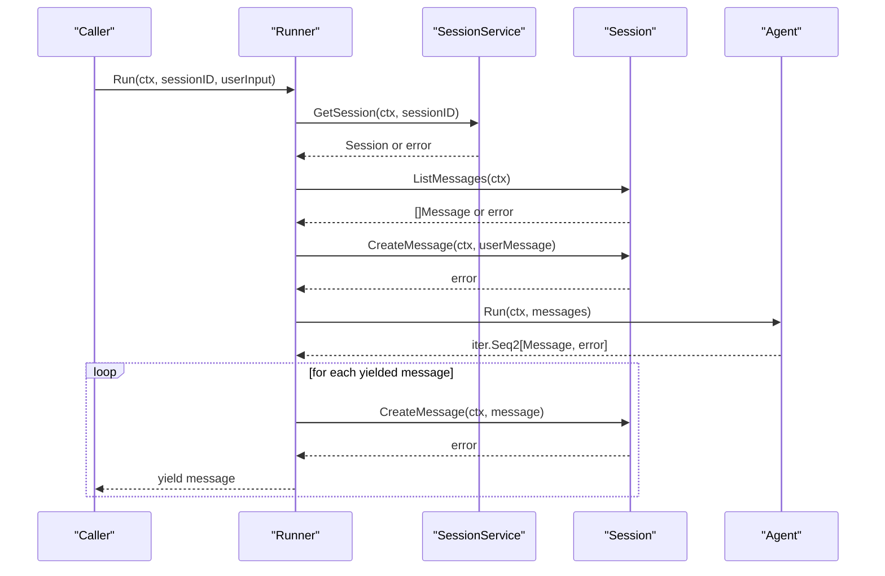
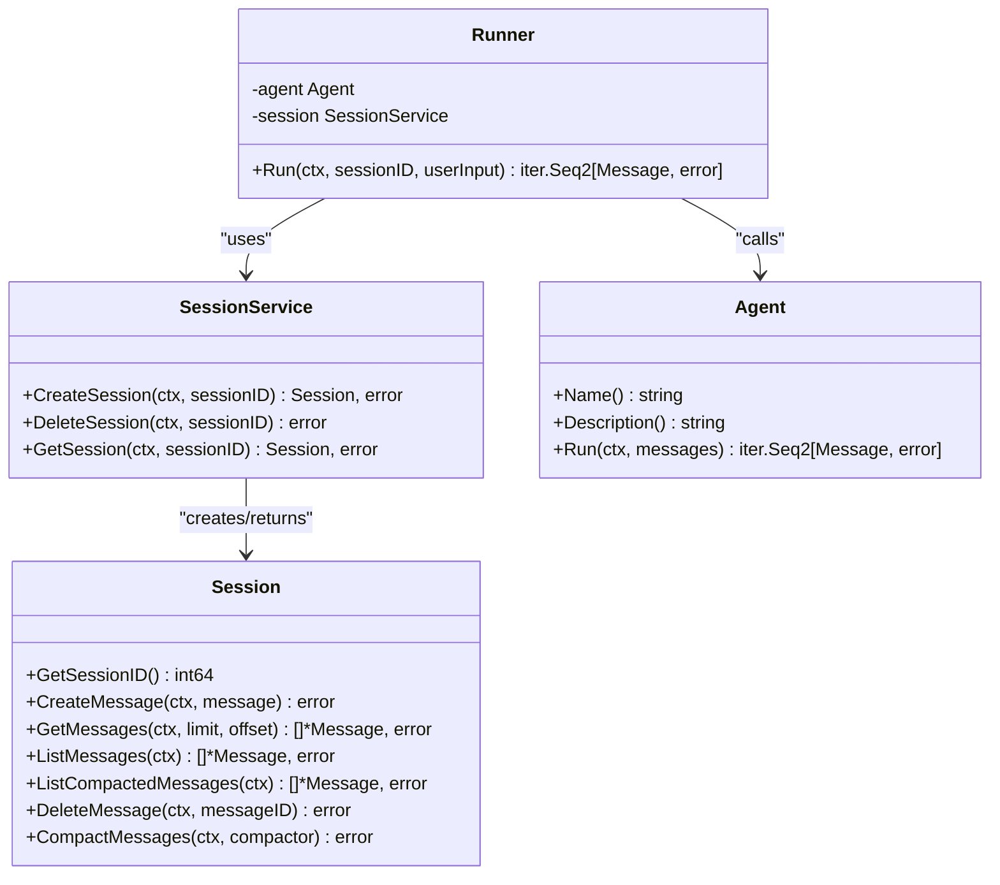
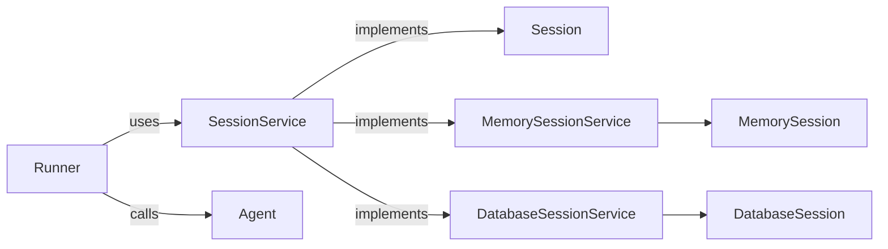

# Session Service Interface

<cite>
**Referenced Files in This Document**
- [session.go](file://session/session.go)
- [session_service.go](file://session/session_service.go)
- [session_service.go](file://session/database/session_service.go)
- [session.go](file://session/database/session.go)
- [session_service.go](file://session/memory/session_service.go)
- [session.go](file://session/memory/session.go)
- [runner.go](file://runner/runner.go)
- [agent.go](file://agent/agent.go)
- [message.go](file://session/message/message.go)
- [main.go](file://examples/chat/main.go)
- [README.md](file://README.md)
</cite>

## Table of Contents
1. [Introduction](#introduction)
2. [Project Structure](#project-structure)
3. [Core Components](#core-components)
4. [Architecture Overview](#architecture-overview)
5. [Detailed Component Analysis](#detailed-component-analysis)
6. [Dependency Analysis](#dependency-analysis)
7. [Performance Considerations](#performance-considerations)
8. [Troubleshooting Guide](#troubleshooting-guide)
9. [Conclusion](#conclusion)

## Introduction
This document specifies the SessionService interface contract and the Session interface that underpin conversation state management in the system. It documents the core methods, parameters, return values, error handling patterns, and context-based design. It also explains the role of SessionService and Session in the overall architecture, focusing on their relationships with Runner and Agent, lifecycle management best practices, thread-safety considerations, dependency injection patterns, and testing strategies.

## Project Structure
The session-related components are organized into:
- Core interfaces in the session package
- Two concrete implementations: in-memory and database-backed
- Supporting message types for persistence
- Integration points with Runner and Agent

**Diagram sources**
- [session_service.go:1-10](file://session/session_service.go#L1-L10)
- [session.go:1-24](file://session/session.go#L1-L24)
- [session_service.go:1-41](file://session/memory/session_service.go#L1-L41)
- [session.go:1-86](file://session/memory/session.go#L1-L86)
- [session_service.go:1-49](file://session/database/session_service.go#L1-L49)
- [session.go:1-146](file://session/database/session.go#L1-L146)
- [runner.go:1-102](file://runner/runner.go#L1-L102)
- [agent.go:1-18](file://agent/agent.go#L1-L18)

**Section sources**
- [README.md:65-82](file://README.md#L65-L82)
- [session_service.go:1-10](file://session/session_service.go#L1-L10)
- [session.go:1-24](file://session/session.go#L1-L24)

## Core Components
This section defines the interface contracts and their responsibilities.

- SessionService interface
  - CreateSession(ctx, sessionID): returns a Session and an error
  - DeleteSession(ctx, sessionID): returns an error
  - GetSession(ctx, sessionID): returns a Session and an error
  - Context usage: all methods accept a context for cancellation and deadlines
  - Error handling pattern: methods return errors; GetSession returns nil when not found

- Session interface
  - GetSessionID(): returns the session identifier
  - CreateMessage(ctx, message): persists a message; returns an error
  - GetMessages(ctx, limit, offset): paginated retrieval of active messages; returns a slice and an error
  - ListMessages(ctx): retrieves all active messages; returns a slice and an error
  - ListCompactedMessages(ctx): retrieves archived messages; returns a slice and an error
  - DeleteMessage(ctx, messageID): deletes a message; returns an error
  - CompactMessages(ctx, compactor): archives active messages and inserts a summary; returns an error

Implementation notes:
- Both memory and database backends implement these contracts consistently.
- The database backend uses transactions for atomic compaction.
- The memory backend maintains separate slices for active and archived messages.

**Section sources**
- [session_service.go:5-9](file://session/session_service.go#L5-L9)
- [session.go:9-23](file://session/session.go#L9-L23)
- [session_service.go:14-41](file://session/memory/session_service.go#L14-L41)
- [session.go:12-86](file://session/memory/session.go#L12-L86)
- [session_service.go:19-49](file://session/database/session_service.go#L19-L49)
- [session.go:26-146](file://session/database/session.go#L26-L146)

## Architecture Overview
SessionService and Session mediate between Runner and Agent:
- Runner is stateful and owns the session; it loads history, appends user input, persists agent/tool outputs, and streams results.
- Agent is stateless and produces messages in response to provided conversation history.
- SessionService abstracts storage so Runner can operate against either in-memory or persistent backends.

**Diagram sources**
- [runner.go:44-90](file://runner/runner.go#L44-L90)
- [session_service.go:5-9](file://session/session_service.go#L5-L9)
- [session.go:9-23](file://session/session.go#L9-L23)
- [agent.go:10-17](file://agent/agent.go#L10-L17)

**Section sources**
- [runner.go:17-24](file://runner/runner.go#L17-L24)
- [runner.go:44-90](file://runner/runner.go#L44-L90)
- [README.md:35-62](file://README.md#L35-L62)

## Detailed Component Analysis

### SessionService Interface Contract
- CreateSession(ctx, sessionID)
  - Purpose: Initialize a new session with the given identifier.
  - Parameters: ctx, sessionID (int64)
  - Returns: Session, error
  - Behavior: Returns a new Session instance; errors indicate storage failures.
  - Example usage: See [session_service_test.go:13-24](file://session/database/session_service_test.go#L13-L24) and [session_service_test.go:10-18](file://session/memory/session_service_test.go#L10-L18).

- DeleteSession(ctx, sessionID)
  - Purpose: Soft-delete or remove a session’s state.
  - Parameters: ctx, sessionID (int64)
  - Returns: error
  - Behavior: Idempotent; no error if session does not exist.
  - Example usage: See [session_service_test.go:72-99](file://session/database/session_service_test.go#L72-L99) and [session_service_test.go:57-78](file://session/memory/session_service_test.go#L57-L78).

- GetSession(ctx, sessionID)
  - Purpose: Retrieve an existing session.
  - Parameters: ctx, sessionID (int64)
  - Returns: Session, error
  - Behavior: Returns nil, nil if not found; otherwise returns a Session instance.
  - Example usage: See [session_service_test.go:44-70](file://session/database/session_service_test.go#L44-L70) and [session_service_test.go:35-55](file://session/memory/session_service_test.go#L35-L55).

Error handling patterns:
- Propagate underlying storage errors (e.g., database errors).
- Treat “not found” as a successful nil return for GetSession.
- Ensure context cancellation/timeout is respected by storage operations.

**Section sources**
- [session_service.go:5-9](file://session/session_service.go#L5-L9)
- [session_service.go:27-48](file://session/database/session_service.go#L27-L48)
- [session_service.go:18-40](file://session/memory/session_service.go#L18-L40)
- [session_service_test.go:44-70](file://session/database/session_service_test.go#L44-L70)
- [session_service_test.go:35-55](file://session/memory/session_service_test.go#L35-L55)

### Session Interface Contract
- GetSessionID()
  - Purpose: Identity of the session.
  - Returns: int64
  - Example usage: See [session_test.go:351-364](file://session/database/session_test.go#L351-L364) and [session_test.go:222-237](file://session/memory/session_test.go#L222-L237).

- CreateMessage(ctx, message)
  - Purpose: Persist a message to the session.
  - Parameters: ctx, message (*Message)
  - Returns: error
  - Notes: MessageID and timestamps are managed by the caller before persistence (Runner sets these).
  - Example usage: See [runner.go:94-101](file://runner/runner.go#L94-L101) and tests in [session_test.go:63-84](file://session/database/session_test.go#L63-L84) and [session_test.go:23-39](file://session/memory/session_test.go#L23-L39).

- GetMessages(ctx, limit, offset)
  - Purpose: Paginated retrieval of active messages ordered by creation time.
  - Parameters: ctx, limit (int64), offset (int64)
  - Returns: []*Message, error
  - Example usage: See [session_test.go:118-160](file://session/database/session_test.go#L118-L160) and [session_test.go:88-126](file://session/memory/session_test.go#L88-L126).

- ListMessages(ctx)
  - Purpose: Retrieve all active messages.
  - Parameters: ctx
  - Returns: []*Message, error
  - Example usage: See [runner.go:53-62](file://runner/runner.go#L53-L62) and tests in [session_test.go:268-287](file://session/database/session_test.go#L268-L287) and [session_test.go:222-237](file://session/memory/session_test.go#L222-L237).

- ListCompactedMessages(ctx)
  - Purpose: Retrieve archived messages.
  - Parameters: ctx
  - Returns: []*Message, error
  - Example usage: See [session_test.go:289-306](file://session/database/session_test.go#L289-L306) and [session_test.go:239-253](file://session/memory/session_test.go#L239-L253).

- DeleteMessage(ctx, messageID)
  - Purpose: Delete a message (soft-delete semantics in database).
  - Parameters: ctx, messageID (int64)
  - Returns: error
  - Example usage: See [session_test.go:86-116](file://session/database/session_test.go#L86-L116) and [session_test.go:41-86](file://session/memory/session_test.go#L41-L86).

- CompactMessages(ctx, compactor)
  - Purpose: Archive active messages and insert a summary; supports multiple rounds.
  - Parameters: ctx, compactor (func(ctx, []*Message) (*Message, error))
  - Returns: error
  - Notes: Database backend uses a transaction; compactor error prevents archival.
  - Example usage: See [session_test.go:162-205](file://session/database/session_test.go#L162-L205) and [session_test.go:128-167](file://session/memory/session_test.go#L128-L167).

**Section sources**
- [session.go:9-23](file://session/session.go#L9-L23)
- [session.go:14-146](file://session/database/session.go#L14-L146)
- [session.go:12-86](file://session/memory/session.go#L12-L86)
- [runner.go:53-101](file://runner/runner.go#L53-L101)

### Implementation Variants

#### Memory Backend
- MemorySessionService
  - Stores sessions in-memory; suitable for testing and single-process scenarios.
  - Thread-safety: Not safe for concurrent access; external synchronization is required if used concurrently.
  - Example usage: See [main.go:113-123](file://examples/chat/main.go#L113-L123).

- MemorySession
  - Maintains separate slices for active and archived messages.
  - Supports pagination via slicing.

**Section sources**
- [session_service.go:14-41](file://session/memory/session_service.go#L14-L41)
- [session.go:12-86](file://session/memory/session.go#L12-L86)
- [main.go:113-123](file://examples/chat/main.go#L113-L123)

#### Database Backend
- DatabaseSessionService
  - Uses SQLx with SQLite; supports soft deletion and compaction.
  - Thread-safety: Depends on the underlying DB connection; ensure proper concurrency controls at the application level.

- DatabaseSession
  - Uses transactions for atomic compaction.
  - Enforces non-negative offsets and bounds for pagination.

**Section sources**
- [session_service.go:19-49](file://session/database/session_service.go#L19-L49)
- [session.go:26-146](file://session/database/session.go#L26-L146)

### Context-Based Design Patterns
- Cancellation and timeouts: All methods accept a context; storage operations should honor context cancellation.
- Deadline propagation: Use context.WithTimeout/WithDeadline around long-running operations (e.g., compaction).
- Request-scoped tracing: Attach correlation IDs to context for observability.

**Section sources**
- [session_service.go:5-9](file://session/session_service.go#L5-L9)
- [session.go:9-23](file://session/session.go#L9-L23)
- [runner.go:44-90](file://runner/runner.go#L44-L90)

### Thread Safety Considerations
- MemorySessionService and MemorySession are not thread-safe; protect shared state with mutexes or by isolating access to a single goroutine.
- DatabaseSessionService delegates concurrency to the underlying sqlx.DB; ensure appropriate pooling and isolation levels.
- Runner orchestrates a single conversation turn per call; concurrent runs should use distinct sessionIDs.

**Section sources**
- [session_service.go:10-16](file://session/memory/session_service.go#L10-L16)
- [session.go:12-16](file://session/memory/session.go#L12-L16)
- [runner.go:44-90](file://runner/runner.go#L44-L90)

### Dependency Injection Patterns
- Inject SessionService into Runner during construction.
- Use constructor helpers (NewMemorySessionService, NewDatabaseSessionService) to provide interchangeable backends.
- Example DI usage: See [main.go:119-123](file://examples/chat/main.go#L119-L123).

**Section sources**
- [runner.go:26-37](file://runner/runner.go#L26-L37)
- [session_service.go:14-16](file://session/memory/session_service.go#L14-L16)
- [session_service.go:23-25](file://session/database/session_service.go#L23-L25)
- [main.go:113-123](file://examples/chat/main.go#L113-L123)

### Testing Strategies
- Unit tests for SessionService:
  - Full workflow: create, get, delete, verify absence after deletion.
  - Not-found cases: GetSession returns nil; DeleteSession is idempotent.
  - Example coverage: [session_service_test.go:13-133](file://session/database/session_service_test.go#L13-L133), [session_service_test.go:10-109](file://session/memory/session_service_test.go#L10-L109).

- Unit tests for Session:
  - CRUD operations: CreateMessage, GetMessages, ListMessages, DeleteMessage.
  - Compaction: Single round, empty input, callback error, multiple rounds.
  - Example coverage: [session_test.go:63-364](file://session/database/session_test.go#L63-L364), [session_test.go:23-293](file://session/memory/session_test.go#L23-L293).

- Integration tests:
  - Runner end-to-end: load history, append user input, stream agent/tool outputs, persist each message.
  - Example usage: [runner.go:44-90](file://runner/runner.go#L44-L90).

**Section sources**
- [session_service_test.go:13-133](file://session/database/session_service_test.go#L13-L133)
- [session_service_test.go:10-109](file://session/memory/session_service_test.go#L10-L109)
- [session_test.go:63-364](file://session/database/session_test.go#L63-L364)
- [session_test.go:23-293](file://session/memory/session_test.go#L23-L293)
- [runner.go:44-90](file://runner/runner.go#L44-L90)

### Relationship Between SessionService, Runner, and Agent
- Runner depends on SessionService to manage conversation state and on Agent to produce messages.
- Runner loads active messages, appends user input, persists it, then streams agent/tool outputs while persisting each.
- Agent is stateless and receives the full conversation history for each turn.

**Diagram sources**
- [session_service.go:5-9](file://session/session_service.go#L5-L9)
- [session.go:9-23](file://session/session.go#L9-L23)
- [runner.go:20-24](file://runner/runner.go#L20-L24)
- [agent.go:10-17](file://agent/agent.go#L10-L17)

**Section sources**
- [runner.go:17-24](file://runner/runner.go#L17-L24)
- [runner.go:44-90](file://runner/runner.go#L44-L90)
- [agent.go:10-17](file://agent/agent.go#L10-L17)

### Practical Examples
- Creating a session and running a turn:
  - See [main.go:113-123](file://examples/chat/main.go#L113-L123) for constructing a session service and runner, and [main.go:144-162](file://examples/chat/main.go#L144-L162) for iterating over streamed results.

- Using database vs memory backends:
  - Memory: [main.go:113-117](file://examples/chat/main.go#L113-L117)
  - Database: Use NewDatabaseSessionService with a configured DB connection.

**Section sources**
- [main.go:113-123](file://examples/chat/main.go#L113-L123)
- [main.go:144-162](file://examples/chat/main.go#L144-L162)

## Dependency Analysis
- Cohesion: SessionService and Session encapsulate storage concerns; Runner composes them with Agent.
- Coupling: Runner depends on SessionService and Agent; SessionService implementations depend on storage backends.
- External dependencies: Database backend uses sqlx and sqlite3; memory backend uses slices.

**Diagram sources**
- [runner.go:20-24](file://runner/runner.go#L20-L24)
- [session_service.go:5-9](file://session/session_service.go#L5-L9)
- [session_service.go:14-16](file://session/memory/session_service.go#L14-L16)
- [session_service.go:23-25](file://session/database/session_service.go#L23-L25)
- [session.go:12-16](file://session/memory/session.go#L12-L16)
- [session.go:26-32](file://session/database/session.go#L26-L32)

**Section sources**
- [runner.go:20-24](file://runner/runner.go#L20-L24)
- [session_service.go:5-9](file://session/session_service.go#L5-L9)

## Performance Considerations
- Pagination: Use GetMessages with appropriate limit/offset to avoid loading large histories.
- Compaction: Periodically compact active messages to reduce payload sizes and improve retrieval performance.
- Concurrency: For memory backend, serialize access to prevent contention; for database backend, tune connection pooling.
- Streaming: Runner streams outputs via iter.Seq2 to minimize latency and memory footprint.

[No sources needed since this section provides general guidance]

## Troubleshooting Guide
Common issues and resolutions:
- Session not found
  - Symptom: GetSession returns nil.
  - Cause: Session was never created or was deleted.
  - Resolution: Ensure CreateSession is called before use; verify sessionID correctness.

- Persistence errors
  - Symptom: CreateMessage returns an error.
  - Cause: Storage failure or invalid message fields.
  - Resolution: Validate message fields (MessageID, timestamps) before persistence; check storage connectivity.

- Compaction failures
  - Symptom: Compaction returns an error; active messages remain unchanged.
  - Cause: Compactor callback error or transaction failure.
  - Resolution: Fix compactor logic; ensure database availability; re-run compaction after correction.

- Concurrency problems
  - Symptom: Data races or inconsistent state.
  - Cause: Concurrent access to memory backend without synchronization.
  - Resolution: Use mutexes or isolate access; prefer database backend for multi-goroutine scenarios.

**Section sources**
- [session_service.go:37-48](file://session/database/session_service.go#L37-L48)
- [session.go:97-146](file://session/database/session.go#L97-L146)
- [session.go:70-85](file://session/memory/session.go#L70-L85)

## Conclusion
The SessionService and Session interfaces define a clean contract for managing conversation state. They enable pluggable storage backends, support context-aware operations, and integrate seamlessly with Runner and Agent. By following the documented patterns—proper error propagation, lifecycle management, dependency injection, and testing—you can build robust, maintainable conversational agents with predictable state behavior.