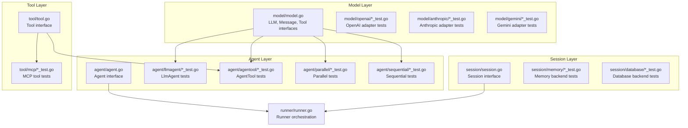
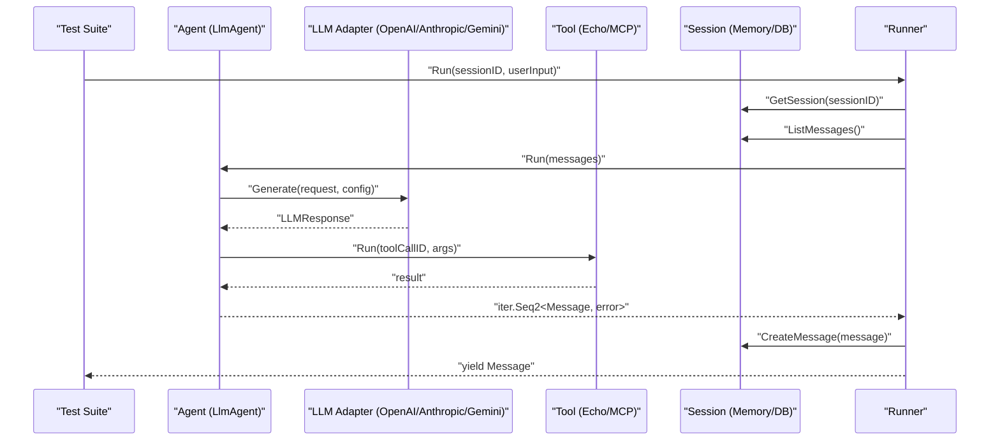
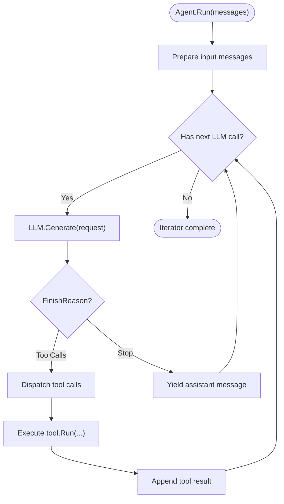
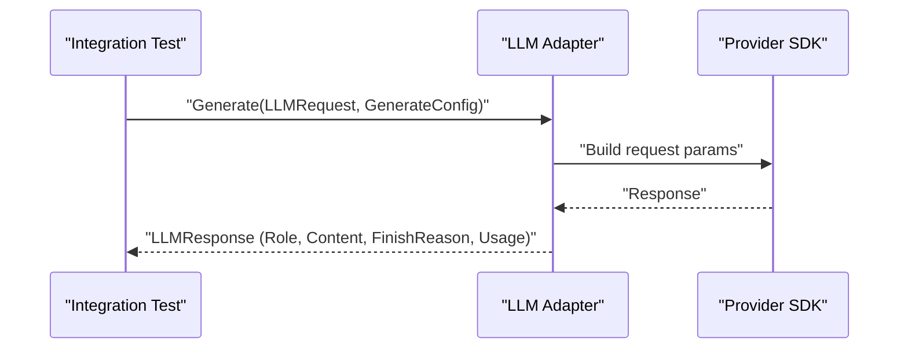
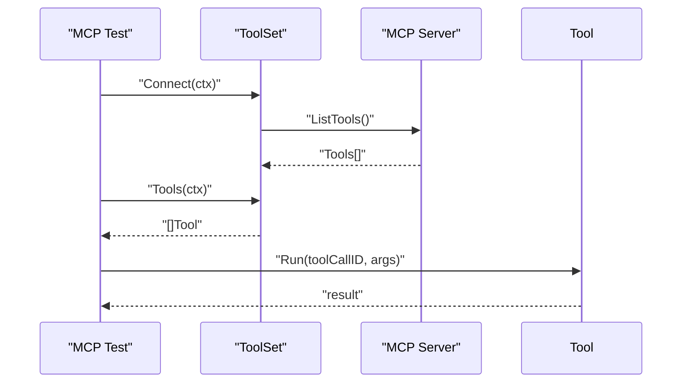
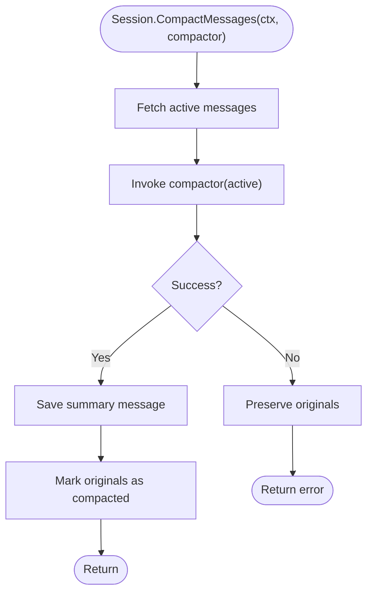
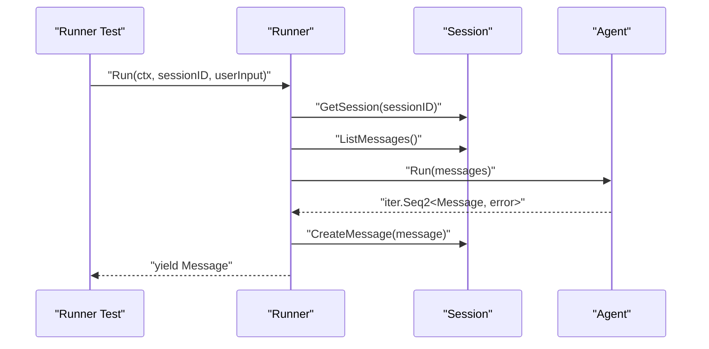
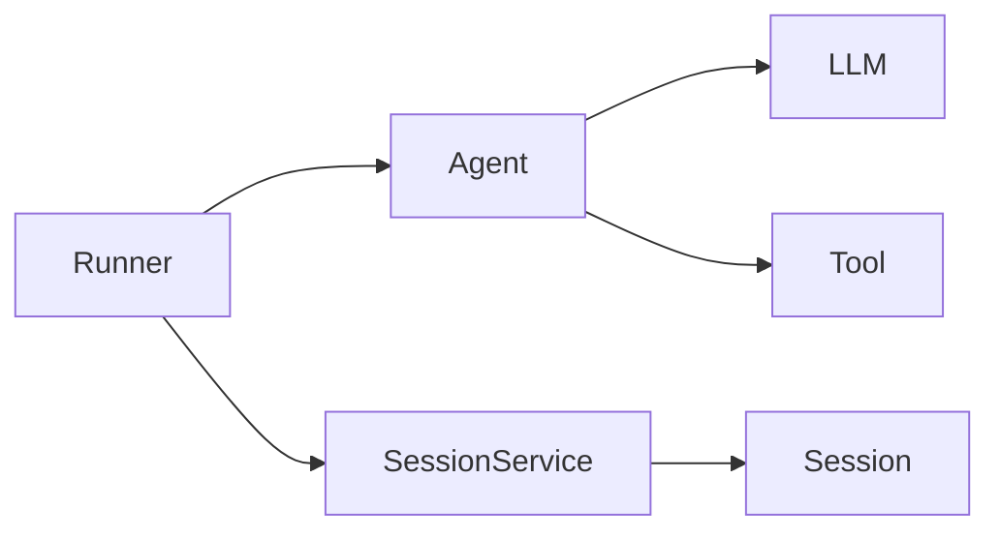

# Testing & Quality Assurance

<cite>
**Referenced Files in This Document**
- [README.md](file://README.md)
- [agent.go](file://agent/agent.go)
- [llmagent_test.go](file://agent/llmagent/llmagent_test.go)
- [agentool_test.go](file://agent/agentool/agentool_test.go)
- [parallel_test.go](file://agent/parallel/parallel_test.go)
- [sequential_test.go](file://agent/sequential/sequential_test.go)
- [model.go](file://model/model.go)
- [openai_test.go](file://model/openai/openai_test.go)
- [anthropic_test.go](file://model/anthropic/anthropic_test.go)
- [gemini_test.go](file://model/gemini/gemini_test.go)
- [session.go](file://session/session.go)
- [session_test.go](file://session/memory/session_test.go)
- [session_service_test.go](file://session/memory/session_service_test.go)
- [session_test.go](file://session/database/session_test.go)
- [session_service_test.go](file://session/database/session_service_test.go)
- [tool.go](file://tool/tool.go)
- [mcp_test.go](file://tool/mcp/mcp_test.go)
- [runner.go](file://runner/runner.go)
</cite>

## Table of Contents
1. [Introduction](#introduction)
2. [Project Structure](#project-structure)
3. [Core Components](#core-components)
4. [Architecture Overview](#architecture-overview)
5. [Detailed Component Analysis](#detailed-component-analysis)
6. [Dependency Analysis](#dependency-analysis)
7. [Performance Considerations](#performance-considerations)
8. [Troubleshooting Guide](#troubleshooting-guide)
9. [Conclusion](#conclusion)
10. [Appendices](#appendices)

## Introduction
This document consolidates testing and quality assurance strategies for the ADK codebase. It covers unit testing approaches for interfaces, mock implementations, and integration testing patterns. It explains testing strategies for major components (agents, tools, LLM providers, and session backends), and provides guidance for performance testing, concurrency, error handling, streaming behavior, test organization, fixtures, continuous integration setup, and maintaining coverage across framework upgrades.

## Project Structure
The repository is organized around cohesive packages that align with testing responsibilities:
- agent: core agent interfaces and orchestrators (LlmAgent, AgentTool, Parallel, Sequential)
- model: provider-agnostic LLM interface and message types
- session: session and session-service interfaces with in-memory and database backends
- tool: tool interface and built-in tools
- runner: composes agents and sessions
- internal/snowflake: distributed ID generation used by runner

**Diagram sources**
- [agent.go:10-17](file://agent/agent.go#L10-L17)
- [model.go:9-13](file://model/model.go#L9-L13)
- [session.go:9-23](file://session/session.go#L9-L23)
- [tool.go:17-23](file://tool/tool.go#L17-L23)
- [runner.go:20-37](file://runner/runner.go#L20-L37)

**Section sources**
- [README.md:65-82](file://README.md#L65-L82)

## Core Components
- Agent interface: Defines the contract for agents that stream model outputs and tool results.
- LLM interface: Provider-agnostic abstraction for model calls with configurable generation parameters.
- Session and SessionService: Abstractions for message persistence and retrieval, with in-memory and database implementations.
- Tool interface: Abstraction for tools that agents can call, with JSON schema definitions.
- Runner: Wires agents and sessions, persists messages, and streams outputs.

These components are the primary targets for unit and integration tests, with mocks and fakes used to isolate behavior and validate cross-cutting concerns like streaming, concurrency, and error propagation.

**Section sources**
- [agent.go:10-17](file://agent/agent.go#L10-L17)
- [model.go:9-13](file://model/model.go#L9-L13)
- [session.go:9-23](file://session/session.go#L9-L23)
- [tool.go:17-23](file://tool/tool.go#L17-L23)
- [runner.go:20-37](file://runner/runner.go#L20-L37)

## Architecture Overview
The testing architecture mirrors the codebase’s layered design. Unit tests rely on deterministic mocks for LLMs and tools. Integration tests exercise real providers (OpenAI, Anthropic, Gemini) and real MCP servers when credentials are available. Session tests validate both in-memory and database backends.

**Diagram sources**
- [runner.go:44-90](file://runner/runner.go#L44-L90)
- [llmagent_test.go:95-113](file://agent/llmagent/llmagent_test.go#L95-L113)
- [openai_test.go:208-223](file://model/openai/openai_test.go#L208-L223)

## Detailed Component Analysis

### Agent Testing Strategies
- Deterministic mocks: Implement provider-agnostic LLMs that replay predefined responses to validate agent loops, tool-call handling, and reasoning content propagation.
- Streaming behavior: Validate that agents yield messages incrementally and that callers can break early without leaking resources.
- Error propagation: Ensure that errors from underlying agents or tools are propagated and that the iterator stops cleanly.
- Concurrency: ParallelAgent tests verify true concurrency using blocking mocks and readiness gates.

**Diagram sources**
- [llmagent_test.go:95-113](file://agent/llmagent/llmagent_test.go#L95-L113)
- [parallel_test.go:196-256](file://agent/parallel/parallel_test.go#L196-L256)

**Section sources**
- [llmagent_test.go:57-74](file://agent/llmagent/llmagent_test.go#L57-L74)
- [llmagent_test.go:241-337](file://agent/llmagent/llmagent_test.go#L241-L337)
- [parallel_test.go:196-256](file://agent/parallel/parallel_test.go#L196-L256)
- [sequential_test.go:176-230](file://agent/sequential/sequential_test.go#L176-L230)

### LLM Provider Testing Patterns
- Unit tests validate conversion logic between model types and provider-specific SDK types, finish reason mapping, and configuration application (e.g., temperature, reasoning effort, enable thinking).
- Integration tests exercise real providers when credentials are present, validating end-to-end tool-calling loops and reasoning content behavior.

**Diagram sources**
- [openai_test.go:208-223](file://model/openai/openai_test.go#L208-L223)
- [anthropic_test.go:250-267](file://model/anthropic/anthropic_test.go#L250-L267)
- [gemini_test.go:315-332](file://model/gemini/gemini_test.go#L315-L332)

**Section sources**
- [openai_test.go:67-84](file://model/openai/openai_test.go#L67-L84)
- [openai_test.go:135-185](file://model/openai/openai_test.go#L135-L185)
- [anthropic_test.go:60-77](file://model/anthropic/anthropic_test.go#L60-L77)
- [gemini_test.go:88-107](file://model/gemini/gemini_test.go#L88-L107)
- [gemini_test.go:234-291](file://model/gemini/gemini_test.go#L234-L291)

### Tool Testing Approaches
- Built-in tools: Validate tool definitions and execution paths.
- MCP tools: Connect to MCP servers (e.g., Exa) and verify tool discovery and execution when credentials are configured.

**Diagram sources**
- [mcp_test.go:44-100](file://tool/mcp/mcp_test.go#L44-L100)

**Section sources**
- [mcp_test.go:44-100](file://tool/mcp/mcp_test.go#L44-L100)

### Session Backend Testing
- In-memory backend: Validates CRUD operations, pagination, compaction, and archival semantics.
- Database backend: Uses an in-memory SQLite database to validate persistence, compaction, and multi-round compaction workflows.

**Diagram sources**
- [session_test.go:128-167](file://session/memory/session_test.go#L128-L167)
- [session_test.go:162-205](file://session/database/session_test.go#L162-L205)

**Section sources**
- [session_test.go:23-86](file://session/memory/session_test.go#L23-L86)
- [session_test.go:128-167](file://session/memory/session_test.go#L128-L167)
- [session_service_test.go:10-110](file://session/memory/session_service_test.go#L10-L110)
- [session_test.go:63-116](file://session/database/session_test.go#L63-L116)
- [session_test.go:162-205](file://session/database/session_test.go#L162-L205)
- [session_service_test.go:13-163](file://session/database/session_service_test.go#L13-L163)

### Runner Testing
- Validates end-to-end orchestration: loading history, appending user input, invoking agent, persisting messages, and yielding results.
- Uses Snowflake IDs and timestamps to ensure deterministic persistence ordering.

**Diagram sources**
- [runner.go:44-90](file://runner/runner.go#L44-L90)

**Section sources**
- [runner.go:44-101](file://runner/runner.go#L44-L101)

## Dependency Analysis
- Agent depends on LLM and Tool abstractions; Runner depends on Agent and SessionService.
- Tests isolate dependencies using mocks and fakes, ensuring minimal coupling and high cohesion.
- External dependencies (provider SDKs, SQLite, MCP SDK) are only used in integration tests and are gated by environment variables.

**Diagram sources**
- [agent.go:10-17](file://agent/agent.go#L10-L17)
- [model.go:9-13](file://model/model.go#L9-L13)
- [tool.go:17-23](file://tool/tool.go#L17-L23)
- [runner.go:20-37](file://runner/runner.go#L20-L37)
- [session.go:9-23](file://session/session.go#L9-L23)

**Section sources**
- [agent.go:10-17](file://agent/agent.go#L10-L17)
- [model.go:9-13](file://model/model.go#L9-L13)
- [tool.go:17-23](file://tool/tool.go#L17-L23)
- [runner.go:20-37](file://runner/runner.go#L20-L37)
- [session.go:9-23](file://session/session.go#L9-L23)

## Performance Considerations
- Streaming and iteration: Tests demonstrate that agents yield messages incrementally; ensure producers and consumers handle backpressure and early termination gracefully.
- Concurrency: ParallelAgent tests validate true concurrency using blocking mocks and readiness channels; use similar patterns to validate throughput and latency under load.
- Memory usage: Session compaction tests show archival of older messages; validate memory footprint by measuring retained vs. compacted sets and by simulating long histories.
- Benchmarking strategies:
  - Use Go’s testing benchmarks to measure end-to-end flows (Runner + Agent + LLM) with synthetic inputs.
  - Benchmark individual components (LLM adapters, session backends) with representative payloads.
  - Track allocations using testing allocation counters and correlate with compaction and concurrency patterns.

[No sources needed since this section provides general guidance]

## Troubleshooting Guide
- Environment-dependent tests: Many integration tests are skipped when required environment variables are missing. Confirm credentials and model names are set for providers and MCP servers.
- Early termination: Tests validate that breaking out of the iterator stops further work; ensure custom consumers mirror this behavior.
- Error propagation: Tests verify that errors from agents or tools propagate and cancel other concurrent work; replicate this pattern in custom implementations.
- Streaming validation: Use helper collectors to drain iterators and assert message sequences; ensure assertions capture both content and tool-call semantics.

**Section sources**
- [llmagent_test.go:19-51](file://agent/llmagent/llmagent_test.go#L19-L51)
- [openai_test.go:23-56](file://model/openai/openai_test.go#L23-L56)
- [mcp_test.go:44-100](file://tool/mcp/mcp_test.go#L44-L100)
- [parallel_test.go:301-335](file://agent/parallel/parallel_test.go#L301-L335)
- [sequential_test.go:284-316](file://agent/sequential/sequential_test.go#L284-L316)

## Conclusion
The codebase employs a robust testing strategy that combines deterministic mocks, provider adapters, and real integration tests. By leveraging Go’s iterator-based streaming, the tests validate incremental output, early termination, and error propagation. Session tests ensure persistence correctness across in-memory and database backends. The patterns documented here provide a blueprint for extending tests to new agents, tools, and providers while maintaining coverage and performance.

[No sources needed since this section summarizes without analyzing specific files]

## Appendices

### Best Practices for Streaming Responses
- Always drain iterators and assert message sequences; avoid buffering entire histories in tests.
- Validate tool-call messages and tool results are correctly linked via ToolCallID.
- For reasoning models, assert that ReasoningContent is preserved through agent pipelines.

**Section sources**
- [llmagent_test.go:241-337](file://agent/llmagent/llmagent_test.go#L241-L337)
- [openai_test.go:311-354](file://model/openai/openai_test.go#L311-L354)
- [anthropic_test.go:355-376](file://model/anthropic/anthropic_test.go#L355-L376)
- [gemini_test.go:420-440](file://model/gemini/gemini_test.go#L420-L440)

### Concurrent Operations Testing
- Use blocking mocks and readiness channels to verify true concurrency.
- Validate that errors from one agent cancel others and that the iterator stops promptly.

**Section sources**
- [parallel_test.go:196-256](file://agent/parallel/parallel_test.go#L196-L256)
- [parallel_test.go:301-335](file://agent/parallel/parallel_test.go#L301-L335)

### Error Scenarios and Edge Cases
- Empty or missing environment variables should skip integration tests.
- Compaction callbacks that return errors must not alter archived state.
- Tool definitions must include JSON schemas; invalid roles should produce errors.

**Section sources**
- [session_test.go:196-220](file://session/memory/session_test.go#L196-L220)
- [session_test.go:238-266](file://session/database/session_test.go#L238-L266)
- [openai_test.go:130-133](file://model/openai/openai_test.go#L130-L133)
- [anthropic_test.go:173-176](file://model/anthropic/anthropic_test.go#L173-L176)
- [gemini_test.go:222-225](file://model/gemini/gemini_test.go#L222-L225)

### Test Organization and Fixtures
- Group tests by package and feature (unit vs. integration).
- Use helper factories for LLMs and tools to reduce duplication.
- Centralize environment checks and skip logic to keep tests readable.

**Section sources**
- [llmagent_test.go:18-51](file://agent/llmagent/llmagent_test.go#L18-L51)
- [openai_test.go:20-56](file://model/openai/openai_test.go#L20-L56)
- [mcp_test.go:44-100](file://tool/mcp/mcp_test.go#L44-L100)

### Continuous Integration Setup
- Gate integration tests behind environment variables to avoid failures in CI without credentials.
- Separate unit and integration jobs; run integration tests only when secrets are available.
- Use matrix builds to test multiple providers and models.

[No sources needed since this section provides general guidance]

### Maintaining Coverage Across Framework Upgrades
- Keep deterministic mocks aligned with interface changes; update only when provider APIs evolve.
- Validate conversion logic for provider SDKs in unit tests to catch breaking changes early.
- Maintain environment-driven integration tests to validate end-to-end compatibility.

**Section sources**
- [model.go:9-13](file://model/model.go#L9-L13)
- [openai_test.go:67-84](file://model/openai/openai_test.go#L67-L84)
- [anthropic_test.go:60-77](file://model/anthropic/anthropic_test.go#L60-L77)
- [gemini_test.go:88-107](file://model/gemini/gemini_test.go#L88-L107)