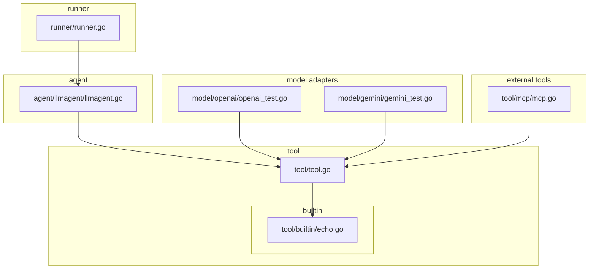
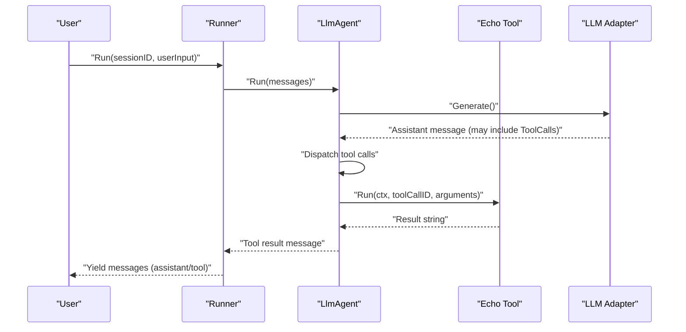
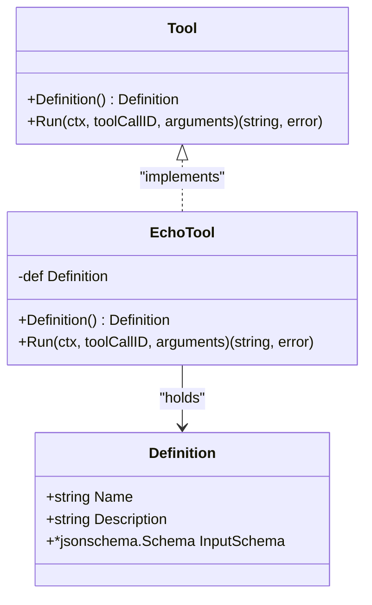
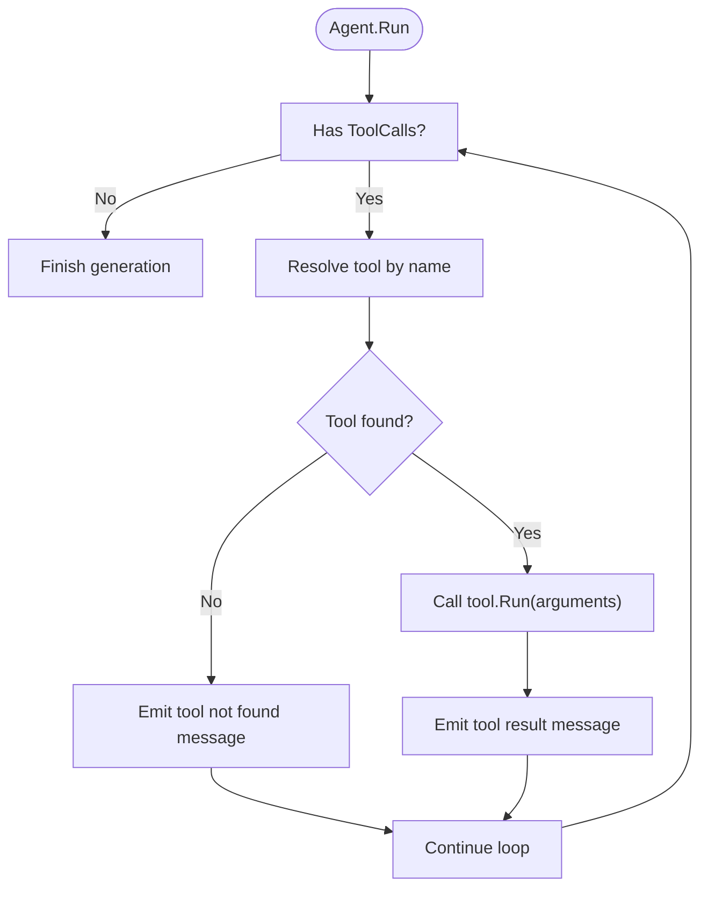
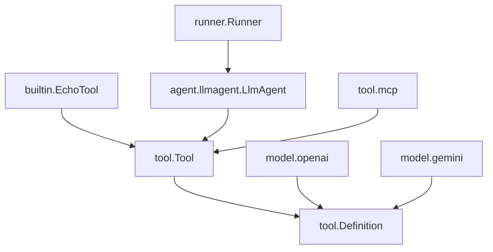

# Built-in Tools

<cite>
**Referenced Files in This Document**
- [tool.go](file://tool/tool.go)
- [echo.go](file://tool/builtin/echo.go)
- [llmagent.go](file://agent/llmagent/llmagent.go)
- [runner.go](file://runner/runner.go)
- [README.md](file://README.md)
- [openai_test.go](file://model/openai/openai_test.go)
- [gemini_test.go](file://model/gemini/gemini_test.go)
- [mcp.go](file://tool/mcp/mcp.go)
</cite>

## Table of Contents
1. [Introduction](#introduction)
2. [Project Structure](#project-structure)
3. [Core Components](#core-components)
4. [Architecture Overview](#architecture-overview)
5. [Detailed Component Analysis](#detailed-component-analysis)
6. [Dependency Analysis](#dependency-analysis)
7. [Performance Considerations](#performance-considerations)
8. [Troubleshooting Guide](#troubleshooting-guide)
9. [Conclusion](#conclusion)
10. [Appendices](#appendices)

## Introduction
This document explains the Built-in Tools component with a focus on the echo tool as the canonical example of a simple built-in tool. It covers the tool definition structure, execution logic, and schema specification, and shows how built-in tools integrate with the Tool interface and can be registered with agents. Practical patterns for extending the echo concept to other simple tools, parameter handling, and response formatting are included. Use cases for built-in tools in development, testing, and prototyping are highlighted, along with guidelines for creating effective built-in tools that complement external tool integrations.

## Project Structure
The Built-in Tools feature resides under the tool package and includes a dedicated builtin subpackage. The echo tool is implemented as a minimal, self-contained tool that adheres to the Tool interface contract. Agents and runners orchestrate tool invocation and message flow.

**Diagram sources**
- [tool.go](file://tool/tool.go)
- [echo.go](file://tool/builtin/echo.go)
- [llmagent.go](file://agent/llmagent/llmagent.go)
- [runner.go](file://runner/runner.go)
- [openai_test.go](file://model/openai/openai_test.go)
- [gemini_test.go](file://model/gemini/gemini_test.go)
- [mcp.go](file://tool/mcp/mcp.go)

**Section sources**
- [README.md](file://README.md)
- [tool.go](file://tool/tool.go)
- [echo.go](file://tool/builtin/echo.go)

## Core Components
- Tool interface: Defines the contract for tools, including metadata (Definition) and execution (Run).
- Definition: Holds the tool’s name, description, and JSON Schema for input parameters.
- Tool implementations: Must implement Tool and supply a Definition and a Run method.
- Echo tool: Demonstrates a minimal built-in tool with a single parameter and direct passthrough behavior.

Key responsibilities:
- Tool interface ensures provider-agnostic tool invocation.
- Definition enables LLMs to understand tool capabilities and validate inputs.
- Echo tool showcases parameter marshaling/unmarshaling and response formatting.

**Section sources**
- [tool.go](file://tool/tool.go)
- [echo.go](file://tool/builtin/echo.go)

## Architecture Overview
Built-in tools integrate seamlessly with the agent and runner pipeline. The agent registers tools and dispatches tool calls during generation loops. The runner manages session persistence and message flow.

**Diagram sources**
- [runner.go](file://runner/runner.go)
- [llmagent.go](file://agent/llmagent/llmagent.go)
- [echo.go](file://tool/builtin/echo.go)

## Detailed Component Analysis

### Tool Interface and Definition
The Tool interface defines:
- Definition(): returns a Definition with Name, Description, and InputSchema.
- Run(ctx, toolCallID, arguments): executes the tool and returns a string result.

Definition encapsulates:
- Name: tool identifier used by the agent to resolve tools.
- Description: human-readable purpose of the tool.
- InputSchema: JSON Schema describing valid arguments.

These elements enable LLMs to describe and call tools accurately.

**Section sources**
- [tool.go](file://tool/tool.go)

### Echo Tool Implementation
The echo tool demonstrates a minimal built-in tool:
- Construction: NewEchoTool builds a Definition with a JSON Schema derived from a Go struct annotated with JSON and JSON Schema tags.
- Parameter handling: Arguments are unmarshaled into a strongly-typed request struct.
- Execution: The Run method returns the requested value as a plain string.
- Registration: The tool is registered with an agent via the Tools slice in the agent configuration.

**Diagram sources**
- [tool.go](file://tool/tool.go)
- [echo.go](file://tool/builtin/echo.go)

**Section sources**
- [echo.go](file://tool/builtin/echo.go)

### Agent Integration and Tool Dispatch
Agents register tools and dispatch tool calls during generation loops:
- Registration: The agent constructs a map from tool names to tool instances.
- Dispatch: When an assistant message includes ToolCalls, the agent resolves the tool by name and executes Run.
- Results: Tool results are emitted as role-tool messages linked to the original tool call ID.

**Diagram sources**
- [llmagent.go](file://agent/llmagent/llmagent.go)

**Section sources**
- [llmagent.go](file://agent/llmagent/llmagent.go)

### Runner and Message Persistence
The runner coordinates sessions and persists messages:
- Loads session history and appends user input.
- Yields each message produced by the agent (assistant/tool).
- Persists messages to the session backend.

This ensures deterministic replay and auditability of tool interactions.

**Section sources**
- [runner.go](file://runner/runner.go)

### External Tool Integration Pattern
External tools (e.g., MCP) follow the same Tool interface contract:
- Wrap external tool capabilities behind Tool implementations.
- Convert external schemas to JSON Schema for LLM consumption.
- Return string results consistent with built-in tools.

This uniformity allows seamless mixing of built-in and external tools.

**Section sources**
- [mcp.go](file://tool/mcp/mcp.go)

### Testing Patterns and Validation
Tests demonstrate how tools are validated and converted for different LLM adapters:
- Built-in tools are verified to produce function declarations with parameters JSON schema.
- Tests assert that tool definitions include name, description, and a non-empty parameters schema.

These patterns guide the creation of robust built-in tools.

**Section sources**
- [openai_test.go](file://model/openai/openai_test.go)
- [gemini_test.go](file://model/gemini/gemini_test.go)

## Dependency Analysis
The built-in tool ecosystem exhibits low coupling and clear boundaries:
- tool.Tool and tool.Definition define the interface contract.
- echo tool depends on tool.Definition and JSON Schema generation.
- agent.llmagent depends on tool.Tool for dispatch.
- runner depends on agent.Agent for orchestration.
- model adapters depend on tool.Definition for function declaration conversion.
- external tool bridges (e.g., MCP) adapt external schemas to tool.Definition.

**Diagram sources**
- [tool.go](file://tool/tool.go)
- [echo.go](file://tool/builtin/echo.go)
- [llmagent.go](file://agent/llmagent/llmagent.go)
- [runner.go](file://runner/runner.go)
- [openai_test.go](file://model/openai/openai_test.go)
- [gemini_test.go](file://model/gemini/gemini_test.go)
- [mcp.go](file://tool/mcp/mcp.go)

**Section sources**
- [tool.go](file://tool/tool.go)
- [echo.go](file://tool/builtin/echo.go)
- [llmagent.go](file://agent/llmagent/llmagent.go)
- [runner.go](file://runner/runner.go)
- [openai_test.go](file://model/openai/openai_test.go)
- [gemini_test.go](file://model/gemini/gemini_test.go)
- [mcp.go](file://tool/mcp/mcp.go)

## Performance Considerations
- Minimal overhead: Built-in tools are lightweight and avoid network latency.
- Efficient serialization: Using JSON Schema for input validation reduces runtime errors and retries.
- Streaming-friendly: The agent emits tool results incrementally, enabling responsive UIs and early termination.

## Troubleshooting Guide
Common issues and resolutions:
- Tool not found: Ensure the tool name in ToolCalls matches the tool’s Definition.Name and that the tool is registered in the agent’s Tools slice.
- Invalid arguments: Verify that arguments conform to the tool’s InputSchema; mismatches cause unmarshal errors.
- Schema generation failures: Confirm that the Go struct used to derive the schema has proper JSON tags and JSON Schema tags.
- External tool errors: For MCP tools, inspect the wrapped error messages and ensure the transport is connected and reachable.

**Section sources**
- [llmagent.go](file://agent/llmagent/llmagent.go)
- [echo.go](file://tool/builtin/echo.go)
- [mcp.go](file://tool/mcp/mcp.go)

## Conclusion
Built-in tools provide a simple, reliable foundation for agent tooling. The echo tool exemplifies best practices: clear definition metadata, precise input schema, straightforward parameter handling, and consistent response formatting. By following these patterns, developers can create effective built-in tools that complement external integrations and accelerate development, testing, and prototyping workflows.

## Appendices

### Practical Extension Patterns Based on Echo
- Single-parameter passthrough: Mirror echo’s approach with a single field and direct return.
- Multi-parameter aggregation: Define a struct with multiple fields; combine them into a composite response.
- Validation-first execution: Unmarshal arguments, validate constraints, and return descriptive errors for invalid inputs.
- Response formatting: Return plain strings for simple tools; consider structured JSON for richer outputs when the agent expects structured data.

### Guidelines for Effective Built-in Tools
- Use JSON Schema tags to express parameter semantics and examples.
- Keep tool responsibilities small and focused.
- Return clear, actionable results; avoid ambiguous or overly verbose outputs.
- Register tools explicitly in the agent configuration to ensure availability.
- Validate inputs early and fail fast with meaningful errors.

### Use Cases
- Development: Rapid prototyping of tool behaviors without external dependencies.
- Testing: Deterministic tool responses for reproducible test scenarios.
- Prototyping: Quick validation of tool-call workflows and agent behavior.