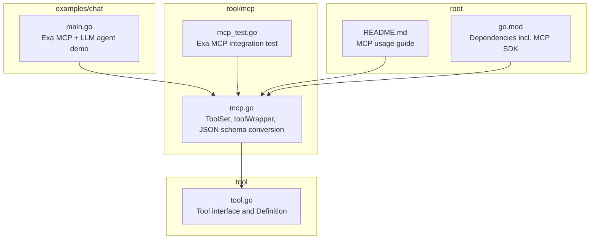
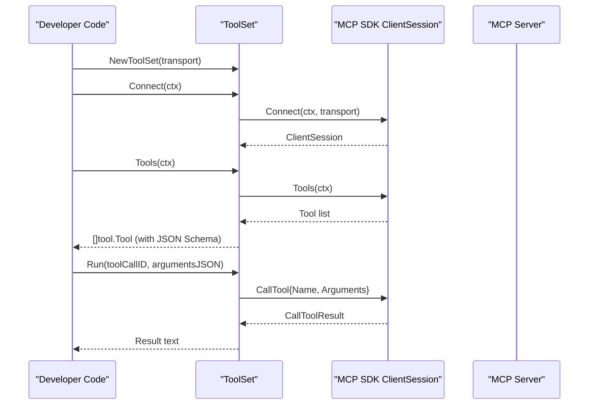
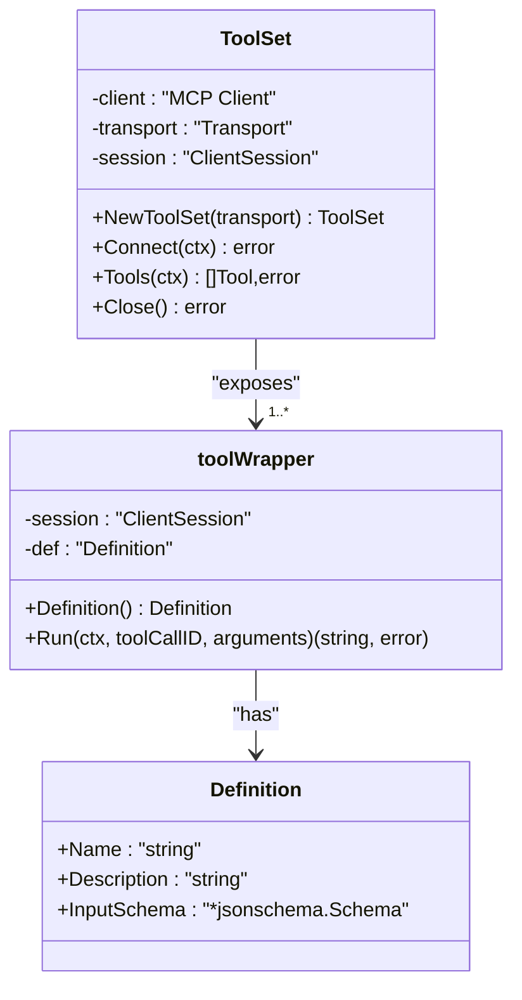
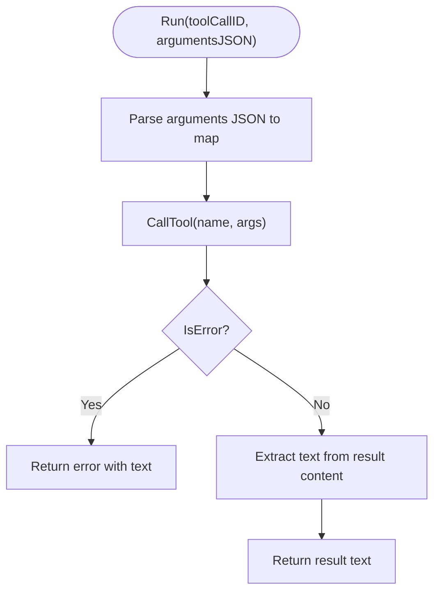
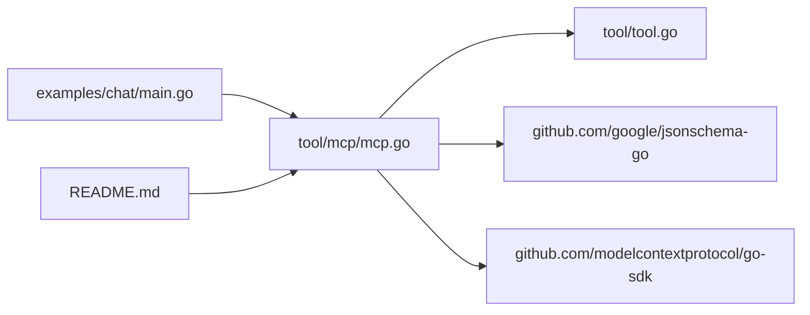

# MCP Integration

<cite>
**Referenced Files in This Document**
- [mcp.go](file://tool/mcp/mcp.go)
- [mcp_test.go](file://tool/mcp/mcp_test.go)
- [tool.go](file://tool/tool.go)
- [main.go](file://examples/chat/main.go)
- [README.md](file://README.md)
- [go.mod](file://go.mod)
</cite>

## Table of Contents
1. [Introduction](#introduction)
2. [Project Structure](#project-structure)
3. [Core Components](#core-components)
4. [Architecture Overview](#architecture-overview)
5. [Detailed Component Analysis](#detailed-component-analysis)
6. [Dependency Analysis](#dependency-analysis)
7. [Performance Considerations](#performance-considerations)
8. [Troubleshooting Guide](#troubleshooting-guide)
9. [Conclusion](#conclusion)
10. [Appendices](#appendices)

## Introduction
This document explains the MCP (Model Context Protocol) Integration component that enables connecting external tool servers and dynamically discovering their tools. It covers the ToolSet creation process, transport configuration, tool registration, connection establishment, tool metadata retrieval, execution workflows, authentication patterns, and practical examples. It also includes testing strategies and troubleshooting guidance for common connection and execution issues.

## Project Structure
The MCP integration lives under the tool/mcp package and integrates with the broader tool interface. The examples/chat module demonstrates a real-world scenario using an MCP server (Exa) with an LLM agent.

**Diagram sources**
- [mcp.go:1-121](file://tool/mcp/mcp.go#L1-L121)
- [tool.go:1-24](file://tool/tool.go#L1-L24)
- [mcp_test.go:1-101](file://tool/mcp/mcp_test.go#L1-L101)
- [main.go:1-177](file://examples/chat/main.go#L1-L177)
- [README.md:234-255](file://README.md#L234-L255)
- [go.mod:1-47](file://go.mod#L1-L47)

**Section sources**
- [mcp.go:1-121](file://tool/mcp/mcp.go#L1-L121)
- [tool.go:1-24](file://tool/tool.go#L1-L24)
- [mcp_test.go:1-101](file://tool/mcp/mcp_test.go#L1-L101)
- [main.go:1-177](file://examples/chat/main.go#L1-L177)
- [README.md:234-255](file://README.md#L234-L255)
- [go.mod:1-47](file://go.mod#L1-L47)

## Core Components
- ToolSet: Manages connection to an MCP server and exposes discovered tools as tool.Tool instances.
- toolWrapper: Wraps a single MCP tool and adapts it to the tool.Tool interface.
- Definition: Holds tool metadata (name, description, JSON Schema) used by the LLM to understand and call tools.
- Transport: Configures how the MCP client communicates with the server (e.g., HTTP streaming, stdio).

Key responsibilities:
- Establish connection to the MCP server via a configured transport.
- Discover tools and convert their input schemas to JSON Schema for LLM consumption.
- Execute tools by invoking the MCP session’s CallTool and returning plain text results.

**Section sources**
- [mcp.go:15-80](file://tool/mcp/mcp.go#L15-L80)
- [tool.go:9-23](file://tool/tool.go#L9-L23)

## Architecture Overview
The MCP integration sits between the LLM agent and external tool servers. The ToolSet connects to the MCP server, lists tools, converts their input schemas, and exposes them to the agent. The agent can then call tools by name with validated JSON arguments.

**Diagram sources**
- [mcp.go:22-109](file://tool/mcp/mcp.go#L22-L109)

## Detailed Component Analysis

### ToolSet and Tool Discovery
- Construction: Creates an MCP client with an implementation identity and stores the transport.
- Connection: Uses the transport to establish a session with the MCP server.
- Tool discovery: Iterates over the server-provided tools, marshals/unmarshals the input schema to a JSON Schema, and builds tool wrappers.

**Diagram sources**
- [mcp.go:15-86](file://tool/mcp/mcp.go#L15-L86)
- [tool.go:9-15](file://tool/tool.go#L9-L15)

**Section sources**
- [mcp.go:22-72](file://tool/mcp/mcp.go#L22-L72)

### Tool Execution Workflow
- Argument parsing: Converts the arguments JSON string into a map for the MCP call.
- Tool invocation: Calls the MCP session with the tool name and parsed arguments.
- Result extraction: Collects text content from the result and returns it as a plain string. Errors are surfaced as failures.

**Diagram sources**
- [mcp.go:92-120](file://tool/mcp/mcp.go#L92-L120)

**Section sources**
- [mcp.go:92-120](file://tool/mcp/mcp.go#L92-L120)

### Transport Configuration Options
- StreamableClientTransport: HTTP-based transport suitable for cloud MCP servers. Supports setting an HTTP client for authentication.
- StdioTransport: Alternative transport for local MCP servers started as separate processes.
- Authentication: The example demonstrates injecting an API key header via a custom RoundTripper.

Practical example paths:
- Using StreamableClientTransport with an API key header: [examples/chat/main.go:69-80](file://examples/chat/main.go#L69-L80)
- Using StdioTransport: [README.md:244](file://README.md#L244)

**Section sources**
- [examples/chat/main.go:39-80](file://examples/chat/main.go#L39-L80)
- [README.md:244](file://README.md#L244)

### Tool Registration Mechanisms
- ToolSet.Tools returns a slice of tool.Tool instances. Each tool wrapper embeds the MCP session and tool definition.
- The Definition includes the tool name, description, and a JSON Schema for input validation and LLM prompting.

Registration in practice:
- Pass the returned tools to the agent configuration so the agent can discover and call them automatically.

**Section sources**
- [mcp.go:46-72](file://tool/mcp/mcp.go#L46-L72)
- [tool.go:9-15](file://tool/tool.go#L9-L15)

### Connection Establishment and Tool Metadata Retrieval
- Connect: Establishes a session with the MCP server using the provided transport.
- Tools: Iterates over server-provided tools, converts input schemas to JSON Schema, and constructs tool wrappers.

Common error scenarios:
- Connection failure during Connect.
- Tool listing failure during Tools.
- Schema marshaling/unmarshaling errors.

**Section sources**
- [mcp.go:35-72](file://tool/mcp/mcp.go#L35-L72)

### Execution Workflows
- The agent invokes tool.Run with a tool call ID and arguments JSON.
- The wrapper parses arguments, calls the MCP session, extracts text content, and returns it.
- Errors from the MCP server are propagated as failures.

**Section sources**
- [mcp.go:92-120](file://tool/mcp/mcp.go#L92-L120)

### Practical Examples
- Connecting to Exa MCP server and listing tools: [examples/chat/main.go:68-93](file://examples/chat/main.go#L68-L93)
- Running a search tool and printing results: [examples/chat/main.go:101-167](file://examples/chat/main.go#L101-L167)
- Using StreamableClientTransport with an API key header: [examples/chat/main.go:69-80](file://examples/chat/main.go#L69-L80)
- Using StdioTransport (from README): [README.md:244](file://README.md#L244)

**Section sources**
- [examples/chat/main.go:52-167](file://examples/chat/main.go#L52-L167)
- [README.md:234-255](file://README.md#L234-L255)

## Dependency Analysis
The MCP integration depends on:
- MCP SDK for client and session management.
- JSON Schema library for tool input schema conversion.
- Standard libraries for context, JSON, and string manipulation.

**Diagram sources**
- [mcp.go:1-13](file://tool/mcp/mcp.go#L1-L13)
- [tool.go:1-7](file://tool/tool.go#L1-L7)
- [go.mod:5-15](file://go.mod#L5-L15)

**Section sources**
- [mcp.go:1-13](file://tool/mcp/mcp.go#L1-L13)
- [go.mod:5-15](file://go.mod#L5-L15)

## Performance Considerations
- Connection reuse: Reuse a single ToolSet across multiple agent runs to avoid repeated connections.
- Tool schema caching: The ToolSet caches the session; consider reusing Tools results if the server does not change tools frequently.
- Streaming vs polling: Prefer HTTP streaming transports when available for lower latency.
- Argument parsing: Keep argument JSON small and structured to minimize parsing overhead.
- Network timeouts: Configure transport timeouts appropriately to balance responsiveness and reliability.

## Troubleshooting Guide
Common issues and resolutions:
- Connection errors:
  - Verify transport configuration (endpoint, headers).
  - Check network connectivity and firewall rules.
  - Confirm server availability and rate limits.
  - See connection handling in [mcp.go:35-43](file://tool/mcp/mcp.go#L35-L43).
- Tool listing failures:
  - Ensure the server supports tool discovery.
  - Inspect server logs and permissions.
  - See tool listing in [mcp.go:46-72](file://tool/mcp/mcp.go#L46-L72).
- Schema conversion errors:
  - Validate that the server provides a valid input schema.
  - Review marshaling/unmarshaling logic in [mcp.go:54-61](file://tool/mcp/mcp.go#L54-L61).
- Tool execution errors:
  - Confirm tool name matches exactly.
  - Validate arguments JSON against the tool’s input schema.
  - See execution flow in [mcp.go:92-120](file://tool/mcp/mcp.go#L92-L120).
- Authentication failures:
  - Ensure API keys or headers are correctly injected.
  - Example of API key header injection: [examples/chat/main.go:39-50](file://examples/chat/main.go#L39-L50).
- Testing with real servers:
  - Use the Exa MCP test as a reference: [mcp_test.go:44-100](file://tool/mcp/mcp_test.go#L44-L100).

**Section sources**
- [mcp.go:35-120](file://tool/mcp/mcp.go#L35-L120)
- [examples/chat/main.go:39-50](file://examples/chat/main.go#L39-L50)
- [mcp_test.go:44-100](file://tool/mcp/mcp_test.go#L44-L100)

## Conclusion
The MCP Integration component provides a clean abstraction for connecting to MCP servers, dynamically discovering tools, and exposing them to an LLM agent. By configuring the transport appropriately, handling authentication, and leveraging the tool wrapper, developers can integrate external tool capabilities seamlessly while maintaining a provider-agnostic tool interface.

## Appendices

### API Reference Summary
- ToolSet
  - NewToolSet(transport) ToolSet
  - Connect(ctx) error
  - Tools(ctx) []Tool,error
  - Close() error
- tool.Tool
  - Definition() Definition
  - Run(ctx, toolCallID, arguments) (string, error)
- Definition
  - Name string
  - Description string
  - InputSchema *jsonschema.Schema

**Section sources**
- [mcp.go:22-80](file://tool/mcp/mcp.go#L22-L80)
- [tool.go:9-23](file://tool/tool.go#L9-L23)