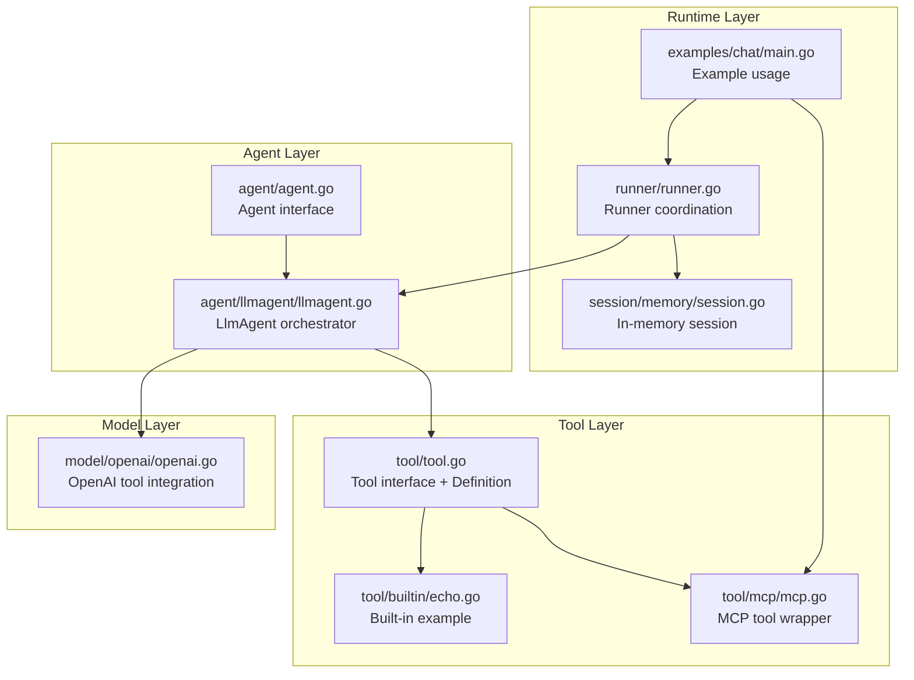
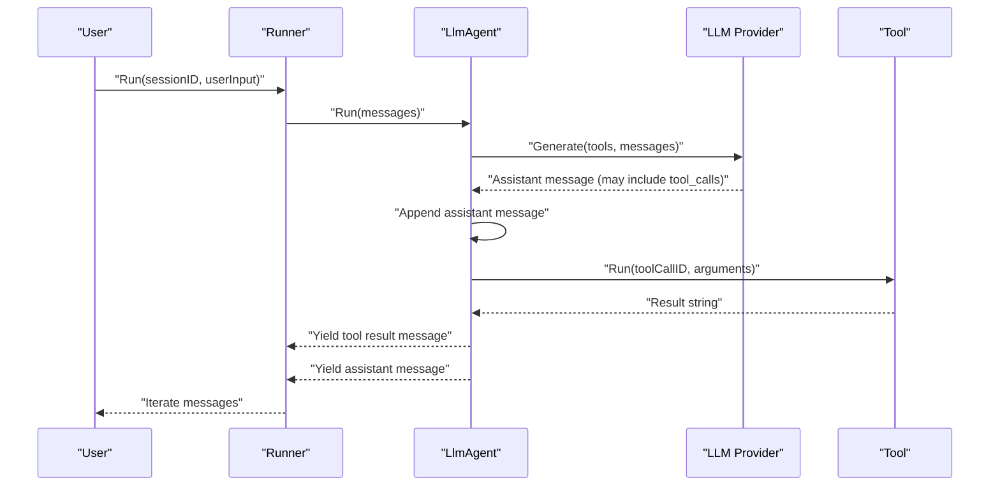
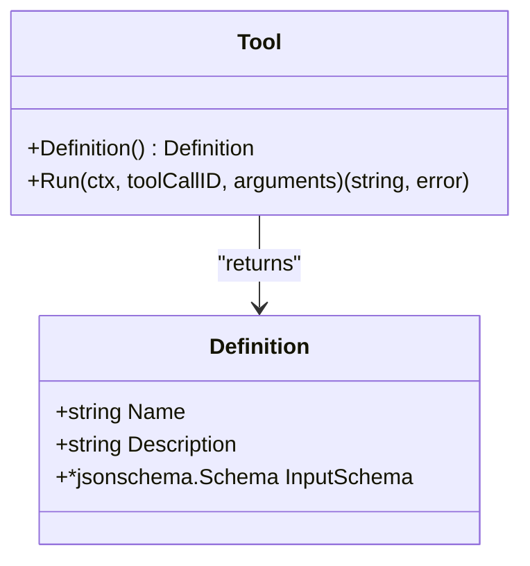
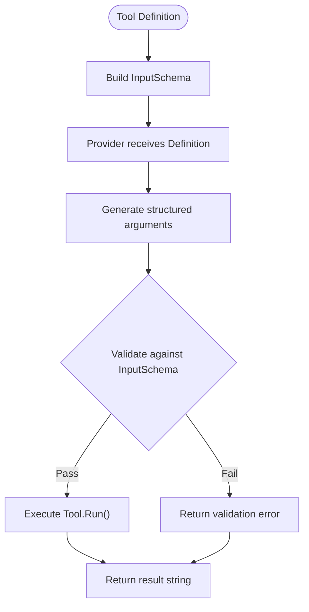
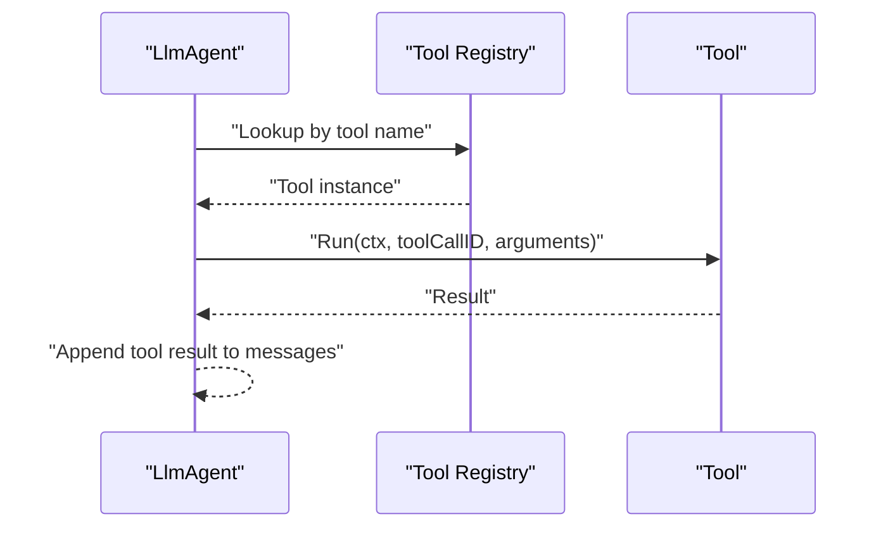
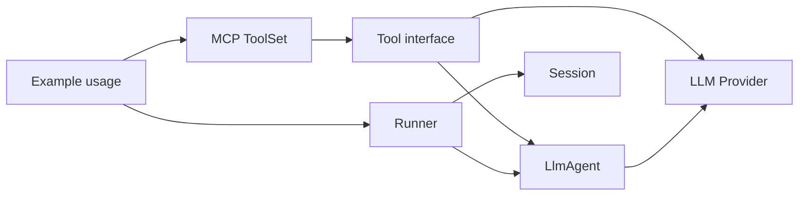

# Tool Interface

<cite>
**Referenced Files in This Document**
- [tool.go](file://tool/tool.go)
- [echo.go](file://tool/builtin/echo.go)
- [mcp.go](file://tool/mcp/mcp.go)
- [llmagent.go](file://agent/llmagent/llmagent.go)
- [agent.go](file://agent/agent.go)
- [openai.go](file://model/openai/openai.go)
- [main.go](file://examples/chat/main.go)
- [runner.go](file://runner/runner.go)
- [session.go](file://session/memory/session.go)
</cite>

## Table of Contents
1. [Introduction](#introduction)
2. [Project Structure](#project-structure)
3. [Core Components](#core-components)
4. [Architecture Overview](#architecture-overview)
5. [Detailed Component Analysis](#detailed-component-analysis)
6. [Dependency Analysis](#dependency-analysis)
7. [Performance Considerations](#performance-considerations)
8. [Troubleshooting Guide](#troubleshooting-guide)
9. [Conclusion](#conclusion)
10. [Appendices](#appendices)

## Introduction
This document explains the Tool Interface component that enables LLM agents to discover and execute tools. It covers the Tool interface contract, the Definition metadata structure, JSON Schema-based input validation, context-aware execution, and integration patterns with LlmAgent. Practical guidance is provided for building custom tools, designing robust schemas, handling errors, and registering tools effectively.

## Project Structure
The Tool Interface lives under the tool package and integrates with agent, model, and runner subsystems. The example chat demonstrates dynamic tool loading from an MCP server and agent-driven orchestration.

**Diagram sources**
- [tool.go:1-24](file://tool/tool.go#L1-L24)
- [echo.go:1-47](file://tool/builtin/echo.go#L1-L47)
- [mcp.go:1-121](file://tool/mcp/mcp.go#L1-L121)
- [agent.go:1-18](file://agent/agent.go#L1-L18)
- [llmagent.go:1-128](file://agent/llmagent/llmagent.go#L1-L128)
- [openai.go:160-189](file://model/openai/openai.go#L160-L189)
- [runner.go:1-102](file://runner/runner.go#L1-L102)
- [session.go:1-86](file://session/memory/session.go#L1-L86)
- [main.go:1-177](file://examples/chat/main.go#L1-L177)

**Section sources**
- [tool.go:1-24](file://tool/tool.go#L1-L24)
- [llmagent.go:1-128](file://agent/llmagent/llmagent.go#L1-L128)
- [openai.go:160-189](file://model/openai/openai.go#L160-L189)
- [runner.go:1-102](file://runner/runner.go#L1-L102)
- [session.go:1-86](file://session/memory/session.go#L1-L86)
- [main.go:1-177](file://examples/chat/main.go#L1-L177)

## Core Components
- Tool interface: Defines the contract for tool discovery and execution.
- Definition: Metadata describing a tool’s identity and input schema.
- Tool implementations: Built-in and MCP-wrapped tools conforming to Tool.
- LlmAgent: Orchestrates tool discovery, invocation, and message iteration.
- Model integration: Converts tool definitions to provider-specific function tool formats.
- Runner and session: Persist and iterate conversation messages across agent runs.

**Section sources**
- [tool.go:9-23](file://tool/tool.go#L9-L23)
- [llmagent.go:25-41](file://agent/llmagent/llmagent.go#L25-L41)
- [openai.go:160-189](file://model/openai/openai.go#L160-L189)

## Architecture Overview
The Tool Interface enables LLM agents to discover tools via Definition and execute them with validated inputs. The agent maintains a registry keyed by tool name and executes tools in a loop, yielding assistant messages and tool results.

**Diagram sources**
- [runner.go:44-89](file://runner/runner.go#L44-L89)
- [llmagent.go:54-105](file://agent/llmagent/llmagent.go#L54-L105)
- [openai.go:160-189](file://model/openai/openai.go#L160-L189)

## Detailed Component Analysis

### Tool Interface Contract
- Definition(): Returns metadata used by the LLM to understand and call the tool.
- Run(ctx, toolCallID, arguments): Executes the tool with validated arguments and returns a string result.

**Diagram sources**
- [tool.go:17-23](file://tool/tool.go#L17-L23)
- [tool.go:9-15](file://tool/tool.go#L9-L15)

**Section sources**
- [tool.go:17-23](file://tool/tool.go#L17-L23)

### Definition Struct Fields
- Name: Unique identifier used by the agent to dispatch tool calls.
- Description: Human-readable description surfaced to the LLM for tool selection.
- InputSchema: JSON Schema describing the tool’s input parameters, enabling validation and structured generation.

These fields collectively enable:
- LLM tool discovery and selection.
- Structured argument generation aligned with the schema.
- Validation prior to execution.

**Section sources**
- [tool.go:9-15](file://tool/tool.go#L9-L15)

### JSON Schema Validation Mechanism
- Built-in tools derive InputSchema from Go types using reflection-based schema generation.
- MCP tools convert provider-provided schemas to the shared jsonschema.Schema representation.
- The LLM provider consumes Definition to emit structured function calls whose arguments are validated against InputSchema.

**Diagram sources**
- [echo.go:22-34](file://tool/builtin/echo.go#L22-L34)
- [mcp.go:46-72](file://tool/mcp/mcp.go#L46-L72)
- [openai.go:160-189](file://model/openai/openai.go#L160-L189)

**Section sources**
- [echo.go:22-34](file://tool/builtin/echo.go#L22-L34)
- [mcp.go:46-72](file://tool/mcp/mcp.go#L46-L72)
- [openai.go:160-189](file://model/openai/openai.go#L160-L189)

### Context-Based Execution Pattern
- LlmAgent.Run constructs an LLM request including Tools and Instruction, then iterates messages.
- On tool calls, the agent resolves the tool by name and executes Run with the provided arguments.
- Tool results are appended back into the conversation history to inform subsequent generations.

**Diagram sources**
- [llmagent.go:107-127](file://agent/llmagent/llmagent.go#L107-L127)

**Section sources**
- [llmagent.go:54-105](file://agent/llmagent/llmagent.go#L54-L105)
- [llmagent.go:107-127](file://agent/llmagent/llmagent.go#L107-L127)

### Practical Examples: Implementing Custom Tools
- Built-in Echo tool:
  - Define a request struct with JSON tags and jsonschema tags for documentation.
  - Build InputSchema from the request type.
  - Implement Definition() and Run() to parse arguments and return a result string.

- MCP tool wrapper:
  - Convert provider schemas to shared jsonschema.Schema.
  - Wrap provider tool calls and return text content as tool results.

- Example usage:
  - Connect to an MCP server, load tools, and pass them to LlmAgent.

**Section sources**
- [echo.go:14-46](file://tool/builtin/echo.go#L14-L46)
- [mcp.go:46-121](file://tool/mcp/mcp.go#L46-L121)
- [main.go:82-110](file://examples/chat/main.go#L82-L110)

### Schema Design Guidelines
- Use clear, concise field names and descriptions.
- Leverage jsonschema tags for examples and descriptions embedded in the Go struct.
- Keep InputSchema minimal and precise to reduce ambiguity for the LLM.
- Prefer explicit types (string, integer, boolean) and enums where applicable.
- Avoid overly broad schemas that could lead to invalid arguments.

**Section sources**
- [echo.go:18-20](file://tool/builtin/echo.go#L18-L20)

### Error Handling Strategies
- Tool-level errors: Return a descriptive error string; the agent surfaces it as a tool message.
- Argument parsing failures: Return an error from Run; the agent converts it to a tool message.
- Provider schema conversion failures: Return an error from tool construction or tool wrapping.
- Agent lookup failures: If a tool name is not registered, the agent emits a “not found” tool message.

**Section sources**
- [llmagent.go:107-127](file://agent/llmagent/llmagent.go#L107-L127)
- [mcp.go:92-109](file://tool/mcp/mcp.go#L92-L109)

### Tool Registration Patterns
- LlmAgent registers tools by name at construction time.
- Ensure each tool’s Definition.Name is unique and matches the LLM’s function call name.
- Pass the tool slice to LlmAgent.Config.Tools.

**Section sources**
- [llmagent.go:31-41](file://agent/llmagent/llmagent.go#L31-L41)

### Integration with LlmAgent
- LlmAgent stores tools in a map keyed by Definition.Name.
- During Run, it attaches tools to the LLM request and processes tool_calls.
- It yields assistant messages and tool results in order, appending tool results to history.

**Section sources**
- [llmagent.go:25-41](file://agent/llmagent/llmagent.go#L25-L41)
- [llmagent.go:54-105](file://agent/llmagent/llmagent.go#L54-L105)

### Best Practices for Tool Development
- Parameter validation: Validate inputs in Run and return clear errors.
- Response formatting: Return a concise, structured string suitable for summarization by the LLM.
- Idempotency: Prefer idempotent tools where possible to simplify retries.
- Security: Sanitize inputs and enforce constraints to prevent misuse.
- Documentation: Keep Description and InputSchema aligned with intended usage.

**Section sources**
- [echo.go:40-46](file://tool/builtin/echo.go#L40-L46)
- [mcp.go:92-109](file://tool/mcp/mcp.go#L92-L109)

## Dependency Analysis
The Tool Interface is provider-agnostic and integrates with:
- Agent layer for orchestration and tool dispatch.
- Model layer for converting Definition to provider-specific function tool definitions.
- Runner and session for persistent conversation management.

**Diagram sources**
- [tool.go:17-23](file://tool/tool.go#L17-L23)
- [llmagent.go:25-41](file://agent/llmagent/llmagent.go#L25-L41)
- [openai.go:160-189](file://model/openai/openai.go#L160-L189)
- [runner.go:17-37](file://runner/runner.go#L17-L37)
- [session.go:1-86](file://session/memory/session.go#L1-L86)
- [main.go:82-110](file://examples/chat/main.go#L82-L110)

**Section sources**
- [tool.go:17-23](file://tool/tool.go#L17-L23)
- [llmagent.go:25-41](file://agent/llmagent/llmagent.go#L25-L41)
- [openai.go:160-189](file://model/openai/openai.go#L160-L189)
- [runner.go:17-37](file://runner/runner.go#L17-L37)
- [session.go:1-86](file://session/memory/session.go#L1-L86)
- [main.go:82-110](file://examples/chat/main.go#L82-L110)

## Performance Considerations
- Minimize tool execution latency by keeping Run lightweight and avoiding heavy I/O.
- Reuse connections and sessions (e.g., MCP) to reduce overhead.
- Keep InputSchema small and focused to improve LLM generation speed.
- Batch tool results when possible to reduce round trips.

## Troubleshooting Guide
Common issues and resolutions:
- Tool not found: Verify Definition.Name matches the LLM’s function call name and that the tool is included in LlmAgent.Config.Tools.
- Schema mismatch: Ensure InputSchema aligns with the arguments emitted by the LLM; adjust jsonschema tags or provider conversion logic.
- Argument parsing errors: Validate Run’s argument parsing and return descriptive errors.
- Provider integration errors: Confirm tool definitions are marshaled/unmarshaled correctly into provider-specific function tool parameters.

**Section sources**
- [llmagent.go:107-127](file://agent/llmagent/llmagent.go#L107-L127)
- [openai.go:160-189](file://model/openai/openai.go#L160-L189)
- [mcp.go:46-72](file://tool/mcp/mcp.go#L46-L72)

## Conclusion
The Tool Interface provides a clean, provider-agnostic contract for tool discovery and execution. By structuring tools with precise Definitions and robust InputSchemas, developers can build reliable, composable capabilities that integrate seamlessly with LlmAgent and modern LLM providers.

## Appendices

### Appendix A: Example Tool Implementation Checklist
- Define a request struct with JSON tags and jsonschema tags.
- Build InputSchema from the request type.
- Implement Definition() returning Name, Description, and InputSchema.
- Implement Run() to parse arguments, validate, and return a result string.
- Register the tool with LlmAgent by including it in Config.Tools.

**Section sources**
- [echo.go:14-46](file://tool/builtin/echo.go#L14-L46)
- [llmagent.go:31-41](file://agent/llmagent/llmagent.go#L31-L41)