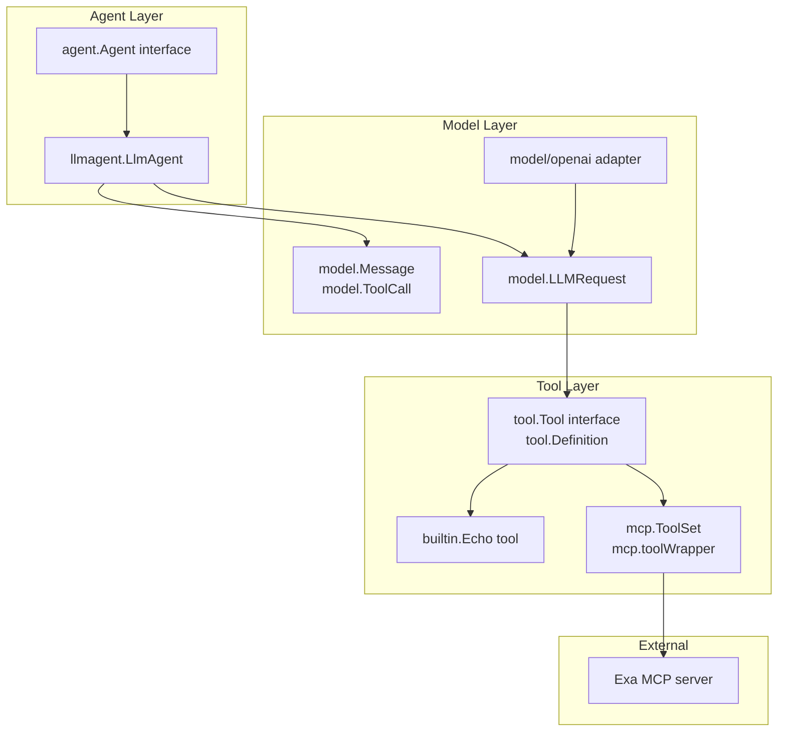
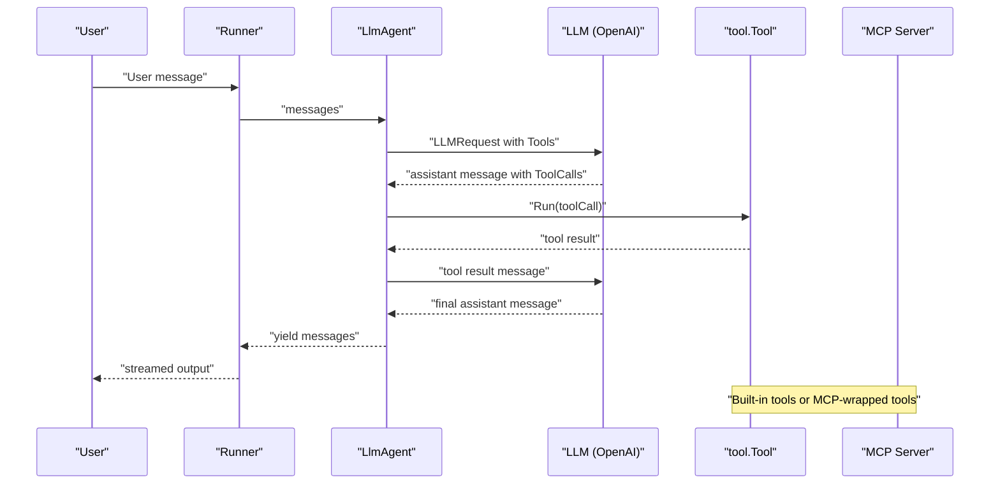
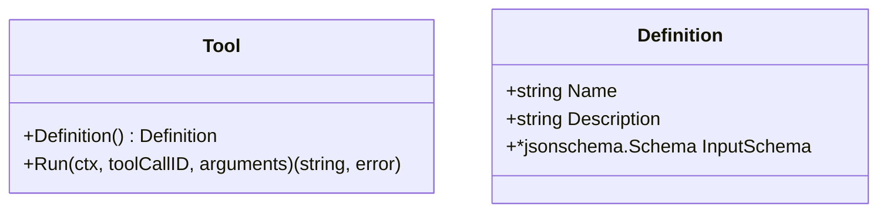
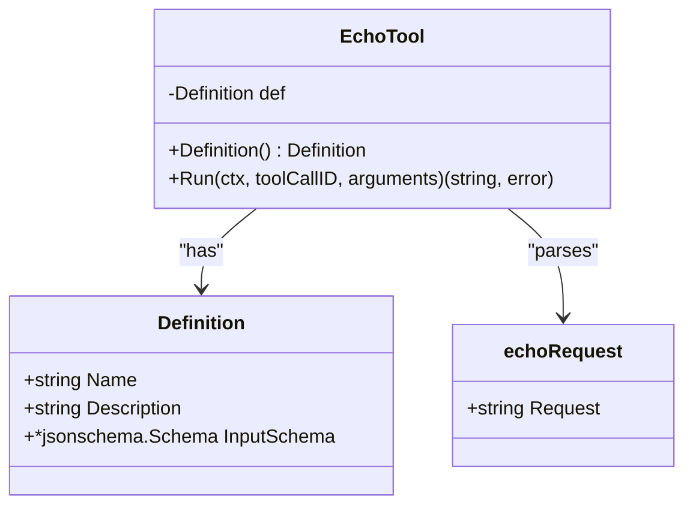
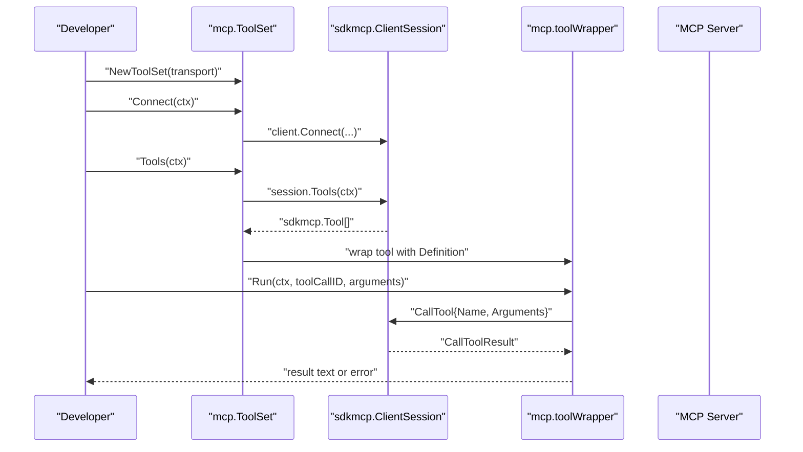
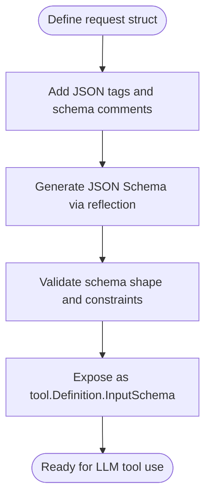
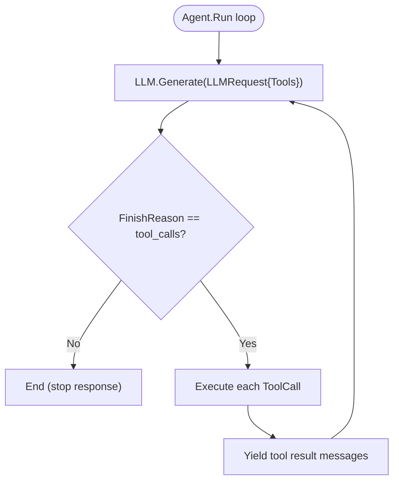
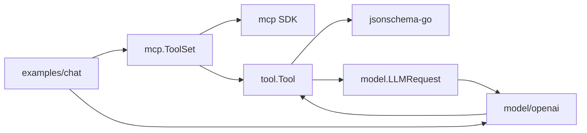

# Tool System

<cite>
**Referenced Files in This Document**
- [tool.go](file://tool/tool.go)
- [echo.go](file://tool/builtin/echo.go)
- [mcp.go](file://tool/mcp/mcp.go)
- [mcp_test.go](file://tool/mcp/mcp_test.go)
- [llmagent.go](file://agent/llmagent/llmagent.go)
- [agent.go](file://agent/agent.go)
- [model.go](file://model/model.go)
- [openai.go](file://model/openai/openai.go)
- [main.go](file://examples/chat/main.go)
- [README.md](file://README.md)
- [README_zh-CN.md](file://README_zh-CN.md)
</cite>

## Table of Contents
1. [Introduction](#introduction)
2. [Project Structure](#project-structure)
3. [Core Components](#core-components)
4. [Architecture Overview](#architecture-overview)
5. [Detailed Component Analysis](#detailed-component-analysis)
6. [Dependency Analysis](#dependency-analysis)
7. [Performance Considerations](#performance-considerations)
8. [Troubleshooting Guide](#troubleshooting-guide)
9. [Conclusion](#conclusion)
10. [Appendices](#appendices)

## Introduction
The Tool System provides a provider-agnostic interface for tools that can be invoked by an LLM. It defines a minimal contract for tool metadata and execution, integrates built-in tools, and bridges external tools via the Model Context Protocol (MCP). This document explains the Tool interface contract, JSON schema validation, execution patterns, built-in tools, MCP integration, schema design guidelines, error handling, security considerations, performance optimization, and testing strategies.

## Project Structure
The Tool System spans several packages:
- tool: Defines the Tool interface and tool Definition metadata.
- tool/builtin: Contains built-in tools, such as Echo.
- tool/mcp: Bridges external MCP servers and exposes their tools as tool.Tool.
- agent/llmagent: Orchestrates LLM generation and automatic tool-call execution.
- model: Provides provider-agnostic message types and tool-call structures used by LLMs.
- model/openai: Adapts tool definitions to provider-specific function-tool formats.
- examples/chat: Demonstrates integrating MCP tools with an LLM-backed agent.

**Diagram sources**
- [tool.go:17-23](file://tool/tool.go#L17-L23)
- [echo.go:14-34](file://tool/builtin/echo.go#L14-L34)
- [mcp.go:15-80](file://tool/mcp/mcp.go#L15-L80)
- [llmagent.go:25-41](file://agent/llmagent/llmagent.go#L25-L41)
- [model.go:125-191](file://model/model.go#L125-L191)
- [openai.go:160-189](file://model/openai/openai.go#L160-L189)

**Section sources**
- [README.md:65-82](file://README.md#L65-L82)
- [README_zh-CN.md:61-78](file://README_zh-CN.md#L61-L78)

## Core Components
- Tool interface: Defines Definition() and Run() for tool metadata and execution.
- Definition: Holds tool name, description, and JSON Schema input schema.
- Built-in tools: Example Echo tool demonstrates schema generation and argument parsing.
- MCP ToolSet: Connects to an MCP server, discovers tools, and wraps them as tool.Tool.
- LlmAgent: Integrates tools into the LLM generation loop and executes tool calls.

**Section sources**
- [tool.go:9-23](file://tool/tool.go#L9-L23)
- [echo.go:14-46](file://tool/builtin/echo.go#L14-L46)
- [mcp.go:15-120](file://tool/mcp/mcp.go#L15-L120)
- [llmagent.go:25-127](file://agent/llmagent/llmagent.go#L25-L127)

## Architecture Overview
The Tool System sits between the Agent and the LLM. Agents pass tools to the LLM via LLMRequest, and the LLM may request tool calls. The Agent executes tool calls and returns results to the LLM for continued generation.

**Diagram sources**
- [llmagent.go:54-104](file://agent/llmagent/llmagent.go#L54-L104)
- [model.go:183-191](file://model/model.go#L183-L191)
- [openai.go:160-189](file://model/openai/openai.go#L160-L189)
- [mcp.go:92-109](file://tool/mcp/mcp.go#L92-L109)

## Detailed Component Analysis

### Tool Interface Contract
- Definition(): Returns tool metadata (name, description, input JSON Schema).
- Run(ctx, toolCallID, arguments): Executes the tool with JSON-encoded arguments and returns a string result or error.

**Diagram sources**
- [tool.go:17-23](file://tool/tool.go#L17-L23)
- [tool.go:9-15](file://tool/tool.go#L9-L15)

**Section sources**
- [tool.go:9-23](file://tool/tool.go#L9-L23)

### Built-in Tools: Echo
- Echo tool demonstrates:
  - Defining a request struct with JSON tags and JSON Schema annotations.
  - Generating a JSON Schema from the request type using reflection.
  - Parsing JSON arguments and returning the requested message.

**Diagram sources**
- [echo.go:14-46](file://tool/builtin/echo.go#L14-L46)
- [tool.go:9-15](file://tool/tool.go#L9-L15)

**Section sources**
- [echo.go:14-46](file://tool/builtin/echo.go#L14-L46)

### MCP Integration
- ToolSet manages connection to an MCP server and wraps discovered tools as tool.Tool.
- Discovery process:
  - Connect to server via Transport.
  - List tools and convert each tool’s InputSchema from JSON to *jsonschema.Schema.
  - Wrap each tool with a wrapper that forwards calls to the MCP session.
- Execution:
  - Unmarshal JSON arguments and call the MCP tool by name.
  - Extract text content from the result and handle errors.

**Diagram sources**
- [mcp.go:22-80](file://tool/mcp/mcp.go#L22-L80)
- [mcp.go:92-120](file://tool/mcp/mcp.go#L92-L120)

**Section sources**
- [mcp.go:15-120](file://tool/mcp/mcp.go#L15-L120)
- [mcp_test.go:44-100](file://tool/mcp/mcp_test.go#L44-L100)
- [main.go:68-100](file://examples/chat/main.go#L68-L100)

### Tool Schema Design Guidelines
- Use reflect-based JSON Schema generation for request structs to keep definitions DRY and consistent.
- Annotate struct fields with JSON tags and JSON Schema comments for clarity.
- Ensure InputSchema is serializable and convertible to provider-specific function-tool parameters.

**Diagram sources**
- [echo.go:18-34](file://tool/builtin/echo.go#L18-L34)
- [openai.go:166-189](file://model/openai/openai.go#L166-L189)

**Section sources**
- [echo.go:18-34](file://tool/builtin/echo.go#L18-L34)
- [openai.go:166-189](file://model/openai/openai.go#L166-L189)

### Execution Logic Patterns
- LlmAgent:
  - Prepends system instruction if configured.
  - Sends LLMRequest with Tools to the LLM.
  - On FinishReasonToolCalls, executes each ToolCall and yields tool result messages.
  - Appends tool results back into the conversation history for the next LLM turn.

**Diagram sources**
- [llmagent.go:54-104](file://agent/llmagent/llmagent.go#L54-L104)

**Section sources**
- [llmagent.go:54-104](file://agent/llmagent/llmagent.go#L54-L104)

### Validation Strategies
- Built-in tools: Parse JSON arguments and return errors for invalid inputs.
- MCP tools: Unmarshal arguments to map[string]any and propagate MCP errors as tool errors.
- Provider integration: Convert tool schemas to provider-specific function-tool parameters and handle marshaling/unmarshaling errors.

**Section sources**
- [echo.go:40-46](file://tool/builtin/echo.go#L40-L46)
- [mcp.go:92-109](file://tool/mcp/mcp.go#L92-L109)
- [openai.go:166-189](file://model/openai/openai.go#L166-L189)

### Practical Examples
- Echo tool usage:
  - Create tool.Definition with InputSchema derived from request struct.
  - Implement Run to parse arguments and return the requested message.
- MCP tool usage:
  - Configure Transport (e.g., StreamableClientTransport).
  - Connect, discover tools, and pass them to LlmAgent.
  - Example chat demonstrates connecting to an Exa MCP server and invoking a search tool.

**Section sources**
- [echo.go:22-46](file://tool/builtin/echo.go#L22-L46)
- [mcp.go:22-80](file://tool/mcp/mcp.go#L22-L80)
- [mcp_test.go:44-100](file://tool/mcp/mcp_test.go#L44-L100)
- [main.go:68-100](file://examples/chat/main.go#L68-L100)

### Custom Tool Development
- Define a request struct with JSON tags and schema comments.
- Generate a JSON Schema for the struct.
- Implement Tool with Definition() returning name, description, and InputSchema.
- Implement Run to parse arguments and perform the action, returning a string result or error.

**Section sources**
- [echo.go:18-46](file://tool/builtin/echo.go#L18-L46)
- [tool.go:9-23](file://tool/tool.go#L9-L23)

### Integration with LlmAgent
- Pass tools to LlmAgent.Config.Tools.
- LlmAgent maps tools by name and executes ToolCalls automatically.
- Tool results are appended to the conversation history for subsequent LLM turns.

**Section sources**
- [llmagent.go:13-41](file://agent/llmagent/llmagent.go#L13-L41)
- [llmagent.go:108-127](file://agent/llmagent/llmagent.go#L108-L127)

## Dependency Analysis
- tool.Tool depends on google/jsonschema-go for input schema representation.
- mcp.ToolSet depends on github.com/modelcontextprotocol/go-sdk/mcp for transport and session management.
- model/openai adapter converts tool.Definition.InputSchema to provider-specific function-tool parameters.
- examples/chat demonstrates end-to-end integration with OpenAI and MCP.

**Diagram sources**
- [tool.go:6-7](file://tool/tool.go#L6-L7)
- [mcp.go:9-12](file://tool/mcp/mcp.go#L9-L12)
- [openai.go:160-189](file://model/openai/openai.go#L160-L189)
- [main.go:22-31](file://examples/chat/main.go#L22-L31)

**Section sources**
- [tool.go:6-7](file://tool/tool.go#L6-L7)
- [mcp.go:9-12](file://tool/mcp/mcp.go#L9-L12)
- [openai.go:160-189](file://model/openai/openai.go#L160-L189)
- [main.go:22-31](file://examples/chat/main.go#L22-L31)

## Performance Considerations
- Schema conversion: Converting MCP tool schemas via JSON round-trip is straightforward but adds serialization overhead. Cache or reuse schemas when possible.
- Argument parsing: Prefer streaming or buffered JSON parsing for large arguments to reduce memory pressure.
- Tool execution: Batch tool calls when feasible and minimize network latency for MCP tools.
- LLM integration: Limit tool schemas to essential fields to reduce token usage and improve inference speed.

[No sources needed since this section provides general guidance]

## Troubleshooting Guide
- Connection failures: Verify transport configuration and endpoint. Check credentials and network access.
- Tool discovery errors: Ensure the MCP server is reachable and returns valid tool definitions with InputSchema.
- Argument parsing errors: Confirm arguments match the tool’s InputSchema. Log malformed JSON for diagnostics.
- Provider conversion errors: Validate that tool schemas can be marshaled/unmarshaled to provider-specific function-tool parameters.

**Section sources**
- [mcp.go:36-43](file://tool/mcp/mcp.go#L36-L43)
- [mcp.go:46-72](file://tool/mcp/mcp.go#L46-L72)
- [mcp.go:92-109](file://tool/mcp/mcp.go#L92-L109)
- [openai.go:166-189](file://model/openai/openai.go#L166-L189)

## Conclusion
The Tool System offers a clean, provider-agnostic abstraction for tools, enabling seamless integration of built-in and external tools via MCP. By leveraging JSON Schema for validation, automatic tool-call loops in LlmAgent, and robust error handling, developers can build reliable, extensible agent capabilities.

[No sources needed since this section summarizes without analyzing specific files]

## Appendices

### Security Considerations
- Input validation: Always validate and sanitize tool arguments against the declared InputSchema.
- Transport security: Use secure transports and authenticated connections for MCP servers.
- Least privilege: Restrict tool capabilities to the minimal actions required.

[No sources needed since this section provides general guidance]

### Testing Strategies
- Unit tests for built-in tools: Validate schema generation and argument parsing.
- Integration tests for MCP: Connect to known servers, list tools, and execute representative calls.
- End-to-end tests: Run a full agent loop with tools and assert message sequences.

**Section sources**
- [mcp_test.go:44-100](file://tool/mcp/mcp_test.go#L44-L100)
- [echo.go:22-46](file://tool/builtin/echo.go#L22-L46)