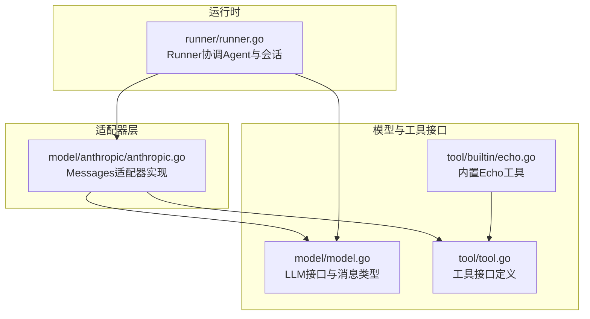
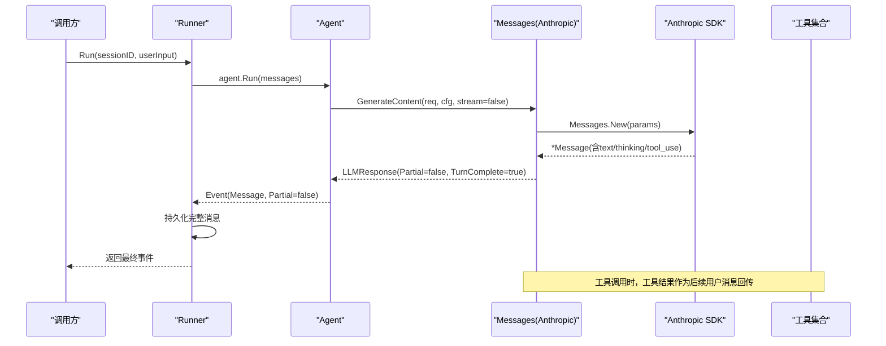
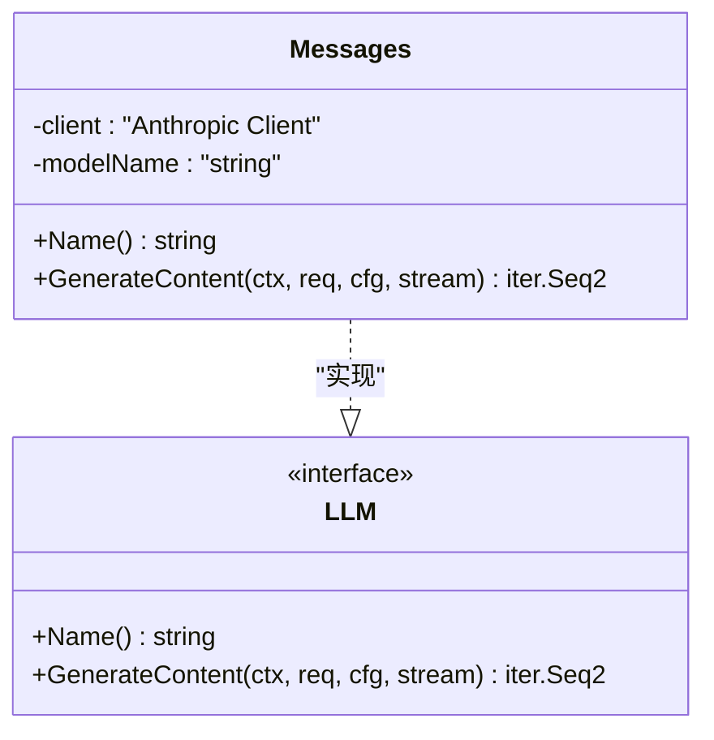
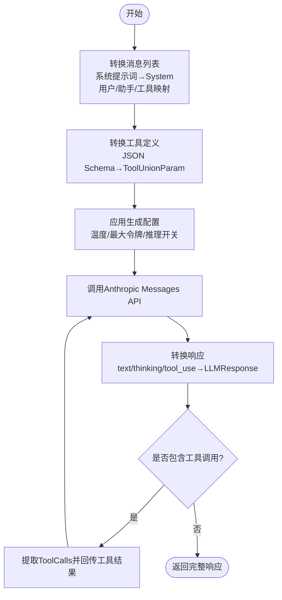
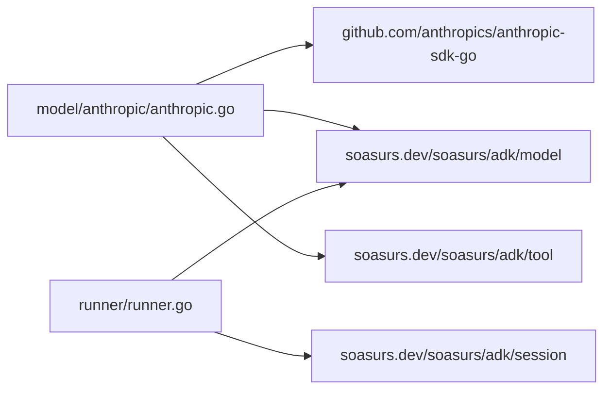

# Anthropic适配器

<cite>
**本文引用的文件**
- [anthropic.go](file://model/anthropic/anthropic.go)
- [model.go](file://model/model.go)
- [tool.go](file://tool/tool.go)
- [echo.go](file://tool/builtin/echo.go)
- [anthropic_test.go](file://model/anthropic/anthropic_test.go)
- [README.md](file://README.md)
- [runner.go](file://runner/runner.go)
</cite>

## 目录
1. [简介](#简介)
2. [项目结构](#项目结构)
3. [核心组件](#核心组件)
4. [架构总览](#架构总览)
5. [详细组件分析](#详细组件分析)
6. [依赖分析](#依赖分析)
7. [性能考虑](#性能考虑)
8. [故障排查指南](#故障排查指南)
9. [结论](#结论)
10. [附录](#附录)

## 简介
本文件系统性介绍ADK框架中的Anthropic Claude适配器实现与集成方法，重点解析其如何实现LLM接口、API密钥认证、模型参数映射、响应处理等核心功能，并深入说明Anthropic特有能力（系统提示词处理、工具调用机制、推理能力）。文档还提供完整的配置指南、流式输出处理机制说明、常见使用场景与最佳实践，以及常见问题与性能优化建议。

## 项目结构
ADK采用分层与按功能模块组织的结构：适配器位于model子包下，统一通过provider-agnostic接口对接上层Agent与Runner；工具接口位于tool子包，支持内置工具与MCP工具集；运行时由Runner协调会话存储与Agent执行。

图表来源
- [anthropic.go:1-326](file://model/anthropic/anthropic.go#L1-L326)
- [model.go:1-227](file://model/model.go#L1-L227)
- [tool.go:1-24](file://tool/tool.go#L1-L24)
- [echo.go:1-47](file://tool/builtin/echo.go#L1-L47)
- [runner.go:1-108](file://runner/runner.go#L1-L108)

章节来源
- [anthropic.go:1-326](file://model/anthropic/anthropic.go#L1-L326)
- [model.go:1-227](file://model/model.go#L1-L227)
- [tool.go:1-24](file://tool/tool.go#L1-L24)
- [echo.go:1-47](file://tool/builtin/echo.go#L1-L47)
- [runner.go:1-108](file://runner/runner.go#L1-L108)

## 核心组件
- Messages适配器：实现model.LLM接口，封装Anthropic Messages API调用，负责消息转换、工具定义映射、配置应用与响应转换。
- GenerateConfig：提供温度、最大令牌数、推理预算、推理开关等跨Provider一致的生成配置。
- 消息与工具类型：统一的消息角色、内容块、工具调用与Token用量统计。
- Runner：在会话上下文中驱动Agent，转发流式片段（Partial=true）给调用方，仅持久化完整事件（Partial=false）。

章节来源
- [anthropic.go:25-93](file://model/anthropic/anthropic.go#L25-L93)
- [model.go:67-84](file://model/model.go#L67-L84)
- [model.go:152-212](file://model/model.go#L152-L212)
- [runner.go:39-96](file://runner/runner.go#L39-L96)

## 架构总览
Anthropic适配器遵循ADK的Provider-agnostic设计：上层Agent与Runner不感知具体Provider差异，仅通过LLM接口与工具接口交互。适配器内部完成与Anthropic SDK的参数映射与响应转换。

图表来源
- [anthropic.go:47-93](file://model/anthropic/anthropic.go#L47-L93)
- [runner.go:39-96](file://runner/runner.go#L39-L96)

## 详细组件分析

### Messages适配器实现
- 初始化与认证
  - 使用API密钥创建Anthropic客户端实例，模型名称用于请求标识。
- 请求构建
  - 将model.LLMRequest转换为Anthropic Messages参数：
    - 消息列表：系统提示词提取到顶层System字段；用户/助手/工具消息分别映射为对应ContentBlock。
    - 工具定义：将tool.Tool的Definition输入Schema转换为Anthropic ToolUnionParam。
    - 配置映射：温度、最大令牌数、推理开关与预算等。
- 响应转换
  - 将Anthropic Message的Content块映射为文本内容与推理内容；若包含tool_use则提取工具调用信息；FinishReason根据StopReason映射。
- 流式输出
  - 当前实现返回单个完整响应（TurnComplete=true），未实现增量流式片段（stream=false）。

图表来源
- [anthropic.go:25-45](file://model/anthropic/anthropic.go#L25-L45)
- [model.go:10-18](file://model/model.go#L10-L18)

章节来源
- [anthropic.go:31-40](file://model/anthropic/anthropic.go#L31-L40)
- [anthropic.go:47-93](file://model/anthropic/anthropic.go#L47-L93)

### 消息与工具映射
- 系统提示词处理
  - 系统消息被提取到Messages请求的顶层System字段，避免混入对话历史。
- 用户消息映射
  - 支持纯文本与多模态（文本+图片URL/base64）；连续的工具结果会被批处理为一个用户消息。
- 助手消息映射
  - 文本内容与tool_use块分别映射；当无内容时自动填充空文本以满足Anthropic要求。
- 工具定义映射
  - 将工具的JSON Schema序列化后反序列化为Anthropic ToolInputSchemaParam，确保参数校验与调用一致性。
- 工具调用循环
  - 若FinishReason为工具调用，上层Agent或Runner需执行工具并将结果作为RoleTool消息回传，继续下一轮生成直至停止。

图表来源
- [anthropic.go:95-147](file://model/anthropic/anthropic.go#L95-L147)
- [anthropic.go:213-240](file://model/anthropic/anthropic.go#L213-L240)
- [anthropic.go:262-311](file://model/anthropic/anthropic.go#L262-L311)

章节来源
- [anthropic.go:95-147](file://model/anthropic/anthropic.go#L95-L147)
- [anthropic.go:149-211](file://model/anthropic/anthropic.go#L149-L211)
- [anthropic.go:213-240](file://model/anthropic/anthropic.go#L213-L240)
- [anthropic.go:262-311](file://model/anthropic/anthropic.go#L262-L311)

### 配置与参数映射
- 温度（Temperature）
  - 映射至Anthropic的Temperature参数，控制采样随机性。
- 最大令牌数（MaxTokens）
  - 默认值为固定常量；可由GenerateConfig覆盖。
- 推理能力（EnableThinking/ThinkingBudget）
  - EnableThinking=true时启用ThinkingConfig并设置预算；EnableThinking=false时禁用；未设置时保持默认。
- ReasoningEffort
  - Anthropic不直接支持该字段；适配器将其映射为EnableThinking的布尔语义（未设置时交由Provider决定）。
- 停止原因映射
  - EndTurn/StopSequence→stop；MaxTokens→length；ToolUse→tool_calls。

章节来源
- [anthropic.go:64-81](file://model/anthropic/anthropic.go#L64-L81)
- [anthropic.go:242-260](file://model/anthropic/anthropic.go#L242-L260)
- [anthropic.go:313-325](file://model/anthropic/anthropic.go#L313-L325)
- [model.go:67-84](file://model/model.go#L67-L84)

### 流式输出处理机制
- 当前实现
  - GenerateContent在stream=false时返回单个完整响应（Partial=false, TurnComplete=true），未产生增量片段。
- Runner行为
  - Runner仅在Partial=false时持久化消息；Partial=true片段用于实时显示但不落盘。
- 未来扩展
  - 若需要真实流式输出，可在适配器中逐块解析响应并多次yield Partial=true的LLMResponse，再在最后yieldTurnComplete=true的完整响应。

章节来源
- [anthropic.go:47-93](file://model/anthropic/anthropic.go#L47-L93)
- [runner.go:76-94](file://runner/runner.go#L76-L94)

### 工具调用机制
- 定义与调用
  - 工具定义通过convertTools将JSON Schema注入Anthropic ToolUnionParam；模型返回tool_use块时，适配器提取ID、名称与参数（JSON字符串）。
- 调用循环
  - 上层Agent或Runner收到FinishReasonToolCalls后执行工具，将结果以RoleTool消息回传，继续生成直至停止。
- 内置工具示例
  - Echo工具提供简单输入回显，Schema定义清晰，便于测试与演示。

章节来源
- [anthropic.go:213-240](file://model/anthropic/anthropic.go#L213-L240)
- [anthropic.go:262-311](file://model/anthropic/anthropic.go#L262-L311)
- [echo.go:18-33](file://tool/builtin/echo.go#L18-L33)
- [anthropic_test.go:301-349](file://model/anthropic/anthropic_test.go#L301-L349)

### 推理能力（Thinking）
- 启用方式
  - 通过GenerateConfig.EnableThinking=true启用；可设置ThinkingBudget覆盖默认预算。
- 行为特征
  - 思维过程（reasoning）以独立块形式返回，适配器将其拼接为ReasoningContent供上层使用。
- 测试验证
  - 单元测试验证了StopReason到FinishReason的映射与思维模型的ReasoningContent非空。

章节来源
- [anthropic.go:242-260](file://model/anthropic/anthropic.go#L242-L260)
- [anthropic.go:262-311](file://model/anthropic/anthropic.go#L262-L311)
- [anthropic_test.go:370-390](file://model/anthropic/anthropic_test.go#L370-L390)

## 依赖分析
- 外部SDK
  - anthropic-sdk-go：用于调用Anthropic Messages API。
- 内部接口耦合
  - Messages依赖model.LLMRequest/LLMResponse与tool.Tool接口，保证与上层解耦。
- Runner集成
  - Runner通过iter.Seq2接收事件，区分Partial与完整事件，实现流式显示与持久化分离。

图表来源
- [anthropic.go:3-16](file://model/anthropic/anthropic.go#L3-L16)
- [runner.go:3-15](file://runner/runner.go#L3-L15)

章节来源
- [anthropic.go:3-16](file://model/anthropic/anthropic.go#L3-L16)
- [runner.go:3-15](file://runner/runner.go#L3-L15)

## 性能考虑
- 最大令牌数与预算
  - 适当设置MaxTokens与ThinkingBudget，避免不必要的长输出与高成本推理。
- 工具调用批处理
  - 连续工具结果已批处理为单个用户消息，减少往返次数。
- 流式显示
  - 在需要实时反馈的场景，可考虑扩展适配器以支持Partial=true片段，降低端到端延迟。
- 会话管理
  - Runner仅持久化完整消息，有助于减少存储压力与查询开销。

## 故障排查指南
- API密钥错误
  - 确认环境变量或构造函数传入的密钥有效且具有相应权限。
- 模型名称无效
  - 使用官方可用的模型标识符；测试用例提供了参考模型名。
- 工具Schema错误
  - 确保工具定义的InputSchema合法且与调用参数匹配；适配器在转换时进行序列化/反序列化。
- 响应映射异常
  - 检查StopReason映射与Content块类型（text/thinking/tool_use）是否符合预期。
- 流式输出未生效
  - 当前实现返回单次完整响应；如需流式，请扩展适配器以支持增量yield。

章节来源
- [anthropic_test.go:35-64](file://model/anthropic/anthropic_test.go#L35-L64)
- [anthropic.go:242-260](file://model/anthropic/anthropic.go#L242-L260)
- [anthropic.go:313-325](file://model/anthropic/anthropic.go#L313-L325)

## 结论
Anthropic适配器通过统一的LLM接口与消息/工具类型，实现了与Anthropic Messages API的无缝对接。它正确处理了系统提示词、多模态输入、工具调用与推理能力，并提供了可配置的生成参数。当前版本以完整响应为主，具备扩展为真实流式的良好基础。结合Runner的事件分发与持久化策略，可构建高性能、可维护的Agent应用。

## 附录

### 快速集成步骤
- 创建Anthropic LLM实例
  - 参考示例路径：[README.md:117-123](file://README.md#L117-L123)
- 构建Agent与Runner
  - 参考示例路径：[README.md:125-186](file://README.md#L125-L186)
- 集成工具
  - 参考内置Echo工具定义：[echo.go:18-33](file://tool/builtin/echo.go#L18-L33)
- 运行与调试
  - 使用测试用例验证消息转换与工具调用：[anthropic_test.go:265-349](file://model/anthropic/anthropic_test.go#L265-L349)

### 常见使用场景与最佳实践
- 纯文本对话
  - 设置合理温度与最大令牌数，避免过度生成。
- 多模态输入
  - 使用ContentPart传递图片URL或Base64数据，注意MIME类型与图像细节级别。
- 工具调用循环
  - 在Agent或Runner中处理FinishReasonToolCalls，执行工具并将结果回传。
- 推理模型
  - 对需要逐步思考的任务，启用EnableThinking并设置合适的ThinkingBudget。

章节来源
- [README.md:117-186](file://README.md#L117-L186)
- [anthropic_test.go:370-390](file://model/anthropic/anthropic_test.go#L370-L390)