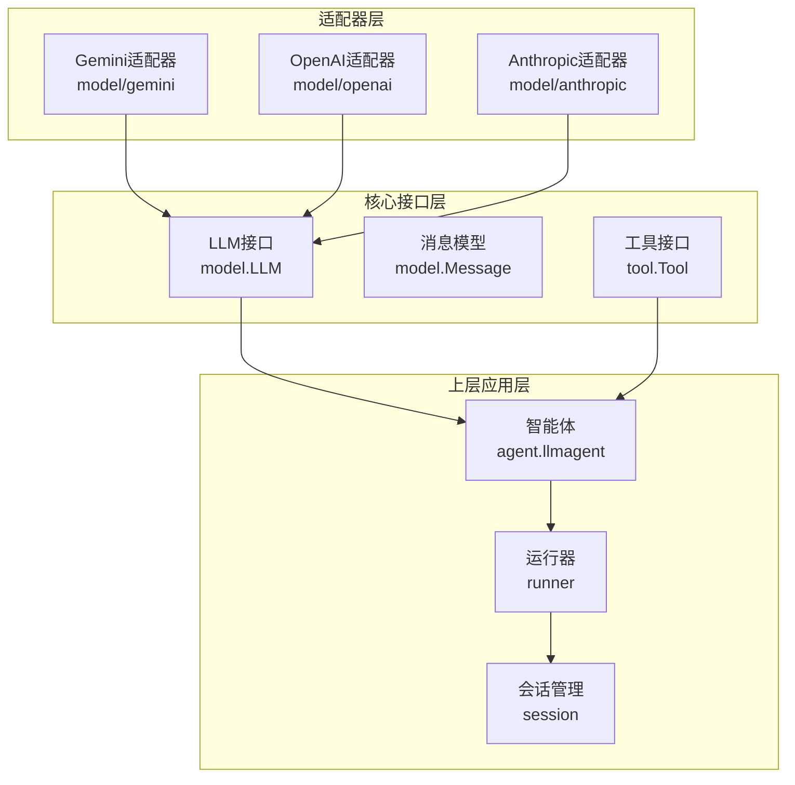
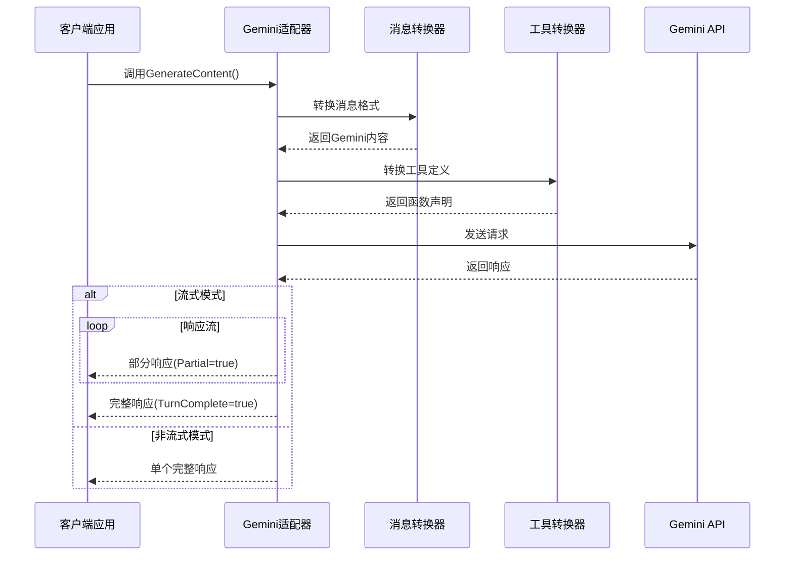
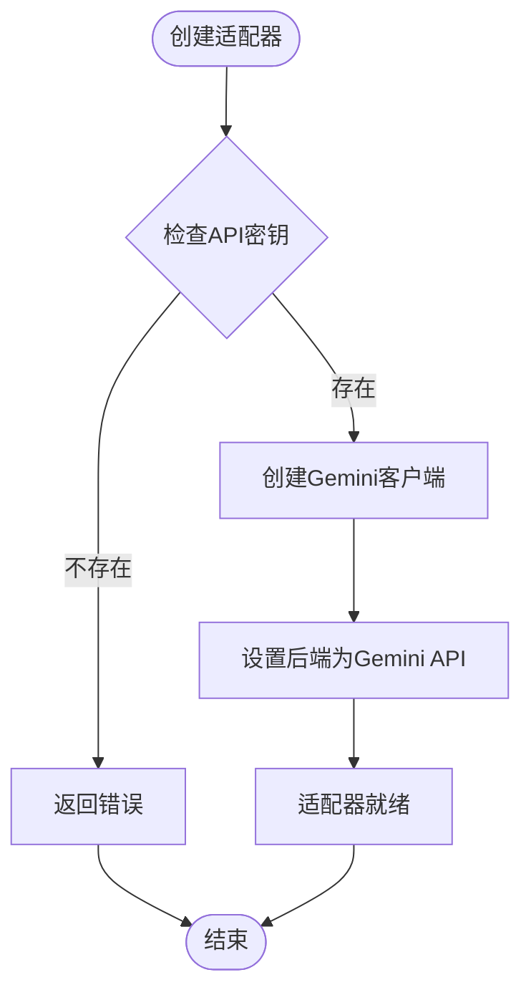
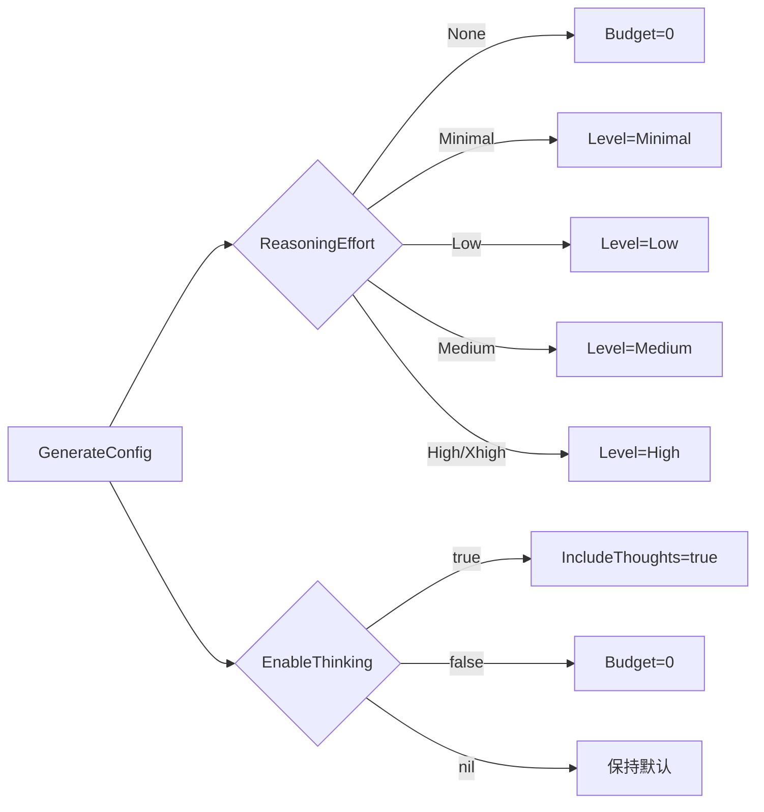
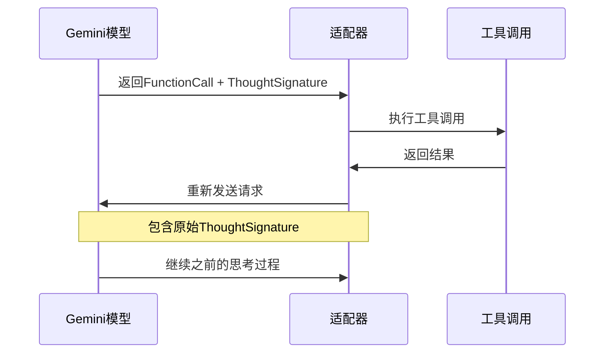
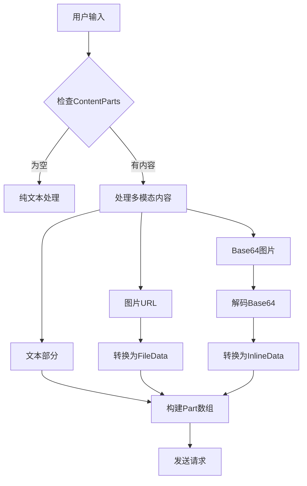
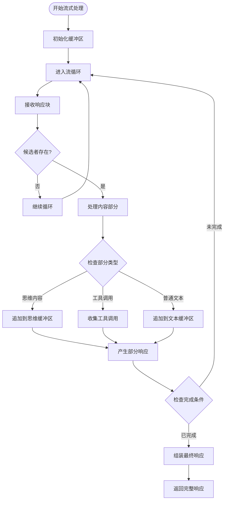
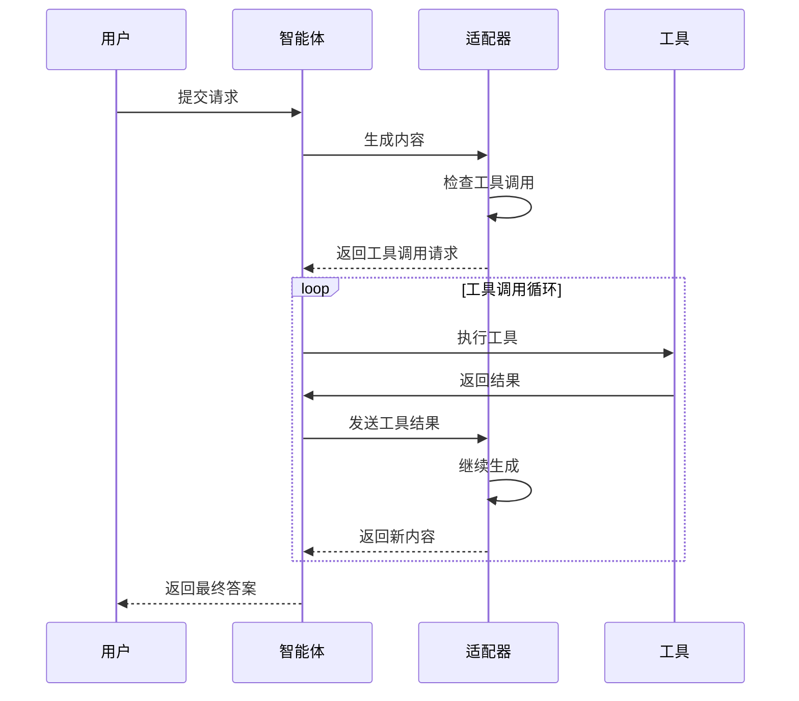
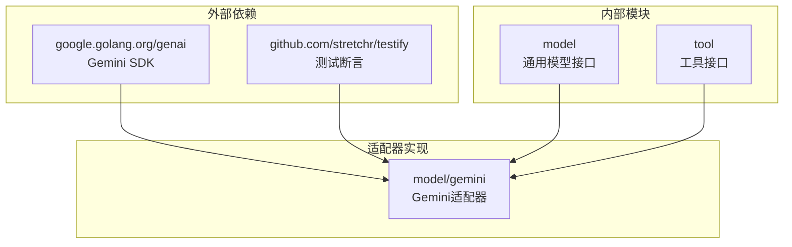

# Gemini适配器

<cite>
**本文档引用的文件**
- [gemini.go](file://model/gemini/gemini.go)
- [gemini_test.go](file://model/gemini/gemini_test.go)
- [model.go](file://model/model.go)
- [README.md](file://README.md)
- [echo.go](file://tool/builtin/echo.go)
- [tool.go](file://tool/tool.go)
- [go.mod](file://go.mod)
</cite>

## 目录
1. [简介](#简介)
2. [项目结构](#项目结构)
3. [核心组件](#核心组件)
4. [架构概览](#架构概览)
5. [详细组件分析](#详细组件分析)
6. [依赖关系分析](#依赖关系分析)
7. [性能考虑](#性能考虑)
8. [故障排除指南](#故障排除指南)
9. [结论](#结论)
10. [附录](#附录)

## 简介

ADK框架中的Google Gemini适配器是一个提供者无关的LLM接口实现，专门用于与Google Gemini大语言模型进行交互。该适配器支持两种认证模式：Gemini开发者API（通过API密钥）和Google Cloud Vertex AI（通过应用默认凭据）。它实现了完整的多模态输入处理、工具调用循环、思维签名机制以及流式响应处理功能。

## 项目结构

ADK框架采用模块化设计，Gemini适配器位于`model/gemini`包中，与OpenAI和Anthropic适配器并列。整个项目结构体现了清晰的关注点分离：



**图表来源**
- [gemini.go:1-478](file://model/gemini/gemini.go#L1-L478)
- [model.go:1-227](file://model/model.go#L1-L227)

**章节来源**
- [README.md:67-88](file://README.md#L67-L88)
- [go.mod:1-47](file://go.mod#L1-L47)

## 核心组件

Gemini适配器的核心组件包括：

### 主要数据结构

1. **GenerateContent结构体**：适配器的主要实现，封装了Gemini客户端和模型名称
2. **LLM接口实现**：提供统一的LLM调用接口
3. **消息转换器**：负责将通用消息格式转换为Gemini特定格式
4. **工具转换器**：将工具定义转换为Gemini函数声明

### 关键特性

- **双认证模式**：支持Gemini API密钥和Vertex AI应用默认凭据
- **多模态支持**：文本和图像输入的完整处理
- **思维签名机制**：Gemini内部思考过程的跟踪和恢复
- **流式响应**：实时增量输出和最终组装
- **工具调用循环**：自动执行工具调用直到停止条件

**章节来源**
- [gemini.go:17-21](file://model/gemini/gemini.go#L17-L21)
- [model.go:10-18](file://model/model.go#L10-L18)

## 架构概览

Gemini适配器采用分层架构设计，确保了良好的可扩展性和可维护性：



**图表来源**
- [gemini.go:66-201](file://model/gemini/gemini.go#L66-L201)
- [gemini.go:203-268](file://model/gemini/gemini.go#L203-L268)

## 详细组件分析

### 认证机制

Gemini适配器支持两种认证模式：

#### Gemini开发者API认证


**图表来源**
- [gemini.go:23-38](file://model/gemini/gemini.go#L23-L38)

#### Vertex AI认证
Vertex AI使用Google Cloud应用默认凭据（ADC），支持多种认证方式：
- `gcloud auth application-default login`本地开发认证
- 服务账号密钥文件（GOOGLE_APPLICATION_CREDENTIALS环境变量）
- 托管环境自动认证

**章节来源**
- [gemini.go:40-59](file://model/gemini/gemini.go#L40-L59)

### 模型选择

适配器支持多种Gemini模型：
- `gemini-2.0-flash`：快速响应模型
- `gemini-2.5-pro`：高性能推理模型
- 其他Gemini系列模型

模型选择通过构造函数的modelName参数指定，支持在运行时动态切换。

**章节来源**
- [gemini.go:24-25](file://model/gemini/gemini.go#L24-L25)

### 参数映射

Gemini适配器实现了全面的参数映射功能：

#### 温度控制
- 支持0.0到2.0范围的温度值
- 影响生成的随机性和创造性

#### 最大生成长度
- 通过MaxTokens参数限制输出长度
- 零值表示使用模型默认设置

#### 思维努力级别


**图表来源**
- [gemini.go:353-384](file://model/gemini/gemini.go#L353-L384)

**章节来源**
- [gemini.go:353-400](file://model/gemini/gemini.go#L353-L400)
- [model.go:67-84](file://model/model.go#L67-L84)

### 思维签名机制

Gemini特有的思维签名（ThoughtSignature）机制是该适配器的核心创新：

#### 思维签名的作用
- 追踪模型的内部思考过程
- 在工具调用前后保持上下文连续性
- 支持复杂的推理任务

#### 实现机制


**图表来源**
- [gemini.go:137-148](file://model/gemini/gemini.go#L137-L148)
- [gemini.go:420-431](file://model/gemini/gemini.go#L420-L431)

**章节来源**
- [model.go:130-143](file://model/model.go#L130-L143)
- [gemini.go:402-462](file://model/gemini/gemini.go#L402-L462)

### 多模态能力

Gemini适配器支持完整的多模态输入处理：

#### 文本输入
- 标准纯文本消息
- 支持系统指令和用户消息

#### 图像输入


**图表来源**
- [gemini.go:270-299](file://model/gemini/gemini.go#L270-L299)

#### 视觉细节级别
- `ImageDetailAuto`：自动选择最优质量
- `ImageDetailLow`：低质量，节省token
- `ImageDetailHigh`：高质量，更详细的分析

**章节来源**
- [gemini.go:270-299](file://model/gemini/gemini.go#L270-L299)
- [model.go:99-128](file://model/model.go#L99-L128)

### 流式响应处理

Gemini适配器实现了高效的流式响应处理机制：

#### 流式处理流程


**图表来源**
- [gemini.go:108-200](file://model/gemini/gemini.go#L108-L200)

#### 部分响应累积
- 文本内容增量累积
- 思维内容独立累积
- 工具调用信息收集
- 使用量统计更新

#### 最终响应组装
- 合并所有部分响应
- 确定最终完成原因
- 设置TurnComplete标志
- 返回完整LLMResponse

**章节来源**
- [gemini.go:108-200](file://model/gemini/gemini.go#L108-L200)

### 工具调用循环

Gemini适配器支持完整的工具调用循环，实现智能代理的核心功能：

#### 工具调用流程


**图表来源**
- [gemini_test.go:366-414](file://model/gemini/gemini_test.go#L366-L414)

**章节来源**
- [gemini_test.go:366-414](file://model/gemini/gemini_test.go#L366-L414)

## 依赖关系分析

Gemini适配器的依赖关系体现了清晰的分层设计：



**图表来源**
- [go.mod:5-14](file://go.mod#L5-L14)
- [gemini.go:3-15](file://model/gemini/gemini.go#L3-L15)

**章节来源**
- [go.mod:5-14](file://go.mod#L5-L14)

## 性能考虑

### 流式处理优化
- 使用Go迭代器避免内存峰值
- 分块处理减少网络延迟影响
- 智能缓冲区管理降低字符串拼接开销

### 思维签名处理
- 仅在需要时传递思维签名
- 避免重复传输相同上下文信息
- 支持思维过程的高效恢复

### 多模态优化
- Base64解码只在必要时进行
- 图片URL验证和缓存
- 自动质量调整减少token消耗

## 故障排除指南

### 常见问题及解决方案

#### 认证失败
- **问题**：API密钥无效或过期
- **解决**：检查环境变量设置，重新生成API密钥
- **验证**：使用简单的文本请求测试认证

#### 模型不可用
- **问题**：指定的模型名称不正确
- **解决**：确认模型名称拼写，检查可用模型列表
- **验证**：尝试使用标准模型名称如`gemini-2.0-flash`

#### 流式响应问题
- **问题**：流式输出中断或丢失
- **解决**：检查网络连接稳定性，增加超时时间
- **验证**：使用简单文本测试流式功能

#### 工具调用失败
- **问题**：工具调用返回错误
- **解决**：检查工具定义和参数格式
- **验证**：使用内置Echo工具进行测试

**章节来源**
- [gemini_test.go:37-92](file://model/gemini/gemini_test.go#L37-L92)

## 结论

ADK框架中的Gemini适配器提供了完整、高效且易于使用的Gemini集成方案。其主要优势包括：

1. **完整的多模态支持**：文本和图像输入的无缝处理
2. **先进的思维签名机制**：支持复杂的推理和思考过程
3. **灵活的认证选项**：开发者API和Vertex AI双重支持
4. **高效的流式处理**：实时响应和最佳用户体验
5. **强大的工具调用循环**：实现真正的智能代理功能

该适配器的设计充分体现了ADK框架的核心理念——提供提供者无关的抽象，使开发者能够专注于业务逻辑而非底层实现细节。

## 附录

### 配置示例

#### 基础配置
```go
// 创建Gemini适配器实例
llm, err := gemini.New(ctx, apiKey, "gemini-2.0-flash")

// 或使用Vertex AI
llm, err := gemini.NewVertexAI(ctx, project, location, "gemini-2.0-flash")
```

#### 高级配置
```go
cfg := &model.GenerateConfig{
    Temperature: 0.7,
    ReasoningEffort: model.ReasoningEffortHigh,
    MaxTokens: 1000,
    EnableThinking: boolPtr(true),
}

resp, err := llm.GenerateContent(ctx, request, cfg, false)
```

#### 多模态输入示例
```go
msg := model.Message{
    Role: model.RoleUser,
    Parts: []model.ContentPart{
        {
            Type: model.ContentPartTypeText,
            Text: "描述这张图片",
        },
        {
            Type: model.ContentPartTypeImageURL,
            ImageURL: "https://example.com/image.jpg",
            ImageDetail: model.ImageDetailHigh,
        },
    },
}
```

### 实际使用案例

#### 简单聊天应用
```go
// 创建基础聊天应用
messages := []model.Message{
    {Role: model.RoleUser, Content: "你好！"},
}

resp, err := llm.GenerateContent(ctx, &model.LLMRequest{
    Model: llm.Name(),
    Messages: messages,
}, nil, false)
```

#### 工具驱动的智能代理
```go
// 配置工具集
tools := []tool.Tool{
    builtin.NewEchoTool(),
    // 添加更多工具...
}

messages := []model.Message{
    {Role: model.RoleUser, Content: "请帮我计算12乘以13"},
}

// 执行工具调用循环
for {
    resp, err := llm.GenerateContent(ctx, &model.LLMRequest{
        Model: llm.Name(),
        Messages: messages,
        Tools: tools,
    }, nil, false)
    
    if resp.FinishReason == model.FinishReasonStop {
        break
    }
    
    // 处理工具调用
    for _, toolCall := range resp.Message.ToolCalls {
        result := executeTool(toolCall)
        messages = append(messages, model.Message{
            Role: model.RoleTool,
            Content: result,
            ToolCallID: toolCall.ID,
        })
    }
}
```