# LLM接口规范

<cite>
**本文档引用的文件**
- [model.go](file://model/model.go)
- [openai.go](file://model/openai/openai.go)
- [anthropic.go](file://model/anthropic/anthropic.go)
- [gemini.go](file://model/gemini/gemini.go)
- [llmagent.go](file://agent/llmagent/llmagent.go)
- [main.go](file://examples/chat/main.go)
- [README.md](file://README.md)
</cite>

## 更新摘要
**变更内容**
- 补充了OpenAI、Gemini、Anthropic三大提供商的详细配置文档
- 新增了各提供商的参数映射逻辑和配置选项详解
- 增强了思维配置映射的详细说明
- 完善了多模态内容支持的实现细节
- 添加了流式输出机制的具体实现

## 目录
1. [简介](#简介)
2. [项目结构](#项目结构)
3. [核心组件](#核心组件)
4. [架构概览](#架构概览)
5. [详细组件分析](#详细组件分析)
6. [提供商特定配置](#提供商特定配置)
7. [依赖关系分析](#依赖关系分析)
8. [性能考虑](#性能考虑)
9. [故障排除指南](#故障排除指南)
10. [结论](#结论)
11. [附录](#附录)

## 简介

ADK（Agent Development Kit）框架提供了一个统一的LLM（大型语言模型）接口规范，允许开发者在不修改业务逻辑的情况下切换不同的LLM提供商。该框架的核心目标是实现"供应商无关"的LLM接口，支持OpenAI、Google Gemini和Anthropic Claude等多种主流LLM服务。

本规范文档详细阐述了LLM接口的设计理念、数据结构定义、实现要求以及最佳实践，为开发者提供完整的技术指导。特别针对三大主流提供商（OpenAI、Gemini、Anthropic）提供了详细的配置映射文档和参数转换逻辑。

## 项目结构

ADK框架采用模块化设计，主要包含以下核心目录结构：

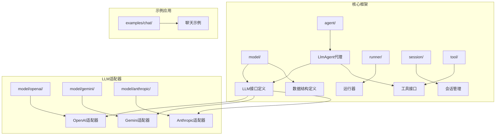

**图表来源**
- [model.go:10-18](file://model/model.go#L10-L18)
- [openai.go:19-42](file://model/openai/openai.go#L19-L42)
- [gemini.go:17-64](file://model/gemini/gemini.go#L17-L64)
- [anthropic.go:25-45](file://model/anthropic/anthropic.go#L25-L45)

**章节来源**
- [README.md:67-89](file://README.md#L67-L89)

## 核心组件

### LLM接口定义

LLM接口是整个框架的核心抽象层，定义了与LLM交互的标准方式：

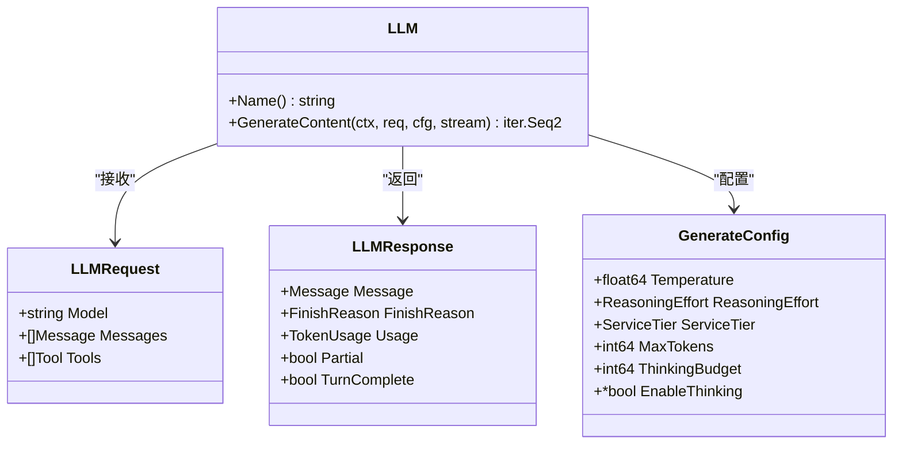

**图表来源**
- [model.go:11-18](file://model/model.go#L11-L18)
- [model.go:188-196](file://model/model.go#L188-L196)
- [model.go:198-212](file://model/model.go#L198-L212)
- [model.go:67-84](file://model/model.go#L67-L84)

### 数据结构层次

框架定义了完整的数据结构层次，从基础类型到复杂对象：

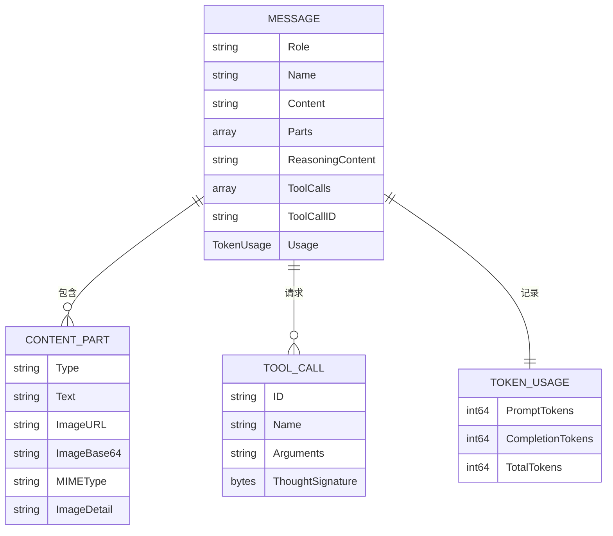

**图表来源**
- [model.go:152-178](file://model/model.go#L152-L178)
- [model.go:109-128](file://model/model.go#L109-L128)
- [model.go:130-143](file://model/model.go#L130-L143)
- [model.go:145-150](file://model/model.go#L145-L150)

**章节来源**
- [model.go:10-227](file://model/model.go#L10-L227)

## 架构概览

ADK框架采用分层架构设计，实现了清晰的关注点分离：

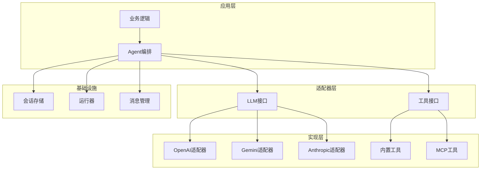

**图表来源**
- [README.md:39-59](file://README.md#L39-L59)
- [llmagent.go:30-34](file://agent/llmagent/llmagent.go#L30-L34)

## 详细组件分析

### OpenAI适配器实现

OpenAI适配器提供了完整的LLM接口实现，支持流式和非流式响应：

#### 核心方法实现

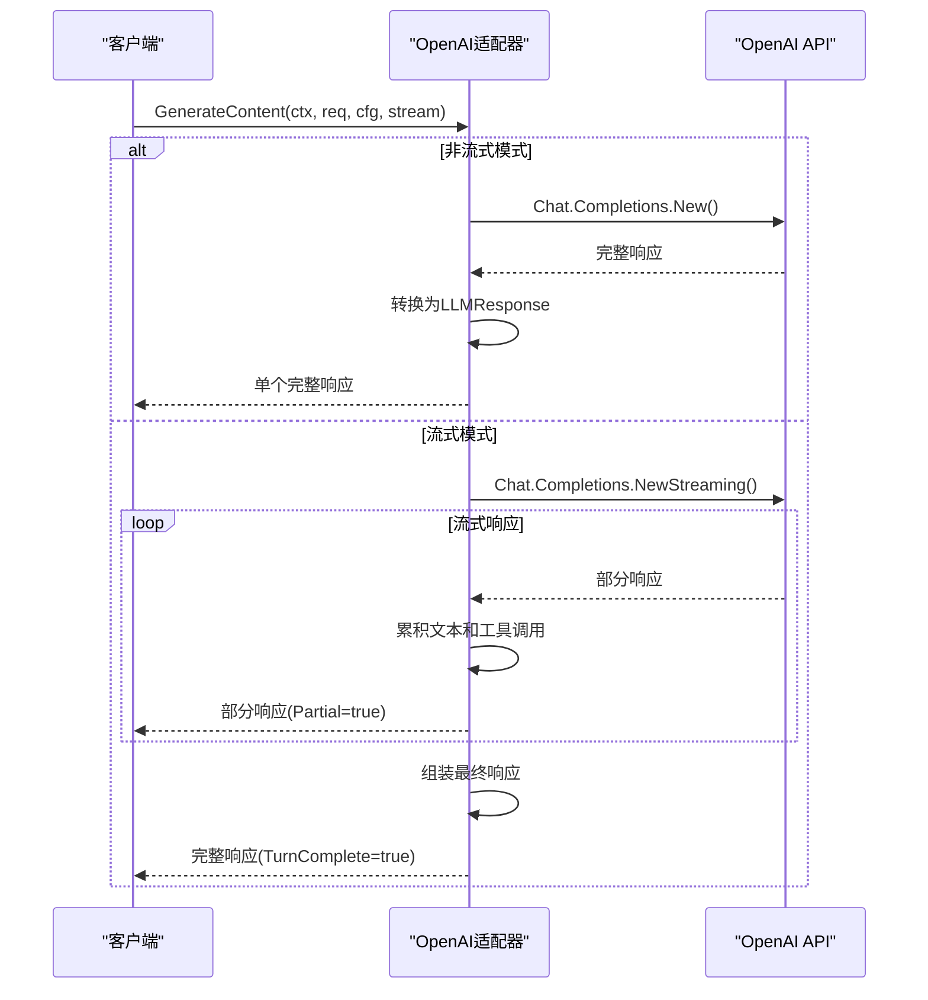

**图表来源**
- [openai.go:48-164](file://model/openai/openai.go#L48-L164)

#### 配置映射机制

OpenAI适配器实现了复杂的配置映射逻辑：

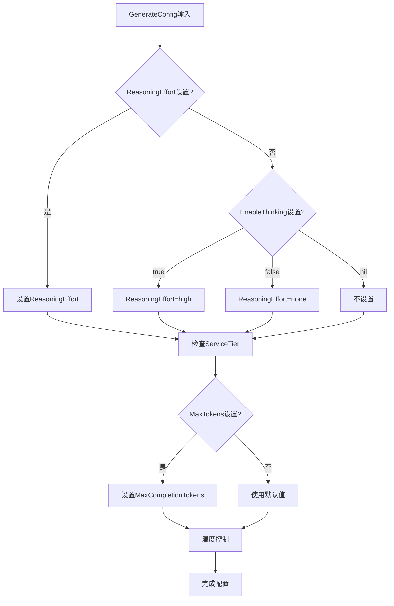

**图表来源**
- [openai.go:279-304](file://model/openai/openai.go#L279-L304)

**章节来源**
- [openai.go:19-362](file://model/openai/openai.go#L19-L362)

### Gemini适配器实现

Gemini适配器支持Google Cloud AI Platform和Vertex AI两种后端：

#### 多后端支持

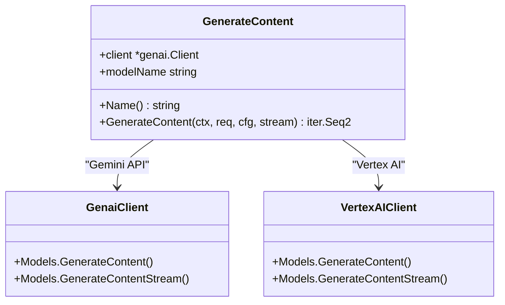

**图表来源**
- [gemini.go:17-59](file://model/gemini/gemini.go#L17-L59)

#### 思维配置映射

Gemini适配器实现了最复杂的思维配置映射：

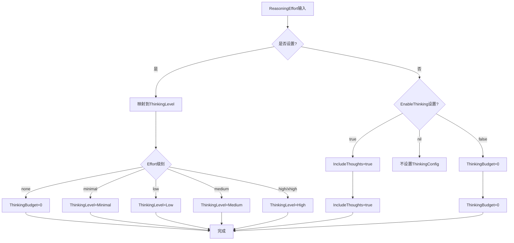

**图表来源**
- [gemini.go:353-400](file://model/gemini/gemini.go#L353-L400)

**章节来源**
- [gemini.go:17-478](file://model/gemini/gemini.go#L17-L478)

### Anthropic适配器实现

Anthropic适配器专注于Claude系列模型的支持：

#### 消息转换机制

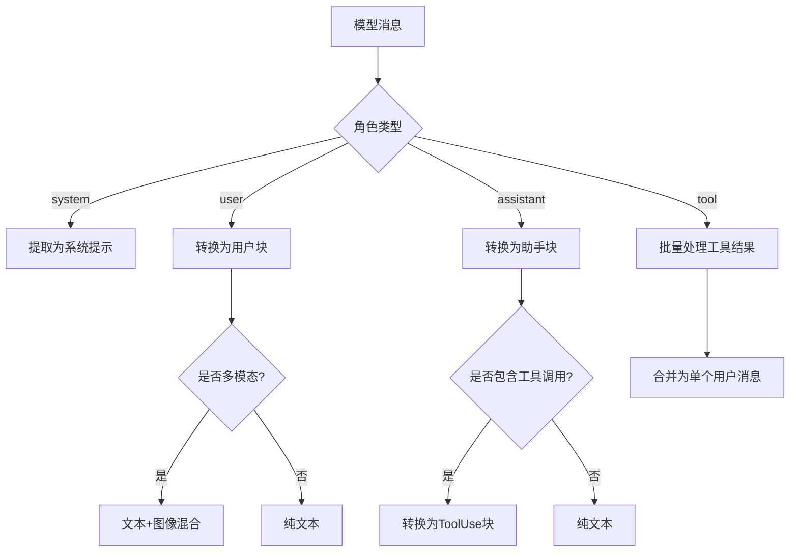

**图表来源**
- [anthropic.go:98-147](file://model/anthropic/anthropic.go#L98-L147)

**章节来源**
- [anthropic.go:25-326](file://model/anthropic/anthropic.go#L25-L326)

### LlmAgent代理实现

LlmAgent实现了完整的工具调用循环逻辑：

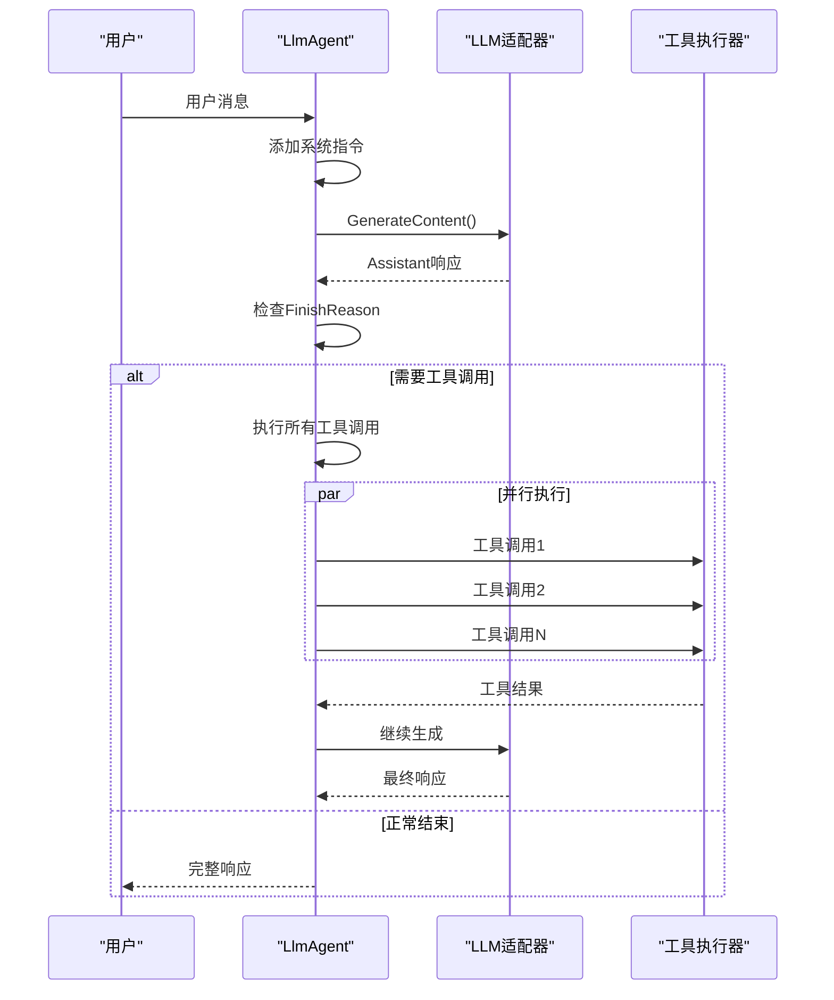

**图表来源**
- [llmagent.go:56-136](file://agent/llmagent/llmagent.go#L56-L136)

**章节来源**
- [llmagent.go:30-159](file://agent/llmagent/llmagent.go#L30-L159)

## 提供商特定配置

### OpenAI配置映射详解

OpenAI适配器支持多种配置参数的精确映射：

#### 温度控制
- **Temperature**: 直接映射到OpenAI的temperature参数
- **范围**: 0.0-2.0（具体取决于模型）
- **影响**: 控制生成的随机性和创造性

#### 推理努力映射
- **ReasoningEffortNone**: 映射到"none"
- **ReasoningEffortMinimal**: 映射到"minimal"  
- **ReasoningEffortLow**: 映射到"low"
- **ReasoningEffortMedium**: 映射到"medium"
- **ReasoningEffortHigh**: 映射到"high"
- **ReasoningEffortXhigh**: 映射到"xhigh"

#### 思维开关映射
- **EnableThinking=true**: 设置reasoning_effort="high"
- **EnableThinking=false**: 设置reasoning_effort="none"
- **EnableThinking=nil**: 不设置reasoning_effort，由提供商决定

#### 服务层级
- **ServiceTierAuto**: 自动选择
- **ServiceTierDefault**: 默认服务
- **ServiceTierFlex**: 弹性服务
- **ServiceTierScale**: 扩展服务
- **ServiceTierPriority**: 优先服务

**章节来源**
- [openai.go:279-304](file://model/openai/openai.go#L279-L304)

### Gemini配置映射详解

Gemini适配器提供了最复杂的思维配置映射：

#### 思维配置映射表

| GenerateConfig | Gemini ThinkingConfig | 说明 |
|---------------|---------------------|------|
| ReasoningEffortNone | ThinkingBudget=0 | 禁用思维 |
| ReasoningEffortMinimal | IncludeThoughts=true, ThinkingLevel=Minimal | 最小思维 |
| ReasoningEffortLow | IncludeThoughts=true, ThinkingLevel=Low | 低思维 |
| ReasoningEffortMedium | IncludeThoughts=true, ThinkingLevel=Medium | 中等思维 |
| ReasoningEffortHigh | IncludeThoughts=true, ThinkingLevel=High | 高思维 |
| ReasoningEffortXhigh | IncludeThoughts=true, ThinkingLevel=High | 超高思维 |
| EnableThinking=true | IncludeThoughts=true | 启用思维 |
| EnableThinking=false | ThinkingBudget=0 | 禁用思维 |
| EnableThinking=nil | 不设置 | 由提供商决定 |

#### 思维预算配置
- **ThinkingBudget**: 控制思维过程的token预算
- **默认值**: 3000（当EnableThinking=true且未指定时）
- **最小值**: 1024
- **最大值**: MaxTokens-1

#### 输出限制
- **MaxOutputTokens**: 映射到MaxTokens
- **默认值**: 4096
- **范围**: 1-可能的模型上限

**章节来源**
- [gemini.go:353-400](file://model/gemini/gemini.go#L353-L400)

### Anthropic配置映射详解

Anthropic适配器专注于简洁的思维控制：

#### 思维配置映射

| GenerateConfig | Anthropic ThinkingConfig | 说明 |
|---------------|------------------------|------|
| ReasoningEffortNone | Thinking=Disabled | 禁用思维 |
| ReasoningEffort* | Thinking=Enabled | 启用思维 |
| EnableThinking=true | Thinking=Enabled | 启用思维 |
| EnableThinking=false | Thinking=Disabled | 禁用思维 |
| EnableThinking=nil | 不设置 | 由提供商决定 |

#### 默认配置
- **MaxTokens**: 默认4096，可被GenerateConfig覆盖
- **ThinkingBudget**: 默认3000，可被ThinkingBudget覆盖
- **Temperature**: 直接映射到Anthropic的temperature

#### 思维预算规则
- **最小值**: 1024
- **最大值**: MaxTokens-1
- **必须**: ThinkingBudget ≥ 1024

**章节来源**
- [anthropic.go:242-260](file://model/anthropic/anthropic.go#L242-L260)

### 多模态内容支持

#### OpenAI多模态支持
- **文本内容**: ContentPartTypeText
- **图片URL**: ContentPartTypeImageURL
- **Base64图片**: ContentPartTypeImageBase64
- **图片细节**: ImageDetail（auto/low/high）

#### Gemini多模态支持
- **文本内容**: Text
- **文件数据**: FileData（支持HTTPS URL）
- **内联数据**: InlineData（Base64编码）
- **图片细节**: 通过ImageDetail控制

#### Anthropic多模态支持
- **文本内容**: TextBlockParam
- **图片URL**: URLImageSourceParam
- **Base64图片**: Base64ImageSourceParam
- **媒体类型**: Base64ImageSourceMediaType

**章节来源**
- [openai.go:186-210](file://model/openai/openai.go#L186-L210)
- [gemini.go:271-299](file://model/gemini/gemini.go#L271-L299)
- [anthropic.go:149-184](file://model/anthropic/anthropic.go#L149-L184)

## 依赖关系分析

### 外部依赖管理

框架通过Go模块系统管理外部依赖：

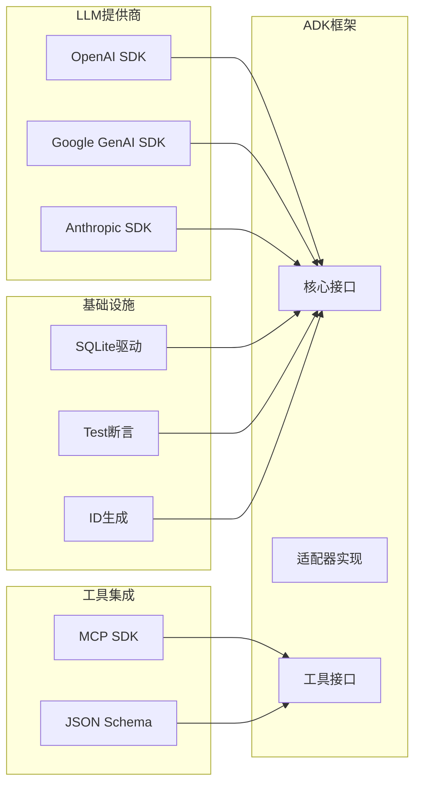

**图表来源**
- [README.md:380-393](file://README.md#L380-L393)

### 内部模块依赖

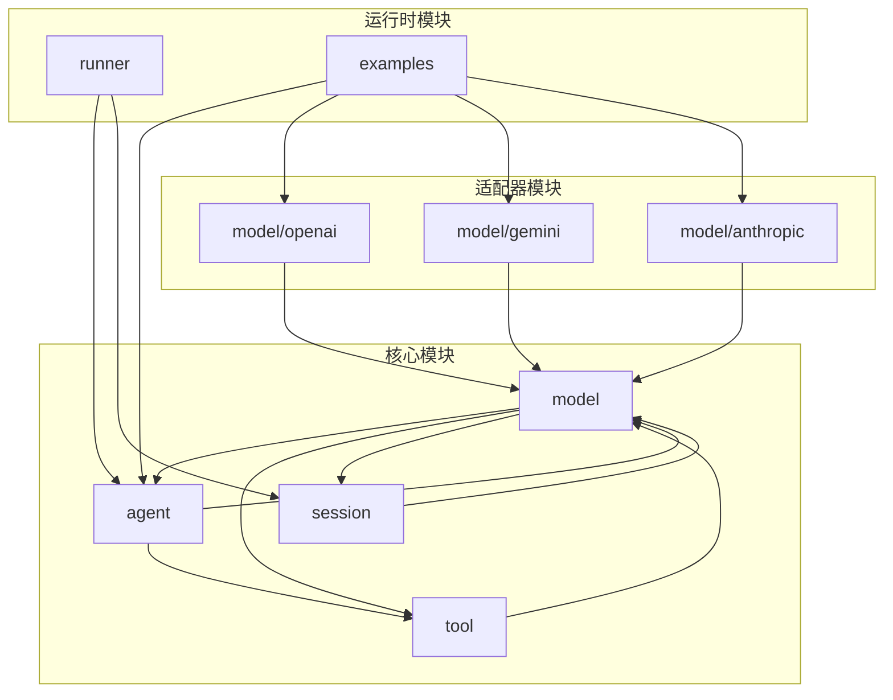

**图表来源**
- [README.md:67-89](file://README.md#L67-L89)

**章节来源**
- [README.md:380-393](file://README.md#L380-L393)

## 性能考虑

### 流式处理优化

框架通过Go迭代器实现了高效的流式处理：

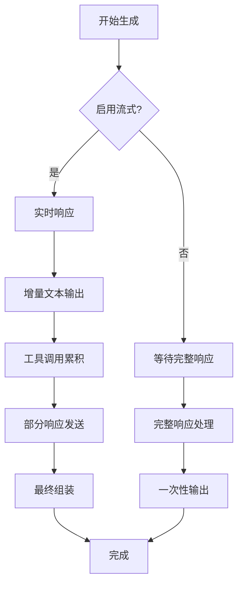

### 资源管理策略

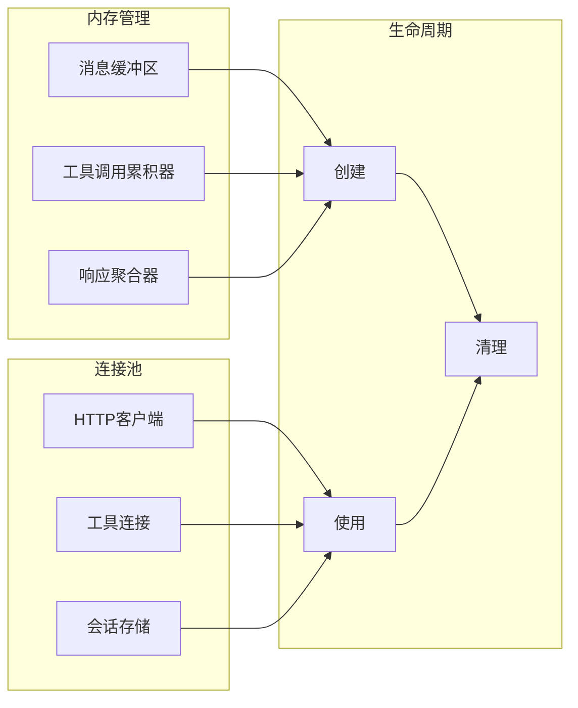

## 故障排除指南

### 常见问题诊断

#### LLM接口实现验证

```mermaid
flowchart TD
A[实现验证] --> B{Name方法}
B --> |未实现| C[错误: Name()缺失]
B --> |实现| D{GenerateContent方法}
D --> |签名错误| E[错误: 参数类型不符]
D --> |实现| F{流式支持}
F --> |不支持| G[警告: 流式功能不可用]
F --> |支持| H[验证完成]
E --> I[修复实现]
G --> J[检查适配器]
I --> K[重新测试]
J --> K
K --> L[通过验证]
```

#### 错误处理最佳实践

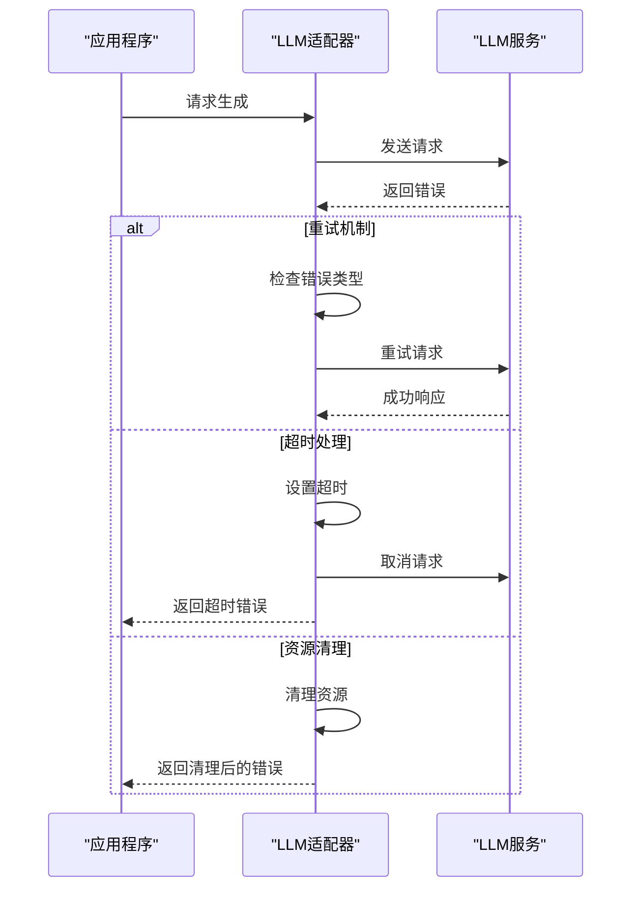

**章节来源**
- [openai.go:48-164](file://model/openai/openai.go#L48-L164)
- [gemini.go:70-201](file://model/gemini/gemini.go#L70-L201)
- [anthropic.go:50-93](file://model/anthropic/anthropic.go#L50-L93)

## 结论

ADK框架的LLM接口规范提供了一个强大而灵活的抽象层，实现了以下关键特性：

1. **供应商无关性**：统一的接口设计允许无缝切换不同的LLM提供商
2. **流式处理**：原生支持增量响应，提升用户体验
3. **工具集成**：完整的工具调用循环，支持复杂的AI代理工作流
4. **配置灵活性**：丰富的配置选项支持精细化的模型控制
5. **错误处理**：健壮的错误处理和恢复机制
6. **多模态支持**：完整的文本和图像内容处理能力
7. **思维配置**：针对不同提供商的思维能力映射

该规范为构建生产级AI代理应用奠定了坚实的基础，既保证了开发效率，又确保了系统的可维护性和扩展性。

## 附录

### 实现示例路径

#### 基础LLM实现
- [OpenAI适配器:19-42](file://model/openai/openai.go#L19-L42)
- [Gemini适配器:17-64](file://model/gemini/gemini.go#L17-L64)
- [Anthropic适配器:25-45](file://model/anthropic/anthropic.go#L25-L45)

#### 高级功能实现
- [流式响应处理:88-164](file://model/openai/openai.go#L88-L164)
- [工具调用循环:78-136](file://agent/llmagent/llmagent.go#L78-L136)
- [配置映射:353-400](file://model/gemini/gemini.go#L353-L400)

#### 完整示例
- [聊天应用示例:52-177](file://examples/chat/main.go#L52-L177)

### 配置选项参考

| 配置项 | 类型 | 描述 | 默认值 | OpenAI | Gemini | Anthropic |
|--------|------|------|--------|--------|--------|-----------|
| Temperature | float64 | 控制生成随机性 | 0.0（使用提供商默认） | ✅ 直接映射 | ✅ 直接映射 | ✅ 直接映射 |
| ReasoningEffort | ReasoningEffort | 推理努力级别 | ""（不设置） | ✅ reasoning_effort | ✅ ThinkingConfig | ❌ 不支持 |
| ServiceTier | ServiceTier | 服务层级 | ""（自动选择） | ✅ service_tier | ❌ 不支持 | ❌ 不支持 |
| MaxTokens | int64 | 最大生成令牌数 | 0（使用提供商默认） | ✅ max_completion_tokens | ✅ max_output_tokens | ✅ max_tokens |
| ThinkingBudget | int64 | 思维预算 | 0（使用提供商默认） | ✅ enable_thinking | ✅ ThinkingConfig | ✅ ThinkingConfig |
| EnableThinking | *bool | 启用内部思考 | nil（交由提供商决定） | ✅ enable_thinking | ✅ ThinkingConfig | ✅ ThinkingConfig |

### 思维配置映射表

#### OpenAI思维映射
- **ReasoningEffort=None**: reasoning_effort="none"
- **ReasoningEffort=High/Xhigh**: reasoning_effort="high"
- **EnableThinking=true**: reasoning_effort="high"
- **EnableThinking=false**: reasoning_effort="none"

#### Gemini思维映射
- **ReasoningEffort=None**: ThinkingBudget=0
- **ReasoningEffort=Minimal/Low/Medium/High/Xhigh**: IncludeThoughts=true + 对应ThinkingLevel
- **EnableThinking=true**: IncludeThoughts=true
- **EnableThinking=false**: ThinkingBudget=0

#### Anthropic思维映射
- **ReasoningEffort=None**: Thinking=Disabled
- **ReasoningEffort!=None**: Thinking=Enabled
- **EnableThinking=true**: Thinking=Enabled
- **EnableThinking=false**: Thinking=Disabled
- **EnableThinking=nil**: 不设置

### 多模态内容支持对比

#### OpenAI支持
- 文本内容：ContentPartTypeText
- 图片URL：ContentPartTypeImageURL
- Base64图片：ContentPartTypeImageBase64
- 图片细节：ImageDetail（auto/low/high）

#### Gemini支持
- 文本内容：Text
- 文件数据：FileData（HTTPS URL）
- 内联数据：InlineData（Base64编码）
- 图片细节：通过ImageDetail控制

#### Anthropic支持
- 文本内容：TextBlockParam
- 图片URL：URLImageSourceParam
- Base64图片：Base64ImageSourceParam
- 媒体类型：Base64ImageSourceMediaType