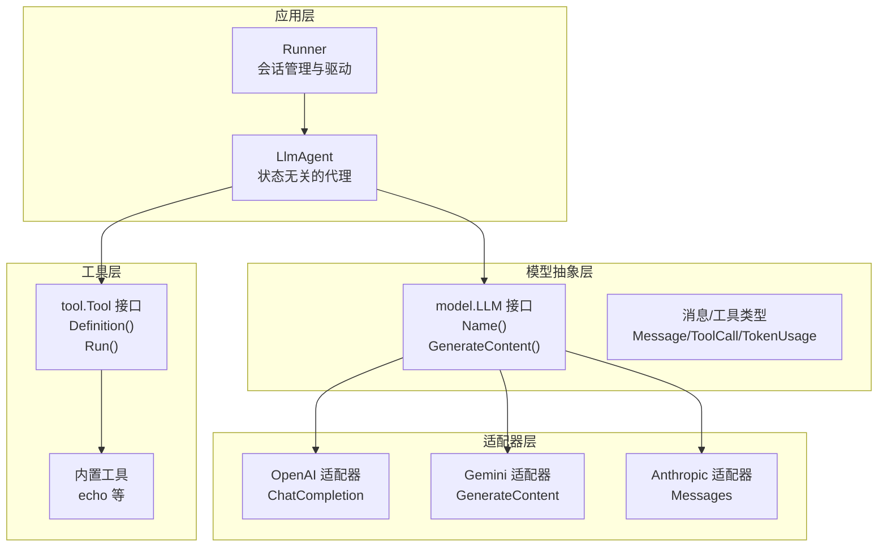
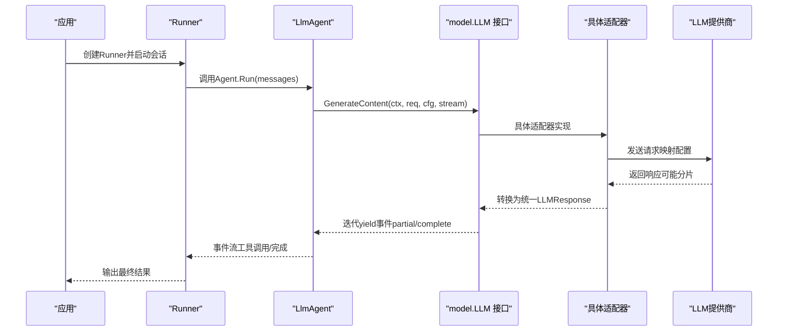
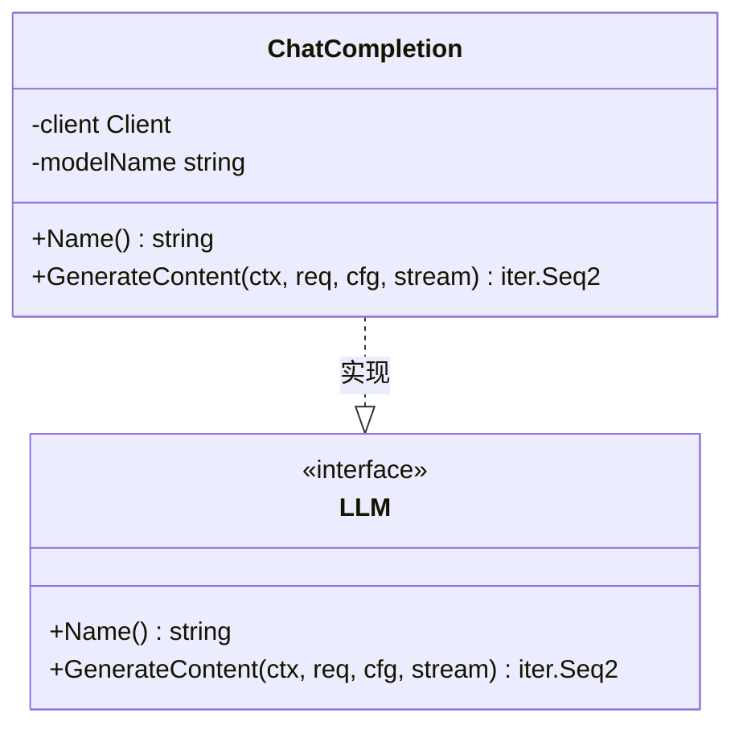
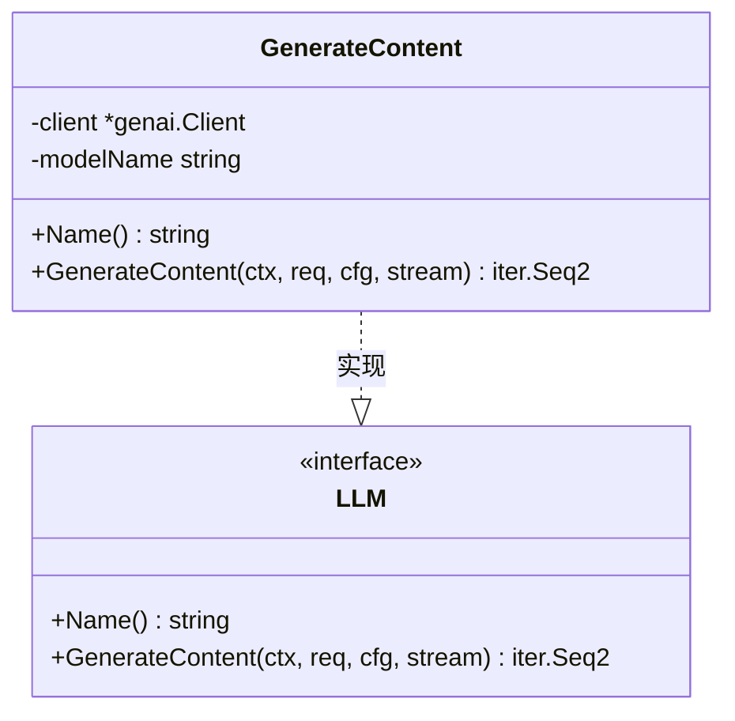
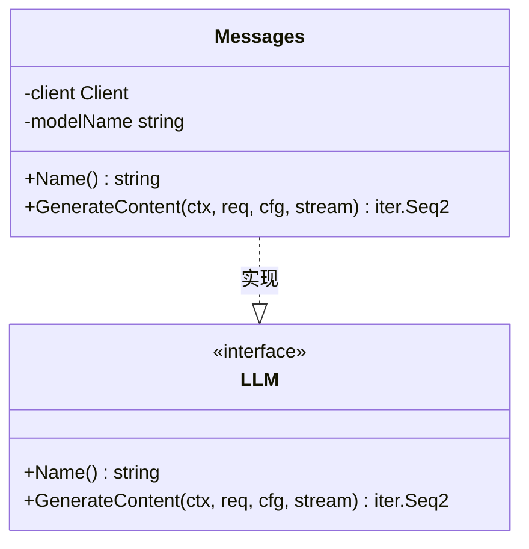
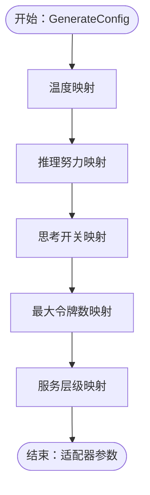
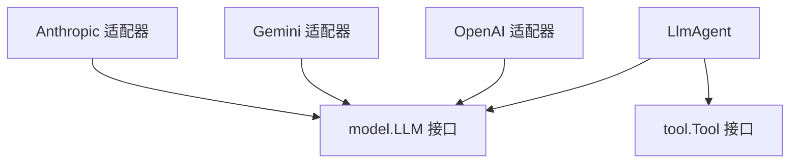

# LLM适配器

<cite>
**本文档引用的文件**
- [model.go](file://model/model.go)
- [openai.go](file://model/openai/openai.go)
- [gemini.go](file://model/gemini/gemini.go)
- [anthropic.go](file://model/anthropic/anthropic.go)
- [openai_test.go](file://model/openai/openai_test.go)
- [gemini_test.go](file://model/gemini/gemini_test.go)
- [anthropic_test.go](file://model/anthropic/anthropic_test.go)
- [llmagent.go](file://agent/llmagent/llmagent.go)
- [tool.go](file://tool/tool.go)
- [main.go](file://examples/chat/main.go)
- [README.md](file://README.md)
</cite>

## 目录
1. [简介](#简介)
2. [项目结构](#项目结构)
3. [核心组件](#核心组件)
4. [架构总览](#架构总览)
5. [详细组件分析](#详细组件分析)
6. [依赖关系分析](#依赖关系分析)
7. [性能考虑](#性能考虑)
8. [故障排除指南](#故障排除指南)
9. [结论](#结论)
10. [附录](#附录)

## 简介
本文件全面介绍ADK框架的LLM适配器系统，展示如何为不同的大语言模型提供商创建适配器。文档重点说明LLM接口的设计规范（Name()、Generate()方法的实现要求），深入解析OpenAI、Gemini、Anthropic三个主要适配器的实现细节，展示它们如何遵循统一的接口规范。同时提供自定义LLM适配器的开发指南，包括认证配置、请求参数映射、响应处理等关键环节，并解释生成配置选项如温度、推理努力和服务层级的跨供应商映射机制。最后包含完整的代码示例路径和最佳实践，帮助开发者快速集成新的LLM提供商。

## 项目结构
ADK框架采用分层设计，核心抽象位于model包，具体适配器分别位于model/openai、model/gemini、model/anthropic子包中。适配器通过统一的model.LLM接口与上层Agent解耦，支持多模态输入、工具调用循环、流式输出等功能。

**图表来源**
- [llmagent.go:30-46](file://agent/llmagent/llmagent.go#L30-L46)
- [model.go:10-18](file://model/model.go#L10-L18)
- [openai.go:19-42](file://model/openai/openai.go#L19-L42)
- [gemini.go:17-64](file://model/gemini/gemini.go#L17-L64)
- [anthropic.go:25-45](file://model/anthropic/anthropic.go#L25-L45)

**章节来源**
- [README.md:67-89](file://README.md#L67-L89)
- [model.go:10-227](file://model/model.go#L10-L227)

## 核心组件
本节概述LLM适配器系统的核心抽象与数据结构，为后续适配器实现提供规范参考。

- LLM接口：定义Name()与GenerateContent()两个核心方法，确保不同提供商的实现遵循统一规范。
- 消息与内容：支持文本与多模态内容（图片），并区分角色（system/user/assistant/tool）。
- 工具调用：通过ToolCall结构描述函数调用，支持跨适配器一致的工具发现与执行。
- 生成配置：统一的GenerateConfig用于控制温度、推理努力、服务层级、最大令牌数等参数。
- 流式输出：GenerateContent返回Go迭代器，支持增量事件与完整消息的区分。

**章节来源**
- [model.go:10-227](file://model/model.go#L10-L227)

## 架构总览
下图展示了从应用到LLM适配器的整体调用链路，以及Agent如何通过统一接口驱动不同提供商的模型。

**图表来源**
- [llmagent.go:60-136](file://agent/llmagent/llmagent.go#L60-L136)
- [model.go:10-18](file://model/model.go#L10-L18)

## 详细组件分析

### OpenAI适配器
OpenAI适配器通过ChatCompletion实现model.LLM接口，负责将统一的消息与工具结构转换为OpenAI SDK期望的参数，并处理流式与非流式的响应。

- 认证与初始化：支持API密钥与可选的基础URL覆盖，便于兼容其他OpenAI兼容服务。
- 请求映射：
  - 消息映射：system/user/assistant/tool角色分别映射到OpenAI对应的消息类型；用户消息支持文本与图片（URL或base64）。
  - 工具映射：将tool.Tool定义转换为OpenAI函数工具，Schema通过JSON Schema序列化传递。
  - 配置映射：温度、最大令牌数、推理努力、服务层级等参数映射至OpenAI参数；当未设置推理努力且明确禁用思考时，注入enable_thinking=false以兼容DeepSeek/Qwen等。
- 响应处理：
  - 非流式：直接返回单个完整LLMResponse。
  - 流式：累积增量文本与工具调用片段，最终组装完整响应；finish_reason映射为统一FinishReason。
  - ReasoningContent：从原始JSON中提取reasoning_content字段（适用于DeepSeek-R1等推理模型）。
- 错误处理：对消息转换、工具转换、SDK调用错误进行包装，便于上层定位问题。

**图表来源**
- [openai.go:19-42](file://model/openai/openai.go#L19-L42)
- [model.go:10-18](file://model/model.go#L10-L18)

**章节来源**
- [openai.go:25-37](file://model/openai/openai.go#L25-L37)
- [openai.go:44-164](file://model/openai/openai.go#L44-L164)
- [openai.go:166-243](file://model/openai/openai.go#L166-L243)
- [openai.go:245-277](file://model/openai/openai.go#L245-L277)
- [openai.go:279-304](file://model/openai/openai.go#L279-L304)
- [openai.go:306-345](file://model/openai/openai.go#L306-L345)
- [openai.go:347-361](file://model/openai/openai.go#L347-L361)

### Gemini适配器
Gemini适配器通过GenerateContent实现model.LLM接口，支持Gemini API与Vertex AI两种后端，具备强大的多模态与思考能力。

- 认证与初始化：
  - Gemini API：使用API密钥初始化genai客户端。
  - Vertex AI：通过项目ID、区域与ADC认证初始化客户端。
- 请求映射：
  - 消息映射：system指令提取为独立SystemInstruction；用户消息支持文本与图片（URL或base64），助手消息支持文本与函数调用；工具结果批量合并为用户消息以便正确传递给模型。
  - 工具映射：将tool.Tool定义转换为FunctionDeclarations，Schema通过ParametersJsonSchema传递。
  - 配置映射：温度、最大输出令牌数、推理努力映射为ThinkingConfig；推理努力到ThinkingLevel映射（minimal/low/medium/high/xhigh）。
- 响应处理：
  - 流式：支持文本与内部思考（thought）增量输出；工具调用通过FunctionCall部分识别；finish_reason映射为统一FinishReason。
  - 非流式：直接返回单个完整LLMResponse。
- 错误处理：对消息转换、工具转换、SDK调用错误进行包装。

**图表来源**
- [gemini.go:17-64](file://model/gemini/gemini.go#L17-L64)
- [model.go:10-18](file://model/model.go#L10-L18)

**章节来源**
- [gemini.go:23-59](file://model/gemini/gemini.go#L23-L59)
- [gemini.go:66-201](file://model/gemini/gemini.go#L66-L201)
- [gemini.go:203-268](file://model/gemini/gemini.go#L203-L268)
- [gemini.go:270-324](file://model/gemini/gemini.go#L270-L324)
- [gemini.go:326-351](file://model/gemini/gemini.go#L326-L351)
- [gemini.go:353-384](file://model/gemini/gemini.go#L353-L384)
- [gemini.go:402-462](file://model/gemini/gemini.go#L402-L462)
- [gemini.go:464-477](file://model/gemini/gemini.go#L464-L477)

### Anthropic适配器
Anthropic适配器通过Messages实现model.LLM接口，专注于Claude系列模型，支持思考预算与工具调用。

- 认证与初始化：使用API密钥初始化Anthropic客户端。
- 请求映射：
  - 消息映射：system提示与用户/助手消息分别映射；工具结果批量合并为用户消息。
  - 工具映射：将tool.Tool定义转换为ToolUnionParam，Schema通过ToolInputSchemaParam传递。
  - 配置映射：温度映射；EnableThinking映射为ThinkingConfig（启用/禁用与思考预算）。
- 响应处理：
  - 非流式：直接返回单个完整LLMResponse；支持reasoning/thinking与tool_use块的解析。
  - FinishReason映射：根据StopReason映射为统一FinishReason。
- 错误处理：对消息转换、工具转换、SDK调用错误进行包装。

**图表来源**
- [anthropic.go:25-45](file://model/anthropic/anthropic.go#L25-L45)
- [model.go:10-18](file://model/model.go#L10-L18)

**章节来源**
- [anthropic.go:31-40](file://model/anthropic/anthropic.go#L31-L40)
- [anthropic.go:47-93](file://model/anthropic/anthropic.go#L47-L93)
- [anthropic.go:95-147](file://model/anthropic/anthropic.go#L95-L147)
- [anthropic.go:149-211](file://model/anthropic/anthropic.go#L149-L211)
- [anthropic.go:213-240](file://model/anthropic/anthropic.go#L213-L240)
- [anthropic.go:242-260](file://model/anthropic/anthropic.go#L242-L260)
- [anthropic.go:262-311](file://model/anthropic/anthropic.go#L262-L311)
- [anthropic.go:313-325](file://model/anthropic/anthropic.go#L313-L325)

### 生成配置映射机制
统一的GenerateConfig在三个适配器中实现了跨供应商的参数映射，确保开发者以统一方式控制模型行为。

- Temperature：三者均支持温度参数映射。
- ReasoningEffort：OpenAI直接映射reasoning_effort；Gemini映射为ThinkingConfig；Anthropic不直接支持，使用EnableThinking替代。
- EnableThinking：OpenAI通过enable_thinking注入；Gemini映射为ThinkingConfig；Anthropic映射为ThinkingConfig（启用/禁用与预算）。
- MaxTokens/MaxOutputTokens：OpenAI映射为MaxCompletionTokens；Gemini映射为MaxOutputTokens；Anthropic使用默认值或显式配置。
- ServiceTier：OpenAI支持；Gemini/Anthropic不支持，忽略。

**图表来源**
- [openai.go:279-304](file://model/openai/openai.go#L279-L304)
- [gemini.go:353-384](file://model/gemini/gemini.go#L353-L384)
- [anthropic.go:242-260](file://model/anthropic/anthropic.go#L242-L260)

**章节来源**
- [openai.go:279-304](file://model/openai/openai.go#L279-L304)
- [gemini.go:353-384](file://model/gemini/gemini.go#L353-L384)
- [anthropic.go:242-260](file://model/anthropic/anthropic.go#L242-L260)

### 多模态输入与工具调用
- 多模态输入：三者均支持文本与图片（URL/base64），Gemini还支持内联数据与文件数据。
- 工具调用：统一的ToolCall结构在各适配器中被转换为对应提供商的函数声明与调用格式，Agent自动执行工具调用并回传结果。

**章节来源**
- [model.go:86-128](file://model/model.go#L86-L128)
- [openai.go:166-243](file://model/openai/openai.go#L166-L243)
- [gemini.go:203-324](file://model/gemini/gemini.go#L203-L324)
- [anthropic.go:95-211](file://model/anthropic/anthropic.go#L95-L211)

## 依赖关系分析
下图展示了适配器与上层组件的依赖关系，以及工具接口的实现关系。

**图表来源**
- [model.go:10-18](file://model/model.go#L10-L18)
- [llmagent.go:14-28](file://agent/llmagent/llmagent.go#L14-L28)

**章节来源**
- [model.go:10-24](file://model/model.go#L10-L24)
- [llmagent.go:14-28](file://agent/llmagent/llmagent.go#L14-L28)

## 性能考虑
- 流式输出：适配器均支持流式输出，减少首字节延迟，提升用户体验。
- 并发工具调用：Agent在检测到工具调用时并行执行，缩短整体响应时间。
- 消息批处理：Gemini与Anthropic在处理工具结果时对连续的tool消息进行批处理，减少请求次数。
- 缓存与重试：建议在应用层对频繁调用的工具结果进行缓存，避免重复计算。

## 故障排除指南
- 认证失败：检查API密钥是否正确设置，OpenAI兼容服务是否正确配置基础URL。
- 参数映射异常：确认GenerateConfig中的推理努力与思考开关是否冲突；某些适配器不支持特定参数时会被忽略。
- 工具调用失败：检查工具定义的JSON Schema是否有效，工具名称是否与模型调用一致。
- 流式输出中断：检查网络连接与SDK版本，确保流式读取循环未提前退出。

**章节来源**
- [openai_test.go:38-71](file://model/openai/openai_test.go#L38-L71)
- [gemini_test.go:36-92](file://model/gemini/gemini_test.go#L36-L92)
- [anthropic_test.go:35-64](file://model/anthropic/anthropic_test.go#L35-L64)

## 结论
ADK框架通过统一的model.LLM接口与GenerateConfig，成功屏蔽了不同LLM提供商的差异，使开发者能够以最小成本切换或组合多个模型。OpenAI、Gemini、Anthropic三大适配器展示了如何在保持接口一致性的同时，充分利用各提供商的独特能力（如Gemini的ThinkingConfig、Anthropic的思考预算）。借助完善的测试用例与示例程序，开发者可以快速集成新的LLM提供商并实现稳定的生产级应用。

## 附录

### 自定义LLM适配器开发指南
- 实现LLM接口：至少实现Name()与GenerateContent()方法，确保返回统一的LLMResponse与FinishReason。
- 消息映射：将model.Message映射到目标提供商的消息结构，注意多模态内容的处理。
- 工具映射：将tool.Tool定义转换为目标提供商的函数声明格式，Schema通过JSON Schema传递。
- 配置映射：优先映射Temperature、MaxTokens/MaxOutputTokens、ReasoningEffort/EnableThinking；对不支持的参数进行降级处理。
- 流式处理：实现增量文本与工具调用片段的累积与最终组装，确保Partial/TurnComplete标志正确设置。
- 错误处理：对SDK调用、消息转换、工具执行等过程进行错误包装，便于上层定位问题。

**章节来源**
- [model.go:10-227](file://model/model.go#L10-L227)
- [tool.go:9-23](file://tool/tool.go#L9-L23)

### 示例与最佳实践
- 快速开始：参考示例程序，了解如何创建LLM实例、构建Agent、选择会话后端并运行对话。
- 多模态输入：使用ContentPart传递文本与图片，Gemini支持更多图片格式与细节控制。
- 工具调用：通过tool.Tool接口定义工具，Agent自动执行工具调用并回传结果。
- 流式输出：在Agent配置中启用Stream，实时显示增量内容。

**章节来源**
- [main.go:52-177](file://examples/chat/main.go#L52-L177)
- [README.md:92-186](file://README.md#L92-L186)